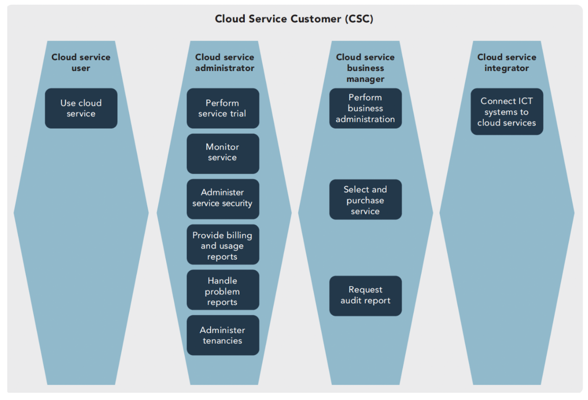
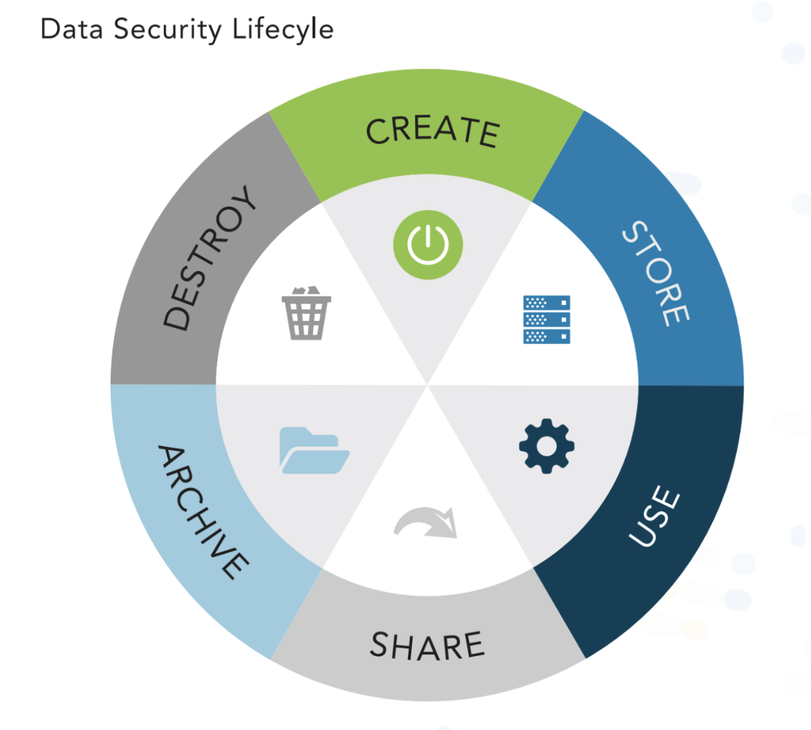

## 1.1 Understanding cloud computing concepts

**Cloud computing definitions**
* Delivering computing resource to a remote customer over a network
    * Building Servers in AWS
    * Using Gmail or Office 365
    * Runs in a massive data center owned by the Cloud Provider
* NIST Defintion as per [NIST SP 800-145](https://csrc.nist.gov/publications/detail/sp/800-145/final)
    * _A model for enabling ubiquitous, convenient, on-demand network access o a shared pool of configurable computing resources, for example, networks, servers, storage, applications, and services, that can be rapidly provisioned and released with minimal management effort or service provider interaction._
* Cloud Computing definitions as per **ISO/IEC 17788 - Cloud Computing - Overview and Vocabulary**
    * https://www.iso.org/standard/60544.html
    * **Cloud application**
        * an application that does not reside or run on a user's device but rather is accessible via a network
    * **Cloud application portability**
        * The ability to migrate a cloud application from one cloud provider to another
    * **Cloud computing**
        * Networking-accessbile platform that delivers services from a large and scalable pool of systems, rather than dedicated physical hardware and more static configurations
    * **Cloud data portability**
        * The ability to move data between cloud providers
    * **Cloud deployment model**
        * How cloud computing is delivered through a set of particular configurations and features of virtual resources. The clou deployment modeles are public, private, hybrid and community
    * **Cloud service**
        * Capabilities offered via a cloud provider and accessible via a client
    * **Cloud service category**
        * A group of cloud services that have a common set of features or qualities
    * **Community cloud**
        * A cloud services model where the tenants are limited to those that have a relationship together, with shared requirements, and are maintained or controlled by at least one member of the community.
    * **Data portability**
        * The ability to move data from one system or another without having to re-enter it
    * **Hybrid cloud**
        * A cloud services model that combines two other typese of cloud deployment models
    * **Infrastructure as a Service (IaaS)**
        * A cloud service category where infrastructure level services (such as processing, storage, and networking) are provided by a cloud service provider
    * **Measure service**
        * Cloud services are delivered and billed for in a metered way
    * **Multitenancy**
        * Having mulitple customers and applications running within the same environment, but in a way that they are isolated from each other and oftentimes not visible to each other, yet share the same resources
    * **On-demand self service**
        * A cloud customer can provision services in an automatic manner, when needed, with minimal involvement from the cloud provider
    * **Platform as a Service (PaaS)**
        * A cloud service category where platform services, such as Azure or AWS, are provided to the cloud customer, and the cloud provider is responsible for the system up to the level of the actual application
    * **Private cloud**
        * Cloud services model where the cloud is owned and controlled by a single entity for their own purposes
    * **Public cloud**
        * Cloud services model where the cloud is maintained and controlled by the cloud provider, but the services are available to any potential cloud customers
    * **Resource pooling**
        * The aggregation of resources allocated to cloud customers by the cloud provider
    * **Reversibility**
        * The ability of a cloud customer to remove all data and applications from a cloud provider and completely remove all data from their environment, along with the ability to move into a new environment with miniaml impact to operations
    * **Software as a Service (SaaS)**
        * A cloud service category in which a full application is provided to the cloud customer, and the cloud provider maintains responsibility for the entire infrastructure, platform, and application
    * **Tenant**
        * One or more cloud customers sharing access to a pool of resources        

**Cloud computing roles and responsibilities**
* As described in ISO/IEC 17788
* Cloud Service Customer (CSC)
    * Consumer of cloud computing resources/services from one or more CSPs
    * Sub-Roles:
        * Cloud service user
        * Cloud service administrator
        * Cloud service business manager
        * Cloud service integrator
* Cloud Service Provider (CSP)
    * Offers cloud computing services for sale to third parties
    * Responsible for building and maintaining the infrastructuring service offerings
    * Can also be a cloud customer if they off-load maintenance to other cloud service providers
        * i.e. AWS, GCP, Azure, Oracle, etc
    * Sub-Roles
        * Cloud Service Operation Manager
        * Cloud Service Deployment Manager
        * Cloud Service Manager
        * Cloud Service Business Manager
        * Customer support and care representative
        * Inter-cloud provider
        * Cloud service security and risk manager
        * Network provider
* Cloud Service Partner (CSN)
    * 3rd party companies that offer some product or service that interacts with the primary offerings of CSPs
        * i.e - SADA, Accenture, Tata, Avenade
    * Sub-Roles:
        * Cloud Service Developer
        * Cloud Auditor
        * Cloud Service Broker
* Cloud Service Broker (CSB)
    * entity that manages the use, performance and delivery of cloud services
    * negotiates relationships between cloud providers and cloud consumers 
    * Provides
        * Service Intermediation
            * Implementing some specific capability and providing value-add services to customers
        * Service aggregation
            * Combines/integrates services into one or more new services
        * Service arbitrage
            * broker has ability/flexibility to choose services from multiple agencies
* Cloud Service Auditor (CSA)
    * 3rd party that can conduct an independant assessment of cloud services, info sys operations, performance, and sec of the cloud implementation
* Cloud Access Security Broker (CASB)
    * Provides IAM Services
* Cloud Regulator
    * Create rules governing us of cloud computing
        * PCI DSS , GDPR
* Other Roles / Functions of Cloud Computing
    * Cloud Administrator
        * responsible for implementation, monitoring, and maintenance of the cloud
    * Cloud Application Architect
        * responsilble for adapting, porting, and deploying application
    * Cloud Architect
        * responsible for designs and develops solutions
    * Cloud Operator
        * Responsible for daily operational tasks
    * Cloud Data Architect
        * Manages data storage and data flow within, to and from the cloud
    * Cloud Service Manager
        * Repsonsible for bus agreements
        * pricing for the cloud customer
    * Cloud Storage Administrator
        * Manages storage volume/repository assignement and configuration
    * Cloud Service Business Manager
        * Oversees business and billing admin
    * Cloud Service Operations Manager
        * Prepares systems operations and support for the cloud, admin services
    * Managed Security Service Provider (MSSP)
        * Maintains the security environment for companies
        * may manage firewalls, IDPS, SIEM systems, and other security services and infra
        * may provide an outsourced security operations center (SOC) and incident response (IR)

**Cloud Computing Characteristics**
* On-Demand Self Service
    * customers should be able to scale their compute/storage resources without CSP involvement
    * providing agility in service delivery
    * Key game changer
    * Security challenges
        *  does not require procurement or approval from finance
* Broad Network Access
    * Services are consistently accessible over the network regardless of the users physical location
* Rapid Elasticity and Scalability
    * Elasticity
        * ability of a system to **automatically expand and contract rapidly**
        * Closely related to Scalability
        * Scale-in / Scale-out capacity on demand
    * Scalability
        * ability of a system to handle growth of users or work
        * Ability to grow as demand increases
    * Two types:
        * Horizontal
            * Adding more services to the pool to meet deman
            * More VMs, pods, etc
            * Load balancing plays a part in this mechanism to distribute load
        * Vertical
            * Adding more resources (CPU, RAM, Storage,etc) to exising resources (i.e. VMs)
* Resource Pooling
    * Allows CSPs to meet various demands from customers while remaining **financially viable**
    * Over provision resources to meet subscription demands of clients and set appropriate resourcing for each client as needed so resources are **not underutilized or overtaxed**
    * Enable CSP to make capital investments that greatly exceed what any single customer could provide on their own
    * part of scalability and elasticity
    * key in multi-tenancy
* Measured Service aka "metered service"
    * CSP measures and monitors the provisioning of services for billing, effectiveness use of resources, or overall predictive measures 
    * Customers are billed (per sec, per min, per hour) and pay on for what is consumed
    * customers can measure and set billing alerts
    * Common metrics CSP measure
        * number of minutes of vm compute time
        * amount of disk space you consume
        * number of function calls you make
        * amount of network egress and ingress
* Multi-Tenancy
    * Multiple customers share underlying computing resources (compute, storage, networking)
    * Physical servers that support workloads might be on the same phyiscal servers supporting other customers workloads
    * System and data isolation is key
        * Customers should never impact each other
        * Crucial security task
    * CSPs oversubscribe their total capacity mmeaning they can sell more capactity than they have
        * Sold capacity exceeds actual capacity
    * Resource pooling is a key component for multi-tenancy
    * If demand exceeds resource availablity this becomes a problem for the CSP

**Building Block Technologies**
* Compute Services
    * IaaS
    * Combines central processing units (CPU), memory and ephemeral storage capabilities using virtual machines (VMs)
    * customer installs applications
    * customer pays-per-use, charges are stopped when the instance is stopped or deleted
* Network Services
    * IaaS
    * Cloud networking is all virtualized to allow cutomers to design and customize to their needs
    * Enables customers to segment networks and restrict access to resources however they like
    * Phyiscal network components are virtualized into a Software-defined network (SDN)
        * Ex. Azure Vnets, AWS VPC, GCP VPC
    * Software-defined Network (SDN)
        * network architecture approach that enables the network to be intelligent and centrally controlled, or programmed, using software
        * Three layers
            * Management Plane
                * business applications that managed the underlying control plane are exposed with northbound interfaces
            * Control Plane
                * control of network funcitonality and programmability is made directly to devices at this layer
                    * OpenFlow was the original framework/protocol at the control plane currently managed by the [Open Networking Foundation (ONF)](https://opennetworking.org/sdn-definition/)
            * Data Plane
                * Network switches and routes located at this plane are associated with the underlying network infrastructure.
                    * Data forward happens here, so also known as the _Forwarding Plane_
        * 
        * 
* Storage Services
    * Varies by model IaaS, PaaS, SaaS
    * IaaS
        * Three types
            * Ephemeral
                * relevant for IaaS instances and exists only as long as the instance (VM) is up
            * Long-term (Persistent)
                * offered by some CSPs
                * tailored to the heads of data archiving
                * includes features like search, immutability, and data management lifecycle management
                * Types
                    * Volume (Block)
                        * Used by applications/vms to store data in fixed size blocks
                        * Ex: Azure Disk Storage, Amazon EBS, Perisitent Disk (GCP)
                    * Object
                        * Optimized storage for binary objects
                        * Ex: S3, Azure Blob, GCS
            * Raw
                * storage maps a logical unit number (LUN) on a storage area network (SAN) to a VM
                * Example
                    * File 
                        * similar functionality to traditional HD or network file share
                        * Ex: [GCP File Storage](https://cloud.google.com/filestore)
    * PaaS
        * Big Data
            * "BigData-as-a-Service"
            * Nonrelational (NoSQL) data, such as document, graph, column, or key-value
            * Ex:
                MongoDB, HBase, BigTable, Cassandra, BigQuery
            * Benefits
                * HA
                * Flexible data storage
        * Database
            * Usually multitenant relational and managed database services for SQL based systems
                * MySQL, PostgresSQL, MSSQL
    * SaaS
        * Content/file storage
            * file-based content stored with the application
        * Content delivery network (CDN)
            * where content is stored in object storage, then replicated to mulitple geographically distributed nodes to improve internet consumption speed
        * Information Storage and Management
            * Data entered into the system via web interface and stored within the SaaS application
            * Often utilizes databases wich in turn are installed on object or volume storage
    * Storage Consistency
        * fundamental concept that describes the time it takes for all data copies to be the same
        * Strict Consistency
            * ensures that all copies of the data have been duplicated among all relevant copies before finalizing the transaction to increase availability
        * Eventual Consistency
            * consistency of data is relaxed
            * reduces the number of replicas that must be accessed during r/w operations before transaction is finalized
            * data copies are async propagation over the network
* Databases
    * Mulitple options/flavors available relational (SQL) and non-relational (NoSQL)
    * Managed Database Dervices (PaaS)
        * options shift infrastructure to CSP
    * IaaS (VM) hosted databases are an option where PaaS is not possible or practicel
    * Ex: Azure DB for MSSSQL, RDS, Cloud SQL
* Cloud Orchestration
    * creates automation workflows for managing cloud environments
    * builds on the foundation of IaC reducing manaula admin tasks
    * may be a script, function, runbook, or developed in an external workflow engine
    * CSPs operationalize process responsible for recieving, fullfilling, managing, monitoring, and metering customer services (Cloud Operation System)
        * Exposing APIs/ CLIs
        * Allows customers to access info or make requests for services
* Virtualization (Virtual Assets)
    * Include
        * Virtual machines (VM)
        * Virtual Desktop Infrastructure (VDI)
            * Provides network-based access to a desktop computing environment
            * Pre-defined images is typically used
        * Software-Defined Networks (SDN)
        * Virtual Storage Area Networks (SAN)
        * Applicaiton Virtualization
            * Stream applications to the users desktops
            * Citrix XenApp, VMWare Thin App, Microsoft App-V
    * Started in the 80s-90s
        * move from mainframe to client-server world
    * Hypervisors
        * the primary component that manages virtual assets
        * Host machines provide services to the several virtualized guest machines 
        * 
       
        * Types of Hypervisors
            * 
            * Type 1 - Bare Metal
                * Most commonn in Data Centers
                * hypervisor runs directly on top of the hardware and then hosts guest OS on top of that
                 * Technologies
                    * VMWare ESXi
                    * Windows Hyper-V
                * Reduced attack surface
                * More expensive than type-2
            * Type 2 - Hosted
                * common for personal computers
                * physical machine runs a program on top of the os
                * Inscrease attack surface due to the host OS
                * less expensive vs type-1
                * Technologies
                    * Virtual Box / Parallels
                    * VMware Workstation
        * Security concerns around machine isolation
            * physical server environment sec teams know each server runs on its own dedicated processor and memorey resources
                * if an attacker manages to compromise the machine they won't have access to the processor and memory used by other systems
                * virtualized environment this may not be the case, an attack may be able can access to other guest os if one is compromise also the underlying host machine also
            * VM Sprawl, leads to unused and unmaintained servers 

**Generic CSP Architecture**
* 

**Key Drivers for Cloud Computing**
* Shift from Captial Expenditures (CapEx), where organizations had to invest large sums of money, to Operational Expenditures (OpEx), which now enables companies to pay per use and avail themselves of pricing structures similar to monthly or quarterly leasing agreements.
* Additional drivers include
    * Scalability / Elasticity
    * Cost
    * Mobility
    * Collaboration
    * Risk Reduction

## 1.2 Describe cloud reference architecture

**Acroynims**
* NIST = National Institute of Standards and Technology
* ISO = Intenational Organization for Standardization
* IEC = International Electrotechnical Commission

**Architectures and Frameworks**
* Two reference architectures widely used are:
    * [NIST Special Publication (SP) 500-292 - Cloud Computing Reference Architecture and Taxonomy](https://nvlpubs.nist.gov/nistpubs/Legacy/SP/nistspecialpublication500-292.pdf)
    * Guiding principles used to create the ref architecture were:
        * Develope a vendor-neutral architecture that is consistent with the NIST definition
        * Develop a solution that does not stifle innovation by defining a prescribed technical solution
        * NIST Reference Model
    
        * Defines Five Major Actors
            * Cloud user/customer
                * User access either paid-for or free cloud services and resources within a cloud
                * Granted system admin privileges to the instances they start and only those
            * Cloud Provider
                * Company that provides cloud-based platform services (infra, compute, storage, etc) usually for a fee
            * Cloud Auditor
                * 3rd Party that conducts independent assessments of cloud services, info system operations, performance and security of the cloud implementation
            * Cloud Carrier
                * an intermediary providing connectivity and transport of cloud services between consumer and provider
            * Cloud Service Brokers (CSB)
                * 3rd party entity / company that looks to extend values to mulitple customers of cloud-based services through relationships with multi-cloud providers
                * Ex: SADA
                * Provides
                    * Service Intermediation
                        * Implementing some specific capability and providing value-add services to customers
                    * Service aggregation
                        * Combines/integrates services into one or more new services
                    * Service arbitrage
                        * broker has ability/flexibility to choose services from multiple agencies
    * [ISO/IEC 17789 Cloud Computing Reference Architecture (CCRA)](https://standards.iso.org/ittf/PubliclyAvailableStandards/c060545_ISO_IEC_17789_2014.zip)
        * Reference Model - Functional Layers
            * roles are divided into sub-roles and are associated with activites
            * 
        * Published in 2014 and is still current
        * Describes cloud computing systems from four distinct viewpoints
            * User View
                * System context, the parties, the roles, the sub-roles, and the cloud computing activities
                * "Within scope" of CCRA
            * Functional View
                * Functions necessary for the support of the computing activities
                * "Within scope" of CCRA
            * Implementation View
                * Functions necessary for the implementation of a cloud service within the service within service parts and/or infrastructure parts
                * Specific to tech and vendor-specfic implementation
                * Considered "out-of-scope" for CCRA
            * Deployment View
                * How functions of a cloud service are technically implemented within already existing infrastructure or within new elements to be introduced in this infrastructure
                * Specific to tech/vendor specific implementations
                * Considered "out of scope" for CCRA
        * Cloud Components Viewpoints Flow
            * 
            * User View to Functional View
                * 
            * Relationships of the Architecture Framework
                * Relationships between roles, sub-roles, activities, and function components
                    * 
                
    * NIST vs ISO/IEC
        * 
    

        
**Cloud Computing Activities (ISO/IEC 17788)**
* Fall into three (3) groups:
    * Activities that **use** services
        * Cloud Service Consumer (CSC)
            * Definition:
                * 3rd party that is in a business relationship for the purpose of consuming cloud services   
            * 
            * Activities:
                * **Cloud service user**
                    * Use cloud services (create accounts and resources)
                    * Perform trial (poc)
                * **Cloud service administrator**
                    * Monitor services (validate SLAs)
                    * Admin security (manages policies, organize data, audit)
                    * Provide billing usage reports
                    * Handles problems (asseses impact, troubleshoot, remedy)
                * **Cloud service business manager**
                    * oversees business and billing administration
                    * purchases the cloud services, and requests audit reports as necessary
                * **Cloud service integrator**
                    * connects and integrates existing systems and services to the cloud
    * Activities that **provide** services 
        * Cloud Service Provider (CSP)
            * Definition:
                * a 3rd party that provides cloud services for consumers
            * 
            * Activities:
                * **Cloud service operations manager**
                    * prepares systems for the cloud, administers services, monitors services, provides audit data when requested or required, and manages inventory and assets
                * **Cloud services deployment manager**
                    * gathers metrics on cloud services, manages deployment steps and processes, and defines the environment and processes
                * **Cloud services manager**
                    * Delivers, provisions, and manages the cloud services
                * **Cloud service business manager**
                    * Oversees business plan and customer relationships as well as processes financial transactions
                * **Customer support and care representative**
                    * provides customer service and responds to customer requests
                * **Inter-cloud provider**
                    * Responsible for peering with other cloud services and providers as well as overseeing and managing federations and federated services
                * **Network provider**
                    * Responsible for network connectivity, network services delivery, and management of network services
                * **Cloud service security and risk manager**
                    * manage security and risks, design and implement service continutiy, ensure compliance
    * Activities that **support** services
        * Cloud Service Partner (CSN)
            * Definition:
                * a 3rd party that is engaged in support of, or auxilliary to, activites of either the CSP, the CSC or both. 
        * NIST Cloud Service Broker and Cloud Auditor fall under this role
        * 
        * Activities:
            * **Cloud service developer**
                * design, create, maintain service components, compose and test services
            * **Cloud auditor** 
                * perfom audits, report results
            * **Cloud service broker** 
                * acquire and assess customers, assess marketplace, create legal agreements and contracts

**Cloud Service Capabilities Types (ISO/IEC 17788)**
* Infrastructure service capability
    * Where the CSC can provision and use the compute, storage, or networing resources of the CSP
    * CapEx on-premis but OpEx in the cloud
* Platform service capability
    * Where the CSC can deploy, manage, and run their own applications using one or more programming languages and one or more execution environments supported by the CSP
    * allows choice and reducing venor lock-in
* Software service capability
    * Where the CSC uses the CSP's provided applications with minimal user configuration options allowed
    * also known as Application

**ISO/IEC 17788 Cloud Service Categories**

* Infrastructure as a Service (IaaS)
    * Capabilities type provided by the CSP to the customer where they can provision and use processing, storage, and networking resources 
    * CSP manages staff, HW and datacenter
    * Definition as per NIST SP 800-145:
        * _The capability provided to the consumer is to provision processing, storage, networks, and other fundamental computing resources where consumer is able to deploy and run arbitrary software, which can include operating systems and applications. The consumer does not manage or control the underlying cloud infrastructure but has control over operating systems, storage, and deployed applications; and possibly limited control of selected networking components (e.g., host firewalls)._
    * Benefits
        * Scalability
        * Converged Network → provide services without regard to network boundaries
        * On-demand self-service
        * Resilience and HA
        * Measured/metered use
        * Reduced TCO, engergy and cooling costs
* Platform as a Service (PaaS)
    * Platform capability type
    * Customer can deploy, manage and run their create/acquired applications using one or more programming languages and multiple execution environments
    * Customer is responsible for deployment and management of apps
    * CSP manages provisioning, configuration, hardward, and OS
    * Definition as per NIST SP 800-145:
        * _The capability provided to the customer is to deploy onto the cloud infrastructure consumer-created or acquired applications created using programming languages, libraries, services, and tools supported by the provider. The consumer does not manage or control the underlying cloud infrastructure, including network, servers, operating systems, or storage, but has control over the deployed applications and possibly configuration settings for the application-hosting environment._
    * Benefits
        * Support for multiple languages and frameworks
        * Multi hosting environments
        * Choice of environments
        * Flexibility
        * Autoscaling through configuration
        * Technology isnt crossing borders, it's cloud based
        * Cost redunction
        * Core infra managed by CSP
    * Serverless
        * type of PaaS
        * typically known as Functions-as-a-Service (FaaS)
        * less control over the environment
        * Application scales automatically
        * application code only executes when invoked
        * ex: Cloud Run, Cloud Functions, etc
        * stateless and uses ephemeral storage
* Software as a Service (SaaS)
    * Application capability type
    * Customer uses CSP provided applications: (Gmail, Workspace, Office 365, etc)
    * Definition as per NIST SP 800-145:
        * _The capability provided to the customer is to use the provider's applications running in a cloud infrastructure. The applications are accessible from various client devices through either a thin client interface, such as a web browser (e.g., web-based email), or a program interface. The consumer does not manage or control the underlying cloud infrastructure, including network, servers, operating systems, storage, or even individual application capabilities, with the possible exception of limited user-specific application settings._
    * Benefits
        * Cost Reduction
        * Reduce the need for hardware and servers
        * Software and application licensing
        * Move to more OpEx vs CapEx
        * Reduced support costs
        * Ease of use
        * Management is handled by CSP
        * On-demand
        * Costs associated with supporting virtualized servers and hardware is now on the CSP
* IaaS, PaaS, SaaS are the most common
* Emergine Cloud Services Categories:
    * Communications as a Service (CaaS)
        * Capability provided to customer for real time interaction and collaboration
    * Compute as a Service (CompaaS/CaaS)
        * allows for the execution of compute-intensive workloads to be performed in the cloud. 
        * Code can be executed in a serverless environment where the customer only pays for the computing time and cycles they consume, without the need for setting up server instances or environments.
    * Storage as a Service (STaaS)
        * cloud service where the provider offers storage space and solutions on a subscription service. Cloud customers incur costs based on the amount of storage that is consumed or reserved.
    * Network as a Service (NaaS)
        * Cloud-based virtual network where customers can quickly and easily change network configurations via software versus the traditional need for cabling and hardware appliances.
    * Database as a Service (DBaaS)
        * subscription service where the database is installed, configured, secured, and maintained by the cloud provider, with the cloud customer only responsible for loading their schema and data.
    * Desktop as a Service (DaaS)
        * cloud-based equivalent of a traditional virtual desktop interface (VDI) that is hosted and managed by a cloud provider rather than on hardware owned by the customer.
    * Identity as a Service (IDaaS)
        * subscription-based service for identity and access management (IAM) and single sign-on (SSO) that is offered over the Internet versus deployed by the customer.
    * Security as a Service (SECaaS)
        * enables companies to contract with an external vendor to supply and manage their security operations for such technologies as intrusion detection systems (IDSs), intrusion prevention systems (IPSs), data loss prevention (DLP), and antivirus implementations.

**Cloud Deployment Models**
* Criteria for selecting a deployment model
    * Risk appetite
    * Cost
    * Compliance and regulation requirements
    * Legal obligations
    * Business strategy
* Models
    * Private
        * NIST SP 800-145 Definition
            * _The cloud infrastructure is provisioned for exclusive use by a single organization comprising multiple consumers (e.g., business units). It may be owned, managed, and operated by the organization, a third party, or some combination of them, and it may exist on or off premises._
        * Cloud Infra **provisioned for use by a single orgnaization**
            * May consist of multiple internal consumers
            * May be owned, managed, and operated by:
                * the single org
                * 3rd party
                * combo of the two
            * May exist on or off the premises of the organization
        * Benefits
            * Increase control over data, systems and applications
            * Ownership and retention of governance controls
            * Assurance of data location
            * Commonly used by large complex orgs with legacy systems and heavily customized environments
            * Has significant tech investment and financially viable to stay 
        * Most often used in large environments with compliance or reg requirements
    * Public
        * Cloud Infra **provisioned for use by anyone** who is a customer. Exists on the premises and hardware of the CSP
            * AWS, Azure, Google
        * NIST SP 800-145 Definition
            * _The cloud infrastructure is provisioned for open use by the general public. It may be owned, managed, and operated by a business, acedemic, or government organization, or some combination of them. It exists on the premises of the cloud provider._
        * Benefits
            * easy/inexpensive to setup because hardware, application, bandwidth is covered by provider
            * Streamlined for provisioning resources
            * Scalability to meet customer demands
            * Pay per use (Pay as you go)
            * Virtual Private Cloud (VPC) is not a NIST definition but is part of public cloud lore that segregates infrastructure from the broader cloud environment for use exclusive to a single customer
    * Community
        * Cloud Infra provisioned for use by a specific community of consumers that have shared conserns (mission, security requirements, policy, compliance, etc)
        * Universities sharing infra
        * similar to private clouds
        * NIST SP 800-145 Definition:
            * _The cloud infrastructure is provisioned for exclusive use by a specific community of consumers from organizations that have shared concerns (e.g., mission, security requirements, policy, and compliance considerations). It may be owned, managed, and operated by one or more of the organizations in the community, a third party, or some combination of them, and may exist on or off premises._
        * Benefits
            * Shared costs
            * Shared sec and compliance
    * Hybrid
        * Combining multiple forms of deployment models (public and private)
        * Common is primary on-prem and dr in public cloud (AWS,GCP,etc)
        * NIST SP 800-145 definition
            * _The cloud infrastructure is a composition of two or more distinct cloud infrastructures (private, community, or public) that remain unique entities, but are bound together by standardized or proprietary technology that enables data and application portability (e.g., cloud bursting for load balancing between clouds)._
        * Key drivers
            * retain ownership and oversight of critical task and processes
            * resusing previous investments in tech
            * Controlling most critical business components and systems
            * Cost-effectively fulfilling noncritical business functions using public cloud components
            * bursting into cloud / split systems for optimization
            * disaster recovery
    * Multi Cloud
        * Using cloud services from multi cloud providers instead of a single 
        * Variation of hybrid
        * Newer term and not in reference architectures

**Cloud Shared Considerations**
* Cloud Computing Shared Responsibility Model
    * Security is shared in the Cloud
        * CSPs are responsible for security of the cloud
        * Cloud Customers are responsible for security in the cloud
    * _Of-the-cloud security_
        * describes the task of protecting the cloud infra
        * Physical and logical protection of hardware, software, networking and facilities that run cloud services
    * _In-the-cloud security_ 
        * responsibilities dictated by the specific cloud services consumer by customers. service/configuration management, guest os management (patching/updating), app software updates, etc
    * 
* Considerations
    * Auditability
        * Ability to provide clear documentation of the actions in a data event
        * Ability to audit
            * Make sure CSP have results for audits of their systems / platforms
        * Related Activities
            * Accountability
                * determine who caused the event
            * Traceability
                * track down all events
    * Availability
        * Single point of failure for cloud based services
        * In many cases CSPs are required to provide upwards of approx 99% availability per Service-level agreements (SLA)
        * Failure to do so could lead to penalties, reimbursement fees, loss of customers, etc
    * Compliance
        * Requirements to adhere to applicable laws, regulations, guidelines and specifications
            * Payment Card Information Data Security Standard (PCI DSS)
                * Failure to comply may cause substantial fines
                * 
                * Guidelines for certification
                    * https://listings.pcisecuritystandards.org/pdfs/PCI_SSC_Cloud_Guidelines_v3.pdf
                    * https://listings.pcisecuritystandards.org/documents/PCI_DSS-QRG-v3_2_1.pdf
                * Listing of certified providers
                    * https://www.visa.com/splisting/searchGrsp.do?companyNameCriteria=stripe
            * Health Insurance Portability and Accountability Act (HIPAA)
            * Federal Information Security Management Act (FISMA)
                * Requires fed agencies to implement a mandatory set of process and system controls designed to ensure the confidentiality, integrity, and availability of system-related information
            * Sarbanes-Oxley Act (SOX)
                * Fed law that mandates certain practices in fin record keeping and reporting for corporations
                * Fraud
    * Governance
        * Definitions of actions, assigning responsibilities and verifying performance
        * CSP often have policy automation in which restrictions can be defined and automatically enforced through the service lifecycle
    * Interoperability
        * Components of cloud ecosystems must work together to achieve intended result
        * Five facets
            * Policy
                * ability of two or more systems to interoperate while complying with gov laws, regs, and org mandates
            * Behavioral
                * results of use of exchanged information matches the expected outcome
            * Transport
                * common communication between each
                * HTTP/s, messaging queue, etc
            * Synctatic
                * systems undertsand each other while exchanging information 
                * JSON/XML
            * Semantic data
                * systems understand each others data model
    * Maintenance / Versioning
        * Maintenance → Changes/fixes/updates/upgrades to cloud services
        * Versioning
            * labeling of services for a particular version in use
    * Performance
        * Proper design for elasticity and speed
    * Portability
        * Ability to move between CSPs
        * Cloud Data Portability
            * ability to easily move data from one csp to another without the need to re-enter the data
        * Cloud application 
            * ability to migrate application from one csp to another or between environments
        * prevents vendor lock-in
        * 3 facets
            * Syntactic
                * data transfered from source to dest using formats that are easily decoded (XML, Open Virtualization Format (OVF))
            * Semantic
                * data model is understood on target system
            * Policy
                * governed by laws, regs, and mandates
    * Privacy
        * Data at Rest, Data In Transit, and Data In Use
        * Protection of PII data, etc
        * Cloud is a prominent source of privacy concerns
    * Regulatory
        * Close to governance
        * need to adhere to reg laws
    * Resiliency
        * ability of a system to provide and maintain an acceptable level of service during a system fault
    * Reversibility
        * Tied to portability
        * CSC ability to retrieve all data from CSP and delete data and contractually derived data after a period of time
    * Security
        * 60% of business users state that security concerns are the number one restriction or barrier preventing them from engaging with cloud services
        * Sec controls in place, techniques applied
        * Should be in any contracts/agreements
    *  Service Levels and Service-Level Agreements (SLAs)
        * Characterizes quality of cloud services delivered in terms of measurable properties to cloud computing (business and technical) and a given set of cloud computing roles (CSC, CSP, and related sub-roles)
        * Stipulates performance expectations such as max downtime and often includes penalties if the vendor doesnt meet expectations
        * Operating Level Agreements (OLAs), Privacy Level Agreements (PLAs)
    * Outsourcing
        * 
        * important to understand supply chain for any service so potential cloud-related issues can be identified.

**Impact of related technologies**  
* Blockchain
    * **distributed, public ledger** that can be used to store financial, medical, or other transactions (free to join and participate)
    * Does not use intermediaries such as banks and fin institutions
    * Data is "chained together" with a block of data holding both the hash for that block and the hash of the preceding block
    * To create a new block on the chain, the computer that wishes to add the block solves a cryptographic puzzle and sends the solution to the other computers participating in that blockchain
        * known as Proof of work
    * Used in crypto
    * Benefits
        * Increase security due to decentralized nature with no single point of failure
        * Proof of work consensus → verifies each transaction across of nodes using hashing to auth and validate trnx
        * Immutable ledger
        * Use of time-stamped transaction verification across entire ledger, eliminates fraud
        * Ability to use fractional ownership and tokenization of assets
        * 
* Data Science
    * Analysis of data in different forms to draw insights or develop useful information from it.
    * Cybersecurity Data Science (CSDS)
        * practice of applying DS to prevent, detect, and remediate cybersecurity threats
        * SIEM tools uses as part of this
* Artificial Intelligence (AI) / Machine Learning (ML)
    * AI → tech that emulates human behavior or interactions
    * ML → often considered a branch of AI science, method used to create intelligent products / services
        * Trains automated systems by using computer programs and "seeded" data to begin system optimization
    * Deep Learning
        * subfield of ML concerned with algorithims inspired by the structure and function of the brain called **artificial neural networks**
* Internet of Things (IoT)
    * Embedded sensor, devices, that interact/connect with upstreams controls/devices
    * Small-form factor, low-power appliances
    * Can support AI / ML on the device
    * Highly distributed and connected
* Containers
    * Software packages that container all necessary code, libs and dependencies to make it run
    * lightweight
    * shares many concerns of server virtualization
* Quantum Computing
    * RapidlyEmerging tech
    * Uses quantum states and qubits to perform calculations
    * Normal binary digits are either 0 or 1, a qubit can be a 0, 1 or in a superposition in both states
    * Currently limited 
    * Concerns around using it to more efficiently solve certain math problems in traditional crypto mechanism, making some weaker
        * Primarily those that involve the specific algos the use factoring or large prime numbers
    * Types:
        * Quantum Cryptography
            * harness the principles of quantum mechanics to improve security and detect whether a third party is eavesdropping on comms
            * leverages fundamental laws of physics suchs as the observer effect, which states that it is impossible to identify the location of a particle without changing that particle
        * Quantum Key Distribution
            * common quantum crypto
            * transfering darta using photons of light instead of bits, confidential key transferred between two parties cannot be copied or intercepted secretly
        * Post-Quantum Cryptography
            * refers to the cryptography algorithms (usually pub-key algos) that are thought to be secure against an attack by a quantum computer
            * focuses on preparing for the era of quantum computing by updating existing math-base algos and standards
            * "quantum-resistent" crypto
* Edge Computing
    * Bring computing closer to data sources or service requestors
    * Ex.:
        * Content Delivery Network (CDN)
        * IoT Devices
* Fog Computing
    * compliements cloud computing by processing data from IoT devices
    * often places gateway devices in the field to collect and correlate data centrally at the edge
    * bring computing nearer to the sensor
* Confidential Computing
    * Isolates sensitive data in a protected CPU enclave during processing
    * Trusted Execution Environment (TEE)
* DevSecOps
    * stands for development, security, and operations. It's an approach to culture, automation, and platform design that integrates security as a shared responsibility throughout the entire IT lifecycle.
    * integrates sec as a shared responsibility throughout the entire IT lifecycle
    * builds a secure foundation into devops
    * includes automation of the security gates
* Infrastructure-as-Code (IaC)
    * management of cloud infra described as code
    * key DevOps practice and is used in conjunction with Continuous Integration and Continous Delivery (CI/CD)
* Mobile Device Management (MDM)
    * an encompassing term for a suite of policies, technologies, and infrastructure that enables an organization to manage and secure mobile devices that are granted access to its data across a homogenous environment.
    * allows for "bring you own device" (BYOD) for users and the granting of access to coorporate data, such as internal networks, applications, and especially e-mail.
**NOTE**:
* IaC, CI/CD, and DevOps are standard elements of deployment, change, and release in the cloud. DevSecOps is quickly growing in popularity.

## 1.3 Understand security concepts relevant to cloud computing

Core concept of Information Security known as the _The CIA_ triad, which has three major goals

/images/cia-triad.jpg)

* Confidentiality
    * Refers to the organizations efforts to protect and control access to information / data to prevent unauthorized disclosure
* Integrity
    * Refers to the organizations efforts to protect information / data from any unauthorized changes in transit and at rest.
* Availability
    * Refers to the organizations efforts to make sure data and systems are available for authorized use.

**Cryptography and Key Management**
* Concepts
    * Cryptography
        * refers to secure information and communication techniques derived from mathematical concepts and a set of rule-based calculations called algorithms, to transform messages in ways that are hard to decipher.
    * Trusted Platform Module (TPM)
        * chip that resides on the motherboard of the device
        * multi-purpose, like storage and management of keys used for full disk encryption (FDE) solutions
        * Provides the OS with access to keys but prevents drive removal and data access
    * Hardware Security Module (HSM)
        * physical computing device that safeguards and manages digital keys, performs encryption and decryption functions for digital signatures, strong authentication and other cryptographic functions
        * like TPM but often removable or external devices even cloud based (GCP Cloud HSM)
* Encryption Key Management Lifecycle
    * 
    1. Generation
        * keys should be generated within a trusted, secure cryptographic module
        * FIPS 140-2 validated modules provide tamper resistence and key integrity
    2. Distribution
        * should be distributed securely to prevent theft/compromise during transit
        * best practice to encrypt with a seperate key while distributing to other parties
    3. Storage
        * must be protected at rest and should never be stored in plaintext
        * includes keys in volatile and persistent memory
    4. Use
        * Clients (users + trusted devices) will use keys for resource access as access controls allow
        * Acceptible Use Policy (AUP) sets guardrails for data usage
    5. Revocation
        * process for revoking access at separation, policy breach, device or key compromise
        * Ex: in PKI you would revoke the certificate on the issuing Certificate Authority (CA)
    6. Destruction
        * key destruction is the removal of an encryption key form its operational location
        * key destruction goes further and removes any info that could be used to reconstruct that key
        * MDM systems removes certificates from a device during device wipe or retirement
* Other key management terms/concepts
    * Level of Protection
        * encryption keys must be **secured at the same level** of control or higher as the data they protect
        * sensitivity of the data dictates the level of protection (data sec policies)
    * Key Recovery
        * recover a key for a particular user without that user's cooperation (termination or key loss)
    * Key Escrow
        * keys are held by a trusted 3rd party in a secure enviroment, which can aid in many of the other areas of key managment
* Key Management Systems (KMS)
    * centrallized secure location (offered by CSPs) which provides access and storage for application secrets called a vault
    * secret is anything you want to control access to such as API key, password, certs, tokens or keys
    * provides programmatical access via API to support devops
    * access control at vault instance-level and to secrets stored within
    * protected by either software or FIPS 140-2 Level 2 validated HSM
    * Examples
        * Azure Key Vault
        * GCP Secret Manager
        * GCP Cloud KMS
        * AWS KMS

**Identity and Access Control**
* Provisioning and Deprovisioning
    * standardize, streamline, and develop an efficient account creation process
    * timely deprovisioning eliminates access sprawl
* Centralized directory services
    * Active Directory and LDAP
    * Kerberos and NTLM authentication
* Privileged user management
    * managing privileged access accounts
    * enforce Least Privilege and Need-To-Know
        * standard IT security principles
        * limit access to data/systems for only what they users require
        * helps prevent security incidents
        * helps limit the scope of incidents when they occur
    * seperation of duties can provide effective risk mitigation
* Authentication and access management
    * focused on the manner in which users can access required resources
    * Multi-factor Authentication
        * Concepts
            * Something you **know** (pin or password)
            * Something you **have** (hardware/software token, trusted device)
            * Somethiing you **are** (biometric)
        * Prevents
            * Phishing
            * Spear phishing
            * Keyloggers
            * Credential stuffing
            * Brute force and reverse brute force attacks
            * Man-in-the-middle (MITIM) attacks
* Prevent Fraud and Collusion
    * **Collusion** is an agreement amoung multiple persons to perform some unauthorized or illgal actions
    * Seperation of duties
        * basic sec principle that ensures that no single person can control all the elements of a critical function or system
    * Job rotation
        * employees are rotated into different jobs, or tasks are assigned to different employees
* Account Types
    * Service Account 
        * aka _Service Principal_
        * type of administrator account used to run an account
        * may require privilege access to run
    * Shared Account
        * used when a group of people perform the same duties, such as members of a customer service, they can use a _shared account_
        * when user-level monitoring, auditing, or non-repudiation are required, you must eliminate the use of shared account
* Priveleged Access Management
    * solution that helps protect the privileged accounts within a tenant, preventing attacks
    * provides visibility into who is using privileged accounts and what they are using it for   
    * may provide Just-in-time elevation feature to provide access  

**Data and Media Sanitization**
* [NIST Special Publication (SP) 800-88](https://csrc.nist.gov/publications/detail/sp/800-88/rev-1/final)
    * Guidelines for secure media sanitization
        * Includes these different activities
            * Simply writing new data to the device
            * Clearing is effective against most types of causal analysis
            * Purging wiping
            * Destroying media is the ultimate protection
    * 
* Less secure data destruction
    * Erasing
        * performing a delete op against a file, files, or media
    * Clearing (overwriting)
        * prep media for reuse and ensuring data cannot be recorded using traditional recovery tools
        * may use random data or zeros, one or multiple processes
    * Purging
        * more intense form of clearing that prepares media for reuse in less secure environments
    * Media is reusable with any of these methods, data may be recoverable with forensic tools
* More secure data destruction
    * Crypto-shredding
        * cryptographic erasure
            1. Data is encrypted with a strong encryption engine
            2. keys used to encrypt the data are then using a different encryption engine
            3. keys from the second round of encryption are destroyed
        * PRO --> data cannot be recovered
        * CON --> High CPU and performance overhead
    * Destroyig Media Data
        * **Degausing**
            * use of magnets to erase data on media and destroy electronics
        * **Shredding**
            * shred using a metal shredder into powder
        * **Pulverizing**
            * use hammer and smash drive into pieces or drill
        * Media is no longer reusable with any of these methods
        * Data is also NOT recoverable

**Network Security**
* Network Security Groups (Firewall)
    * provide additional layer of security for cloud resources
    * act as a virtual firwall for virtual networks and resource instances
    * uses security rules list (ip and port ranges) that allow or deny network traffic to one or more resource instances for security posture
    * Ex: AWS Security Groups, GCP Firwall, 
* Segmentation
    * Restricting services that are permitted to access or be accessible from other zones using rules to control in/out bound traffic.
    * Rules are enforced by the IP address range of each subnet
    * Within a virtual network, segmentation can be used to achieve isolation
        * Port filtering through a network security group
* API inspection and integration
    * Representational State Transfer (REST) is the modern approach to writing web service APIs
    * Enables multi-language support, can hanlde multiple types of calls, return different data formats
    * APIs published by an organization should include encryption, authentication, rate limiting, throttling, and quotas
    * Ex: API Gateway (AWS), API Management (Azure), Apigee (GCP)
* Traffic Inspection
    * packet capture requires tools desgined for this purpose
    * CSPs offer tools to facilitate packet capture within a customer tenant
    * ex: Azure Network Watcher, AWS VPC Traffic Mirroring, GCP Packet Mirroring
* Geofencing
    * Uses the Global Positioning System (GPS) or RFID to define geographicla boundaries
    * Once the device is taken past the define boundaries, the sec team will be alerted.
    * Identifies unusual traffic patterns and prevents misuse
    * Ex: 
        * Restrict access to systems and services based on where the access attempt is being generated from
        * Prevent devices from being removed from the company's premises
* Zero Trust Security
    * No entity is trusted by default
    * Addresses the limitation of the legacy network perimeter-based security model
    * Treats use identity as the control plane
    * Assumes compromise / breach in verifying every request
    * Principles
        * Verify explicity
            * AuthZ/AuthN based on all available data points (location, device health, service or workload, data classification)
        * Use least privilege access
            * limit user access with Just-In-Time (JIT) access and Just-Enough-Access (JEA)
            * risk-based adaptive policies
            * data protection
        * Assume breach
            * segment access to minimize scope of impact
            * verify E2E encryption, use analytics to get vis
            * drive threat detection, improve defenses
    * Architectures
        * Network Security Group (NSG)
        * Network Firewalls
        * Inbound / Outbound traffic filtering
        * Inbound / Outbound traffic inspection
        * Centrallized security policy managemetn and enforcement

**Virtualization Security**
* Container Security
    
    * Shares many concerns of service virtualization, but must enforce **isolation** of network, data, storage access at the container-level
    * Best Practices: https://docs.docker.com/develop/security-best-practices/
    * Leverage managed k8s offering from CSP
        * GKE, AKS, EKS
* Serverless Technology
    * Use API Gateways as security buffers (to avoid DDoS attacks)
    * Configure secure authN (Oauth, SAML, OpenID Connect, MFA)
    * Seperate dev and prod environments
    * Implement least privilege
* Ephemeral Computing
    * use as a need rises
    * destroy environment once needs are met and resources are no longer required
* Type 1 Hypervisors
    * tied to the underlying hardware and hosts virtual machines on top of it, and it operates as the sole layer between the hardware (bare metal) and host (virtual servers) layer. 
    * A common example would be VMware ESXI.
    * security can be maintained with a very high degree of confidence
    * more difficult to exploit
    * vendor controls upgrades and patches
* Type 2 Hypervisors
    * software based, it resides on the host system itself and then orchestrates the hosts under its purview. 
    * In this case, the hypervisor is not tied directly to the bare-metal infrastructure and instead runs within an operating system as software. A common example would be VMware Workstation.
    * more vulnerable to any potential flaws and software exploits that can strike the underlying OS, which could then be used to launch attacks against the hypervisor.
    * security is not as tight as Type 1
    * patching / upgrading and vigilance of the underlying OS is key

**Common Threats**
* "Top threats to Cloud Computing: The Egregious 11" (https://cloudsecurityalliance.org/group/top-threats/).
    * Data Breaches
        * result of a cyberattack
        * when sensitive data is stolent, includes Personally Indetifiable Information (PII)/Protected Health Information (PHI)
        * due to poor application or database security design or configuration, whereby data is exposed without proper authorization
        * also includes data loss ("data leaks")
            * often due to a system or service misconfiguration or oversharing
        * Applies to IaaS, PaaS, and SaaS models
        * Prevention
            * following secure development practices and adhering to recommendations in the secure data lifecycle
    * Misconfiguration and inadequate change control
        * systems not properly setup to enforce security policies and best practices
        * Applies to IaaS, PaaS, and SaaS models
    * Lack of cloud security architecture and strategy
        * misguided notion of "lift and shift" effectively re-creating network segements and implementing the same type of sec controls that they have within their own data centers.
        * no effective approach to cloud security architectures
        * physical barriers do not exist in the cloud
        * Applies to IaaS, and PaaS models
    * Insufficient identity, credential, access, and key management
        * key rotation is not set up
        * poor password complexity and strength
        * no MFA
        * use of certificates
        * make sure credentials are NOT stored in public code repos (such as Github)
        * Applies to IaaS, PaaS, and SaaS models
    * Account hijacking
        * attack designed to steal or wedge themselves into the middle of a conversation in order to gain control
            * i.e Man-in-the-Middle attack
        * attacker gains access through either exploiting system, that can eavesdrop or capture traffic or use it to attack other systems in the cloud or the underlying cloud infrastructure.
        * Use of MFA and strong account provisioning controls and access requirements can minimize the risk
        * Applies to IaaS, PaaS, and SaaS models
    * Insider threat
        * disgruntled employees can wreak havoc on a system
        * internal acts of disruption include theft and sabotage
        * Applies to IaaS, PaaS, and SaaS models
    * Insecure interfaces and APIs
        * Targets for DDoS attacks
        * Security mechanisms include API gateway, authN/authZ, IP filtering, throttling, quotas, data validation
        * ensure secure storage, distribution, and transmission of access keys
        * Applies to IaaS, PaaS, and SaaS models
    * Weak control plane
        * The control plane within a cloud environment enables administrators to have full control over the data infrastructure and security controls implemented on it.
        * security is paramount
        * Applies to IaaS, PaaS, and SaaS models
    * Metastructure and applistructure failures
        * protecting the underlying APIs that are exposed for operating a cloud environment, CSP must secure the the APIs
        * Applies to IaaS, PaaS, and SaaS models
    * Limited cloud usage visibility
        * Logging and Observability is key
    * Abuse and nefarious use of cloud services 
        * consumers sometimes misuse their cloud services for illegal or immoral activities
    * Insufficient due dilligence
        * failure to perform due dilligence can result in a due care violation
        * Due Dilligence definition:
            * process/effort to collect and analyze information before making a decision or conducting a transaction
            * increase understanding and reduces risk
        * Due Care definition:
            * doing what a reasonable person would do in a given situation. Sometimes called the **_prudent person rule_**
 
**Security Hygiene (e.g., patching, baselining)**
* Baselines
    * set of standards and settings applied to systems when they are first built.
    * essentially templates and images built to security policies and are applied to any systems based on their purpose.
* Patching
    * released through vendors or internal dev teams to apply fixes, new features, etc
    * applying patches is critical as new security gaps are discovered
* Configuration Management
    * ensures systems are configured similarly
    * configurations are known and documented
    * i.e. Baselining ensures that systems are deployed with a common baseline or starting point, and imaging is a common method of baseling
* Change Management
    * helps reduce outages or weakened security from unauthorized changes to the baseline configuration
    * **Versioning** uses a labelling or numbering system to track changes in updated versions of a baseline (image, application, system, etc)
        * Major.Minor.Build
    * requires changes to be requested, approved, tested and documented
* Patch Management
    * process of identifying, acquiring, installing and verifying patches for products and systems
    * function included in changement management
    * **Patches** correct security and functionality problems in software and firmware
        * both applicability and install are automated with management tools
    * Application Assessment
        * performed to determine whether a particular patch or update applies to a system

## 1.4 Understand design principles of secure cloud computing

**Cloud Secure Data Lifecycle**

* Phases
    * Create
        * can be created by users/systems
    * Store
        * ensure data is handled properly, using encryption at rest
        * ensure data is classified as soon as possible
    * Use
        * data should be protected by adequate security controls based on its classification
    * Share
        * encryption of data in use or in transit over a network
    * Archive
        * needed to comply with laws or regulations requiging the retention of data
    * Destroy
        * when data is no longer need, it should be destroy in such a way the it is not readable nor recoverable
        * crypto-shredding!!
* States
    * In transit
        * data on the wire, in flight
        * commonly protected with TLS or tunneled through VPN
    * At rest
        * In storage (on disk, in a database, etc)
        * protected through encryption
            * Encryption Types
                * Storage Service Encryption
                    * feature of CSP storage provider (GCS, Azure Blob) to encrypt by default automatically
                * Full Disk Encryption
                    * Bitlocker (windows) or dm-crypt feature in linux to encrypt OS and data disks
                * Transparent Data Encryption (TDE)
                    * protects SQL databases and data warehouses with real-time encryption and descryption
                    * may have row/column level encryption or data masking
    * In Use
        * in memory (RAM, CPU, cache, etc)
        * should be flushed from memory when transaction is complete or system is powered down
        * [Homomorphic Encryption](https://en.wikipedia.org/wiki/Homomorphic_encryption) can be used to maintain encyrption while the data is in use.
            * IBM, Microsoft,Intel, NIST, and others formed an open consortium in 2017 calle the [Homomorphic Encryption Standardization Consortium](https://homomorphicencryption.org/) that maintains a community security standard regarding Homomorphic Encryption
* Data Roles
    * Data Owner
        * holds legal rights and complete control over a single piece of data
        * typically from senior management
        * Can delegate some day-to-day duties but not TOTAL responsibilities
    * Data Custodian
        * Responsible for sage custoday, transport, and storage of data and implmentation of business rules, technical controls
        * Usually someone in the IT department
        * does not decide what controls are needed, but does implement controls for data owner
    * GDPR Roles & Concepts
        * Data Processor
            * natural or legal person, public authority, agency, or other body which pocesses personal data solely on behalf of the data controller
        * Data Controller
            * person or entity that controls processing of the data
    * Other Roles
        * Data Subject
            * person identified, directly or indirectly, via an identifier
            * indentifiers may include name, ID number, location data
        * Data Steward
            * ensure the data's context and meaning are understood, and business rules governing the data's usage, (being used as intented)

**Cloud-based Business Continuity (BC)**
* Definition
    * overal organization plan for "how-to" continue business
* focuses on the whole business
* covers communication and process
* umbrella policy and DRP is part of it

**Disaster Recovery (DR) Plan**
* Definition
    * plan for recovering from a disaster impacting IT and returning the IT infrastructure to operation
* focuses more on the technical aspects of recovery
* DR in the Cloud
    * Region Pairs 
        * addresses site-level failure
        * 300+ miles apart, selected by the CSP
    * Availability Zones
        * address datacenter failures within a cloud
        * CSP region (e.g. East US) includes multiple datacenters
    * Availability Sets
        * address rack-level failures within a region datacenter
        * Consists of two or more 'fault domains' for power, network, etc
        * Ex: Azure Avalability Set, Managed Instance Group (GCP), AWS Placement Groups

**Business Impact Analysis (BIA)**
* Contains two important items
    * cost-benefit analysis (CAB)
    * calculation of the return on investment (ROI) 
* Key component of any change or use of services
* Cost-Benefit Analysis
    * lists the benefits of the decision alonside their corresponding costs
    * can be strickly quantitative
        * Profitability = Sum of financial benefits of a change - the associated costs  
    * Cost Factors at scale
        * CapEx vs OpEx
        * Electricity costs
        * DC facility rentals, acquisitions, maintenance
        * Training , Consulting Services, Staff time costs
        * Intangible Benefits
        * Increase in productivity and agility
        * Transition from CapEx to OpEx
        * Improved Scalability and elasticity
        * Faster access to emerging tech

**Cloud Economics**
* Business shift to see the value in using cloud computing as a measure for costs saving
* Economic Impact of Cloud Computing Model
    * 
* CapEx vs OpEx
    * Traditional (CapEx) vs Cloud Model (OpEx)
    * 
* Return on Investment (ROI)
    * Evaluates the effectiveness of change 
        * (i.e. moving to the cloud)
    * 
    * Economic savings can be measured through the following KPIs
        * Workload vs Utilization %
        * Workload type allocation
        * Instance to asset ratio
        * Ecosystem optionality 
            * (increased flexibility to choose or change providers)
    * KPIs should have defined metrics based on either [ISO/IEC 27004](https://www.iso27001security.com/html/27004.html), negotiated SLAs, or [NIST SP 800-55](https://csrc.nist.gov/publications/detail/sp/800-55/rev-1/final)
        * Should address one of the following:
            * Measure of effectiveness
            * Measure of efficiency
            * Impact Measures

**Functional Security Requirements**
* Functional vs Non-Functional
    * Functional Requirements
        * Define a system or its components and specifies what it must do
        * Captured in use cases, defined at a component level
            * Ex.: application forms must be protected against injection attacks
    * Non-Functional Requirements
        * Specify the system's quality, characteristics, or attributes
        * Applicable system level
        * Ex.: Security certificaton are non-functional

**Security Considerations and Responsibilities**
* IaaS
    * VM attacks
    * Virtual Network
    * Hypervisor attacks
    * VM-based rootkits
    * Virtual switch attacks
    * Co-location
    * DoS attack
    * Multitenancy
        * possibility for data breachs and data loss
        * exposure of data
* PaaS
    * System and Resource Isolation
    * User-Level Permissions
    * Access Management
    * Protection Against Malware, Backdoors, and Trojans
* SaaS
    * Data Segregation
    * Data Protection and Confidentiality
    * Data Access and Policies
    * Web Application Security
* Virtualization-Focused Attacks
    * VM Escape
        * attacker gains access to a VM, then attacks either the host machine that holds all VMs, the hypervisor, or any of the other VMs
        * Protection:
            * ensure patches and hypervisor and VMs are always up to date
            * guest privilege is low
            * Sever-level redundancy and HIPS/HIDS protection is also effective
    * VM Sprawl
        * unmanaged VMs have been deployed on the network and IT is unaware of them
        * may not be patched and protected leaving them suseptible to attacks
        * Avoidance
            * enforcement of security policies for adding VMs to the network
            * periodic scanning to identify new hosts
    * Hyperjacking
        * attack where a rogue hypervisor is installed which can take complete control of the host
* Application Attacks
    * attacks attackers use to exploit poorly written software
    * Types:
        * Rookit (escalation of privilege)
            * freely available on the internet and exploit know vulnerabilities in various operating systems enabling attackers to elevate privilege
            * Prevention
                * keep security patches up-to-date
                * use anti-malware software
                Endpoint Detection and Response (EDR) / Extended Detection and Response (XDR)
        * Back Door
            * undocumented command sequences that allow individuals with knowledge often used in development and debugging
            * Countermeasures:
                * firewalls, anti-malware, network monitoring, code reviews
* Network Attacks
    * Denial Of Service (DoS)
        * resource consumption attack intended to prevent legitimate activity on a victimized system
    * Distributed Denial of Service (DDoS)
        * a DoS attack utilizing multiple compromised computer systems as sources of attack traffic
    * Countermeasures:
        * firewalls, routers, intrusion detection systems (IDS), SIEM, disable broadcast packets entering/leaving, disable echo replies, patching
* Types of DDoS Attacks
    * CSP have DDoS protection built-in
    * Network
        * volume-based attacks targeting flaws in network protocols, often using botnets, using techniques such as UDP, ICMP flooding, or SYN flooding (TCP based)
    * Application
        * exploit weaknesses in the application layer (Layer 7) by opening connections and initiating process and transaction requests that consume finite resources like disk space and available memory
    * Operational Technology (OT)
        * targets the weaknesses of software and hardware devices that control systems in factories, power plants, and other industries, such as IoT devices
    * Countermeasures:
        * IDS/IPS, rate-limiting, firewall ingress/egress filters

**Cloud Design Patterns**
* are a standardized or “known good” way of implementing some capability
* Will NEVER guarantee security or future effectiveness of security objectives, they can significantly reduce risk associated with misconfigurations and such
* Commonly used
    * [SANS Security Principles](https://www.sans.org/blog/cis-controls-v8/)
        * CIS controls, which serves as a framework for security planning and operations, aligns with other families of security controls such as CSA and NIST
        * Broken down into the following 18 categories
            1. Inventory and Control of Enterprise Assets
            2. Inventory and Control of Software Assets
            3. Data Protection
            4. Secure Configuration of Enterprise Assets
            5. Account Management
            6. Access Control Management
            7. Continous Vulnerability Management
            8. Audit Log Management
            9. E-mail and Web Browser Requirements
            10. Malware Defenses
            11. Data Recovery
            13. Network Infrastructure Management
            14. Networking Monitoring and Defense
            14. Security Awareness and Skills Training
            15. Service Provider Management
            16. Application Software Security
            17. Incident Response Management
            18. Penetration Testing   
    * [Cloud Computing Reference Architecture (NIST)](https://www.nist.gov/publications/nist-cloud-computing-reference-architecture)
    * [NIST Cloud Technology Roadmap (SP 500-293)](https://nvlpubs.nist.gov/nistpubs/specialpublications/nist.sp.500-293.pdf)
        * comprehensive guide for U.S government agencies concerning their use of and migration to cloud computing platforms.
        * It is not a rigid set of requirements for federal agencies or contractors but rather a solid framework to guide IT departments across the governement in evaluating cloud technologies, the suitability of these technologies for their IT operations, and security models withiin a cloud framework to meed federal IT security standards.
        * spells out ten steps for the gov and contractors to follow in moving resources to cloud platforms.
    * [Cloud Security Alliance (CSA) Enterprise Reference Architecture](https://cloudsecurityalliance.org/artifacts/enterprise-architecture-reference-guide-v2/)
        * **Business Operation Support Services (BOSS)**
            * focuses on the nontechnical aspects of an organization that are central to cloud security and operations which includes (legal, compliance, and human resources)
            * areas that tie the actual IT implementations to the actual business needs and requirements of an organization
        * **Information Technology Operations & Support (ITOS)**
            * ITOS is the actual IT operations and management of an organization that focuses on service delivery
                * includes:
                    * change management
                    * project management
                    * release management
                    * configuration management
                    * asset management
            * also where capacity and availability planning and service level agreements are handled
        * **Technology Solution Services (TSS)**
            * focuses on the mulitiered architecture of applciations and how they securely operate together:
                * **Presentation services**
                    * these are for the actual interactions with the user, either through a website or an application
                * **Application services**
                    * services that sit behind the presentation tier and perform operations for the user with the underlying data.
                    * code written by developers is implemented and executed
                * **Information services**
                    * databases or files that contain the actual data for the application accessed from the application tier
                * **Infrastructure services**
                    * the underlying hardware or hosting infrastructure for all applications and IT services
                    * can be virutal machines, applications, databases, and networks as well as physical infrastructure and facilities that host them
        * **Security and Risk Management (SRM)**
            * includes authentication and authorization data as well as the auditing systems and tools to ensure their compliance.
            * also includes pen testing, vulnerability scanning, and ethical hacking
    * [Sherwood Applied Business Security Architecture (SABSA)](https://sabsa.org/)
        * provides a group of components, listed next, that can be used in part of in whole as an approach to security architecture for any system:
            * Business Requirements Engineering Framework (known as Attributes Profiling)
            * Risk and Opportunity Management Framework
            * Policy Architecture Framework
            * Security Services-Oriented Architecture Framework
            * Governance Framework
            * Security Domain Framework
            * Through-Life Security Service Management & Performance Management Framework
    * [IT Insfrastructure Library (ITIL)](https://www.axelos.com/best-practice-solutions/itil)
        * collection of papers and concepts that lay out a vision for IT Service Management (ITSM)
        * best practices to give companies of all sizes (but more targeted toward large companies) a framework for providing IT services and user support
        * Five main publications form the core of ITIL:
            * ITIL Service Strategy
            * ITIL Service Design
            * ITIL Service Transition
            * ITIL Service Operation
            * ITIL Continual Service Improvement
    * [The Open Group Architecture Framework (TOGAF)](https://www.opengroup.org/subjectareas/enterprise/togaf)
        * meant to be an opern enterprise architecture model that offers a high-level design approach
        * intended to provide a common framework for architecture design to used in a standardized approach
        * helps avoid common pitfalls, proprietary lock-in, and communication problems during design and implementation phases and throguh the lifecycle of a system
        * addresses the following four critical areas:
            * Common language and communications
            * Standardizing on open methods and technologies to avoid proprietary lock-in
            * Utilizing resources more effectively and efficientaly to save money
            * Demonstrating return on investment
    * Cloud Vendor Specific
        * [AWS Well-Architected Framework](https://aws.amazon.com/architecture/well-architected/?wa-lens-whitepapers.sort-by=item.additionalFields.sortDate&wa-lens-whitepapers.sort-order=desc&wa-guidance-whitepapers.sort-by=item.additionalFields.sortDate&wa-guidance-whitepapers.sort-order=desc)
        * [Microsoft Azure Well-Architected Framework](https://learn.microsoft.com/en-us/azure/architecture/framework/)
        * [Google Cloud Architecture Framework](https://cloud.google.com/architecture/framework)
        * [Oracle Cloud Architecture Center](https://www.oracle.com/ca-en/cloud/architecture-center/)
        * Each contains variations of the following items
            * Reliability
            * Security
            * Cost Optimization
            * Operational Excellence
            * Performance Efficiency
            * Sustainability

**DevOps Security**
* DevOps Goals
    * Build collaborative relationships with Devs and Operations
    * Embrace automation
    * Facilitates rapid release of code
    * Provide stable operating environment
    * Closely related to Agile practice
    * IaC
        * Enables scalability
        * Reduces user error (immutable servers)
        * Testing is easy
    * Facilitates security automation
        * DevSecOps
            * Applies DevOps techniques to a cybersecurity program
            * Security-as-Code mentality
                * Integrating security into DevOps tools and processes by identifying where security checks, tests, and gates may be included without adding extra costs or delays to the process of making changes to code and infra
            * Shift Left
                * Moving security sooner in the dev process
* DevOps relies heavily on deployment automation for CI/CD
    * Security controls should be implemented to mitigate risk
    * Technical
        * Automated software scanning
        * Automated vulnerability scanning
        * Web Application Firewall (WAF)
        * Software dependency management
        * Access and activity logging
        * Application Performance Management
    * Adminitrative
        * Developer application security training
        * Documented policies and procedures
        * Code review, approval gates   

## 1.5 Evaluate cloud service providers

**Acronyms**
* ISO/IEC 
    * International Organization for Standardization/International Electrotechnical Commission

**Verification Against Criteria**
* Regulations, Standards, and Legislation
    * [ISO/IEC 27001:2022](https://www.iso27001security.com/html/27001.html)
        * Most widely known and accepted info sec standard
        * Gold standard
        * Consists of 114 sec controls across 14 domains of security
        * does not specifically address cloud security
        * Contains a group of 114 controls organized under the following 14 domains:
            1. Information security policies
            2. Organization of information security
            3. Human resource security
            4. Asset management
            5. Access control
            6. Cryptography
            7. Physical and environmental security
            8. Operations security
            9. Communications security
            10. System acquisition, development, and maintenance
            11. Supplier relationships
            12. Information security incident management
            13. Information security aspects of business continuity management
            14. Compliance
    * [ISO/IEC 27002:2022](https://www.iso27001security.com/html/27002.html)
        * provide guidelines for sec standards but isnt certified against like 27001 is; its more used for reference
    * [ISO/IEC 27017:2015](https://www.iso27001security.com/html/27017.html)
        * Provides guidelines for information security controls applicable to the provision and use of cloud services
        * Provides cloud-based guidance and builds upon several [ISO/IEC 27002:2022 info sec controls](https://www.iso27001security.com/html/27002.html), along with seven cloud controls that address:
            1. Who is responsible for what between the cloud service provider and the cloud customer
            2. The removal/return of assets when a contract is terminated
            3. Protection and separation of the customer's virtual environment
            4. Virtual machine configuration
            5. Administrative operations and procedures associated with the cloud environment
            6. Customer monitoring of activity within the cloud
            7. Virtual and cloud network environment alignment
        * Topics Covered
            * Information Security Policy
            * Information Security Organization
            * Human Resources
            * Asset Managment
            * Access control
            * Cryptography
            * Phyical and environmental security
            * Operations security
            * Communications security
            * Systems acquisition, development, and maintenance
            * Supplier security
            * Supplier relationships
            * Information security incident management
            * Information security aspects of business continuity management
            * Compliance 
    * [ISO/IEC 27018:2019](https://www.iso27001security.com/html/27018.html)
        * Code of practice for protection of Personally Identifiable Information (PII) in public clouds acting as PII processors
        * Provides guidance aimed at ensuring that cloud service providers (such as Amazon and Google) offer suitable information security controls to protect the privacy of their customers’ clients by securing Personally Identifiable Information entrusted to them.
        * development project had widespread support from national standards bodies plus the Cloud Security Alliance.
    * [Payment Card Information Data Security Standard (PCI DSS)](https://blog.pcisecuritystandards.org/pci-dss-v4-0-resource-hub)
        * widely accepted set of policies and procedures intended to optimize the security of credit, debit and cash card transactions
        * created jointly in 2004 by four major credit-card companies: Visa, Mastercard, Discover and American Express
        * Based on 6 Major Objectives
            * a secure network must be maintained in which transactions can be conducted
            * cardholder information must be protected wherever it is stored
            * systems should be protected against the activities of malicious hackers
            * cardholder data should be protected physically as well as electronically
            * networks must be constantly monitored and reguarly tested 
            * a formall info sec policy must be defined, maintained, and followed
        * Listing of certified provided     
            * https://www.visa.com/splisting/searchGrsp.do?companyNameCriteria=stripe
        * Guidelines for certification
            * https://listings.pcisecuritystandards.org/pdfs/PCI_SSC_Cloud_Guidelines_v3.pdf
            * https://listings.pcisecuritystandards.org/documents/PCI_DSS-QRG-v3_2_1.pdf
        * The PCI DSS standard is found in a series of 12 compliance requirements:
            * Install and maintain a firewall configuration to protect cardholder data.
            * Do not use vender-supplied defaults for system passwords and other security parameters.
            * Protect stored cardholder data.
            * Encrypt transmission of cardholder data across open, public networks.
            * Use and regularly update antivirus software on all systems commonly affected by malware.
            * Develop and maintain secure systems and applications.
            * Restrict access to cardholder data by business need-to-know.
            * Assign a unique ID to each person with computer access.
            * Restrict physical access to cardholder data.
            * Track and monitor all access to network resources and cardholder data.
            * Regularly test security systems and processes.
            * Maintain a policy that addresses information security.
    * SOC Reports
        * SOC 1
            * Focuses on service providers and is related to financial statements
            * Type 1: Auditor findings at a point in time
            * Type 2: Operational effectiveness over time
        * SOC 2
            * Meant for IT service providers and cloud providers
            * Addresses the five Trust Services principles (Security, Availability, Processing Integrity, Confidentiality, Privacy) providing a detailed technical report
            * Uses Type 1 & Type 2
            * Security Principle includes seven categories
                * Organization and management
                * Communications
                * Risk management and design implement of controls
                * Monitoring of controls
                * Logical and physical access controls
                * System operations
                * Change management
        * SOC 3
            * Covers the same content as SOC 2 but the report only identifies success/failure of the audit and doesnt contain sensitive technical information
            * publically available
        * Aligned with Statement on Standards for Attestation Engagements (SSAE) 18
    * [Health Insurance Portability and Accountability Act(HIPAA)](https://www.ncbi.nlm.nih.gov/books/NBK500019/)
        * deals with Personal Health Information (PHI) 
        * established in 1996
        * consits of 5 titles
            * Title I:
                * Protects health insurance coverage for workers and their families who change or lose their jobs. It limits new health plans' ability to deny coverage due to a pre-existing condition.
            * Title II: 
                * Prevents Health Care Fraud and Abuse; Medical Liability Reform; 
                * Administrative Simplification that requires the establishment of national standards for electronic health care transactions and national identifiers for providers, employers, and health insurance plans.
            * Title III: 
                * Guidelines for pre-tax medical spending accounts. 
                * It provides changes to health insurance law and deductions for medical insurance.
            * Title IV: 
                * Guidelines for group health plans. 
                * It provides modifications for health coverage.
            * Title V: 
                * Governs company-owned life insurance policies. 
                * Makes provisions for treating people without United States Citizenship and repealed financial institution rule to interest allocation rules.
    * [NIST SP 800-53](https://csrc.nist.gov/publications/detail/sp/800-53/rev-5/final)
        * provides a catalog/matrix of security and privacy controls for information systems and organizations to protect organizational operations and assets, individuals, other organizations, and the Nation from a diverse set of threats and risks, including hostile attacks, human errors, natural disasters, structural failures, foreign intelligence entities, and privacy risks.
        * overlaps with ISO 27001
        * Contains:
            * Insider threats and malicious activity
            * Software application security, including web-based applications and APIs • Social networking
            * Mobile devices
            * Cloud computing
            * Persistent threats
            * Privacy
            * Access control
            * Identity and authentication
* [Cloud Certification Schemes List (CCSL)](https://digital-strategy.ec.europa.eu/en/library/cloud-computing-certification-schemes-list-ccsl)
    * Created by the European Union Agency for Cybersecurity (ENISA)
    * Provides an overview of different cloud certification schemes (certifications) and shows the main characteristics of each scheme.
    * Answers questions such as:
        * Which are the underlying standards?
        * Who issues the certification?
        * Is the CSP audited?
        * Who performs the audits?
    * CCSL provides information for the following schemes:
        * Certified Cloud Service
        * CSA Attestation of OCF Level 2
        * EuroCloud Star Audit certification
        * ISO/IEC 27001
        * PCI-DSS v3
        * Service Organization Control (SOC) 1,2,3
        * Cloud Industry Forum Code of Practice
    * Basically a checklist explaining each scheme to hep you better understand each one.
* [Cloud Certified Schemes Metaframwork (CCSM)](https://www.enisa.europa.eu/news/enisa-news/enisa-cloud-certification-schemes-metaframework)
    * Created by ENISA
    * The other half of the CCSL
    * Allows users to select their security objectives, then suggests schemes containing these objectives for users to review
    * To access this framework and view different schemes, use the CCSM Online Procurement Tool
* [CSA Security, Trust, and Assurance Registry (STAR)](https://cloudsecurityalliance.org/star/)
    * Created in 2011 in response to the need for a single consistent framework by which to evaluate vendors
    * STAR is managed by the Cloud Security Alliance (CSA)
    * There are 2 parts to STAR (like CCSL/CCSM)
        * [Cloud Controls Matrix (CCM)](https://cloudsecurityalliance.org/research/cloud-controls-matrix/)
            * List of security controls and principles for the cloud environment
            * Sec Domains
                * Application and Interface Security
                * Audit Assurance and Compliance
                * Business Continuity Management and Operational Resilience
                * Change Control and Coniguration Management
                * Data Security and Information Lifecycle Management
                * Data Center Security
                * Encryption and Key Management
                * Governance and Risk Management
                * Human Resources
                * Identity and Access Management
                * Infrastructure and Virtualization Security
                * Interoperability and Portability
                * Mobile Security
                * Security Incident Management, eDiscovery, and Cloud
                * Supply Chain Management, transparency, and Accountability
                * Threat and Vulnerability Management
        * [Consensus Assessments Initiative Questionnaire](https://cloudsecurityalliance.org/artifacts/consensus-assessments-initiative-questionnaire-v3-1/)
            * self-assessment performed by the CSP (Self-audit)
    * There are 3 levels of STAR certification:
        1. Self-assessment: Fill out the CAIQ
        2. CSA STAR Attestation: Third party audit
        3. Continous auditing: Using the CloudTrust Protocol
* [CloudTrust Protocol](https://cloudsecurityalliance.org/artifacts/cloudtrust-protocol-information-overview/)
    * CSP agrees to openly share certification information with customers and prospective customers
    * Allows cloud consumers to request and receive transpency audit information

**System/Subsystem Product Certifications**
* Common Criteria (CC)
    * [ISO/IEC 15408-1:2022](https://www.iso.org/standard/72891.html)
        * Enable an objective evaluation to validate that a particular product or system satisfies a defined set of security requirements
        * Ensures customers that security products they purchase have been thoroughly tested by independent third-party testers and meet customer requirements
        * certification of product only certifies product capabilities
        * designed to provide assurances for security claims by the vendord
        * https://www.commoncriteriaportal.org/
        * [Evaluation Assurance Levels](https://en.wikipedia.org/wiki/Evaluation_Assurance_Level)
            * Numerical grade assigned
                * To achieve a particular EAL, the computer system must meet specific assurance requirements. Most of these requirements involve design documentation, design analysis, functional testing, or penetration testing. 
                * The higher EALs involve more detailed documentation, analysis, and testing than the lower ones. Achieving a higher EAL certification generally costs more money and takes more time than achieving a lower one.
                * The EAL number assigned to a certified system indicates that the system completed all requirements for that level:
                    * EAL1: Functionally tested → threats to security are not viewed as serious
                    * EAL2: Structurally tested
                    * EAL3: Methodically tested and checked
                    * EAL4: Methodically designed, test, and reviewed
                    * EAL5: Semi-formally designed and tested
                    * EAL6: Semi-formally verified design and tested
                    * EAL7: Formally verified design and tested
* [Federal Risk and Authorization Management Program (FedRAMP)](https://www.fedramp.gov/)
    * Centralized process to certifying cloud service providers
    * Run by US General Services Administration
    * FedRAMP Marketplace
        * https://marketplace.fedramp.gov/#!/products
* [Federal Information Processing Standard (FIPS 140-2)](https://www.nist.gov/publications/security-requirements-cryptographic-modules-includes-change-notices-1232002)
    * Established to aid in the protection of digitally stored unclassifed, yet sensitive, information
    * Developed by NIST, for use in computer systems by non-military American government agencies and government contractors
    * used to approved cryptographic modules 
    * https://nvlpubs.nist.gov/nistpubs/FIPS/NIST.FIPS.140-2.pdf
    * New standard is [FIPS 140-3](https://nvlpubs.nist.gov/nistpubs/FIPS/NIST.FIPS.140-3.pdf)
        * More robust standard
    * FIPS Security Levels
        * Level 1
            * Lowest level of security
            * Basic security requirements are specified for a crypto graphic module (i.e. at least one Approved algorithm or security function shall be used)
            * No specific physical security mechanisms are required
        * Level 2
            * Specifies that security requirements for cryptographic modules that protect sensitive
            * improves on physical security mechanisms by requiring features that show evidence of tampering (i.e. tamper-evident coatings or seals that must be broken to attain physical access to the plaintext cryptographic keys and critical security parameters within the module, or pick-resistent locks)
        * Level 3
            * Requires physical protections to ensure a high degree of confidence that any attempts to tamper are evident and detectable
            * includes strong enclosures and tamper-detection/response circuitry that zeros all plaintext critical security perameters when the removable covers/doors are opened
        * Level 4
            * Highest level of security
            * physical mechanisms provide complete envelope of protection around the cryptographic module with the intent of detecting and responding to all unuathorized attempts at physicall access.
            * useful for operation in physically unprotected environments
    * FIPS standard contains 11 sections that define security requirements:
        * Cryptographic Module Specification
        * Cryptographic Module Ports and Interfaces
        * Roles, Services, Authentication
        * Finite State Model
        * Physical Security
        * Operational Environment
        * Cryptographic Key Management
        * Electromagnetic Interference/Electromagnetic Compatibility (EMI/EMC)
        * Self-tests
        * Design Assurance
        * Mitigation of Other Attacks
        
