## 2.1 Describe cloud data concepts

**Cloud Data Life Cycle Phases**
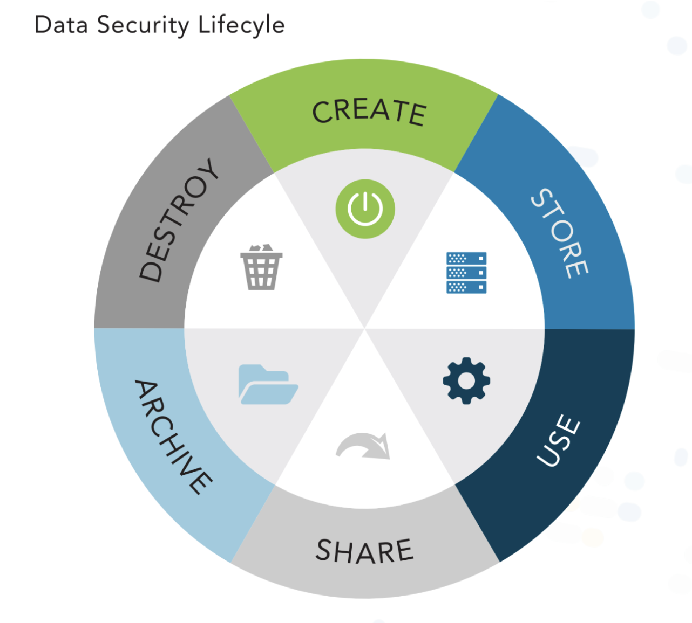
* Phases
    * Create
        * can be created by users/systems
        * Classify, tagging
    * Store
        * ensure data is handled properly, using encryption at rest
        * ensure data is classified as soon as possible
        * logging monitoting
        * can be in parallel with creation
    * Use
        * data should be protected by adequate security controls based on its classification
        * Apply DLP, RO, IRM
    * Share
        * encryption of data in use or in transit over a network
        * Apply DLP, encrypt, IRM
    * Archive
        * needed to comply with laws or regulations requiging the retention of data
        * retention policy
    * Destroy
        * when data is no longer need, it should be destroy in such a way the it is not readable nor recoverable
        * crypto-shredding!!
        * overwrite

**Key Data Functions**
* Access
    * View/Accessing data
* Process
    * Use of data to perform action
* Store
    * Storing data in a datastore (dabase, filesystem, etc)

**Controlling Data Functions**

* Access
    * How do we control access?
    * Encrypt data
    * Digital Rights Management (DRM)
* Process
    * How do we control processing?
    * Access Management
    * Encryption
* Storing
    * How do we control the storage of data?
    * Policies
        * How certain types of data are stored
        * USB restriction policies to prevent USB storage
    * DRM to prevent copying of data
    * Data Loss Prevention (DLP)
        * can enforce rules and prevent data from being moved or copied

**Data Dispersion**
* core principle of business continuity says that importent data should always be stored **in more than one location**
* easier in the cloud because the CSP owns the underlying complexity that delivers site-level resiliency
* Cloud storage for IaaS includes different levels of storage redundancy, including:
    * Local: replicas within a single datacenter
    * Zonal: replicas to multiple datacenters within a region
    * Global: region level resiliency (replicas to backup region)
* Storage Slicing
    * Data is broken into chunks and encrypted, error correction (erasure coding) is added, and then the data is geopgraphically distributed
    * Allows for retrieval of data in the event multiple locations are offline
    * Like RAID in the cloud

**Data Flows**
* data flow diagram (DFD) is useful to gain visibility and ensure that adequate security controls are implemented
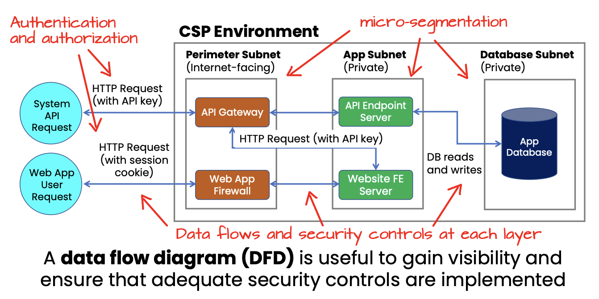
* Benefits
    * decrease development time and faster deployment of new system features
    * reduced security risk
    * visibility into data movement, critical for regualtory compliance, where the data security is often mandated in law
    * required by some compliance frameworks to capture sepcific information, such as the geographic location of data flows or ownership of systems where data is flowing
    * both risk assessment activity and a crucial compliance activity

## 2.2 Design and implement cloud data storage architectures

**Storage Types (e.g., long-term, ephemeral, raw storage)**
* Types
    * See Building Block Technologies in [Domain 1](./Domain%201%20-%20Cloud%20Concepts%2C%20Architecture%20and%20Design.md)
* Storage Types By Category
    * IaaS
        * Raw Storage (Raw Device Mapping (RDM))
            * physical media, allows a VM access a storage logical unit number (LUN)
            * VMWare virtualization
        * Ephermeral Storage
            * its used for any temporary data such as cache, buffers, session data, swap volume, etc.
            * instance storage
        * Volume Storage
            * attached as IaaS instance (EC2)
            * i.e GCP Persistent Disk, AWS EBS, VMFS
        * Object Storage
            * S3 storage, GCS
    * PaaS
        * Structured
            * Relational DB
            * tables, keys, and rows
        * Unstructured
            * Big Data
            * NoSQL
            * text files, media or other file types
    * SaaS
        * Information Storage and Management
            * Data entered via the web interface
            * used by the application
        * Content/File Storage
            * File-based content - NAS
        * Long-Term Storage
            * storage tiers (archvial)
            * "frozen" "cold" "archive", etc
        * Ephermeral Storage
            * its used for any temporary data such as cache, buffers, session data, swap volume, etc.
        * Content Delivery Network (CDN)
            * Geo-distributed content

**Threats To Storage Types**
* Universal threats to data at rest (in storage) regardless of location (on-prem vs cloud)
    * Unauthorized usage and access threatens Confidentiality
        * user accessing data storage without proper authorization
        * Preventions:
            * Customer implements proper access controls
            * CSP must provide adequate logical separation
    * Improper modification/Unathorized Changes threatens Integrity
        * cost and operational concern
        * Shadow IT is a common issue
    * Lost of connectivity threatens Availability
        * Denial of Service (DoS)
        * Implement Security products such as IPS to prevent DoS/DDoS attacks
* Other threats
    * Jurisdictional Issues
        * data transfer between countries can run afoul of legal requiremetns
        * privacy legislation bars data transfer to contries without adequate privacy protections
        * customer bears some responsibility
    * Regulator Compliance
        * Certain cloud service offerings may not meet all the organizations's compliance requirements which leads to **two security concerns**:
            * First are the consequences of noncompliance like fines or suspension of business operations
            * Second is the reason for the compliance requirements -- **data protection**
        * Requirements may include use of specfic encryption standards, handling and retention
    * Denial-of-Service
    * Data corruption/destruction
    * Theft or mdeia loss
    * Malware and ransomware
    * Improper disposal  
        * CSP is responsible for hardware disposal
        * DOD 5220.22-M and NIST 800-88 deal with data sanitization
            * https://www.sipicorp.com/wp-content/uploads/2019/09/NIST_vs_DoD_V3.pdf
        * Solution **Crypto-shredding**

**Crypto-Shredding**
* https://en.wikipedia.org/wiki/Crypto-shredding
1. Encrypt data with key A
2. Encrypt key A with key B
3. Delete data
4. Delete key A and key B

**Ransomware Countermeasures & Prevention**
* Countermeasures
    * Backup systems
    * Store backups separately
    * File auto-versoning
    * Cloud-hosted email and file storage eases this process
* Prevention
    * update and patch systems
    * use caution with web links
    * use caution with email attachements
    * verify email senders
    * preventative software programs
    * use awareness training --> **MOST IMPORTANT**
    * AI-driven Cloud services offer help with these

**Data Responsibility**
* The client (cloud customer) is **ultimately responsible** for the safeguarding of the sensitive data (PCI, PII, PHI, etc) from cradle to grave
* Even if the data disclosure is the **fault of another party (CSP)**, the client (cloud customer) is still ultimately responsible

## 2.3 Design and apply data security technologies and strategies

**Encryption and Key Management**
* Encryption
    * architecture of an encryption system has three basic components: 
        * the data itself, 
        * the encryption engine, aka cryptographic engine, that handles all the encryption activities, 
        * and the encryption keys employed in the actual encryption and use of the data
    * Encryption with Data States
        * in use, at rest or in motion
        * Digital Rights Management (DRM), Information Rights Management (IRM), or homomorphic encryption (data in use)
        * TLS/SSL, VPN, IPSec, and HTTPS used for securing data in transit/motion
        * strong file-level and/or storage-level encryption for data sitting idle (at rest)
* Cryptography
    * Use of mathematical algorithms to transform information into an encrypted form that is not readable by unauthorized individuals
    * Two basic operations
        * Encryption
            * Converts information from plaintext for into ciphertext
        * Decryption
            * Converts ciphertext messages back into their plaintext form
    * Categories of Encryption
        * See https://docs.google.com/document/d/11evcPfbJ8h1IfxaICr9jDGDc3SjvyqIGSWlas2Gs4qc/edit#heading=h.aip4et5oexdv
    * Choosing encryption algorithms
        * Many crypto algos use the Exclusive Or (XOR) operation to combine plaintext and ciphertext with crypto keys
            * XOR → true when exactly one of two input values is true
            * 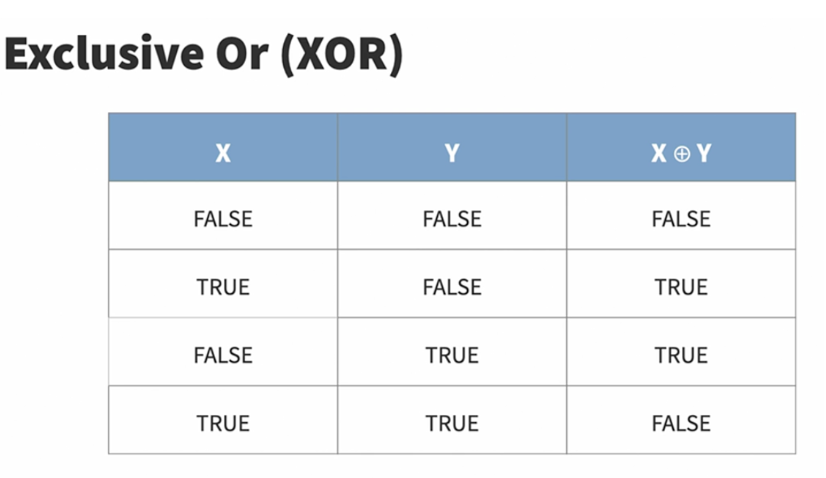
* Cryptography relies upon pseudorandom number generation because we lack a source of truly random numbers
    * Confusion → every bit of the ciphertext must depend upon more than one bit of the encryption key
    * Diffusion → changing a single bit of the plaintext should change about 50% of the ciphertext bits
* Categories
    * Categories
        * [Symmetric](https://en.wikipedia.org/wiki/Symmetric-key_algorithm)
            * Shared secret key for both encryption and decryption
            * /images/symmetric-encryption.png)
            * Most commonly uses [Advanced Encryption Standard (AES)](https://en.wikipedia.org/wiki/Advanced_Encryption_Standard) algorithm
                * Common symmetric encryption algorithms:
                    * Data Encryption Standard (DES)
                        * Block cipher that was selected as an American government standard in the 1970s
                        * Used a 56-bit encryption algorithm
                        * No longer secure
                    * Blowfish
                        * block cipher algorithm created by Bruce Schneider to replace DES
                        * offers variable rates of encryption 1-448 bit
                    * Twofish
                        * also written by Bruce Shneider
                        * created after Blowfish
                        * 128-bit encryption
                    * Triple DES (3DES)
                        * improvement on DES that runs the information through three mathematical operations using three different 56-but keys to create 168-bit encyption
                        * block cipher
                    * Rivest Cipher (RC4/RC5)
                        * block cipher created by Ronal Rivest
                        * 3 different verisons
                        * RC4 which is a stream cipher used in SSL and WEP (for wireless security)
                    * [Advanced Encryption Standard (AES)](https://en.wikipedia.org/wiki/Advanced_Encryption_Standard)
                        * replaced 3DES as new standard for symmetric algorithms
                        * block cipher
                        * supports 128-bit, 192-bit, and 256-bit encryption
                        * AES256
                            * if AES is used to encrypt data with 256-bit encryption, its referred to as AES256, or AES-256, instead of just AES
            * Formula to calculate the number of symmetric keys required for a group to communicate
                * (N * (N-1))/2 or (N<sup>2</sup>-N)/2
                    * N == number of participants in the group
                    * Table
                        /images/number-of-symmetric-keys.png)
    * [Asymmetric](https://en.wikipedia.org/wiki/Public-key_cryptography)
        * Slower than symmetric but solves the issues of having large number of keys for large groups
        * Use different keys for encryption and decryption
        * Public Key Encryption / Key-Pair
            * public that can be shared
            * Private that is kept secret
        * Sender sends data encrypted using recipients public key, which intern is decrypted using their private key
        * Data
            * Encrypt message
                * use recipient's public key
            * Decrypt message
                * use your own private key
        * Digital Signature
            * sign a message
                * use your own private key
            * validate a signature
                * use the sender's public key
        /images/asymmetric.png)
        * Common asymmetric algorithms
            * [Rivest-Shamir-Adleman (RSA)](https://en.wikipedia.org/wiki/RSA_(cryptosystem))
                * first asymmetric algorithm that implemented signining and encryption. 
                * gets is name from its three creators
            * Diffie-Hellman
                * named after its creator
                * key-exchange protocol that deals with exchanging keys in a secure fashion
            * Elliptic curve
                * new asymmetric algorithm based on Diffie-Hellman for key exchange and digital signature algorithm (DSA) for signing messages.
                * also referred to as _elliptic curve cryptography_
    * [Hash Functions](https://en.wikipedia.org/wiki/Cryptographic_hash_function)
        * One-way functions that transforms a variable length input into a unique, fixed-length output and can't be reversed
        * The output of a hash function will always be the same length, regardless of the input size
        * Message digest is another term for hash
        * May fail
            * if they are reversible
            * If they are not collision-resilient
        * Common hash functions
            * Message Digest 5 (MD5)
                * Created by Ron Rivest in 1991
                * Fifth in a series of hash functions
                * Replaced md4 after is was deemed insecure
                * Produces 128-bit hash
                * No longer secure as of 2013, however still in use
            * SHA family
                * Created by NIST as a government standard
                * SHA-1
                    * Produces a 160-bit hash value
                    * Contains security flaws and is no longer secure
                * SHA-2 
                    * Family of six hash functions
                    * Replaces SHA-1
                    * Produces outputs of either 224, 256, 384, and 512 bits
                    * Mathematically similar to SHA-1 and MD5 and susceptible to same sec flaws and deemed insecure
                    * Still widely used
                * [SHA-3](https://en.wikipedia.org/wiki/SHA-3)
                    * Replaces SHA-2 in 2015
                    * NIST selected the Keccak algorithim which produce hash values of any desired lenght
                        * Length is set by the person computing the hash
            * [Race Integrity Primitives Evaluation Message Digest (RIPEMD)](https://en.wikipedia.org/wiki/RIPEMD#:~:text=RIPEMD%20(RIPE%20Message%20Digest)%20is,160%20is%20the%20most%20common)
                * Created by a group of Belgian researches as alternative to  to SHA due to its origins within the US gov especially the involvement of the National Security Agency (NSA)
                * Four variants that produce hashes of 128,160,256 and 320 bits
                    * 128-bit version is no longer secure
                    * 160 bit version is widely used including in supporting Bitcoin transactions
        * Uses of Hashes
            * Hash-Based Message Authentication Code (HMAC)
                * Combines symmetric cryptography and hashing
                * Provides authentication and integrity for messages
                * Create and verify message authentication code by using secret key in conjunction with a hash function
            * Used with asymmetric cryptography for digital signatures and digital certificates
* Related Concepts
    * Trust model
        * a model of how different certification authorities (CA) trust each other and how their clients will trust certificates from other CA's
        * four main types of trust models used with Public Key Infrastructure (PKI)
            * Bridge
            * Hierachichal
            * Hybrid
            * Mesh
        https://medium.com/@meghdadshamsaei/trust-model-implementation-by-pki-7cddcdb72513
    * Key Escrow
        * addresses the possibility that a cryptographic key may be lost
        * concern is usually with symmetric keys or with the private key in asymmetric cryptography
        * Allows governments access to encryption keys
        * Court order is required prior to gaining access to keys
        * Clipper chip, tech proposed by government back in 1993, performed encryption but it include a special law enforcement access filed, LEAF value, which allow government access to encrypted communication
            * Controversial 
            * Electronic Frontier Foundation joined forces with RSA to campaign publicly against its
            * It also contained a fundamental flaw in its algo that would have prevented  its secure use in the first place
    * Recovery Agent
        * Allows internal access to lost keys
        * Example Microsoft Windows encrypting file system provide for the use of a recovery agent, which possesses a master key that may decrypt any information in the organization, this key must be protected carefully as it allows global access
    * Key Exchange
        * Out-of-Band
            * Different channels of communication
            * Options
                * Face-to-face meeting
                * Physical mail
                * Telephone call
            * Time consuming and possibly impractical
        * In-Band
            * Securely exchange keys digitally
            * [Diffie-Hellman Algorithm](https://en.wikipedia.org/wiki/Diffie%E2%80%93Hellman_key_exchange)
                * provides symmetric key exchange capability
                * based on work of Ralph Merkle
                * Implemented by Whitfield Diffie and Martin Hellman
                * Example:
                    * 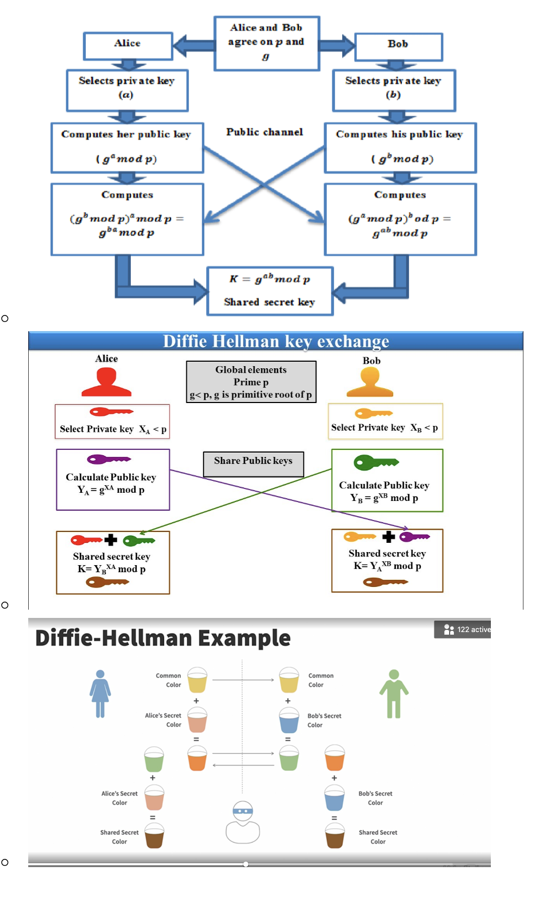
            * One variant
                * Elliptic Curve Diffie-Hellman (ECDH) Algorithm
                * https://asecuritysite.com/ecdh

* Key Management
    * 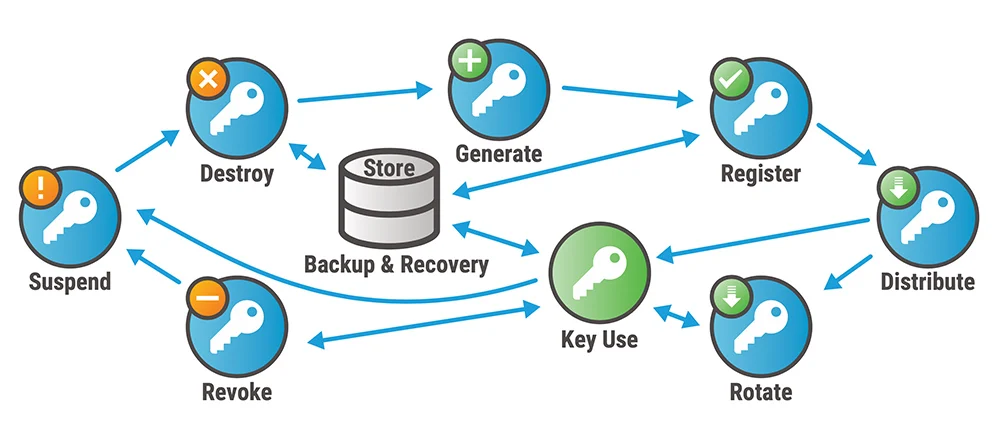
    * Phases
        * 1. Generation
            * keys should be generated within a trusted, secure cryptographic module
            * FIPS 140-2/140-3 validated modules provide tamper resistence and key integrity
        * 2. Distribution
            * should be distributed securely to prevent theft/compromise during transit
            * best practice to encrypt with a seperate key while distributing to other parties
        * 3. Storage
            * must be protected at rest and should never be stored in plaintext
            * includes keys in volatile and persistent memory
        * 4. Use
            * Clients (users + trusted devices) will use keys for resource access as access controls allow
            * Acceptible Use Policy (AUP) sets guardrails for data usage
        * 5. Revocation
            * process for revoking access at separation, policy breach, device or key compromise
            * Ex: in PKI you would revoke the certificate on the issuing Certificate Authority (CA)
        * 6. Destruction
            * key destruction is the removal of an encryption key form its operational location
            * key destruction goes further and removes any info that could be used to reconstruct that key
            * MDM systems removes certificates from a device during device wipe or retirement
* Key Management In The Cloud
    * CSP-managed or self-managed
    * Volume storage encryption
        * encrypts a storage volume mounted to a VM
        * Instance based
            * encryption engine resides on the VM instance
        * Proxy-based
            * encryption engine runs on a proxy instance
            * proxy maps the volume data to the instance for secure access
            * becomes SPF
    * Object Storage Encryption
        * basic storage-level encryption is less secure, so its best to encrypt data before send it to the cloud
        * File-level encryption
            * use IRM or DRM solution to protect individual files
        * Application-level encryption
            * the encryption engine resides within the application itself, allowing the application to ingest and use encrypted data
    * Database encryption:
        * File-level encryption
        * Transparent encryption:
            * Encryption engine resides within the database itself
        * Application-level encryption
    * Key Storage
        * many CSPs offer FIPS compliant virtualized Hardware Security Modueles (HSMs) to securely generate, store, and control access to cryptographic keys
            * Ex: AWS CloudHSM, GCP Cloud HSM, Azure Dedicated HSM, Azure Key Vault
        * Self-managed keys typically not the default and may have a cost
        * organizations use multiple CSPs or need to retain physical control over key management may need to implement a bring-you-own-key (BYOK) strategy
            * reg compliance dictates BYOK strategy
        * FIPS 140-2 - Sec requirement for cryptographic modules Levels
            * L1 - Standard operating systems, no physical security, appropriate for low level sec applications such as encryption card in a standard computer 
            * L2 - Common criteria EAL2 software and firmware, tamper-evident seals
            * L3 - Common criteria EAL3 software and firmware, tamper-resistant controls, zeroing out the contents, authenticating the identity of the operator before granting access to keys
            * L4 - Common criteria EAL4 software and firmware, strict physical security  
    * Storage-level encryption
        * provides encryption of data as it is written to storage, utilizing keys that are controlled by the CSP
    * Volume-level encryption 
        * Provides encryption of data written to volumes connected to specific VM instances, utilizing keys controlled by the customer
    * Object-level encryption
        * Encryption of objects as they are written to storage, in which case the CSP likely controls the keys and could potentially access the data
    * File-level encryption
        * implmented in client apps, i.e. word processors
        * varies by app and csp platform
    * Application-level encryption
        * implemented in an application typically using object storage
        * Data entered by user typically encrypted before stored
    * Database-level encryption
        * Transparent Data Encryption (TDE)
        * column-level, row-level encryption
        * data masking

**Key Management In Software Environments**
* CSP normally use software-based encryption to **avoid costs** associated with hardware-based encyrption
    * Software-based encrypion is **more vulnerable** to exploits than hardware-based encryption
* Software-based encryption **doesn't meet** NIST's FIPS 140-2/140-3 specifications
    * Software-based encryption has a hard time identifying signs of **tampering**
    * May cause an issue if you work with US federal government agencies
* It's **your responsibility** to find out what type of encryption your CSP offers

**Hashing**
* one-way function that scrambles plain text to produce a unique message
* no way to reverse if properly designed
* conversion of a string of characters into a shorter fixed-lenght value
* common uses
    * digital signatures verification
    * generation of pseudo-random numbers
    * integrity services (file hash comparison)
* Good hash functions have five requirements
    1. They must allow input of any length
    2. Provide fixed-length output
    3. Make it relatively easy to compute the hash function for any input
    4. Provide one-way functionality
    5. Must be collision free
* Hash-Based Message Authentication Code (HMAC)
    * Combines symmetric cryptography and hashing
    * Provides authentication and integrity for messages
    * Create and verify message authentication code by using a secret key in conjunction with a hash function 
* Used with asymmetric cryptography for digital signatures and digital certificates

**Data Obfuscation**
* Reduce GDPR Exposure
* Used to produce test data out of production data
* Steps to reduce or eliminate GDPR requirements
* **Anonymization**
    * process of removing all relevant data so that is is impossible to identify original subject or person
    * if done effectively, then GDPR is no longer relevant for the anonymized data
    * good only if you no longer need the data!!
* **Pseudonymization** 
    * de-indentification procedure using pseudonyms (aliases) to represent other data
    * can result in less stringent requirements than would otherwise apply under the GDPR
* **Data Masking**
    * Redacts sensitive information with blanks or characters
        * i.e. `**** **** **** 1234`
* **Shuffle**
    * shuffles data between fields
* **Deletion**
    * Deletes the data or uses a null value
* **Pseudonymization**
    * de-indentification procedure in which personally identifiable information (PII) fields within a data record are replaced by one or more artificial identifiers, or pseudonyms (aliases)
    * reversal requires access to another data source

**Tokenization**
* Stateless, stronger than encryption keys
* not local
* data is replaced with a token that is generated randomly, and the original data is held in a vault
* Maintain a lookup table to convert the random identifier back to the original value, this table should be secure
* 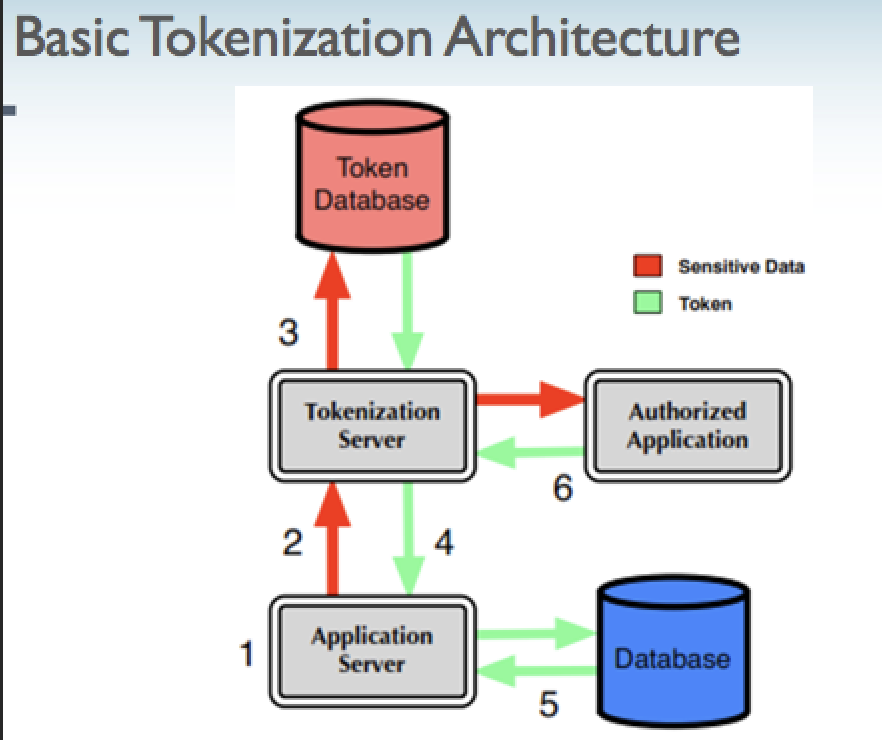
* Six Steps of Tokenization
    1. Sensitive data is **generated**
    2. Data is **sent** to the tokenization server
    3. A token is generated, and the sensitive data and its associated token are **stored** in a database.
    4. The tokenization server sends the token back to the application so it can **substitute** the sensistive data with it
    5. The application **stores** the token
    6. When the sensitive data is needed, the data can be requested by the applicartion by **submitting** the token

**Data loss prevention (DLP)**
* system designed to identify, inventory, and control the use of data that an organization deems sensitive
* also known as _data leaking prevention_
* spans several categories of controls including detective, preventative, and corrective
* DLP policies can be typically applied to email, sharepoint, cloud storage, removeable devices, and databases
* way to protect sensitive information and prevent its inadvertent disclosure
* identify, monitor, and automatically protect sensitive information in documents
* monitors for and alerts on for potential breaches, policy validations like oversharing
* Technology solutions that search systems and monitor networks for sensitive information that is unsecured and provide the ability to remove the information, block the transmission, or encrypt the stored data
* Components
    * Discovery and classification (what to look for)
    * Monitoring (notification of issues)
    * Enforcement (prevent data loss)
* DLP Architecture
    * Data in motion (DIM):
        * Network-based or gateway DLP
        * monitors SMTP, HTTP/S, SSH, FTP, etc for sensitive data and prevents it from leaving the orgnization
    * Data at rest (DAR):
        * Storage-based, used for tracking and identifying data as it's installed on the system where the data resides, generally needs another mechanism for enforcement
    * Data in use (DIU):
        * Client or endpoint-based
        * Resides on the user's workstations
        * Requires a considerable amount of management
        * Not easy to deploy and manageß
* Host-Based DLP
    * Software agents installed on a single system searches for the presence of sensitive information, allows sec professional to take action to either remove or secure it
    * Also monitor configurations and user actions, block undesirable actions
    * Ex: Spirion (hostbased)
* Network-Based DLP
    * Scans/monitors outbound network transmissions for sensitive/unencrypted information
    * Commonly used for email
* Cloud-Based DLP
    * Managed by Cloud Vendor
    * Ex: GCP Cloud DLP
* Two mechanisms of actions
    * Pattern Matching
        * Recognizes known patterns of sensitive information, such as SSNs, credit cards
        * May contain a db of known terms
    * Watermarking
        * Identifies sensitive information with electronic tags
* Cloud Considerations
    * Data movement 
    * Performance impact
    * Admin Access
    * CSP Approval (Hardware based)
* Caution:
    * DLP on end-user devices can be a particular challenge for any cloud application. Because it requires the end user to install an application or plug-in to work, you will need to make sure you fully understand the types of devices your users will be utilizing, as well as any costs and requirements associated with the use of the technology. 
    * The growth of “bring your own device” (BYOD) within many organizations will also have a profound impact on any DLP strategies and should be reflected in policies.
* Challenges
    * Data storage spread across large storage systems (with replication and redundancy) can pose issues for data discovery and monitoring more difficult

**Data De-Identification (Anonymization)**
* **Data Obfuscation**
    * Reduce GDPR Exposure
    * Used to produce test data out of production data
    * Steps to reduce or eliminate GDPR requirements
    * **Anonymization**
        * process of removing all relevant data so that is is impossible to identify original subject or person
        * if done effectively, then GDPR is no longer relevant for the anonymized data
        * good only if you no longer need the data!!
    * **Pseudonymization** 
        * de-indentification procedure using pseudonyms (aliases) to represent other data
        * can result in less stringent requirements than would otherwise apply under the GDPR
    * **Data Masking**
        * Redacts sensitive information with blanks or characters
            * i.e. `**** **** **** 1234`
            * Two types
                * **Static**
                    * separate and distinct copy of the data set is created with masking in place
                    * done via script or other process that will take the standard data set, process it to mask appropriate and predefined fields, and then output the data set as a new one with the completed masking done
                    * most appropriate for data sets that are created for nonproduction environments, where testing is necessary or desired and having a data set very similar in size and structure to production is paramount. 
                * **Dynamic**
                    * production environments are protected by the masking process being implemented between the application and data layers of the application. This allows for a masking translation to take place live in the system and during normal application processing of data.
                    * usually done where a system needs to have full and unmasked data but certain users should not have the same level of access.
    * **Shuffle**
        * shuffles data between fields
    * **Deletion**
        * Deletes the data or uses a null value
    * **Pseudonymization**
        * de-indentification procedure in which personally identifiable information (PII) fields within a data record are replaced by one or more artificial identifiers, or pseudonyms (aliases)
        * reversal requires access to another data source
    * **Anonymization**
        * The process of removing direct and indirect identifiers
        * Can be done via sampling data/generalizing the data to ensure the group shares the same value for sensitive data
        * This would make it hard to identify a single person because the sensitve data is the same for all users
    * **K-Anonymity**
        * an industry term used to describe a **technique** for hiding an invidual's identity in a group of similar persons
        * https://cloud.google.com/dlp/docs/concepts-risk-analysis#about-k-anonymity
        * https://cloud.google.com/dlp/docs/compute-k-anonymity
* **Identifer Types**
    * Direct
        * Data that directly identifies someone (i.e name, address, DOB, SSN, etc)
        * Usually classified as PII
    * Indirect
        * Data that indirectly identifies someone (events, dates, demographics, etc)
        * When combining several of these data points, it may be possible to identify someone


**Keys, Secrets And Certificates Management**
* Keys
    * most often used for encryption operations and can be used to uniquely identify a user or system
    * should be stored in a tool that implements encryption and requires a strong passphrase or MFA to access
* Secrets
    * secondary authentication mechanism used to verify that a communication has not been highjacked or intercepted
* Digital Certificates
    * used to verify the identity of a communication party and also be used by asymmetric encryption by providing a trusted publick key for secure transmission
    * follow the [x.509 Standard](https://en.wikipedia.org/wiki/X.509)
    * creation process:
        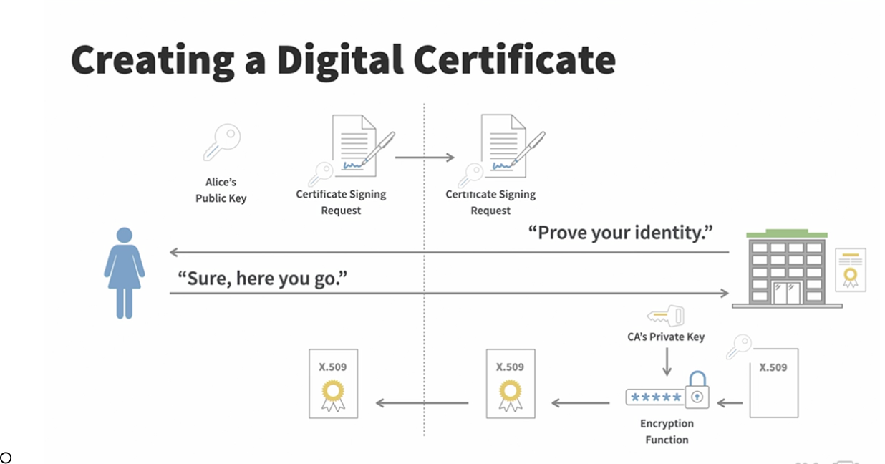
    * Includes common certificate attributes (name, country, organization, issuer name, etc)
    * Includes the certificate subject's public key as well as an expiration date
    * Includes Common Name attribute → identity secured by the certificate 
    * Allows for the inclusion of Subject Alternative Names (SANs)
    ```
    $ openssl req -new -newkey rsa:2048
—-BEING CERTIFICATE REQUEST— / —-END CERTIFICATE REQUEST —
    ```
* Digital Signatures
    * an encrypted hash of a message, encrypted with the sender's private key
    * provides 3 benefits:
        * Authentication
            * positively identifies the sender
            * ownership of a digital signature secret key is bound to a specific user
        * Non-repudiation
            * sender cannot later deny sending the message
            * sometimes required for online transactions
        * Integrity
            * provides assurances that the message has not been modified or corrupted
    * Example:
        * 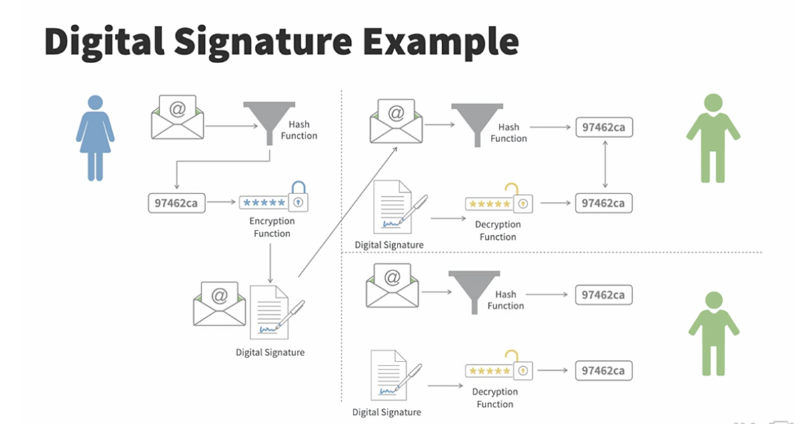    
* Public Key Infrastructure (PKI)
    * Concepts
        * Key Management
            * management of cryptographic keys in a cryptosystem
            * Operational Considerations include:
                * dealing with the generation, exchange, storage, use, crypto-shredding (destruction), and replacement of keys
                * Diffie-Hellman exchange
            * Design Considerations include:
                * cryptographic protocol design, key servers, user procedures, and other relevant protocols
        * Cerificate Authority (CA)
            * create digital certificates and own the policies
            * PKI hierarchy can include a single CA that serves as root and issuing, but this is **not recommended**
        * Subordinate CA
            * regularly issues certificates, making it difficult for them to stay offline as often as root CAs
            * have the ability to revoke certificates, making it easier to recover from any security breach that does happen
            * if the issuing CA is breached, its certificate can be revoked and a new one issued.
            * a single compromised CA does not result in compromise of the root
        * Registration Autority (RA)
            * third party CA
            * verifies user requests for a digital certificate and tells CA to issue it
        * Common Name (CN)
            * fully qualified domain name (FQDN) of the entity
        * Certificate Signing Request (CSR)
            * Message containing the sender's public key, name, and any other identifying information (email, server name)
            * Sent to a trusted CA 
        * Certificate Revocation
            * Invalidates compromised certificates
            * Certificate Revocation List (CRL)
                * contains information about any certificates that have been revoked by a subordinate CA due to compromises to the certificate or PKI hierarchy
                * Contains serial numbers of revoked certificates
                * Can be downloaded
            * CAs are required to publish CRLs but its up to the Certificate consumers if they check these lists and how they respond if a certificate has been revoked
        * Online Certificate Status Protocol (OCSP)
            * Provides real-time certificate status verification
            * Used by most modern browsers, except for Google Chrome which uses its own proprietary tech
            * consumers can submit a request to the OCSP endpoint to obtain the status of a specific certificate
    * Types of Certificates
        * User
            * used to represent a user's digital identity
            * most cases, a user certificate is mapped back to a user account
        * Root
            * trust anchor in a PKI environment which is the root certificate from which the whole chain of trust is derived
            * "root CA"
        * Domain Validation
            * Doamin-Validated (DV) certificate is an x.509 certificat that proves the ownership of a domain name
        * Extended Validation
            * provdes a higher level of trust in identifying the entity that is using the certificate
            * commonly used in the fin service sector
    * Chain of Trust
        * 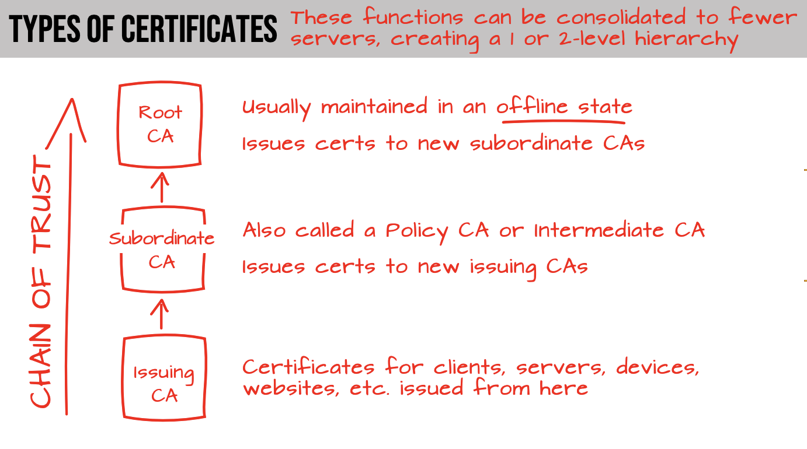
    * Trust Models
        * Web Of Trust (WOT)
            * https://en.wikipedia.org/wiki/Web_of_trust
            * First introduced by Phil Zimmerman with the intro of PGP encryption
            * Recognizes that it simply isnt possible for you to personally meet everyone that you want to exchange messages with
            * Depends on indirect relationships, such as those on Linkedin
            * Uses digital signatures to vouch for the public keys of individuals
            * Each individual signs the public keys of everyone they know when they verify that person and everyone builds a list of people they know
            * Peer 2 Peer
            * Problems:
                * Decentralized approach
                * High barrier to entry
                * Requires technical knowledge

## 2.4 Implement data discovery

**Data Types**
* Structured data
    * data contained in rows and columns, such as an excel spreasheet or relational database (Excel, MSSSQL, MySQL, etc)
    * often includes a description of its format know as a data model or schema, which is an abstract view of the data's format in a system
    * data structured as elements, rows, or tuples is given context through schema 
* Unstructured data
    * data that cannot be contained in a row-column database and does not have an associated data model (images, video files, social media posts, etc)
    * Discovery occurs through **content analysis**, which attempts to parse all data in a storage location and identify sensitive information
    * Content Analysis methods include:
        * Pattern Matching
            * campares data to known formats (i.e. credit card numbers) (DLP predefined 'sensitive data types')
        * Lexical analysis
            * attempts to find data meaning and context to discover sensitive info that may not conform to a specific pattern
        * Hashing
            * attempts to identify known data by calculating a hash of files and comparing it to a known set of sensitive file hashes
* Semi-structured data
    * a combination of structure and unstructured data (JSON, XML, emails, NoSQL)
    * may contain metadata to help organize
    * data model is flexbile

* **Disocovery methods / techniques**
    * Metadata
        * information that describes file (owner, size, creation date, etc)
        * is a critical part of discover in structured data
    * Labels
        * tags assigned to the data by the owner
        * meaning of the data
    * Content Analysis
        * analyzing data content using keywords

**Data Location & Discoverability**
* location will impact both data discoverability and the choice of tools used to perform discovery
* tools must be able to access data to perform the scanning and analysis in the discovery process
* may require different tools for cloud and on-prem discovery
* not all cloud solutions may offer a local agent for on-prem
* Network-based DLP may not analyze all traffice between on-prem endpoints and cloud
* tools must be able to scan unsctructure data within structured datasources, such as relation databases
* both unstructured and structured in same repository will increase tool cost and complexity and my present classification challenges

**Data Discovery**
* Identifies stored data
* Work to create a **data inventory**
* Ensures data is appropriately classified for protection
* Types
    * Metadata-Based Discovery
        * list of traits and characteristics about specific data elements or sets
        * Often automatically created at the same time as the data
    * Lable-Based Disovery
        * Based on examining lables created by the data owners during the **CREATE** phase (or bulk with a scanning tool)
        * Can be used with databases but is more commonly used with file data

**Privacy Roles and Responsibilities**
* **Physical environment**
    * sole responsibility of the CSP for all cloud models
* **Infrastructure**
    * Sole responsibility of the CSP for PaaS and SaaS
    * With shared responsibility for IaaS between CSP and cloud customer
* **Platform**
    * Sole responsibility of the CSP for SaaS, shared responsibiltiy for Paas, and responsibility of the cloud customer for IaaS
* **Application**
    * Shared responsibility for SaaS and sole resp of the cloud customer for both IaaS and PaaS
* **Data**
    * Sole responsibility for the cloud customer for all models
* **Governance**
    * Sole responsibility for the cloud customer for all models

## 2.5 Plan and implement data classification

**Data Classification Policies**
* Assign information into categories, know as classifications, that determine storage, handling, and access requirements
* Assign classifications based on
    * Sensitivity of information
    * Criticality of information
* Classification Levels
    * 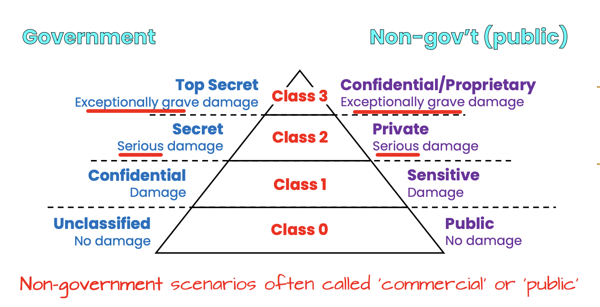
    * Non-government scenerios often called 'commercial' or 'public'
* Common Sensitive Data Types
    * Personally Identifiable Information (PII)
        * any information that can identify an individual (name, SSN, birthdate/place, biometric records, etc)
    * Protected Health Information (PHI)
        * health-related information that can be related to a specific person
        * regualted by HIPAA / HITRUST
    * Cardholder Data
        * allowable storage of information related to credit and debit cards and transactions
        * Defined and regulated by PCI DSS
* Data Policies
    * Data Classification
        * Labelling/tagging of data based on type, like PII or PHI, etc
        * data should be classified as soon after creation as possible
        * Categoies include:
            * Data type (format, structure)
            * Jurisdiction and other legel constraints
            * Ownership, Context
            * Contractual or business constraints
            * Trust levels and source of origin
            * Value, sensitivity, and criticality
            * Retention and preservation
    * Data Retention
        * Ensures that legal and compliance issues are addressed
    * Regulatory compliance
        * For legal and compliance reasons, you may need to keep certain data for different periods of time

**Data Mapping**
* Informs organization of the locations where data is present within applications and storage
* Attribute based access
* brings understanding that enables implmentation of security controls and classification policies
* usually precedes classification and labelling
* Function, Actors, and controls of the data


**Data Labeling**
* requirements that apply consistent markings to sensitive data should accompany classification
* Often applied through classification policies providing a target for data protection
* often applied in bulk using classification tools
* Common labels
    * to encrypt, not to encrypt
    * internal use, limited sharing
    * sensitive

**Sensitive Data**
* Intellectual Property (IP)
* Patient medical information (PHI)
* Personally identifiable information (PII)
    * Cardholder Data (CD) also falls under PII but more related to the the credit card or banking industry i.e card numbers, expiration dates, security codes
* Federally protected data (FERPA)(student information)

## 2.6 Design and implement Information Rights Management (IRM)

**Intellectual Property Protections**
* Copyrights
    * Protects creative works from theft sucha as Books, movies, 
    * Granted to the creator automatically
    * Provided for 70 years beyond creator’s death
    * Covered works move to public domain after expiration
    * circle-C symbol
    * Library of Congress administers the copyright program through US copyright office
* Trademarks
    * Protect works and symbols such as Brand names, branding, logos, etc
    * Granted upon registration
    * Handle by the US patent and trademark office, division of the Dept of Commerce,
    * Provided for renew 10 period
    * Must be active in use, dropped after 5 yrs of not being in use
    * Denounced using the superscript ™ symbol
    * Registered trademarks are denoted using the circle-R symbol
* Patents
    * Protects inventions
    * Requirements
        * Must be novel and new
        * Usefulness
        * Non-obvious
    * General lasts 20 years beyond filling date
    * Inventor must clearly defined what the invention is and how it works
    * Once expired becomes free to use
* Trade Secrets
    * Offers an alternative to patent protection
    * Inventor doesnt want to make the invention public and keeps the details secret

**Data Rights Management (DRM)**
* applies to the protection of consumer media, such as music, publications, video, movies, and so on. 
* In this context, IRM applies to the organizational side to protect information and privacy, whereas DRM applies to the distribution side to protect intellectual property rights and control the extent of distribution.

**Infromation Rights Management (IRM)**
* programs that enforce data rights management (DRM), provisioning access, and implementing access control models
* often implemented to control access to data designed to be shared but not freely distributed
* can be used to block specific actions, like print, copy/paste, download, and sharing
* provide file expiration so that documents can no longer be viewed after a specified time
* Objectives
    * Persistence
        * access control/ability to enforce restrictions must follow the data
    * Dynamic policy control
        * must provide a way to update the restrictions even after a document has been shard
    * Expiration
        * enforce time-limited access to data as a form of access control
    * Continous audit trail
        * must ensure that protected documents generated an audit trail when users interact with protected documents
    * Interoperability
        * must offer support for users across different system types
* Appropriate tools
    * IRM tools comprise a variety of components necessary to provide policy enforcements and other attributes of the enforcement capability
    * local changes must never supersede controls implemented by the cloud service!
    * Centralized service
        * for identity proofing and certificate issuance, store of revoked certificates, and for unauthorized identity information access
        * Enables enforcement from anywhere
    * Secrets storage
        * require local storage for encryption keys, tokens, or digital certificates used to validate users and access authorizations
        * local storage requires protection primarily for data integrity to prevent tampering with the material used to enforce IRM
    * IRM typical tool features
        * Auditing
        * Expiration
        * Policy control
        * Protection
        * Support for applications and formats

**Access Models**
* **Mandatory Access Control (MAC)**:
    * Grants access based on labels such as _confidential or secret_, according to organization policy.
    * **Most restrictive** access model
* **Role-based Access Control (RBAC)**:
    * Grants access based on the user's role or responsibility according to **organizationl policy**
* **Discretionary Access Control (DAC)**:
    * System or data owner controls who has access


## 2.7 Plan and implment data retention, deletion, and archiving policies

**Data Retention Policies**
* Retention occurs within the Archive and Destroy phases of the data life cycle
* Driven by security policies and regulatory requirements
* imperative to address the formats and storage methods as well as the security that will be utilized along with the preservation decisions.


**AWS Config**
* Service that allows you to assess, audit, and evaluate the configs of you AWS resources
* Provides the ability to create retention policies for data and will auto-delete data based on policy rules
* Similar to GCP Cloud Asset Inventory


**Data Deletion Procedures and Mechanisms**
* Cryptographic Erasure ("Crypto-Shredding")
    * https://en.wikipedia.org/wiki/Crypto-shredding
    * 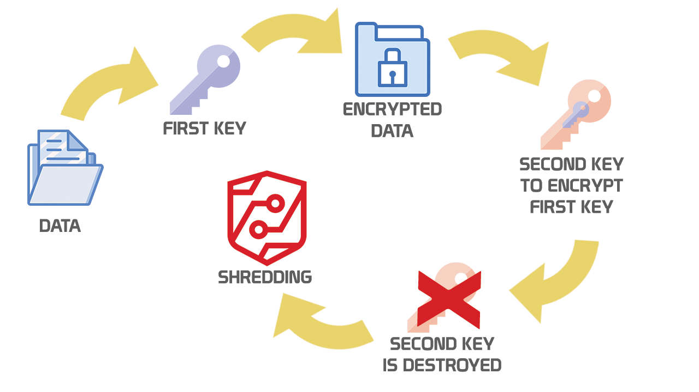
    * Most secure form of data destruction
    * Data is encrypted with a strong encryption engine
    * keys used to encrypt the data are then encrypted using a different encryption engine
    * keys from the second round of encryption are destroyed
    * Pro
        * Data cannot be recovered from any remnants
    * Con
        * High CPU performance overhead
* Overwritting
    * he process of using random data or null pointers to write over the data sectors that previously contained sensitive or proprietary information.
    * doesnt have a high degree of confidence for security

**AWS Data Sanitization Procedures**
* AWS uses techniques outline in NIST 800-88 when decommissioning customer data
* Amazone EFS is designed such that once data is deleted, it will never be served again

**GCP Data Deletion**
* https://cloud.google.com/docs/security/deletion
* Follow NIST 800-88 rev 1 (Guidelines for media sanization) and DoD 5220.22-M (National Industrial Security Program Operating Model)

**Data Archiving Procedures and Mechanisms**
* Data Archiving
    * refers to placing data in long-term storage for a variety of purposes
    * optimal approach in the cloud differs in several respects from on-prem equivalent
    * AWS Glacier, GCP Archive Class in Cloud Storage, Azure Archive Tier in Blob Storage
        * due to the retrieval time it may not be a good option for BC/DR as it may impact RTOs
    * Data retrival from long-term storage may take longer (possibly several hours)
* Key elements
    * Data Encryption
        * encryption policy should consider which media is used, and data seach and restoration needs, as well as regulatory obligations
        * what threats should be mitigated by the encryption?
        * how will encryption keys be managed? Long-term archiving with encryption can present key management challenges
    * Data Monitoring
        * track and log all access and movements of the data
        * ensure all security controls are being applied properly throughout the data lifecycle
    * eDisovery and Retrieval
        * archive data may be subject to retrieval according to certain parameters such as dates, subjects, and authors
        * should provide the ability to perform eDiscovery on the data to determine which data should be retrieved
    * Backup and DR options
        * backup and restore requirements should be clearly documented and specified
        * BCDR plans are updated and aligned with whatever procedures are implemented
    * Data Format
        * format needs to be secure, accessible, and affordable
        * avoid incompability issues word 98 docs wont open in modern version of word
    * Media Type
        * should support the other data archiving requirements, but physical media concerns fall to the CSP

**Legal Hold**
* protecting any documents that can be used in evidence in legal proceedings from being destroyed
* data protection suites in cloud platforms often have a feature to ensure immutability
* Cloud Storage (Azure Storage, AWS S3) offer an immutable storage feature
* generally implements permanent retention until a human authorizes release
* use a **vault lock** which allows for a non-readable and non-rewritable format that meets several reg requirements
    * AWS Glacier Vault (https://docs.aws.amazon.com/amazonglacier/latest/dev/working-with-vaults.html)
    * GCP and Azure Storage bucket locks
        * https://cloud.google.com/storage/docs/bucket-lock
        * https://learn.microsoft.com/en-us/azure/storage/common/lock-account-resource?tabs=portal

## 2.8 Design and implement auditability, traceability and accountability of data events

**Accountability**
* is maintained for individual subjects using auditing
* logs record user activities and users can be held accountable for their logged actions
* directly promotes good user behavior and compliance with the organizations security policy

**Security Audit and Reviews**
* helps ensure that management programs are effective and being followed
* commonly associated with account management practices to prevent violations with least privilege or need-to-know principles
* can also be performed to oversee many programs and processes
    * patch managment
    * vulnerability management
    * change management
    * configuration management

**Event Sources & Event Attributes**
* Event logs determine
    * Accountability
        * Who caused the event and when and from where? (identity attribution)
        * Specific person, IP address or geolocation, date
        * necessity for non-repudiation
    * Traceability
        * Uncover all other related events
    * Auditability
        * Provide clear documentation of the events
* Ensure events are useful and pertinent to applciations and security, whether in a cloud or traditional data center
* Definition of Event Sources
    * which events are important and available for capture will vary based on cloud service models employed (IaaS, PaaS, SaaS)
    * IaaS Event Sources
        * customer has the most access and visibility into system and infra logs of any cloud service model
        * customer has nearly full control over their compute environment, including system and network capabilities, virtually all logs and data events should be exposed and available for capture
        * some points for logging
            * DNS logs
            * VM logs
            * Host OS and hypervisor logs
            * API logs
            * Packet captures
            * Billing records
    * PaaS Event Sources
        * does not offer or expose the same level of customer access to infra and system logs
        * however same level of detail of logs and events is available at the application level
        * OWASP app events should be logged:
            * Input validation failures (protocol violations, unacceptable encoding, invalid parameter names, and values)
            * Output validation failures
            * AuthZ success/failure
            * AuthN failures
            * Session management failures (cookie session ID)
            * App errors/system events(runtime errors, etc)
            * Admin privileges
    * SaaS Event Sources
        * CSP is responsible for the entire infra and application, the amount of log data available to the customer is less
        * customer responsibility is limited to access control, shared resp for data recovery and feature configuration
* Event Attributes
    * WHO
        * Source Address
        * User Identity
    * WHAT
        * Type of event
        * Severity of event
        * Security-relevant event flag
            * if logs contain non-security events
        * Description
    * WHERE
        * Application identifier (name, version, etc)
        * Application adress
        * Service
        * Geolocation
        * Window/for/page (URL and HTTP method)
        * Code location (Script or module name)
    * WHEN
        * Log date and time (internation format)
        * Event date and time
        * Interaction identifier
* OWASP maintains concentrated guidance for developers on building application logging mechanisms, especially related to security logging in the [OWASP Logging Cheat Sheets](https://github.com/OWASP/CheatSheetSeries/blob/master/cheatsheets/Logging_Cheat_Sheet.md)


**Logging, Storage and Analysis of Data Events****
* Logs are worthless if you do nothing with the log data, more valuable only by review to identify activity that is unauthorized or compromising
* Security Infromation & Event Management (SIEM) (SIM+SEM = SIEM)
   * Log Centralization and Aggregation
        * gathers logs from a variety of sources:
            * OS
            * applications
            * network applications
            * user devices
        * Provides a single location to support investigations
   * Data Integrity
        * SIEM should be on a separate host with its own access control, preventing any single user from tampering
   * Normalization
        * normalize data to ensure that the data from a variety of sources is presented consistently
   * Automated or Continous Monitoring
        * SIEMs use algorithms to evaluate data and identify potential attacks or compromises
   * Alerting
        * automatically generate alerts such as emails, sms, or tickets when an action is required based on analysis of incoming log data
   * Investigation Monitoring
        * manual investigation is required
        * SIEM should provide support capabilities such as querying log files, generating reports
        * Forensic Analysis
            * search through logs from many systems by specific date, time, or other criteria

**Chain of Custody**
* tracks the movement of evidence through its collection, safeguarding, and analysis lifecycle
* Functions and Importance
    * provides evidence integrity through convincing proof evidence was not tampered with in a way that damages its reliability
    * Documents key elements of evidence movement and handling, including:
        * Each person who handled the evidence
        * Data and time of collection/movement/transfer
        * Purpose evidence collection/movement/transfer
        * Analysis performed
    * What if evidence is left unattended or handled by unauthorized parites?
        * criminal defendants can claim the data was altered in a way that incriminates them, and thus the evidence is no longer reliable

**Non-Repudiation**
* guarantee that no one can deny a transation
* Methods to provide non-repudiation
    * log files which inlcude unique user ID/timestamps
    * digital signatures

