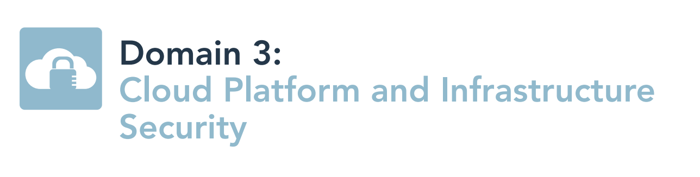
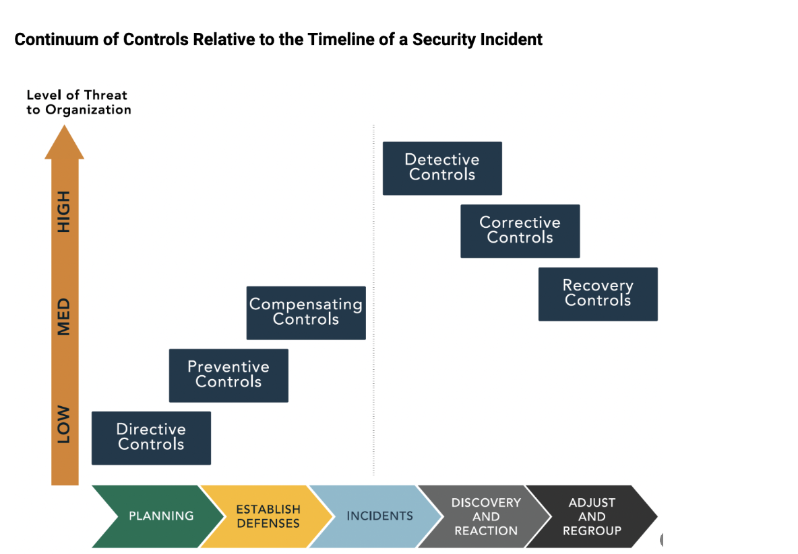
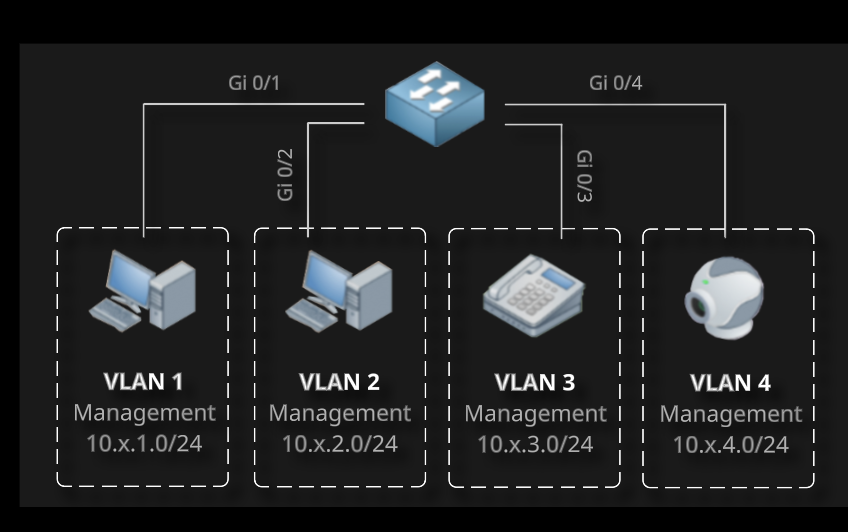
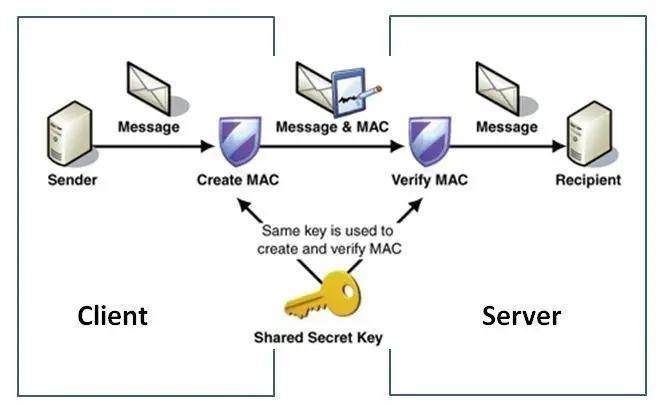
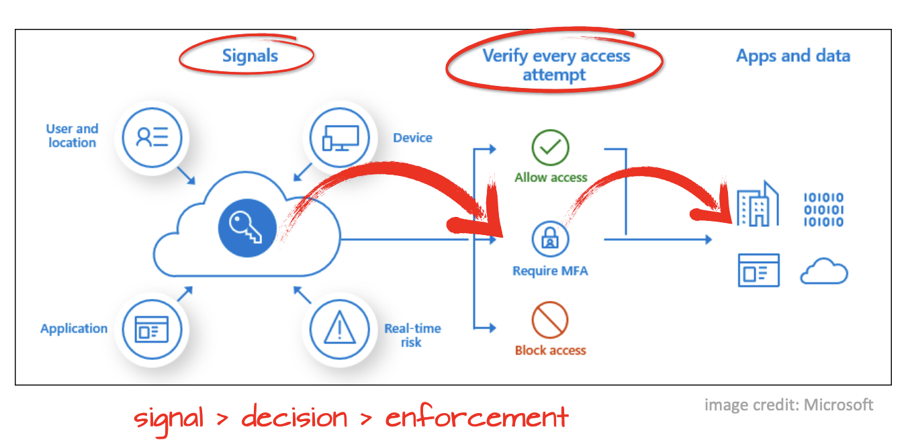
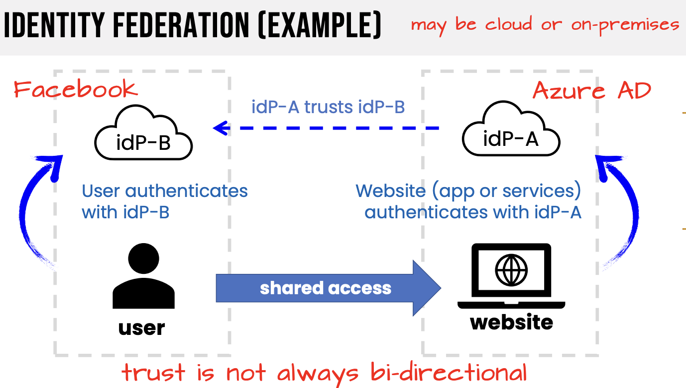
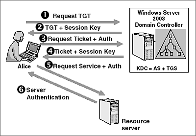
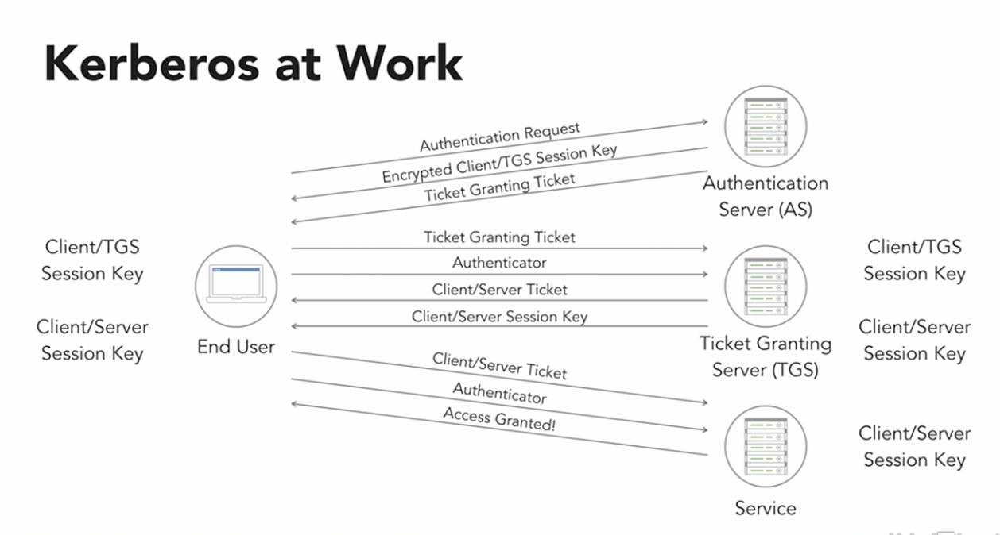
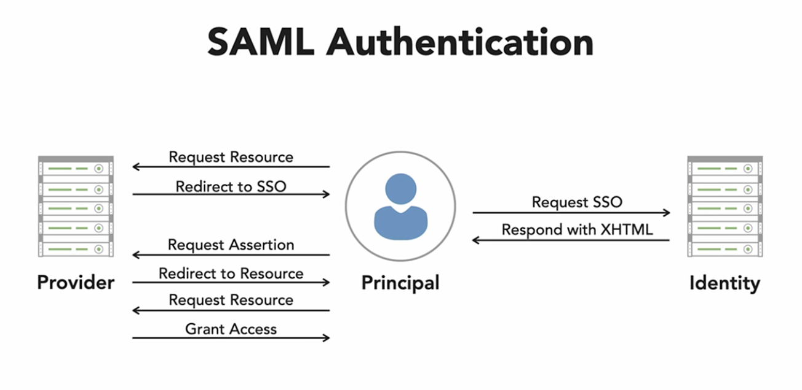
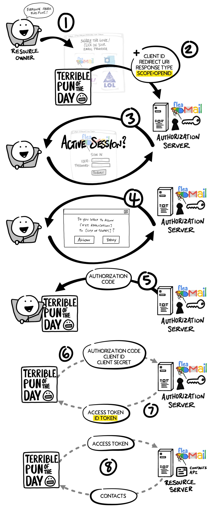

## 3.1 Comprehend cloud infrastructure and platform components

Control Frameworks
* Used to meet sec and privacy reqs as part of a governance program
* [ISO/IEC 27014:2020](https://www.iso.org/standard/74046.html)
    * Information security, cybersecurity and privacy protection — Governance of information security
    * provides guidance on concepts, objectives and processes for the governance of information security, by which organizations can evaluate, direct, monitor and communicate the information security-related processes within the organization.
* [ISO/IEC 38501:2015](https://www.iso.org/standard/45263.html)
    * provides guidance on how to implement arrangements for effective governance of IT within an organization.
* Enterprise Security Controls
    * Intended Effects Categories
        * Deterrent Controls
            * Intended to prevent an intruder from trying to access a secure area
            * Warning sign of consequences
    * Preventive Controls
        * Intended to block an intruder from accessing a secure area
        * Biometric reader at a door entry
    * Detective Controls
        * Intended to alert security personal to a potential or actual security violation
        * Security camera monitored by software or a guard
    * Mechanism of Action
        * Technical Controls
            * Use tech to deter, prevent, or detect security violations
            * Alarm system
        * Administrative Controls
            * Business processes to enhance physical security
            * Policies, standards, processes, procedures, guidelines by corp admins (executive / mid-level mgmt)
    * Compensating controls
        * Fill in known gaps in security
        * Satisfy the req for a sec measure that is too difficult to implement at the time
    * Corrective Controls
        * designed to react to the detection of incidents to reduce or eliminate
    * Recovery Controls
        * restor after an incident occurs
* 

**Physical Environment**
* components are physically located with the CSP but some are accessible via the network
* CSP takes on customer datacenter facilities, infra management responsibilities
* See Share Responsibility Model In [Domain 1](Domain%201%20-%20Cloud%20Concepts%2C%20Architecture%20and%20Design.md)
* Considerations
    * CSPs utilize common controls to address risks
    * physical security, standard measures such as locks, security peronnel, lights, fences, visiot check-in procedures
    * logical access controls identity and access management (IAM), single sign-on (SSO) provider, multifactor auth (MFA) and logging
    * Controls for data confidentiality and integrity like any cloud customer but with much broader controls
    * Example:
        * _Ensuring that communication lines are not physically compromised by locating telecommunications equipement inside a controlled area of the CSPs building or campus_
* IaaS 
    * Customer is responsible for configuring the VMs, VPC, and guest os security as if the systems were on-prem
    * CSP is responsbile for physical host, phsyical storage, and phsyical network
* PaaS
    * CSP is responsible for the physical components, the internal network, and the tools provided
    * cheaper for customer, but less control
    * Cusomter is responsible for following secure coding practices and compliance
* SaaS
    * customer remains responsible for configuring access to the cloud service for their users, as well as shared resp for data
    * CSP owns physical infra, as well as network and comms

**Network and Communications**
* Cloud carrier
    * organization that provides connectivity between the CSP and the cloud customer
    * should be redundant on different carriers
* Network functionality
    * Address allocation (DHCP)
    * Access Control (IAM)
    * Bandwidth allocation
        * reserving bandwidth for a specific use
    * Rate limiting
        * limiting the amount of traffic
    * Filtering
        * Closing ports or blocking specified protocols 
    * Routing
* Software-Defined Networking (SDN)
    * allows for networking to be completely programmable
    * underlying hardware is simply commodity hardware
    * gooal is to make networking more agile, flexible, and centrally managed

**Compute**
* Infra components that deliver compute resources, such as VMs, disk, processor, memory and network resources
* Compute compacity is **dependent on**
    * Number of CPUs
    * Amount of memory
* Reservation
    * a min resource that is guarranteed to the customer
* Limits
    * max utilizatioin of compute resource by a customer (e.g. VM)
    * limits are allowed to change dynamically based on current conditions and consumption
* Shares
    * a weighting given to a particulare VM used to calculate percentage-based access to pooled resources when there is contention
    * in cases of shortage, host scoring determines who gets capacity
        * ex: Spot instances
* Responsibilities
    * CSP remains responsible for maintenance and security of the physical components
    * customer is responsible largley for their data and users

**Virtualization**
* Includes the use of compute, storage, and networ
* security of the hypervisor is always the responsibility of the CSP
* virtual network and vm may be either csp or customer depending on the service model
* Hypervisor
    * software, firmware, or hardware that makes a guest OS think it is running directly on physical hardware
    * Allows for running multiple guests on the same hardware
    * Two types:
        * Type 1
            * Bare metal
            * runs directly on hardware
            * Ex: VMWare ESXi
        * Type 2
            * Runs on top of another OS
            * Ex: VMWare Workstation or Virtual Box
            * More susceptible to vulnerabilities and exploitation
* Associated Risks
    * flawed hypervisor can facilitate inter-vm attacks
    * network traffic between vms is not necessarily visible
    * resource availablity for vms can be impacted
    * vms and their disk images are simply files, can be portable and moveable
    * VM hopping
        * one tenant is able to see another tenant's data
    * resource starvation in high-contention times
    * file attacks on images or snapshots
* Sec recommendations for the hypervisor (CSP resp)
    * install all updates to the hypervisor as they are released by the vendor
    * restrict admin access to the management interfaces of the hypervisor
    * capabilities to monitor the security of activity occuring between guests os
* Sec recommendations for the guest os (CPS may provide tools, but resp is on customer)
    * install all updates to the guest os promptly
    * backup the virtual drives used by the guest os on a regular basis
* Network Security
    * hypervisor security includes:
        * preventing physical access to the servers
        * limiting both local and remote access 
    * virtual network between the hypervisor and the vm is also a potential attack surface
        * responsibility is shared between csp and customer
        * components include:
            * virtual network, virtual switches, virtual firewalls, virtual ip address, etc
* Focused Attacks
    * VM Escape
        * attacker gains access to a vm, then either attacks the host machine that holds all the vms, the hypervisor, or any of the other vms
        * malicious user breaks the isolation between vms running on a hypervisor by gaining access outside their vm
        * Ensure patches on hypervisors and VMs are alway up to date
        * Ensure guest privileges are low, server-level redundancy and HIPS/HIDS protection

**Storage**
* CSP responsibilities
    * physical protection of data centers and the storage infrastructure the contain
    * security patches and maintenance of underlying data storage technologies and other data services they provide
* Customer responsibilities
    * properly configuring and using the storage tools
    * logical security and privacy of data they store in the CSP's environment
* Compensating Controls for lack of physical control of the storage medium (customer) includes:
    * only storing data in an encrypted format
    * retaining control of the keys needed to decrypt the data

**Management Plane**
* What is the management plane?
    * provides the tools (web interface/APIs) necessary to configure, monitor, and control your cloud environment 
    * provides virtual management options equivalent to the physical administration options a legacy data center would provide
        * e.g. powering VMs on/off, provisioning vm resources, migrating a vm
    * interaction is done through the CSP's cloud portal, CLI (bash, powershell), client SDKs, or via REST API
        * API allows for automation
            * Scripting
            * Orchestration
            * Managing user access
            * Config Management
            * Allocating resources
    * controls entire infrastructure and is very high risk
    * allow admins to remotely manage all hosts
    * Seperate from and works with the **control plane** and the **data plane**
    * regulatory requirements may require seperate physical networks
* Control Plane
    * is what you are calling when you create top-level cloud resources with ARM & Bicep (Azure), CloudFormation(AWS) or Terraform (IaC)
* Data Plane
    * performs operations on resources created through the control plane
* Management Plane Security
    * Key Interfaces
        * Cloud Portal
            * web interface of the CSP provider
            * i.e. Azure Portal, AWS Management Console, GCP Console
        * Scheduling
            * the ability to stop/start a resource at a scheduled time
            * i.e. Instance Scheduler or Lambda (AWS), Azure Automation or Function
        * Orchestration
            * automation processes to manage resources, services, and workloads, and IaC deployments
            * i.e. CLoudFormation, Azure DevOps, Cloud Build, Cloud Deployment Manager
        * Maintenance
            * update, upgrade, security pataching, etc
    * Security Controls
        * Using multi-factor auth, RBAC, and role management

## 3.2 Design a secure data center

**Logical design**
* Concept
    * abstraction
    * legacy co-location (CoLo) scenerio, customers were seperated at the server rack or cage-level
    * logical data center design in the cloud, customers utilize software and services provided by the CSP
    * logical design of the cloud infra should:
        * create **tenant partitioning** or isolation
        * limit and secure **remote access**
        * monitor the cloud infra
        * allow for the patching and updating of systems
    * known as "Power, Pipe, and Ping"
        * Electrical Power
        * Air conditioning
        * Network Connectivity
            * Power and pipe limit the density of servers in a datacenter
* Tenant Partitioning
    * 
    * logical isolation in CSP multitenancy makes cloud computing more affordable but creates some security and privacy concerns
    * secure segregate tenants
    * logically seperated physcial networks (Ex: VLANs)
    * if isolation between tenants is breached, customer data is at risk
    * Multitenancy is a concept developed decades ago:
        * business centers phyically housed multiple tenants
        * colocation data centers supported multiple customers
    * risk in these scenerios is largely **physical (server, rack, cage)**
    * in public cloud, tenant partitioning is largely logical
    * customers are sharing capacity across the CSP datacenter, including physical components
    * CSP and tenant share responsibility for implementing and enforcing controls that address the unique multitenant risks of the public
* Access Control
    * single point of access makes access control simplier and facilities monitoring, but any single point can become a failure point as well
    * **hybrid identity** (single login for on-prem and cloud) can simplify identity and access management (IAM)
        * federate a customer's existing IAM system with their CSP tenant
        * facilitate IAM between cloud and on-prem resources is Identity-as-a-Service (IDaaS)
        * i.e. Azure Activie Directory (used with Office 365) or Google's Cloud Identity (used with Google Workspace)
    * Local and Remote Access Controls
        * **Remote Desktop Protocol (RDP)**
            * native remote access protocol for windows operating systems
            * supports encryption (TLS) and MFA
        * **Secure Shell (SSH)**
            * native remote access protocl for Linux OS, and common for remote management of network devices
            * supports encryption (TLS) and MFA
        * **Secure Terminal/Console-Based Access**
            * system for secure local access
            * a KVM (keyboard view mouse) system with access controls
        * **Jumpboxes**
            * a bastion host at the boundary of lower and higher security zones
            * CSPs offer services for this: Azure Bastion, AWS Transit Gateway
        * **Virtual Clients**
            * software tools that allow remote connections to a VM for use as if it is your local machine
            * e.g Virtual Desktop Infrastructure (VDI) for contractors

**Physical design (e.g., location, buy or build)**
* Build 
    * Requires significant investment to build a robust DC
    * offers the most control over DC design
    * Requires knowledge and skill to match quality of BUY option
* Buy
    * Generally, lower cost of entry (especially in shared scenerio)
    * Less flexibility in service design (limited to what provider offers)
    * Shared datacenters come with additional security challenges
    * Leasing space is another Buy option but limited to Rack/Cage level
* Physical Design Considerations
    * Availablility of affordable, stable, resilient electricity
    * Natural disaster exposure (flood, hurricane, tornado, etc)
    * Availability of high-speed redundant internet connectivity
    * Availability of other utilities
    * Physical site security (vehicular approaches, visibility)
    * Location relative to existing customer datacenters (BCDR)
    * Geographic location relative to customers
* Physical Design Standards
    * [ISO 27001:2022](https://www.iso27001security.com/html/27001.html)
    * ITIL - best practices framework for IT service management (ITSM)
    * [Building Industry Consulting Service International (BICSI) | ANSI/BICSI 002-2014/002-2019](https://www.bicsi.org/standards/available-standards-store/single-purchase/ansi-bicsi-002-2019-data-center-design)
        * Covers cabling design and installation
    * [International Data Center Authority (IDCA) | Infinity Paradigm](https://idc-a.org/)
        * Covers data center location, facility structure, and infrastructure and applications
    * [National Fire Protection Associate (NFPA)](https://www.nfpa.org/)    
        * [NFPA 75](https://www.nfpa.org/codes-and-standards/all-codes-and-standards/list-of-codes-and-standards/detail?code=75) & [NFPA 76](https://www.nfpa.org/codes-and-standards/all-codes-and-standards/list-of-codes-and-standards/detail?code=76)
            * Specifies how hot or cold aisle continment should be
        * [NFPA 70](https://www.nfpa.org/codes-and-standards/all-codes-and-standards/list-of-codes-and-standards/detail?code=70)
            * Requires implementation of an emergency power-off button to protect first responders
* Physical Security Challenges
    * strong fence line of sufficient height and construction
    * lighting of facility perimeter and entrances
    * video monitoring and alerting
    * electronic monitoring for tampering
    * visitor access procedures with controlled entry points
    * interior access controls (badges, key codes, secured doors)
    * fire detection and prevent systems
    * protection of sensitive assests, systems, wiring closets, etc.
* Size
    * Use of blade servers for high capacity vs large mainframe
    * chicken coop design for cold and hot isles
        * /images/hot-cold-server-aisle.png)
    * Room for expansion (cooling, power, tenants)

**Datacenter Tier Standard (Classification)**
* List created by the [Uptime Institute](https://uptimeinstitute.com/tiers)
* Describes the level of resiliency in a facility
* Tiers
    * Tier 1
        * Basic Site Infrastructure
        * no redundancy
        * Must have:
            * Uninterruptible Power Supply (UPS)
            * 24x7 Dedicated cooling equipment 
            * Generator for extended outages
        * Expected 99.671% uptime
    * Tier 2 
        * Redundant Site Infrastructure
        * Provides partial redundancy
        * Must Have:
            * Redundant cooling components
            * Redundant power components
            * Fuel Storage
        * Expected 99.741% uptime
    * Tier 3
        * Concurrently Maintainable Site Infrastructure
        * more redundancy
        * Must Have:
            * Never require maintenance shutdowns → enough redundant components
        * Expected 99.982% uptime
    * Tier 4
        * Fault-Tolerant Site Infrastructure
        * can withstand either planned or unplanned activity without affecting availability
        * eliminates all single point of failure
        * Must Have:
            * Protected against unplanned events
            * fully redundant infrastructure including dual commercial power feeds, dual back generators
        * Expected 99.995% uptime

**Environmental design (e.g., Heating, Ventilation, and Air Conditioning (HVAC),multi-vendor pathway connectivity)**
* Heating, Ventilation, and Air Condition (HVAC)
    * DC’s used to be very cold
    * Environmental threats are major risks to equipment
    * High humidity → leads to condensation that may damage electronic equipment
    * Low Humidity → leads to static electricity that may damage electronic equipment
    * Current standards for data center cooling come from the [American Society of Heating, Refrigeration and Air Conditioning Engineers (ASHRAE)](https://www.ashrae.org/).  
        * The standard is called the “expanded environment envelope”
        * Maintaining proper HVAC and humidity
            * 64.4F - 80.6F (18-27C) → HVAC (Expanded Envelope)
            * 41.9F - 50F (5.5-15C) → Humidity (Dew point Range) → Sweet Spot
    * Servers draw cool air in the front and expel hot air out back
    * /images/server.png)
    * Hot/Cold aisle approach makes cooling data centers more efficient
    /images/hot-cold-server-aisle.png)
    * HVAC failure can reduce availability of computing resources (just like power)
    * SOC-2 Type II report can help assess HVAC concerns
        * requires NDA prior to sharing due to confidential information
    * Aisle separation and Containment
        * Empty U's in rack should be covered with blanks
        * Raised floors and drop ceilings should be tightly sealed
        * Under-floor cooling with perforated tiles to the cold aisle is very effective
* HVAC Considerations
    * Lower temps equals higher cooling costs
    * Power requirements for colling are dependent on the amount of heat that must be moved as well as the temperature difference between inside and outside the datacenter
    * Use redundant HVAC
    * Ensure backup power
    * Should filter contaminants and dust
* Multivendor Pathway Connectivity
    * using more than one Internet Service Provider (ISP)
    * proactive way for CSPs to mitigate risk of losing network connectivity
    * best is dual-entry, dual-provider for HA

**Statements on Standards For Attestation Engagments (SSAE)**
* SSAE 18 is an audit standard to enhance the quality and usefulness of System and Organization Control (SOC) reports
* designed for larger organizations, such as CSP, as the cost of a type 2 report can run $30,000 or more
* [SOC Reports Details](https://sprinto.com/blog/soc-1-soc-2-soc-3/#:~:text=SOC%201%20is%20a%20financial,presented%20to%20a%20general%20audience)
* SOC Reports
    * SOC 1 - internal controls over financial reporting
        * Type 1 - financial audits at a point in time
        * Type 2 - financial audits over a period of time
    * SOC 2 - Security, processing, integrity, availability, privacy controls (requires NDA) 
        Type 1
        * report that assesses the design of security processes at a specific point in time
        * Type 2
            * ofter seen as Type II
            * assesses how effective those controls are over time by observing operations for six months
    * SOC 3 - same as soc 2 but watered down and is publicly available

**Design Resilient**
* resislent designs are engineered to respond positively to changes or disturbances, such as natural disasters or man-mad disturbances
* Examples:
    * HA firewalls, active-passive or active-active
    * Mutli-vendor pathway connectivity
    * Web Server Farm (behind redundant Load Balancers)
    * Database Cluster (windows/linux cluster feature)

## 3.3 Analyze risk associated with cloud infrastructure and platforms

**Risk assessment (e.g., identification, analysis)**
* **Risk Management Process** is fundamental to information security since the entire practice involves **mitigating and managing risk** to data and info systmes
* Risk Frameworks
    * [ISO/IEC 31000:2018](https://www.iso.org/standard/65694.html) - Risk Management Guidelines
    * [NIST SP 800-37](https://csrc.nist.gov/publications/detail/sp/800-37/rev-2/final) - Guide for Applying the Risk Management Framework to Federal Information Systems
* Identification
    * First step in the process
    * Once assets are identified then sec practitioners and risk managers can then begin to identify potential causes of disruption to the assets
* Analysis
    * Analyzing identified risks continues the conversation start by "What could go wrong?"
    * Assessment Types
        * Quantitative
            * Assigns a dollar value to evaluate effectiveness of countermeasures
            * Uses objective numberical ratios to evaluate risk likelihood and impact
    * Analysis seeks to answer two questions:
        * "What will the impact be if that goes wrong?":
            * Single Loss Exectancy (SLE) - $
        * "How significant will the loss be?":
            * Exposure Factor (EF) - %
            * EX: if the value of a building would be reduced from $1,000,000 to $250,000 by a fire, the exposure factor for the risk of fire to the building is 75%.
        * "How likely is it to happen?":
            * Annualized Rate of Occurrence (ARO) - decimal (%)
            * ARO = Incidents / Years
            * Ex:
                * An impact that happens _twice a year_ has an ARO of **2.0** **(2/1 = 2)**
                * An impact that happens _once every two years_ has an ARO of **0.5** **(1/2 = 0.5)**
                * An impact that happens _once every five years_ has an ARO of **0.2** **(1/5 = 0.2)**
        * With the SLE and the ARO you can determine the Annualized Loss Expectancy (ALE)
            * Formula ALE = SLE x ARO
        * Scenerio 1:
            * Issue: It is estimated a tornado may strike a branch office once every 5 years, causing 30% loss to a $1,000,000 building
            * Calculate the cost of Single Occurence (SLE)
                SLE = Assess Value (AV) x EF
                Ex: $1,000,000 (AV) x 0.30 (EF) = $300,000 (SLE)
            * Calculate the annualized lost cost (ALE)
                * SLE = $300,000
                * ARO = 0.2 (once every five years)
                * Ex: $300,000 x 0.2 = $60,000 (ALE)
    * Analysis of CSP Risks
        * CSP Focus Areas
            * Business Units
            * Vendor Management
            * Privacy
            * Information Security
        * Standards for CSP Guidance
            * [ISO/IEC 27001](https://www.iso.org/standard/27001)
                * framework for policies and procedures that include legal, physical, and technical controls involved in an organization's information risk management processes
            * [ISO/IEC 27017](https://www.iso.org/standard/43757.html)
                * security standard developed for CSPs and users to make a safer cloud-based environment and reduce the risk of security problems
            * [ISO/IEC 27018](https://www.iso.org/standard/76559.html)
                * first international standard about the privacy in cloud computing services
                * code of practice for protection of PII in public clouds acting as PII processors
    * Data Privacy and Infor Sec Risks:
        * Authentication Risk
        * Data Security
        * Supply Chain Risk Management (SCRM)
* losing ownership and full control over system hardware assets
* SLAs are critical to limit risk
* Common Cloud Risks
    * Geographic dispersion of the CSPs data centers
        * if properly architect a disruption at one DC should not affect or cause a complete outage
    * Downtime 
        * resiliency in network connectivity, zonal and regional
    * Compliance
        * jurisdictions may demand that data may not be dispered
        * dictate data privacy (GDPR)
    * General technology risk
        * cloud systems are not immume to standard security issues like cyberattacks
        * CSPs defenses should be documented and tested and customers aware of their configuration responsibilities
* Risk Types
    * External
        * different threat actors, ranging from competitors and script kiddies to crime syndicates and state actors
        * capabilities depend on tools, experience, and funding
        * environmental threats (fires, floods)
        * man-made threats (accidental deletion of user data)
        * vendor-lock in/out
    * Internal
        * malicious insider (dissatisfied employee)
        * human error

**Cloud Vulnerabilities, Threats and Attacks**
* [The CSA Egregious 11](https://cloudsecurityalliance.org/artifacts/top-threats-to-cloud-computing-egregious-eleven/)
    * detailed list of top cloud-specific threats
    1. Data Breaches
        * unintentional loss/oversharing is a "data leak"
        * loss of sensitive data 
    2. Misconfiguration and inadequate change control
        * remediate through change and config management
    3. Lack of cloud security architecture and strategy
    4. Insufficient identity, credential access and key management
    5. Account hijacking
        * credential theft, abuse, and/or elevation to carry out an attack
        * likely phishing
    6. Insider threat
        * job rotation, privelege access management, audit, and security training
    7. Insecure interfaces and APIs
        * mfa, rbac, api management plaftorms, key-base API access
    8. Weak control plane
    9. "Metastructure" and "applistructure" failures
        * vulnerabilities in the operational capabilities that the CSPs make available, like APIs for accessing various cloud services
        * if CSP has inadequately secures these interfaces any resulting solutions built on top of those services will inherit these weaknesses
        * **Metastructure**
            * protocols and mechanisms that provide the interface between the cloud layers, enabling management and configuration
        * **Applistructure**
            * applications deployed in the cloud and underlying application services used to build them
            * ie. Message QUeus, functions, message services
    10. Limited cloud usage visibility
        * referes to when organizations experience a significant reduction in visibility over their info tech stack
            * IaaS vs PaaS vs SaaS
    11. Abuse and nefarious use of cloud services
        * low cost and high scale of compute in the cloud is advantage to enterprises, its an opportunity for attackers to execute disruptive attacks at scale
        * sprawl
        * DDoS, phishing

**Risk Mitigation Strategies**
* select qualified CSP
* design and architecting with security in mind
* use of encryption to secure data at rest and in transit (TLS)
* ongoing monitoring and management to maintain posture
* Defense in depth

## 3.4 Plan and implementation of security controls

**Standards**
* Standards
    * NIST SP 800-14:
        * General principles and practices for securing IT systems
        * https://csrc.nist.gov/publications/detail/sp/800-14/archive/1996-09-03
    * NIST SP 800-123
        * General server security
        * https://csrc.nist.gov/publications/detail/sp/800-123/final
**Physical and Environmental protection (e.g.,on-premises)**
* The North American Electric Reliability Corporation Critical Infrastructure Protection (NERC CIP) plan is a set of standards aimed at regulating, enforcing, monitoring and managing the security of the Bulk Electric System (BES) in North America
* https://www.nerc.com/comm/RSTC/Pages/default.aspx
* Standards
    * NIST SP 800-14
    * NIST
* Considerations
    * site location is primary
    * requirements
        * ability to restrict physical access at multiple points
        * ensuring a clean and stable power supply
        * adequate utilities like water and sewer
        * the availability of an adequate workforce
    * CSP responsibilties in the cloud , customer responsible for on-prem (private)
* Site Selection & Facility Design
    * visibility, composition of the surrounding area, area accessibility, and teh effects of natural disasters
    * customers should focus on selecting CSP datacenter locations to meet DR and data residency
    * CSPs auto-select region pairs for redundancy

**Fire Suppression (Extinguisher)**
* Class A
    * fires known as common combustible fires and include burning of wood, paper, cloth, or plastic
    * use water or soda acid to suppress
* Class B
    * considered liquid fires and include buring of gas, oils, tars, solvents, and alcohol
    * cannot use water, instead take the oxygen away by using CO2 or FM-200 extinguisher
* Class C
    * fires include burning of elctrical components and equipement
    * previously these could be extinguished with Halon gas, CO2, or nonconductive agent such as FM-200.
    * Halon is no longer recommended becuase of the ozone depletion
    * CO2 and FM-200 can still be used
* Class D
    * fires include burning of combustible metals such as magnesium and sodium and requires the use of dry chemcials to suppress
* Class K
    * Kitchen fires (fats / oils)
    * Use same as class b extinguisher
    * Class F in Europe and Australia

/images/fire-extinguisher-types.webp)

**Other Suppression**
* Wet Pipe
    * water is in the pipe at all the time and ready to be released
    * drawback is pipe could break and release the water and DC could be flooded
* Dry Pipe
    * water sitting in a reservoire and not in the pipe
    * after a short delay the water is released when a value is turned (maunally or auto)
* Pre-action system
    * head link on the sprinkler has to be melted in order for the water to be released

**Other environmental issues to protect against**
* Protect against flooding → choose a location that flooding rarely occurs or not at all
* Use moisture sensors to prevent water infiltration
* Electromagnetic Interference
    * Generated by all electronic equipment
    * Interferes with normal operation of other equipment
    * Enables eavesdropping attacks → attackers can reconstruct keystrokes (side channel attack)
    * Use faraday cages to control EMI → rarely used outside of government builds

**System, Storage and Communication Protection**
* [NIST SP 800-53](https://csrc.nist.gov/publications/detail/sp/800-53/rev-5/final)
    * Security and Privacy Controls for Information Systems and Organizations
    * Contains a family of security, privacy, and protection controls specific to systems and communications
* Protection (Technology)
    * Encrypt and protect data (at rest, in transit, in use)
    * Protect systems and services (DoS/DDoS, Boundary (ingress/egress), Key Management)
* Security Practices (People/Processes)
    * Automation configuration
    * Responsibilities for protecting cloud systems and services
    * Monitoring and maintenance
* Concepts
    * Policy and Procedures
        * Establish requirements for system protection, and define the purpose, scope, roles, and responsibilities needed to achieve it
    * Separation of System and User Functionality
        * basic security principle that ensures that no single person can control all the elements of a critical function or system
        * seperating user and admin functions can also prevent users from altering processees or misconfiguring systems
    * Security Function Isolation
        * Example of Separation of duties
    * Denial-of-Service Protection
        * AWS Shield, Azure DDoS, Google Cloud Armor
    * Boundary Protection
        * deals with both ingress and egress protections, including:
            * Preventing malicious traffic from entering the network
            * Preventing malicious traffic from leaving your network
            * Protecting against data loss (exfiltration)
            * Configuring rules/policies in routers, gateways, or firewalls
    * Cryptographic Key Establishment and Management
        * Use TLS / VPN
        * Hashing / digital signatures
        * Hash-based message authentication code (HMAC) -- simultaneously verifiy both data integrity and message authenticity
            * sometimes expanded as either keyed-hash message authentication code or hash-based message authentication code 
            * a specific type of message authentication code (MAC) involving a cryptographic hash function and a secret cryptographic key.
            * 

**Identification, Authentication and Authorization**
* Authentication (AuthN)
    * proces of providing that you are who you say you are
    * proof of identity
    * Permissions, rights, and privileges are granted to users based on their proven identity
* Authorization (AuthZ)
    * is the act of granting an authenticated party persmission to do something
    * granting access
    * access decisions are made using Policy Enforcement Point (PEPs)
    * individual policies are controlled at Policy Decision Point (PDP)
    * if user has assigned rights to a resource, they are granted authorization
    * principle of least privelege
* Accountability
    * users who perform activities on a system are held accountable, typically enforece with adequate logging and monitoring of system activity
    * challenges in enforcing accountability in the cloud
        * SaaS apps used as users travel make identifying anomalous / malicious behavior more difficul
        * Bad Password practices (reuse across services)
        * Use of personal devices in BYOD scenerios
    * Modern IDaaS tools provide solutions for the above challenges
* Multifcator Authentication (MFA)
    * works by requiring two or more of the following authentication methods:
        * Somethiing you **know** (pin or password)
        * Something you **have** (trusted device, soft/hard token)
        * Something you **are** (biometric)
    * Factors and Attributes
        * passwords are the weakest form of authentication
        * password policies help increase their security by enforcing complexity and history requirements
        * Smartcards include microprocessors and cryptographic certificates
        * Oath tokens create one-time passwords (OTP)
        * Biometric methods identify users based on individual characteristics such as fingerprints and facial recognition
    * Conditional Authentication Policies
        * 
        * Benefit
            * allows Administrator the ability to build conditions that manage security controls that can block access, require multifactor authentication, or restrict the user's session when needed and stay out of the user's way when not
    * Authentication Methods
        * Authentication Applications 
            * Authenticator Apps
            * software-based authenticator that implements two-step verification services using the Time-based One-Time Password Algorithm and HMAC-based One-Time Password algorithm, for authenticating users of software applications
            * Examples include Microsoft Authenticator and Google Authenticator
            * using opend standards developed by the [Initiative for Open Authentication (OATH)](https://en.wikipedia.org/wiki/Initiative_for_Open_Authentication)
        * Push Notifications
            * server is pushing down the authentication information to a mobile device
            * uses the mobile device app to be able to recieve the pushed message and display the authentication information
* Concepts of Federated Services
    * Federation
        * collection of domains that have **established trust**
        * level of trust may very, but typically includes authentication and almost always includes authorization
        * Oftern includes a number of organizations that have established trust for shared access to a set of resoruces
        * Example:
            * you can federate you on-premises environment with Azure AD and use this federation for authentication and authorization
            * This sign-in method ensures that all users authencation occurs on-premises
        * Allows administrators to implment more rigorous levels of access control
        * Certificate Authentication, key fob, card token
        * trust can be either one-way or two-way, if one-way trust exists from domain one to domain two, domain will trust authenticated sessions from domain two, not vice-versa. If two-way, their is mutual trust.
        * trust can 
        * 
    * Trust Models
        * One-Way Trust
            * domain one to domain two, domain will trust authenticated sessions from domain two, not vice-versa.
        * Two-Way Trust
            * domains mutually trust each other
        * Transitive Trust
            * trust relationship transfer across domains
                * Ex: if domain one has a transitive trust with domain two and domain two has transitive trust with domain three, domain one and three will have a trust relationship
        * Non-transitive Trust
            * trust will not be automatically inferred.
            * domain on will not trust three unless the admin explicitly creates that trust
* Strength of Authtenciation Factors
    * False acceptance errors occur when the system misidentifies individuals as authorized users and grant access which should be denied
        * problematic because this provides unauthorized access to systems, devices, etc
        * The frequency of these errors is measured by the false acceptance rate (FAR)
    * False rejection errors occur when authorized individuals attempt to gain access to a system but are incorrectly denied access
        * not as serious as false acceptance errors, but it jeopardizes the legitimate availability of resources
        * the frequence of these errors is measured by the false rejection rate (FRR)
    * FAR and FRR are not by themselves good measures of strength of an auth factor, due to they can be easily manipulate.
    * Solution to this is to use a balanced measure of strength called the crossover error rate
        * admin tunes the system to have equal false acceptance and false rejection rates
* Kerberos
    * Core protocols of MS Active Directory
    * ticket-based authentication system that allows users to authenticate to a centralized service and then use tickets from that authentication process to gain access to distributed systems that support kerberos authentication.
    * uses port 88
    * 
    * 
* Ligthweight Directory Access Protocol (LDAP)
    * provides the means to query a centralized directory service, such as MS Active Directory
    * TCP Ports
        * 389 - unencrypted comms
        * 636 - Secure LDAP
* NTLM Authentication
    * NT Lan Manager
    * was widely used on windows systems before Kerberos
    * depends upon a hash-based challenge-response protocol
    * Security Issues
        * Weak encryption
            * jeopardizes the security of encrypted hash values
        * Vulnerable to Pass the hash (hack)
            * allows the use of credentials from one system to gain access to another system
    * Avoid the use of NTLM
* Security Assertion Markup Language (SAML)
    * allows SSO within a web browser across a variety of systems
    * Benefits
        * true SSO experience for end users
        * No credential access for service providers 
    * 
* Wed Services Federation Protocol (WS-Federation or WS-Fed)
    * part of larger WS-Security framework and an extension of WS-trust.
    * can be used directly by SOAP applications and web services.
    * WS-Fed is a protocol that can be used to negotiate the issuance of a token
    * can be use by applications (such as a Windows Identity Foundation-based app) and for indentity providers (such as Active Directory Federation Services or Azure AppFabric Access Control Service)
* OAuth and OpenID Connect
    * Used by 3rd party IdPs (LinkedIn, Facebool, Google, etc)
    * OAuth is an _authorization_ protocol
    * OpenID Connect is an _authentication_ protocol
    * 

**Audit mechanisms (e.g., log collection, correlation, packet capture)**
* Log Collection
    * cloud services will offer different controls over what information is logged
    * min level of security-related events such as use of or changes to privilege accounts
    * log aggregator can ingest logs from all on-premises and cloud resources for review
    * NIST SP 800-53 and OWASP logging cheet seet offer guidance on specific information to capture in audit reocrds
* Correlation
    * ability to discover relationships between two or more events across logs
    * commonly associated with a SIEM
* Packet Capture and Replay 
    * tools are called **protecol analyzers**
    * cloud environment may not provide any facility for capturing packets, particularly in SaaS scenerios
    * Allow deep inspection of traffic
    * Troubleshoot network issues
    * Investigate security incidents
    * Eavesdrop on confidential communications
    * In the cloud
        * CSP must partition network traffic to prevent users from eavesdropping on each other
        * CSP must retain the capability to observe all traffic themselves
        * Customers must understand the limitations of their own packet captures
    * Example tools
        * NetFlow 
            * a network protocol developed for Cisco routers by Cisco Systems, is widely used to collect metadata about the IP traffic flowing across network devices such as routers, switches and hosts. The traffic flow data informs a company’s IT professionals as to how much traffic there is, where it’s coming from and going to, and the paths being used.
        * Wireshark
            * a free, open-source protocol analyzer, with CLI and GUI verisons, available for Windows and Linux (including macOS)
            * some CSPs support Wireshark, others have specificalized services to perform packet capture on virtual networks
                * e.g Network Watcher (Azure), AWS supports Wireshark
            * Some CSP protocol analyzers can save the data that they collect to a Wireshark-compatible packet capture file (PCAP)
        * Tcpdump
            * Command line open source protocol analyser
                * `$ tcpdump -n -i eth0 ‘tcp port 22’`
            * Tcpdump → https://www.tcpdump.org/
            * Wireshark and tcpdump are built using libpcap library → https://github.com/the-tcpdump-group/libpcap
        * Tcpreplay → allows editing and replaying traffic
* Compliance Audits
    * needs to be controlled by a representative (regulator) from the industry or organizartion that sets the compliance requirements
* Audits in the cloud
    * don't generally involve physcial access, so the reports may be less complete than an on-premise audit and my be considered less trustworthy becuause of this fact.

## 3.5 Plan business continuity (BC) and disaster recovery (DR)

**Business Continuity Plan (BCP)**
* Business-focused
* org plan for "how-to" continue business after an event has occurred
* proactive risk mitigtion strategy that contains likely scenerios that could affect the organization and guidance on how the organization should respond
* sometimes referred to as _Continuity of Operations Plan (COOP)_
* focuses on the whole business
* cover communications and process more broadly
* Definitions
    * Business Resumption Plan (BRP)
        * plan to move from disaster recover site back to normal operating business environment
    * Mean Time Between Failures (MTBF)
        * a time determination for how long a piece of IT infrastructure will continue to work before it fails
    * Mean Time To Repair (MTTR)
        * a time determination for how long it will take to get a piece of hardware/software repaired and back on-line
    * Max Tolerable Downtime (MTD)
        * amount of time we can be without the asset that is unavailable **BEFORE** we must declare a disaster and initiate the DR plan

**Disaster Recovery Plan (DRP)**
* focuses more on the technical aspects of recovery
* plan for recovering from an IT disaster and having the IT infrastructure back in operation

**BCP/DRP From a CSP Perspective**
* cloud data center that is affected by a natural disaster will likely activate multiple BCPs and DRPs
* CSP will activate both plans to deal with the interruption to their service
* one key element of the BCP is communication incident status to relevant parties

**BCP/DRP From a Customer Perspective**
* customer responsibility for determinig how to recover in the case of a disaster in the cloud
* customer may choose to implement backups, or utilize multiple availability zones, load balancers, or other techniques
* CSPs can further protect customers by not allowing two availability zones within a single phyiscal datacenter within a cloud region
    * Availability Zones
        * unique physical locations within a region with independent power, network, and cooling
        * comprised of one or more datacenters
        * tolerant to datacenter failures via redundancy and isolation

**Communication Plan**
* plan details how relevant stakeholders will be informated in event of an incident (i.e. security breach)
* inlcude maintaining confidentiality such as encryption to ensure that the event does not become public knowledge
* contact list should be maintained that includes stakeholders 
from the government, police, customers, suppliers and internal staff
* compliance regulations, like GDPR, include notification requirements, relevant parties and timelines
* Stakeholders
    * **stakeholder** is a party with an interest in an enterprise; corporate stakeholders include investors, employees, customers, and suppliers
    * Communication Plan should contain the relevent groups
        * Internal stakeholders
        * Cyber Insurance Provider
        * Business Partners
        * Customers
        * Law enforcement (not mandatory unless a criminal law is broken)

**Business requirements**
* Recovery Point Objective (RPO)
    * age of data that be recovered from a backup storage for normal operations to resume if a system or network goes down
    * acceptable amount of downtime for a business-critical application before they need to be functional again after an event
        * **Prioritize** applications and services
        * **If less downtime** is needed:
            * Deploy DR solutions that allow for faster recovery
            * More personnel to complete tasks
* Recovery Time Objective (RTO)
    * duration of time and a service level within which a business process must be restored after a disaster in order to avoid unacceptable consequences associated with a break in continuity
    * acceptable amount of data the organization is willing to lose if restoration is required after an event
        * Dependent on data **replication schedule**
        * Ex. Replication every 4 hours, may lose up to 4 hours' worth of data
        * How to reduce data loss:
            * Replicate more frequently
            * Increased bandwidth
            * Licensing costs
* Recovery Service Level (RSL)
    * measures that compute resources needed to keep production environments running during a disaster
    * percentage measure (0-100%) of how much computing power that will be needed during a disaster
        * All services will be restored during a disaster = 100% RSL
        * Only most critical services will be restored during a disaster = 30% RSL
    * based upon a percentage of computing used by producution environment versus others, such as dev, test, and QA
    * Example: a 10-web server environment that uses 8 for dev, test, and QA, only 2 would need to be migrated for production
* Business Impact Analysis (BIA)
    * determines the RPO/RTO

**BCDR Planning Factors**
* Important Assets: Data and Processing
* Current location of the assets
* The network between the assets and the sides of their processing
* Actual and potential location of the workforce and business partners concercing disaster event

**BCDR Types**
* On-Prem, Cloud as BCDR
    * CSP serves as endpoint for failover services
* Cloud Consumer, Primary Cloud Service Provider BCDR
    * One CSP region fails, service is restored in another zone of the CSP's cloud environment (region pairs)
* Cloud Consumer, Alternative Provider BCDR
    * Failure happends, restoration is done in another CSP
    * Azure is primary, DR is in Aws or GCP

**BCDR Plan Creation, Implementation and Testing**
* Creation of the Plan
    * Business Impact Analysis (BIA) provides input into the plan
    * Steps
        * Scope of the BCDR Plan
        * Gathering Requirements and Context
            * BIA, RPO, RTO
        * Analysis of the Plan
            * translate BCDR requirements into input to be used in the design phase
            * identify mitigating controls to be implemented
            * consider decoupling systems to make BCDR more successful
            * ensure CSPs and vendors can meet requirements
            * identify resource requirements (storage, bandwidth, etc.)
        * Risk Assesment
            * assessed for residual risk
        * Plan Design
            * objective into establishing and evaluate candidate architecture solution
            * Include procedures and workflows
            * Define owner(s)
                * Technical
                * Declaring BCDR event
                * Communications to cutomers
                * Internal communications
                * Decision makers
            * Describe HOW BCDR plan will be tested
                * Enterprise-wide testing plans should address every business-related service
                * Should be fully tested annually with semi-annual training (walkthroughs) or when significant changes occur with business operations
                * Each line within the business should be fully tested to ensure it will survive
                * Testing of any exteranl dependencies
* Implementation of the Plan
    * identify key personnnel is a crucial implementation steps
    * use the design in the plan to implement protections to critical business functions
    * customers can take advantage of the cloud's high availability features like:
        * mulitple az's
        * automatic failover to backup region(s)
        * direct connection to a csp
* Testing the Plan
    * ensures both the BCP/DRP function as expected and that people know their roles and responsibilities
    * testing both BCP and DRP is essential
    * RPO/RTO must be measured to ensure attainability
* Report and Revise
    * BCR/DRP should be revised as necessary based on test results and business changes

**BCP/DRP Test Scenarios**
* BCDP and DRP should be tested **at least annually**
* Common disaster scenarios include the follwoing:
    * Data breach
    * Data loss
    * Power outage or loss of other utilities
    * Network failure
    * Naturual disasters (e.g., fire, flooding, tornado, hurricane, or earthquake)
    * Civil unrest or terrorism
    * Pandemics
* Testing Types
    * Checklist Review
        * distribute copies to BCP/DRP to managers of each critical business unit asking them to review
    * Tabletop testing / Walk Through Test
        * primary objective is to ensure that critical personnel are aware of BCP and plan accurately reflects the organization's ability to recover from disaster
        * role play a disaster scenerio
        * scenerion is  only known to the test moderator
        * team members refere to the document and discuss the appropriate response to that particular type of disaster
        * minimal import on productivity
    * Dry Run / Walk Through Drill / Simulation Test
        * some of the responses measures are tested (on-non critical functions)
        * More involved than tabletop.
        * Participants choose a scenario and apply BCP to it
        * Roll play
    * Functional Drill / Parralel Test
        * People move to an offiste locatoin to see if BCP is properly invoked
        * operations are NOT switched
        * Parrallel processing of data to ensure backup site functionality
    * Full Test
        * most comprehensive test
        * involves actually shutting down operations at the primary site and shifting them to the recovery site
        * when the entire organization takes part in an unscheduled, unannounced practice scenario, of full BC/DR activities
        * be sure a FULL backup occurs prior to test
        * Full BCDR implementation
* The goal of BCDR testing is to ensure the BCP process is:
    * Accurate
    * Relevant
    * Viable under adverse conditions

