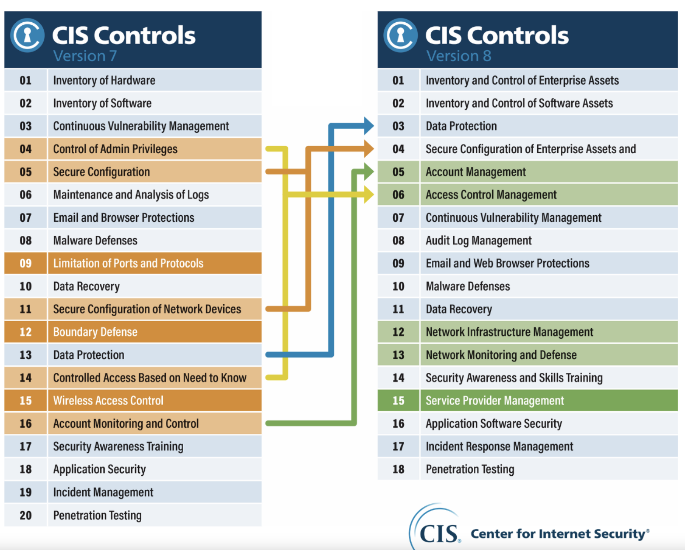
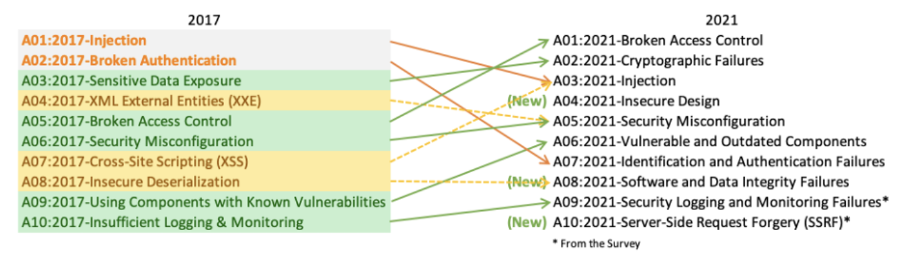
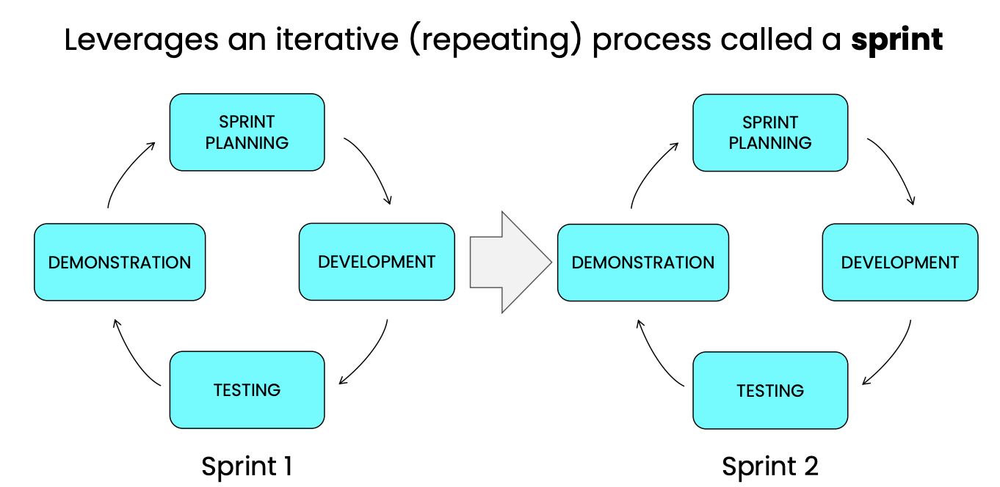
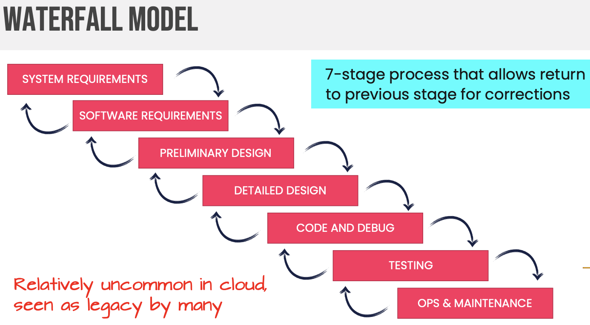
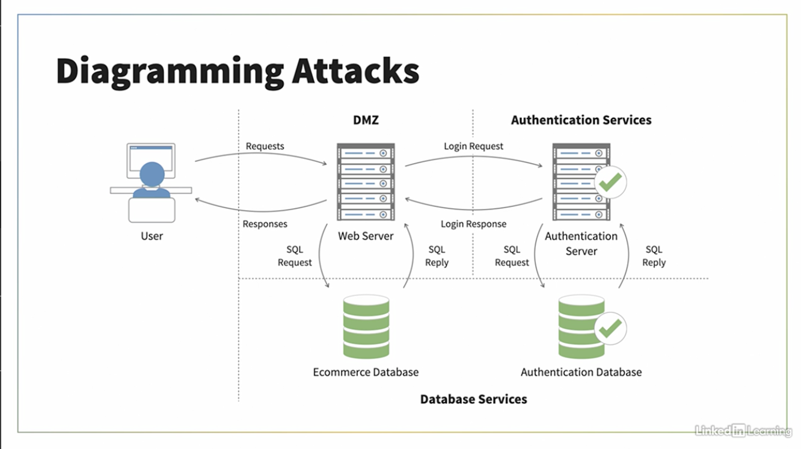
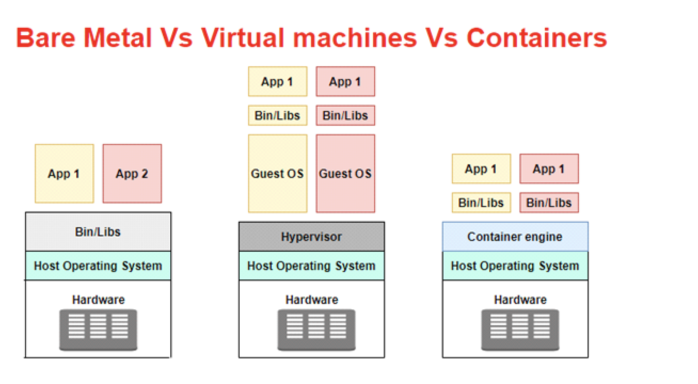

## 4.1 Advocate training and awareness of application security

Cloud Development Basics
* Security By Design
    * declares security should be present throughout every step of the process
    * various models exist to help, like [Building Security In Maturity Model (BSIMM)](https://owasp.org/www-pdf-archive/Bsimm09.pdf)
    * Pairs well with DevSecOps
* Maturity Models
    * [The Capability Maturity Model Integration (CMMI)](https://en.wikipedia.org/wiki/Capability_Maturity_Model_Integration)
        * assesses an organization's process maturity
        * replaces CMM
        * focused on software development
        * CMMI
        * Five Levels
            1. Initial
                * just getting started with formal development practices
                * work gets done but is subject to delays and budget overruns
            2. Managed
                * begin basic process, i.e code reuse
                * config management
                * measurement / analysis
                * project planning, monitoring, control
                * QA/QC
                * Reqs management
                * supplier agreemtnt mgnmt
            3. Defined
                * have formal documented practices
                * desicion / analysis resolution
                * integrated project management
                * Org process def / training / process focus
                * product integration
                * reqs development
                * risk management
                * technical solution
                * validation
                * verification
            4. Quantitatively Managed
                * Quantitatve measures to evaluate their progress and effectiveness
                * organization process performance
                * quantitative project management
            5. Optimizing
                * Continuous process improvemnt
                * feedback goes back into the dev cycle to improve
                * causal analysis and resolution
                * org performance managemtn
    * [IDEAL Model](https://resources.sei.cmu.edu/asset_files/presentation/2001_017_001_23277.pdf)
        * focused on the process to improve itself
        * Five phases
            * **I**nitiating
            * **D**iagnosing
            * **E**stablishing
            * **A**ction
            * **L**earning
* Shared Security Responsibility
    * security is the resposibility for everyone from the most junior memeber of the team to senior management
    * primary principle of DevSecOps
* Security as a Business Objective
    * Risk management through security controls should be a key business objective, similar to customers satisfaction or revenue
    * requires org-wide security awareness and commitment

Application Hardening
* Use proper authentication
* Encrypt sensitive data
* Validate user input
* Avoid and remediate known exploits
* Deploy obfuscattion and camouflage

Common Pitfalls
* Performance
    * cloud software development often relies on loosely coupled services
    * makes designing for and meeting performance goals more complex as multiple components may interact in unexpected ways
    * TEST end-2-end and stress testing
    * eventual consistency
        * optimistic replication
        * key to distributed systems
        * 
    * strong consistency
        * data must be strongly persisted and available on all system nodes
        * ACID transactions
* Scalability
    * key feature of the cloud is the ability to scale allowing applications and services to grow and shink on demand
    * requires developers to think about how to retain state acrosss instances and handle faults with individual servers
    * scale out is better than scale up 
* Interoperability
    * work accros multiple platofrms, services, systems
    * very important espcially with multi-vendor and multi-cloud scenarios
* Portablitiy
    * design software that can move between on-prem and cloud or between cloud providers
    * containerization
    * making ssystems agnostic is complex .. may need to make compromises
* API Security
    * consideratoins
        * access control
        * data encryption
        * throttling
        * rate limiting
    * CSP offer PaaS services
        * Azure API management
        * GCP APi gateway/Apigee

Common Cloud Vulnerabilities (e.g., Open Web Application
Security Project (OWASP) Top-10, SANS Top-25)
* Vulnerabilities
    * Data Breaches
    * Data Integrity
    * Insecure APIs
    * Denial-of-Service
* Organizations (provide guidance and info on security threats)
    * [Cloud Security Alliance (CSA)](https://cloudsecurityalliance.org/)
    * [SANS Institute Top 20](https://www.sans.org/blog/cis-controls-v8/)
        * 
    * [Open Web Application Security Project (OWASP) - Top 10](https://owasp.org/www-project-top-ten/)
        * 


## 4.2 Describe the Secure Software Development Life Cycle (SDLC) process

Business Requirements
* captures what the organization needs its information systems to do

Function Requirements
* detail what the solution must do, such as supporting up as max concurrent user requirements .. which in turn supports business requirements, like all works being able to access a system to perform their assigned duties
* must also consider security, privacy, and compliance

Secure Software Development Lifecycle (SSDLC)
* Phases
    * Planning
        * analysis
        * determines need, feasibility, costs
        * considers potential development work
    * Requirement Definition
        * user/business/functional requirements are captured
        * involves input from users, customers, and stakeholders to determine desired functionality, current system or app functionality and desired improvements
    * Design
        * solution is designed based on gathered requirements
        * architecture design
        * integration points and techniques
        * data flows
        * business processes
        * security requirements fit in
    * Coding
        * implementation
        * hands on work
        * follow security best practices
    * Testing
        * testing to ensure software is functional, scalable, and secure
    * Deployment
    * Maintenance
        * Ongoing maintenance updates, patching, and checks to ensure software remains functional and secure
SDLC Methodologies
* Agile
    * places an emphasis on the needs of the customer and quickly developing new functionality that meets those needs in an iterative fashion
    * rapid iteration, quick response to changing requirements
    * first described in the Manifesto for Agile Software Developement (http://agilemanifesto.org) in 2001
    * four principles
        * Individuals and interactions over process and tools
        * Working software over comprehensive documentation
        * Customer collaboration over contract negotiation
        * Responding to change over following a plan
    * 
* Waterfall
    * created by Winston Royce back in the 1970s
    * sequential developement process that results in the development of a finished prodcut
    * requires clear requirements, stable environment, low change
    * 
* Spiral
    * created by Barry Boehm of TRW
    * designed to mitigate some of the disadvantages associated with the waterfall approach.
    * viewed as an iterative process that has four phases
    * 

Service-Oriented Architecture (SOA)
* design philosophy that embraces the use of discrete services that may be accessed by customers in a block-box fashion
* 4 Key Charactersitics
    * Logical representations of a repeatable business activity with a specified outcome
        * Self-contained
        * May be comprised of other services
        * black-box nature
* facilitates the integration of services from different vendors

Microservices
* modern take on SOA
* fine-grain services that provide small and discrete functions to other services
* commonly adopted in function-as-a-service (FaaS) that allow the independent execution of code on a cloud platform
* designed to communicate with and event trigger each other in response to events that place in the business
    
Security Training/Awareness
* Training
    * provides users with the knowledge they need to protect the organizations's security
    * Methods
        * on-site instructuion
        * integrate with orientation
        * online
* Awareness
    * Keeps the lessons learned during security training top of mind for employees
* Customize training based on user roles
* Review training materials regularyly

## 4.3 Apply the Secure Software Development Life Cycle (SDLC)

Cloud-Specific Risks
* [The CSA Egregious 11](https://cloudsecurityalliance.org/artifacts/top-threats-to-cloud-computing-egregious-eleven/)
    * detailed list of top cloud-specific threats
    1. Data Breaches
        * unintentional loss/oversharing is a "data leak"
        * loss of sensitive data 
        * Prevention:
            * proper secrets management and data masking
    2. Misconfiguration and inadequate change control
        * remediate through change and config management
        * Prevention:
            * CI/CD for IaC, release management
    3. Lack of cloud security architecture and strategy
    4. Insufficient identity, credential access and key management
        * Leverage IDaaS
        * OAuth/OpenID
    5. Account hijacking
        * credential theft, abuse, and/or elevation to carry out an attack
        * likely phishing
    6. Insider threat
        * job rotation, privelege access management, audit, and security training
    7. Insecure interfaces and APIs
        * mfa, rbac, api management plaftorms, key-base API access
    8. Weak control plane
        * CI/CD
    9. "Metastructure" and "applistructure" failures
        * vulnerabilities in the operational capabilities that the CSPs make available, like APIs for accessing various cloud services
        * if CSP has inadequately secures these interfaces any resulting solutions built on top of those services will inherit these weaknesses
        * **Metastructure**
            * protocols and mechanisms that provide the interface between the cloud layers, enabling management and configuration
        * **Applistructure**
            * applications deployed in the cloud and underlying application services used to build them
            * ie. Message QUeus, functions, message services
    10. Limited cloud usage visibility
        * referes to when organizations experience a significant reduction in visibility over their info tech stack
            * IaaS vs PaaS vs SaaS
    11. Abuse and nefarious use of cloud services
        * low cost and high scale of compute in the cloud is advantage to enterprises, its an opportunity for attackers to execute disruptive attacks at scale
        * DDoS, phishing

Identifying Threats
* Three approaches
    * **Focused on Assets**
        * Uses **asset valuation** results to identify threats to the valuable assets
        * use the asset inventory as the basis
    * **Focused on Attackers / Threat Focus**
        * Identify potential attackers and identify threats that may affect each system 
        * based on the **attacker's goals**
    * **Focused on Software / Service Focus** 
        * Considers **potential threats** against the software / services the org develops

Threat Modeling
* Allows security practitioners to identify potential threats and security vulnerabilities
* often an input to risk management
* can be proactive or reactive, but in either case, the goal is to eliminate or reduce threats
* Model Techniques
    * [STRIDE](https://learn.microsoft.com/en-us/azure/security/develop/threat-modeling-tool-threats)
        * devloped by Mircrost
        * Categories
            * **S**poofing
                * Involves illegally accessing and then using another user's authentication information (credentials)
                * Social engineering
                * Spoof IP/MAC address
            * **T**ampering
                * Malicious modification of data
                * unauthorized changes
            * **R**epudiation
                * users deny performing an action without anyone able to provide proof
            * **I**nformation disclosure
                * exposure of information to individuals or groups who should not have access to it
            * **D**enial of Service
                * attacks that deny users from access services
            * **E**levation of privilege
                * unprivileged users gains privileged access
    * [DREAD](https://en.wikipedia.org/wiki/DREAD_(risk_assessment_model))
        * risk-assessment for assessing security threats (precussor to STRIDE)
        * discountinued around 2008 due to the ratings were not very consistent and were subject to debate
        * Categories
            * **D**amage
                * how bad would an attack be?
            * **R**eproducibility
                * how easy is it to reproduce the attack?
            * **E**xploitability
                * how much work is it to launch the attack?
            * **A**ffected Users
                * how many people will be impacted?
            * **D**iscoverability
                * how easy is it to discover the threat?
    * [P.A.S.T.A](https://cdn2.hubspot.net/hubfs/4598121/Content%20PDFs/VerSprite-PASTA-Threat-Modeling-Process-for-Attack-Simulation-Threat-Analysis.pdf)
        * Multi-stage modelling process for aligning business objectives and technical requirements, taking into account compliance issues and business analysis.
        * The intent of the method is to provide a dynamic threat identification, enumeration, and scoring process.
        * Stages
            1. Definition of Objectives
            2. Definition of Technical Scope
            3. App Decomposition & Analysis
            4. Threat Analysis
            5. Weakness & Vulnerability Analysis
            6. Attack Modelling & Simulation
            7. Risk Analysis & Management
    * [A.T.A.S.M](https://safecode.org/wp-content/uploads/2017/05/SAFECode_TM_Whitepaper.pdf)
        * threat modeling approach that highlights the importance of structureal understanding of a system for the purpose of threat modelling
        * system decomposition
        * technically NOT a model, can be used with threat models (STRIDE, PASTA, DREAD)
        * Steps
            * **A**rchitecture
                * analysis of the systme's architecture
            * **T**hreats
                * list all possible threats, threat actors, and their goals
            * **A**ttack **S**urfaces
                * identify components exposed to attack
            * **M**itigations
                * analyze exsiting mitigations in place
* Other concepts
    * Total Attack Surface
        * All of the systems and services that could present potential points of entry for an attack
    * Attack Vector
        * The means used by an attacker to gain initial access to a system or network
    * Together the Attack Surface and Attack Vector helps us udnerstand how our organization is exposed to attacks and the ways that an attacker might exploit those exposures
    * Reduction Analysis
        * Breaks a system down into smaller components and performs assessments on those smaller components
        * Example:
            * 


Avoid Common Vulnerabilities During
Development
* training and awareness
    * understanding of common flaws like injection attaks, prevent coding mistakes
* documented process
* Input Validation
    * Approaches
        * Whitelisting
            * specifies allowable input
            * not always practical
        * Blacklisting
            * specifies disallowed input
            * is more difficult and less effective than whitelisting
    * should be done on the server and NOT on the client browser
* Parameterized queries
    * SQL template is precompiled on the db server
    * Stored Procedures is an example
* Authentication and Session Management
    * Never store passwords in plain text
    * use Hashing and Salting
    * Hashing
        * uses a cryptographic function to transform the password into a unique value that can't be reversed
    * Salting
        * Add a random value to the password prior to hashing to protect against rainbow table attacks, where the attacker precomputes hash values for common passwords, and then checks those hash values in the stored password file
    * Encrypt Passwords in transport using Transport Layer Security (TLS) which encrypts web traffic
* Output Encoding
    * replaces dangerous characters
    * HTML encoding
        * use "&" notation to replace dangerous values that appear in an HTML-based web document
    * URL encoding
        * uses "%" notation to replace dangerous values that appear in a URL
    * Common Encoding
        * `<`
            * HTML = `&lt;`
            * URL = `%3c`
        * `>`
            * HTML = `&gt;`
            * URL = `%3e`
        * `'`
            * HTML = `&#x27`
            * URL = `%27`
        * `"`
            * HTML = `&quot;`
            * URL = `%28`
        * `/`
            * HTML = `&#x2f;`
            * URL = `%2f`
        * `&`
            * HTML = `&amp;`
            * URL = `%26`
        * `%`
            * HTML = `&#x25;`
            * URL = `%25`
    * Use a secure trusted library to perform encoding
* Error and exception Handling
    * inappropriate handling of errors is a crucial security issue
    * Error handling avoids unpredictable error states
    * Java's Try Catch Model
        ```
        int numerator = 10
        int denominator = 0;

        try
        {
            int quotient = numberator / denominator;
        }
        catch (ArithmeticException err)
        {
            System.out.println("Division by Zero");
        }

        ```

Secure Coding 
* Forum for Excellence in Code (SAFECode))
* practice of designing systems and software to avoid security risks
* essentially a proactive risk mitigation practice
* Standards and organizations exist that work to mature these practices 
    * See OWASP / SANS below
* [SAFECode Secure Software Developement](https://safecode.org/uncategorized/fundamental-practices-secure-software-development/)
    * first published "Fundamental Practices for Secure Software Development" 
    * published by the Software Assurance Forum for Excellence in COde
    * informed by existing models, including OWASP, CVE, CWE, and the microsoft SDL
    * designed to help software industry adopt and use security best practices effectively
    * includes guidance on software design, secure coding practices, testing, validation, third-party risks, and handling vulnerabilities

[OWASP Application Security Verification Standard](https://owasp.org/www-project-application-security-verification-standard/)
* provides a basis for testing web application technical security controls and also provides developers with a list of requirements for secure development.
* 12 areas
    * Architecture, design, and threat modelling
    * Authentication
    * Session Management
    * Access Control
    * Validation, sanitization, and encoding
    * Stored cryptography
    * Error handling and logging
    * Data protection
    * Communication
    * Malicious code
    * Business logic
    * Files and Resources

[OWASP Top 10](https://owasp.org/www-project-top-ten)
* awareness document that replresents a broad consensus about the most critical security risks to cloud / web applications
* RISKS:
    * Broken Access Controls
        * allow unauthorized access
        * no checks for authetnication
    * Cryptographic Failures
        * allows access to sensistive data using poor encryption or no encryption
    * Injection
        * insert code into a request to a website
            * SQL Injection
    * Insecure Design
        * traces security back to coding
        * fails to meet security reqs/best practices
        * Follow Security by Design
    * Security Misconfiguration
        * Vulnerability and Outdate components
        * Identification/Authenticaion Failures
            * Session hijacking
    * Software and Data Integrity Failures
        * fail to use Secure CI/CD
    * Security Logging and Monitoring Failures
        * no detailed logs for sec investigation
        * Server-Side Request Forgery
* Primary Goal is to provide assistance and education for organizations looking to adopt cloud-native applications securely:
    1. Insecure cloud, container or orchestration
    2. Injection flaws (app layer, cloud events, cloud services)
    3. Improper authentication & authorization
    4. CI/CD pipeline & software supply chain flaws
    5. Insecure secrets storage
    6. Over-permissive or insecure network policies
    7. Using components with known vulnerabilities
    8. Imporper assets management
    9.Inadequate 'compute' resource quota limits
    10. Ineffective logging & monitoring (e.g. runtime activity)

[CWE/SANS Top 25](https://www.sans.org/top25-software-errors/)
* not specific to cloud native environments like OWASP
* uses the [Common Weakness Scoring System (CWSS)]
    * comprised of three scores
        1. Base finding score
        2. Environmental score
        3. Attack Surface
* Attack Types and Concepts
    1. Injection Attacks
        * used to compromise web front-end and backend databases
        * improper input handling
        * Types:
            * SQL Injection
                * Use unexpected input to a web application to gain unauthorized access to an underlying database
        * Countermeasure
            * input validation, use prepared statements, limit acccount privilege
    2. Buffer overflow attacks
        * exists when a developer does not validate user input to ensure that it is of an appropriate size (allows input that is too large can "overflow" memory buffer)
        * prevent with INPUT validation
    3. Directory / path traversal
        * attacker gains access to restricted directories through HTTP
        * one of the simplest ways to perform directory traversal is by using a command injection attack that carries out the action
        * most vulnerability scanners will check for weakness with directory traversal/command injection and inform you of their presence
        * keep web servers and softare patched
    4. Denial of Service (DoS) / Distributed DoS (DDoS)
        * (DoS) -> a resource consumption attack intended to prevent legitimate activity on a victimized system
        * (DDoS) -> a DoS attack utilizing mulitple compromised computer systems as sources of attack traffic
        * countermeasures
            * firewalls, routers, IPDS, SIEM, disable broadcast packets entering/leaving, disable echo replies, patching
    5. Race Condition
        * system's behavior is dependant on the sequence or timing of other uncontrolled events
        * Time-of-Check-to-Time-of-Use (TICTOU)
            * a timing vulnerability that occurs when a program checks access permissions too far in advance of resource request
            * problems occurs when the state of the resource changes between the time of the check and the time it is actually used
        * file locking transactions in file system or OS kernel
    6. AuthN/AuthZ 
* Top 25
    1. Out-of-band Write (buffer overflow)
    2. Improper Neutralization of Input during web page generation (Cross-site scripting)
    3. Improper neutralizatoin of special elements used in a SQL command (SQL Injection)
    4. Improper input validation (prevent inejct)
    5. Out-of-band reads (buffer overflow)
    6. Improper neutralization of special elements using in a OS command (OS command injection)
    7. Use after free (buffer overflow)
    8. Improper limitation of a pathname to a restricted directory (Path Traversal)
    9. Cross-site request forgery (CSRF)
    10. Unrestricted upload of file with dangerouse type
    11. NULL pointer deference
    12. Deserialization of unstrusted data
    13. Integer overflow or wraparound
    14. Improper Authentication
    15. Use of Hard-coded credentials
    16. Missing Authorization
    17. Improper neutralization of special elements used in a command (command injection)
    18. Missing authentication for critical function
    19. Improper restriction of operations within the bounds of a memory buffer
    20. Incorrect default permissions
    21. Server-Side Request Forgery (SSRF)
    22. Concurrent execution using shared resource with improper synchronizatoiin (Race condition)
    23. Uncontrolled resource comsumption (DDoS)
    24. Improper restriction of XML enternal entity reference
    25. Improper Control of Generation of Code (Code Injection)

DevOps and DevSecOps
* Code Repositories
    * where source code and related artificates are stored
    * do not commit sensitive information
    * protect access to them
    * sign code
    * keep dev tools up-to-date
* Code Review
    * developers work is reviewed by peers (other developers) who examine the code to ensure that it doesn't contain obvious or subtle security issues
    * process may be informal or formal
    * formal process is know has the Fagan Inspection.
        * Follows a six-step process
            1. Planning
                * developers perform the prework required to get theh code review underway. I.E. prepping the materials required, identifying the participants, scheduling the review
            2. Overview
                * leader of the review assigns roles to different participants and provides the team with an overview of the software thats being reviewed
            3. Preparation
                * participants review the code and any supporting materials and make notes that they can refer back to later.
            4. Meeting
                * once everyone is prepared the formal inspection meeting takes place
                * in the meeting devs raise issues they discovered and discuss them with the team.
                * team formally identifies any defects in the software that require correction
            5. Rework
                * devs do modifications to code based on defects found and feedback
                * if the defects were significant the process goes back to the Planning phase
            6. Follow-Up
                * leader of reviews confirms all the defects were successfully corrected and completes the documentation of the reviews.
        * This process is burdensome


Software configuration management and
versioning
* Configuration Management
    * ensures that systems are configured similarly, confis are known and documented
    * **Baselineing** ensures that systems are deployed with a common baseline or starting, and imaging is a common baselining method
* Change Management
    * helps reduce outages or weakened security from unauthorized changes
    * **Versioning** uses a labeling or numbering system to track changes in updated versions of software
        * MAJOR.MINOR.BUILD/PATCH
* Software Configuration Management (SCM)
    * tracks the way that systems are set up
        * hardware and software
    * baselining is important
        * * **Baselineing** ensures that systems are deployed with a common baseline or starting, and imaging is a common baselining method
        * snapshot of a system or applicaiton at a given point in time
    * should also create artificats that be used to help understand system configuration
    * system and component-level versioning
* Software bill of materials (SBOM)
    * lists all of the components in an applciaiton or service, including open source or proprietary code libs

Code Signing
* Applies digital signatures to software
* help users determine that the software is ligitement
* Process
    1. The developer obtains a digital certificate from trust CA
    2. The developer creates a digital signature for the code using the private key associated with the certificate before releasing the code
* Verification
    1. The user downloads the software
    2. The operating system (OS) use the certificate's public key to validate the signature
    3. The OS verifies that the signature's hash matches the code
    4. The OS verifies that the developer is trusted

Database Security
* contains sensitive business information
* Database Normal Forms
    * design rules for columns and tables
* Why Normalize?
    * Prevent data inconsistency
    * Prevent update anomolies
    * Reduce the need for restructuring existing databases
    * Make the database schema more informative
* First 3 Normal Forms
    * First Normal Form (1NF)
        * Create seperate tables for different sets of related data
        * Provide a primary key for every table
        * Records may not have multivalued fields
        * Records in a table must have the same number of fields
    * Second Normal Form (2NF)
        * Must be in 1NF
        * Every non-key field must be a fact about the _entire_ key
    * Third Normal Form (3NF)
        * Must be in 2NF
        * No non-key field may be a fact about another non-key field
* Encrypt sensitve data stored in the database
* Obfuscation and camouflage hide the locations of sensitive information
* Deidentification
    * removes obvious identifiers
    * HIPAA Deidentification Standard
        * Expert Determination
            * 164.514(b)(1)
            * Apply statiscal or scientific principles
            * Very small risk that anticipated recipient could identify individual
        * Safe Harbor
            * 164.514(b)(2)
            * Removal of 18 types of identifiers
            * No actual knowledge residual information can identify individual
* Database Activity Monitoring
    * Logs and analyzes database requests


## 4.4 Apply cloud software assurance validation

Verification and Validation
* Software Model Validation
    * are we building the right software?
* Software Verification
    * Are we building the software right?


Functional and non-functional testing
* Functional Testing
    * determines if the software meets functionality requirements defined earlier in the SSDLC
    * takes multiple forms including
        * **integration** test that validates whether components work together
        * **regression** testing that validates whether bugs were reintroduced between versions
        * **user acceptance** testing which test how users interact with and operate the software
    * security requirements
        * define a system or its components and specifies what it must do.
        * captured in use cases, defined at a component level
        * EX: application forms must protect against injection attacks
* Non-functional Testing
    * focuses on the quality of the software
    * looks at the software qualities like stability and performance
    * methods include load, stress, recovery, and volume tests
    * security requirements
        * ex security certifications are non-functional

Security testing methodologies (e.g., blackbox, whitebox, static, dynamic, Software Composition Analysis
(SCA), interactive application security testing (IAST))
* Static Application Security Testing (SAST)
    * analysis of computer software performed without actually executing programs
    * tester has access to the underlying framework, design, and implementation
    * requires source code
    * tests "inside out"
    * uses automated techniques to analyze code for errors and security flaws without acutally executing the code
* Dynamic Application Security Testing (DAST)
    * a program which communicates with a web application (executes the application)
    * tester has no knowledge of the technologies or frameworks that the application is built on
    * no source code required
    * tests "outside" in
    * executes code to verify that its functioning correctly and doesn't have security flaws
    * Synthetic transactions are scripted sets of inputs provided to the code
* White box testing
    * conducted with full access to and knowledge of systems, code, and environment
    * static application testing is on example
    * "full knowledge testing"
* Black box testing
    * conducted as an external attacker would access the code, systems, or environment
    * tester has no knowledge of any of these elements at the outset of a test
    * "zero knowledge testing"
    * no source code required
* Interactive Applicatoin Security Testing (IAST)
    * analyses code for vulnerabilities while it's being used / running
    * focused on real time reporting to optimize testing and analaysis process
    * often built into CI/CD automated release testing
    * uses DAST techniques
    * allows the tester to interact with the software and guide the process as the test is underway
* Software Composition Analysis (SCA)
    * is used to track the components of a software package or application
    * is of special concern for apps built with open-source softwart components
    * because open-source components often involve resuable code libraries
    * Automated, combines app security and patch management
    * identifies flaws/vulnerabilities in these included components, ensures latest versions are in use, etc.

Quality assurance (QA)
* responsible for ensuring that the code delivered to the customer through the cloud environment is quality code, defect-free, and secure
* Process:
    * is frequently a combination of automated and manual validation testing techniques
    * typically involves reviews, testing, reporting, and other activities to complete the QA process
* Goal
    * ensure software meets the standards or requirements
* Role
    * significantly expanded in DevOps/DevSecOps teamm where QA is emebedded through the developement process
* Tests
    * qa should be involved in manay testing activities, such as load, perf, and strss testing, as well as vulnerability managment

Abuse Case Testing
* Focuses on using features in ways that weren't intened by the developer
* may exploit weaknesses or coding flaws from perspective of multiple personas:
    * malicious user
    * abusive user
    * unknowing user
* can help orgs to consider security features and controls needed for an application
* brainstorm sessions to develop the misuse cases
* Examples Uses cases
    * Unexpected input (in size and format)
    * Missing input
    * Injection Attacks
    * Unavailable funds

Fuzz testing
* automated software testing method that injects invalid, malformed, or unexpected inputs into a system to reveal software defects and vulnerabilities
* input sources
    * developer-supplied input
    * developer-supplied script
    * Genaration fuzzing
        * test package can generate random input values
    * Mutation fuzzing
        * test package can analyze real inputs and modify their values
* Example 
    * Zap Proxy --> https://www.zaproxy.org/
* Only fuzz test with permission!

Stress Testing
* Use automated scripts to verify system capacity
* May be run internally or through a vendor
* verifies the system can handle the maximum expected load
* Determines the maximum capacity of the system

User Acceptance Testing (UAT)
* Ensure software will work for users
* Users simulate real world situtations
* commononly refered to as "beta testing"

Regression Testing
* Checks for unexpected side effects of changes

Code Repositories
* Stoe software code files
* Coordinate changes among multiple developers
* Perform version control
* Promote code reuse
* could be public or private
* secure provisioning and deprovisioning of applications ensures integrity of release code
* Integrity Measurement
    * Verifies release code is unchange by using hashes
* Example: git

* Application Control
    * Restricts software that may run on a system to only those that meet the organizations security policies
    * Two Approaches
        * Whitelist
            * Admins create a list of all applications that may run on a system
        * Blacklist
            * Admins create a list of the applications that are prohibited on a system
            * More flexibile
            * Harder to control
    * Example [Windows AppLocker](https://learn.microsoft.com/en-us/windows/security/threat-protection/windows-defender-application-control/applocker/what-is-applocker)
    * Can be integrated with SIEMs to send application control logs
    * Use Host Software Baselining


## 4.5 Use verified secure software

Securing Application Programming Interfaces (API)
* APIs
    * is a set of exposed interfaces that allow programmatic interaction between services
    * no user/human involved
* Software Development Kits (SDKs)
    * Provide programming resources to underlying expose APIs
* Types
    * [Simple Object Access Protocol (SOAP)](https://en.wikipedia.org/wiki/SOAP)
        * standard communication messaging protocol system that uses XML technologies
    * [Representational State Transfer (REST)](https://en.wikipedia.org/wiki/Representational_state_transfer)
        * is an architectural model that uses HTTP methods for web communications to offer API endpoints
* Security features from CSP include API gateway, authentication, IP filtering, throttling, quotas, data validation
* Also ensure that storage, distribution, and transmission of access keys is performed in a secure fashion

Supply Chain Management
* should follow the CIA triad
* a secure supply chain includes **vendors** who are secure, reliable, trustworthy, reputable
* _Due dilligence_ should be exercised in assessing vendor security posture, business practices, and reliability
* My include periodic attestation requiring vendors to confirm continued implementation of security practices
* A vulnerable vendor in the supply chains puts the organization at risk
* Security teams should do regular vulnerability scans of acquire software
* Maintaining Vendro provided security updates to software
* Maintaining a listing of validated open-source software that is used by the vendor software
* Supply Chain Evaluation
    * Includes:
        * **On-Site Assessment** 
            * Visit organization, interview personnel, and observe their operating habits
        * **Document Exchange and Review**
            * Investigate dataset and doc exchange, review procesess
        * **Process/Policy Review**
            * Request copies of their security policies, processes, or procedures
        * **Third-party Audit**
            * Having an independant auditor provide an unbiased review of an entity's security infrastructure
    * These are all ways a CSP might evaluate a vendor!
* Vendor Evaluation In The Cloud
    * Companies with hundreds or thousands of customers (AWS, Azure, etc) cannot support direct vendor assessment
    * Instead, review, audit, and certification reports from the CSP
    * **Third-Party Audit**
        * review an independant auditor's unbiased review of an entity's security infrastructure
        * Review **SOC-2 Type II Report**, and **ISO/IEC 27001,27017,27018 reports** to verify efficacy of the CSPs physical and logical controls for securing facilities, infrastructure, and data
        * These reports are generally available from the CSP

Third Party Software Management (e.g., licensing)
* using 3rd party software adds additional risk, such as:
    * although a 3rd party may have limited access to the systems they will often have direct access to some portion of you data
* Use Software Vendor Assessments to address the following issues:
    * Where in the cloud is the software running? Is this on a well-known CSP, or does the provider use their own cloud service?
    * Is the data encrypted at rest and in transit, and what encryption technology is used?
    * How is access management handled?
    * What event logging can you recieve?
    * What auditing options exists?
* Open Source
    * Type of software in which the vendor makes the license freely available and allows access to the source code though it might ask for an optional donation.
    * There is no vendor support with open source, so you might pay a third party to support in a production environment
    * Example:
        * **pfsense** is an open source firewall https://www.pfsense.org/.


Validated open-source software
* all software, including OSS, must be validated in a business environment
* Validation testing techniques:
    * Sandbox testing
    * Vulnerability Scans
    * 3rd-party verifications


## 4.6 Comprehend the specifics of cloud application architecture

Supplemental Security Components
* Web Application Firewall (WAF)
    * portects applications by filtering and monitoring HTTP traffic between a web application and the internet
    * typically protects web applicartions from common attacks like XSS, CSRF, and SQL Injection, includes OWASP core rules sets (CRs)
    * Examples: Google Cloud Armour, Azure WAF, AWS WAF, GCP Firewall, AWS Security Groups, Azure Security Groups
    * Types
        * Hardware WAF
            * Physical Device positioned between the network firewall and the web server
        * Software WAF
            * Software running on the server that screens request
        * Cloud-Based WAF
            * 3rd-party service that remotely filters malicious traffic
            * also protects against DDoS
* Extensible Markup Language (XML) Firewall
    * used to protect services that rely on XML based interfaces including some web apps
    * provides request validation and filtering, rate limiting, and traffic management
    * usually implemented as a proxy
* Database Activity Monitoring (DAM)
    * combines network data and database audit info in real time to analyze database activity or unwanted, anomalous, or unexpected behavior
    * monitors applicaiton activity, privileged access, and detects attacks through behavioral analysis
    * most CSPs offer some form of DAM tooling
* API Gateway
    * monitors traffic to your application services, exposed as API endpoints
    * provides authentication and key validation services that control API access
    * Example: AWS API Gateway, Azure API Management, Apigee, GCP API Endpoints

Firewall Considerations In a Cloud Environment
* filter incoming traffic to protect our cloud hosted workloads
* Cost
    * cost is one the reasons for WAF popularity
    * meets a common need, easy to configure and is less expensive than more function-rich Next-Gen Firewalls (NGFW) and Secure Web Gateway (SWG) options
* Need for Segmentation
    * Network segmentation should be supported with the appropriate traffic filtering/restriction with the firewall type that is most appropriate for the use case
    * The firewall can filter traffic between virtual networks and the internet
* Open Systems Interconnection (OSI) layers
    * network firewall works on Layer 3, stateful packet inspection at Layers 3/4
    * many cloud firewalls, like WAF, work at Layer 7 of the OSI model

Cryptography
* touches three areas
    * Data at rest
    * Data in Motion
    * Key Management
* Protecting Data At Rest
    * Storage Service Encryption
        * CSPs usually encrypts automatically by default before persisting it to managed disks, Blob Storage, file or queue storage
    * Full Disk Encryption
        * helps protect windows and linux IaaS VMs disks using BitLocker (Windows) and dm-crypt fearture of Linux to encrypt OS and data disks
    * Transparent data encryption (TDE)
        * protects SQL database and data warehouses against threat of malicious activity with real-time encryption and decryption of databases, backups, and transaction log files at rest withou requiring app changes
* Protecting Data In Motion
    * Use TLS for HTTPS 
    * IPSec Site-to-Site VPN tunnels or Interconnect connections for Hybrid connectivity

Sandboxing
* Isolates systems and/or development code in a secure environment where testing can be performed without impacting other systems
* often use in ephemeral environments
* enables patch and test and ensures a system is secure before putting it into a production environment
* facilitates investigating dangerous software

Application virtualization and orchestration (e.g., microservices, containers)
* Containerization
    * lightwieght, granular, and portable way to package applications of multiple platforms
    * reduces overhead of server virtualization by enabling containerized apps to run on a shared OS kernel
    * App Hosting
        * 
        * Bare Metal
            * phyiscal server that runs the binaries for the application
        * Virtualization
            * Each VM has its own OS kernel and memory, resulting in more overhead
            * abstraction layer is created over the hardware
            * each vm (guest os) will host the application binaries to run the system
        * Container Host
            * containers are isolated but share a single OS kernel, as well as bins/libs where possible
    * Container Host
        * Core components in a container platform (Docker, Kubernetes)
            * Orchestration/scheduling controller
            * Network, storage
            * Container host
            * Container images
            * Container registry
        * The isolation is logical, isolating processes, compute, storage, network, secrets, and management plane
    * Container Orchestration
        * Kubernetes is a **container orchestration platform** for scheduling and automating the deployment, management, and scaling of containerized applications
        * **Container host** are cloud-based VMs
            * most CSPs offer a **hosted/managed Kubernetes service**, which handles critical task like health monitoring and maintenance (PaaS)
            * Examples : AKS, EKS, GKE
* Cloud Orchestration
    * allows customers to manage their cloud resources centrally in an efficient and cost-effective manner
    * allows for the automation of workflows, management of accounts and deployment of cloud and containerized applications
    * implements automation in a way that manages cost and enforces corporate policy in and across clouds
    * CSPs offer orchestration tools that work on their platform and third-party multi-cloud orchestration solutions
        * Terraform, Azure Bicep, AWS CloudFormation, etc

## 4.7 Design appropriate identity and access management (IAM) solutions

Federated Identity
* **Federation** is a collection of domains that have **established trust**
* typically includes authentication and authorization
* Ex: 
    * federate your on-premise environment with AzureAD and use this federation for authentication and authorization.
    * this sign-in method ensures that all user authentication occurs on-premise
    * allows administrators to implement more rigorous levels of access control
        * Certificate authentication, key fob, card token, etc
    
Identity Providers (IdP)
* creates, maintains, and manages identity informatino while providing authentication services to applications
* Ex: Auzre AD is the IdP for Office 365
* Other IDaaS options include OKTA and DUO
* Social IdPs that support OAuth, like Google, Facebook, and Apple are common in Federation scenerios

Authentication (AuthN)/Authorization (AuthZ)
* Single sign-on (SSO)
    * means a user doesn't have to sign into every application
    * user logs in once and that credential is used for multiple apps
    * often called "modern authentication"

Multi-factor authentication (MFA)
* Something you **know** (pin/passord)
* Something you **have** (trusted device)
* Something you **are** (biometric)
* Preventative security control for attacks such as:
    * Phishing
    * Spear phishing
    * Keyloggers
    * Credential stuffing
    * Brute force and reverse brute force attacks
    * Man-in-the-middle (MITM) attacks


Cloud Access Security Broker (CASB)
* enforces the company's data security policies between on-prem and the cloud
* Can detect (and optionally, prevent) data access with unauthorized apps and data storage in unauthorized locations
* Combines the ability to control use of services with data loss prevention and threat management features

Secrets Management
* CPs offer a managed cloud service for centralized secure storage and access for application secrets
* A secret is anything that you want to control access to, such as:
    * API keys
    * passwords
    * certificates
    * tokens
    * cryptographic keys
* typically offer programmatic access via API to support DevOps and CI/CD
* access control at vaul instance-level and to secret stored within
