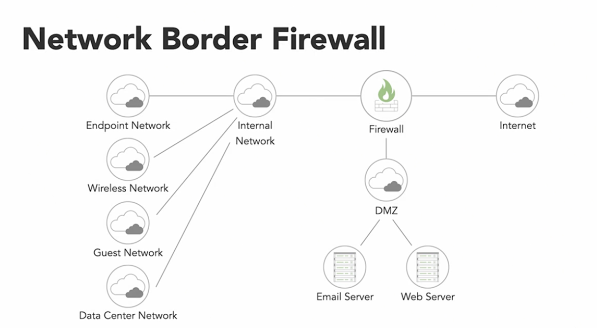
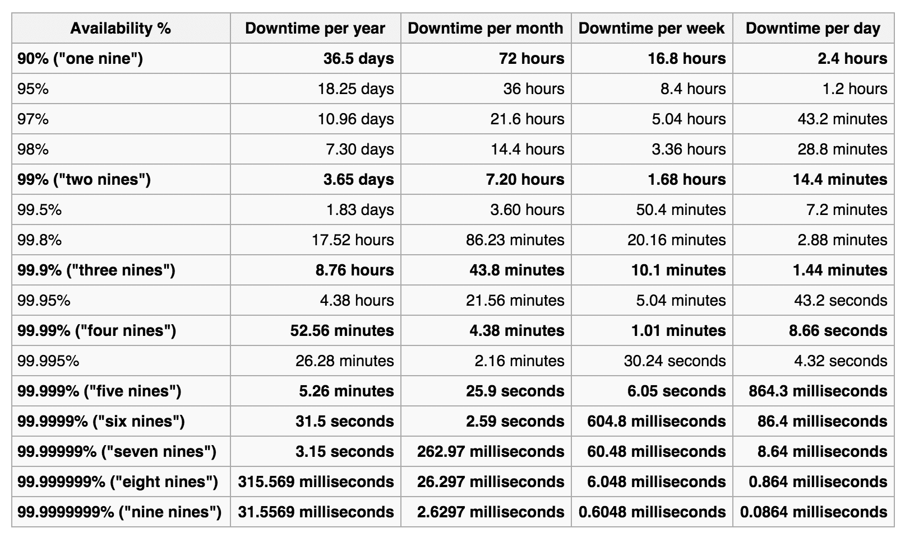
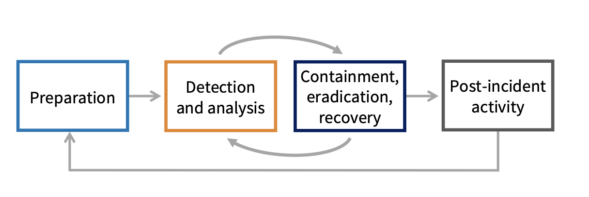
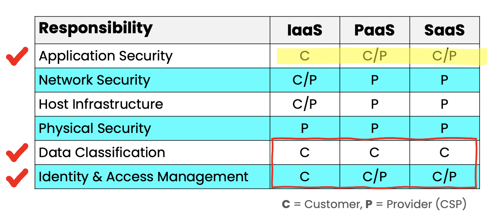
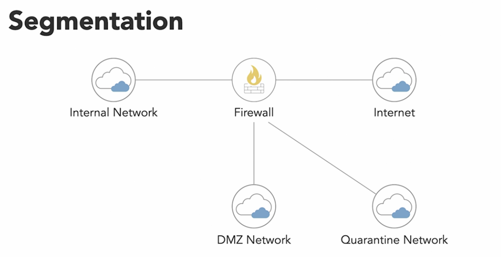
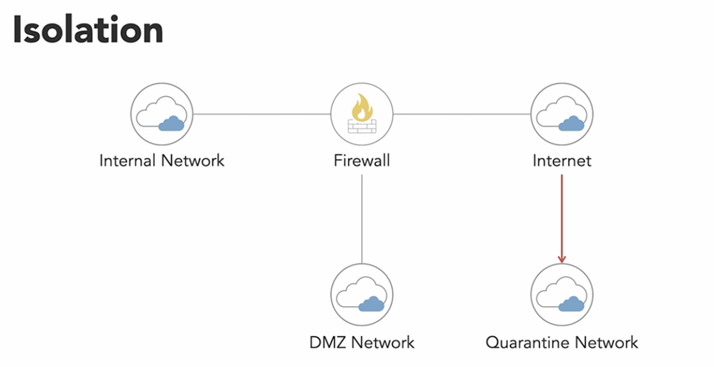
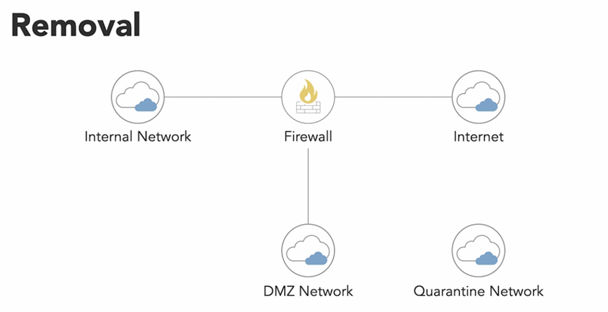
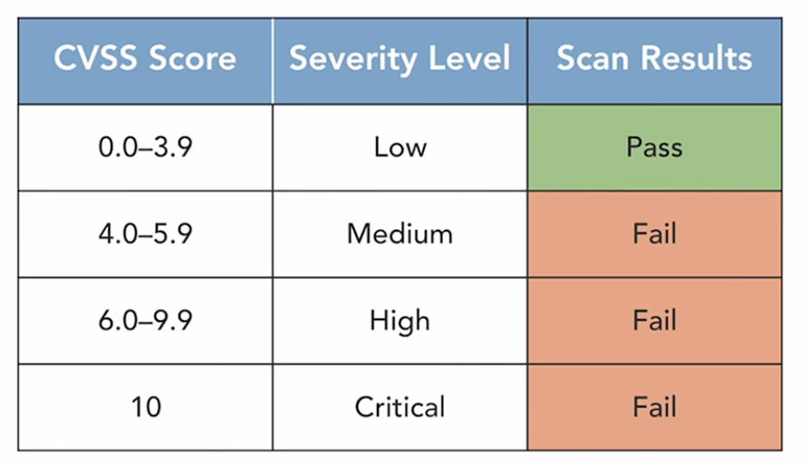

## 5.1 Build and implment physical and logical infrstructure for cloud environment

**Hardware Security**
* Unified Extensible Firmware Interface (UEFI) Secure Boot
    * Validates fireware integrity either by
        1. Checksum Verification
            * UEFI computes a checksum of the binary prior to loading it and verifies that it appears on a list of approved checksums
        2. Signature Verification
            * UEFI verifies the digital signature on a binary and ensures it if from a legitimate source
    * built on a TPM
* Trusted Platform Module (TPM)
    * known as a **Cryptographic Coprocessor**
    * a specialized hardware chip that resides on the motherboard of the device
    * multi-purpose, like storage and management of keys used for full disk encryption (FDE) solutions
    * provides the OS with access to keys, but prevents drive removal and data access
    * virtual TPMs are part of the hypervisor and provided to VMs running on a virtualization platform
    * Unlike a HSM, it is generally a physical component of the system hardware and cannot be added or removed at a later date
    * have BIOS settings that govern specific hardware configurations and security technologies to prevent access to them for the purpose of manipulation.
    * Functions used for
        * Hardware Root of Trust
            * when certificates are used in FDE, they use a hardware root of trust for key storage used in the UEFI process
            * it verifies that the keys match before the secure boot process takes place
        * Protects encryption keys
        * Verifying hypervisor integrity
* Hardware Security Module (HSM)
    * physical computing device that safeguards and managed digital keys, performs encryption and decryption functions for digital signatures, strong authentication and other cryptographic functions
    * like a TPM but are often removable or external
    * key escrow uses an HSM to store and manage private keys
    * HSMs are often certified to the highest international standards for cryptography, such as FIPS-140, and within FIPS-140, the highest level of certification (level 4)
    * Examples: Dedicated HSM (Azure), CloudHSM (AWS), Google KMS (GCP), CloudHSM (GCP) which is a service offering that leverages KMS underneath
    * Government agencies using HSMs must follow the requirements outline in the [Federal Information Processing Standard (FIPS) 140-2](https://nvlpubs.nist.gov/nistpubs/FIPS/NIST.FIPS.140-2.pdf):
        * Outlines security Requirements for Cryptographic Modules
        * Levels
            * Security Level 1
                * Standard operating systems, no physical security
                * appropriate for low level security applciations such as an encryption card in a standard computer
            * Security Level 2
                * EAL2 software and firmware requirements, tamper-evident seals
            * Security Level 3
                * EAL3 software and firmware requirements, tamper-resistent controls such as zeroing out the contents of the HSM when someone attempts to tamper with it
                * also requires authenticating the identity of the operator before granting access to the encryption keys
            * Security Level 4
                * highest FIPS 140-2 level
                * extremely strong requirements including the use of common criteria level EAL4 for the software and firmware
                *  strict physical security controls

**Installation and configuration of management tools**
* Considerations on cloud infra:
    * **Redundancy**
        * any critcally important tool can be a single point of failure (SPOF), so adequate planning for redundancy should be performed
    * **Scheduled downtime and maintenance**
        * downtime may not be acceptable, so these tools may be patched or taken offline for maintenance on a rotating schedule with the migration of live VMs to prevent loss of service
    * **Isolated network and robust access controls** 
        * access to virtualization management tools should be tightly controlled, with adequate enforcement
        * e.g. VPN access, least privilege, encryption, need-to-know
    * **Configuration management and change management**
        * tools and the infra that supports them should be placed under configuration management to ensure that they stay in a known, hardened state
    * **Logging and monitoring**
        * audit trail is important, but logging activities can create additional overhead, which may not be appropriate for all systems

**Virtual Hardware Specific Security Configuration Requirements***
* Software Define Networks (SDN)
    * network architecture approach to enables the network to be intelligently and centrally controlled, or 'programmed', using software
    * has capacity to reprogram the data plane at any time
    * use cas include SD-LAN and SD-WAN
    * seperating the control plane from the data plane opens up a number of security challengs
    * supports CI/CD and micro-segmentation
* Cloud Security Controls - Network
    * segmentation of vnets, both public and private subnets, are important elements of cloud network security
    * Virtual Private Cloud (VPC)
        * virtual network that consists of cloud resources, where VMs for one company are isolated from resources of another company
        * separate VPCs can be isolated using public and private networks
    * Public and Private Subnets
        * environments needs to be segmented public subnets that can access the internet directly (through a firewall) and protected private networks
        * VNets can be connected to other networks with a VPN gateway or network peering
        * for VDI/Client scenerios, a NAT gateway for internet access makes sense
    * Security Groups
        * simialr to an access control list (ACL) for network access
        * distinct rules for inbound/outbound traffic
        * kind of like a firewall
        * Examples: AWS Security Group, Network Security Group (Azure), GCP Firewall
* Virtual Hardware - Specific Security Configuration
    * a vm shares physical hardware with potentially hundreds of other vms
    * for the hypervisor, strict segragation between the guest OS systems running on a single host
    * two main controls:
        * **Configuration**
            * ensure the hypervisor has been configured correctly to provide the minimum necessary functionality
            * disallowing inter-vm network communication if not required
            * encrypting VM snapshots
        * **Patching**
            * customer should patch VMs (IaaS) while CSP patches the hypervisor
            * if patching cant happen immediately, service isolation and restricting access points to services
* Network Storage
    * storage systems have heavy network utilization and therefor should be considered LAN traffic
    * prevalent communications protocol for network-based storage is iSCSI, which allows for the transmission and use of SCSI commands and features over a TCP-based network.
    * Whereas a traditional data center will have SAN (storage area network) setups with dedicated fiber channels, cables, and switches, in a cloud data center this is not possible with the use of virtualized hosts. 
    *  In this case, iSCSI allows systems to use block-level storage that looks and behaves like a SAN would with physical servers, but it leverages the TCP network within a virtualized environment and cloud.
    *  iSCSI also supports a variety og authentication protocols, such as Kerberos and CHAP, gor securing communications and confidentiality within networks.
    * However, iSCSI does support encrypted communications through such protocols as IPSec, and encryption should be used wherever possible to protect communications between virtual machines and storage networks.

**Installation of guest operating system (OS) virtualization toolsets**
* toolsets exist that can provide extended functionality for various guest OS
* example, Hyper-V integration services enhance VM performance and provide several useful features e.g. Guest file copy, time sync, guest shutdown
* In a public cloud, these toolsets will be typically provided by the CSP


## 5.2 Operate and maintain physical and logical infrastructure for cloud environment

**Access Methods and Controls for local and remote access**
* Physical access should be **limited**
    * individuals who manage physical hardware should not have other types of administrative access (sep of duties)
* Methods
    * **Remote Desktop Protocol (RDP)**
        * the native remote access protocol for windows
        * has a gui interface
        * runs on TCP port 3389
        * Exposing RDP to the Internet or outside a protected network is something that should never be done. 
    * **Secure Shell (SSH)** 
        * native remote access protocol for linux operating systems, and common for remote management of network devices
        * operates on TCP port 22
        * has been extended to incorporate many nonsecured protocols such as Telnet, rlogin, rsync, rexec, and FTP and allow them to operate in a secure and encrypted manner, while still maintaining the same functionality.
    * **Secure Terminal/Console-Based Access**
        * a system for secure local access
        * typically a Virtualized KVM (Keyboad video mouse) system with access controls
        * single hardware station that provides phyiscal access to servers, but can easily be switched between those servers by changing a software setting
        * access to the KVM should be logged and routine audits conducted
        * KVMs provide secure access and prevent data loss
        * MFA should be considered for KVM access
        * Security Reqs
            * Isolated data channels
                * each channel connects to one host so that no data can be transferred between connected computers through KVM
            * Tamper warning labels
                * located on each side of the KVM
            * Housing instrusion detection
                * renders the KVM inorperable if the housing has been opened
            * Fixed firmware
                * prevents tampering
            * Tamper-proof circuit boards
            * Safer buffer design
                * no memory buffer to retain data
            * Selective USB access
                * only recognize human interface USB devices, such as keyboards and mice, to prevent data transfer
            * Push-button control
                * require physical access to kvm to switch between between computers
    * **Jumpboxes**
        * as bastion host at the boundary of lower and higher security zones
        * CSPs offer services for this : Azure Bastion, AWS Transit Gateway
    * **Virtual Clients**
        * software tools that allow remote connection to a vm for use as if it your local machine
        * e.g. Virtual Desktop Infrastructure (VDI) for contractors
* Controls
    * **Session Encryption**
        * data transmitted in remote access session must be encrypted using strong protocols suchs as TLS 1.3 and session keys
    * **Strong Authentication**
        * May be combined with cryptographic controls suchs as shared secret key for SSH and/or MFA
    * **Enhanced logging and reviews**
        * all admin accounts should be subject to additional logging and review of activity, and frequent access reviews
        * privilege access solutions in IDaaS often include access reviews
    * **Use identity and access management tools**
        * Many CSPs offer Identity-as-a-Service (IDaaS) that enables strong authentication and access control schemes
        * Ex: Azure Active Directory, Google Identity Services
    * **Single Sign-On (SSO)** 
        * IDaaS solutions enable users to log into other services using their company accounts. Many IDaaS solutions function as an SSO provider
    * **Separate privilege and nonprivilege accounts**
        * general best practice for administrative users is the use of a dedicated admin account for sensitive functions and a standard account for day-to-day use
            * while list in the CBK for CCSP, this is **NOT** always true
        * increasingly, IDaaS solutions offer a Privilege Identity Management (PIM) or Privilege Access Management (PAM) for just-in-time privilege evaluation
            * these solutions typically offer:
                * Temp evaluation of privilege
                * Approval gates
                * an audit trail when privilege is activate
                * an access review process (to avoid permission sprawl)

**Secure Network Configuration**
* Zero Trus Security
    * no entity is trusted by default!
    * addresses the limitations of legacy network perimeter based security model
    * treat user identity as the control plane
    * assumes compromise / breach in verifying every request
    * Zero Trust Network Architecture
        * Network Security Group (NSG)
        * Network Firewalls
        * Inbound / outbound traffic filtering
        * Inbound / outbound traffic inspection
        * Centeralized security policy management and enforcement
* Network Security
    * **VLANs**
        * network segregation
        * includes the isolation og production and nonproduction systems as well as the separation and isolation og application tiers specifically the presentation, application, and data tiers or zones. 
        * With the proper congiguration og machines grouped in a VLAN, they will only see the other servers in the same VLAN, so communication outside the VLAN can be more easily and greatly restricted, while allowing internal server-to-server communications in an easier and more efficient manner.
    * **Network Security Group (NSG)**
        * provide additional layer of security for cloud resources
        * act as a _virtual firewall_ for virtual networks and resource instances (e.g. VMs, databases, subnets)
        * carries a list of security rules (IP and port ranges) that allow or deny network traffic to resource instances
        * provides a virtual firewall for a collections of cloud resources with the same security posture
    * **Segmentation**
        * Restricting services that are permitted to access or be accessbilt from other zones using rules to control in/outbound traffic
        * Rules are enforced by the IP address range of each subnet
        * Within a virtual network, segmentation can be used to achive isolation
    * **Private Subnets**
        * cannot connect directly to the internet (requires a NAT gateway to be set up for outbound connectivity)
        * use one of the following IP address ranges as defined in [RFC 1918](https://datatracker.ietf.org/doc/html/rfc1918):
            * **10.0.0.0 - 10.255.255.255 (10/8 prefix)**
            * **172.16.0.0 - 172.31.255.255 (172.16/12 prefix)**
            * **192.168.0.0 - 192.168.255.255 (192.168/16 prefix)**
        * all other IP address ranges, except the APIPA _169.254.x.x_, are public addresses.
    * **Transport Layer Security (TLS)**
        * replace Secure Sockets Layer (SSL) as the default acceptable method for traffic encryption across a network
        * use x.509 certificates to provide authenticaiton and encrypt communications sent over the connection between two parties
        * two layers
            * **TLS Handshake Protocol**
                * negotiates and establishes the connection between two parties and enables the secure communications channel to then handle data transmissions
                * protocol exchanges all information needed by several messaging exchanges containing information and status codes for key exchange and establishes a session ID for the overall transaction
                * certificates are used at this stage to authenticate and establish the connection to the satisfaction of both parties
                * encyrption algorithms are negotiated
                * handshake is completed before any data is transmitted
            * **TLS Record Protocol**
                * actual secure communications method for the transmitting of data
                * responsible for the encryption and authentication of packets throught their transmission between the parties and in some cases it also performs compression of the packets
                * limited to just operations of sending and recieving
                * handshake can hold the secure communications channels, at which point, the record protocol will, as needed, ultilize send and recieve functions for data transmission
                * relies entirely on the handshake protocol for all parameters used during its transaction and function calls
* Security Zones:
    * **Network Boarder Firewall**:
        * 
            * Three network interaces (NICs)
                * One connects to the internet or untrusted network
                    * Which is the is the interface between the outside world and the protected networks
                    * Blocks inbound connections unless it matches org policies
                * Second connects to the org’s intranet or internal network
                    * May be subdivided into segments for endpoint systems, wireless networks, guest networks, data center network, other business needs
                * Third is for the Demilitarized ZONE (DMZ)
                    * Place systems that must accept connections from the outside world mail or web servers
                    * Isolates systems due to higher risk of comprise
                    * Protects internal network from compromise DMZ
                    * knows as *screened subnet* because a subnet is placed between two routers or firewall bastion host(s) are located with that subnet
    * Other networks
        * **Extranet**
            * Special intranet segment accessible by outside parties and/our business partners
            * Connect using a vpn
        * **Honeynets**
            * Decoy networks setup to allure hackers
            * used to identify and study attackers
        * **AdHoc networks**    
            * Temp networks that may bypass security controls
            * Ex: Someone set up a wired/wireless network outside standard sec design
* Traffic
    * **East-West**
        * traffic moves laterally between servers within a data center
    * **North-South**
        * traffice moves between systems in the data center and the internet 
    * Some traffic may be filtered through a firewall if it crosses security zones
* Virtual Private Network (VPN)
    * extends private network across a public network
    * enabling users and devices to send and recieve data across shared or public networks as if their computing devices were directly connected to the private network
    * IPSec can add 100 bytes or more to each transmitted packet in overhead, so on a large network with substantial traffic, the impact on resources can be enormous.
    * **Split tunnel**
        * using VPN for traffic destined for the corporate network only
        * internet traffic is direct through its normal route
    * **Full tunnel**
        * using VPN for all traffic, both to the internet and corporate network
    * **Site-to-Site**
        * IPSec use an always on mode where both packet header and payload are encrypted (IPSec Tunnel Mode)
        * Tunnel Mode - encrypts the entire original packet and provides a new header (supports NAT traversal (NAT-T))
    * **Remote Access**
        * connection is initiated from a users PC or laptop for a connection of shorter duration (IPSec Transport Mode)
        * IPSec Tranpsort Mode - Only encrypts part of the original packet (data)
* Virtual Local Area Network(VLAN)
    * a collection of devices that communicate with one another as if they made up a single phyiscal LAN
    * creates a distinct broadcast domain
    * tagging data with a VLAN ID whcih network devices recognize and are able to used to keep data sperate
    * Cloud VPCs take the form of a dedicated VLAN for a specific user organization, which means other cloud tenants are blocked from accessing resources in the VPC
    * Enable VLAN prunning which removes unsued VLANs
    * Disable unnescessary protocols on switches
* VPC Connectivity
    * connect a VPN using Layer 2 [Tunneling Protocol(L2TP)](https://en.wikipedia.org/wiki/Layer_2_Tunneling_Protocol)/IPSec with a VPC gateway (aka transit gateway)
        * common for hybrid connectivty
    * Network peering is another method
        * more common option between cloud networks
* DNS Security Extensions (DNSSEC)
    * Domain Name System (DNS) Servers
        * translates domain names into IP addresses
        * Locking down DNS servers and disabling zone transfers are best practices
        * Network layer function leveraging UDP port 53
        * DNS Resolution
        
        * DNS is a hierachical system
            * organizations designate servers that are authoritative for their domains
        * DNS queries happen behind the scenes and users never see them
        * Use the command line tool **dig** to perform DNS looks up manually:
        ```
            ~ % dig linkedin.com

            ; <<>> DiG 9.10.6 <<>> linkedin.com
            ;; global options: +cmd
            ;; Got answer:
            ;; ->>HEADER<<- opcode: QUERY, status: NOERROR, id: 35454
            ;; flags: qr rd ra; QUERY: 1, ANSWER: 1, AUTHORITY: 0, ADDITIONAL: 1

            ;; OPT PSEUDOSECTION:
            ; EDNS: version: 0, flags:; udp: 1220
            ;; QUESTION SECTION:
            ;linkedin.com.			IN	A

            ;; ANSWER SECTION:
            linkedin.com.		299	IN	A	13.107.42.14

            ;; Query time: 32 msec
            ;; SERVER: 64.71.255.204#53(64.71.255.204)
            ;; WHEN: Fri Jun 02 08:24:34 EDT 2023
            ;; MSG SIZE  rcvd: 57
        ```
        * some content filters alter DNS query results
    * DNSSec
        * security extension to the regular DNS protocol and services that allows for the validation of integreity of DNS lookups
        * does not address confidentiality or availability, though, at all
        * leverages digital signatures for cryptographic autentication of DNS records (zone signing)
        * provides proof of orgin and makes cache poisoning and spoofing attacks more difficult
        * however does not provide confidenitality as the digital signatures rely on publicly decryptable information
        * It allows for a DNS client to perform DNS lookups and validate both their origin and authority via the cryptographic signature that accompanies the DNS response. 
        * When a client makes a request for a DNS lookup, the digital signature can validate the integrity of the DNS record, while otherwise performing the typical way DNS records are processed and cached, so modifications to applications and code are not required for the use of DNSSEC.
        * Will NOT prevent or mitigate DoS attacks on the DNS servers, it can be used to greatly mitigate or eliminate common integrity attacks
    * Threats to DNS
        * Footprinting
            * An attacker attempts to gather all DNS records for a domain via zone transfer in order to map out the target environment
        * Denial of Service (DoS)
            * Attackers flood DNS servers to prevent them from responding to legitimate DNS requests
        * Redirection
            * An attacker redirects queries to a server that is under the attacker's control
        * Spoofing
            * An attacker provides incorrect DNS information for a domain to a DNS server, which then gives out that incorrect information (also known as a DNS poisoning)
            * DNSSEC help in migitating this as the DNS record can be validated to come from the officially signed and registered DNS zone, and not from a rogue DNS server or other process attempting to inject malicious traffic into the data stream.
* Internet Protocol (IP)
    * Routes information across networks
    * Provides and IP addressing scheme
    * Delivers packets from source to destination
    * Network layer (OSI model) protocol
    * Supports transport layer protocols that have high level responsibilities
        * Two main transport layer protocols
            * Transmission Control Protocol (TCP)
                * connection-oriented protocol
                * guarrantees delivery through acknowledgement
                    * three way handshake
                * widely used for critical applications suchs as email
                * TCP Flags
                    * SYN: opens a connections
                    * FIN: closes a connection
                    * ACK: acknowledges a SYN or FIN
                * Handshare process
                /images/tcp-handshake.png)
                    * SYN: 
                        * First phase
                        * Message is sent to the receiving system
                        * Each packet sent is assigned the _initial sequence number (ISN)_
                    * SYN/ACK
                        * Second phase
                        * Message is acknowledging the first message but at the same time is indicating its ISN
                    * ACK
                        * Final Phase
                        * Acknowledgement that the packet sent in the second phase has been received
                * Disonnecting from a TCP Session
                    * System that wants to disconnect from the conversation sends a _FIN_ flag to signal they want to terminate the connection
                    * The Receiving system replies with an ACK and send its own FIN flag. Which the starting system send an ACK to complete the disconnection
                    * Known as the “polite” way to disconnect
                    * The “impolite” manner is to use the RST (reset) flag, this is like hanging up a phone
                /images/tcp-disconnect.png)
                * Other TCP Flags
                    * _PSH_: "Push" flag is designed to force data on an application
                    * _URG_: "Urgent" flag specifies that a packet is an urgent packet
            * User Datagram Protocol (UDP)
                * is lightweight, connectionless protocol
                * dosen't send acknowledgments or guarrantee delivery
                * used for voice/video
* Dynamic Host Configuration Protocol (DHCP)
    * a client/server protocol that automatically provides an Internet Protocol (IP) host with its IP address and other related configuration information such as the subnet mask and default gateway.
    * IP Addresses uniquely identifies systems on a network
    * IPV4 is Written in the dotted quad notation, four numbers separated by periods (192.168.200.1)
        * Range 0 - 255
            * 8-bit binary numbers
            * 2<sup>8</sup> = 256 possible values
            * Start counting at 0
    * Must no be reused on internet-connected systems
    * May be reused if on private networks
    * If a system requires the internet then a Network Address Translation (NAT) server is required .. most modern modems (ISPs) provide this functionality
    * Subnets
        * Ex: 192.168.1.100
            * Network Address (192.168)
            * Host Address (1.100)
        * Subnetting (splitting addresses into smaller pieces)
            * [Subnetting Made Easy](https://www.youtube.com/watch?v=nFYilGQ-p-8&pp=ygUKU3VibmV0dGluZw%3D%3D)
    * Classes
    /images/ip-address-classes.png)
            * Class A has up to 2<sup>24</sup>-2 = 16,777,214 hosts per Network
            * Class B has up to 2<sup>16</sup>-2 =  65,534 hosts per network
            * Class C has up to 2<sup>8</sup>-2 254 hosts per network
    * IPV6
        * replaces IPV4 due to address exhaustion
        * uses 128 bits (compared to 32 for v4)
        * Divided into eight 16-bit groups, each separated by a colon (:)
            * Example: `fd02:24c1:b942:01f3:ead2:123a:c3d2:cf2f`
        * Not case sensitive, no leading zeros at the the beginning
        * You can replace consecutive zeros with double colons (::) when referencing an address that has a group of zeros
    * Static IPs
        * Manually assigned to systems by administrators
        * Must be unique and within the appropriate range for the network
        * Typically servers are assigned static Ips
    * Dynamic IPs
        * Using Dynamic Host Configuration Protocol (DHCP)
            * Allows automatic assignment of IP addresses from an administrator-configured pool of IP address
    * End user machines using dynamic IPs
    * Public Addressing
        * centrally managed by a group known as the Internet Corporation for Assigned Names and Numbers (ICANN)
        * ICANN breaks addresses up into blocks and gives them out to regional authorities in different countries for ditribution
            * Example:
                * American Registry for Internet Numbers (ARIN)
                    * governs the distribution of IP addresses in the US and Canada
        * IPv4 allows for 4.3 billion possible addresses, but there are currently at least 7.4 billion mobile devices in the world
    * Private Addressing
        * three different ranges that can be used
        * use one of the following IP address ranges as defined in [RFC 1918](https://datatracker.ietf.org/doc/html/rfc1918):
            * **10.0.0.1 - 10.255.255.255 (10/8 prefix)**
            * **172.16.0.1 - 172.31.255.255 (172.16/12 prefix)**
            * **192.168.0.1 - 192.168.255.255 (192.168/16 prefix)**
        * all other IP address ranges, except the APIPA _169.254.x.x_, are public addresses.

**Open Systems Internconnection Model (OSI)**
* Developed by the International Organization for Standardization (ISO) in 1984
* 7 layer architecture which all work collectively to transmit data
* https://www.geeksforgeeks.org/layers-of-osi-model/
* /images/OSI-Model.png)

**Transmission Control Procol/Internet Protocol (TCP/IP) Model**
* Designed in the 1960s by the Department of Defense (DoD)
* Based on standard protocols
* Concise version of the OSI model
* Contains 4 Layers
* Sometimes reffered to as five or four 
* the Physical and Data Link Layers are referred to as the Physical or Network Interface Layer in the the 4 layer reference
* Does not consider security

**OSI Model vs TCP Model**
/images/OSI-TCP.png)

**Network Ports**
/images/network-ports.png)
* Particular location on a network
    * Similar to apartment numbers, IP address is the street address
* 16 bit binary number
* 2<sup>16</sup> = 65,536 possible values
* Start counting at 0
* 0 - 65,535
* 0-1,023: well-known ports
    * Web servers use 80 or 443
* 1,024-49,151: registered ports
    * SQL server: 1433
    * Oracle : 1521
* 49,152 - 65,535: dynamic ports
    * Apps use temporarily
* Common Ports
    * Port 20/21: File transfer protocol (FTP)
        * Port 21 carries the FTP command from one system to another
        * Port 20 is responsible for transferring the data between two hosts in an FTP session
    * Port 69 (UDP): Trivial File Transfer Protocol (TFTP)
        * Supports only reading and writing to files
        * Uses UDP as the transport protocol
        * Typically used to copy router and switch configuration from device to the TFTP server
        * Can be used to boot a device by loading the configuration 
    * Port 22: Secure Shell (SSH)
    * Port 23: Telnet
        * Allows a client to run or emulate the program running on the server
    * Port 3389: Remote Desktop Protocol (RDP)
    * Port 137,138, and 139: NetBIOS (Windows only) 
    * Port 53: Domain Name Service (DNS)
    * Mail Related Ports
        * Port 25 (unencrypted), 465 (encrypted): Simple Mail Transfer Protocol (SMTP)
        * Port 110 (unencrypted), 995 (encrypted port): Post Office Protocol (POP)
        * Port 143 (unencrypted), 993 (encrypted): Internet Message Access Protocol (IMAP)
    * Port 80: Hypertext Transfer Protocol (HTTP)
    * Port 443: HTTPS → adds TLS to HTTP

**Internet Control Message Protocl (ICMP)**
* OSI Layer 3 (Network) protocol
* mainly used to determine whether or not data is reaching its intended destination in a timeline many
* used on network devices such as routers
* crucial for error reporting and testing
* ping, traceroute are utility tools that leverge this protocol
* connectionless protocol
* Common ICMP Type Codes
    * /images/icmp-codes.png)
* Command Line Network Tools:
* ping
    * Checks if a system responds
    * Uses ICMP
    * System that initiates the ping sends an `ICMP Echo Request` packet to the target, the remote/target system then responds with an `ICMP Echo Reply` to that ping request
    * Used for troubleshooting
        1. Ping the remote system
        2. Ping another system on the internet
        3. Ping a system on local network
        4. Try the same process from a diff computer
    * `$ ping 10.0.0.2`
    * `$ ping www.google.com`
    * Not all systems respond to ping
        * Blocking ICMP traffic firewall
    * Request Flow
        * /images/ping-req-flow.png)
* hping
    * similar to standard ping command
    * creates customized ping requests
    * http://wiki.hping.org/
    * No longer actively developed anymore but still works
* traceroute
    * Allows tracing the flow between two systems
    * Outpute shows all the hops the packets take until it reaches the target system
        * Lines that appear with `* * * *` means systems are located on the path to the target system but aren't responding to the ICMP request
        * Works on both Windows and MacOS, for windows use `tracert`
    Example: `$ traceroute www.linkedin.com`
* pathping
    * Windows only command which combines ping and tracert functionality

        
**Network Security Controls**
* Bastion Host
    * a host used to allow administrators to access a private network from a lower security zone
    * will have a network interface in both the lower and higher security zones
    * will be secure at the same level as the higher security zone it's connected to
    * also known as 'jumpbox' or 'jump server'
    * CSP example: Azure Bastion, AWS Transit Gateway
* Firewalls
    * Stateless and stateful
    * Application, host, and virtual
    * WAF
    * Next Gen
* Intrusion Detection Systems (IDS) 
    * designed to analyze network packets, compare their contents or characteristics against a set of configurations or signatures, and alert personnel if anything is detected that could constitute a threat or is otherwise designated for alerting.
    * passive
    * often generates a large number of false positives
    * Types
        * Host Instrusion Detection System (HIDS)
            * runs on a single host and only does analysis of packets for that host (inbound/outbound)
            * typically monitors critical system files and configs for modification
        * Network Intrusion Detection System (NIDS)
            * placed at various points in a network and can analyze all network traffic for the same threats
* Intrusion Prevention Systems (IPS)
    * works in the same way as an IDS except being reactive in nature and can immeidately and automatically stop and prevent attacks as they occur instead of being passive
    * does deep analysis of network packets, has variety of methods available to block or terminate something that it determines to be an attack
    * Types
        * Host Intrusion Prevention System (HIPS)
        * Network Intrusion Prevention System (NIPS)

**Operating system (OS) hardening through the application of baselines, monitoring and remediation**
* Baseline/Secure Configuration Guides
    * Concepts
        * Control
            * a high-level description of a feature or activity that needs to be addressed and is not specific to a technology or implementation
        * Benchmark
            * contains security recommendations for a specific technology, such as a VM
        * Baseline
            * the implementation of the benchmark on the individual service
            * an agreed-upon set of attributes for a product
* OS Hardening
    * the configuration of a machine into a secure state through application of a configuration baseline
    * baselines can be applied to a single VM image, or to a VM template created that is then used to deploy all VMs
    * a hardened VM image may be customer-defined, CPS-defined, or from a third-party, often available through a cloud marketplace
        * [Center for Internet Security (CIS)](https://www.cisecurity.org/) offers hardened VM images in CSP marketplaces
    * Concepts
        * Open ports and services
            * listening ports should be restricted to those necessary, filtered to restrict traffic, and disabling some ports entirely if unneeded
        * Registry
            * access should be restricted, and updates controlled through policy where possible
            * always take a backup of the registry before you start making changes
        * Disk encryption
            * drive encryption can prevent unwanted access to data in a variety of circumstances
            * use Bitlocker or dm-crypt
        * OS
            * os hardening can often be implemented through security baselines
            * can be applied through group policies or management tools like MDM
    * Baseline Options
        * Vendor-supplied
            * Microsoft, VMware, and some linux creators offer configurations guidelines for their products that point out specific security options and recommended settings
        * DISA STIGs
            * the US Defense Information Systems Agency (DISA) produces baseline documents know as Security Technical Implementation Guides (STIGs)
            * MAY include configurations that are too restrictive for many organizations
            * https://www.titania.com/resources/guides/disa-stig-compliance-explained/
        * NIST checklists
            * National Institute of Technology and Standards maintains a repository of configuration checklists for various OS and application software
            * https://ncp.nist.gov/repository
        * CIS Benchmarks
            * Center for internet security (CIS) publishes baseline guides for a variety of operating systems, applications, and devices, which incorporate many security best practices
            * CIS benchmark scripts are priced based on environment size
            * https://www.cisecurity.org/cis-benchmarks
        * [OpenSCAP](https://www.open-scap.org/)
            * suite of tools to perform security compliance scanning & audits


    
**Patch Management**
* the process of identifying, acquiring, installing and verifying patches for products, applicartions and systems
* ensures that systems are kept up-to-date with current patches
* process will evaluate, test, approve, and deploy patches
* system audits verify the deployment of approved patches to the system
* patch both native OS and 3rd party apps
* apply out-of-band updates prompty
    * An emergency software modification that is being deployed immediately and prior to the next routine update.
* patch management plan should be developed to manage the installation of patches
    * this plan should be part of the configuration management process
    * test patches before deployment
* patch management process should adress:
    * vulnerability detection
    * vendor patch notifications (sing up)
    * patch severity assessment by the organization
    * change management
    * customer notification (if required)
    * verification of successful patching
    * risk management in case of unexpected outcomes after applying patches (roll back plan)
* Windows
    * Windows Server Update Service (WSUS) 
        * toolset to perform patch management
        * the tool downloads patches and hotfixes from Microsoft's servers, and then administrators can use it to update the Window machines under their control in a centrallized and automated way
        * free service and a component of windows
    * Microsoft Deployment Toolkit (MDT)
        * a collection of tools and processes to facilitate the automation of server and desktop deployments through the use of system images
        * can also be used in a configuration management and security management role
        * often used to complement WSUS
* Linux
    * Not all Linux distros contain the same toolsets, utilities, applications, or configuration paradigms, so while the overall methodology for Linux will be consistent, the specific application of it will often be dependent on the distro to some extent.
* VMware
    * comes with the vSphere Update Manager (VUM) utility which can be used to automate patches of both vSphere hosts and virtual machines running under them
* [NIST SP 800-40](https://csrc.nist.gov/publications/detail/sp/800-40/rev-4/final) - Guide to enterprise patch management
* Challenges
    * Lack of standardization of patches
    * Collaboration between mulitple systems owners
    * Many moving parts (complexity)
    * Patches must be tested before deployment
    * VM's in a suspended state are not patched
    * Mulitple timezones (applying patches at the same local time)
* Blanket approvals could be given for applying patches which address iminent risks, allowing these patches to bypass standard change management process


**Infrastructure as Code (IaC) Strategy**
* IaC Definition
    * management of infrastructure described as code
* just as the same source code generates the same binary, code in the IaC model results in the same environment every time it is applied
* key DevOps practice and is used in conjunction with CI/CD
* Cloud-Native Controls
    * built-in tooling like Azure Resource Manager (ARM), AWS Cloud Formation, GCP Deploymenet Manager for tighter integration
* Third-Party Solutions
    * more flexibility, functionality, multi-platform support
    * i.e Terraform, Pulumi
* Two distinct characteristics
    * Declarative
        * must know the current state
        * must know whether the infrastructure already exists in order to know what to create and what not to create
    * Idempotent
        * can be applied multiple times without changing the results

**Availability of Standalone Hosts**
* physical host is isolated in what it does from other systems
* operates independently of others

**Availability of Clustered Hosts**
* Cluster advantages include high availability via redundancy, optimized performance via distrabuted workloads, and the ability to scale resources
* **Cluster Management Agent**
    * often part of the hypervisor or load balancer software
    * responsible for mediating access to shared resources in a cluster
    * **Reservations** are guarrantees for a certain min level of resources available to a specified VM
    * A **limit** is a max allocation
    * A **share** is a weighting given to a particular VM
        * Share value is used to calculate percentage-based access to pool resources when there is contention
* **Distributed Resource Scheduling (DRS)**
    * the coordination element in a cluster of VMWare ESXi hosts
    * mediates access to the physical resources
    * handles resources available to a cluster, reservation and limits for the VMs running on the cluster, and maintenance features
    * allows reassignment/balance of workloads between resources pools (VMotion)
    * Anti-affinity rules keeps VMs on separate hosts
    * Affinity rules can be used to keep VMs on the same host
* **Dyanmic Optimization (DO)**
    * Shifts workloads automatically
    * is Microsft's DRS equivalent delivered through their cluster management software
* **Maintenance mode**
    * allows for seemless repairs
    * admins remove resources from shared pools to perform maintenance, cluster reallocates workloads to active servers while the maintenance is performed
* **Storage Clusters**
    * pooled storage, providing reliability, increased performance, or possibly additional capacity
    * RAID and snapshoting
* Availability is measured in a percentage known as "nines"


**Availability of guest operating system (OS)**
* Guest OS availability
    * once a vm is created in IaaS, the CSP no longer has direct control over the OS
    * customer can use baselines, backups, and cloud storage features to provide resiliency of the guest OS
* Backup and recovery
    * setting up and configuring snapshots
    * CSPs offer backup features for VMs in the IaaS model
* Resiliency
    * achieved by architecting systems to handle failures from the outset rather than needing to be recovered
    * ex: virtualization host clusters with live migration provides resiliency

**Performance, Capacity, and Hardware Monitoring**
* Monitoring performance and capacity is **critical**
    * Changes in performance can indicated **failing hardware**
    * Unmonitored capacity could allow for total consumption of resources, which can lead to **resource starvation** and a **serious impact on performance**
* CSP should implement monitoring to ensure that they are able to meet customers demands and promised capactity
* CORE 4 Monitoring should include utilization, performance and availability of (applies to both CSP and customers):
    1. CPU
    2. Disk
    3. Memory
    4. Network
* alerts should be generated based on established thresholds and appropriate plans initiated (applies to both CSPs and customers)
* Key Metrics
    * CPU utilization
    * Memory consumption & utilization
    * Network bandwidth
        * excessive dropped packets on NIC
    * Service response time
* Administrators should monitor for:
    * Underprovisioned Services
        * demand exceeds capactity
        * services should be upsized to meet changing demand
    * Overprovisioned Services
        * capacity exceed demands
        * services should be downsized to reduce costs
* Hardware Monitoring
    * Should monitor
        * Fan speeds
        * Failed drives or drive errors
        * CPU, memory, cards
        * Network devices
    * Environmental
        * HVAC, temperature and humidity monitoring are important

**Backup and Restore Functions**
* Host configuration data should be included in backup plans
* Routine tests should be conducted to test the restorability of backup data
    * individual file recovery
    * entire vm image recovery
    * increases the likelihood of a successful BCDR failover
* Biggest challenge 
    * understanding the extent to which you have access to the hosts and what configuration can be changed
        * **Control**
            * In the cloud we make changes through a management interface, be we don't see what happens in the background.
            * We must be confident the changes we make are the only changes occuring
        * **Visibility**
            * The ability to monitor data and how it's being accessed
            * This is why test is so **critical**

**Management Plane**
* Provides access to manage:
    * **Hardware** - through baseline configurations
    * **Logical** - Task scheduling, resource allocation, software updates
    * **Networking** - Network management, routes, access lists, security groups, virtual switches, VLANs
* Provides virtual management options analogous to physical admin options of a legacy datacenter
    * e.g. power VMs on/off, provisioning virtual infra for VMs like RAM and storage
* **Orchestration** is the automated configuration and management of resources in bulk
    * patch management and vm reboots are commonly orchestrated tasks
* **Scheduling of resources** through distributed resource scheduling (DRS)
* **Maintenance** such as software updates and patching
* **Management Console** is the web-based consumer interface for managing resources
* High Risk and must be protected with:
    * Access control
    * Logging
    * Isolated network


## 5.3 Implment Operation Controls and Standards (e.g., Information Technology Infrastructure Library (ITIL), International Organization for Standardization/International Electrotechnical Commission (ISO/IEC) 20000-1)

**ISO/IEC 20000-1**
* Definition:
    * _"specifies requirements for "establishing, implementing, maintaining and continually improving a service management system (SMS)"_
    * supports management of service lifecycle, including planning, design, transition, delivery and service improvement
    * links:
        * https://en.wikipedia.org/wiki/ISO/IEC_20000
        * https://www.iso.org/standard/70636.html

**The ITIL Model**
* [Information Technology Infrastructure Library (ITIL)](https://www.axelos.com/best-practice-solutions/itil) is set of best practices for IT managment
* analyzes the work of info tech organizations and divides it into 34 practices that organizations should consider implementing, which are divided into 3 categories:
    * General Management
        * 14 practices
            * Stategy management
            * Portfolio management
            * Architecture management
            * Service financial management
            * Workforce and talent management
            * Continual improvement
            * Measurement and reporting
            * Risk management
            * Information security management
            * Knowledge management
            * Organizationl change management
            * Project Management
            * Relationship management 
            * Supplier management
    * Service Management
        * 17 Practices
            * Business analysis
            * Service catalog management
            * Service design
            * Service level management
            * Availability management
            * Capactity and performance management
            * Service continuity management
            * Monitoring and event management
            * Service desk
            * Incident management
            * Service request management
            * Problem management
            * Release management
            * Change management
            * Service validation and testing
            * Service configuration management
            * IT asset management
    * Technical Management
        * 3 practices
            * Deployment management
            * Infrastructure and platform management
            * Software development and management

**Change Control**
* process of evaluating a change request to decide if it should be implemented
* requests are sent to the **Change Advisory Board (CAB)** to ensure that it is beneficial to the company
* requires changes to be requested, approved, tested, and documentation
* Guided by **Change Management Process**

**Change Management**
* [ISO 9001:2015](https://www.iso.org/standard/62085.html)
    * specifies requirements for a quality management system
* policy that details how changes will be processed in an organization
* helps reduce outages or weakened security from unauthorized changes
* **Versioning** uses a labelling or numbering system to track changes in updated versions of software
* Request for Change (RFC)
    * ticket containing all relevant details of the change being requested, included testing results
* Change Advisory Board (CAB)
    * committee that reviews the RFC tickets and approve/denies large and significant changes
    * made up of representatives from throughout the organization with different roles
* Change Manager
    * plays a significant role with the CAB, but in most instances can approve only minor or corrective changes, without having to go through the full process with the CAB.
* Automating change management
    * change reviews in CI/CD and IaC may be partially automated when new code is ready for deployment
    * reduces operational overhead and human error, reduces security risk, and enables more frequent releases while maintaining a strong security posture
* Objectives
    * Respond to changing business requirements while minimizing incidents and distruption
    * Ensure changes are documented in a change management system
    * Ensure changes are proritized, planned, and test
    * Reduce overal business risk

**Continuity Management**
* concerned with **availability** aspect of the CIA triad
* various standards related to continuity management
    * [NIST Risk Management Framework](https://csrc.nist.gov/projects/risk-management/about-rmf)
    * [ISO/IEC 27000](https://www.iso.org/standard/73906.html)
    * Both deal with business continuity and disaster recovery terms that fall under the larger category of continuiting management
    * [Health Insurance Portability and Accountability Act (HIPAA)](ttps://www.cdc.gov/phlp/publications/topic/hipaa.html)
        * standard that governs how healthcare data is managed in the US
        * manadates adequate data backups, DR planning and emergency access in the the event of a system interruption
    * [ISO/IEC 22301-2019 Security and resilience - BC Management Systems](https://www.iso.org/standard/75106.html)
        * specifies the requirements needed for an organization to plan, implement and operate, and continually improve the continuity capability
* prioritized list of systems and services must be created and maintained
    * the list is created through a buisness impact analysis which identifies the systems and services that are critical to the business
* Continuity Management Plan
    * Defines events that will put the plan in motion
    * Defines roles/responsibility
    * Defines continuity and recovery procedures
    * Specifies which notifications are required to be sent
    * Specifies requirements for the capabilities and capacity of backup systems
* should be tested regularly

**Information Security Management**
* ensure a consistent organizational approach to managing security risks
* preserving the entire CIA triad for their systems
* Standards that provide guidance for implementing and managing security controls in a cloud environment include:
    * [ISO/IEC 27001](https://www.iso.org/standard/27001)
        * global standard for info sec management that helps organizations protect their data from threats
    * [ISO/IEC 27017](https://www.iso.org/standard/43757.html)
        * sec standard developed for cloud service providers and users to make a safer cloud-based environment and reduce the risk of security problems
    * [ISO/IEC 27018](https://www.iso.org/standard/76559.html)
        * first international standard about the privacy in cloud computing services
        * Code of practice for protection of PII in public clouds acting as a PII processor
    * [ISO/IEC 27701](https://www.iso.org/standard/71670.html)
        * extends the ISMS guidance in 27001 to manage risks related to privacy, by implementing and managing a privacy information management system (PIMS)
    * [NIST RMF](https://csrc.nist.gov/projects/risk-management/about-rmf)
        * MANDATORY
        * audience is the entire federal government
        * addresses cybersecurity risk management
    * [NIST SP 800-53](https://csrc.nist.gov/publications/detail/sp/800-53/rev-5/final)
        * gov focused guidance and follows FIPS 200
        * provides a catalog of security and privacy controls for all US fed information systems except those related to national security
    * [NIST Cybersecurity Framework (CSF)](https://www.nist.gov/cyberframework)
        * VOLUNTARY
        * audience is aimed at commerical businesses
        * addresses cybersecurity risk management
    * [Association of International Ceritfied Professional Accountants (AICPA) SOC 2](https://us.aicpa.org/interestareas/frc/assuranceadvisoryservices/aicpasoc2report)
        * Service Organizations Controls (SOC 2) framework has seen wide adoption among CSPs as well as the use of a third party to perfrom audits
        * provides increased assurance for business partners and customers who cannot audit the CSP directly
* Organization should have a documented Info Sec Management Plan that covers
    * Security policies
    * Security management
    * Asset management
    * Physical security
    * Access control
    * Information system development, maintenance, and acquisition

**Continual Service Improvement Management**
* one critical element includes areas of monitoring and measurement
* [ISO/IEC 20000](https://en.wikipedia.org/wiki/ISO/IEC_20000)
    * Continual Improvement
* taking form of security metrics
* metrics need to be tailored to the audience they will be presented to, which often means "executive friendly"
* metrics should be used to aggregate information and present it in an easily understood, actionable format

**Incident Management**

* **Events** are any observable item, including routine actions such as a user successfully logging into a system.
* **Incidents**, by contrast, are events that are _unplanned_ and have an adverse impact on the organization
    * Not all incidents will require the security team
    * All incidents should be investigated and remediated to restore the organization's normal operations and to minimize adverse impact
* Six phases as per [SANS 504-B](https://www.sans.org/media/score/504-incident-response-cycle.pdf)
    1. Preparation
        * where the incident response plans are written, and configurations documented
    2. Identification
        * Determining whether or not an organization has been breached
    3. Containment
        * limiting damage (scope) of the incident
    4. Eradication
        * Once affected systems are identified, coordinated isolation or shutdown, rebuild, and notifications
    5. Recovery
        * Root cause is addressed and time to return to normal operations is estimated and executed
    6. Lessons Learned
        * helps prevent recurrence, improve IR process
* [NIST SP 800-61 rev2](https://csrc.nist.gov/publications/detail/sp/800-61/rev-2/final)
    * "Compute Security Incident Handling Guide"
    * popular security incident management methodology
    * See 5.6 for deeper details
* [ISO/IEC 27035](https://www.iso27001security.com/html/27035.html)
    * 3 Part specification for Information Security Incident Management
    * **ISO/IEC 27035-1:2023 - Principles and Process**
        * outlines concepts and principles underpinning info sec incident management and introduces the remaining part/s of the standard. Describes an info sec incident management process consisting of five/six phases and how to improve the process
    * **ISO/IEC 27035-2:2023 - Guidelines to plan and prepare for incident response**
        * provides guidelines and concerns assurance that the organization is in fact ready to respond appropriately to info sec incidents that may occur
    * **ISO/IEC 27035-3:2020 - Guidelines for ICT incident response operations**
        * provides guidelines for info sec incident response in ICT security operations
    * DRAFT
        * **ISO/IEC 27035-4 - Coordination**
            * provides guidelines for coordination among Incident Response Teams (IRTs) of multiple organizations to work together to handle info sec incidents


**Problem Management**
* [ISO/IEC 20000](https://en.wikipedia.org/wiki/ISO/IEC_20000)
    * details standards/guidelines for problem management & release and deployment management
* Goal is to minimize the impact on the organization by identifying the root cause and implementing a fix or workaround
* In the ITIL framework, problems are the causes of incidents or adverse events that impact the CIA triad
* essentially the root cause of incidents
* aims to utilize root cause analysis to identify the underlying problem(s) that lead to an incident
* aims to minimize the likelyhood of future recurrence
* an unsolved problem will be documented and tracked in a known issues or known errors database
    * temp fix is called a "workaround"

**Release Management**
* [ISO/IEC 20000](https://en.wikipedia.org/wiki/ISO/IEC_20000)
    * details standards/guidelines for problem management & release and deployment management
* largely been replaced with release practices in Agile development methodologies
* primary change is the requency of releases due to the increased speed of development activities in CI/CD
* release scheduling may require coordination wih customers and CSP
* release manager is responsible for a number of checks, including ensuring change requests and approvals are complete, before approving final release gate.
* changes that impact data exposure may require security team
* some of the release process is often automated, but manual processes may be involved, such as updateing documentation and writing release notes
* record and track packages in the Definitive Media Library (DML)

**Deployment Management**
* [ISO/IEC 20000](https://en.wikipedia.org/wiki/ISO/IEC_20000)
    * details standards/guidelines for problem management & release and deployment management
* Continuous Deployment portion of the CI/CD, which further/fully automates the release process
* less manual effort means lower cost, fewer mistakes, faster releases
* processes for new software and infrastructure should be documented
* DevSecOps

**Configuration Management**
* [ISO/IEC 10007](https://www.iso.org/standard/70400.html)
    * Guidelines for Configuration Management
* ensures that systems are configured similarly, configurations are known and documented
* **Baselining** ensures that systems are deployed with a common baseline or starting point, and imaging is a common baselining method
* composed of inividual settings called _configuration items (CI)_

**Service Level Management**
* [ISO/IEC 200000-1:2018](https://www.iso.org/standard/70636.html)
    * Service Level Management
    * Negotiate agreements with parties and design services to meet agreed-upon service level targets
* focuses on the organization's requirements for a service, as defined in a service level agreement (SLA)
* SLA is a contract focused on measurable outcomes of the service being provided
    * should include clear metrics that define 'availability' for a service
* SLAs require routine monitoring for enforcement, and this typically relies on metrics designed to indicate whether the service level is being met
* defining the levels of service is the responsibility of the CSP in public cloud environments
* customer should monitor their CSP compliance with the SLAs promised
* Common agreements
    * Service-Level Agreement (SLA)
    * Operational-Level Agreement (OLA)
        * SLA between business units within an organization
    * Underpinning Contract (UC)
        * External contract between the organization and vendor

**Availability Management**
* [ISO 20000 - Availability Management Process](https://iso-docs.com/blogs/iso-20000-itsm/availability-management-process)
    * Define, analyze, plan, measure, and improve availability of IT services
    * Meet the availability targets set by the organization
    * Systems should be designed to meet availability requirements
    * HA and failover solutions help maintain availability
* data residency, use of encryption can complicate availability, services should be configured to meet requirements

**Capacity Management**
* [ISO 20000 - Capacity Management Process](https://iso-docs.com/blogs/iso-20000-itsm/capacity-management-process)
* Ensure infrastructure is adequately provisioned to meet SLAs in a cost-effective manner
* Monitor capacity to prevent performace impact
* CSP is responsible at the platform level but the customer is responsible for the deployed apps and services (tiers, design app to scale)

## 5.4 Support digital forensics

**Forensic Data Collection Methodologies**
* Forensic Data Collection Process
    1. Collection of evidence
        * Identification, labeling, recording, preservation of data integrity
    2. Examination
        * Processing evidence, extracting data while preserving data integrity
    3. Analysis
        * Derive useful information from evidence
    4. Reporting
        * Report on findings, including tools, and procedures used, recommendations, and alternate explanations
* Data Collection
    1. Develop a plan that specifies which sources are to be collected and in what order
        * **Value** - relative likely value of data sources (from past experiences)
        * **Volatility** - Likelhood that data will be lost on a system when it is powered off or after a period of time (page file, memory, logs overwritten by new events, etc)
        * **Amount of effor required** - Collecting data from on-premises hosts versus cloud vendor's hypervisor; balance between effort and the likelihood that data will be valuable
        * **Chain of Custody** should be implemented
    2. Acquire the data
        * Use forensic tools to gather data (write blockers)
        * Create duplicates of data to work with
        * Secure the original, non-volitile data (create a hash if possible)
    3. Verify the integrity of the data
        * Use the hashed value of the original data to verify that the working copy has not been altered
* Data Examination
    * Extracting relevant information from collected evidence
    * May need to bypass OS-level features that obscure data, such as encryption
    * Use search patterns to look for evidence
    * Tools can help inventory and categorize files
* Analysis
    * identifying people, items, places, data, and events in an effort to piece together a conclusion
    * using various systems like firewalls, IDS, and security management software can help identify events
* Reporting
    * There may be more than one possible explanation - be prepared to support all
    * Know your audience - law enforcement will want details, whereas executives may simply want to know if anything was deterined by the evidence
    * Actionable information may be identified that requires the collection of additional information
* Challenges with Collecting Evidence
    * Seizing servers that may contain multiple tenants' data creates a privacy issue
    * Trustworthiness of evidence is based on the CSP
    * Investigations rely on the cooperation of the CSP
    * CSP technicians collecting data may not follow forensically sound practices
    * Data may be in unknown locations
* Network Forensics
    * capturing of packets may be necessary for a cloud-based investigation
    * Packet capture can reveal locations (addresses of systems)
    * Can provide unencrypted data such as text files being transfered or emails
    * VoIP streams and video can be captured and replayed
    * Use Cases
        * Finding proof of an attack
        * Troubleshooting performance issues
        * Monitoring activity for compliance with policies
        * Identifying data leaks
        * Creating audit trails

**eDiscovery**
* "electronic discover", is the identification, collection, preservation, analysis, and review of electronic information typically for legal purposes or security breach
* Standards
    * [ISO/IEC 27037:2012](https://www.iso.org/standard/44381.html)
        * Guidelines for identification, collection, acquisition and preservation of digital /electrionic evidence
    * [ISO/IEC 27041:2015](https://www.iso.org/standard/44405.html)
        * Guidance on assuring suitability and adequacy of incident investigative method
    * [ISO/IEC 27042:2015](https://www.iso.org/standard/44406.html)
        * Guidelines for the analysis and interpretation of digital evidence
    * [ISO/IEC 27043:2015](https://www.iso.org/standard/44407.html)
        * Incident investigation principles and processes
    * [ISO/IEC 27050:2018-2021](https://www.iso27001security.com/html/27050.html)
        * A four-part standard within the ISO/IEC 27000 family of information security standards
        * Offers a framework, governance, and best practices for forensics, eDiscovery, and evidence management
        * hiring an outside forensic expert is the best path for most organizations
    * [CSA Domain 3 : Contracts & eDiscovery](https://cloudsecurityalliance.org/artifacts/csa-security-guidance-domain-3-legal-issues-contracts-and-electronic-discovery/)
        * Offers guidance on legal concerns related to security, privacy, and contractual obligations 
        * covers topics like data resistency, liability of data processor role
* Evidence Collection Process
    * **Logs are essential**
        * all activities should logged including time, person performing the activity, tools used, system or data inspected, and results
    * **Document everything**
        * include phyiscal or logical system states, apps running, and any physical configurations of hardware as appropriate
    * **Consider volatility**
        * volatile data (not durable) requires special handling and priority
        * collect data from volatile sources first!
* Evidence Collection Best Practices
    * **Utilize original physical media**
        * copies may have unintended loss of integrity
    * **Verify data integrity**
        * at mulitple steps by using hashing, especially when performing operations such as copying files
    * **Follow documented procedures**
        * dedicated evidence custodian, logging all activities, leave systems powered on to preserve volatile data
    * **Establish and maintain communications**
        * with relevant parties such as the CSP, internal legal counsel, and law enforcement for guidance and requirements

**Evidence Management**
* **Legal Hold**
    * protecting any documents that can be used in evidence from being altered or destroyed
    * referred to a "litigation hold"
* **Chain of Custody**
    *   tracks the movement of evidence through its collection, safeguarding, and analysis lifecycle
    * documents each person who handled the evidence, the data/time it was collected or transfered, and the purpose for the transfer
* **Scope of evidence**
    * describes what is relevant when collecting data
    * collecting from shared resources may exposed other customers data (multitenant cloud environment)
* On-Prem vs Cloud
    * The cloud comes with additional challenges regarding forensic investigation
    * **Data Location**
        * where is the data stored (mulitple locations for data)
        * laws applicable (GDPR, etc)
    * **Rights and responsibilities**
        * any rights forensic data collection list in the the contract with the CSP
        * if it requires the CSP cooperation, what is the SLA
    * **Tools**
        * suitable tools for multitenant environment
        * what is your orgs liability if another customer's data is unintentially captured
    * **Regulatory and Jurisdiction**
        * cloud data should be stored and have data soverignty in region stored
            * many countries have laws requiring business to store data with their boarders
        * Clarifying Lawful Overseas Use of Data (CLOUD) Act
            * US introduced the act in 2018 due to the problems that FBI faced in forcing Microsoft to hand over data stored in Ireland
            * In 2019, the US and UK signed a data-sharing agreement to give law enforcement agencies in each contry faster access to evidence held by CSPs
        * verifying audit and forensic data collection rights with the CSP to ensure you understand you rights and their legal obligations 
    * **Breach Notification Laws**
        * Varies by country and regulations.
        * Ex: GDPR requires notification within 72 hours
            * applies to all EU customers even if its a 3rd party breach!
* Evidence Utility
    * Evidence should possess these **five** attributes to be useful
        * **Authentic**
            * info should be genuine and clearly correlated to the incident or crime
        * **Accurate**
            * truthfulness and integrity of the evidence should bot be questionable
        * **Complete**
            * should be presented in its entirety, even if it might negatively impact the case being made
        * **Convincing**
            * should be understable and clearly support an assertion being made
            * e.g. chain of events presented from audit logs should be clear
        * **Admissible**
            * must meet the rules of the body judging it, such as court
            * _Hearsay_ (indirect knowledge of an action) or evidence that has been tampered with may be thrown out by a court
* Evidence Admissibility (in a court of law)
    * evidence must be relevant to a fact at issue in the case
    * the fact must be material to the case
    * evidence must be competent (reliable)
    * must be obtained by legal means
    * to prevail in court, evidence must be **sufficient**, which means "convincing without question, leaving no doubt"
* Acquisition of Evidence
    * Importance of collection Evidence
        * you must begin to collect evidence and as much information about the incident as soon as possible
        * evidence can be used in a subsequent legal action or in finding attacker identity
        * evidence can also assist you in determining the extent of damage
* Data Collection Challenges in the Cloud
    * Control
        * Leveraging SaaS/PaaS Cloud services has less control (from the customer) than if they used IaaS
    * Multitenancy and shared resources
        * may expose other customers data during collection
    * Data volatility and dispersion
        * cloud support high availability of data, like data **sharding**
        * **Sharding** breaks data into smaller prieces, storing mulitple copies of each priece across different data centers
* Order of Volatility
    1. CPU, cache, and register contents
    2. Routing tables, ARP cache, process tables, kernel statistics
    3. Live network connections and data flows
    4. Memory (RAM)
    5. Temporary file system and swap/pagefile
    6. Data on hard disk
    7. Remotely logged data
    8. Data stored on archival media and backups

**Evidence Collection and Handling**
* Four general phases of digital evidence handling (See above)
    * **Collection**
    * **Examination**
    * **Analysis**
    * **Reporting**
* proper evidence handling and decision making should be a part of the incident response procedures and training for team members performing activities
* Evidence Preservation
    * Collect originals, work from copies
    * Evidence protections
        * locked cabinets or safes
        * dedicated/isolated storage facilities
        * environment maintenance (temp, humidity)
        * access restrictions and document/track activity
        * block interference (shield from wireless) 
            * Faraday cage
* Evidence Acquisition
    * **Disk** 
        * Hard disk drive
        * is the storage media damaged?
    * **RAM**
        * volatile memory used to run applications
    * **Swap/Pagefile**
        * used for running applications when RAM is exhausted
    * **OS (operating system)** 
        * was there corruption of data associated with the OS or the applications
    * **Device**
        * laptop, mobile phone, etc a complete system image is taken
        * original image is kept intact, installed on another computer, hashed, then analyzed to find evidence of any criminal activity
    * **Firmware** 
        * embedded code, could be reversed engineered by an attacker, so original source code must be compared to code in use
        * coding expert should compare both using regression testing
    * **Snapshot**
        * vm snapshot should be exported and used for investigation
    * **Cache**
        * mem cache or disk cache, both are volatile
    * **Network**
        * OS includes command-line tools (netstat) that provide information that could disappear if you reboot the computer
    * **Artifacts**
        * any piece of evidence, including log files, registry hives, DNA, fingerprints, or fibers of clothing normally invisible to the naked eye
* Integrity
    * **Hashes**
        * data and applications are hashed at collection, used as a checksum to ensure integrity later
        * file can be hashed before and after collection to ensure a match on the original hash value to prove data interity
    * **Provenance**
        * effectively provides a historical record of datsa and its origin and forensic activities performed on it
        * similar to data lineage but also includes the inputs, entities, systems and processes that influence the data
            * data lineage
                * process of tracking flow of data over time, showing the data originated, how it has changed, and its ultimate destination
    * **Preservation**
        * Data needs to be preserved in its original state so that it can be produced as evidence in court
        * original data must remain unaltered and pristine
        * _forensic copy_
            * evidence, either an image or exact sector by sector, copy of hard disk or other storage device take using specialize software
            * deleted files, slack space, system files and executables (and documents to mimc system files and executable) are all part of a forensic image
            * putting all copies of the most vital evidence in a [WORM (Write Once Read Many)drive](https://www.veritas.com/blogs/what-is-write-once-read-many-worm-compliant-storage) will prevent any tampering 
            * use write-protected/put a legal hold on some cloud storage types also


## 5.5 Manage communication with relevant parties

**Stackholder Management**
* **Stackholder** is a party with an interest in an enterprise; corporate stakeholders include investors, employees, customers, and suppliers
* Multiple groups of relevant stakeholders that need to be informed and managed may include:
    * Vendors
    * Customers
    * Partners
    * Regulators
    * Other stakeholders

**Communication Plan**
* the plan that details how relevant stakeholders will be informed in event of an incident
* should include a plan to maintain confidentiality, such as encryption to ensure that the event does not become public knowledge
* Contact list should be maintained that includes stakeholders from the government, police, customers, suppliers, and internal staff
* Stakeholder Communication Plan:
    * Vendors
        * setup an inventory of critical third parties that the org depends ons
        * this inventory will drive vendor risk management activities in two ways
            1. some vendors may be critical to the company's ongoing functions (i.e. CSP)
            2. other may provide critical input to a company's revenu generation
        * communication with vendors may be governed by contract and SLA
    * Customers
        * as cloud consumers, most company's will be the recipient of communications from their chosen CSPs
        * consumers should define (or at least monitor) communication SLA
    * Partners
        * often have a level of access to a company's systems similar to that of the company's staff but are not under company control
        * comms needs will evolve through parnter onboarding maintenance and offboarding
    * Regulators
        * most regulators have developed cloud-specific guidance for compliant use of cloud services
        * GDPR, HIPAA, and PCI-DSS have communication requirements
    * Other stakeholders
        * may need to communicate with the public, investorsm and the company's cyber insurance company in a crisis
        * procedures for the order and timing of contact should be created

**Responsibility**

* if customer data is impacted the company is always responsible for timely communication
* this is true regardless of the cloud service model in use, even if the CSP is at fault
* customer always plays a role in access control and data security

## 5.6 Manage security operations

**Security Operations Center (SOC)**
* support unit designed to centralize a variety of security tasks and personnel at the tactical (mid-term) and operational (day-to-day) levels
* both CSP and consumer should have a SOC function
* Key functions of the SOC include:
    * Threat Prevention
    * Threat Detection
    * Inicident Management
    * Continuous Monitoring & Reporting
    * Alert Prioritization
    * Compliance Management
* CSP public Status/Health Dashboards
    * [Azure Status](https://azure.status.microsoft/en-ca/status)
    * [AWS Status](https://health.aws.amazon.com/health/status)
    * [GCP Status](https://status.cloud.google.com/)
* You need to login to your CSP specific account to see the service health and status pertinent to your account

**Monitoring**
* a form of auditing that focuses on active review of log file data
* used to hold subjects accountable for their actions
* used to monitor system health and performance
* tools suchs as IDSs or SEIMs automate monitoring and provide real-time analysis of events
* Security Controls
    * [NIST SP 800-37: Risk Management Framework (RMF)](https://nvlpubs.nist.gov/nistpubs/SpecialPublications/NIST.SP.800-37r2.pdf)
        * specifies the creatino of a contiuous monitoring strategy for getting near real-time risk information
    * Network firewalls, WAF, and IDS/IPS provide critical source of information for NOC or SOC teams
    * these devices should be continously monitored to ensure they are functional

**Firwall**
* Types
    * Hardware
        * piece of purpose-build network infrastructure
        * configurable to support LAN and WAN connections
        * often has superior throughput vs software because it is hardware deisgned for the speeds and connections
        * in the cloud its virtual (NVA or network virtual appliance)
    * Software
        * software based firewalls that you might install on your own hardware
        * provide flexibility to place firewall anywhere
        * host-based
    * Application
        * typically caters specifically to application comms (HTTPS or Web Traffic)
        * Web Application Firewall (WAF)
    * Host-Based
        * an application install on a host os such as windows or linux
    * Virtual
        * firewalls in the cloud are implemented as virtaul network applicances (VNA)
        * csp native or third party
* Firewall and State
    * Stateless
        * watch network traffic and restrict or block packets based on source/destination addresses or other static values
        * not aware of traffic patterns or data flows
        * typically faster and performs better under heavier traffic loads
    * Stateful
        * can watch traffic streams from end to end
        * aware of communication paths and can implement various IP security functions such as tunnels and encryption
        * better at identifying unauthorized and forged communications
* Modern Firewalls
    * Web Application Firewall (WAF)
        * protects web applications by filtering and monitoring HTTPS traffic between a web application and the internet
        * typically protects web applcations from common attacks like XSS, CSRF, and SQL Injection
        * may have preconfigured OWASP rulesets
    * Next Generation Firewall (NGFW)
        * a deep-packet inspection firewall that moves beyond port/protocol inspection and blocking
        * addes application-level inspection, instrusion prevention, and brings intelligence from outside the firewall

**IDS and IPS**
* Intrusion Detection System (IDS)
    * generally responds passively by logging and sending notifications
    * Types
        * Host-Based IDS (HIDS)
            * can monitor activity on a single system only
            * drawback is that attackers can discover and disable them
        * Network-Based IDS (NIDS)
            * can monitor activity on a network and isnt as visible to attackers
* Intrusion Prevention System (IPS)
    * is placed in line with the traffic and includes the ability to block malicious traffic before it reaches the target
    * Types
        * Host-Based IPS (HIPS)
            * can monitor activity on a single system only
            * drawback is that attackers can discover and disable them
        * Network-Based IPS (NIPS)
            * can monitor activity on a network and isnt as visible to attackers
* IPS Deployment Modes
    * In-band (inline) deployments
        * device sits in the path of network communication
        * device can block suspicious traffic from entering the network
        * risk of IPS causing disruption with performance of network traffic flow
    * Out-of-band (passive) deployments
        * Device connects to SPAN port on a switch
        * device can react after suspiciouc traffic enters the network      
* IDS/IPS drawback
    * False Positive Error
        * IDS/IPS triggers an alert when an attack did not actually take place
    * False Negative Error
        * IDS/IPS fails to trigger an alert when an actual attack occurs
* Technologies
    * Signature Detection System
        * most common and effective
        * contains databases with rules/signatures/patterns describing malicious activity
        * alert admins to traffic matching signatures
        * rules based detection
        * fail to detect brand-new attacks (zero day)
        * reduce false positives
    * Anomaly Detection Systems
        * Build models of "normal" activity
        * Alerts admins to activity not matching the model (outside the norm)
        * Applicaiton aware
        * Detects previously "unknown" (zero day) attacks
        * increased false positives
        * also known as behavior-based detection and heuristic detection

**Honeypot**
* a system that often has pseudo flaws and fake data to lure intruders and analyze them
* a group of honeypots is called a honeynet

**Artifical Intelligence (AI)**
* focuses on accomplishing "smart" task combining machine learning and deep learning to emulate human intelligence

**Machine Learning (ML)**
* Subset of AI, computer algorithms that improve automatically through experience and the use of data

**Deep Learning**
* a subfield of ML concerned with algorithms inspired by the structure and function of the brain called artificial neural networks
 
**User Entity Behavior Analysis (UEBA)**
* based on the interaction of a user that focuses on their identity and the data that they would normally access on a normal day
* tracks the devices that the user normally uses and the servers that they normally visit

**Sentiment Analysis**
* AI and ML to identify attacks
* Cybersecurity sentiment analysis can monitor articles on social media, look at the text and analyze the sentiment behind the articles
* Over time, can identify a users' attitudes to different aspects of cybersecurity

**Log Capture and Analysis**
* Definition:
    * _tooling that allows an organization to define incident analysis and response procedures in a digital workflow format_
* integrates your security processes and tooling in a central location (SOC)
* response automation, using ML and AI
* reduces MTTD(Mean Time To Detect) and accelerates response
    * a measure of how long a problem exists in an IT deployment before the appropriate parties become aware of it
* uses playbooks that define an incident and the aciton taken
* over time, should produce faster alerting and response for the SOC team
* Security Information Event Management (SIEM)
    * system that collections data from many other sources within the network
    * provides real-time monitoring, analysis, correlation & notification of potential attacks
    * Key Features
        * Log Centralization and aggregation
        * Data Inegrity
        * Normalization
        * Automated or continous monitoring
        * Alerting
        * Investigation monitoring
    * Tooling
        * Log Collectors
            * SIEMs have built-in log collectors
            * syslog or api or agent based ingestors
        * Log Aggregation
        * Packet Capture
        * Data Inputs
            * IDaaS (api connector)
            * XDR (Endpoint activity data)
            * NVAs (syslog connector)
            * CASB (usage alerts, event, ec)
            * IaaS (via local agents)
            * SQL (IaaS/PaaS)
* Security Orchestration, Automation, & Response (SOAR)
    * centrallized alert and response automation with threat-specific playbooks
    * response may be fully automated or single-click

* Log Files
    * Network
        * log can identify the IP and MAC addresses of devices that are attached to your network (sent to syslog server)
        * NIDS/NIPS can be important in identifying threats and anomolies from these log files from a proxy server can reveal who's visiting malicious sites
    * Web 
        * web server log many types of information about the web requests, so evidence of potential threats and attacks will be visible here.
        * info collected about each request:
            * ip address,
            * date / time
            * http method
            * browser agent
            * http status code
                * 400 series are client-side errors
                * 500 series are server side errors
    * System
        * contains info about hardware changes, updates to devices, and time sync, group policy application, etc
    * Application
        * containers info about software applications, when launched, success/failure, and warnings about potential problems or errors
    * Security
        * contains info about a successfully login as well as unauthorized attempts to access the system and resources
        * can identify attackers trying to log in
        * captures info on file access and can determin who has downloaded certain data
    * DNS
        * contains virtually all DNS server-level activity, such as zone transfer, dns server errors, dns caching, and DNSSec
        * DNS query logging often is disabled by default due to volume
    * Authentication
        * info about login events, logging success/failure
        * multiple sources authenticating logs files in a domain environment, including RADIUS, AD, and cloud providers Azure AD
    * VoIP and Call Managers
        * systems that provide infor on the calls being made and the devices that they originate from 
        * may also capture call quality by logging the Mean Optical Score (MOS), jitter, and loss of signal
        * each call is logged (in/out), the person making the call, and the person recieving the call
    * Session Initiation Protocol (SIP) Traffic
        * used for internet-based calls and the log files generally show:   
            * the 100 events, known as the INVITE, the initiation of a connection, that relates to ringing
            * the 200 OK is followed by an acknowledgment
* Event Reporting (Review Reports)
    * SIEM includes dashboard and collects reports that can be reviewed regularly to ensure that the policies have been enforced and that the environment is compliant
    * also highlight whether the SIEM is effective and working (no false positives)

**Incident Management**
* [NIST SP 800-61 Rev2](https://nvlpubs.nist.gov/nistpubs/SpecialPublications/NIST.SP.800-61r2.pdf)
* Incident Response Lifecycle:

1. Preparation
    * refers to the organizartions's preparation necessary to ensure they can respond to a sec incident, including tools, processes, competencies, and readiness
    * details should be documented in a security incident response plan
    * plan reviews multiple times a year using a walkthrough "table top" exercise
    * plan should include
        * Statement of purpose
        * Strategies and goals for incident response
        * Approach to incident response
        * Communication with other groups
        * Senior Leadership approval
    * Sample Plan 
        * [Carnegie Mellon - Computer Security IR Plan](https://www.cmu.edu/iso/governance/procedures/incidentresponseplanv1.6.pdf)
2. Detect and Analysis
    * activity to detect a sec incident in a prod environment and to analyze all the events to confirm the authenticity of the sec incident
3. Containment, eradication, recovery
    * the required and appropriate actions taken to contain the sec incident based on the analyiss done in the previous phase
    * limits the damage (scope) of the incident
    * Containment Strategy Evaluation
        1. Damage potential
        2. Evidence preservation
        3. Service availability
        4. Resource requirements
        5. Expected effectiveness
        6. Solution time frame
    * Segmentation is a common network security technique
        * also useful in IR response
        
        * Move affect systems to quarrantine zone and use ACLs to limit acces or disconnect from other zones
    * Isolation
    
    * Removal
    
4. Eradication
    * process of eliminating the root cause and traces of the security incident with a high degree of confidence
    * sometime it requires purging and media sanitization
    * follow the [NIST SP 800-88 standard](https://nvlpubs.nist.gov/nistpubs/specialpublications/nist.sp.800-88r1.pdf) which provides standards/guidelines for Media sanitization. 
    
5. Recovery
    * during the incident, our focus is on protecting and restoring business-critical processes
    * should happen after the adversary has been evicted from the environment and known vulnerabilities have been remediated
    * returns the evironment to its normal fully functional, original state prior to the incident
6. Post-incident activity
    * post-mortem analysis is performed
    * actions performed during the process are reviewed to determine if any changes need to be made in the preparation or detection and analysis phases
    * lessons learned
        * use a trained facilitator
        * provides incident responders with an opportunity to reflect on the IR efforts an offer feedback that will drive continous improvement to ensure effective and efficient IR
        * incident summary report generation
            * describes the response efforst in detail
        * retain any evidence necesary to comply with legal and regulatory compliance
        * NIST Lessons Learned Questions:
            1. How well did staff and management perform?
            2. Were documented procedures followed?
            3. Were those procedures adequate?
            4. Did any actions inhibit the recover effort?
            5. What would responders do differently next time?
            6. How could information sharing improve?
            7. What could prevent similar incidents?
            8. What should the organization watch for?
            9. What additional tools or resources are needed?
* Inicident Response Team
    * must have personnel available 24/7
    * Groups that should be part of the team
        * Management
        * Information Security
        * Subject Matter Experts
        * Legal Counsel
        * Public Affairs
        * Human Resources
        * Phyiscal Security
    * Conduct regular training and testing
    * Use IR Service Providers to fill gaps
        * Testing Types
            * Read-through
                * ask each team member to review their role in the plan
            * Walk-through
                * known as tabletop
                * gather the team together to discuss the plan
            * Simulation
                * scenerio based testing of the incident reponse plan
                * may evolve into pen tests
* Communictions Plan
    * include internal and external communications
    * limit external to trusted parties
    * involving Law enforcement requires careful consideration
    * comply with legistative and/or regulator notification requirements
    * should use secure comms channels

**Vulnerability Management**
* includes route processes to periodically detects, remediates, and reports vulnerabilities
* Why Managed Vulnerabilities?
    * Maintain system security
    * Comply with corporate policy
    * Comply wityh regulatory requirements
 * PCI DSS Requirements
    * Conduct quarterly in/external vulnerability scans
    * Repeat scans after any significant change
    * Use an approved scanning vendor (ASV)
    * Remediate and rescan until you achieve a clean report
* FISMA Requirements
    * NIST-SP 800-53
    * Conduct vuln scan reguarly
    * Analyze the results of scans
    * Remediate legitimate vulns
    * Share info with other agencies
* Vulnerability Scanners
    * detect known security vulnerabilities and weaknesses, absence of patches or weak passwords
    * used to conduct assessments
    * Types
        * Credential Scan
            * has higher privilege than a non-credential scan
            * spots vulnerabilities that require privilege, like non-expiring PWs
        * Non-Credential Scan
            * has lower privilege
            * it will identify vulnerabilities that an attacker would easily find
            * i.e. missing patches, some protocol vulnerabilities
        * Non-Intrusive Scans
            * passive and merely report vulnerabilities
            * do not cause damage
        * Intrusive Scans
            * can cause damage as they try to exploit the vulnerability and should be used in a Sandbox
        * Configuration Review
            * config compliance scanners and desired state configuration in Powershell ensure that no deviation are made to the sec configuratino of a system
        * Network Vulnerability Scans
            * probes devices attached to your network for security issues
        * Application Scans
            * test code that is running on those devices for potential flaws
        * Web Application Scans
            * specialized testing that probes common web application security issues, such as SQL injection and cross-site scripting
    * Vulnerability Databases and Scoring systems
        * Common Vulnerabilities and Exposures (CVE)
            * list of all publicly disclosed vulnerabilities that include CVE ID, description, dates, and comments
        * Common Vulnerability Scoring System (CVSS)
            * overall score assigned to a vulnerability
            * indicates serverity and is used by many scanning tools
            * score is not repoted in CVE listing and you must use the NVD to find assigned CVSS scores
        * National Vulnerability Database (NVD)
            * database maintained by NIST which is synchronized with the MITRE CVE list.
    * Scan Output / Vulnerability Validation
        * False Positive
            * scan believes that there is a vulnerability but when physically check it is not there
        * False Negative
            * when there is a vulnerability but the scanner does not detect it
        * True Positive
            * where the results of the system scan agree with the manual inspection
        * Log Reviews
            * important to review the log files/reports that list any potential vulnerability
    * Correlate outputs with best practice information and guidance:
        * i.e PCI-DSS CVSS Socres
        
* Vulnerability Assessments
    * extend beyond just technical scans and can include reviews and audits to detect vulnerabilities

**Penetration Testing**
* places security professionals in the roles of attackers
* goal of the pen test is to successfully defeat security controls on target system
* Document the rules of engagement (ROE) before beginning
* Testing Types
    * White Box
        * attackers have full access to information before they being the test
    * Grey Box 
        * attacker have limited info before they begin the test
    * Black Box
        * Attackers have no information about the target before they begin 
        the test
* Penetration Testing Process

* Pivot
    * after exploiting a vulnerability in a system, attackers use that system as a base from which to target other systems on the same local network
* Peristence
    * After exploiting a vulnerability in a system, attackers install tools on that system to allow future access - even if the inital vulnerability is corrected

**Deception Technologies**
* Darknets
    * unused but monitored IP address space
* Honeyfiles
    * false stores of sensitive information
* Honeypots
    * systems designed to attract and trap attackers
* Honeynets
    * large-scale deployments of honeypots on the same network
* DNS Sinkhole
    * Altered DNS records to reroute botnet traffic
    * self-inflicted DNS poisoning attacks
    


