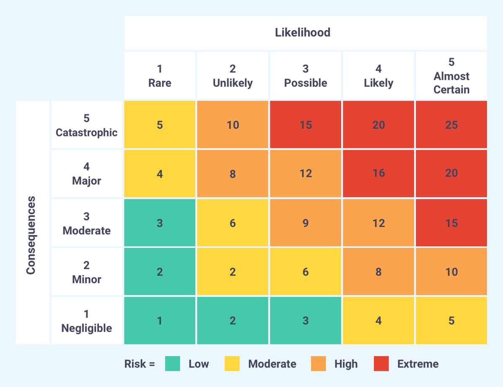

## 1.1 Understanding the security concepts of inforation assurance

Information Security has three major goals, know as the _The CIA_ triad. 

### Confidentiality
Refers to the organizations efforts to protect information / data from unauthorized disclosure

There are several threats that put data and infomation confidentiality at risk, they are:

* Snooping
    * Individuals wandering around office or other facility and simply looks to see what information they can gather such as papers on a desk or in a public area.
    * Protection:
        * Maintain clean workspace and put away any sensitive material when you step away
* Dumpter diving
    * Sensitive material is found in garabge
    * Protection:
        * Shred sensitive information
* Eavesdropping
    * Phyiscal consern in which people listen in on sensistive conversation in a public space
    * Protection:
        * Don't have sensitive conversations in public
        * Set up rules where sensitive information can only be discussed in private (office or board room)
* Wiretapping
    * Electronic form of eavesdropping
    * Sensistive information is intercepted over a network communication channel (Man in the Middle)
    * Protection:
        * Use encyrption to protect information over the network
* Social Engineering
    * Known as the art of extracting sensitive information from people by using pyschology or tricking them into sharing information
    * Also known as _footprinting_
    * Infromation typically gathered:
        * Credit card information
        * Usernames and passwords
        * Operating System information
    * Techniques:
        * Shoulder surfing:
            * Information gathered by standing behind a target when they are dealing with sensitive information
        * Phishing:
            * Emails sent to a target group containing messages that look legitimate
            * User's click on links and are redirected to a fake (legit looking) website which ask for information
        * Smishing:
            * Alternative to phishing, less common
            * Tricks unsuspecting victims into handing over sensitive data via fraudulant SMS messages
        * Vishing:
            * Attackers use pre-recorded messages to send to victims over the phone
                * Suspicious activity on their CC and are told to call a specific number to confirm information
        * Spam
            * Unsolicited communication (typically email) sent in bulk.
            * SPIM (Spam over instant messaging)
        * Pharming
            * Attack in which a user is forwarded to a malicious website without the user knowing (DNS spoofing)
        * Tailgating
            * Unauthorized person gains access to a restricted area by following an authorized person
        * Spear Phishing
            * Email attack to a specific target (not group)
        * Whaling
            * Attack targeted to a "big fish" (CEO, CFO, etc)
        * Identity Fraud
        * Hoax
        * Imperonation

Most threats require a bit of reconnaissance or preparation before the actual attack takes place, there are two types:

* Passive
    * Obtaining information about the target without directly interacting with them (i.e. searching social media to obtain intel)
* Active
    * Obtaining information by connecting directly with the target:
        * over email, phone calls / sms
        * impersonation
        
 
### Integrity
Refers to the organizations efforts to protect information / data from any unauthorized changes in transit and at rest.

The following are the most common cybersecurity concerns that are related to the integrity of information:
* Unauthorized modification
    * Occurs when the attacker gains access and makes changes that violates security policies
* Impersonation
    * Attacker pretends to be someone to gain access and make changes
    * Extension of social engineering attacks
* Man-in-the-middle (MITM)
    * See [4.2.1 of Domain 04 - Threats](Domain%2004%20-%20Network%20Security.md)
* Replay
    * See [4.2.1 of Domain 04 - Threats](Domain%2004%20-%20Network%20Security.md)

### Availability
Refers to the organizations efforts to make sure data and systems are available for authorized use.

There are five types of events that affect the availability to data and systems:

* Denial of Service (DoS) Attacks
    *  * See [4.2.1 of Domain 04 - Threats](Domain%2004%20-%20Network%20Security.md)
* Power Outages
    * Occurs on a local or regional scale
    * Increased demand can overwhelm the power grid, natural disasters or other factors may cause power outages
    * Protection: 
        * Use redundant power sources and backup generators to systems when commerical power isnt available
* Equipment Destruction
    * Due to hardware failures
    * Protection:
        * Build systems that have built in redundancy so that if one component fails another is ready to pick up the slack
        * For larger scale failures, such as Data Center outages or destruction, use backup facility or the cloud as a backup solution when the primary data center is disrupted
        * RAID for storage
* Service Outages
    * Due to application errors and/or underlying equipement failures
    * Protection:
        * Build resilient systems in the face of errors and failures
        * Use load balancing

### Accountability
It is the authority of information systems to successfully scrutinize the actions of an entity and hold them accountable for the aforementioned actions.

Mechanism:
* Implementation of digital signatures, 
* Usage of asymmetric cryptography
* digital certificates

### Authentication and Trustworthiness

Any system in the information system tree should be able to successfully establish trust and authenticity before acting on the mutual motive of the interaction i.e. before the key purpose to be achieved, the two entities engaging in the communication should be able to trust and authenticate each other. Once this is achieved, the actual transaction can go ahead.

Access Control Process also knowns as _IAAA_:
* Identification
    * Making a claim/assertion of identity
    * Providing a username or user id
    * Issue:
        * Could be a false claim
* Authentication
    * Requires proving of a claim/assertion of identity
    * Providing a password or mulitfactor
* Authorization
    * Ensures that an action is allowed
    * Access control list that provides permissions on what a person can and cant do
* Accountability
    * Audit logs that show the activities of a user

Password Security, typically found in Password Policies, contain the following:
* Password length requirements set a min number of characters, good practice to be min 8 characters
* Some requiring longer passwords as those a deemed stronger
* Use complexity requirements, force users to use different characters and upper and lower cases
* Password expiry policy
* Password history requirements where you can't reuse a previously used password
* Make it easy for users to change their passwords whenever
* Use Password managers to facilitate the use of strong, unique passwords
    * Secure vaults for storing passwords
    * Automatically populates passwords for known sites

Multifactor Authentication
* Multi-step login process requiring users to enter more info other than just a password
* Methods
    * "Something You Know"
        * Knowledge Based
        * Types:
            * Passwords
            * Security PINs
            * Security Questions
        * Drawbacks
            * Can be stolen
    * "Something You Are"
        * Biometrics
            * Fingerprint
            * Retina
            * Facial
            * Voice
    * "Something You have"
        * Item used to prove identity
        * Types:
            * Software / Hardware tokens
            * Smart cards
        * Drawbacks:
            * Can be stolen
* Best practice is to combine two different methods (i.e. Passowrds and Smartcards)

Single Sign-On (SSO)
* Shares authentication sessions across systems to avoid the burden of logging in accross systems
* Typical session lasts 24 hours

### Non-repudiation

Non-repudiations is a security goal that prevents someone from falsely denying that something is true.

For example, when a friend of mine sends me an email, I can clearly verify the email address used, the originating IP and the digital signature that is specific to my friend and his email service provider. A system’s failure of not being able to provide its users with non-repudiation might lead to serious impersonation attacks.

Mechanisms:
* Physical signatures are non-repudiation on contracts and other paper docs
* Digital signatures use encryption technology to provide non-repudiation
Biometrics (fingerprint, retina scans) can prove that someone was in a facility or performed an action
* Video surveillance

### Privacy

The feature that gives the ability to refrain from sharing who/what owns an asset and the associated attributes. The asset owner depending upon the implementation of the information system should be able to decide the norms on which access and work on that information is performed.

Concerns
* Protecting our own data
* Educating our users
* Protecting data collected by our organizations

Types of data that require privacy:
* Personally Identifiable Information (PII)
    * Information that can be tied back to an individual such as SIN, email, address, phone, DOB, etc
* Personal Health Information (PHI)
    * Includes health care records regulated under the Health Insurance Portability and Accountability Act (HIPAA)

Privacy programs are based on a legal principle known as the reasonable expectation of privacy
* Examples on where you wouldn't have expectation of privacy
    * Posting things on public forums (Facebook, instagram, etc)
    * Using employer equipment, there is activity monitoring software typically on these devices to monitor actions
* Examples of where you would expect
    * Sending emails to a single person, or using a private message
    * Share PII information with and org such as hospital, bank, etc

## 1.2 Understanding the risk management process

### Risk Management Process

The risk management process is broken down into 4 basic steps

1. Ientitify the risk
    * First step in the process is to identify all the events that can negatively (risk) or positive (opportunity) affective the objectives of an organization
    * Two risk categories
        * Internal risk that arise within the organization
            * Leverage two persona control for any high
        * External risk that arise from outside of the organization
            * Ransom ware attack
            * Address using mfa or security awareness training
2. Assess the risk
    * Once all the risks have been identified, they are then triaged based on likelihood and impact on buisness
        * **Likelihood** is the probability a risk will occur
        * **Impact** is the amount of damage the risk may cause
    * The assement process factors in the following concepts:
        * **Threats** are external or internal risks that focus on jeopardize security
            * Naturally occurring (hurricane or wildfires)
            * Man made (hacking and terrorism)
        * **Threat vectors** are methods used by an attacker
            *  Hacker toolkit, social engineering
        * **Vulnerabilities** are weakness in sec controls
            * Missing patches, firewall configs
        * **Risks**
            * Combinations of a threat and vulnerability
        * Assessment techniques
            * Qualitative Risk Assessment
                * Uses subjective ratios to evaluate risk likelihood and impact (i.e. Low, Medium, High)
                * 
            * Quantitative Risk Assessment
                * Uses objective numberical ratios to evaluate risk likelihood and impact
                * Single Loss Expectancy (SLE) = Value of Assest ($) x Exposure Factor (*)
                    * Ex: Let’s say you decide the e-commerce web site has a value of $200,000, and each time the web server has a hard drive failure, you lose 8 percent of the asset value. This means that your single loss expectancy is $200,000 × .08, which is $16,000. Therefore, every time the hard drive fails in the server, your business loses $16,000!
                * Annualized Loss Expectancy (ALE) = SLE x Annualized Rate Of Occurence (ARO)
                    * ARO = how many times a year you expect the threat to occur
                    * For example, you may expect a threat to occur three times a year or to occur once every five years. The following example calculates the ALE for our hard drive failure threat if it were to occur three times a year: ALE = $16K x 3 which would equate to $48,000
                * 

3. Treat the risk
    * Once the risks have been assessed this is where we evulate and make a decision on how to handle the risk.
    * This is based on the organizations risk profile and tolerance
        * **Risk Profile**
            * _Inherent risk_:
                * initial level of risk
            * _Residual risk_:
                * Level of risk after controls are applied
            * _Control Risk_:
                * The amount of risk implace for controls, such as firewall as a risk management control, the firewall may fail
        * **Risk Tolerance**
            * Level of risk an organization is willing to accept
    * Options:
        * **Risk Avoidance**
            * Change business practices to make risk irrelevant
        * **Risk Transference**
            * Shifts the impact of a risk to another organization
                * i.e purchase insurance
        * **Risk Mitigation**
            * Take action to control / reduce the risk
        * **Risk Acceptance**
            * Continue operations in the face of risks
4. Monitor / report on the risk
    * Once the solution is decided on for the risk and implemented we monitor and report on the outcomes.

## 1.3 Understanding security controls

Security Controls are procedures and processes put in place to reduce the likelihood or impact of risk and help identify issues.

Defense-In-Depth is an information security strategy that integrates people, technology and operations capabilities to establish variable barriers across multiple layers and missions of the organization. 
* Applies multiple countermeasures in a layered fashion to fulfill security objectives.
* Should be implemented to prevent or deter a cyberattack, but it cannot guarantee that an attack will not occur.

Control Purpose
* Prevent
    * Stop a security issue from occurring
        * Firewall that blocks traffic
        * System hardening
* Detective
    * Identifies security issues requiring investigation
        * Intrusion Detection Systems (IDS)
        * Virus Scan
* Recovery
    * Remediate security issues that have occurred
        * Restoring from backups after ransomware attack
            * System Hardening
            * Virus Scans
Control Mechanism
* Technical (Logical)
    * Use of technology to achieve control objectives
        * Firewall
* Administrative
    * Processes/policies to achieve control
        * User access reviews
        * Log Monitoring
        * Performing security awareness training and background checks
* Physical
    * Impacts the physcial world
        * Fences, locks, security guards, etc.

Secruity Roles and Responsibilities
* System Owner and Data Owner
    * owner (either system or data) is the person who decides how valuable the asset is and whay types of security controls should be put in place to protect the asset.
    * decides the sensitivity classification of the information (ie. top secret, secret, etc)
    * typicall upper-level management and holds the ultimate responsibility of securing the asset and security with the organization
* Data Controller and Data Processor
    * In the EU, GDPR governs the protection and privacy of personal data
    * _data controller_ is an entity that determines how and why personal data is processed
    * _data processor_ is the entity that actually perfroms the processing on the personal data, as per guidelines set by the data controller
* System Administrator
    * responsible for the configuration of a system or network
    * recieves configuration goals from the designers or the security professionals within the organizationand configures the system in a manner to the meeting those goals
    * Sec professional should be someone other than the system admin for audit purposes
* User
    * anyone who accesses and uses the resources within the organization
    * affected by security controls determined by the owner and put in place by the steward/custodian
* Privileged User
    * one who has been given extra privileges to perfomr administrative tasks
    * these users should be limited to a few
* Executive User
    * high-level business executive (president, CEO)
    * requires access to more company resources than a regular user or even management
    * has elevated access 

Data Roles and Responsibilities
* Data Owner
    * typically compnay owner, executive team, department head who decides which data is considered an asset and how that data should be protected
* Data custodian/steward
    * custodian (aka steward) is the person who implements the security control based on the value of the asset determined by the owner.
    * typically IT admin who performs common tasks such as backups, configuring permissions, etc
* Data privacy officer (DPO)
    * chief privacy officer (CPO)
    * responsible for developing policies that address employee personal data and customer personal data
    * privacy policy should specify how PI is to be handled and stored with the organization

Security Officer
* liases between management (the owner) and the IT staff (custodian)
* responsible for making sure that policies are being followed by educating everyone on their role within the organization

## 1.4 Understanding (ISC)2 Code of Ethics

(ISC)2 Code of Ethics Preamble:
* The safety and welfare of society and the common good, duty to our principals, and to each other, requires that we adhere, and be seen to adhere, to the highest ethical standards of behavior, strict adherence to this Code is a condition of certification
* Unethical hacking activities violates this cannon of the code

The (ISC)2 member is expected to do the following (Canons):
* Protect society, the common good, necessary public trust and confidence, and the infrastructure.
    * Unethical hacking activities violates this cannon of the code
* Act honorably, honestly, justly, responsibly and legally. 
    * Lie or commit other dishonorable, unjust, irresponsible actions violates this cannon
* Provide diligent and competent service to principles.
* Advance the information security profession
    * Certified individuals who provide an authorized assistance on exams, violates isc2 nda or provides false information on an endorse application violates this cannon

## 1.5 Understand governance process

Security Policy Framework
* Documented process and polices around the implementation and ongoing management of information security controls
* Documents
    * **Policies**
        * Describes an organization's security expectations put in place by organizational governance, such as executive management, to provide guidance to all activities to ensure that the    organization supports industry
        * Compliance is mandatory
        * Not good examples of statements:
            * _“All sensitive information must be encrypted with AES-256 encryption”_
        * Good examples 
            * _“Sensitive information must be encrypted using approve technology”_
    * **Standards**
        * Describes specific details of security controls that the organization must follow such as:
            * encryption algorithms used, 
            * record storage locations, 
            * configuration parameters
        * Used by governance teams to provide a framework to introduce policies and procedures in support of regulations.
        * Provides best practices to follow
        * Compliance is mandatory
    * **Guidelines**
        * Provdes best practice and advice
        * Compliance is recommend but not mandatory
    * **Procedures**
        * Details the steps to complete a task that support departmental or organizational policies
        * Compliance may be mandatory depending on the organization

Regulations and Laws
* commonly issued in the form of laws, usually from the government (not to be confused with governance) and typically carry financial penalties for non-compliance.
* Govern the way we store, process, and transmit information
* Identify which apply to us
* Different jurisdictions may govern our operations
    * General Data Protection Regulation (GDPR)
        * Applies to personal information of all EU residence, wherever they may be located worldwide
* Should be aware of national, state law, or other standards that do not pertain to Law:
    * Payment Card Industry Data Security Standard (PCI DSS)
        * Self-regulatory scheme that applies to credit card transactions worldwide
        * Compliance is enforced by the banks to the credit card systems

