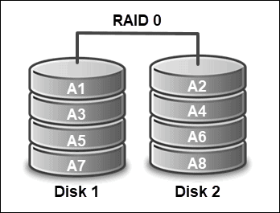
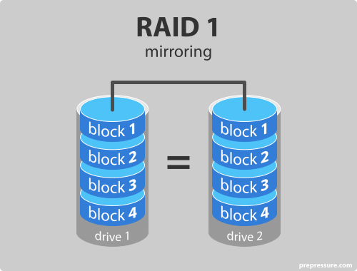
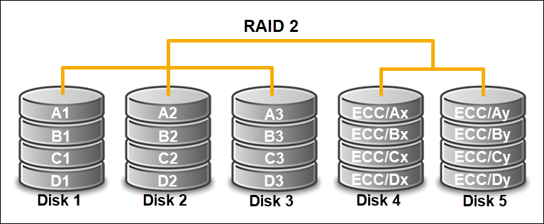
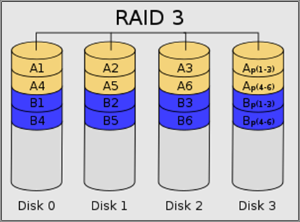
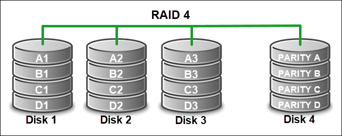
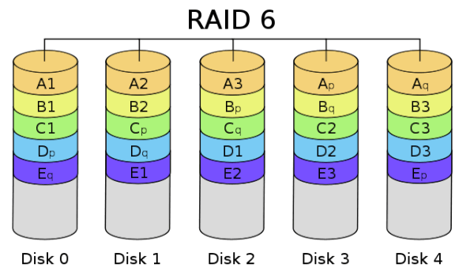
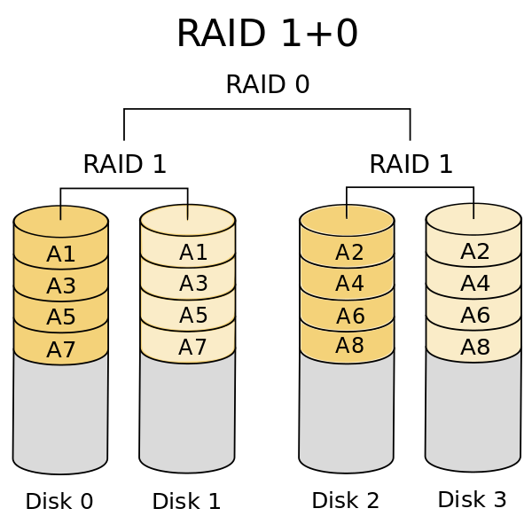
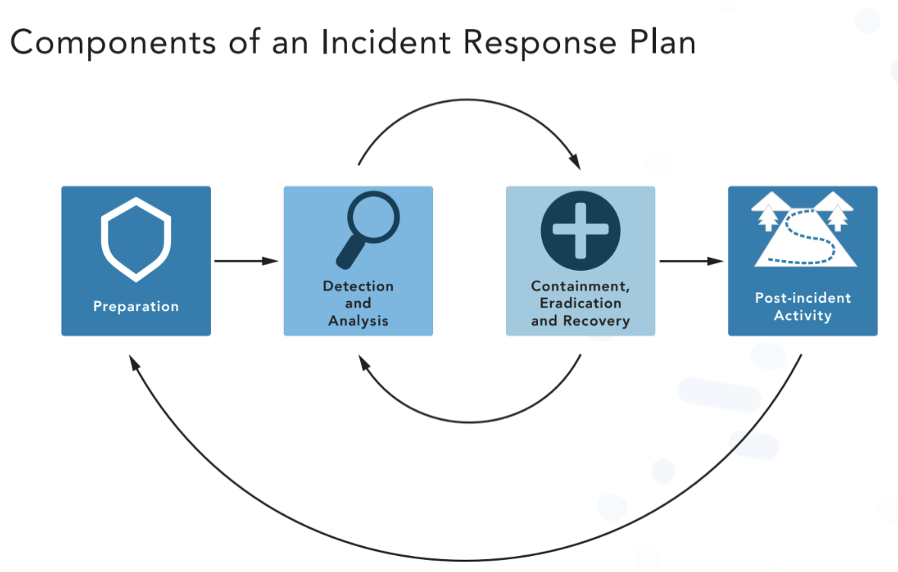
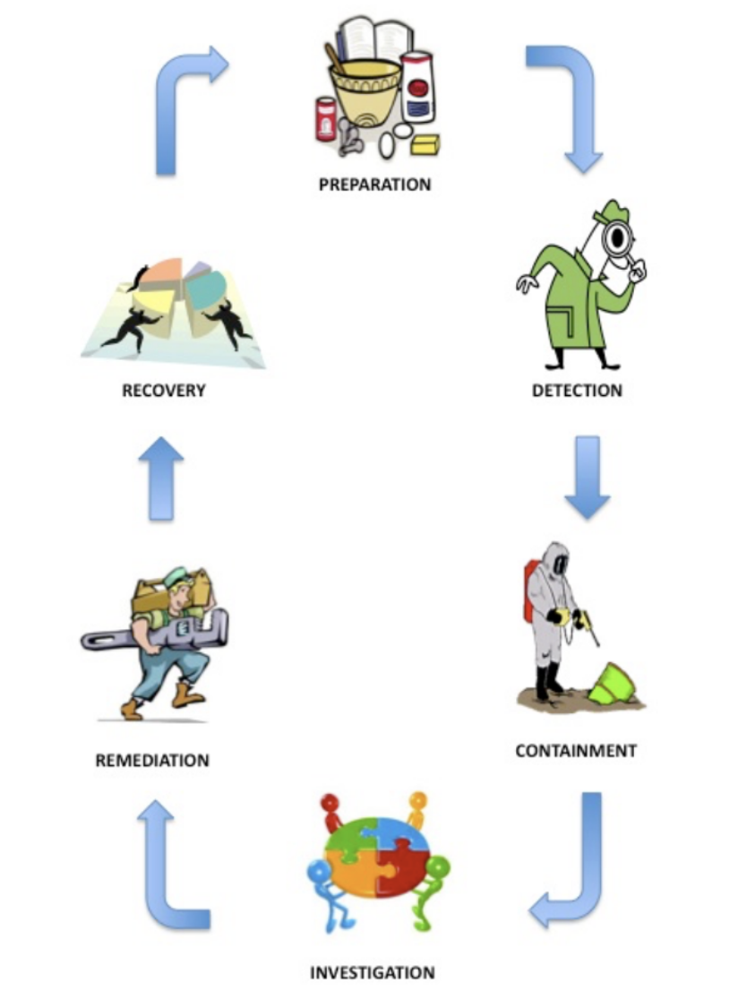

## 2.1 Understanding business continuity (BC)

Purpose:
* Guideline, procedures, and policies designed to keep a business up and running in the face of of adversity (disaster, or small scale incident)
* Core security concept CIA triad (Availability)
* Sometimes referred to as Continuity of Operations planning (COOP)
* Carefully define scope
    * What **business activities** will the plan cover?
    * What **systems** will it cover?
    * What **controls** will it consider?

Importance:
* Leverage _Business Impact Assessment (BIA)_
    * Identifies and prioritizes risks
    * Uses Quantitative or Qualitative approach
    * Contains Annualized Loss Expectancy ($) associated to the risk
    * Requires collab between cloud service providers and customers in a cloud environment
    * Determines the allowable downtime of functions
    * Determines the maximum tolerable downtown (MTD)
        * Examples:
            * Nonessentail services = 30 days
            * Normal priority services = 7 days
            * Important functions to the business = 72 hours
            * Urgent functions = 24 hours
            * Critical functions = within 3 hours
* Redundancy
    * Protects against the failure of a single component
* Single Point of Failure (SPOF) Analysis
    * Identifies and removes SPOF
    * Continues until the cost of addressing risks outweighs the benefit
    * Clustering severs and redundant firewalls addressing SPOF issues
* High Availability (HA)
    * Uses multiple systems to protect against service/system failure
    * Cluster of Web Servers
    * Pair of firewalls (active/passive)
* Fault Tolerence (FT)
    * Making a single system resislent against technical issues
* Load Balancing
    * Spread demand across systems
    * Provides scalalbility
    * Part and parcel with HA
* IT Contingency Scenerio Examples:
    * Sudden bankruptcy of a key vendor
    * Insufficient storage or compute capacity
    * Failure of utility service
    * Lack of staff succession plan
* Mean time to repair/recovey (MTTR)
    * Is the average time for a system or device to recover from a failure
* Mean time between failures (MTBF)
    * Is the amount of time between failures of a system/device
* Mean time to failure (MTTF)
    * Is the amount of time a device is expected to last in production before it fails.
    * Usually a value reported by hardware manufactures which helps during hardware selection process
* Common Points of Failure within a Computer system:
    * Power Supply
        * Contains moving parts
        * High-failure rates
        * May use multiple power sources
        * Uninterruptible Power Supply (UPS)
        * Managed Power Distribution Units (PDUs)
            * Provide power cleaning and management for a rack
    * Storage Media
        * Use Redundant Array of Inexpensive Disks (RAID) to make storage fault tolerant
            * https://www.prepressure.com/library/technology/raid
            * Technology:
                * RAID 0 - Stripe set/Striped Volume
                    * 
                    * Splits data evenly across two or more disks without parity info, redundancy, or fault tolerance
                    * Failure of one drive will fail the entire array 
                    * Ideal use for non-critical storage that has to be read/written at high speeds, such as image retouching and/or video editing
                * RAID 1 - Mirroring
                    * 
                    * Server contains two disks with identical contents when the system writes data to disk
                    * Automatically synchronizes the disks on every change
                    * If primary fails the system automatically switch over to the backup
                    * Ideal for mission critical storage, for instance accounting systems. 
                    * Also suitable for small servers in which only two drives will be used
                * RAID 2
                    * 
                    * Rarely used in practice
                    * Stripes data at the bit (rather than block) level and uses a [Hammering Code](https://en.wikipedia.org/wiki/Hamming_code) for error correction
                    * Disks are synchronized by the control to spin at the same angular orientation to reach index at the same time
                    * Cannot service multiple requests simultaneously
                * RAID 3
                    * 
                    * Rarely used
                    * Byte-level striping with a dedicated parity disk
                    * Like RAID2 cannot service multiple requests simultaneously
                    * I/O operations requires activty on every disck and usually requries synchronized spindles
                * RAID 4
                    * 
                    * block-level striping with a dedicated parity disk
                    * Provides good performance of random reads, random writes is low due to the need to write all parity data to a single disk
                    * In the diagrame a read request for block A1 would be served by disk 0, a simultaneous read for B1 would wait, but a read for B2 would be serviced concurrently by disk 1
                * RAID 5 - Disk Striping with Parity
                    * 
                    * Replaces RAID 3 and RAID 4
                    * Requires **at least 3** disk drives and can work with up to **16**
                    * Uses three or more disks to store data and parity information spread across the disks
                    * If one  disk fails the system can regenerate that disk content using the parity information
                * RAID 6
                    * 
                    * Extension of RAID 5 by adding another parity block, thus uses block-level striping with two parity blocks distributed across all member disks
                * RAID 10 (Combines RAID 1 and RAID 0)
                    * 
        * RAID is a fault tolerant stragtegy that is designed to protect against a single disk failure but IS NOT a backup strategy
    * Networks
        * Use redundancy at different points
            * Multiple internet serverice providers entering a facility
            * NIC teaming (dual nics)
            * Multipath Networking
        * Use diveristy
            * Technologies from different venders
            * Cryptography and security controls

Components
* List of the BCP team members, including multiple contact methods and backup members
* Immediate response procedures and checklists (security and safety procedures, fire suppression procedures, notification of appropriate emergency response agences, etc)
* Notification systems and call trees for alerting personnel that the BCP is being enacted
* Guidance for management, including designation of authority for specific managers
* How/when to enact the plan
* Conteact numbers for critical members of the supply chain (vendors, customers, possible external emergency providers, third-party partners)
* In the cloud BCP requires collaboration between service providers and customers

## 2.2 Understand disaster recovery (DR)

Five possible components to include in a Disaster Recovery (DR) plan:
1. Executive summary providing a high-level overview of the plan
2. Department specific plans
3. Technical guides for IT personnel responsible for implementing and maintaing critical backup systems
4. Full copies of the plan for critical disaster recovery team members
5. Checklists for certain individuals

Purpose:
* Subnet of BC used to restore business to operations as quickly as possible
    * Steps in when BC fails
* Triggered by environmental, cyber attack, DC failure or power outage

Importance:
* Goals:
    * Contain the damage
    * Recover normal operations
* During a DR Effort
    * Business shifts from normal operations to concentrated effort to restore operations as quickly as possible
* Communication is important
    * Initial report
    * Status update
    * Adhoc Messaging

Components:
* Initial response
    * Activate an alternate process facility, **if necessary depending on type of disaster**
    * Contain physical damange
    * Call contractors to begin emergency response
* Assessment mode
    * Triage the damage to the organization and implement functional recovery plans to restore operations on a permanent basisi
* Recovery Time Objective (RTO)
    * Target amount of time to restore to normal operations
* Recovery Point Objective (RPO)
    * Max time period for which data may be lost
* Recovery Service Level (RSL)
    * Percentage of a service that **must** be available during a disaster
* Tain personnel on the BC/DR plan
* Backups
    * Most important component and crucial
    * Types:
        * Copy files
        * Write to tape drives
            * Unwiedly to manage
        * Disk-to-Disk backups in different sites
            * Network attached storage
        * Cloud Backups
            * AWS, Azure, GCP
    * Forms
        * Full
            * Eveything
            * Snapshots and images
        * Differential
            * Supplemental to full
            * Only data that has changed since the last full backup
        * Incremental
            * Similar to differential but with a twist
            * Data modified since last full or recent incremental
    * Scenerios:
        * Joe performs **full** backups every Sunday evening and **differential** backups every weekday evening. His system fails on Friday morning. What backups does he restore?
            * Answer:
                1. Sunday's full backup
                2. Thursday's differential backup
         * Joe performs **full** backups every Sunday evening and **incremental** backups every weekday evening. His system fails on Friday morning. What backups does he restore?
            * Answer:
                1. Sunday's full backup
                2. Monday, Tuesday, Wednesday, and Thursday's incremental backup
* Disaster Recovery Sites
    * Alternative processing facilities that are specifically desgined for shifting computing functions from the primary DC when it goes down
    * Three main types:
        * Hot Sites
            * Fully operational data centers
            * Stocked with equipment and data requied to handle operations
            * Ready to run at a moments notice
            * Unparalleled level of redundancy
            * Active / Active
            * Very expensive to keep up, doubling data center costs
        * Cold Sites
            * Empty data centers
            * Stocked with core equipement, network, and environmental controls
            * No servers or data to restor operations
            * Relatively inexpensive
            * Operational in weeks or months
            * Requires planning to make operational
        * Warm Sites
            * Stocked with all necessary equipement, data, software to support the company's operations
            * Not maintained in a parallel fashion
            * Similar in expense as hot site
            * Available in hours or days
            * Active / Passive
    * Offline Storage
        * Geographically distant
        * Site resiliency
        * Manual transfer or site replication through SAN or VM
        * Online or offline backups
    * Consider integrating alternate business processes into your DR plan
* Test BC/DR Plans
    * Goals
        * Validate that the plan functions correctly
        * Identify necessary plan updates
    * Testing Types:
        * Read-through
            * Ask each member to review their fole in the DR process and provide feedback
        * Walk-though
            * Table-top exercies
            * Team gathers together for a formal review of the DR plan
        * Simulation
            * Use a practice scenerio to test the DR plan
        * Parallel Test
            * Activate the DR environment but do not switch operations there
        * Full interuption test
            * Tests switching primary operations to the alternate environment and can be very disruptive to business
            * Rarely used
    * Testing strategies often combine multiple tests types

## 2.3 Understand incident response (IR)

Purpose
* Describes policies and procedures governing cybersecurity incidents which help to protect systems and information from threats

IR Lifecyle

* Steps
    * Preparation
        * First step
        * assembly a Computer Incident Response Team (CIRT)
        * creating IR response procedures
    * Identification/Detection
        * Second steps
        * Detection and analysis of potential threats/incidents using tools or notification by an internal or external source
        * CIRT team should be notified
        * classification of incident
        * Notification that are required by law or contract are done at this stage
    * Containment
        * Triage phase where the affect system is identified/isolated/mitigated
        * Includes sub procedures for seizure and evidence handling, escalation and communications
    * Investigation
        * ISO personnel determines the priority, scope, risk, and root casue of the incident 
    * Remediation
        * Post-inicident repair of affected systems, communications, and instructions to affected parties, and analysis that confirms the threat has been addressed
    * Recovery
        * CIRT recovers the system back to normal state before the incident took place
        * Performs Lessons learned
            * CIRT documents what happend, why and how to not have this type of incident occur again
        * Updates Standard Operating procedures (SOP) for furture responses

Importance
* Standard incident response process endorsed by the National Institute for Standards and Technology (NIST)
    * [NIST Special Publication (SP) 800-61](https://nvlpubs.nist.gov/nistpubs/SpecialPublications/NIST.SP.800-61r2.pdf)
        * Computer Security Incident Handling Guide
        * Practical guidance on responding to cyber incidents
        * Assists organizations in mitigating the potential business impact of infosec incidents
    * Widely used throughout the cybersecurity field
* Every organization should define a Incident Response (IR) Plan, to provide structure during a cyber incident
* IR Plan Elements
    * Statment of purpose
        * What are the reasons that the org is creating an IR plan?
        * What is the scope of the plan?
        * What types of incidents does the plan cover?
    * Strategies and goals for the plan
        * What are the highest priorites for the first responders and for those handling an incident at a more strategic level?
    * Approach to incident response
    * Communication with other groups
    * Senior Leadership approval is required
* Consult the NIST-SP 800-61 while developing the IR plan
* Sample IR Plan: [Carnegie Mellon IR Plan](https://www.cmu.edu/iso/governance/procedures/incidentresponseplanv1.6.pdf)
* IR Team
    * Must have personnel available 24/7 with back ups
    * Consists of:
        * Management
        * Information Security
        * Subject Matter Experts
            * DE, INFRA, App Dev
        * Legal Counsel
        * Public Affairs
        * Human Resources
        * Physical Security
        * Privacy Personnel
    * Work with team regularly
        * Training and run throughs reguarly
* Use incident response service providers if needed
    * Work out the contract details in adavance!!!
* IR Communication Plan
    * Ensures that all participants have timely, accurate information
    * Limit exteranl communications to trusted parties
    * Purpose
        * Should describe who and how it be communicated over secure channels
    * Internal
        * Legal teams should be involved
    * Exteranl
        * Law enforcement is optional, details of incident could become public
            * If there is a threat to public safety than this needs to occur
        * 3rd parties should be trusted and vetted to avoid exposing the details of the incident
    * Breaches are typically know from people or groups
    * First Responders need to isolate affected systems and contain damage
        * Highest priority, beyond health and safety, is to contain damage and isolate systems from infecting other systems

Components
* Perpetual Monitoring
    * Once a plan and team is in place and prepared, the IR plan goes into a state of continuous monitoring
        * Using and mointoring data/logs from sources such as
            * Instrusion Detection System (IDS)
            * Instrusion Prevention System (IPS)
            * Firewalls
            * Authentication Systems
            * Integrity Monitors
            * Vulnerability Scanners
            * System event logs
            * Netflow connections records
            * Antimalware packages
        * Collection and analysis using a Security Incident and Event Management (SIEM) tool
            * Centralized place to view and monitor incidents
* Reporting of an incident from external sources
    * When monitoring fails to detect an incident and we hear about a breach from employees, customers, or external organizations whom see signs of a breach
    * CIRT team should have a consisten method of recieving, recording, and evaluating exteranl reports

    