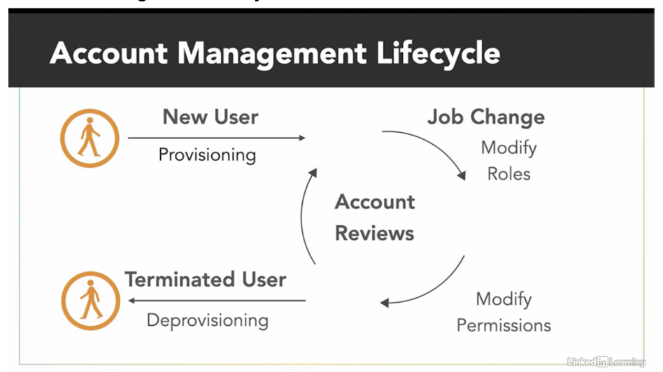

## 3.1 Understand physical access controls

Types of facilities that must be protected:
* Data Centers
    * Contains massive quantities of valuable information and computing resources
* Server Rooms
    * Possibly in less secure locations
* Media Storage Facilities
* Evidence storage locations must preserve the chain of custody
* Wiring closets
* Cable distribution runs
* Operations centers

Secure Areas
* Air Gap
    * seperates two different networks
    * secret environment that has no connections to the corporate net or LAN

Physical Security Controls
* Types
    * Security Guards
    * Fences
    * Motion Detectors
    * Locked doors/gates
    * Sealed Windows
    * Lights
    * Cable protection
    * Laptop locks
    * Badges
    * Swipe Cards
    * Guard dogs
    * Cameras
    * Mantraps
    * Turnstiles
    * Bollards (block vehicle traffic)
    * Alarms
    * Locks
        * Types:
            * Electionic
                * need to enter a code
            * Biometric
                * fingerint, retinal, voice, etc
            * Cable
                * Used to lock down laptop, desktops, etc

Crime Prevention Through Environmental Design (CPTED)
* Purpose
    * Promotes designing facilities to help physcial security experts doing their work
    * Increases the physical security of your facility by reducing the risk of a successful intrusion
* Goals
    * Natural Surveillance
        * Types (Cameras, windows, adequate lighting)
        * Design in a way that allows employees and passers by to observe what is happening around the outside of the facility and notice a potential instrusion taking place
    * Natural Access Controls
        * Gates, etc
    * Natural Territory Reinforcements
        * Signs, landscaping, etc

Monitoring
* Continuious Monitoring Systems
* Security Guards
* Closed-circuit TV (CCTV)
* Alarm Systems logs

Visitor Management Procedures
* Purpose
    * Describe who may authorize visitor access and how vistors may behave in the organizations facilities
* Goals
    * Describe allowable visit purposes
    * Explain visit approval authority
    * Describe requirements for unsecured access
    * Explain the role of visitors escorts
* Importance
    * Visitors access to secure areas should always be logged
    * Visitors should be clearly identified with distinctive badges
    * Cameras provide added degree of monitoring in vistor areas

Physical Security Personnel
* Receptionists may act as security guards
* Robot guards (sentries) may replace human security
* Two-Person Rule
    Helps ensure that peronnel invovled in very sensistive operations act appropriately
    * Two forms
        * Two Person Integrity
            * Two people must enter sensitive areas together
        * Two Person Control
            * Two people must jointly approve sensitive activities
            * Ex: Two keys to lauch missles

## 3.2 Understand logical access controls

Privileged Access Management
* Reduces risk by allowing admin privileges to be used only when needed.
* Provides confidentiality by limiting the need for administrative access that is used during routine business.
* Ensures integrity by only allowing authorized administrative access during approved activities.
* Confirms availability by providing administrative access when needed

Account Management
* Job rotation moves employees through different position on a periodic basis
* Mandatory vacation policies require time away from work and not have access to corporate systems during this time
* Adopt and setup standard name conventions for accounts
* Make it easier to identify users and tie user accounts to real identities
    * Example : user’s first initial and combines it with up to eight characters of their last name. If this would create a duplicate account, then they replace the last character with a unique number. Ex →David Tessier dtessier

Account Management Lifecycle

Process:
* New employee – account created
* “Onboarding” – creating an account (or cloning a baseline account) for a new employee
* Changed position – account modified
* Temporary leave of absence – account disabled
* Separation of employment – account deleted
* “Offboarding” – deleting an account (or disabling then deleting an account)for a terminated employee

Provisioning
* After onboarding, admins create the authentication credentials and grant appropriate authorization based on job functions

Deprovisioning
* During offboarding, admins disable accounts and revoke authorizations at the appropriate time
* Prompt termination is critical
    * Prevents users from accessing resources without permission
    * Especially critical when user leaves under adverse circumstances
* Routine Workflow
    * Disables accounts on a schedule basis for planned departures
* Emergency Workflow
    * Immediately suspends access when user is unexpectedly terminated
* Incorrectly timed account revocations
    * May inform a user in advance of pending termination
    * May allow a user access to resource after termination
* Performing actions in Windows:
    * Active Directory Users and Computers → right click on user → disable account
    * ADUC → right click user → properties → account tab → Account expires → set date

Account Monitoring:
* User Permission Audits
    * Example: 
        * Inaccurate permissions block work and/or violate least privilege (privilege creep)
    * Pull permissions list
    * Review with managers
    * Make adjustments
    * Prioritize those users that have switch job roles
    * Attestation reviews are formal approval documentation
* Continuous Account Monitoring
    * Ex:  Unauthorized use of permissions by legitimate users
    * Watch for suspicious activity
    * Alert administrators to anomalies
    * Access Policy Violations
        * Impossible travel time logins
        * Unusual network location logins
        * Unusual time-of-day logins
        * Deviation from normal behavior
        * Deviation in volume of data transfer
* Geotagging
    * Add user location information to logs
* Goefencing
    * Alerts when a devices leaves a defined boundary

Authorization
* Determines what an authenticated user can do (privileges) 
* Principle of least privilege
    * Users should have the minimum set of permissions necessary to do the job
    * Minimize attack area of external attacker
* Types of controls systems
    * Mandatory access control (MAC)
        * Most stringent
        * Permissions are determined the by the system
        * Rarely used except for Highly secure environments
        * Rule based acs based users and resources having labels, os determines the access by comparing labels
        * Each individual is known as the _subject_
    * Discretionary access control (DAC)
        * Flexibility approach
        * File based approach
        * File owners determine access permissions
        * Most common that orgs use this
        * Each entry is the _discretionary access control list (DACL)_ is known as an _access control entry (ACE)_
    * Role-based Access Control (RBAC)
        * Grants permissions to job specific roles (groups)
        * Users are grant access to those “roles/groups”
        * Permission is applied to the role, users in that role will get the new permission
Elements of Access Control
* Subject
    * Entity capable of accessing objects
    * typically represents a process (the process takes on the attributes, such as access rights, of the user or application)
        * Owner
        * Group
        * World
* Object
    * Resource to which access is controlled
    * An entity that contains and/or receives informaiton
    * E.g.: Records, blocks, pages, segments, files, etc
* Access right
    * describes the way in which a subject may access an object
    * Read, Write, Execute, Delete, Create, Search

Unix File Access Control
* Give control to files using the **chmod** command
* Permissions:
    * Read (R): 4
    * Write (W): 2
    * Execute (X): 1
    * RWX : 7
* Three entities can have these permissioins
    * the file owner
    * a group
    * and everyone else
* Ex: `$ chmod 744 myfile.txt`
    * the above command gives the file owner RWX, and read for everyone else

[Back](./Domain%2002%20-%20BC%2C%20DR%2C%20and%20IR.md) | [Next](Domain%2004%20-%20Network%20Security.md)

