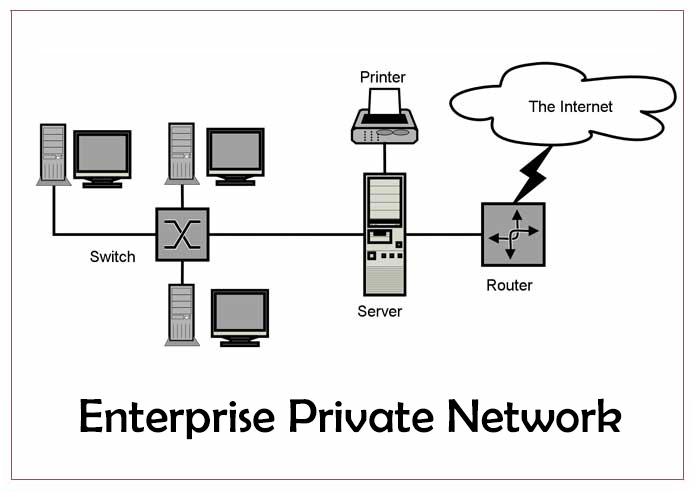
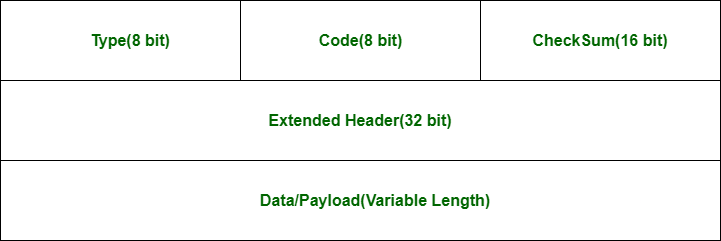
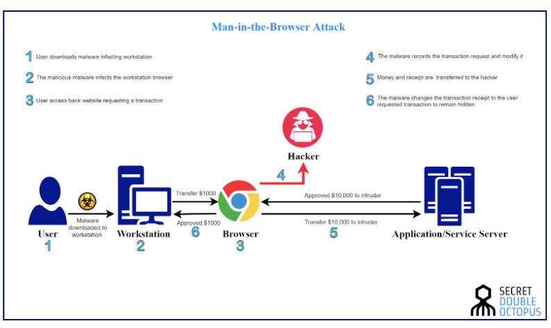

## 4.1 Understand computer networking

Open Systems Internconnection Model (OSI)
* Developed by the International Organization for Standardization (ISO) in 1984
* 7 layer architecture which all work collectively to transmit data
* 

Transmission Control Procol/Internet Protocol (TCP/IP) Model
* Designed in the 1960s by the Department of Defense (DoD)
* Based on standard protocols
* Concise version of the OSI model
* Contains 4 Layers
* Sometimes reffered to as five or four 
* the Physical and Data Link Layers are referred to as the Physical or Network Interface Layer in the the 4 layer reference
* Does not consider security
* 

OSI vs TCP

Types of computer networks
* Local Area Network (LAN)
    * Connects devices at home or in the office
    * 
* Wide Are Network (WAN)
    * Connects LANs together
    * Connecting LANs to WANs provid access to the Global Internet
    * 
* Wireless Local Area Network
    * Connects LAN nodes using wifi instead of wired connections
    * Conforms to IEEE 802.11 Standard and relies on Access Points (AP) to connect clients and devices using the 2.4, 5, and 6 GHz band
    * 
* Virtual Private Network (VPN)
    * mechanism for creating a secure connection between a computing device and a network, or between two networks, using an insecure communication medium such as the public internet
    *  
* Enterprise Private Network (EPN)
    * computer network built by a business to interconnect its various company sites (such as production sites, offices, and shops) in order to share computer resources
    * 
* Personal Area Network (PAN)
    * connects electronic devices within a user's immediate area
        * Range 30 ft / 10 meters (Bluetooth)
        * Near Field Communication (NFC) technology is no more than 2 inches
            * Card payment / card reader
    * using Bluetooth or Sharing a devices WiFi connection (tethering)
    * 
* Campus Area Network (CAN)
    * network made up of an interconnection of LANs within a limited geographical area
    * interconnects multiple LANs with an educational or corporate campus.
    * Most CANs cannot connect to the public internet
    * 
* Metropolitan Area Network (MAN)
    * network that connects computers within a metropolitan area, which could be a single large city, multiple cities and towns, or any given large area with multiple buildings
    * larger than a LAN but smaller than a WAN
    * 
* Storage Area Network (SAN)
    * network which provides access to consolidated block-level data storage
    * primarily used to access data storage devices, such as disk arrays and tape libraries from servers so that the devices appear to the OS as direct-attached storage
    * 
* Network Attached Storage (NAS)
    * storage device connected to a network that provides file-based data storage services to other devices on the network
    * 
* System Area Network (SAN)
    * LAN designed for high speed interconnection in cluster environments (server to server), multiprocessing systems (processor to processor), and SANs (storage area networks)
    * architecture is now almost exclusively switched to fiber
    * Fiber Channel is an example of a SAN technology, which provides high speed swtiched environment in which any device on the network can connect with any other device and communicate over a dedicated high-speed link
    * 
* Passive Optical Local Area Network (POLAN)
    * new way to structure a telecommunications network, replacing traditional structured cabling, which consisted of multiple levels of switch and router aggregation. POL can be hidden in plural space, saving building resources.
    * Three components of POLAN:
       * Optical Line Terminal (OLT)
       * Optical Splitter
       * Optical Network Terminal (ONT)
    * POL can connect to different locations like offices, homes,organizations.  So there are different types of connections made.Some connection types are:-
        * Fiber to the building (FTTB)
        * Fiber to the curb (FTTC)
        * Fiber to the home (FTTH)
        * Fiber to the neighborhood (FTTN)
    * 

Connection Types
* Wired (Ethernet)
    * RJ-45 connector (8 pin)
    * RJ-11 connector (6 pin)
        * used for landline telephone cable
    * High speed connection
* Wireless (WiFi)
    * Bluetooth (PAN)
        * Range is 30 ft or 10 meters
        * NFC
        * Good for short range comms

Protocols
* User Datagram Protocol (UDP)
    * OSI Layer 4 (Transport) protocol
    * Lightweight and connectionless
    * No guarrantee on delivery or acknowledgements
    * Used for voice and video
    * Common UDP Ports:
        *  
    * UDP Header
        * Does not ack reciept of a packet
        * simpler that TCP
        * 
        * Attributes
            * Source port
                * 16-bit fields indicates the port used by the sending application on the sending system
            * Destination port
                * 16-bit field indicates the port used by the application on the destination system
            * Length
                * 16-bit field that specifies the size of the UDP header in bytes
            * Checksum
                * 16-bit field used to verify the integrity of the UDP hearder

Transmission Control Protocol (TCP)
* OSI Layer 4 (Transport) protocol
* Widely used for critical applications (email, web traffic)
* Guarantees delivery through acknowledgements
* Connection oriented protocol
    * Handshare process (TCP 3 way handshake)
        * TCP Flags
            * SYN: 
                * First phase
                * Message is sent to the receiving system
                * Each packet sent is assigned the _initial sequence number (ISN)_
            * SYN/ACK
                * Second phase
                * Message is acknowledging the first message but at the same time is indicating its ISN
            * ACK
                * Final Phase
                * Acknowledgement that the packet sent in the second phase has been received
        * 
    * Disonnecting from a TCP Session
        * System that wants to disconnect from the conversation sends a FIN flag to signal they want to terminate the connection
        * The Receiving system replies with an ACK and send its own FIN flag. Which the starting system send an ACK to complete the disconnection
        * Known as the “polite” way to disconnect
        * The “impolite” manner is to use the RST (reset) flag, this is like hanging up a phone
        * 
* Other TCP Flags
    * PSH: "Push" flag is designed to force data on an application
    * URG: "Urgent" flag specifies that a packet is an urgent packet
* Header
    * Every packet sent using TCP protocol has a header assigned to it
    * Contains TCP-related information such as source port, dest port, and tcp flags
    * 
    * Attributes
        * Source Port
            * 16 bit field identifies the port number of the sending machine
        * Destination Port
            * 16 bit field identifies the port number the packet is destined for on the destination system
        * Sequence Number
            * 32-bit field identifies the sequence number of the packet
        * Acknowledgment number
            * 32-bit field identifies the packet that this packet is acknowledging
        * Offset
            * 4-bit field indicates where the data begins
        * Reserved
            * 6-bit field is always set to 0 and was designed for future use
        * Flags
            * 6-bit field is where the TCP flags are stored
            * There is a 1-bit field for each of the flag
        * Window size
            * 16-bit field determines the amount of information that can be sent before an acknowledgment is expected
        * Checksum
            * 16-bit field is used to verify the integrity of the TCP header
        * Urgent pointer
            * 16-bit field is used only if the URG flag is set and is a reference to the last piece of info that is urgent
        * Options
            * Variable-length field that specifies any additional setts that may be needed in the tcp header

Internet Protocol
* Connectionless delivery system using “best-effort” attempt to deliver the packets
* Does not guarantee delivery of packets
* Responsible for local addressing and routing
* Responsible for decrementing the TTL of the packet to prevent it from running in a network loop, windows system had a default TTL of 128
* Routes info across networks
* Provides an addressing scheme
* Delivers data in chunks (packet) from s to d
* Network layer (layer 3) protocol (OSI)
* Header
    * 
    * Attributes
        * Version
            * 4-bit field that identifies the verison of the IP being used (4 or 6)
        *  Header Length
            * 4 bit field that indicates the size of the IP header
        * Type of Service
            * 8 bit field that indicates how the packet should be handled by the system
            * Example if Low Delay option is specified here, it means that the system should deal with the packet right away
        * Total Length
            * 16 bit field that indicates the size of the IP header
        * Identification
            * 16 bit field
            * Networks can only handle packets of a specific max size known as Maximum Transmission Unit (MTU)
            * System may break data being sent into multiple fragments
            * Unique identifies the fragment
        * IP Flags
            * 3 bit field that specifies how the fragments are going to be dealt with. 
            * Example: a More Fragments (MF) flag indiciates more fragments are to come. Also a Don’t Fragment (DF) specifies not to frag the packet
        * Fragment offset
            * 13-bit field that specifies the order in which the fragments are to be put back together when the packet is assembled
        * Time to Live (TTL)
            * 8 bit field that specifies when the packet is to expire
            * TTL is a value that is decremented with every router that packet passes through. 
            * When it reaches 0 the packet is discarded
        * Protocol
            * 8 bit field that specifies which layer-4 protocol (TCP or UDP) that packet should use
        * Header checksum
            * 16-bit field that verifies the integrity of the IP header
        * Source Address
            * 32-bit field that represents the IP address of the sending system. This is how the receiving system knows where to send the reply message
        * Destination Address
            * 32 bit field that represents the IP address of the system the packet is destined for
        * IP options
            * Variable length field used to specify any other settings in the IP header

IP Addresses and Domain Host Configuration Protocl (DHCP)
* IP Addresses uniquely identifies systems on a network
* Static IPs
    * Manually assigned to systems by administrators
    * Must be unique and within the appropriate range for the network
    * Typically servers are assigned static Ips
* Dynamic IPs
    * Using Dynamic Host Configuration Protocol (DHCP)
        * Allows automatic assignment of IP addresses from an administrator-configured pool of IP address
    * End user machines using dynamic IPs
* Private IPs
    * An address that can be assigned to a system but cannot be used for any kind of internet connectivity
    * Non-routable, so any system using them will be unable to function off the network
    * Three ranges that are private (IPv4)
        * 10.0.0.0 - 10.255.255.255
        * 172.16.0.0 - 172.32.255.255
        * 192.168.0.0 - 192.168.255.255
    * If a system requires the internet then a Network Address Translation (NAT) server is required .. most modern modems (ISPs) provide this functionality
* Versions
    * IPv4 (32 bits)
       * Written in the dotted quad notation, four numbers separated by periods (192.168.200.1)
    * Range 0 - 255
    * 8-bit binary numbers
    * 28 = 256 possible values
    * Start counting at 0
    * Subnets
        * Ex: 192.168.1.100
            * Network Address (192.168)
            * Host Address (1.100)
        Subnetting (splitting addresses into smaller pieces)
            * [Subnetting Made Easy](https://www.youtube.com/watch?v=nFYilGQ-p-8&pp=ygUKU3VibmV0dGluZw%3D%3D)
    * IPv6 (128 bits)
        * Replaces v4 due to address exhaustion
        * Hexadecimal format (not in dotted-decimal notation like v4)
        * Divided into eight 16-bit groups, each separated by a colon (:)
            * Example: `fd02:24c1:b942:01f3:ead2:123a:c3d2:cf2f`
        * Not case sensitive, no leading zeros at the the beginning
        * You can replace consecutive zeros with double colons (::) when referencing an address that has a group of zeros
        * Loop back address is: `0:0:0:0:0:0:0:1` and can be referenced as `::1` (which replaces all the consecutive zeros at the beginning of the address, process known as _compressing zeros_), this can only be done once
        * Types of address:
            * Unicast → used ro one-to-one communication
                * Types of Unicast
                    * Global unicast
                        * Is routable on the internet
                        * Assigned to the host and must be unique on the internet
                        * Equivalent to a public IPv4 address
                    * Site-local unicast
                        * Private address for IPv6
                        * Address always starts with FEC0
                        * Assigned to a system is equivalent to a private IPv4 address (i.e 10.0.0.0)
                        * Used to communicate off the local site or network and is not reachable by other sites or systems on the internet
                    * Link-local unicast
                        * Self-assigned and is used to communicate only with other nodes on the link. 
                        * Always start with _FE80_
                        * Equivalent to Automatic Private IP Addressing (APIPA) address with IPv4
            * Multicast → used to send data to a group of systems
            * Anycast → applied to a group of systems providing a service. Clients that send data to the anycast address could have the data sent to any of the systems that are part of the anycast address

Internet Control Message Protocl (ICMP)
* OSI Layer 3 (Network) protocol
* mainly used to determine whether or not data is reaching its intended destination in a timeline many
* used on network devices such as routers
* crucial for error reporting and testing
* ping, traceroute are utility tools that leverge this protocol
* connectionless protocol
* Header
    * 
    * Attributes
        * Type
            * 8 bit field that indicates the ICMP type being used
        * Code
            * 8 bit field indiciating the ICMP code being used
        * Checksum
            * 16 bit field that is used to verify the integrity of the ICMP header
        * Other
            * Field that stores any data within the ICMP header. For example, MS OS place part of the alphabet in this field for echo request messages
* Common ICMP Type Codes
    * 

Address Resolution Protocol (ARP)
* Works between OSI Layer 2 (Data Link) and Layer 3 (Network)
* translates IP address to link-locol address, [media access control (MAC) address](https://en.wikipedia.org/wiki/MAC_address)
* used by the arp command
* ARP Packet Format
    * 
    * Packet size is 28 bytes
* Header
    * 
    * Attributes
        * Hardware Type (HTYPE)
            * Specifies the network link protocol type
                * Ethernet is 1
        * Protocol Type (PTYPE)
            * Specifies the internetwork protocol for which the ARP request is intended
            * For IPv4, this has the value of 0x0800
            * Permitted PTYPE values share a numbering space with those of [EtherType](https://en.wikipedia.org/wiki/EtherType)
        * Hardware Length (HLEN)
            * Length in octets of a hardware address. 
            * Ethernet address length is 6
        * Protocol Length (PLEN)
            * Length in octets of internetwork address. 
            * The internetwork protocol is specified in PTYP
            * Ex: IPv4 address length is 4
        * Operation
            * Specifies that the sender is performing
                * 1 → request
                * 2 → reply
        * Sender Hardware Address (SHA)
            * Media address of the sender
            * ARP Request → Field is used to indicate the address of the host sender in the request
            * ARP Reply → Field used to indicate the address of the host that the request was looking for*
        * Sender Protocol Address (SPA)
            * Internetwork address of the sender
        * Target Hardware Address (THA)
            * Media address of the intended receiver
            * ARP Request → field is ignored
            * ARP Reply →  used to indicate the address of the host that originated the ARP request
        * Target Protocol Address (TPA)
            * Internetwork address of the intended receiver

Network Ports

* Particular location on a network
    * Similar to apartment numbers, IP address is the street address
* 16 bit binary number
* 216 = 65,536 possible values
* Start counting at 0
* 0 - 65,535
* 0-1,023: well-known ports
    * Web servers use 80 or 443
* 1,024-49,151: registered ports
    * SQL server: 1433
    * Oracle : 1521
* 49,152 - 65,535: dynamic ports
    * Apps use temporarily
* Common Ports
    * Port 20/21: File transfer protocol (FTP)
        * Port 21 carries the FTP command from one system to another
        * Port 20 is responsible for transferring the data between two hosts in an FTP session
    * Port 69 (UDP): Trivial File Transfer Protocol (TFTP)
        * Supports only reading and writing to files
        * Uses UDP as the transport protocol
        * Typically used to copy router and switch configuration from device to the TFTP server
        * Can be used to boot a device by loading the configuration 
    * Port 22: Secure Shell (SSH)
    * Port 23: Telnet
        * Allows a client to run or emulate the program running on the server
    * Port 3389: Remote Desktop Protocol (RDP)
    * Port 137,138, and 139: NetBIOS (Windows only) 
    * Port 53: Domain Name Service (DNS)
    * Port 25 (unencrypted), 465 (encrypted): Simple Mail Transfer Protocol (SMTP)
    * Port 110 (unencrypted), 995 (encrypted port): Post Office Protocol (POP)
    * Port 143 (unencrypted), 993 (encrypted): Internet Message Protocol (IMAP)
    * Port 80: Hypertext Transfer Protocol (HTTP)
    * Port 443: HTTPS → adds TLS to HTTP

Securing Wireless Networks
* Each WIFI has a Service Set Identifier (SSID) (Name)
* Disable SSID broadcasting (hiding)
* Password on the access point (default should be changed to a strong password)
* AuthType
    * Preshared keys
        * Changing is a pain
        * Fine at home but not for business
        * Prevents identification of user 
    * Enterprise Auth
        * Org runs Auth Server that verifies users
        * Users using credentials
    * Captive Portals
        * Intercept web requests to unencrypted wifi and redirected to wifi login

Wireless Encryption
* Protects eavesdropping
* Hide content from network traffic
* Original Approach - Wired Equivalent Privacy (WEP)
    * No longer considered secure
* (2003) Wifi Protected Access (WPA)
    * Temporal key integrity protocol (TKIP)
        * Used to add security the WEP didn't have
        * TKIP changes the encryption key for each packet, preventing an attacker from discovering the key after monitoring the network for a long period of time
    * Now consider insecure
* (2004) WPA2 (v2 of WPA)
    * Uses an encryption protocol based upon the advanced encryption standard (AES):
        * Counter Mode Cipher Block Chaining Message Authentication Code Protocol (CCMP)
    * Still considered Secure
* (2020) WPA3
    * Wireless devices are required to support
    * Still supports CCMP 
    * Add Simultaneous Authentication of Equals (SAE)
        * Secure key exchange protocol based on [Diffie-Hellman technique](https://en.wikipedia.org/wiki/Diffie%E2%80%93Hellman_key_exchange)
            * 

Command Line Network Tools:
* ping
    * Checks if a system responds
    * Uses ICMP
    * System that initiates the ping sends an `ICMP Echo Request` packet to the target, the remote/target system then responds with an `ICMP Echo Reply` to that ping request
    * Used for troubleshooting
        1. Ping the remote system
        2. Ping another system on the internet
        3. Ping a system on local network
        4. Try the same process from a diff computer
    * `$ ping 10.0.0.2`
    * `$ ping www.google.com`
    * Not all systems respond to ping
        * Blocking ICMP traffic firewall
    * Request Flow
        * 
* hping
    * similar to standard ping command
    * creates customized ping requests
    * http://wiki.hping.org/
    * No longer actively developed anymore but still works
* traceroute
    * Allows tracing the flow between two systems
    * Outpute shows all the hops the packets take until it reaches the target system
        * Lines that appear with `* * * *` means systems are located on the path to the target system but aren't responding to the ICMP request
        * Works on both Windows and MacOS, for windows use `tracert`
    Example: `$ traceroute www.linkedin.com`
* pathping
    * Windows only command which combines ping and tracert functionality

 

 

    

## 4.2 Understand network threats and attachs

Types of hackers

Threat Actor Attributes
* Internal/External
* Level of Sophistication
* Resources/Funding

Threat Vectors:
* Direct access
* Wireless
* Email
* Supply chain
* Social Media
* Removable media
* Cloud

Types of Threats
* Distributed Denial-of-Service (DDoS)
    * attack on a system or network results in either denial of service or services, a reduction in functions and operation of that system, and prevention of legitimate users accessing the resources. 
    * 
* Malware
    * Malicious software
    * Characteristics
        * Probabtion mechanism
            * How it spreads
        * Payload 
            * malicious actions it intends to do
                * ex: keystroke jacking
    * Types:
        * Viruses
            * spreads after user takes an action
            * Prevention
                * Education (Sec Awareness)
        * Worms
            * spreads within the sytem without interaction, scans network and exploits vulnerabilities
            * Examples:
                * Sobig worm of 2003
                * SQL Slammer worm of 2003
                * 2001 attacks of Code Red and Nimba
                * 2005 Zotob worm
            * Prevention
                * Patch Systems
        * Trojan
            * Malicious software pretending to be legit, caries malicious payload behind the scenes
            * Types
                * Command Shell Trojans
                    * Proficient as long as remote control of the command shell of a victim
                    * Trojan server of command shell Trojan such as Netcat is installed on target machine. Server will open the port for the command shell connection to its client application, insrtall on the attacker machine
                * Defacement Trojans
                    * Attacker can access, change, and extract info from any windows
                    * To leave their imprint, the attacker frequently replaces the string, graphics, and logos using this information. The attacker defaces applications using User-Styled Custom Application (UCA). Website defacement is very popularly known; it is similar to the concept of applications running on the target machine.
                * HTTP/HTTPS Trojans
                    * get across the firewall and execute on the target computer. After execution, they construct an HTTP/ HTTPS tunnel to interact with the attacker from the victim's PC.
                * Botnet Trojans
                    * See Botnets below
                * Proxy Server Trojans
                    * Trojan-Proxy Server is a stand-alone virus program that can transform your computer into a proxy server. The Proxy Server Trojan allows the attacker to utilize the victim's computer as a proxy by enabling the proxy server on the victim's PC. This method is used to launch further attacks while keeping the true source of the attack hidden.
                * Remote Access Trojans (RAT)
                    * permits the attacker to get remote desktop access to a victim's machine by permitting a Port that allows the GUI access to the remote system. RAT consist of a back door for maintaining administrative access and control over the victim. Using RAT, an attacker can monitor a user's activity, access confidential data and information, take screenshots, record audio and video by a webcam, alter files and format drives, etc.
                * Trojan Kits
                    * Trojan Construction Kit permits attackers to create their specific Trojans. These customized Trojans can be more dangerous for the target and the attacker if it backfires or is not executed appropriately. These modified Trojans created by using construction kits can avoid detection from viruses and Trojan scanning software.
                    * Types
                        * Dark Horse Trojan 
                        * Virus Maker  
                        * Senna Spy Generator  
                        * Trojan Horse Construction Kit 
                        * Pyrogenic mail Trojan Construction Kit
                        * Pandora's Box
            * Prevention
                * Application Control (only install approved software)
                * Service Catalog
         * Spyware
            * gathers information without users knowledge or consent
            * keystroke loger
        * Ransomware
            * Malware program that restricts access to system files and folders by encrypting them. May lock the system as well.
            * Once system is encrypted it requires a decryption key to unlock the files
            * Attacker demands payment
            * Types:
                * Cryptobit Ransomware
                * CryptoLock Ransomware
                * CryptoDefense Ransomware
                * CryptoWall Ransomware
                * Police-themed Ransomware
            * Prevention:
                * Avoid clicking unnecessary or malicious looking links in emails 
* Command and Control
    * adversary establishes a two-way communication or command channel with its C2 server during the Command and Control (C2) phase. The adversary owns and manages this C2 server, which is used to relay commands to compromised machines. Adversaries can change the victim's searches and commands from afar. C2 channels have the following characteristics:  
        * Victim opens two-way communication channel towards C2  
        * Mostly, the C2 channel is on the web, DNS, or email  
        * C2 queries encoded commands 
    * Security defenders have one last chance in this kill chain to detect and stop the assault by blocking the C2 channel. An adversary cannot issue orders to the victim if the C2 channel is immediately disabled. Some strategies for security teams to guard against C2 communication are as follows:  
        * Collect and block C2 IoC via Threat Intelligence or Malware analysis  
        * Need proxies for all types of traffic (HTTP, DNS) 
        * [DNS Sink Holing](https://en.wikipedia.org/wiki/DNS_sinkhole) and Name Server Poisoning  
        * Monitoring network sessions
    * Bots
        * Piece of software that allows an attacker to control a target remotely and perform predetermined activities.
        * Can run automated scripts via internet
        * Sometimes known as Web Robots or Internet Bots
        * Examples:
            * Chatterbots or live chats are that can be used for social purposes
            * Can also be used for malicious purposes
* Botnets
    * Steal computing power, network or storage capacity
    * Collection of infected system
    * How are they used?
        * Renting out compute power
        * Deliver spam 
        * Engage in DDoS attacks
        * Bitcoing mining
        * Waging brute force
    * Hackers have to command and control their botnets
        * Command and control mechanisms include:
            * Internet relay chat (IRC) channels
            * Twitter account
            * Peer-to-peer (p2p) coms within the botnet itself
        * Highly redundant
        * Botnets
           * 
* Eavesdropping Attacks
    * Rely on a compromised communications path
        * Network device tapping
    * Types
        * Man-in-the-middle
            * Attacker intercepts network traffic as a user is logging into a system and then pretends to be that user
            * Attacker sits in the middle of the communication session, relaying information between the user and the system while monitoring everything that is occurring
            * 
            * Types
                * DNS Poisoning
                    * 
                    * Also referred to as DNS Spoofing
                    * Threat actor modifies the DNS server so that when a user visits a website, it directs them to the incorrect (malicious) site.
                    * Accomplished by replacing the DNS configuration (cache) from a target’s web browser
                * ARP Poisoning
                    * 
                    * Attacker sends malicious ARP packets to a default gateway in order to change the pairings in its IP to MAC address table
                * MAC Flooding
                    * 
                    * Attacker switches main a MAC table or a forwarding table that maps individual MAC addresses on the network to the physical ports on the switch.
                * ICMP Flood Attack
                    * when attacker attempts to overwhelm a targeted deivce with ICMP echo-request packets
                    * target has to process and respond to each packet consuming its reources until legitimate users cannot receive service
                    * 
        * Man-In-The-Browser
            * 
            * Exploits flaws in the browser and browser plugins
        * Replay Attack
            * Attacker eavesdrops on logins and reuse/replay the captured credentials
            * https://en.wikipedia.org/wiki/Replay_attack
            * Session token and timestamps are preventions
            * 
        * Secure Socket Layer (SSL) Stripping
            * Tricks browser into using an unencrypted communication
            * https://www.expressvpn.com/blog/what-is-ssl-stripping-attack/
            * 
    * Impersonation Attacks
        * Fault Injection Attacks
            * Attacker force the system into creating defects by analyzing how it performs under stress.
            * https://www.makeuseof.com/what-is-a-fault-injection-attack/?newsletter_popup=1
        * Side Channel Attacks
            * 
            * https://en.wikipedia.org/wiki/Side-channel_attack
        * Timeing Attacks
            * 
            * https://en.wikipedia.org/wiki/Timing_attack
    * Password Attacks
        * Spraying
        * Dictionary
            * Password cracking applications is used along with a dictionary file containing list of known or common words that can be used to try to recover a password
            * LophtCrack is a password recovery and auditing application. It is used to test the strength of passwords and, on occasion, to recover lost Microsoft Windows passwords using a dictionary, brute-force, hybrid attacks, and rainbow tables.
        * Brute Force
            * Attempts to recover a password by trying every possible combination of characters. Each combo pattern is tried until the password is accepted
            * Most common
        * Rainbow Tables
            * Table that contains every possible password and has performed all of the calculations, ‘pre-built set of hashes’
        * Plaintext/unencrypted
    * Web Applicartion Attacks
        * Cookie tampering
        * DoS Attack
        * Injections
            * Structured Query Language (SQL)
                * Strategic injection of malicious code or script to execute queries, manipulate data stored in a database
            * Dynamic-Link Library (DLL)
                * Process of inserting a library into a program that contains a specific vulnerability.
                * Provides an entry point for the threat actor
                * 
            * Lightweight Directory Access Protocol (LDAP)
                * queries are constructed from untrusted input without prior validation or sanitization
                * https://www.synopsys.com/glossary/what-is-ldap-injection.html#:~:text=LDAP%20injection%20is%20a%20vulnerability,%2C%20ampersands%2C%20or%20quotes).
            * Extensible Markup Language (XML)
                * technique used to manipulate or compromise the logic of an XML application or document
                * input validation is not properly escaped or sanitized
                * https://beaglesecurity.com/blog/vulnerability/xml-injection.html#:~:text=What%20is%20XML%20Injection%3F,a%20web%20application's%20XML%20documents.
             * Cross-Site Scripting (XSS) Attack
                * Attacker conducts a scripting attack by sending a crafted link containing malicious script. The script will be executed when the user clicks on this malicious link. The script could programmed to extract session IDs and send them to the attacker
        * Session Injection
            * Cross-Site Request Forgery (CSRF) Attack
                * Process of obtaining a legit user’s session id and exploiting the active session with the trusted website to perform malicious activities
        * Buffer Overflow
            * Most common type of OS attack
            * Occurs when a program or application lacks well-defined boundaries such as restrictions or pre-defined functional areas regarding the amount of data it can handle or the type of data imputed. 
            * Causes Denial-of-Service (DoS) problems, rebooting, gaining unrestricted access, freezing
    * Privilege Escalation
        * Network intrusion assault takes use of programming faults or design defects to give attackers enhanced access to the network and its data and applications
        * A design flaw, bug, or configuration oversight in a software application or operating system is exploited with privilege escalation to access applications or user-protected resources. An unauthorized user will not always be provided full access to a targeted system. The privilege escalation is essential in these circumstances. The privilege escalation is of two types:
            * Vertical
                * Occurs when the user or process is able to obtain a higher level of access than an administrator or system developer intended, possibly by performing kernel-level operations.
            * Horizontal
                * Occurs when an application allows the attacker to gain access to resources which normally would have been protected from an application or user. The result is that the application performs actions with the same user but different security context than intended by the application developer or system administrator; this is effectively a limited form of privilege escalation (specifically, the unauthorized assumption of the capability of impersonating other users). Compared to the vertical privilege escalation, horizontal requires no upgrading the privilege of accounts. It often relies on the bugs in the system.
        * Using DLL Hijacking / DLL Injection

Identification
* Intrusion Detection System (IDS)
    * Sit on network and monitor for signs of attacks
    * Alert admins to suspicious activity
    * Require someone to monitor and take action
    * Errors:
        * False positive , alert is triggered but attack did not take place
        * False negative, no alert when an attack occurs
    * Deployment Models
        * In-band (inline)
            * Device sits in the path of the network communication
            * All traffic passes through it
            * Device can block suspicious traffic from entering the network
            * Issues with IDS can disrupt traffic flow
        * Out-of-band (passive)
            * Device connects to a SPAN port on a switch and receives a copy of all network traffic to scan but cannot disrupt the flow of traffic
            * Devices can react after suspicious traffic enters the network
    * Types
        * Network intrusion detection system (NIDS)
            * Monitors entire network through one or more touchpoints
            * Samples every packet that passes through it
            * Hardware installed within your network infrastructure
        * Network Node Intrusion Detection System (NNIDS)
            * Similar to NIDS expect it monitors each node connected to the network
            * Multiple nnids need to be setup depending on how many nodes/server exist
        * Host Intrusion Detection System (HIDS)
            * Installed on every device connected to your network
            * Takes snapshots of the device and compares each snapshot to passed records
            * “After-the-fact” monitoring
        * Protocol-Based Intrusion Detection System (PIDS)
            * Typically analyizes HTTP/HTTPS protocol stream between devices and server
            * Installed at the front even of a server
            * Monitoring indound / outbound traffic
        * Application Protocol-Bases Intrusion Detection System (APIDS)
            * Specializes in software app security
            * Associated with HIDS
            * Monitors the communication that occur between applications and the server
            * Installed on a group of servers
    * Methods
        * Signature Detection
            * Contains database with rules describing malicious activity
            * Alert admins to traffic matching signatures
            * Fails to detect zero day attack
            * Reduces false positive rates if signatures are well designed
        * Anomaly Detection
            * Build models ‘of normal’ activity and then reports on deviations
            * Alerts admins on not matching normal activity
            * Application Aware and understands how to dissect Layer 7 protocols during communications
            * Has potential to detect new unknown attack types
            * Increased rate of false positives
            * Also called behavior-based and heuristic detection
        * Hybrid Instrusion Detection
            * Combines bother Sig and anomaly detections

Prevention
* Antivirus
    * Types:
        * Signature Detection
            * Watches for known patterns of malware activity
            * Finds and remove or quarantine 
            * Must be updated to get latest definitions
        * Behavior / Heuristic  Detection
            * Watches for deviations in normal patterns
            * Found in Endpoint Detection and Response (EDR) tools
            * Offer real-time, advanced protection against malware and other security threats
            * Installed on devices
            * Analyzes memory, processor use, registry entries, network communications, and other system behavior characteristics
            * Has capabilities for Sandbox which isolates malicious content before executable can run, the edr will run the executable in the sandbox to evaluate 
            * Trigger automated responses
            * Windows Defender is an example of Anti-Malware
            * Spam filtering → built by Service providers
* Port Scanners
    * Probes open network ports
        * Scans all 65,535 network ports on a server
        * nmap is a popular port scanning tool
            * `$namp 13.57.187.149`
* Vulnerability Scanners
    * Probes for known vulnerabilities
    * Dig into details of what service is using open ports and reports
    * Has a database of all known vulnerability exploits 
    * Nessus is a popular tool
* Application Scanner
    * Tests for application security flaws
* Intrusion Prevention System (IPS)
    * Monitors and blocks malicious activity automatically using machine learning (ML) / Artificial Intelligence (AI)
    * Takes immediate actions and block the traffic
    * Errors:
        * False positive , alert is triggered but attack did not take place
        * False negative, no alert when an attack occurs 

## 4.3 Understand network security infrastructure

Data Center Protection
* DC’s used to be very cold
* Environmental threats are major risks to equipment
* High humidity → leads to condensation that may damage electronic equipment
* Low Humidity → leads to static electricity that may damage electronic equipment
* Current standards for data center cooling come from the American Society of Heating, Refrigeration and Air Conditioning Engineers.  
    * The standard is called the “expanded environment envelope”
    * Maintaining proper HVAC and humidity
        * 64.4 F - 80.6F → HVAC (Expanded Envelope)
        * 41.9 F - 50 F → Humidity (Dew point Range) → Sweet Spot
* Servers draw cool air in the front and expel hot air out back
* 

Hot/Cold aisle approach makes cooling data centers more efficient

Fire Suppression (Extinguisher)
* Class A
    * fires known as common combustible fires and include burning of wood, paper, cloth, or plastic
    * use water or soda acid to suppress
* Class B
    * considered liquid fires and include buring of gas, oils, tars, solvents, and alcohol
    * cannot use water, instead take the oxygen away by using CO2 or FM-200 extinguisher
* Class C
    * fires include burning of elctrical components and equipement
    * previously these could be extinguished with Halon gas, CO2, or nonconductive agent such as FM-200.
    * Halon is no longer recommended becuase of the ozone depletion
    * CO2 and FM-200 can still be used
* Class D
    * fires include burning of combustible metals such as magnesium and sodium and requires the use of dry chemcials to suppress
  * Class K
    * Kitchen fires (fats / oils)
    * Use same as class b extinguisher
    * Class F in Europe and Australia

Other Suppression
* Wet Pipe
    * water is in the pipe at all the time and ready to be released
    * drawback is pipe could break and release the water and DC could be flooded
* Dry Pipe
    * water sitting in a reservoire and not in the pipe
    * after a short delay the water is released when a value is turned (maunally or auto)
* Pre-action system
    * head link on the sprinkler has to be melted in order for the water to be released

Other environmental issues to protect against
* Protect against flooding → choose a location that flooding rarely occurs or not at all
* Use moisture sensors to prevent water infiltration
* Electromagnetic Interference
    * Generated by all electronic equipment
    * Interferes with normal operation of other equipment
    * Enables eavesdropping attacks → attackers can reconstruct keystrokes (side channel attack)
    * Use faraday cages to control EMI → rarely used outside of government builds

Provide a memorandum of understanding (MOU) / Momorandum of Agreement (MOA) that outlines environment agreements.

Security Zones
* Network Segmentation
    * process to seperate systems on a network into logical groups based on functions (SALES, FINANCE, IT, etc)
    * Network Border Firewall
        * Three different nics
            * One connections to the internet or untrusted network
                * Interface between the outside world and the protected networks
                * Blocks inbound connections unless it matches org policies
            * Second connects to the org’s intranet or internal network
                * Maybe subdivided into segments for endpoint systems, wireless networks, guest networks, data center network, other business needs
            * Third is for Demilitarized ZONE (DMZ)
                * Place systems that must accept connections from the outside world mail or web servers
                * Isolates systems due to higher risk of comprise
                * Protects internal network from compromise DMZ
        * 
        * Networks designed using this philopshy often created an implicit trust in systems based upon their network security zone
        * Going out of style and being replace with Zero Trust Networks
        * Zero Trust
            * System do not gain any trust based soley upon their network location
            * https://www.crowdstrike.com/cybersecurity-101/zero-trust-security/
            * Adheres to the [NIST SP 800-207](https://csrc.nist.gov/publications/detail/sp/800-207/final) Standard regarding Zero Trust Architecture
    * Extranet
        * Special intranet segement accessible by outside parties
        * Connect using a VPN
    * Honeynets
        * Decoy networks setup to allure hackers
        * Identify and study attackers
    * Adhoc networks
        * Temp networks that my bypass security controls
            * Shadow IT
            * Ex: Someone setup a wired/wireless network outside standard sec design
* Type of network traffic
    * East-West
        * Network traffic between systems inside the data center
    * North-South
        * Network traffice between systems in the data center and the internet
    * Regulated by firewalls if traffice crosses secuity zones
* Micro Segmentation is very small network segments
* VLANs
    * Virual Local Area Networks
    
    * Extend broadcast domain
        * Operates at OSI Layer 2
        * Users on the same VLAN will be able to directly contact each other as if they were connected to the same switch
    * Enable VLAN trunking to allow switches in different locations on the network to carry the same VLANs
    * Configure each switch port to connect to the appropriate VLAN
   
Network Devices
* Ethernet Hub
    * Layer 1 
    * provide a dedicated physical connection for every device, which helps reduce the possibility that a failure of one computer will cause all computers to lose connectivity. 
    * a hub is still a shared bandwidth device, connectivity is limited to half-duplex. Collisions remain an issue as well, so hubs do not help improve the performance of the network.
* Switch
    * OSI Layer 2 (data link)
    * Operates with MAC addresses
    * Leverages VLANs
    * Connects devices to the network
    * Size
        * Small 8 or fewer ports
        * Large 500 or more ports
        * Most common is 48 ports
    * Some switches also have capability of working at Layer 3 (Network)
        * Can interpret IP addresses
        * Begining to function like routers
* Wireless Access Point (WAP)
    * Connect to switches and create wifi networks
    * Layer 2 device
* Router
    * Layer 3 Device as it leverage IP addresses to route traffic
    * Connect networks together by serving as a central aggregation point for network traffic heading to or from a large network making routing decisions for packets
    * Some security function using access control lists, stateless inspection

Firewalls
* Types
    * Network Firewalls
        * Hardware devices that regulate connections between two networks
        * Sits at the border of the network in between the org network and the internet (North / South - East / West) (Perimeter defense)
    * Host Firewalls (Software)
        * Software component of an operating system that limit connections to a server
        * Windows Firewalls
        * AWS Security Groups (abstraction)
        * GCP Firewall (abstraction)
* Sit at the network perimeter and analyzes all attempts to connect the systems on a network or determines whether the request should be allow or denied
    * Allowed traffic with flow into routers then switches
* Stateless Inspection
    * Older firewall tech
    * Evaluates each pack separately as it arrived at the firewall
    * Inefficient as it deprived the firewall of the ability to make decisions in the context of a broader history
* Statefull Inspection
    * All modern firewalls
    * Keeps tracks of open/established connections without the firewall reevaluating requests each time a new packet appears
    * When a new connection request arrives, it evaluates its set of rules created by a sys admin on the actions it should take (ALLOW/DENY)
* Rules based
    * Source
    * Dest
    * Port
    * Action (Allow/Deny)
* Default or Implicit Deny rule
    * is a firewall core principle
    * Any traffic that isn't explicitly permitted SHOULD automatically be denied
* Next Gen firewalls (NGFW) incorporate contextual information into the decision making
* Roles
    * NAT gateway
    * Content/URL filtering
    * Web Application Firewall (WAF)
* Deployment options
    * Network hardware (physical devices) vs. Host-based software firewalls
    * Open-source vs proprietary
    * Hardware Appliance vs virtual appliance

VPN and VPN Concentrators
* Type of VPNs
    * Site-to-Site
        * Securely connects remote offices to each other and the headquarters
    * Remote Access VPNs
        * Provide remote access to corporate networks for mobile users
    * Encrypted tunnel
        * Encrypted going in
        * Decrypted when exiting
    * VPN Concentrator
        * https://www.privacyaffairs.com/vpn-concentrator/
        * Accepts VPN Connections
        * Supports high volume of traffic
        * Use Scalable Encryption Processing (SEP) modules
    * HTML5 VPN
        * Web Based
        * Proxy
* VPN Approaches
    * Full tunnel VPN
        * All traffic leaving the connected device is routed through the VPN tunnel, regardless of its finall destination
    * Split Tunnel VPN
        * Only traffic destined for the corporate network is sent through the tunnel
        * the rest is routed directly over the internet
        * Routing policy is set by admins
        * Provides a false-sense of security to users
        * Most sec experts recommend NOT using this approach
    * Always On VPN
        * Automatically connects whenevent powered on
        * All traffic is encrypted
    * Network Access Control (NAC)
        * Intercepts network traffic coming from unknown devices and verifies that the system and user are authorized before allowing further communication
        * Uses 802.1.x authentication
        * 
            * Three devices used in the 802.1x tx
                * 1. Device that wishes to connect to the NAC protected network
                    * Must be running a piece of software called supplicant, whic is responsible for performing all NAC related tasks on behalf of the user and system
                * 2. The switch that the device connects to in the case of a wired connection
                    * Receives credentials from the users also known as the authenticator in regards to the NAC
                * 3. The Backend Authentication Server
                    * Centrallized server that performs authentication for all authenticators on the network
        * Uses RBAC Access control
        * Uses VLAN assignments
        * Posture Checking
            * Verify devices before they are allowed to connect to the network
            * Anti-virus software is installed
        * Implementations
            * Agent or agentless based
            * Inline
                * NAC device is directly involved in both making and enforcing the access control decision
            * Out-of-band
                * Makes enforcement deicisions but its left to the network switch, WAP, or other network components to enforce decision 
* Internet Protocol Security (IPSec)
    * Secures entire packet payload
    * Works a Layer 3 (network)
    * Supports the Layer 2 tunneling protocol (L2TP)
    * Provdies secure transport
    * Difficult to configure
    * Two protocols
        * Encapsulating Security Payload (ESP)
            * Provides confidentiality and integrity protection for packet payloads
        * Authentication Header (AH)
            * Provides integrity protection for packet headers and paylods
            * Tamper proofing
        * Combination of ESP and AH
    * Uses internet exchange (IKE) protocol for secure communication channels
        * https://afrozahmad.com/blog/ikev1-vs-ikev2-what-is-the-difference/
        * 
            * DPD = Deed Peer Packet
        * Security Assciation (SA)
            * Identifies cryptographic alogorithms
            * Systems that wish to communicate with each other compare their list of SAs to find the strongest one that they both have in common
        * 
    * Supports VPN connections
        * Site-to-Site
            * Encrypted tunnels connecting two networks together in a manner that is transparent to users
            * Also known as Tunnel Mode
        * End-User VPNs
            * Provide encrypted remote network access for individual systems
            * Also known as Transport Mode
* Transport Layer Security (TLS)
    * OSI Layer 4 (Transport)
    * Encrypts network communications
    * Depends upon pairing of encryption and hash functions known as cipher suites
    * Session Keys are also known as ephemeral keys
    * Replaces the now insecure Secure Sockets Layer (SSL) protocol
    * TLS Handshake Process
        * 
        * 
        * 

Internet Of Things (IoT)
* Computer controlled and network connected
* Comes with Security challenges
    * Use difficult to update Software and underlying OS
    * Connect to home and office wifi networks
    * Connect back to cloud for command and control
* Securiing IoT Devices
    * Check for any weak defaults (i.e admin password)
    * Updates & Patching (Auto or Manual depending on the device)
    * Firmware Version Control (Industrial IoT)
    * Security Wrappers for vetting requests for embedded systems
        * Mini firewall for embedded device
    * Network Security
        * Network Segmentation
            * Untrusted network can be used for placing embedded systems isolates them from other areas/systems
                * 
    * Application Firewall (WAF)
        * For embedded systems that have a web interface
        * Monitoring inbound traffic and block malicious hostile traffic

Cloud Computing
* What is the cloud?
    * NIST Definition
        * _Model for enabling ubiquitous, convenient, on-demand network access to a shared pool of configurable computing resources (e.g. networks, servers, storage, applications) that can be rapidly provisioned and released with minimal management effort or service provider interaction_
* Service Categories
    * Software-as-a-Service (SaaS)
        * Gmail, Office 365
        * Cloud provider builds/serves entire application to customer to purchase/use
    * Infrastruct-as-a-Service
        * Customer purchases servers/compute/storage
        * GCE, Azure VMs, EC2, etc
        * AWS, Azure, GCP
    * Platform-as-a-Service (PaaS)
        * Customer purchases app platform to run their code
        * App Engine, Azure Web Apps, AWS Beanstalk
* Shared Responsibility Model
    * https://aws.amazon.com/compliance/shared-responsibility-model/
    * 
* Deployment Models
    * Private Cloud
        * Uses a dedeciated cloud infrastructure
        * Owned DC or leased/rented provider DC
    * Public Cloud
        * Use mult-tenancy infrastructure
        * AWS, Azure, GCP
    * Hybrid Cloud
        * Use both private and public
        * BCP/DR
    * Multi-Cloud
        * Combines resources from two or more public clouds
    * Communicy Cloud
        * Shared with a consortium(two or more organizations, such as univeristy)
* Managed Service Providers (MSP)
    * Offer information technology services to customers
* Managed Security Service Providers (MSSP)
    * Offer security services for other organizations as a managed service
    * Must be carefully monitored as a trusted parnter
    * Also known as Security-as-a-Service (SECaaS)
    * Examples:
        * Manage an entire security infrastructure
        * Monitor system logs
        * Manage firewall or networks
        * Perform identity and access management
* Cloud Access Security Brokers (CASB)
    * Add a 3rd party security layer to interactions that users have with other cloud services
    * Network-Based
        * Broker intercepts traffic between the user and the cloud service, monitoring for security issues
        * Broker can block request
    * API-Based
        * Broker queries the cloud service vis API
        * Broker may not be able to block requests, depending on API capabibilities

Manage Vender Relationships
* Ensure the vendor security policies are **at least as** stringent as your own
* Vendor lock-in makes it difficult to switch vendors down the road
* Conduct due dilligence to ensure vendor viability
* Vendor Management Lifecyle
    * 1. Selection
        * RFP or informal
        * Includes assesment of provider's risk management, should include security requirements
    * 2. Onboarding
        * contracts, SLAs
        * arrage secure transer of data
    * 3. Monitoring
        * on-going vender assessments, audits, handle security incidents
    * 4. Offboarding
        * vendor destroys confidential info
        * unwind business relationships
        * may restart lifecycle
* ISO/IEC 27036-1:2014
    * https://www.iso.org/standard/59648.html
    * revision ISO/IEC 27036-1:2021
        * https://www.iso.org/standard/82905.html
    * Covers info sec for supplier relationships
    * Part four of the standard contains guidance on the security of cloud service providers
* Vendor Agreements
    * Non-Disclosure Agreements (NDA)
        * Assurance that each party will keep information secret
    * Service-Level Requirements (SLR)
        * Document specific requirements that a customer has about any aspect of a vendor's service performance
        * May include
            * System Response Time
            * Service Availability
            * Data Preservation
        * Document SLR's in a Service Level Agreement (SLA)
    * Memorandum of Understanding (MOU)
        * Simple letter written to document aspects of the relationship
        * Commonly used when a legal dispute is unlikely but the customer and vendor still wish to document their relationship to avoid future misunderstanding
        * Also used when internal service provider is offering a servcie to a customer that is in a different business unit of the same company
    * Business Partnership Agreement (BPA)
        * Exists when two organizations agree to do business with each other in a partnership and to divide responsibilities and profits
    * Interconnection Security Agreement (ISA)
        * Iincludes details on the ways that two organizations will interconnect their networks, systems and/or data
        * Provides details on connection security and parameters such as encryption standards and transfer protocols that will be used
    * Master Service Agreement (MSA)
        * Used when customer anticipates doing many different projects with the vendor
        * Includes key terms that will govern the relationship
    * Statement of Work (SOW)
        * Each time a customer has a new project a SOW is created
        * Includes the specific terms of the enagement or project
        * Governed by the terms of the umbrella MSA
* Security and compliance requirements are key items that should be in any agreement
* Facilitate customer monitoring of compliance
* Ensure the righ to aduit and assesment

    

