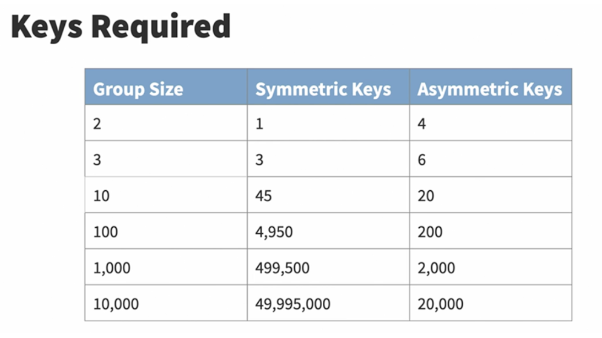

## 5.1 Understand data 

Encryption
* Transforms plaintext into ciphertext using an encryption algorithm (key)
* Ciphertext is unreadable until its decrypted using the decryption algorithm(key) 
* Protects Data at Rest and Data In Transit
* Categories
    * [Symmetric](https://en.wikipedia.org/wiki/Symmetric-key_algorithm)
        * Shared secret key for both encryption and decryption
        * 
        * Most commonly uses [Advanced Encryption Standard (AES)](https://en.wikipedia.org/wiki/Advanced_Encryption_Standard) algorithm
        * Common symmetric encryption algorithms:
            * Data Encryption Standard (DES)
                * Block cipher that was selected as an American government standard in the 1970s
                * Used a 56-bit encryption algorithm
                * No longer secure
            * Blowfish
                * block cipher algorithm created by Bruce Schneider to replace DES
                * offers variable rates of encryption 1-448 bit
            * Twofish
                * also written by Bruce Shneider
                * created after Blowfish
                * 128-bit encryption
            * Triple DES (3DES)
                * improvement on DES that runs the information through three mathematical operations using three different 56-but keys to create 168-bit encyption
                * block cipher
            * Rivest Cipher (RC4/RC5)
                * block cipher created by Ronal Rivest
                * 3 different verisons
                * RC4 which is a stream cipher used in SSL and WEP (for wireless security)
            * [Advanced Encryption Standard (AES)](https://en.wikipedia.org/wiki/Advanced_Encryption_Standard)
                * replaced 3DES as new standard for symmetric algorithms
                * block cipher
                * supports 128-bit, 192-bit, and 256-bit encryption
                * AES256
                    * if AES is used to encrypt data with 256-bit encryption, its referred to as AES256, or AES-256, instead of just AES
        * Formula to calculate the number of symmetric keys required for a group to communicate
            * (N * (N-1))/2 or (N2-N)/2
                * N == number of participants in the group
                * Table
                    
    * [Asymmetric](https://en.wikipedia.org/wiki/Public-key_cryptography)
        * Slower than symmetric but solves the issues of having large number of keys for large groups
        * Use different keys for encryption and decryption
        * Public Key Encryption / Key-Pair
            * public that can be shared
            * Private that is kept secret
        * Sender sends data encrypted using recipients public key, which intern is decrypted using their private key
        * 
        * Common asymmetric algorithms
            * [Rivest-Shamir-Adleman (RSA)](https://en.wikipedia.org/wiki/RSA_(cryptosystem))
                * first asymmetric algorithm that implemented signining and encryption. 
                * gets is name from its three creators
            * Diffie-Hellman
                * named after its creator
                * key-exchange protocol that deals with exchanging keys in a secure fashion
            * Elliptic curve
                * new asymmetric algorithm based on Diffie-Hellman for key exchange and digital signature algorithm (DSA) for signing messages.
                * also referred to as _elliptic curve cryptography_
    * [Hash Functions](https://en.wikipedia.org/wiki/Cryptographic_hash_function)
        * One-way functions that transforms a variable length input into a unique, fixed-length output and can't be reversed
        * The output of a hash function will always be the same length, regardless of the input size
        * Message digest is another term for hash
        * May fail
            * if they are reversible
            * If they are not collision-resilient
        * Common hash functions
            * Message Digest 5 (MD5)
                * Created by Ron Rivest in 1991
                * Fifth in a series of hash functions
                * Replaced md4 after is was deemed insecure
                * Produces 128-bit hash
                * No longer secure as of 2013, however still in use
            * SHA family
                * Created by NIST as a government standard
                * SHA-1
                    * Produces a 160-bit hash value
                    * Contains security flaws and is no longer secure
                * SHA-2 
                    * Family of six hash functions
                    * Replaces SHA-1
                    * Produces outputs of either 224, 256, 384, and 512 bits
                    * Mathematically similar to SHA-1 and MD5 and susceptible to same sec flaws and deemed insecure
                    * Still widely used
                * [SHA-3](https://en.wikipedia.org/wiki/SHA-3)
                    * Replaces SHA-2 in 2015
                    * NIST selected the Keccak algorithim which produce hash values of any desired lenght
                        * Length is set by the person computing the hash
            * [Race Integrity Primitives Evaluation Message Digest (RIPEMD)](https://en.wikipedia.org/wiki/RIPEMD#:~:text=RIPEMD%20(RIPE%20Message%20Digest)%20is,160%20is%20the%20most%20common)
                * Created by a group of Belgian researches as alternative to  to SHA due to its origins within the US gov especially the involvement of the National Security Agency (NSA)
                * Four variants that produce hashes of 128,160,256 and 320 bits
                    * 128-bit version is no longer secure
                    * 160 bit version is widely used including in supporting Bitcoin transactions
        * Uses of Hashes
            * Hash-Based Message Authentication Code (HMAC)
                * Combines symmetric cryptography and hashing
                * Provides authentication and integrity for messages
                * Create and verify message authentication code by using secret key in conjunction with a hash function
            * Used with asymmetric cryptography for digital signatures and digital certificates

Data Security
* Data Security Lifecycle
    * 
    * [NIST-SP 800-88](https://csrc.nist.gov/publications/detail/sp/800-88/rev-1/final)
        * Guidelines for secure media sanitization
            * Includes three different activities
            * Simply writing new data to the device
            * Clearing is effective against most types of causal analysis
            * Purging wiping
            * Destroying media is the ultimate protection
        * 
    * Destroy paper records at end-of-life (EoL)
        * Shredding
        * Pulping (using chemical process to remove ink from paper)
        * Burning
* Data Classification Policies
    * Assign information into categories, know as classifications, that determine storage, handling, and access requirements
    * Assign classifications based on
        * Sensitivity of information
        * Criticality of information
    * Classification levels
        * Military Classifications
            * Top Secret
            * Secret
            * Confidential
            * Unclassified
        * Business Classifications
            * Highly Sensitive
            * Sensitive
            * Internal
            * Public
    * Guides other security decisions
    * Labeling Requirements
        * Identify sensitive information
    * Secure disposal of sensitive data
        * Darik’s Boot and Nuke (DBAN)
            * Software based storage disposal
        * Magnetic degaussers and device shredders
    * Three different types (External Classification Requirements)
        * Personally Identifiable Information (PII)
            * Traceable to a specific person
        * Protected Health Information (PHI)
            * Covered by HIPAA
        * Payment Card Information (PCI)
            * Covered by PCI DSS
    * Guidelines and other security decisions
        * Use of strong encryption to protect sensitive and highly sensitive at rest and in motion
        * Use of standard labeling practices

Logging and monitoring security events
* Logs determine
    * Accountability
        * Who caused the event? (identity attribution)
        * Specific person, IP address or geolocation
    * Traceability
        * Uncover all other related events
    * Auditability
        * Provide clear documentation of the events
* AI can help solve security data analysis
* Security Information and Event Management (SIEM)
    * Central, secure collection point for logs
        * All systems send log entries 
    * Source of AI
        * to detect patterns and anomalies that other systems might miss
    * Has access to all logs across the org
        * Network Engs → firewall logs
        * System Engs → os and system logs
        * Application Engs → application logs
    * Provdies Log Correlation
    * Tuning and configuring
        * Point all systems to log repo
        * Write once, Read Many (WORM)
            * Prevents log tampering
            * Does event deduplication
        * Syncs System Clocks for consistent analysis
            * Use Network Time Protocol (NTP) (use national atomic clock servers as a time source)
        * Modify rules to prevent false positive alerts
        * Block trivial and irrelevant SIEM alerts
* Security Orchestration, Automation, and Response (SOAR)
    * 
    * Set of software solutions and tools that help optimize security operations in three important areas:
        * Threat and vulnerability management
        * Incident response
        * Security operations automation
    * Enables orgs to collect inputs that are monitored by the sec ops team
* Continous Monitoring
    * NIST Definition
        * _Maintaining ongoing awareness of information security, vulnerabilities, and threats to support organizational risk and management decisions_
    * 
    * Three Core Principles
        * Maps to risk tolerence
        * Adapts to ongoing needs
        * Actively involves management
    * Process:
        * Define
            * Continuous monitoring strategy is defined based up risk tolerance that maintains clear visibility into assets, vulnerabilities, threats and business impacts
        * Establish
            * Program is established by defining metrics and monitoring an assessment frequencies
        * Implment
            * Collecting the metrics and performing assessments and building reports in an automated way 
        * Analyze/Report
            * Analyze and build reports from collected data
        * Respond
            * Respond to findings
        * Review/Update
            * Review the program and adjust the strategy
    * [NIST SP 800-137](https://csrc.nist.gov/publications/detail/sp/800-137/final)
        * Guidelines set to assist orgnizations in the development of a continuous monitoring strategy and impmentation of a contiuous monitoring program
    * Anomaly Analysis
        * Detects outlier data points
        * Also known as Heuristic Analysis
    * Trend Analysis
        * Detects changes over time
    * Behavioral Analysis
        * Detects unusual user activity
    * Availability Analysis
        * Provides uptime information

## 5.2 Understand System Hardening

Systems hardening
* a collection of tools, techniques, and best practices to reduce vulnerability in technology applications, systems, infrastructure, firmware, and other areas. 
* goal of systems hardening is to reduce security risk by eliminating potential attack vectors and condensing the system's attack surface. 

Configuration management (e.g., baselines, updates, patches)
* Tracks the way that specific devices are set up
* Create artifacts to help how things are configured

* Baselining
    * Snapshot of a system at a given time
    * Use to compare changes
* Versioning
    * Assigned numbers to each version
    * Major.Minor.Build
* Standards
    * Naming conventions
    * IP addressing schema

* Change Management
    * Control risk of change

## 5.3 Understand best practices security policies

Data handling policy
* Describe how to protect sensitive information
* Define the types of information that is considered sensitive
* How employees must safeguard digital and/or paper records that are sensitive

Password policy
* Describes the protection and use of passwords
    * Password length requirements set a min number of characters, good practice to be min 8 characters
    * Some requiring longer passwords as those a deemed stronger
    * Also use complexity requirements, force users to use different characters and upper and lower cases
    * Password expiry policy
    * Password history requirements where you can't reuse a previously used password
    * Use Password managers to facilitate the use of strong, unique passwords
        * Secure vaults for storing passwords

Acceptable Use Policy (AUP)
* Describe authorized use of technology
* Addresses whether personal use of computers and systems is permitted or not
* How personal use is considered acceptable

Bring your own device (BYOD) policy
* Describe the use of personal devices with company information
* Security controls that must be in place, the type of information that may be processed

Change management policy
* Describes the documentation, approval, and rollback of technology changes

Privacy policy
* Describes the use of personally identifiable information
* Posted on company website
* May be enforced by national, state, and local authorities

## Understand security awareness training

Social Engineering 
* is a human threat that presents serious cybersecurity risks and are the hardest to defend against.
* Manipulate people into divulging information or performing an action that undermines security
* Six main reasons that social engineering attacks are successful:
    * Authority
        * People defer to authority and trust
        * [Art of intrusion book](https://www.amazon.ca/Art-Intrusion-Exploits-Intruders-Deceivers/dp/0471782661)
    * Intimidation
        * Scare / threaten people
    * Consensus/Social Proof
        * Herd mentality
        * Riots
    * Scarcity
        * Getting the last one
        * Fear of missing out (FOMO)
    * Urgency
        * Time is running out
        * People need to act quickly
    * Familiarity/Liking
        * People want to say yes to someone they like
* Prevention is education!!
* Impersonation Attacks
    * Spam
        * Unsolicited commercial email
        * Illegal under [Can-Spam act](https://www.ftc.gov/business-guidance/resources/can-spam-act-compliance-guide-business)
    * Phishing
        * Stealing credentials
        * Recon phase of a larger attack
        * Credential harvesting and reuse
    * Spear Phishing
        * Targeted attack
        * Higher success rate than generic phishing
        * Invoice scams are common form of spear phishing
    * Whaling
        * Target attacks on executives
        * Sub-set of spear phishing
        * Ex: Send fake court documents in link
    * Pharming
        * Using links to fake websites to gain access
        * Typosquatting to make URL seem very similar to the real site
        * Could use DNS poisoning
    * Vishing
        * Voice phishing
        * Pose as help desk user
    * Smishing and SPIM
        * SMS and IM spam
        * Use spoofing
            * Faking the identity of a sender
* Techniques:
    * Baiting
    * Phone phishing or vishing
    * Pretexting
    * Quid pro quo
    * Tailgating
    * False flag or false front operations

Security Education Programs:
* Security Training:
    * Provides users with the knowledge they need to protect the organization’s security
* Security Awareness:
    * Keeps the lessons learned during security training top of mind for employees
* Training Methods:
    * Instruction in on-site classes
    * Integration with orientation
    * Education through online computer-based training providers
    * Participation in vendor-provided classroom training
* Other training methods
    * Gamification
    * Capture the flag → trains employees on attack techniques
    * Phishing simulators
* Should be custom to the individual role
* Frequency
    * Initial training with new employees 
    * Updated with employee change role
    * Awareness throughout the year 
    * And Annual refresher
* Examples
    * [SANS Security Awareness](https://www.sans.org/security-awareness-training/?_ga=2.116998982.1325987726.1680173616-1034878085.1680173615&_gac=1.194571871.1680173616.CjwKCAjw5pShBhB_EiwAvmnNVxM1ns7d8ipLISv0mlCOp1xphQKJpgT1nw3FuTy00tZ58-l6MfDS_BoCiLsQAvD_BwE)
    * [COFENSE PhishMe](https://cofense.com/why-cofense/security-awareness-training/)
