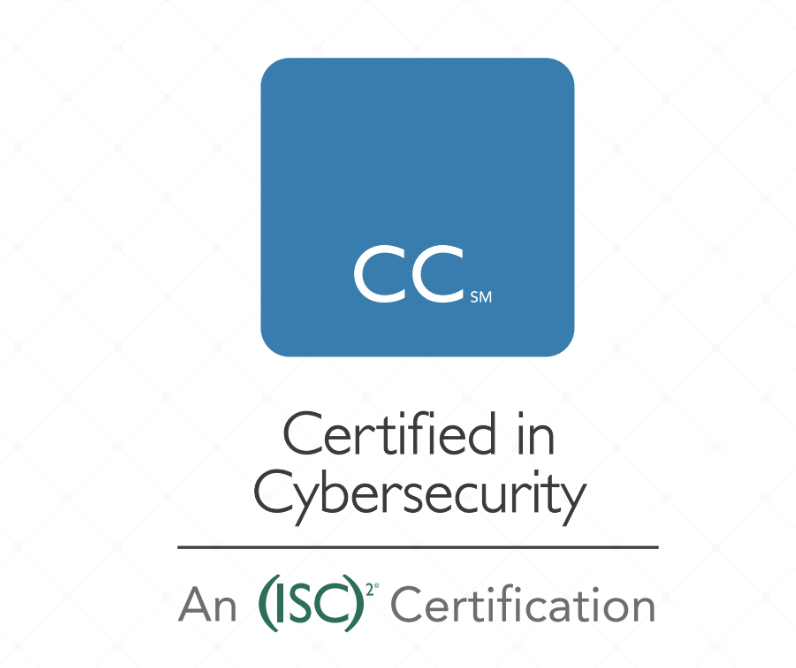

# About Certified in Cybersecurity Certification

Certified in Cybersecurity (CC) will prove to employers you have the foundational knowledge, skills and
abilities necessary for an entry- or junior-level cybersecurity role. It will signal your understanding of
fundamental security best practices, policies and procedures, as well as your willingness and ability to learn
more and grow on the job.
There are five domains covered on the exam.
1. [Security Principles](./Domain%2001%20-%20Security%20Principles.md)
2. [Business Continuity (BC), Disaster Recovery (DR) & Incident Response Concepts](./Domain%2002%20-%20BC%2C%20DR%2C%20and%20IR.md)
3. [Access Controls Concepts](./Domain%2003%20-%20Access%20Control%20Concepts.md)
4. [Network Security](./Domain%2004%20-%20Network%20Security.md)
5. [Security Operations](./Domain%2005%20-%20Security%20Operations.md)

# CC Examiniation Weights
| Domains | Average Weight |
| --------- | ----------|
| 1. Security Principles | 26% |
| 2. BC, DR, & IR Concepts | 10% |
| 3. Access Control Concepts | 22% |
| 4. Network Security | 24% |
| 5. Security Operations | 18% |
|                   TOTAL | 100% |