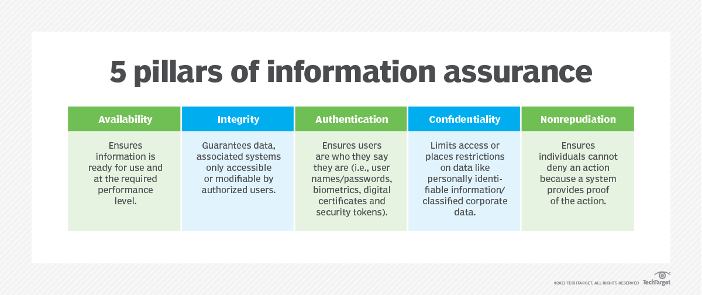
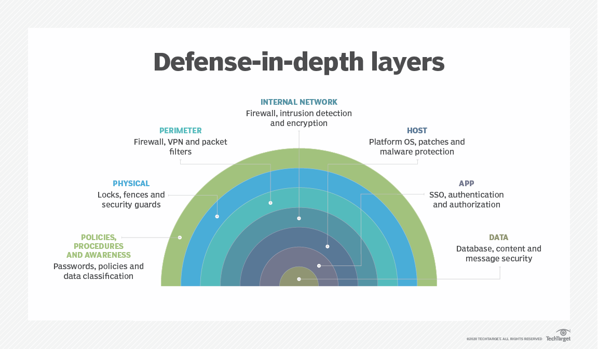
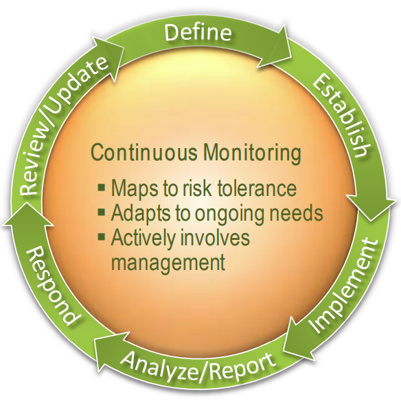

# Domain 1: Security and Risk Management (16% of the Exam)

## 1.1 - Understand, adhere to, and promote professional ethics

### ISC2 Code of Professional Ethics

The [Code of Ethics Preamble]( https://www.isc2.org/ethics): _“The safety and welfare of society and the common good, duty to our principals, and to each other requires that we adhere, and be seen to adhere, to the highest ethical standards of behavior.”  “Therefore, strict adherence to this Code is a condition of certification.”_

**Code of Ethics Canons**:

* **I. Protect society, the common good, necessary public trust and confidence, and the infrastructure**
  * highest-level canon
  * emphasizes that a cybersecurity professional's primary responsibility is to the well-being of the public
  * includes promoting public trust in information systems, preserving the integrity of the public infrastructure, and discouraging unsafe practices that could cause harm.
* **II. Act honorably, honestly, justly, responsibly, and legally**
  * focuses on the personal integrity of the professional
  * requires individuals to be truthful, transparent, and fair in their work
  * mandates that professionals must observe all contracts and agreements, act within the bounds of the law, and take responsibility for their actions.
* **III. Provide diligent and competent service to principals**
  * addresses the professional's responsibility to their employers and clients
  * requires them to provide high-quality, professional service that is within their competence
  * includes preserving the value of the principal's systems, avoiding conflicts of interest, and respecting the trust and privileges granted to them.
* **IV. Advance and protect the profession**
  * focuses on the collective good of the cybersecurity profession
  * encourages professionals to mentor others, share knowledge, and promote a positive reputation for the field
  * requires them to avoid associating with those whose practices might diminish the profession's standing and to maintain their own professional competence through continuous learning.

**Violations**:

* Members of ISC2 who encounter violations of the Code of Ethics may report the possible violation to ISC2 for investigations
* Members are required to fill a formal ethics complaint and must specify the canon that was violated and the member who violated it
* Complaints are only accepted from those who believe they have been injured by the alleged behavior
* Complaints must be in writing and injury resolution is determined based on:
  * **Any member of the general public** may file a complaint involving **Canon I an/or II**
  * Only an **employer or someone** with **a contracting relationship with the individual** may file a complain under **Canon III**
  * Other professionals may file a complaint under Canon IV
    * not limited to Cybersecurity professionals
    * can be anyone certified or licensed as a professional and subscribes to a code of ethics as part of that license/certification is eligible to file a Canon 4 complaint

### Ethics and the Internet

Organizational code of ethics:

* Your organization may have its own code of ethics
* contents of the code of ethics may depend on the type of business that it engages in and could span dozens of pages.  
* If you’re a professional (doctor, lawyer, nurse, accountant), your regulatory organization may also enforce a code of ethics.  
* The code of ethics tells us how to behave, so that there is no confusion.
* When you’re not sure what to do, you should report the situation to your management for a decision.

We must be sure to act ethically at all times.  

Things that are not ethical as defined by [RFC 1087](https://datatracker.ietf.org/doc/html/rfc1087) (developed by the [Internet Architecture Board (IAB)](https://www.iab.org/)):

* Purposely seeks to gain unauthorized access to the resources of the Internet
* Destroys the integrity of computer-based information
* Disrupts the intended use of the Internet
* Wastes resources such as people, capacity, and computers through such actions
* Compromises the privacy of users
* Involves negligence in the conduct of Internet-wide experiments

### [Computer Ethics Institute (CEI)](http://cpsr.org/issues/ethics/cei) Code of Ethics

The commandments are a set of standards to guide ethical conduct in the use of computers:

1. **Thou shalt not use a computer to harm other people**: This principle extends the idea of physical harm to digital harm, such as creating malicious software or engaging in cyberbullying.

2. **Thou shalt not interfere with other people's computer work**: This means avoiding actions that disrupt others' computer systems, like spreading viruses or deliberately causing a network to crash.

3. **Thou shalt not snoop around in other people's computer files**: This commandment emphasizes the importance of digital privacy, comparable to not invading someone's personal space or reading their private letters.

4. **Thou shalt not use a computer to steal**: This covers a wide range of illegal activities, including stealing data, money, or services through a computer.

5. **Thou shalt not use a computer to bear false witness**: This is about using a computer to spread misinformation or lies, such as creating fake online profiles or spreading false rumors.

6. **Thou shalt not copy or use proprietary software for which you have not paid**: This addresses software piracy and the importance of respecting intellectual property rights.

7. **Thou shalt not use other people's computer resources without authorization or proper compensation**: This is about respecting the ownership and access rights of computer hardware and networks, such as hacking into a system or using a company's resources for personal gain.

8. **Thou shalt not appropriate other people's intellectual output**: This commandment relates to plagiarism and copyright infringement, reminding users to properly credit and seek permission for the work of others.

9. **Thou shalt think about the social consequences of the program you are writing or the system you are designing**: This is a call to action for developers and designers to consider the ethical and societal impact of their work before it's released.

10. **Thou shalt always use a computer in ways that ensure consideration and respect for your fellow humans**: This is a foundational principle that encapsulates all the others, emphasizing empathy and human dignity in all digital interactions.

### [Code of Fair Information Practices](https://epic.org/fair-information-practices/)

* Developed by a government advisory committee in 1973
* Five Principles
  >1. There must be no personal data record-keeping systems whose very existence is secret.
  >2. There must be a way for a person to find out what information about the person is in a record and how it is used.
  >3. There must be a way for a person to prevent information about the person that was obtained for one purpose from being used or made available for other purposes without the person’s consent.
  >4. There must be a way for a person to correct or amend a record of identifiable information about the person.
  >5. Any organization creating, maintaining, using, or disseminating records of identifiable personal data must assure the reliability of the data for their intended use and must take precautions to prevent misuses of the data.

## 1.2 - Understand and apply security concepts

### CIA Triad

Core concept of Information Security known as the _**CIA**_ triad, which has three major goals

* **Confidentiality**
  * Efforts and measures to protect and control access to information / data / objects / resources to prevent unauthorized disclosure
  * One form of confidentiality MAY not support or allow other forms
  * Concepts:
    * **Sensitivity**: Quality of information that could cause harm or damage if disclosed
    * **Discretion**: Decision where an operator can influence or control disclosure to minimize harm or damage
    * **Criticality**
      * Level to which information is mission critical is its measure of criticality
      * High level of criticality, the more likely the need to maintain the confidentiality of the information
    * **Concealment**
      * Act of hiding or preventing disclosure
      * Viewed as a means of cover, obfuscation, or destruction
      * "Secure through obscurity"
      * Gain protection through hiding, silence, or secrecy
    * **Secrecy**: Act of keeping something a secret or preventing the disclosure of information
    * **Privacy**: Keeping information confidential that is personally identifiable, or that might cause harm, embarrassment,  or disgrace to someone if revealed.
    * **Seclusion**: Storing something in an out-of-the-way location with strict access controls
    * **Isolation**: Act of keeping something separated from others
* **Integrity**
  * Protecting the reliability and correctness of data
  * Prevents unauthorized alterations of data
  * Examined from three perspectives:
    * Preventing unauthorized subjects from making modifications
    * Preventing authorized subjects from making unauthorized modifications, such as mistakes
    * Maintaining the internal and external consistency of objects so that their data is as correct and true reflection of the real world and any relationship with any other object is valid, consistent, and verifiable
  * Countermeasures include
    * Data Encryption / Hash verifications
    * Strict access controls
    * rigorous authentication procedures
    * IDS
  * Concepts:
    * **Accuracy**: Being correct and precise
    * **Truthfulness**: Being a true reflection of reality (Authenticity)
    * **Validity**: Being factually or logically sound
    * **Accountability**: Being responsible or obligated for actions and results (Nonrepudiation)
    * **Responsibility**: Being in charge or having control over something or someone
    * **Completeness**: Having all necessary components, or parts
    * **Comprehensiveness**: Being complete in scope; the full inclusion of all needed elements
* **Availability**
  * Efforts to make sure data and systems are available for authorized use
  * Supporting infrastructure is functional and allows authorized users to gain access
  * Threats to availability may include
    * device failure (DDoS)
    * software errors
    * environmental
  * Countermeasures include:
    * DR strategy
    * perf monitoring
    * designing intermediary delivery systems (Pub/Sub)
  * Depends on both Confidentiality and Integrity
  * Concepts:
    * **Usability**: State of being easy to use or learn or being able to be understood and controlled by a subject
    * **Accessibility**: Assurance that the widest range of subjects can interact with a resource regardless of their capabilities or limitations
    * **Timeliness**: Being prompt, on-time, within a reasonable time frame, low latency response times

#### Five Pillars - Extension of CIA Triad

* Additional pillars of CIA Triad
* **Authenticity**
  * Concept that data is authentic or genuine and originates from its alleged source
  * Relates to integrity but more closely related to verifying that it is from a claimed origin
  * IF data has authenticity, the recipient can have high level of confidence that the data is from whom it claims to be and did not change in transit
  * digital signatures
  * prevents fraud
  * _**"verifies you are who you claim to be"**_
* **Nonrepudiation**
  * Ensures that the subject of an activity or who caused an event cannot deny that the event occurred.
  * Prevents a subject from claiming not to have done or performed an action or to not have been the cause if an event
  * Made possible through identification, authentication, authorization, auditing, and accounting
  * Established using digital certificates, session identification, transaction logs, and numerous other transactional and access control mechanisms.
  * a suspect cannot be held accountable IF they can repudiate the claim against them
  * digital signatures, comprehensive audit trails, physical signatures, biometrics, video surveillance

### (I)AAA Services

* Core fundamental concepts for security mechanisms (**_Access Control_**) of all security environments
* Five elements:
  * **Identification**
    * claiming to be an identity when attempting to access a secured area/system
    * involves username/password, swiping a smart card, proximity card, etc
    * biometrics
    * without this a system has no way of correlating au authentication factor with the subject
    * Identity must be proven before use is allowed or access is granted
  * **Authentication**
    * proving/verifying that a claimed identity is valid
    * requires subject to provide additional info to prove their identity
    * most common is a password
    * Identification and authentication are typically used together in a two-step process
      * Providing the identity is the first step, providing the authentication factor is the second step
      * without both a subject cannot gain access to a system. neither element alone is useful in terms of security
  * **Authorization**
    * defines the permission (i.e allow/grant and/or deny) or a resource and object access for a specific identity or subject
    * ensures that the requested activity or access to an object is possible
  * **Auditing**
    * recording of a log of the events and activities related to the system and subjects
    * programmatic means by which a subject's actions are tracked and recorded to hold them accountable
    * process for detecting unauthorized or abnormal activities
    * support accountability
  * **Accounting**
    * also known as _accountability_
    * reviewing log files to check for compliance violations in order to hold subjects accountable for their actions, especially in violation of organizational security policies
    * supports auditing

### DAD, Overprotection, Authenticity, Nonrepudiation

#### DAD

* Opposite of the **CIA Triad** and **Five Pillars of InfoSec**
* stands for _Disclosure, alteration, and destruction_
* represent the **_failures_** of security protections in the CIA triad.
* Elements:
  * **Disclosure**
    * Occurs when sensitive or confidential material is accessed by unauthorized entities
    * Violates confidentiality
    * Attackers perform data exfiltration
  * **Alteration**
    * Occurs when data is either maliciously or accidentally changed
    * Violates integrity
    * attackers modify records for financial gain (encrypt for ransomware)
  * **Destruction**
    * Occurs when a resource is damaged or mad inaccessible to authorized entities
    * Violates availability
    * attackers launch DDoS attack against a website

#### Overprotection

* Sometimes too much security is a problem
  * Overprotecting confidentiality and integrity can result in a restriction to availability
  * Overproviding availability can result in a loss of confidentiality and integrity

### Protection (Controls) Mechanisms

#### Defense-In-Depth

* aka [_layering_](https://en.wikipedia.org/wiki/Defense_in_depth_(computing)) or the [onion model](https://en.wikipedia.org/wiki/Onion_model)
* multiple overlapping controls in a series for one objective
  * no one control can protect against all possible threats
  * a single failed control **SHOULD NOT** result in the exposure of systems and/or data
* Concepts:
  * a **series configuration** are very narrow but deep
  * a **parallel configuration** are very wide but shallow, useful in distributing computing applications
* _Defense in breadth_ or _Diversity in defense_
  * Using a wide range of security products from varied vendors significantly reduces or avoids the risk of a single exploit compromising several layers at once.
  * Can be problematic if elements of the security layers are from the same vendor or share common code, since a vulnerability could affect numerous layers simultaneously
* Example:
  * A company secures its internal network using multiple layers:
    * a firewall to block unauthorized traffic, multi-factor authentication (MFA) for user logins, endpoint protection software on all devices, network segmentation to isolate sensitive systems, and continuous logging and monitoring for anomalies.
    * Pros:
      * Redundancy: If one layer fails (e.g., a user falls for a phishing attack), other controls like MFA or endpoint detection can still prevent or mitigate the breach.
      * Reduced Risk: It makes successful attacks more difficult, requiring attackers to bypass several independent defenses.
      * Comprehensive Coverage: Addresses multiple types of threats—technical, physical, and human.
    * Cons:
      * Complexity - Managing and maintaining multiple overlapping controls can increase administrative overhead and potential for misconfiguration.
      * Cost - More tools, licenses, and personnel are needed, which can strain smaller organizations’ budgets.
      * User Frustration - Layered security (e.g., frequent MFA prompts, limited access) can lead to productivity complaints or attempts to bypass controls.
* Groups of Controls
  * **Administrative Controls**
    * sometimes referred to as _management controls_, _managerial controls_, or _procedural controls_
    * includes the policies and procedures defined by the organization's security policy and other regulations or requirements
    * focus on personal oversight and business practices
    * examples include:
      * policies, standards, and procedures
      * hiring practices, background checks
      * data classifications and labelling
      * security awareness and training efforts
      * reports / reviews
      * work supervision
      * personal controls
      * testing
  * **Logical/Technical Controls**
    * involves the hardware or software mechanisms used to manage access and provide protection for IT resources and systems
    * examples include:
      * authentication methods (such as passwords, smartcards, and biometrics)
      * encryption
      * constrained interfaces
      * access control lists
      * protocols, firewalls
      * routers
      * intrusion detection/prevention systems (ID/IPS)
      * **Physical Controls**
        * security mechanisms focused on providing protection to the facility and real-world objects
        * examples include:
          * guards / guard dogs
          * fences
          * motion detectors / lights / video cameras
          * locked doors / seal windows
          * cable protection / laptop locks
          * badges / swipe cards
          * access control vestibules
          * alarms
* **Security Controls**
  * refers to a broad range of controls that perform task to mitigate a wide variety of info sec risks such as ensuring only authorized users can log on and preventing unauthorized users from gaining access to resources
  * Types of Controls
    * **Preventive**
      * aka _Preventative control_
      * deployed to thwart or stop unwanted or unauthorized activity from occurring.
      * Examples:
        * fences / locks
        * authentication / access control vestibules
        * alarm systems, separation of duties,
        * job rotation / security policies
        * DLP / pen testing
        * antimalware software / firewalls / IPS
    * **Detection**
      * aka _Detective control_
      * deployed to discover or detect unwanted or unauthorized activity
      * operate after the fact and can discover the activity only after it has occurred
      * examples:
        * security guards
        * motion detectors
        * recording/reviewing of events captured by security cameras or CCTV
        * job rotation
        * mandatory vacations
        * audit trailstory
        * honeypots / honeynets
        * IDS
        * violation reports / supervision and review of users
        * incident investigations
    * **Corrective**
      * aka _Corrective control_
      * modifies the environment to return systems to normal after an unwanted or unauthorized activity has occurred
      * attempts to correct any problems resulting from a security incident
      * deployed to repair or restore resources, functions, and capabilities
      * Examples include:
        * antimalware solution that can remove or quarantine a virus
        * terminating a malicious activity or rebooting as system
        * backup and restore plan to ensure that lost data can be restored
        * IPS that can modify an environment to stop an attack in progress
        * installing a spring on a door so that it will close and lock
        * using file integrity-checking tools (sigverif) which will replace corrupt boot files upon each boot event to protect the stability and security of the booted OS
    * **Recovery**
      * aka _Recovery control_
      * extension of corrective controls but has more advanced or complex abilities
      * attempts to repair or restore resources, functions, capabilities after a security policy violation
      * address more significant damaging events compared to corrective controls
      * examples include:
        * backup and restores / fault-tolerant drive systems
        * system imaging / server clustering
        * antimalware software
        * database or vm shadowing
        * examples in relation to BCDR
          * hot / warm / cold sites
          * alternate processing facilities
          * service bureaus
          * reciprocal agreements / cloud providers
          * rolling mobile operating centers / multisite solutions
    * **Deterrent**
      * aka _Deterrent control_
      * similar to preventative controls however deterrent controls often depend on individuals being convinced not to take an unwanted action
      * countermeasure deployed to discourage security policy violations
      * examples include
        * policies, security awareness training
        * locks / fences / security badges / guards
        * access control vestibules
        * security cameras
    * **Directive**
      * aka _directive control_
      * deployed to direct, confine, or control the actions of subjects to force or encourage compliance with security policies
      * examples include
        * security policy requirements or criteria
        * posted notifications
        * guidance from security guard
        * escape route exit signs
        * monitoring
        * supervision
        * procedures
    * **Compensating**
      * aka _compensating (compensation) control_
      * deployed to provide various options to other existing controls to aid in the enforcement and support of security policies
      * can be any controls used in addition to, or in place of, another control
      * can be a means to improve the effectiveness of a primary control or as the alternate or failover option in the event of a primary control failure
      * examples include:
        * if a building's fire prevention and suppression control system fails and the building is damaged by fire so that it is not inhabitable, a compensating control would be have a disaster recovery plan with an alternate processing site available to support work operations
        * if a preventative control fails to stop the deletion of a file, a backup can be a compensating control, allowing fore the restoration of that file

#### Other Concepts

* **Abstraction**
  * the process of hiding complex implementation details and exposing only essential features to reduce risk, simplify access control, and minimize the attack surface.
  * think about Object Oriented Programming (OOP)
  * used for efficiency
  * assign security controls to a group of objects collected by type or function
  * mediated access to data/services (request admin access)
* **Data Hiding**
  * the practice of concealing internal data structures or sensitive information from unauthorized users to prevent accidental or malicious access or modification.
  * intentionally preventing data from being discovered or access by a subject by positioning that data in a logical storage compartment that is not accessible to nor seen by the subject cannot access or see the data
  * subject cannot access or see the data
  * keeping a database from being accessed by unauthorized visitors and restricting a subject to a lower classification level from access data at a higher classification level
  * similar to security through obscurity_ however does not actually implement any form of protection, instead attempts to hope something important is not discovered by keeping knowledge of it a secret
* **Encryption**
  * the process of converting readable data into an unreadable format using an algorithm and key, ensuring that only authorized parties can access the original information.
  * Falls under data hiding also referred to as the science of hiding the meaning or intent of a communication from unintended recipients
  * can take many forms and should be applied to every type of electronic communication
  * More details in [Domain 3](Domain%203%20-%20Security%20Architecture%20and%20Engineering.md)
* **Security Boundaries**
  * Clearly defined borders—physical, logical, or administrative—that separate different levels of trust, control, or security within or between systems, helping to enforce access controls, contain threats, and protect sensitive resources.
    * **_Physical Security Boundary_**:
      * A locked server room with keycard access that physically restricts who can get close to critical infrastructure like servers, switches, or firewalls.
    * **_Logical Security Boundary_**:
      * A network firewall that separates an internal trusted network from an untrusted external network (e.g., the internet), enforcing rules about what data can pass between them.
    * **_Administrative Security Boundary_**:
      * A set of policies and user roles that limits access to HR data to only HR personnel, even though the data resides on the same server used by other departments.
  * line of intersection between areas, subnets, or environments with different security requirements or needs
  * exists between high-security and low-security areas such as LAN and the Internet
  * flow control mechanisms should be deployed between the boundaries for security
  * important to state where one boundary ends and the other begins in both physical and logical environments
  * when a transforming a security policy into actual controls each environment and security boundary must be considered separately
  * security controls and mechanism should be:
    * cost effective, reasonable, and efficient for each environment
    * weighed against the value of the objects they protect
    * deploying mechanisms that cost more than the object they protect is unwarranted

## 1.3 - Evaluate and apply security governance principles

### Security Governance

* Defined as "the collection of practices related to supporting, evaluating, defining and directing an organization's security efforts"
* the framework of policies, processes, and controls that ensure an organization’s information security strategy aligns with its business objectives, complies with regulations, and manages risk effectively.
* seeks to compare the security processes and infrastructure used within an organization with knowledge and insights obtained from external sources
* implementation of a security solution and a management method that are tightly interconnected
* Performed by a board of directors or governance committee
  * smaller organizations may have the chief executive officer (CEO) and/or chief information security officer (CISO) perform the activities
* board of directors typically often consists of people from various backgrounds and industries
* principles are closely related to and often intertwined with corporate and IT governance and their agendas are often the same or related:
  * such as maintaining business processes while striving toward growth and resiliency
* sometimes this is imposed by legislative and/or regulatory compliance needs as well as industry guidelines or license requirements
* "Security is not and should not be treated as an IT operations issue"
* "Security is an organizational process and touches every aspect of an organization"

### Third-Party Governance

* the processes and controls an organization uses to manage and monitor the security practices of external vendors, partners, or service providers to ensure they meet required security standards and do not introduce undue risk.
* system of external entity oversight that law, regulation, industry standards, contractual obligation, or licensing requirements may mandate.
* involves outside investigator or auditor hired by an organization
* application of security oversight to third parties the organization relies on for such activities as:
  * security guards
  * maintenance
  * technical support
  * accounting services
* these parties must comply with the primary organization's security stance
* focuses on verifying compliance with stated security objectives, requirements, regulations, and contractual obligations
  * done by performing on-site assessments or audits
  * both target and governing body SHOULD participate in full and open document exchange and review
* Ponemon Institute’s 2023 report on third-party risk found that 51% of organizations experienced a data breach caused by a third party.
* Gartner has reported that 60% of organizations work with over 1,000 third parties and that cyber incidents involving third parties are growing year over year.
* The IBM Cost of a Data Breach Report 2023 notes that breaches involving third parties cost more and take longer to identify and contain than internal incidents.

### Documentation Review

* the systematic examination of policies, procedures, standards, and records to ensure they are accurate, complete, up to date, and aligned with security requirements, best practices, and compliance obligations.
* typically performed before any on-site inspect is done
* if documentation is sufficient and meets expectations/requirements then the on-site review will focus on compliance with the stated documentation
* if document is incomplete, inaccurate, or otherwise insufficient, then the on-site review is postponed until the documentation is updated and corrected
* in most scenarios (ie. military and/or government) failing provide sufficient documentation can often result in a loss of or voiding of _authorization to operate (ATO)_
  * ATO is formal decision that allows an info system or product to operate with other systems or networks, which aims to minimize and manage risk
  * mostly comes from Federal Information Security Management Act (FISMA)
  * once an ATO is revoked/lost, complete documentation and site inspection/review show full compliance are typically required/necessary

### A

* The rules for the information security ”game” must be documented, and they’re first documented in policy.
* Do the rules for the game further the business strategy, goals, mission, and objectives OR do they hinder them?
* **_Business case_** - a structured justification for a security initiative or investment, demonstrating how it supports organizational objectives, mitigates risk, ensures compliance, and delivers value—often by weighing costs, benefits, and potential impacts.
* **_Top-down approach_** - a management-driven strategy where senior leadership defines security policies, goals, and priorities, ensuring alignment with business objectives and enabling effective implementation across the organization.

#### Managing The Security Function

* **_Security Function_**
  * the organizational role or team responsible for developing, implementing, managing, and monitoring the strategies, policies, and controls that protect information assets from threats and ensure confidentiality, integrity, and availability.
  * If information security is risk management (it is), then risk **assessment(s)**, **measurement**, risk **decision-making**, and ongoing improvements are all imperative.

**_Security Function_** is defined as _"the aspect of operating a business that focuses on the task evaluating and improving security over time"_ and **management** of this function is typically performed through thorough _Security Governance_.

* Performing _Risk Assessments_ to drive the security policy is clearest and most direct example of management of the security function.
* Security must be measurable, meaning various aspects of the security mechanism function, provide clear benefit and have one or more metrics that be recorded and analyzed.
* Security metrics
  * performance, function, operation, action, etc
  * related to the operations of a security feature
* when controls/countermeasures are implemented, security metrics MUST show a reduction in unwanted occurrences or an increase in the detection of attempts/incidents
* measuring and evaluating security metrics is a key component of assessing the effectiveness and completeness of the security program, including measuring them against common security guidelines and tracking the success of its controls
* includes the development and implementation of information security strategies

#### Security Management Planning

* alignment of the security function to business strategy, goals, mission, and objectives
* ensures the proper creation, implementation, and enforcement of a security policy
* aligns security function to the strategy, goals, mission, and objectives of the organization which includes:
  * designing and implementing security based on:
    * **_Business case_**
      * a structured justification for a security initiative or investment, demonstrating how it supports organizational objectives, mitigates risk, ensures compliance, and delivers value—often by weighing costs, benefits, and potential impacts.
      * demonstrates a business specific need to alter an existing process or choose an approach to a business task
    * budget restrictions
    * scarcity of resources
* Approaches
  * **_Top down approach_**
    * the most effective way to tackle security management planning
    * a (upper/senior) management-driven strategy where senior leadership defines security policies, goals, and priorities, ensuring alignment with business objectives and enabling effective implementation across the organization.
  * **_Bottom up approach_**
    * a strategy where technical staff or operational teams initiate and implement security measures without formal direction from upper management, often resulting in ad hoc solutions that may lack alignment with broader organizational goals.
* responsibility should be upper management and not IT staff
* considered an issue of business operations rather than IT administration
* team/department responsible for security should be autonomous
  * **_Information Security (InfoSec)team_** SHOULD be lead by a designated **_Chief information security officer (CISO)_** who reports directly to SR. Management (CEO or board)
    * sometimes referred to a **_Chief Security Office (CSO)_**, but this is mostly a subposition under the CISO same as **_Information Security Office (ISO)_**
    * leads a team of security generalists/specialists
  * placing the autonomy of the CISO and their team outside the typical org structure improves security management across the org and avoid cross-department and internal political issues.
  * Other members include:
    * **_Chief Information Office (CIO)_** focuses on ensuring information is used effectively to accomplish business objectives
    * **_Chief Technology Officer (CTO)_** focuses on ensuring that equipment/software work properly to support the business functions.
* Elements of security management planning include:
  * Defining security roles
  * Describing how security will be managed
  * Who is responsible for security
  * How security will be tested for effectiveness
  * Developing security policies
  * Performing risk analysis
  * Requiring security education for employees
* Security plan is useless without sr. management approval
* Developing and implementing a sec policy is evidence of **due diligence** and **due care**, if _due diligence_ and _due care_ is not practice then sr. management will be held liable for negligence and accountable for both asset and financial loss
* Three types of plans that should be developed:
  * **Strategic Plan**
    * Long term plan that is _fairly_ stable
    * Defines the organization's security purpose
    * Defines the security function and aligns it with the goals, mission, and objectives of the organization
    * Serves as the planning horizon for the other plans
    * SHOULD include a risk assessment
    * Good for 5 years if maintained and updated annually
    * High-level and broad in scope
    * Developed by senior leadership (CISO, CIO)
    * Addresses regulatory requirements, emerging risks, and future tech trends
  * **Tactical Plan**
    * Midterm plan developed to provide more details on accomplishing the goals from the strategic plan
    * can be crafted ad hoc based on unpredicted events
    * typically useful for about 1-2 years
    * prescribes and schedules tasks necessary to accomplish organizational goals
    * medium-level detail
    * managed by security managers or team leads
    * Examples include:
      * Project plans
      * Acquisition plans
      * Hiring and budget plans,
      * maintenance, support and system development plans
    * allocates resources and timelines
  * **Operational Plan**
    * short team highly detailed plan based on strategic and tactical plans
    * valid or useful for a short time, must be updated monthly or quarterly to stay in compliance with the tactical plans
    * details out HOW to accomplish the various goals of the organization which include:
      * resource allotments,
      * budgetary requirements,
      * staffing assignments,
      * scheduling, and step-by-step or implementation procedures (playbooks)
      * includes how the implementation processes are in compliance with the organization's security policy
      * owned and maintained by technical teams, analysts, or admins
      * typically tied to roles or functions
      * examples:
        * training plans
        * system deployment plans
        * product design plans
* Security and Security Management planning is a continuous process
  * Has a definite initiation point however its tasks and work are never fully accomplished or complete
  * effective security plans focus attention on 
    * specific and achievable objectives, anticipate change and potential problems
    * serve as a basis for decision-making for the entire organization
  * security documentation should be concrete, well-defined, and clearly stated
* security plans MUST be developed, maintained and actually used to be EFFECTIVE

### Organizational roles and responsibilities

**_Security role_**: defined as _an individual's part in the overall scheme of security implementation and administration within an organization_.

* not necessarily prescribed in job descriptions as they are not always distinct or static
* understanding each helps establish a communication/support structure within an organization
* common security roles in a typical secured environment:
  * **Senior Manager**
    * organizational owner assigned to the person ultimately responsible for the security maintained by an organization as well as who should be concerned most about the protection of assets
    * must sign off on all security policy issues
    * no effective security policy if the sr. management does not authorized/support it
    * person who is held liable for the overall success/failure of the security solution
    * responsible for exercising due diligence and due care in establishing the overall security of the organization
    * rarely implements
  * **Security Professional**
    * security professional, information security (infosec) officer, or cyber incident response team (CIRT) role
    * assigned to a trained and experienced network, systems, and security engineer
    * responsible for implementing security solutions based on the mandated directives of senior management
    * implementer not decision maker
    * functional role includes writing the security policy and implementing it
    * labeled as an IS/IT role but focuses on function
    * often filled by a team
  * **Asset owner**
    * assigned to the person who is responsible for classifying information for placement and protection within a security solution
    * typically a high-level manager
    * delegates responsibility of actual data management tasks to a _custodian_
  * **Custodian**
    * assigned to the person responsible for the tasks of implementing the prescribed protection defined by the security policy and senior management.
    * performs all activities necessary to provide adequate protection for the CIA triad of data and to fulfill the requirements and responsibilities delegated by upper management which include
      * performing / testing backups
      * validating data integrity
      * deploying security solutions
      * managing data storage based on classification
  * **User**
    * end user or operator
    * assigned to the person who has access to the secure system
    * access it tied to their work task following the principle of least privilege (PoLP)
    * responsible for understanding and upholding the security policy by following prescribed operating procedures and processes within defined security parameters
  * **Auditor**  
    * role assigned to the person (internal or external) responsible for reviewing and verifying that the security policy is properly implemented and the derived security solutions are adequate
    * produces compliance and effectiveness reports
    * issues discovered in these reports are transformed into new directives assigned by the senior manager to security professionals or custodians
  * **Executive & Leadership Roles**
    * **_Chief Information Security Officer (CISO)_**
      * Sets the overall security strategy and direction.
      * Aligns security with business goals.
      * Reports to executive leadership or the board.
    * **_Deputy CISO / Security Director_**
      * Assists the CISO, often managing day-to-day operations.
      * Coordinates between teams and oversees program execution.
  * **Management & Oversight Roles**
    * **_Security Program Manager_**
      * Oversees large-scale security initiatives and project portfolios.
      * Ensures milestones, budgets, and timelines are met.
    * **_Compliance / GRC Manager_**
      * Manages governance, risk, and compliance (GRC) functions.
      * Oversees regulatory compliance and policy frameworks (e.g., ISO 27001, NIST, HIPAA).
    * **_Security Awareness & Training Lead_**
      * Develops and delivers security education to employees.
      * Promotes a security-conscious culture.
  * **Technical & Operational Roles**
    * **_Security Architect_**
      * Designs secure systems, networks, and cloud environments.
      * Ensures security is built into infrastructure and software.
    * **_Security Engineer_**
      * Implements and manages technical security controls (e.g., firewalls, SIEMs, EDR).
      * Builds automation and tooling for defense.
    * **_Penetration Tester / Ethical Hacker_**
      * Simulates attacks to identify weaknesses.
      * Provides remediation guidance.
    * **_Security Analyst_**
      * Monitors systems for threats, analyzes alerts, and investigates incidents.
      * Often part of the SOC (Security Operations Center)
    * **_Incident Responder / SOC Analyst_**
      * Handles real-time incident detection, containment, and response.
      * Escalates and coordinates incident management efforts.
    * **_Threat Intelligence Analyst_**
      * Tracks threat actors, TTPs, and emerging risks.
      * Enriches defense posture with external (threat) intel
  * **Governance, Risk, and Compliance (GRC) Roles**
    * **_Risk Analyst / Risk Manager_**
      * Identifies, assesses, and mitigates information security risks.
      * Works closely with business units on risk decisions.
    * **_Policy & Audit Analyst_**
      * Develops policies, standards, and procedures.
      * Conducts internal audits and supports external assessments
    * **_Third-Party Risk Analyst_**
      * Evaluates and monitors security risks posed by vendors and partners.
      * Manages due diligence and assessments.
  * **Specialized or Supporting Roles**
    * **_Data Privacy Officer_**
      * Oversees compliance with privacy laws (e.g., GDPR, CCPA).
      * Works with legal and security on personal data protection.
    * **_Security Software Developer / DevSecOps Engineer_**
      * Integrates security into the software development lifecycle (SDLC).
      * Automates security testing and deployment.
    * **_Cloud Security Engineer_**
      * Secures cloud platforms (AWS, Azure, GCP).
      * Manages identity, encryption, and configuration.

### Organizational processes (e.g., acquisitions, divestitures, governance committees)

* Security governance SHOULD address all aspects of the organization including processes such as **acquisitions**, **divestitures**, and **governance committees**.
* Mergers and Acquisitions (M&A)
  * adds organizational and legal risk which include:
    * inappropriate info discloser
    * data loss
    * downtime
    * failure to achieve sufficient ROI
  * higher degree of security oversight in increased during M&A do reduce losses during the transition period
  * M&A's done without security considerations the risks inherent in those obtained products remain throughout their deployment life cycle
  * minimizing inherent threats in acquired elements will reduce risk and cost on security management
  * important to consider TCO over the life of a product / solution then the initial purchase and implementation
* Divestitures required additional security governance/oversight
  * either asset or employee reduction
    * for media assets (storage media) it requires sanitization to remove any private info to avoid data leakage and possible destroyed safely to reduce the risk of data remanent recovery.
    * released employees need to be debriefed (exit interview), usually review NDAs and any other binding documents (contracts/agreements)
* Security Assessments are key for evaluating third party entities (contractor/suppliers, outsourced workforce, vendors, etc) and is just as important as ensuring a product was designed with security in mind
* If using an external entity for assessments and monitoring it is imperative to make sure they have a security minded approach to their business operations
* Consider the following when evaluating a 3rd Party for your security integration:
  * **On-site Assessment**
    * site visit of the organization for interviewing personnel and observing operational habits
  * **Document Exchange and Review**
    * investigating the ways datasets and documents are exchanged and the formal processes by which they perform assessments and reviews
    * focuses on means and processes
  * **Process/Policy Review**
    * Request/review security policies, processes/procedures and documentation of incident response for review
    * focuses on the written policies/procedures
  * **Third-Party Audit**
    * using an independant auditor as defined by the _American Institute of Certified Public Accountants (AICPA)_, provides an unbiased review based on _System and Organizational Controls (SOC)_ reports
* Establish minimum security requirements for all M&As (modeled after your existing security policies)
  * for hardware/software sec requirements should meet or exceed the security of your existing infrastructure
  * for external services review any Service Level Agreement (SLA)/ Service Level Requirement (SLR) to ensure security is a prescribed component of the service
    * SLR is a statement of the expectations of service and performance from the product or service of a vendor, often provided by the customer/client prior to establishment of the SLA
* Other process that are essential to strong security governance are:
  * Change control/change Management
  * Data Classification

### Security control frameworks

* Often referred to as _security frameworks_ or _cybersecurity frameworks_, **security control frameworks** are a structured set of guidelines, standards, best practices, and controls designed to help organizations effectively manage and enhance their information security and cybersecurity posture.
* Provide a systematic and comprehensive approach to identifying, implementing, and monitoring security controls and measures to protect and organization's data, systems, network, and sensitive information
* Common Security control frameworks:
  * [**International Organization for Standardization (ISO)**](https://www.iso.org/home.html)
    * founded in 1947
    * globally recognized standards-setting group of representatives from various national standards organizations
    * defines standards for industrial and commercial equipment, software, protocols, and management among others
    * issues six main products
      * [International Standards](https://www.iso.org/standards.html)
      * Technical Reports
      * Technical Specifications
      * Publicly Available Specifications
      * Standards
        * **_ISO 27001_**: The core standard—defines requirements for an Information Security Management System (ISMS).
        * **_ISO 27002_**: Provides best practices and detailed guidance on security controls.
        * **_ISO 27000_**: Gives foundational terms and concepts for the entire series.
        * **_ISO 27701_**: Covers privacy controls
        * **_ISO 31000_**: Covers risk management programs
      * Guides
        * widely recognized and accepted standards across many industries
        * have been adopted as requirements and/or laws by various governments
        * the [ISO/IEC 27000](https://www.isms.online/iso-27000/) family group which is an international security standard that can be the basis for implementing organizational security and related management practices
        * [International Electrotechnical Commission (IEC)](https://iec.ch/homepage)
          * an international standards organization
          * prepares and publishes international standards for all electrical, electronic, and related technologies.
          * ISO and IEC often work together in establishing worldwide standards
      * Goal is to help organizations systematically manage information security risks through governance, policies, and controls.
  * [**National Institute of Standards and Technology (NIST)**](https://www.nist.gov/)
    * US Federal agency which operates under the umbrella of the US Department of Commerce
    * founded in 1901 as the National Bureau of Standards, became NIST in 1988
    * mission is to promote and maintain measurement standards and advance technology and innovation
    * plays a pivotal role in developing and promoting standards and best practices in the areas of science and technology
    * responsible for establishing and maintaining various standards including those related to computer security
    * best-known publications is [**_NIST Special Publication (SP) 800-53 - "Security and Privacy Controls for Information Systems and Organizations"_**](https://csrc.nist.gov/pubs/sp/800/53/r5/upd1/final)
      * widely used as a reference for implementing information security practices, especially within government organizations and various sectors that handle sensitive data
    * [**_Risk Management Framework (RMF)_**](https://csrc.nist.gov/projects/risk-management)
    * [**_Cybersecurity Framework (CSF)_**](https://nvlpubs.nist.gov/nistpubs/CSWP/NIST.CSWP.29.pdf)
      * provides a common language for cybersecurity risk
      * helps identify and prioritize actions
      * aligns security actions across control types
      * offers different value to different organizations
  * **Control Objectives for Information and Related Technology (COBIT)**
    * [Business-focused control framework covering IT and related technologies](https://www.isaca.org/resources/cobit)
    * documented set of best IT security practices crafted by ISACA, (Previously spelled out as _Information Systems Audit and Control Association_, however they only use the acronym currently)
    * prescribes goals and requirements for security controls
    * encourages the mapping of IT security ideals to business objectives
    * first release in 1996
    * current version is COBIT 2019 (released in 2018) expands on COBIT 5
    * COBIT-based data governance
      * **Data Owner** is a senior leader accountable for a data set, setting policies and risk tolerance.
      * **Data Steward** is the operational expert defining data standards and ensuring quality and compliance, acting as a liaison with the owner.
      * **Data Custodian** is typically an IT professional responsible for the secure technical management of data, implementing the owner's rules and the steward's standards (delegated by data owners).
      * **Business Owner** is a senior person accountable for a business process or area, similar to a data owner but for a business function rather than a data asset.
    * based on six key principles for governance and management of enterprise IT
      * **Provide Stakeholder Value (Meeting Stakeholder Needs)**
        * emphasizes the importance of understanding and prioritizing the needs of stakeholders
        * align IT goals with the expectations and requirements of stakeholders to develop strategies and solutions that meet their needs and ensure their satisfaction
      * **Enabling a Holistic Approach**
        * encourages organizations to take a holistic view of governance and management
        * emphasizes the need to consider all aspects of the organization
          * people, processes, tech, and info
        * ensures that all relevant factors are considered and that decisions are made in the best interest of the entire enterprise
      * **Dynamic Governance System**
        * nature of IT is dynamic, requires agile governance
        * encourages organizations to continuously assess and adapt their governance practices to keep pace with tech advancements and changing business process needs
        * flexible and responsive to change
      * **Tailored To Enterprise Needs**
        * highlights the importance of tailoring governance practices to the unique needs of each enterprise
        * not one-size-fits-all
        * encourages enterprises to customize their governance practices to suit their individual requirements
        * ensures effective, efficient, and aligned strategic objectives
      * **Separating Governance from Management (Governance Distinct from Management)**
        * emphasizes the need to establish clear roles and responsibilities between governance and management functions
        * distinct yet interdependent activities
        * clear separation is necessary for effective decision-making and accountability
        * ensure the governance processes focus on strategic oversight instead of operational execution
      * **End-To-End Governance System**
        * underscores the importance of an integrated and comprehensive methodology that covers the enter enterprise
        * not limited to individual processes ro functions but encompasses the entire IT ecosystem
        * ensures that governance processes are well-coordinated that the organization operates as a unified whole
    * [**Sherwood Applied Business Security Architecture (SABSA)**](https://sabsa.org/)
      * launched in 1995
      * framework and methodology for developing **risk-driven** enterprise security and information assurance architectures
      * known for having a holistic and business-focused approach to security architecture
      * incorporates risk management as well
      * Key aspects
        * **_Risk-focused_**
          * places a strong emphasis on identifying and management security risk within the context of the business
          * aims to align security measures with an organizations specific risks and objects
        * **_Business-driven_**
          * promotes the idea that security should be integrated into an organization's business processes and goals
          * helps understand how security supports and enables business activities
        * **_Layered approach_**
          * layered architecture model
            * business context
            * information domain
            * systems
            * technology
            * physical security
            * used to address security concerns at various levels (strategic planning to operational security controls)
        * **_Framework and methodology_**
          * provides a structured and comprehensive framework for developing security architectures, designing, implementing, and managing security solutions
        * **_Certification_**
          * offers a certification program that allows security professionals to become certified in SABSA's methodologies and practices
    * **Federal Risk and Authorization Management Program (FedRAMP)**
      * [US government-wide program](https://www.fedramp.gov/) designed to standardize the security assessment, authorization, and continuous monitoring processes for cloud products and services used by federal agencies
      * established in 2011 to provide a cost-effective, risk-based approach for the adoption and use of cloud services by the federal government.
      * primary goal is to ensure that cloud services meet stringent security requirements and can be used by US government organizations to process, store, and transmit sensitive and classified information
      * [FedRAMP Marketplace](https://marketplace.fedramp.gov/products)
        * lists all the cloud services that have been approved for use by government agencies
      * follows the Federal Information Processing Standard (FIPS) 199
      * Key elements
        * **_Security standardization_**
          * established a set of security controls, baselines, and requirements that _cloud service providers (CSPs)_ MUST adhere to when offering cloud solutions to fed agencies
          * based on [NIST SP 800-53]((https://csrc.nist.gov/pubs/sp/800/53/r5/upd1/final)), which outlines security controls for federal info systems
        * **_Authorization process_**
          * CSP must go through a rigorous authorization process in order to provide services to fed agencies
          * involves a comprehensive security assessment, documentation, and evaluation by a 3rd party assessment firm
        * **_Continuous monitoring_**
          * authorized CSPs are required to maintain ongoing security monitoring and reporting in order to meet the established security standards
        * **_Reuse of authorizations_**
          * encourages the reuse of security authorizations across fed agencies to streamline processes
          * if a CSP receives FedRAMP authorizations other agencies can reuse that authorization rather than conducting their own assessments
        * **_Collaboration_**
          * fosters collaboration between fed agencies, CSPs, and 3rd party assessors
          * aims to create a more efficient and standardized approach to cloud security while reducing duplication of effort
        * **_Three impact levels_**
          * https://www.fedramp.gov/understanding-baselines-and-impact-levels/
          * authorizes Cloud Service Offerings (CSOs) at three impact levels to account for different levels of sensitivity and classification of federal data across the CIA Triad
            * **Low**: most appropriate for CSOs where the loss of confidentiality, integrity, and availability would result in limited adverse effects on an agency’s operations, assets, or individuals.
            * **Moderate**: accounts for nearly 80% of CSP applications that receive FedRAMP authorization and is most appropriate for CSOs where the loss of confidentiality, integrity, and availability would result in serious adverse effects on an agency’s operations, assets, or individuals.
            * **High**: usually in Law Enforcement and Emergency Services systems, Financial systems, Health systems, and any other system where loss of confidentiality, integrity, or availability could be expected to have a severe or catastrophic adverse effect on organizational operations, organizational assets, or individuals.
        * **_Compliance framework_**
          * provides a framework that ensures the security of cloud services and helps federal agencies make informed decisions when selecting and implementing cloud solutions
        * plays a critical role in securing federal government data and systems
    * [**Information Technology Infrastructure Library (ITIL)**](https://www.itlibrary.org/)
      * initially crafted by the British Government in 1989
      * set of recommended best practices for the optimization of IT services to support business growth, transformation, and change
      * focuses on understanding how IT and security need to be integrated with and aligned to the objectives of the organization
      * often used as a starting point for the crafting of a customized IT security solution within an established infrastructure
      * ITIL emphasizes:
        * Integrating security into all stages of IT service delivery
        * Ensuring confidentiality, integrity, and availability (CIA) of data
        * Defining and maintaining security policies, roles, and responsibilities
        * Supporting risk management and compliance
        * Promoting collaboration between IT security and other IT service functions
      * analyzes the work of info tech organizations and divides it into 34 practices that organizations should consider implementing, which are divided into 3 categories:
        * General Management
          * 14 practices
            * Strategy management
            * Portfolio management
            * Architecture management
            * Service financial management
            * Workforce and talent management
            * Continual improvement
            * Measurement and reporting
            * Risk management
            * Information security management
            * Knowledge management
            * Organizational change management
            * Project Management
            * Relationship management
            * Supplier management
        * Service Management
          * 17 Practices
            * Business analysis
            * Service catalog management
            * Service design
            * Service level management
            * Availability management
            * Capacity and performance management
            * Service continuity management
            * Monitoring and event management
            * Service desk
            * Incident management
            * Service request management
            * Problem management
            * Release management
            * Change management
            * Service validation and testing
            * Service configuration management
            * IT asset management
        * Technical Management
          * 3 practices
            * Deployment management
            * Infrastructure and platform management
            * Software development and management
    * [**Center for Internet Security (CIS)**](https://www.cisecurity.org/cis-benchmarks)
      * provides OS, application, and hardware security configurations guides
      * these are not considered security control frameworks but they are often used in conjunction with them
    * [**Society of Worldwide Interbank Financial Telecommunication (SWIFT)**]( https://www.swift.com/)
      * specialized security control framework called [_Swift Customer Security Control Framework (CSCF)_](https://www2.swift.com/knowledgecentre/rest/v1/publications/cscf_dd/61.0/CSCF_v2025_20240701.pdf?logDownload=true)
        * set of 21 mandatory and 10 advisory security controls for operating environment of SWIFT users
        * to ensure the security, trust, and integrity of financial messaging and transactions within the global financial network

### Due care / due diligence

* **Due Diligence**
  * establishing a plan, policy, and process to protect the interests of an organization
  * knowing what SHOULD be done and planning for it
  * aka "do detect" --> oversight of the actions
  * also if things change from the prior plan (new threats, etc) adjusting the plan is due diligence
  * examples
    * developing a formalized security structure containing a security policy, standards, baselines, guidelines, and procedures
* **Due Care**
  * is practicing the individual activities that maintain the due diligence effort
  * doing the right action at the right time
  * aka "do correct" --> performing
  * example
    * continued application of this security structure onto the IT infrastructure of an organization
* Operational security is the ongoing maintenance of continued due diligence and due care by all parties
* Senior management MUST show due diligence and due to reduce their liability and culpability when a loss occurs

## 1.4 - Understand legal, regulatory, and compliance issues that pertain to information security in a holistic context

### Categories of Law

* Three main categories which play a pivotal role in the U.S. (Canada include and likely any democratic country) legal systems
  * **_Criminal Law_**
    * forms the foundation/bedrock of the body of laws that preserve the peach and keep society safe
    * laws which the police and other law enforcement agencies concern themselves with
    * contains prohibitions against acts such as murder, assault, robbery, and arson
    * charges in violation may result in mandatory community services hours, monetary fines, and/or (deprivation of civil liberties) prison time depending on the severity of the violation
    * Cybercrimes
      * number of laws serve to protect society from computer/cyber crimes:
        * **Computer Fraud and Abuse Act (CFAA)**
          * Prohibits unauthorized access to computer systems
          * Prohibits the creation of malicious code
        * **Electronic Communication Privacy Act (ECPA)**
          * Restricts government interception of communications
          * Strick Requires for law enforcement
        * **Identity Theft and Assumption Deterrent Act (ITADA)**
          * Makes identity theft a federal crime
    * In the US, legislative bodies at all levels of government establish criminal laws through elected representatives
      * at the federal level both the House of Representatives and the Senate must pass criminal law bills by mandatory vote (in most cases)
      * following this the president must normally sign it in order for the bill to become law
      * once passed these laws become federal law and apply in all cases where the federal gov has jurisdiction mainly cases that: 
        * involve interstate commerce
        * cross state boundaries
        * are offenses against the federal government itself
    * if federal jurisdiction does not apply, its handled by state authorities, in which state legislation is passed and handled in a similar manner
      * All federal and state laws must comply with the U.S. Constitution, the ultimate authority that dictate who the US government works
      * All laws are subject to judicial review by regional courts with the right appeal all the way up to the Supreme Court of the US
        * if a court finds a that a law is unconstitutional, it has the power to strike it down and render it invalid
  * **_Civil Law_**
    * aka "Tort Law"
    * forms the bulk of the US body of laws
    * designed to provide for an orderly society and govern matters that are not crimes but require an impartial arbiter to settle between individuals and organizations
    * the loosing party may suffer sever financial penalties
    * examples of matters that may be judged under this law include
      * contract disputes
      * real estate transactions
      * employment matters
      * estate/probate procedures
    * also used to create a framework of government that the executive branch uses to carry out its responsibilities
    * provide budgets for governmental activities and lay out the authority granted to the executive branch to create administrative laws
    * enacted in the same manner as criminal laws, pass through the legislative process before enactment at both state and federal levels
    * subject to same constitutional parameters and judicial review procedures
    * like criminal laws, civil laws are embodied in the [United States Code (USC)](https://uscode.house.gov/)
    * difference between criminal and civil law is how they are enforced
      * usually law enforcement do not become involved in matters of civil law beyond taking action necessary to restore order
      * in criminal prosecution, the government, through law enforcement investigators and prosecutors, brings action against a person accused of a crime
      * in civil matters, it is incumbent upon the person who thinks they have been wronged to obtain legal counsel and file a civil lawsuit
  * **_Administrative Law_**
    * enacted by the US executive branch agencies in the form of executive orders, policies, procedures, and regulations
    * govern daily operations of the agency(ies)
    * covers topics such as the procedures to be used with a federal agency to obtain a desk telephone to more substantial issues such as the immigration policies that will be used to enforce the laws passed by congress
    * published int the [Code of Federal Regulations (CFR)](https://www.ecfr.gov/)
    * does not require an act of the legislative branch to gain the force of law, but must comply with all criminal and civil laws
    * agencies may not implement regulations that directly contradict exist laws
    * must also comply with the US Constitution and are subject to judicial review
  * **_Contract Law_**
    * Governs agreements between parties
    * Security requirements are often included in contracts with vendors, customers, and employees (e.g., Non-Disclosure Agreements -NDAs).
* Should focus on generalities of law, regulations, investigations, and compliance as they affect organizational security efforts, specifically you will need to :
  * Understand legal and regulatory issues that pertain to information security in a holistic concept
  * Determine compliance and other requirements that apply to your organization

### Laws Relating to Information Technology

Early compute crime prosecutions were attempted under traditional criminal law but were dismissed by the judges citing using traditional law was a far stretch, this led to legislators passing specific statutes that defined computer crime and laid out specific penalities for various crimes, which are as follows:

* **Computer Fraud and Abuse Act (CFAA)**
  * [U.S Legislation](https://www.justice.gov/jm/jm-9-48000-computer-fraud)
  * Originally crafted in 1984 as the _Counterfeit Access Device and Computer Fraud and Abuse Act_, was the first cybercrime-specific legislation in the US
  * amended in 1986 to create the modern **_Computer Fraud and Abuse Act_** which has since been amended periodically
  * the Comprehensive Crime Control Act (CCCA) of 1984 originally had sections for computer crime but the CFAA was carefully written to exclusively cover computer crimes that crossed state boundaries to avoid infringing on states' rights and treading n thin constitutional ice
  * Major provisions of the original CCCA made it a crime to perform the following:
    * Access classified information or financial information in a federal system without authorization or in excess of authorized privileges
    * Access a computer used exclusively by the federal government without authorization
    * Use a federal computer to perpetrate a fraud (unless the only object of the fraud was to gain use of the computer itself)
    * Cause malicious damage to a federal computer system in excess of $1,000
    * Modify medical records in a computer when doing so impairs or may impair the examination, diagnosis, treatment, or medical care of an individual
    * Traffic in computer passwords if the trafficking affects interstate commerce or involves a federal computer system
    * When the CFAA was enacted the damage threshold was raised from $1,000 to $5,000 and dramatically altered the scope of the regulation
      * instead of merely covering only federal computer systems that handled sensitive information, it was changed to cover all "federal interest" computers, which now includes:
        * Any computer used exclusively by the US Government
        * Any computer used exclusively by a financial institution
        * Any computer used by the government or financial institution when the offense impedes the ability of the government or institution to use that system
        * Any combination of computers used to commit an offense when they are not all located in the same state
    * **CFAA Amendments**
      * due to the drastic changing in computer security, in 1994 Congress made sweeping changes to act, this amendment is referred to as the _Computer Abuse Amendments Act of 1994_ and included the following provisions:
        * Outlawed the creation of any type of malicious code that might cause damage to a computer system
        * Modified the CFAA to cover any computer used in interstate commerce rather than just "federal interest" computer systems
        * Allowed for the imprisonment of offenders, regardless of whether they actually intended to cause damage
        * Provided legal authority for the victims of computer crime to pursue civil action to gain injunctive relief and compensation of damages
        * since 1994, Congress has passed additional amendments in 1996, 2001, 2002, and 2008
    * Many folks in the security and privacy community consider this an "overbroad law"
    * Some interpretations has the CFAA criminalizing the violation of a website's terms of service, examples
      * was used prosecute Aaron Swartz for downloading aa large number of academic research papers from an accessible MIT database, Swartz died of suicide in 2013 and inspired the drafting of a CFAA amendment that would have excluded the violation of website terms of service from the CFAA, dubbed ["Aaron's Law"](https://www.investopedia.com/terms/a/aarons-law.asp), never reached a vote on the floor of congress.
    * Ongoing legislative and judicial actions may affect the broad interpretations of the CFAA in the US, example:
      * in a 2020 case, [_Sandvig v. Barr_](https://www.aclu.org/documents/sandvig-v-barr-memorandum-opinion), a federal court ruled that the CFAA did not apply to the violations of the terms of use of a website because that would effectively allow website operators to define the boundaries of criminal activity
      * in 2021, the US Supreme Court ruled the case, [_Van Buren v. United States_](https://en.wikipedia.org/wiki/Van_Buren_v._United_States), that someone violates the CFAA if they first access a computer system that they are authorized to access but then obtain information from files, folders, or databases that they are not authorized to access
    * [**National Information Infrastructure Protection Act of 1996**](https://en.wikipedia.org/wiki/National_Information_Infrastructure_Protection_Act)
      * also referred to as NIIPA
      * Amendment to the CFAA in 1996
      * designed to further extend the protection it provides, NIIPA includes the following main new areas of coverage:
        * Extends the CFAA to cover computer systems used in international commerce in addition to systems used in interstate commerce
        * Extends similar protections to portions of the national infrastructure other than computing systems, such as railroads, gas pipelines, electric power grids, and telecommunications circuits
        * Treats any intentional or reckless act that causes damage to critical portions of the national infrastructure as a felony
* [**Federal Information Security Management Act (FISMA) of 2002**](https://en.wikipedia.org/wiki/Federal_Information_Security_Management_Act_of_2002)
  * passed in 2002, and repealed and replaced two earlier laws:
    * The Computer Security Act of 1987
    * Government Information Security Reform Act of 2000
  * requires that federal / governmental agencies implement an information security program that covers the agency's operations, including the activities of contractors as part of their operations
  * places significant burden on federal agencies and government contractors, who must develop and maintain substantial documentation of their compliance activities for FISMA
  * NIST is responsible for development of the FISMA implementation guidelines, the following outlines the elements of an effective info sec program:
    * Periodic risk assessments, including the magnitude/levels of harm that could result from the unauthorized access, use, disclosure, disruption, modification, or destruction of information and/or info systems that support the operations and assets of the organization
    * Creation of policies and procedures based on risk assessments which cost-effectively reduce info sec risks to an acceptable level and ensuring that information security is addressed throughout the life cycle of each organizational information system
    * Require subordinate plans for providing adequate info sec of networks, facilities, info systems, or groups of info systems, as appropriate
    * Security awareness training for all personnel (including contractors and other users of info systems that support operations and organizational assets) to inform them of associated risks as well as their roles/responsibilities as it pertains to the organizational policies and procedures
    * Periodic testing and evaluation of the effectiveness of info sec policies, procedures, practices, and sec controls with frequency depending on risk, but no less than annually
    * Defined process for planning, implementing, evaluating, and documenting remedial actions to address any deficiencies in the information security policies, procedures, and practices of the organization
    * Processes/Procedures for detecting, reporting, and responding to security incidents
    * Plans and procedures to ensure operational continuity for info systems that support the operations and assets of the organizaiton
  * Amendments to FISMA and other laws
    * **Federal Cybersecurity Laws of 2014**
      * Then US President, Barack Obama, signed a series of bills/executive orders into law to help modernize the federal government's approach to cybersecurity issues
      * Enacted Laws:
        * [**FISMA Act of 2014**](https://www.cisa.gov/topics/cyber-threats-and-advisories/federal-information-security-modernization-act)
          * Amendment to FISMA 2002
          * centralized the federal cybersecurity responsibility to the Department of Homeland Security (DHS)
            * two exceptions:
              * defense-related cybersecurity issues remain the responsibility of the secretary of defense
              * the director of national intelligence bears the responsibility for intelligence-related issues
        * [**Cybersecurity Enhancement Act of 2014**](https://www.govinfo.gov/content/pkg/COMPS-12455/pdf/COMPS-12455.pdf)
          * Charges NIST with the responsibility for coordinating nationwide work on voluntary cybersecurity standards
          * Ammended in 2022 to create an ongoing and voluntary public/private partnership to improve cybersecurity r&d, develop the cybersec workforce, and build public cybersec awareness
          * NIST produces the 800 series of Special Publications related to computer security in the federal governement
            * https://csrc.nist.gov/publications/sp800
            * Common NIST standards
              * [NIST SP 800-53: Security and Privacy Controls for Info Systems and Organizations](https://nvlpubs.nist.gov/nistpubs/SpecialPublications/NIST.SP.800-53r5.pdf)
                * required for use in federal computing systems, also commonly used as an industry cybersecurity benchmark
              * [NIST SP 800-171: Protecting Controlled Unclassified Information in Nonfederal Systems and Organization](https://nvlpubs.nist.gov/nistpubs/SpecialPublications/NIST.SP.800-171r3.pdf)
                * compliance with this standard's security controls (similarly found in 800-53) is often included as a contractual requirement by government agencies
                * fed contractors must comply with it
              * [NIST Cybersecurtiy Framework (CSF)](https://nvlpubs.nist.gov/nistpubs/CSWP/NIST.CSWP.29.pdf)  
                * set of standards designed to serve as a voluntary risk-based framework for securing information systems
        * [**National Cybersecurity Protection Act of 2014**](https://www.congress.gov/bill/113th-congress/senate-bill/2519/text)
          * charged DHS with establishing a national cybersecurity and communications integration center
          * role is to serve as the interface between federal agencies and civilian organizations for sharing cybersecurity risks, incidents, analysis, and warnings

### Intellectual Property (IP)

Intangible assets of companies, such as brand names, receipies, songs, etc, are all collective referred as _intellectual property_ and are valuable to every organization and or company or individual (artist, producer, etc) and there are laws that exist to protect the rights of the owners.

#### Types of IP

* **_Copyright and the Digital Millenium Copyright Act**
  * [**_Copyright laws_**](https://www.copyright.gov/title17/)
    * guarantee the creators of "original works of authorship" protection against the unauthorized duplication of their work
    * granted automatically to creators
    * using the &copy; symbol
    * Eight broad categories of work qualify:
      * Literary works
        * copyrighting computer software is included here, however it only protects the code, and does not protect the ideas or process behind the software
        * some discussion around IF the UI can be covered under this, its best to consult a professional in the area
      * Musical works
      * Dramatic works
      * Pantomimes and choreographic works
      * Pictorial, graphical, and sculptural works
      * Motion pictures and other audiovisual works
      * Sound recordings
      * Architectural works
    * Formal process to obtain copyright, sending copies of the protected works along with appropriate registration fee to the US Copyright Office (see https://www.copyright.gov)
    * The law states that that officially registering a copyright is not a prerequisite for copyright enforcement, the creator has automatic copyright form the instance the work is created.
      * burden of proving owner ship is on the creator in a court of law, official registration makes this easier to prove
      * exceptions to the "default to the creator of the work" policy are works for hire, which is when the "work" is done for an employer during normal course of an employee's workday.
        * refers to situations where the employer or commissioning party, rather than the creator, is considered the author and initial copyright owner of a work, especially when created by an employee or under specific circumstances.
    * current copyright length:
      * works by one or more authors are protected 70 years after the death of the last surviving author
      * works for hire and anonymous works are provided protections for 95 years from the date of first publication or 120 years from the date of creation, whichever is shorter
* [**_Digital Millennium Copyright Act (DMCA)_**](https://www.congress.gov/bill/105th-congress/house-bill/2281)
  * enacted in 1998 by US Congress to help existing copyright laws protect digital media
  * hotly debated law
  * brings U.S Copyright laws into compliance with two [World Intellectual Property Organization (WIPO)](https://www.wipo.int/portal/en/index.html) treaties
  * Applies to ISPs and CSPs
    1. Prohibition of attempts to circumvent copyright protection mechanisms placed on a protected work by copyright holder.
        * clause designed to protect copy-prevention mechanisms placed on digital media (CDs, DVDs, etc)
        * DMCA provides penalities of up to $1 Million and 10 yrs in prision for repeat offenders
        * Nonprofit institutions such as libraries and schools are exempted
    2. Limits the liability of Internet Services Providers (ISPs) when their circuits are used by criminals violating the copyright law
        * DMCA recognizes that ISPs have legal status similar to the "common carrier" status of telephone companies and does not hold them liable for the "transitory activities" of their customers
        * to qualify for this exemption the ISP's activities must meet the following requirements:
            * the transmission must be initiated by a person other than the provider
            * the transmission, routing, provision of connections, or copyright must be carried out by an automatic technical process without selection of material by the service provider
            * the service provider must not determine the recipients of the material
            * any intermediate copies must not ordinarily be accessible to anyone other than anticipated recipients and must not be retained for longer than reasonably necessary
            * the material must be transmitted with no modification to its content
            * also exempts service providers related to system caching, search engines, and the storage of information on a network by individual users, however the SP must take prompt action to remove copyrighted materials upon notification of the infringement
        * allows for the creation of backup copies of computer software and any maintenance, testing, or routine usage activities that require software duplication and only applies if the software is licensed and must be delete when no longer needed
        * spells out application of copyright law principles to the streaming of audio/video content over the internet as "eligible non-subscription transmissions"
* **Trademarks Protection for Trade Secrets**
  * Protection laws for words, slogans, and logos used to identify companies and its products or services
  * main objective to avoid confusion in the marketplace while protecting the IP rights of people and businesses
  * trademarks do not need to be officially registered to gain protection under the law and can use the &trade; symbol to show that you intend to protect words/slogans as trademarks
  * can be officially registered at the [US Patent and Trademark Office (USPTO)](https://www.uspto.gov/), and the process generally requires an attorney to perform a due diligence comprehensive search for existing trademarks that may perclude the registration.
    * entire registration process can take more than a year from start to finish
    * once complete you can then denote you mark as a registered trademark using the &reg; symbol
  * **_intent to use_**
    * is a stipulation in the trademark application that conveys protection at the time of filling that you will intended to use the trademark in commerce with a certain time period.
  * if you opt not to register your trademark with the USPTO, your protection begins only when you first use the trademark
  * Acceptance of a trademark application (in the US) depends on two requirements:
    * trademark must not be confusingly similar to another trademark, this should be determined during your attorney's due diligence checks, other companies be dispute during this open position period
    * trademark should not be descriptive of the goods and services that you will offer:
      * Example. "Mike's Software Company" would not be a good trademark candidate because it describes the product produced by the company. The USPTO may reject and application if it considers the trademark descriptive.
  * trademarks are granted an initial 10 year period and can be renewed for unlimited successive 10 year periods
* **Patents**
  * also known as _utility patents_
  * protects the IP rights of inventors
  * period of 20 years from the time of the invention (date of initial application) during which the inventor has exclusive rights to use the invention (directly or via licensing agreements)
  * after teh 20 yrs, the rights of the invention is in the public domain for anyone to use
  * Three main requirements:
    1. Invention must be new, patentable only if they are original ideas
    2. Invention must be useful, and work and accomplish some sort of task
    3. Invention must not be obvious. You could not, for example, obtain a patent for your idea to use a drinking cup to collect rainwater. This is an obvious solution. You may be able to patent a specially designed cup to optimizes the amount of rainwater collected while minimizing evaporation
    * _Design patents_
      * lasts for 15 years, easier to obtain
      * covers the appearance of the invention and NOT the idea of the invention
      * sometimes considered a weaker form of IP protection over utility patents
    * **_Patent trolls_**
      * companies that solely exist to hold patents, primarily in the software world, just to make money on legal disputes against companies they feel infringe upon the patents held in their portfolio
* **Trade Secrets**
  * considered the "crown jewels" of major companies
  * Copyright and Patent Laws do not really protect trade secrets as you would need to disclose the information in public, which defeats the whole premise of being "secret"
  * Also these both have expiration dates
  * Process for trade secret protection:
    * You don't have to register it with anyone
    * Leverage the proper RBAC controls to ensure ONLY those who SHOULD have access to the trade secret has access
    * use NDAs protect disclosure and include penalities for disclosure
    * take steps to ensure you value and protect your trade secret
  * following the process listed above is the best way to protect computer software, this is what Apple and Microsoft do to protect their core base of IP
  * Laws enacted
    * [Economic Espionage Act of 1996](https://www.congress.gov/104/plaws/publ294/PLAW-104publ294.pdf)
      * Contains two major provisions:
        >* Any individual found guilty of stealing trade secrets from a US corporation with intention of benefiting a foreign government or agent may be fined up to `$500,000` and imprisoned up to 15 years. Organizations found guilty may be fined up to `$10,000,000`
        >* Any individual found guilty of stealing trade secrets under other circumstances may be fined and imprisoned for up to 10 years. Organizations found guilty may be fined up to `$10,000,000`.
    * [Defend Tade Secrets Act of 2016](https://en.wikipedia.org/wiki/Defend_Trade_Secrets_Act)
        >* Extension of the Economic Espionage Act of 1996, by adding a civil right of action, allowing companies to file a civil suite in federal court claiming theft of trade secrets
* **Software Licensing**
  * Licensing Agreement
    * protection of IP
    * protections may include
      * Individuals who may use software
      * Amount of information that may be processed
      * Locations of use
      * Number of servers
  * **_Perpetual Licenses_**
    * pay one time free and use the software indefinitely without limitations
    * maintenance or updates my require additional fee
  * **_Subscription Licenses_**
    * monthly or annual free to use the software
    * includes support and updates
  * **_Open-Source Licenses_**
    * usually free to use, modify, and distribute
      * may contain conditions such as the [GNU Public License (GPL)](https://www.gnu.org/licenses/gpl-3.0.en.html) or the [MIT License](https://en.wikipedia.org/wiki/MIT_License)
  * **_Freeware_**
    * software available free of charge, may come with restrictions or limited features from a paid versino
  * **_Enterprise License Agreements (ELAs)_**
    * comprehensive agreements between software vendors and large organizations
    * allows for the deployment of software throughout the organization under favorable terms, sometimes at discounted rate
  * **_End-User License Agreements (EULAs)_**
    * defines the rights and restrictions that apply when using the software
    * typically displayed at the time of installation
  * **_Concurrent Use Licenses_**
    * set number of users can use the software at any given time
    * additional users must waiting until a slot is available or you must purchase more slots
  * **_Name User Licenses_**
    * license for the software is tied to a specific user, typically identified by their login credentials, ensuring only designate individuals can access the software
  * **_Cloud Service License Agreements_**
    * agreements pertain to software-as-a-service (SaaS) provided over the internet
    * may present a link to terms or flash legal information on the screen, requiring user affirmation before accessing the service
  * [**_Software Alliance_**](http://bsa.org)
    * group that provides guidance and enforcement activities regarding software licensing

### Import/Export

* **Transborder data flow**
  * The movement or transfer of digital information across national or jurisdictional boundaries.
  * It often involves different legal and regulatory environments, including diverse data protection laws.
  * This cross-border data flow can present challenges to ensuring consistent data protection and privacy standards, making the understanding and application of proper safeguards and compliance measures crucial.
* Two federal regulations governing imports and exports:
  * [International Traffic and Arms Regulations (ITAR)](https://www.pmddtc.state.gov/ddtc_public/ddtc_public?id=ddtc_kb_article_page&sys_id=24d528fddbfc930044f9ff621f961987)
    * controls the manufacture, export, and import of items that are specifically designated as military and defense items, including technical information related to those items
    * items covered appear on a list called the [United States Munition List (USML), maintained in 22 CFR 121](https://www.ecfr.gov/current/title-22/chapter-I/subchapter-M/part-121)
  * [Export Administration Regulations (EAR)](https://www.bis.gov/regulations)
    * covers a broader set of items that are designed for commercial use but many have military applications
    * dual use technologies
    * items covered appear on the [Commerce Control List (CCL)](https://www.bis.gov/licensing/classify-your-item/interactive-commerce-control-list?isExpanded=&category=&keyword=) maintained by the U.S. Department of Commerce
      * includes an entire category covering information security products
  * [Office of Foreign Assets Control (OFAC)](https://ofac.treasury.gov/)
    * restricts economic transactions with countries that are considered sponsors of terrorism, narcotics, or other activities considered contrary to foreign policy of the US
* [Defense Federal Acquisition Regulation Supplement (DFARS)](https://www.itgovernanceusa.com/dfars)
  * DoD rules for contractors handling defense info (CDI)
  * mandates specific security
* [Countries of Concern](https://www.pillsburylaw.com/en/news-and-insights/doj-data-security-program-compliance-guide.html)
  * countries designated by US Department of Commerce's [Bureau of Industry and Security (BIS)](https://www.bis.gov/) as they pose a threat of nuclear proliferation, they are classified as state sponsors of terrorism, or other concerns.
    * countries on this list include Cuba, Iran, North Korea, and Syria
* Encryption Export Controls
  * US BIS set forth regulations on the export of encryption products outside the US
  * Under previous regulations it was virtually impossible to export even relatively low-grade encryption technology outside the US, which left the software manufactures at a great competitive disadvantage to foreign firms
  * regulations where put in place, after software companies lobbied the US congress for changes, to foster the growth of the American security software industry
  * current regulations designate the categories of mass and retail market security software, and the rules permit firms to submit these products for review which should take no longer than 30 days
    * after successful review companies cany freely export

### Privacy and Privacy Laws

Constitutional Bill of Rights in the US does not explicitly provide for a right to privacy, however the right has been upheld by numerous courts and is vigorously pursued by organizations such as the American Civil Liberties Union (ACLU).

Some US Laws that have elements dedicated to privacy:

* **Fourth Amendment**
  * basis for privacy rights within the US Constitution
  * reads:
        > The right of the people to be secure in their persons, houses, papers, and effects, against unreasonable searches and seizures, shall not be violated, and no Warrants shall issue, but upon probable cause, supported by Oath or affirmation, and particularly describing the place to be searched, and the persons or things to be seized.
    * direct interpretation prohibits government agents from searching property without a warrant or probable cause
    * the courts have expanded their interpretation of the Fourth Amendment to include protections against wiretapping and other invasions of privacy.
* [**Privacy Act of 1974**](https://www.justice.gov/opcl/privacy-act-1974)
  * most significant piece of privacy legislation
  * restricing the way federal government may deal with private information about individual citizens
  * mandates that the US federal agencies maintain only the records that are necessary for conducting their business and that they destroy those records when they are no longer required for legitemant function of government
  * provides a formal procedure for individuals to gain access to records / and information about themselves that the government maintains on them
  * severely limits the ability of the federal government agencies to disclose private information to others people or agencies without prior written consent of the affected individuals
  * does offer exceptions involving the census, law enforcement, the National Archives, health and safety, and court orders
* [**Electronic Communications Privacy Act of 1986 (ECPA)**](https://bja.ojp.gov/program/it/privacy-civil-liberties/authorities/statutes/1285)
  * makes it illegal and a criminal event to invade the electronic privacy of an individual
  * broaded the [Federal Wiretap Act of 1968](https://en.wikipedia.org/wiki/Omnibus_Crime_Control_and_Safe_Streets_Act_of_1968), which previously covered communications traveling via a physical wire, to apply to any illegal interception of electronic communication or to the intentional, unauthorized access of electronically stored data
  * prohibits the interception of disclosure of electronic communication and defines those situations in which disclosure is legal
  * protects against the monitoring of email and voicemail communications and prevents providers of those services from making unauthorized disclosures of their content
  * notable provisions of the ECPA makes it illegal to monitor mobile phone conversations which is punishable by a fine of up to `$500` and up to 5 years in prison
* [**Communications Assistance for Law Enforcement Act (CALEA) of 1994**](https://www.fcc.gov/calea)
  * Amended the ECPA to require all communication carriers to make wiretapps possible for law enforcement with an appropriate court order, regardless of the technology in use
* [**Economic Esponiage Act of 1996**](https://www.congress.gov/104/plaws/publ294/PLAW-104publ294.pdf)
  * extends the definition of property to include proprietary economic information so that the theft of this data can be considered industrial or corporate esponiage
  * changed the legal definition of theft so that it was no longer restricted to physical considerations
* [**Health Insurance Protability and Accountability Act (HIPAA) of 1996**](https://www.ncbi.nlm.nih.gov/books/NBK500019/)
  * passed by Congress in 1996
  * made numerous changes to the laws governing health insurance and health maintenance organizations (HMOs)
  * provisions include:
    * requiring strict security measures for hospitals, physicians, insurance companies, and other organizations that process or store private medical information of individuals
  * clearly defines the rights of individuals whom are subject of medical records and requires organizations that maintain to disclose these rights in writing
  * Fines and penalities excist for non-compliance
    * vary by the seriousness of the violation, ranging from fines between `$100` and `$50,000` per violation, with annual caps up to `$1.5 million` for repeated violations of the same type
    * Criminal penalties include up to `10 years` in prison and **fines** of up to `$250,000` for violations involving gaining information under false pretenses or with intent to sell or use it for personal gain.
    * penalties are tiered based on the nature of the violation, from reasonable cause to willful neglect.
  * Consits of 5 titles
    * Title I:
      * Protects health insurance coverage for workers and their families who change or lose their jobs. It limits new health plans' ability to deny coverage due to a pre-existing condition.
    * Title II:
      * Prevents Health Care Fraud and Abuse; Medical Liability Reform
      * Administrative Simplification that requires the establishment of national standards for electronic health care transactions and national identifiers for providers, employers, and health insurance plans.
    * Title III:
      * Guidelines for pre-tax medical spending accounts.
      * It provides changes to health insurance law and deductions for medical insurance.
    * Title IV:
      * Guidelines for group health plans.
      * It provides modifications for health coverage.
    * Title V:
      * Governs company-owned life insurance policies.
      * Makes provisions for treating people without United States Citizenship and repealed financial institution rule to interest allocation rules.
* **Health Information Technology for Economic and Clinical Health Act of 2009**
  * aka [HITECH](https://www.hhs.gov/hipaa/for-professionals/special-topics/hitech-act-enforcement-interim-final-rule/index.html)
  * Amendment to HIPAA made by congress in 2009
  * updated many HIPAA privacy and security requirements
  * implemented throught [HIPAA Omnibus Rule in 2013](https://pmc.ncbi.nlm.nih.gov/articles/PMC3804103/)
  * changes in the way the law treats business associates, which are organizations that handle protected health information (PHI) on behalf of a HIPAA-covered entity.
  * the assoication is covered in writing via a business associate agreement (BAA) which are directly subject to HIPAA and HIPAA enforcement actions
  * introduces new data breach notification requirements, Break Notification Rule, in which enties that experience a data breach must notify affected individuals of the breach and must also notify both the Secretary of Health and Human Services and the media when the breach affects more than 500 people
  * notification must take place without unreasonable delay and no more thant 60 days after the discovery of the breach
* [**Children's Online Privacy Protection Act (COPPA) of 1998**](ttps://www.ftc.gov/legal-library/browse/rules/childrens-online-privacy-protection-rule-coppa)
  * Updated in 2002 to include provisions that became law and make demands on websites that cater to children or knowingly collect information from children:
    * Websites need to clear state their privacy notice and states the type of information they collect and what its used for and if its disclosed to 3rd parties
    * Parents must be provided with the opportunity to review any information collected from their children and permanently detele it from the site's records
    * Parents must give verifiable consent to the collection of their child's information (under the age of 13) prior to any collection
    * Exception in the law allow websites to collect minimal info solely for the purpose of obtaining such parental consent
* State Data Breach Notification Laws:
  * Senate Bill SB 1386 (California, 2002)
    * became the first state to immediately disclose to individuals the known or suspected breach of PII
  * 2018, Alabama and South Dekota became the last two states to pass data breach notification laws
  * List of [state data breach notification laws](https://www.ncsl.org/technology-and-communication/security-breach-notification-laws)
* [**Gramm-Leach-Bliley of 1999 (GBLA)**](https://www.ftc.gov/legal-library/browse/statutes/gramm-leach-bliley-act)
  * requires the FTC, along with the Federal banking agencies and other regulators, to issue regulations ensuring that financial institutions protect the privacy of consumers' personal financial information
  * relaxes previous regulations concerning the services each financial institution (banks, insurance companies, creditors) could provide in relation to information sharing
  * increase latitude has a wider privacy implication
  * included a number of limitations on the types of information that could be exchanged even among subsidiaries of the same coorporation and required financial institutions to provide written privacy policies to all their customers
* [**US PATRIOT Act of 2001**](https://www.fincen.gov/resources/statutes-regulations/usa-patriot-act)
  * Known as the _Uniting and Strengthening America by Providing Appropriate Tools Required to Intercept and Obstruct Terrorism Act of 2001_
  * passed by Congress after the events of Sept 11, 2001 terrorist attack on NYC and Washington
  * greatly broadended the powers of law enforcement and intelligence agencies across a number of areas, including when monitoring electronic information
  * one major change revolves around the way goverment agencies obtain wiretapping authorizations, which previously police could obtain warrants for only one circuit at a time once they proved the circuit was used by a subject of interest
  * PATRIOT act allows to obtain a blanket authorization for a person and then monitor all communications to or from that person under the single warrant
  * another change allows for ISPs to voluntairily provide the government with a large range of information, and allows them to obtain detailed information on user activity through the use of a subpena
  * the PATRIOT act amended the Computer Fraud and Abuse Act to provide more severe penalties for national security related criminal acts, jail terms of up to 20 years and expands the coverage of the CFAA
  * Orginal provisions expired in 2015 as Congress failed to renew the bill, however they later passed the Uniting and Stengthening America by Fulfilling Rights and Ensuring Effective Discipline Over Monitoring (USA FREEDOM) Act in June 2015, restoing the provisions in the PATRIOT act
* [**Clarifying Lawful Overseas Use of Data (CLOUD) Act**](https://en.wikipedia.org/wiki/CLOUD_Act)
  * establishing procedures that govern access to data by tech organizations across national and internal borders
  * introduced as a way to improve law enforcement's ability to gather digital evidence stored in servers regardles of their location, however the company MUST be based in the United States or subject to US jurisdiction
  * Key Aspects:
    > * authorizes the US government to enter into bilateral agreements with other countries to provide reciprocal rights to data relevant to criminal investigations and proceedings
    > * U.S.-based tech companies can recieve and must comply with lawful orders for data disclosure issued by foreign governments with which the U.S. has an executive agreement, bypassing the need for the U.S. governement intervention if certain conditions and human rights standards are met.
    > * Clarifies that U.S. law enforcement can compel U.S.-based ISPs via warrant or subpoena to disclose electronic data in their pocession, custody, or control, even if the data is stored on servers located outside the United States.
    > * Provides mechanisms for technology companies to challenge or seek a modification to the data requests if they believe the order violates the rights of the customer or the laws of foreign jurisdiction
* [**Family Education Rights and Privacy Act (FERPA)**](https://studentprivacy.ed.gov/ferpa)
  * specialized privacy bill that affects any educational institution that accepts any form of funding from the federal government
  * grants certain privacy rights to students 18 or older (or younger than 18 and attending a postsecondary institution) and the parents of minor students
  * specific protections include:
    * the right to inspect any educational records maintained by the school on the student
    * right to respect correction of records they deem are erroneous
    * right to include statements in the records contesting anything that is not correct
    * schools may not release personal information from student records without written consent, except under certain circumstances
* [**Identity Theft and Assumption Deterrent Act**](https://www.ftc.gov/legal-library/browse/rules/identity-theft-assumption-deterrence-act-text)
  * signed in to law in 1998 by the sitting US President
  * and extended by the [**Identify Theft Penalty Enhancement Act**](https://www.congress.gov/bill/108th-congress/house-bill/1731) in 2004, make identity threft a crime against the person whose identity was stolen and provide servere criminal penalties (up to a 15-yr prison sentence and/or substantial fines) for any person found guilty
  * prior to these laws, the only legal victims of identity theft were the creditors who were defrauded
* **European Union Privacy Law**
  * long since been the leading force in privacy law
  * [**EU General Data Protection (GDPR)**](https://gdpr-info.eu/)
    * comprehensive law passed in 2016 (went into affect in 2018)
    * replaced the earlier Data Protection Directive (DPD)
    * main purpose is to provide a single, harmonized law that covers data throught the EU, bolstering the personal privacy protections originally provided by the DPD
    * major difference between the GDPR and the DDP is the widened scope of the regulation.
    * New law applies to all organizations that collect data from EU residents or process that information on behalf of someone who collects it.
    * law even applies to companies oustide of the EU, if they collection information about residents of the EU
    * applies to ANY company with customers in the EU
    * includes a 72-hour notification deadline in the case of data breach
    * Include the following on data subject privacy rights:
      >* The right to be informed
      >* The right of access
      >* The right to rectification
      >* The right to erasure (the right to be forgotten)
      >* The rigth to restrict processing
      >* The right to data portability
      >* The rigth to object
      >* Rights in relation to automated decision making and profilling (AI, etc)
    * other data types in GDPR: race or ethnic origin, political affiliations or opinions, religious or philosophical beliefs, and sexual orientation
    * Key Provisions:
      * **_Lawfulness, fairness, and transparency_**:
        * must have a legal basis for process personal information
        * must not process data in a manner that is misleading or detrimental to data subjects
        * must be open and honest about data processing activities
      * **_Purpose limitation_**:
        * must clearly document and disclose the pruposes for whihc you collect data and limit your activity to disclosed purposes.
      * **_Data minimization_**:
        * must ensure that the data your process is adequate for the stated purposes and limited to what you really actually need for that purpose
      * **_Accuracy_**:
        * the data is collected, created, or maintained is correct and not misleading, that your maintain update records, and that you correct or erase inacurrate data
      * **_Storage limitations_**:
        * data is only kept only for as long as its needed to fulfill a legitimate, disclosed purpose
        * you comply with the "right to be forgotten" which allows inidividuals to require companies to delete their information if its no longer needed.
      * **_Integrity and confidentiality_**:
        * must have appropriate security, iintegrity, and confidentiality controls in place to protect data
      * **_Accountability_**:
        * must take responsibility for actions taken with protected data and that the data controller must be able to demonstrate compliance.
      * Key Concepts:
        * **Data Processor**
          * anyone who processes/handles personal data on behalf of the data controller
          * THE CUSTODIAN
          * third-party outside of your organization
          * is responsible for the safe and private custody transport, and storage
        * **Data Controller**
          * the person or entity that controls processing of the data
          * THE OWNER
          * set policies and guidelines for their data sets
          * owns teh data and risks associated with any data breaches
          * when data controllers use processors, they must ensure that security requirements follow the data and sign a Data Processing Aggreement (DPA)
        * **Data Protection Officer (DPO)**
          * ensures the organization complies with data regulations
          * under GDPR, the DPO is a Manadatory appointment
        * **Data Subject**
          * the individual or entity that is the subject of the personal data
        * **Data Owner**
          * Data Controller in GDPR
          * usually a member of senior management
          * CAN delegate some day-to-day duties
          * CANNOT delegate total responsibility
        * **Data Steward**
          * handles day-to-day governance activities.
          * they are delegated responsibility by data owners
        * **Data Custodian**
          * Data Processor in GDPR
          * ensures
          * Usually someone in the IT department
          * DOES implement controls for data owner
          * DOES NOT decide what controls are needed
    * **Cross-Border Information Sharing**
      * GDPR is of particular concern when tranferring information across internation borders
      * companies who need to transfer between subsidaries have two options to complay with EU regulations:
        * [Standard Contractual Clauses (SCC)](https://commission.europa.eu/law/law-topic/data-protection/international-dimension-data-protection/standard-contractual-clauses-scc_en)
          * adopted by organizations for information sharing outside of the EU
          * approved by the EU Commissions and available on their website for integration into contracts
        * [Binding Corporate Rules (BCRs)](https://commission.europa.eu/law/law-topic/data-protection/international-dimension-data-protection/binding-corporate-rules-bcr_en)
          * regulate data transfers between internal units of the same firm
          * very time-consuming process
          * rules must be approved by every EU member nation where they will be used
          * typically for very large organizations
      * GDPR restricts data transfers to countries outside of the EU, if companies violated privacy rules they may face fines of up to 4 percent of their global revenue or 20 million Euros whichever is higher.
        * Unfortunately the GDPR is filled with legalese which present many challenges for organizations, example is clause 107:
          > * _"Consequently the transfer of personal data to that third country or international organization should be prohibited, unless the requirements in this Regulation relating to transfers subject to appropriate safeguards, including **binding corporate rules**, and derogations for specific situations are fufilled."_
    * [**Privacy Shield**](https://www.privacyshield.gov/ps/program-overview)
      * safe-harbor used in the past between the EU and the United States allowing Organizations to certify their compliance with privacy practices through independant assessors and, if awarded the privacy shield, were permitted to transfer information
      * declared invalid in 2020 by a ruling of the Court of Justice of the EU (CJEU) called [Schrems II](https://www.gdprsummary.com/schrems-ii/), in which the Court cast doubt over the extent transfers can be legitimised by the European Commission’s Standard Contractual Clauses (SCC) for personal data transfers to the US and globally. The SCCs were still valid as a transfer mechanism in principle but would require additional work.
      * a new program call the [EU-US Data Privacy Framework](https://www.dataprivacyframework.gov/Program-Overview) was established in 2023 and is currently under review
    * **Asisa-Pacific Economic Cooperation (APEC)**
      * Published a privacy framework similar to the GDPR
    * **Canadian Privacy Law**
      * [**_Personal Information Protection and Electronic Documents Act (PIPEDA)_**](https://www.priv.gc.ca/en/privacy-topics/privacy-laws-in-canada/the-personal-information-protection-and-electronic-documents-act-pipeda/pipeda_brief/)
      * national-leve law in Canada that restricts how commercial businessses may collect and disclose personal information
      * covers information about an individual that is identifiable to the individual, for example:
        * Race, religion, nationality, or ethnic orgin
        * Age
        * Marital status
        * Medical, education, or employment history
        * Financial information
        * DNA
        * Identifying numbers
        * Employee performance records
      * excludes information that does not fit the definition of personal information, examples:
        * info that is not about an individual because the connection with a person is too weak or far-removed
        * information about an organization/business
        * info that has been renedered anonymous
        * certain info about public servants, such as their name, position, and title
        * person's business contact information
        * government information
        * an individual's colelction, use, or disclosure of personal information strictly for personal purposes (e.g., personal greeting card list)
      * may also be superseded by provincial-level laws (Alberta, BC, Quebec have their own privacy laws)
      * does not apply to non-profit or political parties and associations
    * **Chinese Privacy Law**
      * [**_Personal Information Protection Law (PIPL)_**](https://personalinformationprotectionlaw.com/)
      * came into effect in 2021
      * China's first comprehensive national standard in data privacy law
      * its somewhat analogous to the GDPR and emposes stringent regulations on personal data processing activities
      * key aspects include:
        * **Consent and Legitimate Purpose**:
          * Mandates that data processing should be specific, clear, and legitimate
          * Explicit consent is required for data processing, especially for sensitive data
          * Individuals have the right to withdraw their consent
        * **Minimum Necessary Data Collection**:
          * Similar to GDPR's data minimization principle, PIPL requires organizations only collect personal data that is directly relevant and necessary for the state purpose
        * **Data Subject Rights**:
          * Individuals have the following rights in terms of their personal data:
            * the right to access, correction, deletion, and to be informed of data breaches
            * the right to object to data processing
        * **Cross-Border Data Transfer**:
          * imposes restrictions on transferring data outside of mainland China
          * data exporters must conduct a security assessment and ensure that the receiving country's data protection measures are efficient and equivalent to those in China, among other obligations
        * **Heavy Penalities**:
          * Noncompliance can result in severe consequences including financial penalties, suspension of business activities, or revocation of business licenses.
    * **South African Privacy Law**
      * [**_Protection of Personal Information Act (POPIA)_**](https://popia.co.za/)
        * went into effect in 2020
        * promotes the protection of PI processed by public and private bodies and introduces specific conditions for the lawful processing of PI, closely mirroring principles of the GDPR
        * key provisions
          * **Lawful Processing**
            * sets out eight conditions includings:
              * accountability
              * processing limitations
              * purpose specification
              * further processing limititation
              * information quality
              * openess
              * security safegaurds
              * data subject participation
            * **Consent**
              * PI must be collected directly from the data subject, with explicit consent required for processing
              * Consent my be withdrawn and data subjects have the right to object to process of their PI
            * **Special Personal Information**
              * has strict conditions of processing of special PI including religious or philosphical beliefs, race or ethnic origin, trade union membership, political persuation, health or sex life, criminal behavior, or biometric information
            * **Processing of Personal Information of Children**
              * places heightened restrictions on the processing of PI in relation to children
              * consent is required from competent persons (e.g., a parent or guardian) when the subject is a child
              * organizations must ensure that they apply appropriate safeguards when processing children's data
            * **Cross-Border Information Transfers**
              * restricts the transfer of PI outside of South Africa unless the recipient country has similar privacy protections or the data subject agrees and consents to the transfer
            * **Enforcement and Penalties**
              * [Information Regulator](https://inforegulator.org.za/) is the enforcement authority
              * they have the power to investigate and fine responsible parties for noncompliance
              * penalties include both monetary fines and imprisonment
    * **Brazil Privacy Laws**
      * [**_General Personal Data Protection Law_**](https://iapp.org/resources/article/brazilian-data-protection-law-lgpd-english-translation/)
        * aka **_Lei Geral de Proteção de Dados (LGPD)_**
        * a comprehensive law aimed at regulating how personal data is collected, processed, stored, and shared within Brazil. The LGPD has been in effect since September 2020 and is enforced by the Brazilian National Data Protection Authority (ANPD)
    * **US State Privacy Laws**
      * [**California Consumer Privacy Act (CCPA)**](https://oag.ca.gov/privacy/ccpa)
        * enacted into law in 2018
        * gives consumers the following protections:
          * The right to know what information businesses are collecting about them and how its used and shared
          * The right to be forgotten, which allows consumers the right to request that their data is deleted
            * optout of info sho
          * The right to opt out of the sale/sharing of their PI
          * The right to excercise their privacy rights without the fear of discrimination or retaliation for their use
        * includes a private right of action allowing the consumer to sue data controllers in their data has be the subject of a breach,theft or exfiltration
      * [**California Data Broker Law**](https://cppa.ca.gov/data_brokers/)
        * requries annual registery with the Attourney General (CALI)
        * requires the Attourny General publish registrations on their website
      * [**Califronia Privacy Rights Act (CPRA)**](https://leginfo.legislature.ca.gov/faces/codes_displayText.xhtml?division=3.&part=4.&lawCode=CIV&title=1.81.5)
        * modifies and strenghtens California's data privacy laws with new provisions that went into effect Jan 1 2023
        * established the California Privacy Protection Agency to implement and enforce the law. The Attorney General also retains civil enforcement authority.
        * Creates new category of **_Sensitive Personal Information (SPI)_** which is highly regulated under the CPRA
          * Social Security, Driver's license, Geo location, contents of non-public comms, health/genetic information, ethnicity/relegion, sex, philosophy, etc
        * includes rights to correct innaccurate personal information held by businessses, right to limit the use and disclosure of SPIs
      * [**California Electronic Communications Privacy Act (CalEPCA)**](https://www.aclunc.org/our-work/legislation/california-electronic-communications-privacy-act-calecpa-sb-178)
        * hailed nation's best privacy act
        * came into effect January 1, 2016
        * extends upon the Federal ECPA act
        * apply to only California state law enforcement
        * no California government entity can search our phones and no police officer can search our online accounts without going to a judge, getting our consent, or showing it is an emergency.
        * Restrictions:
          * **_Access to Service Provider Records_**
            * requires a search warrant or court order in criminal cases
            * requires a subpeona in non-criminal cases
          * **_Access to Electronic Device(s)_**
            * requires a search warrant, wiretap order, consent of the customer, or certification of an emergency situtation
      * [**California Financial Information Privacy Act**](https://dfpi.ca.gov/regulated-industries/california-residential-mortgage-lending-act/california-financial-information-privacy-act/)
        * aka Senate Bill 1 (SB-1)
        * extends upon the financial privacy legislations put in place by the federal Gramm-Leach-Bliley Act

### Generally Accepted Privacy Principles (GAPP)

* [Generally Accepted Privacy Principles (GAPP)](https://us.aicpa.org/interestareas/informationtechnology/privacy-management-framework)
* recently replaced with the Privacy Management Framework
* developed by a collaboration between four majory industry organizations:
  * American Institute of Certified Public Accountants (AICPA)
  * Canadian Institute of Chartered Accountants (CICA)
  * Information Systems Audit and Control Association (ISACA)
  * Institute of Internal Auditors (IIA)
* framework of privacy prinicples
* widely incorporated into the SOC 2 framework as an optional criterion
* organizations that pursue a SOC 2 audit can include these privacy controls if appropriate
* similar to ISO 27018, which is an optional extension of the controls defined in ISO 27002
* an audit of these controls results in a report that can be shared with customers or potential customers, who can use it to assess a service provider's ability to protect sensitive data.
* 10 Principles
    1. **Management**
        * the organization defines, documents, communicates, and assigns accountability for its privacy policies and procedures
    2. **Notice**
        * the origanization provides notice of its privacy policies and procedures.
        * the organization identifies the purposes for which personal information is collected, used, and retained
    3. **Choice and consent**
        * the organization describes the choices available to the individual, and secures implicit or explicit consent regarding the collection, use, and disclosure of personal data
    4. **Collection**
        * Personal information is collected only for the purposes identified in the notice provided to the individual
    5. **Use, retention, and disposal**
        * The personal information is limited to the purposes indentified in the notice the individual consented to
        * data should be disposed of securely when its no longer needed for the disclosed purpose
    6. **Access**
        * the organization provides individuals with access to their personal information for review or update
    7. **Disclosure to third parties**
        * Personal information is disclosed to third parties only for the identified purposes and with implicit or explicit consent of the individual
    8. **Security for privacy**
        * personal information is protected against both phyiscal and logical unauthorized access
    9. **Quality**
        * the organization maintains accurate, complete, and relevant personal information that is necessary for the purposes identified
    10. **Monitoring and enforcement**
        * the organization monitors compliance with its privacy policies and procedures
        * it also has procedures in place to address privacy-related complaints and disputes

### Privacy In The Workplace

Consider the following if planning to monitor communications of employees:

1. Clauses in employment contracts that state the employee has no expectation of privacy while using corporate equipement.
2. Similar written statements in corporate acceptable use and privacy policies
3. Logon banners warning that all communications are subject to monitoring
4. Warning labels on equipement (computers and telephones) warning of monitoring

### Compliance

* [**Payment Card Industry Data Security Standard (PCI DSS)**](https://docs-prv.pcisecuritystandards.org/PCI%20DSS/Standard/PCI-DSS-v4_0_1.pdf)
  * established in 2006 by major credit card companies to enhance the security of payment card transactions and to protect cardholder data
  * set of security standards and requirements designed to ensure the protection of sensitive credit/debit card information
  * organizations that are not merchants but that store, process, or transmit cc information on behalf of merchants MUST also comply (example Shared Hosting providers)
  * current standard is v4.0.1
  * Key Components
    * **_Data Security_**
      * sets guidelines for secure handling of payment card data
      * includes cardholder names, primary account numbers (PANs), expiry dates, and card verification values (CVVs)
    * **_Network Security_**
      * mandates the implementation of robust network security practices
      * includes firewalls, encryption, and access controls to protect info during transmissions
    * **_Access Control_**
      * restrict access to cardholder data on a need-to-know basis
      * SHOULD be limited to authorized personnel only
    * **_Regular Monitoring_**
      * Continuous monitoring and regular security testing to identify and address vulnerabilities
    * **_Information security policies_** 
      * Organizations MUST develop and maintain comprehensive security policies and procedures to guide employees in secure practices related to payment card data
    * **_Vulnerability Management_**
      * involves timely identification and remediation of security vulnerabilities
    * **_Physical Security_**
      * requires physical security of cardholder data
      * includes restricted access to servers, storage, and point-of-sale (POS) devices
    * **_Incident Response_**
      * IR plan is essential to respond promptly and effectively to security incidents and data breaches
    * **_Compliance audits_**
      * organizations that handle and process payment data are required to undergo regular PCI DSS compliance audits
      * must be completed by either independent qualified security assessors (QSAs) or internal security assessors (ISAs) whom are certified to assess compliance
      * goal of the audit is to determine whether the organization complies with the PCI DSS requirements
      * Compliance is **Mandatory** and failure to comply will result in fines, loss of card processing privileges, and reputational damage
      * can also submit a self-assessment to maintain compliance
    * PCI DSS is updated periodically to address evolving security threats and technology changes
    * **Main Requirements**
        >* Install and maintain network security controls
        >* Apply secure configurations to all system components
        >* Protect stored account data
        >* Protect cardholder data with strong cryptography during transmission over open, public networks
        >* Protect all system and networks from malicious software
        >* Develop and maintain secure systems and software
        >* Restrict access to system components and cardholder data by business need to know
        >* Identify users and authenticate access to system components
        >* Restrict physical access to cardholder data
        >* Log and monitor all access to systems and neworks regularly
        >* Test security of systems and networks regularly
        >* Support information security with organizational policies and programs
    * Fines and Penalities For Non-compliance
      * $5,000 to $100,000 per month and increasing the longer an organization remains non-compliant.
      * issued by payment processors and acquiring banks and can lead to higher transaction fees, termination of the ability to process card payments, inclusion on high-risk merchant lists (like MATCH), costly breach remediation, legal action, and severe reputational damage.
* [**Sarbanes-Oxley Act (SOX)**](https://en.wikipedia.org/wiki/Sarbanes%E2%80%93Oxley_Act)
  * Enacted in 2002
  * that mandates certain practices in financial record keeping and reporting for corporations.
  * top management must individually certify the accuracy of financial information. In addition, penalties for fraudulent financial activity are much more severe. The act increased the oversight role of boards of directors and the independence of the outside auditors who review the accuracy of corporate financial statements.

### Contracting and Procurement

Security professionals should conduct security assessments of vendors both during selection and evaluation as well as part of ongoing vendor governane

#### Questions to ask during vendor governance reviews

1. What types of sensitive information are stored, processed, or transmitted by the vendor?
2. What controls are in place to protect the organization's information?
3. How is the origanization's information segragated from that of other clients?
4. If encryption is relied on as a security control, what encryption algorithms and key lengths are used? How is key management handled?
5. What types of security audits does the vendor perform, and what access does the client have to those audits?
6. Does the vendor rely on any other third parties to store, process, or transmit data? How do the provisions of the contract related to security extend to those third parties?
7. Where will data storage, processing, and transmission take place? If outside the home country of the client and/or vendor, what implications does that have?
8. What is the vendor's incident response process, and when will clients be notified of a potential security breach?
9. What provisions are in place to ensure the ongoing integrity and availability of client data?

## 1.5 - Understand requirements for investigation types (i.e., administrative, criminal, civil, regulatory, industry standards)

## 1.6 - Develop, document, and implement security policy, standards, procedures, and guidelines

* Maintaining security is an essential part of ongoing business
* to reduce the likelihood of a security failure having proper security formalized, document, and implemented is key to produce a solid and reliable security infrastructure
* Key documentation and procedures concepts
  * **Security Policies**
    * Formal, high-level documents that define an organization’s rules, expectations, and responsibilities for protecting information assets.
    * Serve as the foundation & scope of the security program, guiding decisions, behavior, and the implementation of controls
    * discusses the assets that require protection and the extent to which security solutions should go to provide the necessary protection
    * Common Characteristics:
      * Broad in scope and strategic in nature
      * Provide direction, not detailed instructions
      * Enforceable across the organization
      * Require regular review and updates
    * used to
      * assign responsibilities,
      * define roles,
      * specify audit requirements,
      * outline enforcement processes
      * indicate compliance requirements
      * define acceptable risk level
    * used as proof of due diligence has been exercised by sr. management in protecting itself
    * compulsory document (**compliance is manadatory**)
    * several types
      * **Organizational Security Policy**
        * focuses on issues relevant to every aspect of the organization
      * **Issue-specific Security Policy**
        * focuses on a specific network service, department, function, or other aspect that is distinct from the organization as a whole
      * **System-specific Security Policy**
        * focuses on individual systems or types of systems
        * prescribes approved hardware/software, outlines methods for locking down a system, mandated firewall or other security controls
        * policies are broad overviews
  * **Security Standards**
    * Crafted under the guidance of the defined security policies
    * defines compulsory requirements for the homogenous use of hardware, software, technology, and security controls
    * provide a course of action for how technology and procedures are implemented
    * usually align to an industry or government standard
    * compulsory document (**compliance is manadatory**)
  * **Security Baselines**
    * Crafted under the guidance of the defined security policies
    * more operationally focused form of the standards
    * defines the minimum level of security that every system must meet
    * all systems not complying with the baseline MUST be taken out of production until they are compliant
    * provides a common foundational secure state that more additional and stringent security measures can be built
    * usually system specific and follow/refer/align to an industry or government standard
  * **Security Guidelines**
    * Crafted under the guidance of the defined security policies
    * not compulsory/mandatory
    * offers recommendations on how standards and guidelines are implemented
    * serves as an operational guide for both security professionals and users
    * flexible and can be customized for each system/condition
    * used to create new procedures
    * state which security mechanisms should be deployed instead of prescribing a specific product/control and detailing configuration details
    * outline methodologies, including suggested actions
  * **Security Procedures**
    * final part of the security policy documentation structure
    * aka "Standard Operating Procedure (SOP)"
    * detailed, step-by-step how-to document that describes the exact actions necessary to implement a specific security mechanism, control, or solution.
    * could discuss the entire system deployment operation or focus on a single product or aspect
    * must be updated as the hardware/software of a system evolves
    * purpose is to ensure the integrity of business processes through standardization and consistency of results
* Benefits of keeping security documents as separate entities:
  * not everyone needs to know the security standards, baseline, guidelines, and procedures for all security classification levels
  * when changes occur, its is easier to update and redistribute only the affected material rather than updating a monolithic policy
* many organizations struggle to define the foundational parameters of their security included every detail of day-to-day activities
* if its reasonably complete it can be used to guide decisions and directions, train new users, respond to issues and predict future expansions

## 1.7 - Identify, analyze, assess, prioritize, and implement Business Continuity (BC) requirements

### Business Continuity Planning (BCP)

* involves assessing the risks to the organizational processes and creating policies, plans, and procedures to minimize the impact those risks might have on the organization
* used to maintain the continuous operation of a business in the event of an emergency
* goal is to provide quick, calm, and efficient response in the event of an emergency
* **Executive management** must at least ensure that support is given for three BCP/DRP items:
  1. Executive management support is needed for initiating the plan.
  2. Executive management support is needed for final approval of the plan.
  3. Executive management must demonstrate due care and due diligence and be held liable under applicable laws/regulations.
* Four main elements
  * **_Project Scope and planning_**
    * Purpose is to ensure that the organization dedicates sufficient time and attention to detail to both developing the project scope and plan then documenting those activities for future reference
    * Requires the use of a proven methodology
    * provides long term strategy
    * Focusing on several goals:
      * **_Organizational review_**:
      * Perform a structured review of the business organization from a crisis planning point of view
      * identify all departments and individuals who have a stake in the BCP process
      * Areas to consider:
        * departments that are responsible for the core services the business provides to its clients
        * Critical support services, such as IT, facilities and maintenance personnel, and other groups responsible for the upkeep of systems that support the operational departments
        * Corporate security teams responsible for physical security, since they are many times the first responders to an incident and are also responsible for the physical safeguarding of the primary facility and alternate processing facility
        * Senior executives and other key individuals essential for the ongoing viability of the organization
          * sometimes an IT leader leads this or a dedicated business continuity manager leads the process
          * outcome is the selection of the remainder of the members that will be part of the BCP team
      * **_BCP team selection_**:
        * Assess the resources available to participate in business continuity activities and is one of the outcomes of the _Organizational Review_
        * once BCP team is selected then it does a through analysis of systems and processes as highlighted in the org review
        * team should include at a minimum:
          * reps from each org departments responsible for core services
          * business unit members from the functional areas identified by the org analysis
          * IT SMEs with technical expertise in the areas covered by the BCP
          * Cybersecurity members with knowledge of the BCP process
          * Physical security and facility management teams responsible for the physical portion
          * Legal representatives (corporate, regulatory, and contractual responsibilities)
          * Public relations team members who need to conduct similar planning for how they will communicate with stakeholders and public
          * Human resources team members who can address staffing issues and the impact on individual employees
            * Senior management representatives with the ability to set the vision, define priorities, and allocate resources
        * team selection is a balance between representing every point of view without creating a team with explosive personality differences
        * group should be diverse as possible and still operates in harmony
        * biases will help achieve a healthy balance in the final BCP plan as each rep advocates the needs of their department, but the leader of the BCP process need to be a strong leader as to not turn the biases into a "turf war" that derails the process
        * bcp and dr spending of not discretionary expenses, its management's fiduciary responsibility to the organization's shareholders require them to at least ensure that adequate BCP measures are in place
      * Example Scope
        * Critical business functions
        * Threats, vulnerabilities, and risks
        * Data backup and recovery plan
        * BCP personnel
        * Communications plan
        * BCP testing requirements
    * **_Resource Requirements_**:
      * Next is the assessment of the resources need in the BCP efforts
        * requires expenditures of significant resources, ranging from the purchases and deployment of redundant computing facilities to the pencils and paper used by team members scratching out the first drafts of the plan
        * labor is a huge component
        * BCP proposal will be strictly reviewed and should be backed up and defended with coherent, logical arguments that address the business case for BCP
          * three distinct phases:
            * **_BCP Development_**
              * require some resources (mostly time and effort of BCP Team members and support staff) in the development of the BCP process's four elements
                * Project Scope / Planning
                * Business impact analysis/assessment (BIA)
                  * identifies and prioritizes risk
                * Continuity planning
                * Plan approval and implementation
            * **_BCP Testing, Training, and Maintenance_**
              * will require some software and hardware and the effort of the employees involvement in these activities
            * **_BCP Implementation_**
              * financial expense directly contribute to the implementation during when a full-scale implementation of the BCP goes into play
              * large effort of the entire organization is required 
              * _External dependencies_:
                * Analyze the legal and regulatory landscape that governs aan organization's response to a catastrophic event
                * range from external technology vendors supplying critical hardware, software, and cloud services, to legal and regulatory frameworks that shape your operational landscape
                * each carries their own risk that could, if unaddressed, disrupt business operations
                * bcp plan should considers external parties' roles and responsibilities and make sure they are clearly understood and that contingency plans are in place to tackle any disruptions in these areas
            * **_Vendors_**
              * Contracts with vendors should provide details about their service level agreements (SLAs) and commitments for restoring operations in the event of a disaster
              * contracts are not sufficient due diligence for selecting a vendor and they should be checked / verified to understand if they have the necessary controls in place to deliver the contractual commitments
              * this may be accomplished by receiving their SOC reports (SOC 2 or SOC 3) as it may not always have access to their configurations
            * **_Legal and Regulatory Requirements_**
              * companies may be bound to various sector-specific, federal, state (province), and local laws or regulations that require them to implement various degrees of BCP
              * failure to implement an effective BCP could result in loss of life or property and decreased public confidence in government (for government/emergency services scenarios)
              * may be bound to implement sound BCP practices based on customer commitments in SLAs
    * **_Business impact analysis/assessment (BIA)_**
      * identifies the business processes and tasks that are critical to an organization's ongoing viability and the threats posed to those resources
      * assesses the likelihood that each threat will occur and the impact those occurrences will have on the business
      * results in quantitative and qualitative measures that can help prioritize the commitment of business continuity resources to the various local, regional, and global risk exposures that face the organization
      * two different types of analysis
        * **Quantitative Impact Assessment**
          * involves the use of numbers and formulas to reach a decision
          * data often expresses options in terms of the dollar value to the business
        * **Qualitative Impact Assessment**
          * non-numerical factors, such as reputation, investor/customer confidence, workforce stability, and other concerns, into account
          * data often results in categories of prioritization (such as high, medium, and low)
          * subjective in nature
      * the risk evaluation is similar to risk assessment process, which typically is focused on individual assets, this is on business processes and tasks
      * should strive to have a balance of both quantitative and qualitative assessments
      * should leverage qualitative analysis of the factors affecting you BCP process
      * Several stages:
        1. **Identifying priorities**
            * creation of a comprehensive list of critical business functions, ranked in order of importance
            * split the load between members to create a prioritized list that covers business functions which their departments are responsible for
            * should be mindful to gather as much information from all part of the organization that may not be part of the BCP team in order to not miss any critical functions
            * this process identifies business process priorities from a qualitative approach
            * team should then create a list of organization assets and assign an asset value (AV) in monetary terms
            * then define the **_Maximum tolerable downtime (MTD)_**
              * aka **_maximum tolerable outage (MTO)_**
              * the max length of time that each business function can tolerate a disruption before suffering irreparable harm
              * the MTD for critical business functions should be lower than the MTD for activities not identified as critical
            * then define the **_Maximum Acceptable Outage (MAO)_**
              * total length of time a critical business function can be unavailable
            * define the **_Recovery Time Objective (RTO)_**
              * defined for each business function
              * the amount of time in which you think you can feasibly recover the function in the event of a disruption
              * closely related to the MTD, the RTO should be less then the MTD
            * define the **_Recovery Point Objective (RPO)_**
              * defined for each business function
              * the amount of data loss that is acceptable and defines the point in time before the incident where the organization should be able to recover data
              * example a database transaction log is backed up every 15 mins, therefore the RPO would be 15 mins
            * once the MTD, RTO, and RPO are defined you can then start designing and planning the procedures necessary to accomplish the recover tasks
        2. **Risk identification**
            * risk occurs when an asset has a vulnerability and a threat exists that might exploit that vulnerability
            * process is purely qualitative
            * generate a list of the events that may pose a risk to an organization
            * identify threats (common and obscure) to assets
            * Hazards come in two forms: natural and person-made
            * Natural threats include, but not limited to:
              * Violent storms/hurricanes/tornadoes/blizzards
              * Lightning strikes
              * Natural wildfire
              * Earthquakes
              * Mudslides/avalanches
              * Volcanic eruptions
              * Pandemics
            * Person-made threats include, but not limited to:
              * Terrorist acts/wars/civil unrest
              * Workplace violence
              * Theft/vandalism
              * Fires/arson/explosions
              * Prolonged power outages
              * Building collapses
              * Transportation failures
              * Internet disruptions
              * Service provider outages
              * Economic crisis
        3. **Likelihood assessment**
            * using the list of risk identified in the previous, you need to assess the likelihood of the risk occurring in relation to your organization
            * example an earthquake is a much more plausible risk than a tropical storm for a business located in Southern California, however a business based in Florida might have the exact opposite likelihood that each threat would occur
            * determine the _annualized rate of occurrence (ARO)_, which reflects the number of times a business expects to experience a given disaster each year, of each identified threat 
            * base these numbers on corporate history, professional experience of team members, and advice from experts, such as meteorologists, seismologists, fire prevention professionals, and other consultants, as needed
            * might be able to find likelihood assessment for some hazards prepared by experts at no costs
                * the [U.S. Geological Survey (USGS)](https://www.usgs.gov/) developed the earthquake hazard map which illustrates the ARO for earthquakes in various regions of the United States
                * the [Federal Emergency Management Agency (FEMA)](https://www.fema.gov/) coordinates the development of detailed flood maps of local communities throughout the United States
                * [First Street Foundation's Flood Factor](https://firststreet.org/methodology/flood) which helps to quickly identify a property's risk of flooding
        4. **Impact analysis**
            * most critical portion of the BIA
            * use data gathered in previous steps to determine the impact of each identified risk would have on the business if it were to occur
            * **Quantitative** point of view we look at three specific metrics:
                * **_Exposure factor (EF)_**
                    * the amount of damage that the risk poses to the asset, expressed as a percentage of the asset's value
                    * example: if the BCP team consults with fire experts and determines that a building fire would destroy 70 % of the building, the EF of the building to fire is 70%
                * **_Single loss expectancy (SLE)_**
                    * the monetary loss expected each time the risk materializes
                    * compute SLE = Asset Value (AV) x Exposure Factor (EF)
                    * example: is the building is worth $500,000, the SLE would be 70% of $500,000, or $350,000. This figure can be interpreted to mean that you could expect a single fire in the building would cause $350,000 worth of damage
                * **_Annualized loss expectancy (ALE)_**
                    * the monetary loss that the business expects to suffer as a result of the risk harming the asset during a typical year
                    * calculate via ALE = SLE x ARO (from likelyhood assessment)
                    * Example
                      * Fire experts might predict that a fire will occur in the building approx. once every 30 yrs, specifically determining that there is a `0.03` chance of a fire in a given year.
                        * the ALE is then `3%` of the `$350,000` SLE or `$10,500`, meaning you should expect to loose `$10,500` each year due to a fire in the building
                * **Risk Priority Number (RPN)**
                  * another common formula for measureing risk
                  * used in the [**_Failure Mode and Effects Analysis (FMEA)_**](https://en.wikipedia.org/wiki/Failure_mode_and_effects_analysis)
                    * the process of reviewing as many components, assemblies, and subsystems as possible to identify potential failure modes in a system and their causes and effects
                  * Steps:
                    * **Step 1: Detect a failure mode**
                    * **Step 2: Severity number (S)**
                      * How serious is the failure?
                      * Rating 1-10
                    * **Step 3: Probability number (O)**
                      * How often is this failure likely to occur?
                      * Rating 1-10
                    * **Step 4: Detection number (D)**
                      * How likely are we to detect this failure before it causes harm?
                      * Rating 1-10
                    * **Step 5: Risk Calculation**
                      * `Risk Priority Number (RPN) = S x D x O`
            * **Qualitative** point of view
                * used to counter balance the results of the quantitative analysis, which considers non-monetary impact that interruptions might have on a business, for example:
                    * Loss of goodwill among client bases
                    * Loss of employees to other jobs after prolonged downtime
                    * Social/ethical responsibilities to the community
                    * Negative publicity
                * difficult to put dollar values on items like those listed above
                * use high/medium/low matrix
        5. **Resource optimization**
            * prioritize the allocation of BC resources to the various risks that have been identified and assessed in the previous steps
            * create a sorted list of all the risks prioritized by ALE (which was calculated in the previous step)
            * work with senior management to merge this ALE prioritized list with the list created from the Qualitative analysis to create a combined list
                * note some quantitative items may need to be de-prioritized based on this activity
            * finally assign a resource to as many items as possible to action
    * **_Continuity planning_**
      * focuses on developing and implementing a continuity strategy to minimize the impact realized risks might have on protected assets
      * goals is to create a **_Continuity of Operations Plan (COOP)_**, which focuses on how an organization will carry out critical business functions beginning shortly after a disaster occurs and extending for up to one month of sustained operations
      * two primary subtasks are involved here:
        * **_Strategy development_**
          * bridges the gap between the BIA and the continuity planning elements of BCP development
          * use the prioritized list of concerns raised and determine which risks will be addressed by the business continuity plan
          * fully addressing all the contingencies would require the implementation of provisions and processes that maintain a zero-downtime posture in the face of every possible risk, which is slightly impossible
          * look at MTD estimates and determine which risks are deemed acceptable and which must be mitigated
          * some decisions are obvious:
            * the risk of blizzard striking an operations facility in Egypt is negligible and constitutes an acceptable risk
            * this risk of a monsoon in New Deli is severe enough that the BCP provisions must mitigate it
            * each risk assessment includes cost considerations and is normally only appropriate to mitigate those risks that have a mitigation cost less then the expected cost of the risk itself
            * output is a final list of risks that require mitigation and the resources required to implement the mitigations
        * **_Provisions and processes_**
          * meet of the entire business continuity plan
            * BCP team designs the specific procedures and mechanisms that will mitigate the risks deemed unacceptable during the previous step
            * Has three categories of assets that need to be protected:
              * **People**
                * most important asset
                * must make sure the people with the organization are safe before, during, and after an emergency
                * once safe they must be able to perform any BCP and operational tasks in as normal a manner as possible
                * BCP plan needs to make provisions where people always come before business goals, people include employees, customers, suppliers, and any other individuals who may be affected
                * management should provide team members with all the resources they need to complete their assigned tasks
                * if circumstances dictate that people be present in the workplace for extended periods, arrangements must be made for shelter and food
                * contain detailed instructions for the BCP team in the event of a disaster
                * organizations should maintain stockpiles of provisions sufficient to feed the operational and support groups for an extended time in an accessible location
                * plans should also specify periodic rotations of those stockpiles to prevent spoilage
              * **Buildings/Facilities**
                * BIA should have identified those facilities that are critical to business operations
                * specialized facilities to carry out critical operations which may include, but not limited to:
                  * standard office spaces/facilities
                  * manufacturing plants
                  * operations center
                  * warehouses
                  * distribution/logistics centers
                  * repair/maintenance depots
                * BCP should address two areas for each critical facility:
                  * **Hardening Provisions**
                    * outline mechanisms and procedures that can protect existing facilities against risks defined
                    * might include steps as simple as patching a leaky roof or as complex as installing reinforced hurricane shutters and fireproof walls
                  * **Alternate Sites**
                    * if hardening facilities is not feasible then using a backup site to resume business activities immediately or at least shorter than the max tolerable downtime defined for all critical business functions
                    * typically associated with disaster recovery planning (DRP) rather than BCP
                    * organizations might identify the need for an alternate site during BCP development, but its takes an actual interruption to trigger the use of the site, which makes it fall under DRP
                  * **Infrastructure**
                    * critical systems for a business to operate
                    * IT Backbone of communications and computer systems which consists of servers, workstations, and critical communication links between sites
                    * BCP must address how the organization will protect these systems
                    * two methods of protections:
                      * **Physical Hardening Systems**
                        * protective measures such as electronic-friendly fire suppression systems, and uninterruptible power systems
                      * **Alternate Systems**
                        * implement redundant components or completely redundant systems/communications links at different facilities
                      * applies to any infrastructure components which serve your critical business processes such as:
                        * transportation systems
                        * electrical power grids
                        * banking / financial systems
                        * water supplies
                        * etc
                      * in the cloud you must be comfortable with the level of continuity planning of the cloud provider, therefore your should take action to mitigate these for any critical services in the cloud:
                        * fail over regions
                        * multi-cloud services for redundancy
                        * scheduled backups of data, etc
    * **_Plan approval and implementation_**
      * **Plan Approval**
        * gain top-level management endorsement of the plan
        * sr. leadership/management buy-in is essential
          * chief executive officer (CEO)
          * chairperson
          * president
        * demonstrates importance of the plan to the entire organization and showcases the business leader's commitment to BC
        * gives much greater weight and credibility
      * **Plan Implementation**
        * develop an implementation schedule that utilizes the resources dedicated to the program to achieve the state provisions and process goals in as prompt a manner as possible
        * Once resources are fully deployed, the BCP team should supervise the design and implementation of the BCP maintenance program
        * maintenance program ensures the plan remains responsive to evolving business needs
* Additional Elements
  * **_Communication, Training, and Education_**
    * essential elements
    * everyone who is involved (directly or indirectly) should receive some sort of training on the overall plan, as well as their individual responsibilities
    * responsibilities should be clearly communicated to everyone involved
    * everyone in the organization should receive at least a plan overview briefing, which provides each employee with the confidence that the business leaders take business continuity seriously and that they have a plan in place in the event of a disaster
    * people with direct BCP responsibilities should be trained and evaluated on their specific BCP tasks to ensure they can complete them efficiently when disaster strikes
    * at least one backup person should be trained for every BCP task to provide redundancy in the event personnel are injured or cannot reach the workplace during an emergency
  * **_BCP Documentation_**
    * Documentation is a critical step in the BCP process
    * provides several significant benefits:
      * ensures the BCP personnel have a written continuity document to reference and guide them in the event of an emergency
      * provides a historical record of the BCP process that will be useful to future personnel seeking to both understand the reasoning behind various procedures and implement necessary changes in the plan
      * forces the team members to commit their thoughts to paper, which may identify flaws in the plan
      * allows draft documents to be distributed to individuals not on the BCP team for "sanity checking"
    * Essential Components
      * **Continuity Planning Goals**
        * plan should highlight and describe the goals of continuity planning as set forth by the BCP team and sr. leadership
        * the goals should be decided on at or before the first BCP team meeting and will most likely remain unchanged throughout the life of the BCP
        * most common goal is to _"ensure the continuous operation of the business in the face of an emergency"_
        * other goals may be inserted in this section of the document to meet organizational needs
        * examples include:
          * objective that your customer call center experiences no more than 15 conscutive minutes of downtime
          * you backup servers be able to handle 75% of you processing load within one hour of activation
      * **Statement of Importance**
        * reflects the criticality of the BCP to the organization's continued viability
        * commonly takes the form of a letter to the organization's employees, stating the reason that the organization devoted significant resources to the BCP development process and requesting cooperation of everyone in the implementation phase
        * senior leadership buy-in is important here, use the signature of the CEO or a senior officer at a similar level, this would carrying significant weight in the importance of the BCP
      * **Statement of Priorities**
        * flows directly from the identifying priorities phase of the BIA
        * listing the functions considered critical to continued business operations in a prioritized order
        * also include a statement that they were developed as part of the BCP process and reflect the importance of the functions to the continued business operations
      * **Statement of Organizational Responsibility**
        * also comes from a senior-level executive and can be incorporated into the same letter as the _statement of importance_
        * echos the statement _"business continuity is everyone's responsibility"_
        * informs employees, vendors, and affiliates that the organization expects them to do everything they can to assist with the BCP process
      * **Statement of Urgency and Timing**
        * expresses the criticality of implementing the BCP and outlines the implementation timetable decided on by the BCP team and approved/agreed to by upper management
        * wording will depend on the actual urgency assigned
        * consider including a detailed implementation timeline to foster a sense of urgency
      * **Risk Assessment**
        * Essentially recaps the decision making process of the BIA
        * include a discussion of all critical business functions considered during the BIA as well as the quantitative and qualitative analysis performed
        * include the actual AV, EF, ARO, SLE, and ALE figures
        * describes the thought process behind the analysis
        * reflects a point-in-time assessment and should be updated regularly to reflect changing conditions
      * **Risk Acceptance/Mitigation**
        * contains the outcome of the strategy development portion of the BCP
        * covers each risk identified in the risk analysis and outlines one of two thought processes:
          * for risks deemed acceptable, it should outline the reasons why it was considered acceptable as well as potential future events that might warrant a reconsideration
          * for risks deemed unacceptable, outline the risk management provisions and processes put into place to reduce the risk to the organization
        * important for future audits to track decision making and risk acceptance decisions
      * **Vital Records Program**
        * outline vital records program for the Organization
        * states where critical business records will be stored and the procedures for making and storing backup copies of those records
        * biggest challenge is identifying the essential records in the first place, transitioning from paper-based records to digital workflows
        * data and files are disbursed between several cloud services and on-premise central servers, digital repositories with varying access levels (sometimes individual users)
        * to identify the proper records sit down with functional leaders and ask:
            >* "If we need to rebuild our organization today in a completely new location without access to any of our computers or files, what records would you need?"
            >* once the records are identified, next thing is to find them
      * **Emergency Response Guidelines**
        * outlines the organizational and individual responsibilities for immediate response to an emergency
        * provides the steps necessary to activate the provisions of the BCP that do not start automatically
        * should be easily accessible by everyone who may be among the first responders to a crisis incident
        * slowdowns in activating your bc procedures may result in undesirable downtime for your business operations.
        * should include:
          * Immediate response procedures, such as:
            * security and safety procedures
            * fire suppression procedures
            * notification of appropriate emergency-response agencies
            * List of individuals to notify of the incident (executives, BCP team members, etc.)
            * Secondary response procedures that first responders should follow while waiting for the BCP team to assemble
      * **Maintenance**
        * BCP team should meet periodically to assess the plan, review results of plan tests to ensure that it still meets organization needs
        * minor changes can be included in the plan during informal meetings and agreed by unanimous agreement
        * larger more drastic changes in organization's mission and resources may require a full cycle of BCP planning and development
        * use version control when making any changes
      * **Testing and Exercises**
        * outline a formal exercise program to ensure that the plan remains current
        * verify that team members receive adequate training to perform their BCP duties
        * quite similar to that which is used for DR plan testing

#### Disaster Recovery Planning (DRP) vs BCP

* DRP and BCP both have similarities as they blur the lines with one another as they both help prepare the organization for a disaster and intended to keep operations running
* BCP is more strategic and focused at high level and center themselves on business processes and operations
* DRP is more tactical and describe technical activities such as recovery sites, backups, and fault tolerance
* Top priority for both is **people**, get people out of harm's way; then address IT recovery and restoration issues

## 1.8 - Contribute to and enforce personnel security policies and procedures

* **Candidate screening and hiring**
  * Hiring requires the following steps:
    * creating a _job description_ or _position description_
    * should address relevant security issues such if the position requires handling of sensitive material or access to confidential information
    * defines the _roles_ and _responsibilities_ for the employee in order to perform their work tasks
    * **_Job roles_** are typically tied to rank/level of privilege
    * **_Job description_** map to specifically assigned responsibilities and tasks
      * not exclusive for the hiring process
      * should be maintained throughout the organization's life
      * comparison between between what a persons **SHOULD** be responsible for and what they **actually are** responsible for.
      * managers **SHOULD** audit privilege assignments to ensure workers do not obtain access that is not strictly required for them to accomplish their work tasks
    * **_Job responsibilities_** are specific work task an employee is required to perform and should be detailed in the job description
      * list of responsibilities guides the assignment of access rights and permissions and privileges
      * setting a classification for the job
    * screening employment candidates
      * includes reference checks, background checks education verification, security clearance validation
      * may include fingerprinting, birth certificate verification for identity verification
      * may include skills challenges, drug testing, driving record check also
      * social networking checks may be included also depending on the security required, however this should be vetted by legal to see if this is needed
      * interview process should be standardized process for fairness
      * the decision whether to hire someone or not needs to be legally defensible
      * hiring and training someone best suited
      * reduce insider threat risk
* **Onboarding**
  * process of adding new employees to the organization
  * should be guided by _policy-driven_ requirements
  * review and sign employee agreements and policies, such as but not limited to:
    * **_Acceptable Usage Policy (AUP)_**
      * defines what is and what is not acceptable activity, practice, or use for company equipment and resources
        * failure to comply may result in job actions, warnings, penalties, or termination
      * **_Nondisclosure agreement (NDA)_**
        * used to protect confidential information within an organization from being disclosed by current or former employees
        * violations are met with strict penalties
        * several forms
          * **Unilateral (one-way) NDA**
            * used when one party needs to share sensitive information with another party while retaining control and protection over it
          * **Bilateral (Mutual or Two-way) NDA** 
            * legally binding contract between two parties
            * used when both parties agree to protect each other's confidential information
          * **Multilateral NDA**
            * used when there are three or more parties involved
      * **_Non-compete Agreement (NCA)_**
        * sometimes referred to as _non-compete clause or covenant not to compete (NCC)
        * legal contract between employee and employer, business and independent contractor
        * purpose is to restrict the ability of one party (usually employee or contractor) from engaging in competitive activities or working for a competing entity, typically within a geographical area and for a define duration, after their termination
        * enforcement may vary based on jurisdictions
        * there are often legal restrictions on the extent to which NCC can be applied as they must strike a reasonable balance between protecting the business's legitimate interests and the person's livelihood
  * introduced to managers and coworkers, and be trained in employee operations and logistics.
  * may also include organizational socialization and orientation
  * trained on how to perform their job responsibilities, includes training, job skill acquisition, and behavioral adaption
  * well designed onboarding process can result in:
    * higher levels of job satisfaction
    * higher levels of productivity
    * faster integration with existing workers
    * a rise in organizational loyalty
    * stress reduction
    * decrease in resignation rates
  * network account onboarding via IAM and the principal of least privilege
* **Employee Oversight**
  * managers should perform regular review or audit the job description, work tasks, privileges, and responsibilities for every staff member
  * Enforce mandatory vacations
    * a security control that requires employees to take time off, helping to detect fraud or malicious activity that might be hidden through continuous control of their duties.
  * _User behavior analytics (UBA)_ / _User and entity behavior analytics (UEBA)_
    * analysis of the behavior of users/devices for the purpose of some goal, in the relation to security it allows for the improvement of the security process and procedures
* **Offboarding, transfers, and termination processes**
  * may be required to re-sign NDA
  * removal of IAM permissions or review and realigning IAM for departmental transfers depending on the policies this could also be termination/rehire
  * disabling/deleting user accounts, best practice is to deactivate the user account and keep it for auditing purposes for at least 3 months
  * deactivating access cards (for office building)
  * return of company assets
  * preserve and secure data
    * Back up the employee’s:
      * Email inbox
      * Files and folders
      * Chat messages (if business-related)
      * Logs of system activity (for review if needed)
  * offboarding process should be clearly documented
  * termination process should be performed in coordination with HR and security
  * nonvoluntary terminations where there is perceived risk of a confrontation and SHOULD be attended by security guard(s)
  * for voluntary terminations (professional, retirement, extended leave) an **_exit interview_(()) is performed with HR to learn about the employee's experiences and to understand WHY the employee is leaving to better improve employee culture in the future
  * former employee is escorted off the premises (if any) and not allowed to return without and escort
  * Other security issues that should be handled as soon as possible:
    * remove or deactivate the employee's user account at the same time as or just before they are notified of being terminated
    * make sure the employee returns any organizational equipment or suppliees from their vehicle or home
    * arrange for a security department member to accompany the release employee while they gather their personal belongings from the work area
    * inform all security personnel and anyone else who watches or monitors any entrance point to ensure that the former employee does not attempt to reenter the building without an escort.
  * Notify Internal Teams
    * Inform IT, security, HR, and management of the separation.
    * Remove them from contact lists, org charts, and communication channels.
    * Reassign open tasks or access-dependent responsibilities.
* **Vendor, consultant, and contractor agreements and controls**
  * **_Multiparty risks_** exists due to serveral entities or organizations are involved in a project and the following risk/threats are variations of:
    * objectives
    * expectations
    * timelines
    * budgets
    * security priorities of those involved
  * Risk management governing body should be established to oversee the multiparty project and enforce consistent security parameters for the member entities at least as their interactions relate to the project
  * Use of SLAs is important here as well as vendor/consultant controls are key for risk reduction and risk avoidance
    * SLAs should include a focus on protecting and improving security in addition to ensuring quality and timeliness of services at a reasonable price
    * However some SLAs are set and cannot be change but with some you may have  significant influence over their content
  * **_Outsourcing_**
    * performing a task or operations via a third-party instead of in-house
    * examples : Application Development
    * can be used as a risk response option known as transference or assignment 
    * however using third-party vendors/consultants have induced risk of intellectual property (IP) theft or espionage
  * **_Vendor Management System (VMS)_**
    * software solution used for the management and procurement of staffing services, hardware, software, and any other needed products and services
  * **_Vendor Due Deligence_**
    * process of management of busniess partnerships that protects the confidentiality, integrity, and availablity of the organization's info and IT systems against many of the risk's associated with acquiring hardward, software, and services
    * rule of thumb is "you should always ensure that vendors follow security and procedures that are at least as effective (if not more) as those you would apply."
  * **_Vendor Management Lifecycle_**
    * Defined in [ISO/IEC 27036-2023 - Cybersecurity - Supplier Relationshsips](https://www.iso27001security.com/html/27036.html)
      * Four Parts:
        * **1.** [**_ISO/IEC 27036-1:2012 - Concepts_**](https://www.iso.org/standard/82905.html)
        * **2.** [**_ISO/IEC 27036-2:2022 - Requirements_**](https://www.iso.org/standard/82060.html)
        * **3** [**_ISO/IEC 27036-3:2023 - Guidelines for hardware, software, and services supply chain security](https://www.iso.org/standard/82890.html)
        * **4.** [**_ISO/IEC 27036-4:2016 - Guidelines for security of cloud services](https://www.iso.org/standard/59689.html)
    * Process
      * **Selection**
        * may use a formal _Request for Proposal (RFP)_
        * may be an informal process
        * should include security requirements
        * should include assessment of provider's risk management program
      * **Onboarding**
        * Verify contract details
        * Arrange secure data transfer
        * Establish incident/response procedures
      * **Monitoring/Maintenance**
        * Conduct site visits
        * Review independant audit reports
        * Handle security incidents
      * **Offboarding**
        * Destroys confidential information
        * Unwinds a business relationship
        * May restart lifecylce
    * Agreements
      * **_Service Level Requirement (SLR)_**
        * A documented customer expectation for a specific level of service performance (e.g., 99.9% uptime).
      * **_Service Level Aggreement (SLA)_**
        * written contract between the customer and vendor that describes the conditions of service and penalties the vendor will incur for failure to maintain the agreed upon service level
        * defines the agreed-upon level of service, including metrics, responsibilities, and penalties.
      * **_Memorandum of Understanding (MOU)_**
        * letter written to document aspects of the relationship
        * commonly used when a legal dispute is unlikely
        * documents the relationship to avoid misunderstandings
        * commonly used in cases where an internal service provider is offering a service to a customer in a different business unit of the same company
      * **_Memorandum of agreement (MOA)_**
        * formal document that outliens the terms and details of an agreement between two parties
        * establishes a mutual understanding of the roles and responsibilities and fullfilling specific objectives
        * more detailed than MOUs
        * includes clauses regarding resource allocation, risk maangement, and performance
      * **_Business Partner Agreements (BPA)_**
        * agreement between buisnesses that wish to do conduct business with each other in a partnership
        * outlines each businesses R&R and division of profits
      * **_Master Service Agreement (MSA)_**
        * formal documents the key terms that govern a relationship between a customer and vendor when the customer wishes to enter into many different projects with the vendor
      * **_Work Order (WO)/Statement of Work_**
        * created each time the customer has a new project for the vendor
        * details the specifics of the work
        * governed by the terms of MSA 

## 1.9 - Understand and apply risk management concepts

### Risk Management

* primary responsibility of upper management
* about reducing risk (the likelihood, the impact, or both) and maintaining it at an acceptable level.
* detailed process of identifying factors that could damage or disclose assets, evaluating those factors in light of asset value and countermeasure costs, and implementing cost-effective solutions for mitigating or reducing risk.
* used to develop and implement information security strategies that support the mission of the organization
* first time is the skeleton of a security policy, subsequent risk management events are used to improve and sustain an org's security infrastructure over time as internal and external conditions change
* primary goal is to reduce acceptable risk level
* impossible to design and deploy a risk-free environment
* risks to an IT infrastructure are not all computer related, in fact many risks come from non-IT sources, such as natural disasters, accidents, financial threats, civil unrest, pandemics, physical threats, technical exploitations, and social engineering attacks
* Comprised of two primary elements:
  * **Risk Assessment or Analysis**
    * examination of an environment for risks
    * evaluating each threat event as to its likelihood of occurring and severity of the damage it would cause
    * assessing the cost of various countermeasures for each risk
    * results in a sorted criticality prioritization of risks
    * two processes:
      * inventorying threats
        * once threats are inventoried then look for assets that could be harmed
        * may result in more information on threat then the organization needs to be concerned about
      * inventorying assets
        * then identify threats that may cause harm 
        * may be require spending time evaluating low value assets and low risk (acceptable risk)
  * **Risk Response**
    * evaluating countermeasures, safeguards, and security controls using a cost/benefit analysis
    * adjusting findings based on other conditions, concerns, priorities, and resources,
    * finally producing and providing a proposal of response options in a report to senior management whom will decide on implementation and guidance
    * the selected response can be implemented into the IT infrastructure and integrated into the security policy documentation
    * also known as _risk reduction_ or _risk mitigation_

### Risk Terminology and Concepts

* **Asset**
  * anything used in a business process or task
  * person, place, or thing
  * tangible/intangible
* **Asset Valuation**
  * value assigned to an asset based on a number of factors, including
  * importance to the organization
  * use in critical processes
  * actual cost
  * nonmonetary expenses/costs (time, attention, productivity, r&d)
  * using math-based risk evaluation (_quantative_) a dollar figure is assigned as the _asset value (AV)_
* **Impact**
  * The damage or consequence if an exploit is successful (i.e, data breach, etc)
* **Threats**
  * potential event/occurrence that may cause an undesirable or unwanted outcome
  * can be any action or inaction that can lead to damage, destruction, alteration, loss or disclosure of assets or that could block access to or prevent maintenance of assets
  * can be intentional or accidental
  * originate from inside or outside
* **Threat Agent/Actors**
  * intentionally exploit vulnerabilities
  * usually people but could also be programs, hardware or software systems
  * wield threats to cause harm to targets
  * AKA attacker, adversary, or bad guy
* **Threat Events**
  * accidental occurrences and intentional exploitations of vulnerabilities
  * be natural or man-made
  * includes earthquake, flood, system failure, human error (due to lack of training or ignorance), and power outage
* **Threat Vector**
  * path or means by which an attack or threat agent can gain access to a target to cause harm
  * can include:
    * email
    * web surfing
    * external devices
    * Wi-Fi networks
    * physical access
    * mobile devices
    * cloud
    * social media
    * supply chain
    * removable media
    * commercial software
* **Vulnerability**
  * weakness in an asset or the absence or the weakness of a safeguard or countermeasure
  * flaw, loophole, oversight, error, limitation, frailty, or susceptibility that enables a threat to cause harm
* **Exposure**
  * being susceptible to asset loss due to a threat
  * there is the possibility that a vulnerability can or will be exploited
  * doesn't mean that a realized threat is actually occurring, just that there is potential for harm to occur
  * quantitative analysis value of the _exposure factor (EF)_ is derived from this concept
* **Risk**
  * possibility/likelihood that a threat will exploit a vulnerability to cause harm to an asset and the severity of damage that could result
  * the more likely that it is that a threat will occur, the greater the risk
  * every instance of exposure is a risk
  * conceptual formula is
    * `risk = threat * vulnerability` or `risk = probability of threat * severity of harm`
* **Safeguards**
  * security control, protection mechanism, or countermeasure is anything that removes or reduces a vulnerability or protects against one or more specific threats
  * also known as _risk response_
  * any action or product that reduces risk through the elimination of lessoning of a threat or a vulnerability
* **Attack**
  * intentionally exploiting a vulnerability by a threat agent to cause damage, loss, or disclosure of assets, whether or not the attempt is successful
  * can also be viewed as any violation or failure to adhere to an organization's security policy
  * malicious event does not have to be successful in violating security to be considered an attack
* **Breach**
  * intrusion, or penetration is when a security mechanism is bypassed or thwarted by a threat agent
  * successful attack
* **Hazard**
  * refers to a potential source or situation that has the capability to cause harm, damage, loss, injury, or adverse consequences to an organization, its assets, individuals, or the environment

### Cyclical relationship of risk elements

* Threats **exploit** Vulnerabilities
* Exploiting of Vulnerabilities **results in** Expose
* Exposure **which is a** risk
* Risk **are mitigated by** Safeguards
* Safeguards **protect** Assets
* Assets **are endangered by** Threats

### Asset Valuation

* asset-based or asset initiated risk analysis starts with inventorying all organizational assets
* once the inventory is complete, a valuation needs to be assigned to each asset
* a primary goal fo risk analysis is ensure that only cost-effective safeguards are deployed
  * if an assets cost $1,000 but you are deploying a $100,000 safeguards that makes no sense
* as a rule, the annual costs of safeguards **should not** exceed the potential annual cost of asset value loss
* goal of _asset valuation_ is to assign an asset a specific dollar value that encompasses tangible costs as well as intangible costs
* improperly assigning value to assets may result in failing to protect an asset or implementing financially infeasible safeguards properly
* List of tangible and intangible issues that contribute to the valuation of assets
  * Purchase cost
  * Development cost
  * Admin or management cost
  * Maintenance or upkeep cost
  * Cost of acquiring an asset
  * Cost to protect or sustain an asset
  * Value to owners and users
  * Value to competitors
  * Intellectual property or equity value
  * Market valuation (sustainable price)
  * Replacement cost
  * Productivity enhancement or degradation
  * Operational cost of asset presence and loss
  * Liability of asset loss
  * Usefulness
  * Relationship to R&D
* Assigning or determining the value of an asset can fullfil numerous requirements by:
  * Serving as the foundation for performing a cost/benefit analysis of asset protection when performing safeguard selection
  * Serving as a means for evaluating the cost-affectiveness of safeguards and countermeasures
  * Providing values for insurance purposes and establishing an overall net worth or net value for the organization
  * Helping senior management understand exactly what is at risk within the organization
  * Preventing negligence of due care/due diligence and encouraging compliance with legal requirements, industry regulations, and internal security policies
* if _threat-based_ or _threat-initiated_ risk analysis is being performed, asset valuation occurs **after** the organization discovers threats and identifies vulnerable assets to those threats

### Threat and vulnerability identification

* Essential part of _risk management_
* involves creating an exhaustive list of all possible threats for the organization's identified assets, which **SHOULD** include threat agents as well as threat events
* consider internal and external threats
* consult the [NIST SP-800-30 Rev.1](https://nvlpubs.nist.gov/nistpubs/Legacy/SP/nistspecialpublication800-30r1.pdf)
  * Appendix D - "Threat Sources"
  * Appendix E - "Threat Events"

### Risk Analysis/Assessment

* Typically assigned to IT and security departments
* results of the analysis will be sent a proposal to upper management whom will make the final decision as to which responses are implemented by the organization
* upper management is responsible for **initiating** and **supporting** risk analysis and assessment by defining _scope_ and _purpose_
* **Prudent Actions**
  * refer to actions or decisions that are marked by a high degree of caution, care, and foresight
  * characterized by careful consideration of potential risks, a focus on preventing harm, and a commitment to acting in a manner that is consistent with established best practices or industry standards
  * often involve taking additional precautions beyond what might be considered "reasonable" to ensure the highest level of safety and protection
  * implies proactive and diligent approach to decision making
* **Reasonable Actions**
  * refers to actions or decisions that are **in line** with what a person of ordinary prudence and judgement would do in similar circumstances
  * acting in a manner that is sensible, rational, and consistent with social norms and expectations
  * a standard often used in legal and ethical context to assess whether an individual's behavior or decisions meet a minimum threshold of acceptability
  * serves as a benchmark to determine whether someone has met their duty of care, particularly in cases where negligence or liability is in question
* Risk Analysis is detailed and complex
* **Scope**
  * refers to extent or boundaries of risk management process, project, or assessment
  * defines what is _included_ and _excluded_ in the risk management efforts
  * critical step in effectively managing and addressing risk
  * helps organizations focus their resources and prioritize efforts on the most relevant ares
  * reduces ambiguity and ensures that all relevant parties are on the same page regarding objectives and boundaries
* asset-threat pairings
* Two primary methodologies:
  * **Quantitative Risk Analysis**
    * assigns real dollar figures to the loss of an asset
    * based on mathematical calculations
    * results in concrete probability indications or a numeric indication of relative risk potential
    * report that has dollar figures for:
      * levels of risk
      * potential loss
      * cost of countermeasures
      * value of safeguards
    * report is usually fairly easy to understand
      * a purely quantitative analysis is NOT sufficient - not all elements and aspects of the analysis be accurately quantified because some are qualitative, subjective, or intangible
    * Steps:
        1. Inventory assets and assign a value (asset value (AV))
        2. Research each asset and produce a list of all possible threats to each individual asset (asset-threat pairings)
        3. For each asset-threat pairing, calculate the exposure factor (EF)
        4. Calculate the single loss expectancy (SLE) for each asset-threat pairing
        5. Perform a threat analysis to calculate the likelihood of each threat being realized within a single year - annualized rate of occurrence (ARO)
        6. Derive the overall loss potential per threat by calculating the annualized loss expectancy (ALE)
        7. Research countermeasures for each threat and then calculate the changes to ARO, EF, and ALE based on an applied countermeasure
        8. Perform a cost/benefit analysis of countermeasure for each threat for each asset. Select the most appropriate response to each threat.
    * Cost functions
      * **Exposure Factor (EF)**
        * also referred to as **_loss potential_** (in percentages `%`)
        * percentage of loss that an organization would experience if a specific asset were violated by a realized threat
        * typically not 100% loss in most cases
        * usually small for assets that are easily replaceable, such as hardware
        * can be very high for assets that are irreplaceable such as Intellectual Property (such as product designs, etc) or database of customers
        * determined by using historical internal data, performing statistical analysis, consulting public or subscription risk ledgers/registers, working with consultants, or using a risk management software solution
      * **Single-Loss Expectancy**
        * potential loss associated with a single realized threat against a specific asset
        * indicates the potential amount of loss an organization would or could experience if an asset were harmed by a specific threat occuring
        * calculation is `SLE = Asset Value (AV) * Exposure Factor (EF)`
        * SLE is expressed in a dollar value
          * example an **AV** of `$200,000` and an **EF** of `45% (.45)`, SLE for that threat is `$90,000`
        * not always necessary to calculate the SLE as the ALE is most commonly needed value in determining criticality prioritization therefore the SLE can be skipped
      * **Annualized Rate of Occurrence (ARO)**
        * also known as **_a probability determination_**
        * expected frequency with which a specific threat or risk will occur (that is, become realized) within a single year
        * can range from 0.0 (a threat will never be realized) to a very large number indicating the risk/threat will occur often
        * complicated to calculate, as it's determined by using historical internal data, performing statistical analysis, consulting public or subscription risk ledgers/registers, working with consultants, or using a risk management software solution
        * example:
          * earthquake in Tulsa is around `0.00001` where as the **ARO** of an earthquake in San Francisco may be `.03` (for a 6.7 + magnitude), or you can compare the ARO of an earthquake in Tulsa of `.00001` to the ARO of an email virus in an office in Tulsa of `10,000,000`
      * **Annualized Loss Expectancy (ALE)**
        * is the possible yearly loss of all instances of a specific realized threat against a specific asset
        * calculated using the following formula(s):
          * `ALE = Single Loss Expectancy (SLE) * Annualized Rate of Occurrence (ARO)`
          * `ALE = Asset Value (AV) * Exposure Factor (EF) * Annualized Rate of Occurrence (ARO)`
        * Example:
          * `SLE = $90,000, ARO = .5, then ALE is $45,000`
          * `SLE = $90,000, ARO = 15, then ALE is $1,340,000`
    * **Scenario**:
      * You manage a file server that contains sensitive customer data. You want to calculate the Annual Loss Expectancy (ALE) if the server gets hit by ransomware.
      * **_Step-By-Step Calculations_**
        1. **Asset Value (AV)**: The data and system are worth `$100,000` to your organization.
        2. **Exposure Factor (EF)**: If ransomware hits, you estimate `40%`of the asset value would be lost (due to downtime, recovery costs, lost revenue, etc.). So, EF = `0.40`
        3. **Single Loss Expectancy (SLE)**: SLE = AV × EF = `$100,000 × 0.40 = $40,000`
        4. **Annual Rate of Occurrence (ARO)**: Based on past incidents and threat intel, you estimate this could happen once every 2 years. So, `ARO = 0.5`
        5. **Annual Loss Expectancy (ALE)**: `ALE = SLE × ARO = $40,000 × 0.5 = $20,000`
      * **_Interpretation_**
        * You can expect to lose $20,000 per year (on average) due to ransomware risk on that file server.
  * **Qualitative Risk Analysis**
    * assigns subjective and intangible values to the loss of an asset
    * takes into account perspectives, feelings, intuition, preferences, ideas, and gut reactions
    * scenario, perception, or gut-reaction based vs mathematical based
    * rank risk threats on a relative scale to evaluate their risks, costs, and effects
    * techniques:
      * Brainstorming
      * Storyboarding
      * Focus groups
      * Surveys
      * Questionnaires
      * Checklists
      * One-on-one meetings
      * Interviews
      * Scenarios
        * a written description of a single major threat
        * focuses on how a threat would be instigated and what effects its occurrence could have on the organization, the IT infrastructure, and specific assets
        * generally limited to one page of text to keep them manageable
        * for each scenario, several safeguards are described that would completely or partially protect against the major threat discussed
        * the analysis participants then assign a threat level, a loss potential, and the advantages of each safeguard to the scenario
        * can be simple such as Hight, Medium, and Low, or a basic number scale of 1 to 10 - or they can be detailed essay responses
        * all responses are compiled into a single report that is presented to upper management
        * usefulness and validity of assessment improves as the number and diversity of participants increases
        * where possible include one or more individuals from each level of the organizational hierarchy and include cross-sections from each major departments
        * See [NIST SP 800-30 Rev.1](https://nvlpubs.nist.gov/nistpubs/Legacy/SP/nistspecialpublication800-30r1.pdf) for details om examples on ratings and levels
          * Tables D-3, D-4, D-5, D-6, and E-4
      * **_Delphi Technique_**
        * primary mechanism that is not immediately recognizable or understood
        * simply an anonymous feedback-and-response process used to enable a group to reach an anonymous consensus
        * primary purpose is to elicit honest and uninfluenced responses from all participants, while minimizing influence of bias and discrimination
        * results are compiled and presented to the group for evaluation
        * process is repeated until a consensus is reached
        * primary goal is to facilitate the evaluation of ideas, concepts, solutions on their own merit without the discrimination that often occurs based on who the idea comes from
* most environments use a **hybrid assessment/analysis** which is combination of qualitative and quantitative analysis
* **Primary goal** is to identify risks (based on asset-threat pairings) and rank them in order of criticality
* simplest form is a 3x3 matrix for basic probability vs potential damage, however if it fails to provide the needed clarity a more in-depth analysis using a 5x5 or larger matrix could be used.
  * Note that the larger the matrix the greater need of understanding (re more research) and time is needed to assign a level of probability and severity properly
* at some point the process shifts from being mostly subjective qualitative to more substantial quantitative
* qualitative could be used first to determine whether a detailed and resource/time-expensive quantitative approach would be needed
* after the assessment is complete and all risks have been prioritized/ranked by significance, potential impact, likelihood, or other relevant criteria, then its time to move to the _risk response_ phase
* prioritization is to identify to high and critical items to address for time and resource efficiency

#### Comparison between Quantitative and Qualitative Analysis

| Characteristic                       |   Qualitative  |  Quantitative  |
| -----------------------------------  | -------------- | -------------- |
| Employs math functions               |     No         |      Yes       |
| Ues cost/benefit analysis            |     May        |      Yes       |
| Requires estimation                  |     Yes        |      Some      |
| Supports automation                  |     No         |      Yes       |
| Involves a high volume of info       |     No         |      Yes       |
| Is objective                         |    Less so     |      More so   |
| Relies substantially on opinion      |       Yes      |      No        |
| Requires significant time and effort |    Sometimes   |      Yes       |
| Offers useful and meaningful results |     Yes        |      Yes       |
|------------------------------------- | -------------- | -------------- |

### Risk response and treatment

* _Risk response_ use to determine the best defense for each identified risk
* risk responses are related to the organization's risk appetite and tolerance
* **Risk Appetite** is the total amount of risk that an organization is willing to take aggregated across all assets
* **Risk Capacity** is the level of risk an organization is able to take, desired risk appetite may be greater than its capacity
* **Risk Tolerance** is the level of risk that an organization is willing to accept on an individual asset-threat pairing
* **Risk Target** closely related to risk tolerance, is the preferred level of risk for a specific asset-threat pairing
* **Risk Limit** is maximum level of risk above the risk target that will be tolerated before further risk management actions are taken
* **Inherent Risk** is the level of natural, native, or default risk in an environment, system, or product before any risk management efforts are performed.
  * can exist due to the supply chain, developer operations, design and architecture of a system, or an organization's knowledge/skill base
  * initial or stating risk
* **Residual Risk** is the risk that remains once a safeguard, security control, and countermeasure is implemented
  * Threats to assets which upper management choose not to implement a mitigation for
* **Total Risk** is the amount of risk an organization would face if no safeguards were implemented
  * total risk formula: `threats + vulnerabilities + asset value = total risk`
  * difference between _total risk_ and _residual risk_ is known as the **control gap**
* **Control Gap** is the amount of risk that is reduced by implementing safeguards
  * conceptual formula is: `total risk - controls gap = residual risk`
* **Control Risk** is the risk that is introduced by the introduction of the countermeasure to an environment
  * example introduction of a firewall appliance, now they in undue risk associated with this new device, there could also be vulnerabilities within it that the organization is not aware of.
* Several possible responses
  * **Risk Mitigation**
    * also referred to as risk reduction
    * implementation of safeguards, security controls, and countermeasures to reduce and/or eliminate vulnerabilities or block threats
    * Examples --> Deploying firewalls
    * some risk still remains after the mitigation/reduction efforts
  * **Risk Assignment**
    * _transferring risk_
    * placement of the responsibility of loss due to a risk onto another entity or organization
    * Examples: purchasing cybersecurity insurance, or outsourcing 
  * **Risk Deterrence**
    * process of implementing deterrents to would be violators of security and policy
    * goal is to convince a threat agent not to attack
    * examples include:
      * implementing audit
      * installing security cameras, and warning signs/banners
      * using security guards
  * **Risk Avoidance**
    * process of selecting alternate options or activities that have less associated risk than the default, common, expedient, or cheap option.
    * risk is avoided due to eliminating the cause
    * examples:
      * relocating a business to Arizona instead of Florida to avoid hurricanes
      * business leader terminating a business endeavor because it does not align with organizational objectives and that has a high-risk-versus-rewards ratio is also an example of risk avoidance.
  * **Risk Acceptance**
    * result after cost/benefit analysis shows countermeasure costs would outweigh the possible cost of loss due to a risk
    * management has agreed, in writing and signed, to accept the consequences and the loss if risk is realized
    * acceptance of risk SHOULD be clearly written as to why a safeguard was not implemented, who is responsible for the decision, and who will be responsible for the loss if the risk is realized
  * **Risk Rejection**
    * unacceptable possible response to risk
    * essentially denial that a risk exists and hoping it will never be realized
    * lacks due care/due diligence
    * may be considered negligence in court

### Cybersecurity Insurance

* also known as _cyber insurance_ or _cyber risk insurance_
* an insurance policy that provides coverage and financial protection to organizations or individuals in the event of cyber-related incidents, data breaches, or cyber attacks
* design to help mitigate the financial and legal consequences
* form of risk assignment 
* essential component of risk management strategy for an organization
* crucial that policy holders review the terms, coverage limits, and conditions of their cyber insurance polices to ensure they meet their needs and risk profile
* key features and aspects
  * **Coverage for data breaches**
    * covers the costs associated with data breaches
    * includes expenses associated to notifying affected individuals, credit monitoring services, and the cost of investigating and mitigating the breach
  * **Financial loss protection**
    * provides coverage for financial losses resulting from cyber attacks, such as theft of funds, fraudulent transactions, and extortion payments demanded by cyber criminals
  * **Legal liabilities**
    * covers legal expense and liability costs associated with cyber incidents including lawsuits, regulatory fines, and penalties for non-compliance with data protection regulations
  * **Reputation Management**
    * may include coverage for expenses related to reputation management and public relations efforts to rebuild trust with customers and stakeholders after a data breach
  * **Business interruption**
    * may include coverage for losses related to business interruption caused by a cyber incident
    * includes income loss due to a system downtime
  * **Ransomware protection**
    * Many policies include coverage to cover the ransomware payments, investigation costs, and remediation
  * **Forensic services**
    * Insurers often provide access to cybersecurity experts and forensic services to investigate and assess the extent of a breach
  * **Incident response**
    * may include support for incident response planning and coordination, helping organizations navigate the complexities of managing a cyber incident
  * **Regulatory compliance**
    * may cover expenses related to regulatory compliance and fines, particularly in cases where data protection laws have been violated
    * may be covered in the Legal liabilities coverage also
  * **Third-party liability**
    * coverage may extend to liabilities arising from third parties, such as vendors, partners, and customers, who are affected by a cybersecurity incident involving the insured organization
* **Cons**:
  1. **_Not a Substitute for Good Security_**- Insurance doesn’t stop breaches—it just helps pay for the consequences. Weak controls can still lead to major damage.
  2. **_Coverage Gaps & Fine Print_** - Policies may exclude certain types of attacks, such as nation-state threats or insider incidents, unless explicitly covered.
  3. **_Claims Can Be Denied_** - If the organization fails to meet security obligations (e.g., didn’t patch systems), insurers may reject the claim.
  4. **_Can Create Complacency_** - Over-reliance on insurance might lead some organizations to underinvest in actual security controls.
  5. **_Rising Premiums_** - Due to the increasing frequency and severity of cyberattacks, costs are going up,
* Bottom Line:
  * Cyber insurance is a valuable safety net, but it should complement—not replace—a strong security program.
  * Think of it as your financial firewall, not your first line of defense.

### Cost vs. Benefit of Security Controls

* Once list of safeguards is obtained or produced for each risk, those safeguards should be evaluated as their benefit and cost relative to the asset-threat pair
* Safeguards, security controls, and countermeasures will primarily reduce risk through reduction in the potential rate of compromise (ARO)
* some safeguards will also reduce the amount or severity of damage (EF)
* for those that only reduce the ARO, the amount of loss of a single realized event (SLE) is the same with or without the safeguard
* those that also reduce the EF any single realized event will cause less damage then if the safeguard was not present
* a reduction in ARO and potentially in EF will result in a smaller ALE with safeguards than without
* **Pre-safeguard ALE (ALE1)**
  * is the original asset-threat pair risk
* **Post-safeguard ALE (ALE2)**
  * safeguard-specific ALE
* Any safeguard that is selected to be deploy will cost the organization something, it may not just be the purchase cost also:
  * productivity loss,
  * retraining
  * changes in business processes
  * or other opportunity costs
* An estimation in yearly costs for the safeguard to be present in the organization is needed, this is called the _annual cost of the safeguard (ACS)_ and includes common factors:
  * Cost of purchase, development, and licensing
  * Cost of implementation and customization
  * Cost of annual operation, maintenance, administration, and so on
  * Productivity improvement or loss
  * Changes to environment
  * Cost of testing and evaluation
* Security should be cost effective, meaning the value of the asset to be protected determines the maximum expenditures for protection mechanisms
* If no safeguard options are cost-effective, than accepting the risk MAY be the only option
* **_Cost/Benefit Calculation_** or **_Cost/Benefit Analysis_**
  * `[ALE1 - ALE2] - ACS = Value of the safeguard to the company`
  * if the result is negative then the safeguard is not financially responsible
  * if the result is positive, then that value is the annual savings your organization may reap by deploying the safeguard
  * if multiple safeguards seem to have a positive cost/benefit result, then the safeguard with the largest benefit is the most cost-effective
  * annual savings or loss from a safeguard should NOT be the only consideration for safeguard evaluation, other items should include, but not limited to,
    * issues of legal responsibility
    * prudent due care/due diligence
  * full calculation for safeguard cost/benefit analysis
    * The pre-safeguard ALE for an asset-threat pairing
    * the potential post-safeguard ALE for an asset-threat pairing
    * the ACS (Annual cost of the safeguard)
  * decide factors that play into decision making of safeguards:
    * actual cost
    * budget
    * compatibility with existing systems
    * skill/knowledge base of IT staff
    * availability of products
    * political issues
    * partnerships / contracts
    * market trends
    * fads/marketing
    * favoritism
  * compromise or adjustments of priorities may be necessary
  * organization security should be based on a business case, be legally justifiable, and be reasonably in line with security frameworks, regulations, and best practices.

#### Table of Quantitative Risk Analysis Formulas

|   Concept                             |    Formula or meaning      |
| -----------------------------------   | -------------------------- |
|     Asset Value (AV)                  |             $              |
|     Exposure factor (EF)              |            % Loss          |
| Single loss expectancy (SLE)          |        SLE = AV * EF       |
| Annualized rate of occurrence (ARO)   |           # / year         |
| Annualized loss expectancy (ALE)      |   ALE = SLE * ARO or ALE = AV * EF * ARO |
| Annual cost of the safeguard (ACS)    |           $ / year         |
| Value or benefit of safeguard         |          (ALE1 - ALE2) - ACS
| ------------------------------------- | ---------------------------- |

### Countermeasure Selection and Implementation

* Things to keep in mind when selecting / implementing countermeasures:
  * The cost should be less than the value of the asset
  * the cost should be less than the benefit of of the countermeasure
  * the result of the applied countermeasure should make the cost of an attack greater for the perpetrator than the derived benefit from an attack
  * the countermeasure should provide a solution to a real and identified problem
  * the benefit of the countermeasure should not be dependent on its secrecy, should withstand public disclosure and scrutiny and thus maintain protection even when known
  * should be testable and verifiable
  * should provide consistent and uniform protection across all users, systems, protocols, and so on
  * should have few or no dependencies to reduce cascade failures
  * should require minimal human intervention after initial deployment and configuration
  * should be tamperproof
  * should have overrides accessible to privileged operators only
  * should provide fail-safe and/or fail-secure options
* counter measure should implemented in a defense-in-depth manner (see image below)

#### Security Control Assessment (SCA)

* formal evaluation of a security infrastructure's individual mechanisms against a baseline or reliability expectation.
* traditionally its a process implemented by federal agencies based on [NIST SP 800-53 Rev. 5 ("Security and Privacy Controls for Information Systems and Organizations")](https://nvlpubs.nist.gov/nistpubs/SpecialPublications/NIST.SP.800-53r5.pdf)
* should be adopted by every organization that is committed to sustaining a successful security endeavor
* can be performed in addition to or independently of a full security evaluation (such as pen test or vulnerability assessment)
* goals are to
  * ensure the effectiveness of the security controls, 
  * evaluate the quality and thoroughness of the risk management processes of the organization
  * produce a report of the relative strengths and weaknesses of the deployed security infrastructure
* results may confirm that a security mechanism has sustained its previous level of verified effectiveness or that action must be take to address a deficiency
* also verifying the reliability of the controls and should consider whether the control affects privacy
* some controls may improve privacy protection whereas others may cause privacy breaches

#### Continuous monitoring and measurement

* Defined in [NIST SP 800-137 - Information Security Continuous Monitoring (ISCM) For Federal Information Systems and Organizations](https://nvlpubs.nist.gov/nistpubs/legacy/sp/nistspecialpublication800-137.pdf)
* Security controls need to provide benefits that can be continuously monitored and measured (quantified, evaluated, compared)
* should match organizational risk and requirements
* monitoring may be native to the control or can be externally monitored, and should be taken into consideration during selection time (MSSP or self hosted etc)
* measuring effectiveness of a countermeasure is not always an absolute value, some often offer degrees of improvement rather than specific hard numbers as to the number of breaches prevent or attacks thwarted
* often its needed to have a baseline of recorded events prior to and post the installation of the countermeasure in order to understand success / fail measurements
* cost/benefit plays a factor here, just justify the expense
* Six Steps (according to NIST):
  * **Define**
    * define based upon risk tolerance that maintains clear visibility into assets, vulnerabilities, threats, and business impact
  * **Establish**
    * outlining metrics and monitoring  and assessment frequencies
  * **Implement**
    * collecting the metrics
    * performaning the assessments
    * building reports
    * autormated fashion as much as possible
  * **Aanlyze/Report**
    * findings from collected data
  * **Respond**
    * * respond to findings by mitigating, avoiding, transfering, or accepting risk
  * **Review/Update**
    * review and update the program
    * adjust the strategy and mature measurement capabilities
* SIEMs
* Correlate data over time
* Anamoly (Heuristic) Analysis
  * Detect outlier data points
* Trend Analysis
  * Detects changes over time
* Behavioral Analysis
  * Detects unusual user activity
  * signatures or anamoly analysi
* Availabiltiy Analysis
  * Protects uptime
* Continuoust tuning
  * maintains effective controls

### Risk Reporting and Documentation

* **_Risk reporting_** is a key task performed at the conclusion of a risk analysis
* involves the production of a risk report and a presentation of that report to the interested/relevant parties.
  * Sample Report Examples:
    * [Risk Management Report](https://vepimg.b8cdn.com/uploads/vjfnew/8029/content/docs/1679939645risk-management-sample-report-to-board-pdf1679939645.pdf)
    * [Risk Assessment Template](https://www.cdse.edu/Portals/124/Documents/jobaids/cyber/Risk-Assessment-Report-Template.pdf)
* risk report should be accurate, timely, comprehensive of the entire organization, clear and precise to support decision-making, and updated on a regular basis
* Two forms of risk reporting
  * **Internal**
    * primarily intended for an organization's internal stakeholders which includes executives, management, employees, and relevant departments
    * goal is to support informed decision-making, risk mitigation, and the overall management about the organization's risk assessments, risk exposures, risk control measures, and the effectiveness of risk management strategies
    * reports may include risk registers, risk heat maps, key risk indicators, and the results of risk assessments
  * **External**
    * intended for external stakeholders, including regulatory bodies, shareholders, investors, creditors, customers, and the general public
    * primary purpose is to provide transparency and disclosure of an organization's risk profile, risk exposure, and risk management practices to external parties
    * typical high-level informational focus on the organization's risk exposure, its policies and procedures for risk management, and the potential impact of risks on the organizational's financial health and operations
    * reports may include annual reports, financial statements, disclosures in compliance with accounting standards, and regulatory filings
* **Risk register or Risk log**
  * document that inventories all the identified risks to an organization or system or within an individual project
  * used to record and track the activities of risk management, including the following:
    * Identifying risks
    * Evaluating the severity of and prioritizing those risks
    * Prescribing responses to reduce or eliminate the risks
    * Tracking the progress of risk mitigation
  * can serve as a project management document to track completion of risk response activities and historical record of risk management over time
* **Risk matrix (heat map)**
  * form of risk assessment that is performed on a basic graph or chart
  * sometimes labeled as a qualitative risk assessment
  * simplest form is a 3x3 grid comparing probability and damage potential

#### Continuous Improvement

* improving security posture by periodically performing risk assessment as threat change
* _Enterprise Risk Management (ERM)_ program can be evaluated using the _Risk Maturity Model (RMM)_
* [**Risk Maturity Model (RMM)**](https://www.riskmaturitymodel.org/risk-maturity-model-rmm-for-erm/)
  * assesses the key indicators and activities of a mature, sustainable, and repeatable risk management process
  * generally relate the assessment of risk maturity against a five-level model
  * RMM levels:
    1. _Ad hoc_, chaotic starting point from which all organizations initiate risk management
    2. _Preliminary_, loose attempts are made to follow RM processes, but each department may perform risk assessment uniquely
    3. _Defined_, common or standardized risk framework is adopted organization-wide
    4. _Integrated_, risk management operations are integrated into business processes, metrics are used to gather effectiveness data, and risk is considered an element in business strategy decisions
    5. _Optimized_:
        * risk management focuses on achieving objectives rather than just reacting to external threats
        * increased strategic planning is geared toward business success rather than just avoidance
        * lessons learned are reintegrated into the risk management process
  * Example Study of attempting to develop a [Generic RMM](https://pure.tudelft.nl/ws/files/97873197/Developing_a_generic_risk_maturity_model_GRMM_for_evaluating_risk_management_in_construction_projects.pdf)

#### Legacy Risk

* often-overlooked area of risk
* **_End of Life (EOL)_**
  * point in time when a manufacturer no longer produces a product
  * service and support **may** continue for a period of time after EOL
  * no new versions will be made available for sale or distro
  * should be scheduled for replacement before it fails or reaches end of support or end of service life
  * EOL is perceived sometimes or used as the equivalent of EOSL.
* **_End of support (EOS) / End of Service Life (EOSL)_**
  * systems that are no longer receiving updates and support from the vendor
  * risk of compromise is high if use continues
  * any future exploitation will never be fixed or updated
  * very important to move of EOSL systems to maintain a secure environment
  * Example: Windows 10 will reach EOSL by Oct 14, 2025 and Microsoft recommends moving to Win11 by that deadline

### Risk Frameworks

* guideline or recipe for how risk is to be assessed, resolved, and monitored
* frameworks:
  * [NIST Risk Management Framework (RMF)](https://csrc.nist.gov/projects/risk-management)
    * US government guide for establishing and maintaining security
    * established in 2010 and mandatory requirements for federal agencies
    * aligns with NIST CSF, ISO 27001, and FedRAMP
    * defined by [NIST SP 800-37 Rev 2](https://nvlpubs.nist.gov/nistpubs/SpecialPublications/NIST.SP.800-37r2.pdf)
    * structured and comprehensive framework to managed and mitigate info security and cybersecurity risks associated with their info systems and networks
    * Use of the RMF will result in the establishment of a security infrastructure and a process for ongoing improvement of the secured environment
    * flexible and adaptible
    * Seven phases (six of which are used cyclically)
      * **Prepare**
        * (new in Rev. 2) - Establish context, assign roles, and get the organization ready to manage risk.
      * **Categorize**
        * Define the system and classify it based on the potential impact of a breach (confidentiality, integrity, availability).
        * Businesss Impact Analysis
      * **Select**
        * Choose appropriate security and privacy controls based on the system’s categorization (often from NIST SP 800-53).
      * **Implement**
        * Deploy the selected controls and document how they are applied.
      * **Assess**
        * Evaluate whether the controls are implemented correctly, operating as intended, and producing the desired results.
      * **Authorize**
        * A senior official formally accepts the risk and approves the system for operation.
      * **Monitor**
        * Continuously observe controls, track risk, and update as the system or environment changes.
    * [NIST Cybersecurity Framework (CSF)](https://nvlpubs.nist.gov/nistpubs/CSWP/NIST.CSWP.29.pdf)
      * established in 2014 and is a US government guide for establishing and maintaining security
      * designed for critical infrastructure and commercial organizations
      * v2.0 was release in February 2024
      * not a checklist / procedure but a prescribed set of operational activities that are to be performed on an ongoing basis for the support and improvement of security over time
      * is an improvement system rather than its own specific risk management processes
      * provides a structured approach for organizations to assess, develop, and enhance their cybersecurity posture and resilience against cyberthreats
      * consists of six functions:
        * **Govern (GV)**
          * Establish, communicate, and oversee roles, responsibilities, and policies that ensure a proactive and adaptive approach to cybersecurity
          * Subcategories:
            * **_Organizational Contest (GV.OC)_**
            * **_Risk Management Strategy (GV.RM)_**
            * **_Roles, Responsibilities, and Authorities (GV.RR)_**
            * **_Policy (GV.PO)_**
            * **_Oversight (GV.OV)_**
            * **_Cybersecurity Supply Chain Risk Management (GV.SC)_**
        * **Identify (ID)**
          * Understand and catalog assets, risks, and vulnerabilities
          * Subcategories:
            * **_Asset Management (ID.AM)_**
            * **_Risk Assessment (ID.RA)_**
            * **_Improvement (ID.IM)_**
        * **Protect (PR)**
          * Implement safeguards to protect assets and data
          * Subcategories:
            * **_Identity Management, Authentication, and Access Control (PR.AA)_**
            * **_Awareness and Tranining (PR.AT)_**
            * **_Data Security (PR.DS)_**
            * **_Platform Security (PR.PS)_**
            * **_Technology Infrastructure Resillience (PR.IR)_**
        * **Detect (DE)**
          * Develop and deploy mechanisms for identifying and detecting security incidents
          * Subcategories:
            * **_Continous Monitoring (DE.CM)_**
            * **_Adverse Event Analysis (DE.AE)_**
        * **Respond (RS)**
          * Define strategies and processes for responding to and mitigating cybersecurity incidents
          * Subcategories:
            * **_Incident Management (RS.MA)_**
            * **_Incident Analysis (RS.AN)_**
            * **_Incident Response Reporting and Communication (RS.CO)_**
            * **_Incident Mitigation (RS.MI)_**
        * **Recover (RC)**
          * Develop and implement strategies for recovery and resilience after a cybersecurity incident
          * Subcategories:
            * **_Incident Recovery Plan Execution (RC.RP)_**
            * **_Incident Recover Communication (RC.CO)_**
    * [ISO/IEC 31000 - Risk Management - Guidelines](https://shahrdevelopment.ir/wp-content/uploads/2020/03/ISO-31000.pdf)
      * High level overview of the idea of risk management that can be used by any organization
      * ISO guideline is intended to be useful to any type of organization
    * [ISO/IEC 27005 - Information Security, Cybersecurity and Privacy Protection: Guidance on Managing Info Security Risks](https://www.iso27001security.com/html/27005.html)
    * Others (also listed in Section 1.3 Security Control Frameworks)
      * International Organization for Standardization (ISO)
      * National Institute of Standards and Technology (NIST)
      * Control Objectives for Information and Related Technology (COBIT)
      * Sherwood Applied Business Security Architecture (SABSA)
      * Payment Card Industry (PCI)
    * Other Risk Management Frameworks
      * The Committee of Sponsoring Organizations (COSO) of the Treadway Commission's [Enterprise Risk Management - Integrated Framework](https://www.coso.org/erm-framework)
      * ISACA's [Risk IT Framework](https://community.mis.temple.edu/mis5206sec701fall2024/files/2022/08/Risk-IT-Framework-2nd-Edition_fmk_Eng_0620-1.pdf)
      * [Operational Critical Threat, Asset, and Vulnerability Evaluation (OCTAVE)](https://cio-wiki.org/wiki/OCTAVE_(Operationally_Critical_Threat,_Asset_and_Vulnerability_Evaluation))
      * [Factor Analysis of Information Risk (FAIR)](https://www.cisecurity.org/insights/blog/fair-a-framework-for-revolutionizing-your-risk-analysis)
      * [Threat Assessment and Remediation Analysis (TARA)](https://www.mitre.org/news-insights/publication/threat-assessment-and-remediation-analysis-tara)

## 1.10 - Understand and apply threat modeling concepts and methodologies

### Threat Modeling

* The structured process of **identifying**, **analyzing**, **and evaluating potential threats and vulnerabilities** to a system, application, or process **before** they can be exploited
* **Purpose**:
  * To proactively understand **what could go wrong**, assess **who might attack**, and design **mitigations** to reduce risk—**before** building or deploying technology.
* the process where potential threats are identified, categorized, and analyzed.
* looks for zero-day exploits before harm is experienced
* can be performed proactive during design and development or as a reactive measure once a product has been deployed
* process identifies
  * the potential harm,
  * the probability of occurrence,
  * the priority of concern,
  * the means to eradicate or reduce the threat
* not meant to be a single event but initiated early in the design process and continue throughout a systems lifecycle
* MSFT uses a [security development life cycle (SDL)](https://www.microsoft.com/en-us/securityengineering/sdl)
* **_defensive (proactive) approach_**
  * takes place during early stages of system development (initial design/specs establishment)
  * based on the prediction of threats and designing defenses during the coding and crafting process
  * integrate security solutions are most-cost effective and more successful than shoehorned in at a later date
  * looks for zero-day exploits before harm is experienced
* **_reactive (adversarial) approach_**
  * takes place after a product has been created and deployed
  * deployment could be in a test/lab environment or general marketplace
  * technique of threat hunting that is the core concept being ethical hacking, penetration testing, source code review, and fuzz testing to detect flaws and threats
  * fuzz testing is a specialized dynamic testing technique that provides many different types of input to software to stress its limits and find previously undetected flaws
  * once issues are discovered these go back into the dev cycle to get addressed or dismissed if organization accepts the risk
  * less effective security improvements over defensive threat modeling
  * sometimes referred as **threat hunting**
    * activity of looking for existing evidence of compromise once symptoms or an IoC (indication of compromise) of an exploit become known
* Threat Modelling Steps:
  * **Identifying Threats**
    * three approaches:
      * **Focused on Assets**
        * uses asset valuation results and attempts to identify threats to valuable assets
      * **Focused on Attackers**
        * ability to identify potential attackers and the threats they represent based on the attackers' motivations, goals, or tactics, techniques, and procedures (TTPs)
      * **Focused on Service/Software**
        * considering potential threats against software
    * **Determining and Diagramming Potential Attacks**
      * next stage of Threat Model
        * potential threats are broad and varied
        * determining the potential attack concepts that could be realized
        * accomplished through the creation of a diagram of the elements involved in a transaction, along with the indications of data flow and privilege boundaries (below sample diagram below)
        * the diagram should be a high-level overview and not detailed evaluation of the coding logic
        * however depending on the complexity of the system multiple diagrams at varying focus points should be created for detail magnification
    * **Performing Reduction Analysis**
      * aka **_Application/System Decomposition_**
      * the process of breaking down the individual components of an application, system, or environment.
      * allows for gaining a greater level of understanding of the logic of the product, its internal components, as well as its interactions with external elements.
      * decomposition
        * application (software, computers, or os)
          * broken down to subroutines, modules or objects
        * systems or networks broken down by protocols
        * business infrastructure can be broken down by departments, tasks, networks
      * decomp analysis allows for each element to be evaluated to understand inputs, processing, security, data management, storage, and outputs. Also a good way to understand  and take notice of vulnerabilities and points of attack.
      * Five Key Elements
        * **Trust Boundaries**:
          * Key location where the level of trust or security changes
        * **Dataflow Paths**:
          * Movement of data between locations
        * **Input Points**:
          * Locations where external input is received
        * **Privilege Operations**:
          * Activities that require greater privilege than a standard user account or process typically required to make system changes or alter security
        * **Details about Security Stance and Approach**:
          * Declaration of the security policy, security foundations, and security assumptions
      * once threats are identified they should be fully documented by defining the following:
        * the means
        * the target
        * consequences of a threat
        * techniques required to implement an exploitation
        * list of potential countermeasures and safeguards
      
    * **Prioritization and Response**
      * Following documentation, next step is to rank or rate the threats
      * achieved using techniques such as:
        * Probability x Damage Potential ranking
          * each of the two values (Probability and Damage) are assigned a value of 1 - 100, , with 100 being the highest and most severe
          * High/Medium/Low rating
          * risk matrix / heat map
          * each threat can be assigned a probability and damage potential level
          * when each value is compared, the result is a combined value somewhat in the nine squares of the matrix
        * **DREAD**
          * rating system designed to provide a flexible rating solution that is based on the answers to the five main questions, below, about each threat:
            * **_Damage (potential)_**: How severe is the damage likely to be if the threat is realized?
            * **_Reproducibility_**: How complicated is it for attackers to reproduce the exploit?
            * **_Exploitation_**: How hard is it to perform the attack?
            * **_Affected Users_**: How many users are likely to be affected by the attack (as a percentage)?
            * **_Discoverability_**: How hard is it for an attacker to discover the weakness?
          * once threat priorities are set, responses/remediation steps should be considered and weighted according to their cost and effectiveness (Risk Management)
* Methodologies (See [Domain 3](Domain%203%20-%20Security%20Architecture%20and%20Engineering.md) for Details):
  * * **STRIDE**
  * **Process for Attack Simulation and Threat Analysis (PASTA)**
  * **Visual, Agile, and Simple Threat (VAST)**
  * Attack Trees, Kill Chain/MITRE ATT&CK Mapping

#### Sample Threat Model Diagram

## 1.11 - Apply Supply Chain Risk Management (SCRM) concepts

### [Supply Chain](https://en.wikipedia.org/wiki/Supply_chain)

* concept that most computers, devices, networks, systems, and even cloud-based services are not built by a single entity
* manufacturers generally do final assembly rather than manufacture the individual components
* even the commodity vendors likely have not mined the material to manufacture their components
* long and complex logistics process of how a product is manufactured from raw material into a final product and distributed.M

### [Supply Chain Risk Management (SCRM)](https://en.wikipedia.org/wiki/Supply_chain_risk_management)

* means to ensure that all vendors or links in the supply chain are reliable, trustworthy, reputable organizations that disclose their practices and security requirements to their business partners (maybe not public)
* should be evaluated for every organizational acquisition of products and services from 3rd party suppliers and providers
* each link in the chain should be responsible and accountable to the next link
* each handoff should be properly organized, documented, managed, and audited
* vendors should operate with the same security as or as close to your organizations security
* goal is of a **secure supply chain** is to
  * ensure that the finished product is of sufficient quality, meets performance, operational goals, and provides stated security mechanisms
  * at no point in the process was any element subjected to unauthorized or malicious tampering or sabotage.
* **SLR (Service Level Requirement)**
  * A documented customer expectation for a specific level of service performance (e.g., 99.9% uptime).
* **SLA (Service Level Agreement)**
  * A formal agreement between a provider and a customer that defines the agreed-upon level of service, including metrics, responsibilities, and penalties.

### Supply Chain Risks

* Risks associated with the acquisition of products and services from suppliers and providers
  * supply chain attacks:
    * product tampering, counterfeits, implants
      * remote or listening mechanism embedded into the product
    * manipulation through software/firmware instead of hardware
* supply chain could be a threat vector because materials from supposedly trusted sources could have compromised supply chains behind them and the product/assets could have been poisoned or modified.

* Risk mitigations
  * inspection of all equipment to reduce the chain of modified devices going into production networks
    * this is problematic with miniaturization of components such as chips on mainboard
  * third-party assessment and monitoring
    * primary org or end-or-chain org or external auditor
    * with third-party they should show security mindedness in their biz ops
* establish minimum security requirements for each new hardware, software, or services should always meet or exceed the security expected in the final product
  * detailed review of service level agreements (SLAs), contracts, and actual performance metrics to ensure security is prescribed component of the contracted service (such as cloud provider)
  * service level requirements (SLRs), often provide by the customer/client prior to establishment of an SLA which incorporates elements of the SLR
* choose suppliers that manufacture their product domestically
* **Silicon root of trust (RoT)**
  * also known as a hardware root of trust
  * foundational and tamper resistant component within a computer's hardware that provides a secure starting point for establishing trust and security in a system.
  * primary objective is to ensure the integrity, authenticity, and confidentiality of the system's boot process and software
  * key characteristics
    * **Tamper resistance**
      * extremely difficult to tamper or compromise
      * uses dedicated hardware security modules, secure enclaves, or other techniques to protect it from physical or software attacks
    * **Secure boot**
      * verifies the integrity of the firmware, bootloader, and operating system during the boot sequence to ensure that no unauthorized or malicious code is executed
    * **Cryptographic operation**
      * built-in capability
      * allows performing operations such as digital signatures, encryption, and decryption
      * essential for securing data, establishing secure communication, and authenticating the system
    * **Remote attestation**
      * enables a remote entity to verify the trustworthiness of a system
      * crucial for cloud computing and IoT devices
  * essential component in cloud, data centers and IoT devices to provide a solid secure foundation for security by ensuring that the system starts from a known, trusted state and can maintain that trust throughout its operations
  * Links
    * [Trusted Execution Environment](https://en.wikipedia.org/wiki/Trusted_execution_environment)
    * [Trusted Computing](https://en.wikipedia.org/wiki/Trusted_Computing)
    * [Hardware Root of Trust](https://www.rambus.com/blogs/hardware-root-of-trust/)
* **Physically unclonable function (PUF)**
  * specialized physical electronic component/function that generates a unique, unpredictable digital identifier/signature that is based on inherent physical properties of the component
  * digital fingerprint for electronic devices or integrated circuits which can be used for:
    * device authentication
    * encryption keys
    * secure boot processing
    * other security-related purposes
  * prevent counterfeits or implants along the supply chain
  * Links
    * [Types of Physical unclonable function](https://en.wikipedia.org/wiki/Physical_unclonable_function)
* **Software bill of materials (SBOM)**
  * structure and comprehensive inventory or list of all the software components and dependencies that make up a software application or system
  * provides detailed information such as version, sources, and relationships
  * primary purpose is to enhance software transparency, security, compliance, and management
  * also provides a means of identifying and addressing vulnerabilities and risks associated with the components of a system
  * teams can use it to track and address known vulnerabilities and apply patches or updates as needed
  * ensuring components come from trusted and secure sources
  * Links
    * [CISA - SBOM](https://www.cisa.gov/sbom)
    * [SBOM - Wiki](https://en.wikipedia.org/wiki/Software_supply_chain)

## 1.12 - Establish and maintain a security awareness, education, and training program

### Social Engineering

* form of attack that exploits human nature and human behavior
* exploit human characteristics such as a basic trust in others, a desire to provide assistance, or propensity to show off
* two primary forms:
  >* convincing someone to perform an unauthorized operation
  >* convincing someone to reveal confidential information
* successful attack leads to information leakage or the attacker being granted logical or physical access to a secure environment
* social engineers attempt to mask and hide their true intentions by crafting their attacks to seem as normal and typical as possible.
* Methods to protect against social engineering include the following
  * Training personnel about social engineering attacks and how to recognize common signs
  * Requiring authentication when performing activities for personnel over the phone
  * Defining restricted information that is never communicated over the phone or through plaintext communications such as standard email
  * Always verify the credentials of a repair person and verify that a real service call was placed by authorized personnel
  * Never follow the instructions of an email without verifying the information with at least two independent and trusted sources
  * Always err on the side of caution when dealing with anyone you don't know or recognize, whether in person, over the phone, or over the internet/network
* most important defense is user education and awareness training
* keeping up to date on newly discovered means of social engineering attacks is necessary
* training should be done during onboarding and periodically (annually or whenever needed, such as email campaign)
* Principals of Social Engineering
  * **Authority**
    * effective technique because most people are likely to respond to authority with obedience
    * attacker tricks the target into thinking they are someone with valid in/external authority
    * some claim verbally or using a uniform
    * example: Email sent using a spoofed email of the CEO asking the target to perform an attack (i.e fill in information in form at a specific URL)
      * this method works when the victim blindly follows instructions that claim to be from a person of authority
  * **Intimidation**
    * sometimes a derivative of the _authority_ principle
    * uses authority, confidence, or even threat of harm to motivate someone to following orders or instructions
    * focused on exploiting uncertainty in a situation where a clear directive of operation or response isn't defined
    * example expanding on the email from the CEO,  will include a statement claiming that the employees will face a penalty if they do not fill in the form promptly. Penalty could be a loss of casual Fridays, exclusion from Taco Tuesday, a reduction in pay, or even termination.
  * **Consensus**
    * also referred to as _social proof_
    * the act of taking advantage of a person's natural tendency to mimic what others are doing or are perceived as having done in the past
    * attacker attempts to convince the victim that a particular action/response is necessary to be consistent with social norms or previous occurrences
    * example: attacker claiming that a worker who is currently O.o.O promised a large discount on a purchase and that the transaction must occur now with you as the sales person.
  * **Scarcity**
    * technique used to convince someone that an object has a higher value based on the object's scarcity (limited production, opportunities, or availability)
    * often related to the _urgency_ principal
    * example: attacker claiming that there are only two tickets left to you favorite team's final game, and it would be a shame if someone else enjoyed to the game rather than you, so you should grab them before they are gone.
  * **Familiarity**
    * attempts to exploit a person's native trust in that which is familiar
    * attacker often tries to have a common contact/relationship with the target (mutual friends, experiences, or uses a facade to impersonate the identity of a company or person)
    * if the target believes a message is from a known entity, friend/bank/doctor, they're much more likely to trust the content and event act or respond
    * example: attacker using vishing attack while falsifying the caller ID as their doctor's office
  * **Trust**
    * involves an attacker working to develop a relationship with a victim
    * development may take seconds, months, or years, but eventually the attacker attempts to use the value of their relationship (the victim's trust in the attack) to convince the victim to reveal information or perform an action that violates company security
    * example: building a friendship online/or in personal to extort money or gain information
  * **Urgency**
    * relates to scarcity but ampt up
    * need to act quickly increase scarcity indicates a greater risk of missing out
    * method used to get a quick response from a target before they can have time to carefully consider or refuse compliance
    * example: an attacker using an invoice scam through _business email compromise (BEC)_ to convince you to pay an invoice immediately because either an essential business service is about to be cut off or the company will be reported to a collection agency
* Types:
  * **Eliciting Information**
    * activity of gathering information from systems or people
    * in context of social engineering, it is used as form of research in order to craft a more effective _pretext_ or false story/statement to convince the target to act or respond 
    * information gathered can be used both as a weapon to harm the target and as a means to obtain more information (or access)
    * both reconnaissance and attack
    * cyberattacks are similar to actuall warfare attacks, the more the attacker knows about the intended target the more effectively a plan of attack can be crafted
    * defending against eliciting information involves the same precautions as those used against social engineering:
    * classifying information
    * controlling the movement of sensitive data
    * watching for attempted abuses
    * training personnel
    * reporting any suspicious activity
  * **Pretexting**
    * creating a fabricated scenario to gain a victim's trust and extract confidential data or access,
    * to deceive individuals into divulging sensitive information or performing actions that compromise security
    * involves crafting a believable story and impersonating someone trustworthy to manipulate the target.
    * Essentially, it's a sophisticated form of lying used to gain access to systems, data, or other resources.
  * **Prepedning**
    * adding terms, expressions, or phrases to the beginning or header of some other communication
    * used in order to further refine or establish pretext of a SE attack, such as spam, hoaxes, phishing.
    * attacker can precede the subject of an attack message with `RE:` or `FW:` (which indicates "in regard to" or "forwarded", respectively) to make the receiver think the communication is a continuance of a previous conversation rather than the first time
    * often used terms are EXTERNAL, PRIVATE, and INTERNAL
    * can be used to fool filters (antimalware, IDS, spam filters, etc)
    * accomplished with SAFE, FILTERED, AUTHORIZED, VERIFIED, CONFIRMED, or APPROVED
    * might even be possible to interject alternate email headers such as "X-Spam-Categoy:LEGIT" or "X-Spam-Condition:SAFE" to fool spam filters
  * **Phishing**
    * SE attack focused on stealing credentials or identity information from any potential target
    * derived from "fishing" for information
    * can be waged in numerous ways using a variety of communication media, including email and the web; face-to-face interactions; traditional communications such as post-office or couriered packages
    * phishing emails as sent by the attack indiscriminately as spam, wide net to to see who they can nab
    * sometimes inform of a bogus problem that the user must take action for
    * From address seems legit and spoofed, the Reply To address is owned by the attacker
    * may contain a link to a bogus site that is used to capture details or perform a drive-by download of malicious software
    * methods to protect against
      * Be suspicious of unexpected email messages or emails from unknown sources
      * Never open unexpected email attachments
      * Never share sensitive information via email
      * Avoid clicking any link received via email, instant messaging, or a social network message
    * _phishing simulation_ is a tool used to evaluate the ability of employees to resist or fall for a phishing campaign
  * **Smishing**
    * Short Message Service (SMS) phishing (smishing) / spam over instant messaging (SPIM)
    * attack that occurs over or through standard text messaging services or instant message platforms such as Google Chat, Android Messages, Facebook Messenger, WeChat, WhatsApp, etc
    * also occurs through [Mutlimedia Message Services (MMS)](https://en.wikipedia.org/wiki/Multimedia_Messaging_Service) which extends SMS to include more capabilities (sending pictures, files, etc), [Rich Communications Services (RCS)](https://en.wikipedia.org/wiki/Rich_Communication_Services), which replaces SMS and MMS with more modern features
  * **Vishing**
    * voice-based phishing, or SpIT (spam over internet telephony)
    * phishing over any telephony or voice communication system
    * traditional phone lines, voice-over-IP (VoIP) services, mobile phones
    * typically attackers use VoIP to support their attacks as they can be located anywhere in the world and spoof Caller ID to think they are local and a known entity to trick the victim
    * Always assuming Called ID is false or incorrect
  * **Spear Phishing**
    * more targeted form of phishing where messages are crafted and directed to a specific group of individuals
    * may be crafted to seem as if it orginated from a CEO or other top office in an organization this is known as **_Business Email Compromise (BEC)_**
      * BEC is often focused on convincing members of accounting or financial departments to transfer funds or pay invoices based on instructions seeming to originate from a boss, manager, or executive
      * also known as _CEO fraud_ or _CEO spoofing_
    * defenses include:
      * Labeling information, data, and assets with their value, importance, or sensitivity
      * Training personnel on proper handling of those assets based on their labels
      * Requesting clarification or confirmation on any actions that seem abnormal, off-process, or otherwise overly risky to the organization
  * **Whaling**
    * form of spear phishing targeting specific high-value individuals (by title, by industry, from media coverage, and so forth), such as the CEO or other C-level executives, administrators, or high-net-worth clients
    * attacks require significantly more research, planning, and development on the attackers part in order to fool their victims
  * **Spam**
    * any type of email that is undesired and/or unsolicited
    * not just unwanted ads, may also include malicious content and attack vectors as well
    * often used as the carrier of social engineering attacks
    * carriers of malicious code such as viruses, logic bombs, ransomware, or trojan horses
    * hoax messages
    * primary countermeasure is a spam filter
    * antispam software monitors email communication for spam and other forms of unwanted email to prevent hoax messages, identity theft, possible distribution of malicious content
    * antispam software can be installed on email servers to protect and entire organization as well as local client systems for supplemental filtering
    * enterprise spam tools such as
      * Sender Policy Framework (SPF)
      * Domain Keys Identified Mail (DKIM)
      * Domain Message Authentication Reporting and Conformance (DMARC)
    * _spoofed email_ is a message that has a fake or falsified source address, DMARC is used to filter these type of messages
    * spam is most commonly associated with email but also exists in instant messaging (IM, SMS, USENET, Network News Transfer Protocol (NNTP), social media apps, and web content (threaded discussions, forums, comments, blogs))
  * **Shoulder Surfing**
    * often a physical world or in-person form of social engineering
    * occurs when someone is able to watch a user's keyboard or view their display
    * often stopped by dividing worker groups by sensitivity levels and limiting access to certain areas of the building by using locked doors
    * users should not orient their displays to be visible though windows or walkways/doors
    * should not work on sensitive data while in public areas/spaces
    * screen protectors/filters
  * **Invoice Scams**
    * social engineering attacks that often attempt to steal funds from an organization or individuals through the presentation of a false invoice
    * attackers often try to target members of financial departments or accounting groups
    * some can be actual spear phishing attempts in disguise
    * can be possible over voice communication also
    * similar to BEC attacks
    * protection:
      * workers must be informed of the proper channels through which they should receive invoices and the means by which to confirm that any invoices are actually valid
      * validate invoices against actual purchase order numbers or expected bills 
      * separation of duties should exist between who places product/service orders and those who pay the invoices
      * fraudulent invoices should be reported to authorities
      * possible postal fraud if the invoice is sent via postal services
  * **Hoax**
    * form of social engineering designed to convince targets to perform an action that will cause problems or reduce their IT security
    * can be an email that proclaims some imminent threat is spreading across the Internet and that you must perform certain tasks in order to protect yourself
    * often claims that taking no action will result in harm
    * victims may be instructed to delete files, change config settings, or install fraudulent security software
    * may also encourage the victim to forward the message to all their contacts in order to "spread the word"
    * often spoofed without a verifiable origin
    * do research, use sites like [snopes.com](https://www.snopes.com/) or [phishtank.com](https://www.phishtank.com/)
  * **Impersonation & Masquerading**
    * act of taking on the identity of someone else
    * can take place in person, over the phone, through email, logging into someone's account, or through any other means of communication
    * spoofing, identity fraud
    * impersonation is sometimes sophisticated and complex attack, whereas masquerading is amateurish and simpler
    * defense against physical location impersonation can include:
      * use of access passes / security guards
      * require the presentation and verification of ID
      * visitors should be pre-arranged so that security can vet and id them
      * visitors MUST be accompanied at all times
  * **Tailgating & Piggybacking**
    * **_Tailgating_**
      * occurs when unauthorized entity gains access to a facility under the authorization of a valid worker but without their knowledge
      * occurs when a worker uses their valid creds to unlock / open a door, then walks into the building as teh door closes, granting the attacker the opportunity to stop the door from closing and to sneak in without realizing
      * attack that does not depend ont the consent of the victim
        * prevention:
          * should ensure the door is fully closed/locked before walking away 
          * avoid social pressure to hold the door open, especially for secure entries
          * [access control vestibules (mantraps)](https://en.wikipedia.org/wiki/Mantrap_(access_control))
          * security cameras / guards as deterrent instead of prevention
    * **_Piggybacking_**
      * occurs when an unauthorized entity gains access to a facility under the authorization of a valid work by tricking the victim into provide consent
      * could happen when the intruder feigns the need for assistance, such as holding a large box or lots of paperwork and asks for someone to "hold the door"
      * goal is to distract the victim while the attacker gains access in order to prevent the victim from realizing that the attack did no provide their own creds
      * depends on the good nature of the individual and the attack is "dressed for the part"
      * prevention
        * always ask for ID/proof of authorization 
        * offer to swipe the individuals pass
        * direct the person to the main entrance with security guards
  * **Baiting**
    * when direct physical entry is not possible or attempts fail, attackers may use a method to deposit malware onto internal systems, ie USB sticks drops, optical disks, or even wallets in a location where a worker is likely to encounter it
    * the hope is the worker will plug the usb drive, insert the disk into a work computer where the malware will auto-infect the system
    * the wallet often has a note in it with a URL or IP address along with credentials, with the hope of the victim visiting the site which would install malicious software
  * **Dumpster Diving**
    * act of digging through trash, discarded equipment, or abandoned locations in order to obtain information about a target organization or individual
    * typical collected items include
      * old calendars
      * calling lists
      * handwritten meeting notes / sticky notes
      * discarded forms / product boxes
      * user manuals, printed reports
      * test sheets from a printer
    * materials collected can be used to craft a more believable context
    * prevention
      * shred all documents or incinerate
      * no storage media should be discarded in the trash, use secure disposal methods/techniques/services including incineration, shredding, or chipping/ crypto shredding also
  * **Identity Theft/Fraud**
    * crime in which someone wrongfully obtains and uses another person's personal data in some way that involves fraud or deception, typically economic gain
    * can be both the purpose of social engineering (i.e. to steal PII) as well as a tool used to further the success of a social engineering attack
    * _identity fraud_ and _identity theft_ are some times use to mean the same thing however their are differences
      * **identity theft**
        * the act of stealing someone's identity
        * can refer to the initial act of info gathering or elicitation where usernames, emails, passwords, answers to secret questions, credit card numbers, Social Security Numbers, healthcare services numbers, and other related and relevant facts are stolen or otherwise obtained by the attacker
        * first definition is the actual theft of the credentials and information for someone's accounts or financial positions
        * second definition is when those stolen credentials and details are used to take over someone's account, could include:
          * logging into their account on an online service; 
          * making false charges to their credit card, ATM card, or debit card
          * writing false checks using their checking account
          * opening a new line of credit in the victim's name using their Social Security number
        * _credential hijacking_ is when an attacker steals and uses a victim's credentials
      * **identity fraud**
        * when you falsely claim to be someone else through use of stolen information from the victim
        * criminal impersonation or intentional deception for personal or financial gain
        * examples include:
          * taking employment under someone else's social security number
          * initiating a phone service or utilities in someone else's name
          * using someone else's health insurance to gain medical services
    * identity fraud/theft to be a form of _spoofing_, which is any action to hide a valid identity, often taking on the identity of something else
      * **spoofing**
        * common tactic for malicious hackers against technology
        * attackers often spoof email addresses, IP addresses, media access control (MAC) addresses, Address Resolution Protocol (ARP) communications, Wi-Fi Networks, websites, mobile phone apps, and more
    * also related to impersonation, which is the act of taking on someone's identity.
    * mitigation steps
      * reduce your vulnerability
      * increase the chance of detecting such attacks
      * improve your defenses against this type of injustice
  * **Typosquatting**
    * practice employed to capture and redirect traffic when a user mistypes the domain name or IP address of an intended resource
    * malicious site squatter predicts URL typos and then registers those domain names to direct traffic to their own site
    * can be done for competition or for malicious intent
    * variations used (googel.com or googles.com) also different top level domains (TLD) (google.edu)
    * _URL hijacking_
      * refers to the practice of displaying a link or advertisement that looks like that of a well-known product, service, or site but, when clicked, redirects the user to an alternate location, service, or product
      * exploiting search engine optimization (SEO) to cause your content to occur higher in search results, or through the use of adware that replaces legitimate ads and links with those leading to alternate or malicious locations
    * _Clickjacking_
      * means to redirect a user's click or selection on a site to an alternate, often malicious target instead of the intended and desired location
      * techniques to accomplish this:
        * website code alteration to include a script that will automatically replace the valid URL with an alternate URL at the moment the mouse click or selection occurs
        * add an invisible or hidden overlay, frame, or image map over the displayed page
          * user see the original page but any mouse click or selection will be captured by the floating frame and redirected to the malicious site
        * can be used to perform phishing attacks, hijacking, and [Adversary-in-the-Middle (AitM)](https://attack.mitre.org/techniques/T1557/), aka on-path, previously known as [Man-in-the-Middle (MitM)](https://en.wikipedia.org/wiki/Man-in-the-middle_attack) attacks
  * **Influence Campaigns**
    * social engineering attacks that attempt to guide, adjust, or change public opinion
    * typically nation-state attackers against their real or perceived foreign enemies
    * easier to do in the digital age with social media and digital information
    * campaign types:
      * **_Disinformation_**
        * intentionally false or misleading information spread with the purpose of deceiving or manipulating people
        >* often used as a tool for political, ideological, or malicious intent/agendas
      * **_Misinformation_**  
        * Inaccurate or misleading information that is spread without malicious intent
        * can be the result of errors, misunderstandings, or the unintentional sharing of false information
      * **_Propaganda_**
        * systematic effort to spread ideas, information, or opinions, often of a biased or misleading nature, to promote a particular cause, political viewpoint, or ideology
        * aims to shape public opinion, perspective, and behavior
      * **_False Information_**
        * factually inaccurate or incorrect information
        * can be created or spread unintentionally or intentionally 
        * may or may not have a specific agenda/intent
      * **_"Fake News"_**
        * term used to describe deliberately fabricated news stories or hoaxes presented as genuine journalism
        * often serves to misinform or deceive readers, and it may be politically motivated or created for profit
        * can also be used to label genuine journalism as false
      * **_Doxing_**
        * "Document tracing" or "dropping documents"
        * involves researching and publishing PII or private information about an individual, such as their real name, address, contact details, or other sensitive data, often with malicious intent (harassment or public shaming)
        * also can refer to the release of false and fabricated information
        * may also be against an organization
  * **Hybrid Warfare**
    * combination of classical military strategy with modern capabilities such as:
      * social engineering
      * digital influence campaigns
      * psychological warfare efforts
      * political tactics
      * cyber warfare capabilities
    * other terms used are _nonlinear warfare_ or _irregular warfare_
    * every person can be targeted and potentially harmed
    * harm is not just physical but also damages to reputation, finances, digital infrastructure, and relationships
    * Useful links:
      * [U.S Government Accountability Office's "Hybrid Warfare" Report](https://www.gao.gov/assets/gao-10-1036r.pdf)
      * [Cyberwafare: Origins, Motivations, and Whay You Can Do in Response](https://www.globalknowledge.com/ca-en/resources/resource-library/white-paper/cyberwarfare-origins-motivations-and-what-you-can-do-in-response/)
  * **Social Media**
    * has become a weapon in the hands of nation-states as they wage elements of hybrid warfare against their targets
    * cannot just assume all content online is real, especially in the world of AI,
    * must remain skeptical
    * Useful videos
      * [Navigating Digital Information](https://www.youtube.com/playlist?list=PL8dPuuaLjXtN07XYqqWSKpPrtNDiCHTzU)
    * Block social media sites at work using IP blockers or DNS resolution filters

### Establish and Maintain a Security Awareness, Education, and Training Program

* successful implementation of security solutions require changes in user behavior through some level of learning
* **Awareness**
  * prerequisite to training
  * goal is to bring security to the forefront of everyone
  * establishes a common baseline/foundation of security understanding across the organization
  * focuses of key or basic topics and issues related to security that all employees must understand
  * not exclusively created through a classroom type of presentation but also through the work environment reminders such as posters, newsletter articles, and screen savers
  * instructor-led awareness, training, and education provide the best opportunity for real-time feedback attendees
  * establishes a minimum baselines standard of security understanding
  * all personnel should be fully aware of their security responsibilities and liabilities
  * trained on what to know and do
  * applicable to everyone include C-Level executives down to interns
  * if employees to not see the same enforcement among the C-level executives, then they feel not obligated to abide by them either
* **Training**
  * teaching employees to perform their work tasks and to comply with the security policy
  * training is typically hosted by an organization and is targeted to groups of employees with similar job functions
  * all new employees require some level of training in order to comply with policies, standards, and guidelines
  * ongoing activity and must be sustain throughout the lifetime of the organization for every employee
  * Methods and techniques should be revised and improved over time to maximize benefits
  * require training metrics be collected and evaluated
  * improved awareness and training programs my include post-learning testing as well as monitoring for job consistency improvements and reductions in downtime, security incidents, or mistakes (program effectiveness evaluation)
  * awareness and training are often provided in-house, which means teaching tools are created and deployed by and within the organization itself.
    * however the next level of knowledge distribution is usually obtained from an external 3rd party source
* **Education**
  * detailed endeavor which users and students learn much more than they actually need to know to perform their work tasks
  * most often associated with users pursuing certification or seeking job promotion
  * typically a requirement for personnel seeking security professional positions
  * security professional needs extensive knowledge of security and the local environment for the entire organization and not just for their specific work tasks
  * miro-training (micro-learning, micro-education, or fast-learning) is a training and learning approach that involves delivering short, focused, and bite-sized learning modules or content to learners
    * typically designed to be highly specific
    * addressing a single learning objective or small set of related objectives in a concise and easily digestible format
    * characterized by its brevity and effectiveness in conveying information
    * making it well suited for the fast-paced and attention-challenged digital age
    * often delivered via mobile apps
* **Improvements**
  * Techniques for improving security awareness and training
  * Change the target focus of training, sometimes on the individual, sometimes on customers/clients, and others the organization
  * Change around topic orders or emphasis; maybe focus on social engineering during one training, then next time focus on mobile device security, then family and travel security after that
  * Use a variety of presentation methods, such as in-person instruction, prerecorded videos, computer software/simulations, virtual reality (VR) experiences, off-site training, interactive websites, or assigned reading of either prepared courseware or off-the-shelf books such as:
    * [Scam Me If You Can: Simple Strategies to Outsmart Today's Rip-off Artists](https://www.amazon.ca/Scam-Me-You-Can-Strategies/dp/0525538968)
    * [The Art of the Con: How to Think Like a Real Hustler and Avoid Being Scammed](https://a.co/d/bbeNhzs)
  * Use role-playing by providing attendees with parts in a reenactment both as attacker and defender, but allow various people to offer ideas related to defending or responding to the attacks
  * **_Security Champions_**
    * people who take the lead in a project, such as development, leadership, or training, to enable, support, encourage the adoption of security knowledge and practices through peer leadership, behavior demonstration, and social encouragement
    * can be non-security ppl, often found in application / system engineering but the concept can be used for anyone in the organization
  * **_Gamification_**
    * encourages security and compliance awareness and engagement by integrating common elements of gameplay into other activities such as scoring points, leaderboard, developing group stories/scenarios, achievements
    * well applied game dynamics can result in improved worker engagement with training, an increase in organizational application of lessons, expansion of the comprehension of application of concepts, more efficient workflow
    * capture the flag drills, phishing simulation, role-based training, etc
* **Effectiveness Evaluation**
  * periodic training material content review to keep relevant with emerging tech such as AI, cryptocurrency, blockchanin, etc
  * keep in line with business needs and goals
  * keeps in line with new techniques and procedures
  * quiz should be done immediately following the training
  * a follow up quiz should be performed 3 to 6 months post the training to check on if the employee has retained the information
  * well-designed, engaging, and successful security training program should result in a measurable reduction in employee-related security incident management costs, hopefully exceeding the cost of the training program itself, for greater ROI
* Examples
  * **Awareness**:
    * A poster in the office saying, “Think before you click—phishing emails are everywhere!”
    * A quick video reminder during Cybersecurity Awareness Month
  * **Training:**
    * Teaching help desk staff how to reset passwords securely
    * A hands-on session for employees on how to spot a phishing email in Outlook
  * **Education:**
    * Enrolling in a CISSP course or university program on cybersecurity
    * Learning cryptographic principles in a formal classroom setting