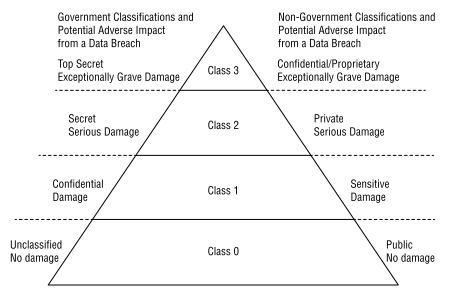
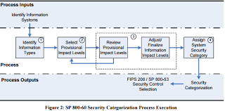
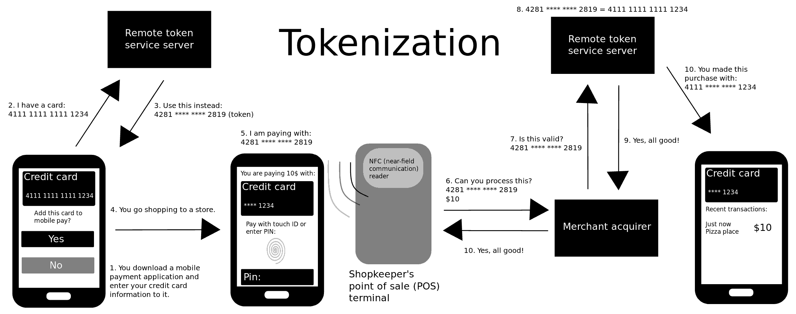

# Domain 1 - Asset Security

## 2.1 - Identify and classify information and assets

### Data and Asset Identification

* First step in data lifecycle is identifying and classifying data/information and assets
* include in the security policy
* Personnel then label assets appropriately
* **_Sensitive data_**:
  * information that is NOT public or unclassified
  * can include confidential, proprietary, protected, or any type of data that an organization needs to protect due to its value or comply with laws and regulations
* **_Personally Identifiable Information (PII)_**:
  * any information that can identify an individual
  * [NIST SP 800-122](https://nvlpubs.nist.gov/nistpubs/Legacy/SP/nistspecialpublication800-122.pdf), which provides more information on how to protect _PII_, provides more formal definition
    > Any information about an individual maintained by an agency, including
    (1) any information that can be used to distinguish or trace an individual's identity, such as name, social security number, data and place of birth, mother's maiden name, or biometric records; and
    (2) any other information that is linked or linkable to an individual, such as medical, educational, financial, and employment information.
* **_Protected Health Information (PHI)_**:
  * any health information in electronic form, maintained in electronic media, or transmitted or maintained in other form or media
  * records relating individuals who have been deceased more than 50 years are excluded from the definition of PHI
  * HIPAA mandates the protection of PHI
  * Health information is formally defined as:
    >* Health information means any information, whether oral or recorded in any form or medium that -
    (A) is created or received by a health care provider, health plan, public health authority, employer, life insurer, school or university, or health care clearinghouse; and
    (B) relates to the past, present, or future physical or mental health or condition of any individual, the provision of health care to an individual, or the past, present, future payment for the provision of health care to an individual.
  * HIPAA laws apply to:
    * healthcare providers
    * health insurers
    * health info clearinghouses
    * any business associates of those organizations that handle PHI
    * employers that provide health insurance may handle PHI, so it may apply to them also
* **_Proprietary Data_**:
  * any data that helps an organization maintain a competitive edge
  * could be software code that was developed, technical plans for products, internal processes, etc
  * copyright/patent/trade secret laws provide protections for these items but sometimes that is not enough as criminals tend to ignore those

### Data classification

* included in organizational security or data policy
* identifies the value of data to the organization and is critical to protect data confidentiality and integrity
* policy identifies classification labels used within the organization
* identifies how data owners can determine the proper classification and how personnel should protect data based on its classification
* US Government provides clear definitions for some of their most common classifications labels:
  * **Top Secret**:
    >* "applied to information, the unauthorized disclosure of which reasonably could be expected to cause exceptionally grave damage to the national security that the original classification authority is able to identify or describe"
  * **Secret**:
    >* "applied to information, the authorized disclosure of which reasonably could be expected to cause serious damaged to the national security that the original classification authority is able to identify or describe."
  * **Confidential**:
    >* "applied to information, the unauthorized disclosure of which reasonably could be expected to cause damage to the national security that the original classification authority is able to identify or describe."
  * **Unclassified**:
    * Refers to any data that doesn't meet one of the descriptions for top secret, secret, or confidential data. Within the US, unclassified data is available to anyone, though it often requires individuals to request the info using procedures identified in the Freedom of Information Act (FOIA).
    * subclassifications:
      * **_Official Use Only (FOUO)_**
      * **_Sensitive But Unclassified (SBU)_**
      * **_Controlled unclassified information (CUI)_**
    * Documents with the listed subclassification designation have strict control limitations for their distributions.
* Non-governmental organizations rarely need to classify their data on potential damage to national security, instead the focus is on damage to the organization.
  * They consider not only sensitive data but also critical data
  * use phrases like "exceptionally grave damage", "serious damage", and "damage" instead of top secret, secret, and confidential data
  * some organizations use labels such as "Class 3, Class 2, Class 1, and Class 0"
  * Common labels used by non-government organizations
    * **Confidential or Proprietary**
    > * highest level of classified data
    > * a data breach would cause exceptionally grave damage to the organization
    > * use the strongest level of access control to protect the data
    * **Private**
    > * refers to data that should stay private / internal within an organization
    > * doesn't meet the definition of _Confidential/Proprietary_
    > * data breach may cause serious damage
    > * may contain PII/PHI data as well as financial data (example payroll data)
    * **Sensitive**
    > * similar to data labelled as "confidential"
    > * data breach would cause damage to the mission of the organization
    > * data may include network plans and information such as IP addresses, layouts, devices, operating systems, software, etc.
    > * if an attacker gains access to this data, it makes it much easier for them to launch attacks
    * **Public**
    > * similar to "unclassified" data
    > * includes information posted on websites, in brochures, or any other public source
    > * must take great steps to protect its integrity, i.e having an attacker modifying the public data

The following diagram shows the relationship between government and non-government classifications for data.

### Asset Classification

* Includes sensitive data, the hardware used to process it, and the media used to store it
* Should match the data classifications, i.e. if a computer is processing top secret information it should also be marked/classified as "top secret"
* Security labelling includes both physical and electronic tags/labels:
  * Physical
    * placed on media/system/device that handles sensitive data
    * remain of the system or media throughout its lifetime
  * Digital/Electronic
    * placed/included as a header or footer in a document or embedded as a watermark
    * DLP solutions can identify documents and add metadata tags into the document when detected
* organizations should have procedures for downgrading classification however it's usually uncommon
  * typically data policies prohibit downgrading and instead would have clauses for data destruction for sensitive data that is no longer needed

## 2.2 - Establish information and asset handling requirements

* **Marking and Labeling**
  * Mark or label assets based on its classification.
  * Best practice -apply the highest level of security until the data can be determined as not sensitive
  * See the [US National Archives for there implementations of labels and markings for CUI](https://www.archives.gov/cui/registry/category-marking-list)
* 

## 2.3 - Provision information and assets securely

* **Information and Asset Ownership**
  * data owner ultimately has the responsibility in the organization for the data (senior manager, CEO, president, or department head)
  * identifying and classifying assets is key
  * identifying assets' owners (person responsible for the protection of the asset)
  * data owner typically delegate data protection tasks to others in the organization
    * example: data custodian "security" role typically perform daily tasks such as implementing access controls, performing backups, and managing data storage
* **Asset Management**
  * Asset Owners
    * individual assigned to be responsible for organization assets (hardware, devices, systems, etc)
    * responsible for the procurement, management, and life cycle
  * refers to managing both "tangible and intangible" assets
  * starts with an inventory list of assets, tracking the asset(s), and taking additional steps to protect them throughout their lifetime
  * ensures the prevention of losses
  * **_Tangible Assets_**
    * include hardware and software assets owned by the organization
    * hardware systems typically have a bar-code or RFID tag that can be scanned to record and track the asset
      * RFID is more expensive, however it reduces inventory tracking time
      * equipment should be properly sanitized before disposing
    * software assets are operating systems and applications
      * Commercial-off-the-shelf (COTS) or home build
      * COTS typically requires connecting to a licensing server (on activation or periodically)
      * if a key is stolen it will invalid the organization Licensing Agreement for the COTS
      * licensing should be monitored and key should stored securely
        * org pays for a license key for 5 products installations but only installs and activates 1 immediately, if the key is stolen and installed of 4 other systems those will be activated with success
  * **_Intangible Assets_**
    * include patents, copyrights, company reputation, and other assets representing potential revenue
    * senior management is typically the "owner" of these assets
      * attempt to determine the value of them by estimating the benefits the asset will bring to the organization
        * example:
          * company sells a product based on a patent, revenue from these sales can be used to assign a value to the patent
          * Utility and plant patents in the US are valid for 20 yrs and design patents are valid for 15 yrs (timeframe used for the calculation)
          * US patents require payment of maintenance fees periodically to maintain the patent, failing to pay them will result in a patent loss (tracking is key)
    * organizations report the value of intangible assets on their balance sheets using [_"Generally Acceptable Accounting Principles (GAAP)"_](https://en.wikipedia.org/wiki/Generally_Accepted_Accounting_Principles_(United_States))
      * ensures an annual review of intangible assets
  * **_Configuration Management System (CSM)_**
    * system used to assist with hardware asset management
    * automated
    * connects to hardware systems in order to check configuration settings and verifies the system still on the network and active

## 2.4 - Manage data lifecycle

* **Phases**
  * Create/Collect
    * can be created by users/systems
  * Store
    * ensure data is handled properly, using encryption at rest
    * ensure data is classified as soon as possible
  * Use
    * data should be protected by adequate security controls based on its classification
  * Share
    * encryption of data in use or in transit over a network
  * Retain/Archive
        * needed to comply with laws or regulations requiring the retention of data
  * Destroy
    * when data is no longer need, it should be destroy in such a way the it is not readable nor recoverable
    * crypto-shredding!!

* **Data Roles**
  * **_Data Owner_**
    * the person who has ultimate organization responsibility for data
    * typically is the chief executive officer (CEO), president, or a department head
    * identify the classification of data and ensure that it is labelled properly
    * ensure that the data has adequate security controls based on the classification and the organization's security policy requirements
    * may be liable for negligence if they fail to perform due diligence in establishing and enforcing security policies to protect and sustain sensitive data
    * [NIST SP 800-18, Rev. 1 - Guide for Developing Security Plans for Federal Information Systems](https://doi.org/10.6028/NIST.SP.800-18r1), outlines specific responsibilities for data owners:
      > * Establishes the rules for appropriate use and protection of the subject data/information (rules of behavior)
      > * Provides input to information system owners regarding the security requirements and controls for the information system(s) where the information resides
      > * Decides who has access to the information system and with what types of privileges or access rights
      > * Assists in the identification and assessment of the common security controls where the information resides
  * **_Data Controllers_**
    * persons or entities responsible for the collection and use of data
    * in GDRP terms:
      > * _"the data controller determines the purposes for which and the means by which personal data is processed."_
    * determines the "why" and the "how" of personal data collection and use
      * still true even if the data controller does not handle the data themselves
    * in some cases, data controllers outsource the data handling tasks to other organizations (_data processors_)
  * **_Data Processors_**
    * handles the processing of data on behalf of the data controller
    * in GDPR terms:
      > * _"A data processor is a natural or legal person, public authority, agency, or other body, which processes personal data solely on behalf of the data controller."_
  * **_Data Privacy Officer / Data Protection Officer (DPO)_**
    * oversees control of data and ensures the organization follows all relevant laws and regulations to protect individuals' private data  
    * mandated by the GDPR
  * **_Data Custodians_**
    * day-to-day tasks are delegated from the _Data Owners_ to the _Data Custodians_
    * helps protect the integrity and security by ensuring that it is properly stored and protected
    * example:
      * custodians would ensure that the data is backed up by following the guidelines in a backup policy. If administrators have configured auditing on the data, custodians would also maintain these logs
    * in practice, personnel within an IT department or system security administrators would typically be the custodians and may be the same administrators responsible for assigning permissions to data
  * **_Users_**
    * any person who access the data via a computing system to accomplish work tasks
    * should only have access to the data they need to perform their work tasks
    * employees / end users
  * **_Data Subjects_**
    * GDPR definition:
      > * _"A data subject is a person who can be identified through an identifier, such as a name, an identification number, location data, an online identifier, or other means."_
    * Example:
      * if a file includes PII on Sally Smith, Sally Smith is the data subject
  * **_Data Steward_**
    * ensure the data's context and meaning are understood, and business rules governing the data's usage, (being used as intended)
    * In COBIT (Control Objectives for Information and Related Technologies), both Data Stewards and Data Custodians play crucial roles in data governance, but they have distinct responsibilities. Data Stewards focus on the "what" and "why" of data, defining data quality rules and ensuring data is used correctly. Data Custodians focus on the "how", implementing the technical infrastructure and security measures to support data governance policies.
* **Data Collection**
  * only collect data that is required and if you require more than that data will need to be securely stored:
    * credit card information
    * personal information (name, address, etc)
* **Data Location**
  * refers to the location of data backups or copies
  * backups should have both on-site and off-site copies for redundancy purposes
  * some organizations maintain data in large data centers and data is typically replicated to one or more dc's to maintain availability
    * these dc's are typically geographically separate locations
* **Data Maintenance**
  * refers to ongoing efforts and care for data throughout its lifetime
  * maintaining security controls on processes and procedures around data
    * i.e if sensitive data is processed/stored on one server its easier to maintain security controls, in contrast to have data stored on multiple servers
    * use _air gap_ networks which ensures two networks never physically touch each other, air gap networks do not have access to the internet
      * solutions to transfer data between air gapped networks
        * Manually (USB)
        * Use a unidirectional network bridge which connects the two networks but allows data traversal in one direction from unclassifed to classified
        * Technical guard solution which is a combo of hardware and software placed between the two networks and allows properly marked data to travel between the networks
* **Data Remanence**
  * data that remains after proper erasure
  * data on hard drives as residual magentic flux or slack space
    * _slack space_ is the unused space within a disk cluster, operating systems store files on hard drives in clusters, which are groups of sectors
      * some operating systems fill in the slack space with data from memory
  * system tools to delete data generally leave much of the data remaining on the media, and widely available tools can easily undelete it
  * forensic experts and attackers have tools they can use to retrieve this data even after it has been reportedly deleted
  * for Hard Drives, use a degausser which generates a heavy magnetic field and realigns the disks, however they are only effective on magnectic media (tape, HDD, Floppy Disks, etc)
  * for Solid State Drives (SSDs), which use integrated circuitry instead of magnetic flux on spinning platters, only way is total destruction
    * NSA REQUIRES the destructions of SSDs using an approved disintegrator, which shred SSDs to a size of 2 millimeters or smaller
  * another possible method for protecting SDDs is to encrypt the data.
* **Data Destruction**
  * organizations should destroy sensitive data when its no longer needed
  * proper destruction ensures that it cannot fall into the wrong hands and result in unauthorized disclosure
  * highly classified data requires different steps to destroy it
  * security or data policies should list appropriate/acceptable methods for data destruction:
    * complete destruction of media holding classified data
  * [NIST SP 800-88, Rev. 1 - Guides for Media Sanitization](https://doi.org/10.6028/NIST.SP.800-88r1)
    * provides comprehensive details on different sanitization methods.
  * Sanitization methods (such as clearing, purging, and destroying) help ensure that data cannot be recovered.
  * Proper sanitization steps remove all sensitive data before disposing of a device:
    * includes removing or destroying data on nonvolatile memory, internal hard drives, and solid state drives
    * includes removing all CDs/DVDs and Universal Serial Bus (USB) drives
  * **_Common Data Destruction Methods_**
    * **_Erasing_**:
      * simply performing a delete operation against a file, a selection of files, or the entire media
      * in most cases the deletion or removal process only removes the directory or catalog link to the data, the actual data remains on the drive
      * as new files are written to the media, the system eventually overwrites the erased data, however depending on the size of the data and the free space available it may take months to overwrite
      * anyone with forensic recovery tools can retrieve the deleted data
    * **_Clearing_**:
      * also known as _overwriting_
      * process of preparing media for reuse and ensuring that the cleared data cannot be recovered using traditional recovery tools
      * when media is cleared, unclassified data is written over all addressable locations on the media:
        > * one method writes a single character, or specific bit pattern, over the entire media
        > * a more thorough method writes a single character over the entire media, writes the character's complement over the entire media, and finishes by writing random bits over the entire media
        > * process repeats itself in three separate passes
      * not all storage media responds well to media clearing techniques
        * example: spare sectors on hard drives, sectors label as "bad", and areas on many modern SSDs are not necessarily cleared and may still retain data
    * **_Purging_**:
      * more intense form of clearing
      * prepares media for reuse in less secure environments
      * provides a level of assurance that original data is not recoverable using any known methods
      * process will repeat the clearing process multiple times
      * not always trusted to remove all data remnants
    * **_Degaussing_**:
      * process of using a tool called a degausser to create a strong magnetic field that erases data on some types of media
      * used commonly to remove data from magnetic tapes and magnetic hard disk drives (HDD) with the goal of removing data from the media
      * may render a hard drive unusable so its not a good option when you want to reuse the media
      * has no effect on optical disks (CDs, DVDs, Blue-rays) or flash storage media (SD cards, USB flash drives, SSDs)
    * **_Destruction_**:
      * final stage in the life cycle of media and is the most secure method of sanitizing media
      * ensures that the media cannot be reused or repaired and that data cannot be extracted 
      * destruction methods include:
        * incineration
        * shredding
        * disintegration
        * pulverizing
        * melting
      * some organizations remove the platters in highly classified disk drives and destroys them separately
* **Declassification**
  * involves any process that purges media or a system in preparation for reuse in an unclassified environment
  * many organizations choose not to declassify any media and instead destroy it when it is no longer needed, to avoid any potential risk of data leaks
* **Cryptographic Erasure**
  * also known as _cryptoshredding_
  * method used to destroy encrypted data by deleting the associated encryption keys, including any backups of the keys
  * with cryptographic keys deleted/erased, the data remains encrypted and can't be accessed
  * if using this method you should used another method to overwrite the data, if the original encryption wasn't strong someone may be able to decrypt the data with out the key
  * commonly used for cloud storage as you dont have access to destroy the media

## 2.5 - Ensure appropriate asset retention (e.g., End of Life (EOL), End of Support)

* **Retention Requirements**
  * apply to data or records, media holding sensitive data, systems that process sensitive data, and personnel who have access to sensitive data
  * most important element of asset retention
* **Record Retention**
  * involves retaining and maintaining important information as long as it is needed and destroying it when its no longer needed
  * security and data policies typically identify retention time frames
  * some laws and regulations dictate length of retention periods, such as three years, seven years, or even indefinitely
  * organizations have the duty and responsibility of identifying the laws and regulations that apply to them and comply with them
    * however even in the absence of external requirements, organizations should still identify how long to retain data, such as audit logs for restructure security events/incidents
  * the longer an organization retains data, the more it costs in terms of media, locations to store it, and personnel to secure it
  * companies _may_ never delete data when they can reasonably anticipate litigation
* **End of Life (EOL) / End of Support (EOS)**
  * can apply to either software or hardware
  * in context of asset retention, they apply directly to hardware assets
  * _EOL_
    * refers to the time when vendors stop producing and offering a product for sale
    * support is still provided for a period of time
  * _EOS_
    * refers to the time when the support ends
  * most hardware is on a refresh cycle based of the EOL and EOS time frames
  * organizations retain legacy hardware to access older data (tape drives)

## 2.6 - Determine data security controls and compliance requirements

* **Data States**
  * **_Data at Rest_**
  > * any data in storage (on media such as hard drives, SSDs, external USB drives, SANS, backup taps)
  > * Strong symmetric encryption protects data at rest
  * **_Data in Transit_**
  > * data in motion or being communicated
  > * data transmitted over a network (internal network using wired or wireless methods as well as data being transmitted over the public networks such as the Internet)
  > * combination of symmetric and asymmetric encryption protects data in transit
  * **_Data in Use_**
  > * data being processed, which refers to data in memory or temporary storage buffers while an application is using it
  > * often the data in decrypted before being placed into memory in order for the application to use the data
  > * it is recommended to flush buffers when the data is no longer needed
  > * in some cases applications may work on encrypted data using [homomorphic encryption](https://en.wikipedia.org/wiki/Homomorphic_encryption), which limits risk because memory doesn't hold unencrypted data.
  > * The best defense is strong encryption, as well as strong authentication and authorization controls

* **Security Baselines**
  * once organizations have identified and classified their assets they typically want to secure them, enter _Security Baselines_
  * _Baselines_ provide a starting point and ensure minimum security standards.
    * derived by completing the system categorization (FIPS 199 & NIST SP 800-60) to determine the sensitivity levels for a systems Confidentiality, Integrity,  and Availability (CIA)
    * **_NIST SP 800-60 - Guide for Mapping Types of Information and Information Systems to Security Categories_**
      * provides guidance for federal agencies to map types of information and information systems to security categories based on [FIPS 199](https://nvlpubs.nist.gov/nistpubs/fips/nist.fips.199.pdf).
      * offers a framework for determining impact levels (low, moderate, high) for confidentiality, integrity, and availability, helping organizations apply appropriate security measures. The publication serves as a resource for understanding and implementing the information categorization requirements mandated by the FISMA of 2002. 
      * Two Volumes
        * [Volume I](https://nvlpubs.nist.gov/nistpubs/Legacy/SP/nistspecialpublication800-60v1r1.pdf)
          * Contains the basic guidelines for mapping information types and systems to their security categories.
        * [Volume II](https://nvlpubs.nist.gov/nistpubs/Legacy/SP/nistspecialpublication800-60v2r1.pdf):
          * Includes appendices with detailed recommendations and rationale for categorizing mission-based, management, and support information types. 
    The following diagram illustrates the Categorization and selection of controls as per NIST SP 800-60:
    
  * [NIST SP 800-53, Rev. 5 - Security and Privacy Controls for Information Systems and Organizations](https://doi.org/10.6028/NIST.SP.800-53r5):
    * mentions _security control baselines_ and identifies it as _"the set of minimum security controls defined for an information system."_
    * stresses that a single set of security controls does not apply to all situations, therefore organizations tail security baselines to meet their needs
  * [NIST SP 800-53B - Control Baselines for Information Systems and Organizations](https://doi.org/10.6028/NIST.SP.800-53B)
    * includes a comprehensive list of security controls and has identified many of them to include in various baselines.
      * Specifically they present three security control baselines (determined by the impact level of the system) and a privacy control baseline
        * **Low-Impact System**
          * recommended if any loss of confidentiality, integrity, and/or availability will have low impact on the organization's mission
        * **Moderate-Impact System**
          * recommended if it is possible that a loss of confidentiality, integrity, and/or availability will have a moderate impact on the organization's mission
        * **High-Impact System**
          * recommended if it is possible that a loss of confidentiality, integrity, and/or availability will have a high impact on the organization's mission
        * **Privacy Control Baseline**
          * provides an initial baseline for systems that process PII
          * can be combined with the other baselines (listed above)
* **Scoping and Tailoring**
  * happens after the security baseline is selected
  * fine-tuning process
  * **_Tailoring_**
    * is the process of aligning the controls with an organization's specific security requirements
    * ensures a baseline is a good fit for the organization
    * refers to modifying the list of security controls within a baseline to align with an organization's mission
    * _NIST SP 800-53B_ formally defines it as:
      > * _"part of an organization-wide risk management process that includes framing, accessing, responding to, and monitoring information security and privacy risks"_
      * and indicates it includes the following:
        > * Identifying and designating common controls
        > * Applying scoping considerations
        > * Selecting compensating controls
        > * Assigning values to organization-defined control parameters via explicit assignment and selection process
        > * Supplementing baselines with additional controls and control enhancements providing specification information for control implementation
    * **_Scoping_**
      * part of the tailoring process and refers to reviewing a list of baseline security and privacy controls and selecting only those controls that apply to the IT systems you're trying to protect.
      * in simple terms, scoping eliminates controls that are recommended in a baseline:
        >* Example: if a system doesn't allow any two people to log on to it simultaneously, there is no need to apply a concurrent session control
* **Standards Selection**
  * security controls should align and comply with external security standards to are appropriate for the organization
  * typically define compulsory requirements for organizations
    > * Example: PCI DSS defines requirements that business must follow to process major credit cars or similarly if the organization processes and collects personal data from EU citizens then they must abide by GDPR.
  * organization's need to identify the standards that apply to them and ensure they comply with those standards
  * if your organization does not need to legally comply with any specific standard, using a well-designed community standard is recommended.
* **Data Protection Methods**
  * **_Encryption_**
    * See data states
  * **_Digital Rights Management (DRM)_**
    * attempts to provide copyright protection for copyrighted works
    * purpose is to prevent the unauthorized use, modification, and distribution of copyrighted works
    * DRM Methods:
      * **DRM License**:
        * license that grants access to a product and defines the terms of use
        * typically a small file that includes the terms of use, along with a decryption key that unlocks access to the product
      * **Persistent Online Authentication**:
        * also known as _Always-On DRM_ requires a system to be connected with the internet in order to use the product
        * system periodically connects with an authentication server, and if the connection or authentication fails, DRM blocks the use of the product
      * **Continuous Audit Trail**:
        * tracks all use of a copyrighted product
        * when combined with persistence, it can detect abuse, such as concurrent use of a product simultaneously but in two geographically different locations
      * **Automatic Expiration**:
        * subscription model
        * subscription period ends the product an automatic expiration function blocks any further access
    * Digital watermarks are sometimes included into video and audio files using steganography, which do not prevent copying but can be used to detect the unuathorized copying of a file (copyright enforcement and detection)
    * Similarly metadata is sometimes placed into files to identify the buyer
    * Many organizations and individuals are opposed to DRM as they claim it restricts the fair use of materials they purchase
      * example: purchased MP3 songs and you want to copy onto both an MP3 player and a smartphone, DRM blocks this type of activity
  * **_Data Loss Prevention (DLP)_**
    * solution that attempts to detect and block attempts of data exfiltration
    * have capabilities of scanning unencrypted data looking for keywords and data patterns
    * Pattern-matching DLP systems look for specific patterns such as social security numbers which have a pattern of _nnn-nn-nnnn_
    * most include deep discovery capabilities also
    * Cloud DLP solutions offer the same functionality for keyword and pattern matching
    * Three types of DLP
      > * **Network DLP**
      >   * placed at the edge of the network and scans all outgoing data in a traditional network looking for specific data
      > * **Endpoint DLP**
      >   * scans files stored on a system as well as files sent to external devices such as printers
      >   * can prevent users from copying sensitive data to a USB flash drive or sending sensitive data to a printer
      >   * place on a device/system (laptop / severs)
      > * **Cloud DLP**
      >   * subset of Network DLP designed and tailored for cloud-native environments
  * **_Cloud Access Security Broker (CASB)_**
    * software logically placed between users and cloud resources
    * may be on-premise or within the cloud
    * anyone accessing the cloud goes through the CASB first
    * it monitors all activity and enforces administrator-defined security policies
      * example CASB would monitor all data being sent to the cloud and monitor it to ensure the data storage is encrypted
    * typically include authentication and authorization controls and ensure only authorized users can access the cloud resources
    * can also log all access, monitor activity, and send alerts on suspicious activity
    * any security control can be created using a CASB
    * can be effective at detecting _shadow IT_, which is the use of IT resources (such as cloud resources) without the approval of, or even the knowledge of, the IT department.
      * a CASB solution will collect and analyze logs from network firewalls and web proxies
  * **_Pseudonymization_**
    * refers to the process of using pseudonyms to represent other data
    * if performed effectively, it can result in less stringent requirements that would other apply under the EU's GDPR
    * pseudonym is an alias
    * pseudonymization can prevent data from directly identifying an entity, such as a person
    * if the un-aliased data is still required it should be stored with a link to the alias in a separate more secure data store
  * **_Tokenization_**:
    * refers to the process of substituting a sensitive data element with a non-sensitive equivalent, referred to as a token. The token has no intrinsic or exploitable meaning or value and maps back to the sensitive data through a tokenization system.
    * A one-way cryptographic function is used to convert the original data into tokens, making it difficult to recreate the original data without obtaining entry to the tokenization system's resources.
    * To deliver such services, the tokenization system maintains a vault database of tokens that are connected to the corresponding sensitive data. Protecting the system vault is vital to the system, and improved processes must be put in place to offer database integrity and physical security.
    * The tokenization system must be secured and validated using security best practices[6] applicable to sensitive data protection, secure storage, audit, authentication and authorization. The tokenization system provides data processing applications with the authority and interfaces to request tokens, or detokenize back to sensitive data.
    
  * **_Anonymization_**
    * refers to the process of removing all relevant data so that it is theoretically impossible to identify the original subject or person
    * however there are data interference techniques that may be able to reidentify individuals, even if the personal data is removed
    * _randomized masking_, which swaps (shuffles) data in individual data columns so that records no longer represent the actual data, can be an effective method of anonymizing data
      * works best in a table that has dozens of columns, smaller data sets could have potential of still be being reconstructed
    * cannot be reversed, once the data is randomized it can no longer be returned to its original state