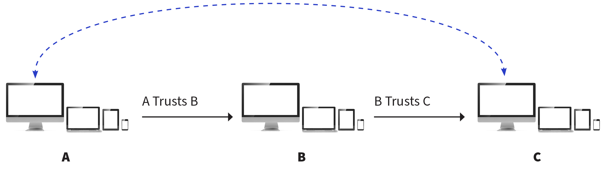
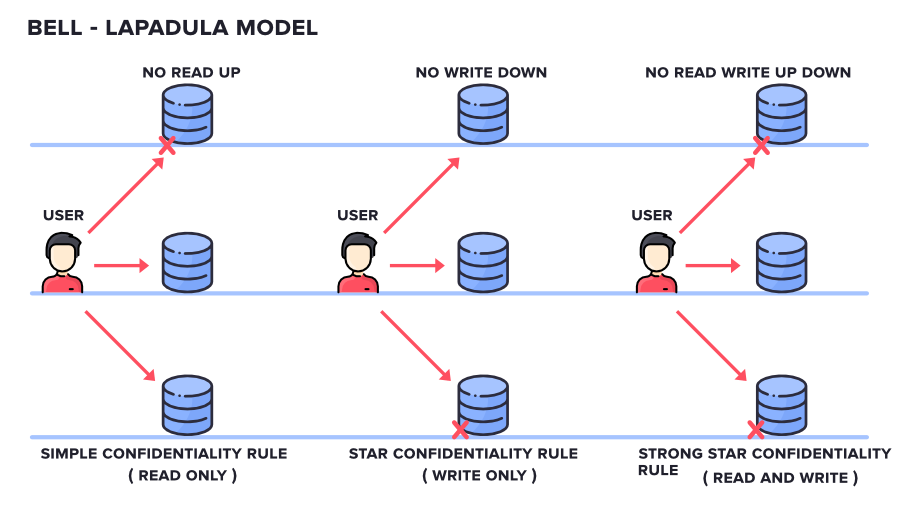
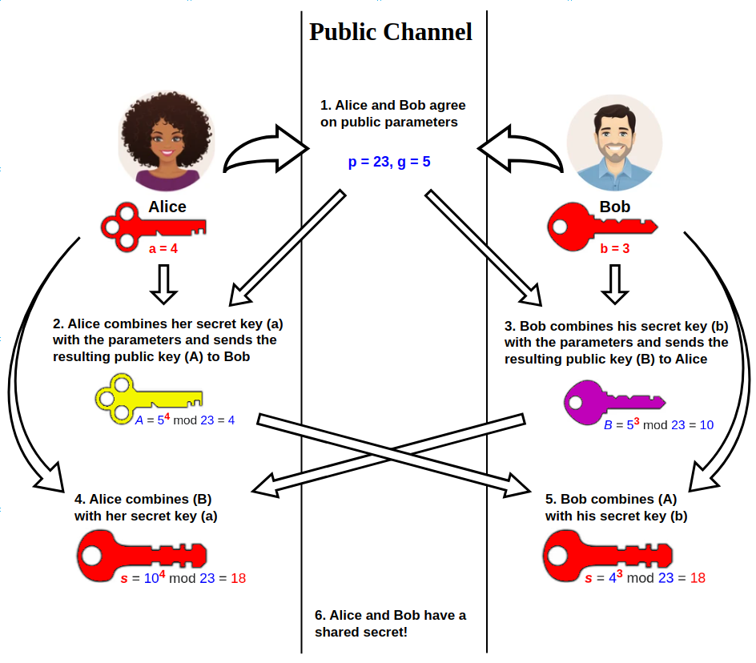
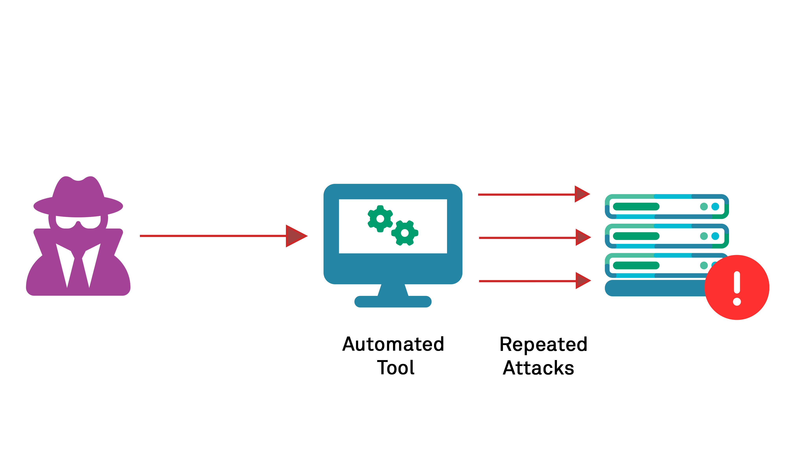

# Domain 3 - Security Architecture and Engineering

## 3.1 - Research, implement and manage engineering processes using secure design principles

### Threat Modeling

* process where potential threats are identified, categorized, and analyzed.
* can be performed proactive during design and development or as a reactive measure once a product has been deployed
* process identifies
  * the potential harm,
  * the probability of occurrence,
  * the priority of concern,
  * the means to eradicate or reduce the threat
* not meant to be a single event but initiated early in the design process and continue throughout a systems lifecycle
* proactive (during design and build) vs reactive (post-deployment, pen testing, threat hunting)
* Microsoft uses a [Security Development lifecycle (SDL)](https://www.microsoft.com/en-us/securityengineering/sdl)
  * includes a range of procedures aim at bolstering security assurance and compliance prerequisites.
  * follows the [NIST Secure Software Development Framework](https://csrc.nist.gov/Projects/ssdf) closely
  * aids developers in creating secure software by diminishing the quantity and seriousness of software vulnerabilities while trimming development expenses
* Modelling Frameworks
  * **STRIDE**
    * https://en.wikipedia.org/wiki/STRIDE_model
    * Developed by Microsoft as a threat categorization scheme
    * stands for :
      * **_Spoofing_**
        * an attack with the goal of gaining access to a target system through the use of falsified identity.
        * an attacker spooks their identity as a valid or authorized entity, they are often able to bypass filters and blockades against unauthorized access
      * **_Tampering_**
        * an action resulting in unauthorized changes or manipulation of data, whether in transit or at rest.
      * **_Repudiation_**
        * ability of a user or attacker to deny having performed an action or activity using plausible deniability
        * attacks can also result in innocent third parties being blamed 
      * **_Information Disclosure_**
        * revelation or distribution of private, confidential, or controlled information to external or unauthorized entities
      * **_Denial of service (DoS)_**
        * attack that attempts to prevent
      * **_Elevation of privilege_**
    * **Process for Attack Simulation and Threat Analysis (PASTA)**
      * https://www.iriusrisk.com/resources-blog/pasta-threat-modeling-methodologies
      * a seven-stage threat modelling methodology.
      * risk-centric approach that aims at selecting or developing countermeasures in relation to the value of the assets to be protected.
      * Seven-Steps:
        * **Stage I: Definition of the Objectives (DO)**
        * **Stage II: Definition of the Technical Scope (DTS)**
        * **Stage III: Application Decomposition and Analysis (ADA)**
        * **Stage IV: Threat Analysis (TA)**
        * **Stage V: Weakness and Vulnerability Analysis (WVA)**
        * **Stage VI: Attack Modelling & Simulation (AMS)**
        * **Stage VII: Risk Analysis & Management (RAM)**
    * **Visual, Agile, and Simple Threat (VAST)**
      * https://smartstatetech.medium.com/threat-modeling-methodology-vast-5c7de64cd924
      * Threat modelling concept that integrates threat and risk management in to an Agile programming environment on a scalable basis
      * two types of models
        * VAST: Application Threat Models
          * [App Threat Models](https://www.threatmodeler.com/application-threat-modeling-guide-for-cisos/) for dev teams are created using [process flow diagrams (PFD)](https://www.threatmodeler.com/2017/09/18/architecturally-based-process-flow-diagrams/).
            * PFD's map the features and communications of an application in much the same way developers and architects think about the application during an SDLC design session
        * VAST: Operational Threat Models
          * designed for the infra teams
          * more similar to traditional Data Flow Diagrams (DFDs) than app threat models, the data flow information is presented from an attacker - not a data packet - perspective, by relying on PFDs instead

* Least privilege

### Defense in Depth

* also known as _layering_ 
* https://en.wikipedia.org/wiki/Defense_in_depth_(computing)
* also known as the [onion model](https://en.wikipedia.org/wiki/Onion_model)
* use of multiple overlapping controls in a series for one objective
* no one control can protect against all possible threats
* a single failed control **SHOULD NOT** result in the exposure of systems and/or data
* a serial configurations are very narrow but deep
* a parallel configuration are very wide but shallow, useful in distributing computing applications
* _Defense in breadth_ or _Diversity in defense_
  * Using a wide range of security products from varied vendors significantly reduces or avoids the risk of a single exploit compromising several layers at once.
  * Can be problematic if elements of the security layers are from the same vendor or share common code , since a vulnerability could affect numerous layers simultaneously

### Secure Design Principles

* Security should be considered at every stage of a systems's development
* Engineers (Programmers, Developers, etc) should strive to build security into every application or system they develop
  * with a greater level of security provided to critical applications and those that process sensitive information
* much easier to build security into a system during the development than adding security to an existing system

#### Objects and Subjects

* Access control is based on two elements:
  * **_The Subject_**
    * active entity that requests access to a resource
    * most commonly a user but can be a process, program, computer, or organization
  * **_The Object_**
    * passive entity that the subject is trying to access
    * most commonly a resource, such as a file or printer, but can also be a user, program, process, computer, or organization
* Access is the relationship between a _subject_ and _object_, including activies likes reading, writing, modifying, deleting, printing, moving, backin up, and others

#### Transitive Trust

* [_Tranisitve trus_](https://www.getidee.com/blog/what-is-transitive-trust) is the concept that if process A trusts B and B Trusts C, then A inherits the trust of C through this transitive property.
  * can be reflective in a mathematical equation `if a = b and b = c, then a = c`
* big security concern as it is enables the bypassing of restrictions or limitations between A and C, especially if A and C both support interaction with B as discussed in the example below:
  > * An organzation has blocked sites such as Facebook and YouTube to increase worker productivity thus workers (A) do not have access to internet sites (C)
  > * However if workers are able to have access to a web proxy, vpn, or anonymization service then this can serve as a means to bypass these restrictions as (B) web proxy|VPN|AnonService would have access to the internet sites
  > * in other words, if workers (A) are accessig a VPN service (B), and the VPN service (B) can access the blocked internet service (C), then A can access C through B via what is called a **_transitive trust exploitation_**.

The following diagram highlights the flow of transitive trust:



#### Closed and Open Systems

* Systems are designed and built according to two different philosophies:
  * **Closed System**
    * designed to work with narrow range of other systems (typically from the same manufacturer)
    * standards are often proprietary and not formally disclosed
    * Apple is a prime example here (macs, iphone, and other apple products, etc)
    * harder to attack and often requires more in depth knowledge of the specific target system in order to launch an attack
  * **Open System**
    * designed using agreed-on industry standards
    * easier to integrate with other systems from different manufacturers that support similar standards or that leverage interoperability via application programming interfaces (APIs)
    * most susceptible to attack due to the nature of being open
    * more popular and widely deployed which attracts more attention to attackers
    * attackers will basic attacking skills will find more targets that are open vs closed
    * security of open systems will be more reliant on secure and defensive coding practices and a thoughtful defense-in-depth deployment strategy
* APIs
  * define the set of interactions allowed between system including applications, services, networking, firmware and hardware
  * also define the types of requests that can be made and the data forms of the exchange, as well as authentication and/or session encryption

#### Open Source vs Closed Source

* _Open-source_
  * is where the systems source code, and other internal logic is exposed to the public
  * often depends on public inspection and review to improve the product over time
  * can be either close-system or open-system
* _Closed-source_
  * is where the system's source code, and other internal logic is hidden from public and proprietary to the vendor
  * more dependant on the vendor/programmer to review and revise the product over time
  * can be either close-system or open-system
* Both are available for sale or no charge, however the term _commercial_ generally infers _closed-source_

### Secure Defaults

* Also known as [_**secure-by-default**_](https://www.resourcely.io/post/your-guide-to-secure-defaults), which is a security principle where a system's or application's initial configuration is set to the most secure settings possible
* this is used in software and system design, as well as in network and device configuration.
  * For example, a password manager may have a secure default password length requirement, or a router may have a secure default firewall configuration.
* Many users assume system default settings are optimal when they are installed
  * which is based on the assumption that the developers/designers of the product as they know best however this to minimize installation problems and avoid increase load on the technical support staff
* default settings typically make the discovery and exploitation of systems trivial for attackers
* you should never assume that default settings of any system/product is secure, as they typically are not
* the responsibility lies with the system's administrators and/or company security staff to review and alter a product's defaults settings to comply with organizational security policies
* **_Restrictive defaults_**:
  > * refer to the practice or policy where the default settings or options are intentionally configured to be more limiting or restrictive to enhance security, privacy and compliance
  > * typically provided via a preconfigured set of options in which the default settings priorities security, privacy, safety, or regulatory compliance

### Fail Securely

* Process for how systems handle and react to failure events
* typically done programmatically through Error/Exception handling
* programmers code error handling logic and mechanism in order to anticipate and defend against errors in order to avoid system termination of execution
  * done through `try ... catch` blocks of code
  * user input validation and sanitization to avoid the error altogether (filtering unwanted input, input length checks, validaty checks, etc.)
* Several states:
  * [**Fail-Soft**](https://csrc.nist.gov/glossary/term/fail_soft)
    * allow a system to continue to operate after a component fails
    * alternative to having a complete failure event
    * example multitasking process where one process fails but other independant processes continue to operate (e.g. multitasking operation system)
  * [**Fail-Secure**](https://csrc.nist.gov/glossary/term/fail_secure)
    * system is designed to fail
    * A mode of termination of system functions that prevents loss of secure state when a failure occurs or is detected in the system (but the failure still might cause damage to some system resource or system entity)
    * designed as either _fail-safe_ or _fail-soft_
    * designed to protect assets in the physical world and protect confidentiality and integrity in the digital world
  * [**Fail-Safe**](https://csrc.nist.gov/glossary/term/fail_safe)
    * type of failure mode that prevents damage and reverts to a state that protects the health and safe of people
    * example fail-safe door will open easily in case of emergency to allow people to escape a building
    * context is different between physical and digital world
      * for example a firewall (if designed to fail-open) would allow communication to continue with out filtering
      * in contrast it designed with fail-safe/fail-closed/fail-secure solution then comms would be totally cut off sacrificing availabitly for condifidentiality/integrity
  * **Fail-Open**
    * synonimous with _fail-soft_
    * protects availability
  * **Fail-Closed**
    * synonimous with _fail-secure_
    * protects confidentiality & integrity
* If a product is primarily digital
  * focus of security is compeletely on digital assets
* If a product is primarily physical world
  * focus of security is on people
  * however their are situations where assets are focused more than people, i.e bank vaults may be closed and locked in an emergency even though people may be locked inside
* If priority is on maintaining availability (digital) then if the product fails the communication or connection is allowed to continue (fail-open)
* If priority is on maintaining confidentiality and integrity then the product fails and the connection or communication is cut off (fail-secure, fail-closed and/or fail-safe)
* Blue Screen of Death (BSoD) is a fail-secure/fail-safe/fail-closed design

### Keep it simple and small

* [KISS principle](https://en.wikipedia.org/wiki/KISS_principle)
* in security it encourages avoiding overcomplicating the environment, organization, or product design for a more streamlined, optimized, and reduced solution
* more complex the system is the harder it is to secure and more features/capabilities means a larger attack surface to protect
* Other related concepts:
  * [**Don't Repeat Yourself (DRY)**](https://en.wikipedia.org/wiki/Don%27t_repeat_yourself)
    * eliminate redundancy by not repeat code in multiple places
  * [**Computing Minimalism**](https://en.wikipedia.org/wiki/Minimalism_(computing))
    * crafting code to use the least necessary hardware and software resources as possible
    * [PERT technique](https://en.wikipedia.org/wiki/Program_evaluation_and_review_technique)
  * [**Rule of Least Power**](https://en.wikipedia.org/wiki/Rule_of_least_power)
    * principle to use the least powerful programming language that will suit the need of the solution
  * [**Worse is Better (aka New Jersey Style)**](https://en.wikipedia.org/wiki/Worse_is_better)
    * quality of software does not necessarily increase with more features and capabilities; therefore often worse software state (fewer functions, etc) is better (preferred, maybe more secure) option
  * [**You Aren't Gonna Need It (YAGNI)**](https://en.wikipedia.org/wiki/You_aren%27t_gonna_need_it)
    * developers should not write modules/code for capabilities/functions until they are needed

### Zero Trust (ZTA) or Trust but Verify

* [ZTA](https://en.wikipedia.org/wiki/Zero_trust_architecture), also known as _"never trust, always verify"_ which is base on the thinking that a breach is assumed and that everyone should be deemed malicious
  * fromalized in [NIST SP 800-207 - Zero Trust Architecture](https://nvlpubs.nist.gov/nistpubs/SpecialPublications/NIST.SP.800-207.pdf)
  * security concept where nothing and no person inside the organization is automatically trusted
  * each and every requested for activity/access is assumed to from an untrusted source/location until otherwise verified
  * every transaction should be verified before it is allowed to occur
  * every access request should be authenticated, authorized, and encrypted prior to the access being granted to a resource or asset
  * requires internal network microsegementation and strong adherence to the principle of least privilege in order to prevent lateral movement by limit and/or severely restricting the ability to move about the environment
  * can leverage an [Attibute-based RBAC](https://en.wikipedia.org/wiki/Attribute-based_access_control) for control also
  * only successfull if real-time monitoring, vetting, and visibility into user activities are maintained
* [Microsegmentation](https://en.wikipedia.org/wiki/Microsegmentation_(network_security))
  * network security concept of diving up an internal network into small segements/zones
  * each segement/zone is seperated from each other by internal segementation firewalls (ISFWs), subnets, or virtual local arean networks (VLAN)
  * all communication been each zone can be filtered, may require authentication, often includes session encryption, and may also use allow list and block list control


* [Trust but Verify](https://gigaom.com/2024/06/07/zero-trust-101-its-time-to-ditch-trust-but-verify/)
  * was the gold was standard in cybersecurity
  * principle in once a user or device was authenticated and allowed into the network, they were trusted to access resources and data. This approach worked well enough when most employees worked in the office and used company-issued devices.
* With the evolving threat landscape times have changed and the limitations of “trust but verify” have become increasingly apparent:
  > * Doesn’t effectively limit the blast radius of a breach. That is if an attacker compromises a trusted user or device, they can move laterally within the network, accessing sensitive data and systems. The damage can be extensive and costly.
  > * Too focused on access control alone and doesn’t adequately address other critical areas like device security, network segmentation, and data protection. In today’s complex, distributed IT environments, this narrow focus leaves organizations vulnerable.
* deemed no longer secure as a model

So in today's cybersecurity landscape choose Zero-Trust!

### Privacy By Design (PbD)

* [**_PbD_**](https://en.wikipedia.org/wiki/Privacy_by_design) is a guideline to integrate privacy protections into solutions during early design phases rather than attempting to tack it on at the end of development
* similar to how "secure by design" or "integrated security" concept works
* goal is to have privacy protections integrated throughtout an organization, not just by developers
* led to the [**_Global Privacy Standard (GPS)_**](https://gpsbydesign.org/) which crafts a single set of universal and harmonized privacy principles.
  * adopted by countries to use as a guide in developing privacy legislation
  * used by organizations to integrate privacy protections into their organizations
  * used by developers to integrate privacy into the products they create
* some PbD principles have be integrated into the EU's GDP
* **PbD practices**:
  * Purpose Specification
    * which means the data subjects must be clearly communicated to at or before any data collection, retention, or usage occurs, and the purpose(s) must be limited and relevant to the stated needs.
  * Collection Limitation
    * Collection of data must be fair, lawful, and limited to the stated purpose.
  * Data minimization
    * Collection of data should be minimized as much as possible, and technologies should default to have users be non-identifiable and non-observable or minimized if absolutely necessary.
  * Use, retention, and disclosure of data must be limited and only for what has been consented to, with exceptions by law. Information should only be retained for the stated amount time needed and then securely erased.
* Framework is based on sever foundational principles which has been highlighted in [Ann Cavoukian's Paper - _"Privacy by Design - The 7 Fundamental Principles: Implementation and Mapping of Fair Information Practices"_](https://privacy.ucsc.edu/resources/privacy-by-design---foundational-principles.pdf):
  * **Proactive, not reactive; preventive, not remedial**
  > * The privacy by design approach is characterized by proactive rather than reactive measures. It anticipates and prevents privacy invasive events before they happen. Privacy by design does not wait for privacy risks to materialize, nor does it offer remedies for resolving privacy infractions once they have occurred — it aims to prevent them from occurring. In short, privacy by design comes before-the-fact, not after
  * **Privacy as the default**
  > * Privacy by design seeks to deliver the maximum degree of privacy by ensuring that personal data are automatically protected in any given IT system or business practice. If an individual does nothing, their privacy still remains intact. No action is required on the part of the individual to protect their privacy — it is built into the system, by default.
  * **Privacy embedded into design**
  > * Privacy by design is embedded into the design and architecture of IT systems as well as business practices. It is not bolted on as an add-on, after the fact. The result is that privacy becomes an essential component of the core functionality being delivered. Privacy is integral to the system without diminishing functionality.
  * **Full functionality - postive sum, not zero-sum**
  > * Privacy by design seeks to accommodate all legitimate interests and objectives in a positive-sum “win-win” manner, not through a dated, zero-sum approach, where unnecessary trade-offs are made. Privacy by design avoids the pretense of false dichotomies, such as privacy versus security, demonstrating that it is possible to have both.
  * **End-to-end life cycle protection**
  > * Privacy by design, having been embedded into the system prior to the first element of information being collected, extends securely throughout the entire lifecycle of the data involved — strong security measures are essential to privacy, from start to finish. This ensures that all data are securely retained, and then securely destroyed at the end of the process, in a timely fashion. Thus, privacy by design ensures cradle-to-grave, secure lifecycle management of information, end-to-end
  * **Visibility and transparency**
  > * Privacy by design seeks to assure all stakeholders that whatever business practice or technology involved is in fact operating according to the stated promises and objectives, subject to independent verification. The component parts and operations remain visible and transparent, to users and providers alike. Remember to trust but verify
  * **Respect for user privacy**
  > * Above all, privacy by design requires architects and operators to keep the interests of the individual uppermost by offering such measures as strong privacy defaults, appropriate notice, and empowering user-friendly options. Keep it user-centric
[OWASP Top 10 Privacy Risks Project](https://www.owasp.org/index.php/OWASP_Top_10_Privacy_Risks_Project)
  * provides practicle guidelines on how to implement privacy by design when developing web applications

### Secure Access Service Edge (SASE)

* [SASE](https://en.wikipedia.org/wiki/Secure_access_service_edge) is a framework which combines network security functions with wide area networking (WAN) capabilities including:
  * cloud access security brokers (CASB),
  * Secure Web Gateways (SWG),
  * antivirus/malware inspection,
  * virtual private networking (VPN),
  * firewall as a service (FWaaS), and data loss prevention (DLP), all delivered by a single cloud service at the network edge.
* features cloud-native architecture that unifies traditional seperate network and security services allowing organizations to deploy and manage them from the cloud
* core principle is identity-centric security
  * which prioritizes the identity of users and devices over the traditional perimeter-based security model
  * users can access resources from diverse locations and devices
* implemented through [zero trust network access (ZTNA)](https://www.zscaler.com/resources/security-terms-glossary/what-is-zero-trust-network-access)
  * which is founded on the concept of Zero Trust (trust no one , verify all)
  * every user and device must be authenticated (with MFA for users when possible) and authorization processes for access
* emphasizes a globally distributed network and workforce
* continuous monitoring of user and device activity is a key component 

* Segregation of Duties (SoD)
* Shared responsibility


## 3.2 - Understand the fundamental concepts of security models (e.g., Biba, Star Model, Bell-LaPadula)

### Concepts

* **Security Model**:
  * provides a foundational set of rules system designers can use to map abstract statements into a security policy that prescribes the alogrithims and data structures necessary to build hardware and software
* **Security Toke**:
  * object associate with a resource and describes its security attributes
  * communicates security information about an object prior to requesting access to the actual object
* **Capabilities List**:
  * maintains a row of security attributes for each controlled object
  * not as flexible as the _token_ approach, it generally offers quicker lookups when a subject requests access to an object
* **Security Label**:
  * generally a permanent attribute of an object
  * usually cannot be altered
  * provides a safeguard against tampering that neither tokens or capbilities lists provide

### Security Models

#### Trusted Computing Base (TCB)

* [TCB](https://en.wikipedia.org/wiki/Trusted_computing_base) is a design principle in which the combination of hardware, software, and controls work together to a for a trust union to enforce security policies
* should be as small as possible in order for detailed analysis to reasonably ensure that the system meets design specs and reqs
* is the only portion of the system that can be trusted to adhere to and enforce security policies
* uses **_security perimeters (SP)_** to seperate the TCB from the rest of the system
  * the SP ensures no insecure communication or interactions between the TCB and the rest of the system
* uses **_trusted paths (TP)_** for secure communications
  * TPs are established channels with strict standards to allow necessary communications to occur without exposing the TCB to security exploitations
* leverages a **_reference monitor (RM)_** to provides access control and verification mechanism for the TCB
  * stands between every subject and object, verifying that a subject's credentials meet the object's access requirements befor any requests are allowed to proceed
  * RM is a set of design requirements on a reference validation mechanism which as key component of an operating system, enforces an access control policy over all subjects and objects.
  * A reference validation mechanism must be:
    * (i) always invoked (i.e., complete mediation);
    * (ii) tamperproof; and
    * (iii) small enough to be subject to analysis and tests, the completeness of which can be assured (i.e., verifiable).
* the [**_security kernal_**](https://en.wikipedia.org/wiki/Security_kernel) is a collection of components that implement the _reference monitor_ in order to provide access control or authentication, authorization, and accounting (3A) specifically.
  * it mediates all resource access requests, granting only those requests that match the appropriate access rules in use for a system

The following diagram(s) illustrate these conncepts:


#### State Machine Model

* Secure State Machine Model ensures a system remains secure throughout all its operations by defining all possible system states and transitions between them.
* The goal is to ensure that all transitions maintain security, meaning no transition can move the system from a secure state to an insecure one.
* based on the computer science definition of a [**_finite state machine (FSM)_**](https://en.wikipedia.org/wiki/Finite-state_machine)
  * which models systems with a finite number of states and transitions between them.
* Concepts:
  * **State** is a snapshot of a system at a specific moment in time including information about subjects (users, processes) and objects (files, resources)
  * **Transition** is an event or action that changes the system's state. For example, a user logging in, a file being accessed, or a program executing.
  * **Secure State** is a state where all security policies are met, and no unauthorized access or actions are permitted.
  * **Secure State Machine** is a system that always boots into a secure state and where all possible states and transitions are secure, meaning no action can lead to a violation of security.
  Finite State Machine (FSM):  
* The model relies on a defined security policy, known as **Security Policy(ies)**, that dictates what constitutes a secure state and what actions are allowed or disallowed.
* **Inductive Proof** is a means by which a system ensures that each state transition preserves security, the overall system can be proven secure through an inductive argument.
* is basis for other security models


#### Information Flow Model

* based on the State Machine Model and built around [information flow theory](https://en.wikipedia.org/wiki/Information_flow_(information_theory))
* focuses on controlling the flow of information including both direction of information flow and the type of flow
* designed to prevent unauthorized, insecure, or restricted information flow, often between different levels of security (multilevel models)
* information flow can be between subjects and objects as well as different classification levels
* allows all authorized flows and prevents all unauthorized flows
* used to established a relationship between two versions or states of the same object when those two versions/states exist at different points in time
  * dictates the transformation of an object at different points in time
* addresses covert channels by specifically excluding all undefined flow pathways


##### Compsition Theories

* falls under the information flow model and build on the notion of inputs and outputs between systems which essentially describes information flow between systems
* Three theories:
  * **Cascading**
    * Input of one system comes from output of another
    * Example: Web server with database backend
      * A -> B -> C : Chaining
  * **Feedback**
    * System receives input and responds with output
    * Example: HTTP Request and Response
      * A -> B : Request
      * A <- B : Response
  * **Hookup**
    * System sends input to one system and sends copy to another
    * Example: CC and BCC in email
      * A -> B : To Destination
      * A -> C : To Hookup

#### Noninterference Model

* loosely based on the _Information Flow Model_
* [Noninterference model](https://en.wikipedia.org/wiki/Non-interference_(security)) is less concerned about information flow and more concerned with how the actions of subjects at a higher security level affects the system state or the actions of subjects at lower security levels (attempts to avoid information leakage and covert channels)
  * Example:
    > * the actions of subject A (high) should not interfere or affect with the actions of subject B (low) or even be noticed by B
    > * if a vialotion occurs, subject B could be place into an insecure state or be able to deduce/infer information about a higher level of classification
* type of model that can be imposed to form protection against damage caused by malicious programs, such as Trojan horses, backdoors, and rootkits

#### Take-Grant Model

* [model](https://en.wikipedia.org/wiki/Take-grant_protection_model) which describes how rights can be passed/taken from subject to subject/objects using a [_directed graph (graph theory_](https://en.wikipedia.org/wiki/Directed_graph)
* Allows you to track where rights can change and where leakage may/can occur
* Four rules:
  * **Take Rule**:
    * Allows subjects to take rights over an object
    * (ineheritence)
  * **Grant Rule**:
    * Allows a subject to grant rights over an object
    * (inheritence)
  * **Create Rule**:
    * Allows a subject to create new rights
  * **Remove Rule**:
    * Allows a subject to remove rights it has


#### Access Control Matrix

* An access control matrix is a table that states a subject’s access rights on an object.
* A subject’s access rights can be of the type _read_, _write_, and _execute_
* follows discretionary access control model because the entries in the matrix are at the discretion of an individual who has authority over the table.
  * can be changed to be a mandatory or role-based matrix by simply replacing the subject names with classifications or roles
* Components
  * **Row**
    * Subject(s)
    * Capabilities Lists
      * Each row shows capability of each subject
      * List of access rights a subject has for every object
  * **Column**
    * Object(s)
    * Access Control List (ACL)
      * Each column shows subjects that have rights to object
      * List of subject that has rights to an object
  * **Cells**
    * Access rights of a subject to an object
* capabilities list is an administrative nightmare


#### Lattice-Based Access Control

* subject are assigned position in a lattice
  * mutlilayered security structure/multileveled security domains
* positions fall between security labels
* subjects only access objects that are within "range" between the least upper bound (LUB) and the greatest lower bound (GLB) of labels/classification for their lattice position
  * LUB: is defined as the nearest security label or classification higher than the subject's lattice position
  * GLB: is defined as the nearest security label or classification lower than the subject's lattice position
* Example
  * A subject between Private and Sensitive can only access an object within those two labels


#### Bell-LaPadula Model

* [_Bell-LaPadula Model_](https://en.wikipedia.org/wiki/Bell%E2%80%93LaPadula_model) was developed in the 1970s for the US Department of Defense (DoD) and was based on their multilevel security policies
* doesnt suppport many moderned day operations such as file sharing and networking
* does not address [covert channels](https://en.wikipedia.org/wiki/Covert_channel)
  > * which is a method of communication that allows information to be transferred between processes in a way that bypasses the system's security policy and is not authorized by the system's designers
* Prevents information flow to lower sensitivity levels but blocking lower-classified information from accessing higher-classified objects
* Protects Confidentiality but does not address integrity or availability
* within clearence levels, access can be granted on a "need-to-know" basis
* built on the state machine concept and information flow model, also employs mandatory access controls and is a [lattice-based access control concept](https://en.wikipedia.org/wiki/Lattice-based_access_control), the _lattice_ tiers are the _classification levels_ defined by the organizations
* Three properties of this type of state machine:
  * **Simple Security Property**
    * (i.e., the _ss-Property_)
    * No Read Up
    * Subjects can't read objects with higher sensitivity labels
  * **(*)-Property (_star-property_(**)
    * No Write Down
    * Subjects can't write to objects with lower sensitivity labels
    * Unless performing declassification, which is a valid operation
  * **Discretionary Security Property**
    * An access matrix is used to enforce discretionary access control
* First two properties define the states into which the system can transition (not other transitions allowed), while the third determines and enforces a subject's job/role-based need to know to access an object
* **Trusted Subject**
  * not constrained to the (*)-Property
  * defined as _"a subject that is guarrnteed not to consummate a security-breaching information transfer even if it is possible."_
  * allowed to violate the (*)-Property and perfrom write-down, which is needed for reclassification or declassification
* Applications and Use Cases
  * widely used in military and government environments where strict confidentiality is required.
  * helps in safeguarding classified and sensitive information by controlling access based on security clearance levels.
  * ensures that data integrity is maintained and that information does not inadvertently reach individuals who lack the necessary authorization.



#### Biba Model

* [Biba Model](https://en.wikipedia.org/wiki/Biba_Model) was created by Kenneth J. Biba in 1975
* Designed after Bell-LaPadula Model and is the inverted version
* Built on a State Machine concept and based on the Information Flow model
* multilevel model
* was developed to address integrity as the core principle, which is the direct inverse of the Bell–LaPadula model which focuses on confidentiality.
* preservation of data integrity has three goals:
  * Prevent data modification by unauthorized parties
  * Prevent unauthorized data modification by authorized parties
  * Maintain internal and external consistency (i.e. data reflects the real world)
* Prevents information flow to higher integrity levels
* Used by commercial organizations
* Properties
  * **Simple Integrity Property**
    * No Read Down
    * Subjects can't read objects at lower integrity levels
  * **(*)(star) Integrity Property**
    * No Write Up
    * Subjects can't write objects at higher integrity levels
  * **Invocation Property**
    * process from below cannot request higher access
    * No up read/write
    * only subjects at equal or lower level
* Applications and Use Cases
  * commonly applied in systems where data accuracy and consistency are critical, such as in financial systems, database management, and other environments requiring rigorous data integrity controls.
  * helps maintain the quality and trustworthiness of information by enforcing rules that prevent lower-integrity data from influencing higher-integrity data.
* Drawbacks
  * requires all subjects and objects have a classification label (DoD derived), data integrity protection is dependent on data classification
  * addresses only integrity and not confidentiality or availablity
  * focuses on protecting objects from external threats and assumes internal threats are handled programmatically
  * does not address change management nor provides a way to assign or change an object's or subject's classification level
  * does not prevent covert channels


The following diagram shows the comparison of the flows of both Biba and Bell-LaPadula Models:


#### Clark-Wilson (CW) Model

* [CW Model](https://en.wikipedia.org/wiki/Clark%E2%80%93Wilson_model) was developed by David D. Clark and David R. Wilson and was published in the IEEE paper [_A Comparison of Commercial and Military Computer Security Policies_](https://ieeexplore.ieee.org/document/6234890) in which Clark and Wilson argued that
  > * the existing integrity models such as **Biba (read-up/write-down)** were better suited to enforcing data integrity rather than information confidentiality. They stated that the Biba models are more clearly useful in, as an example, banking classification systems to prevent the untrusted modification of information and the tainting of information at higher classification levels. They also stated that their model, Clark–Wilson, is more clearly applicable to business and industry processes in which the integrity of the information content is paramount at any level of classification (although the authors stress that all three models are obviously of use to both government and industry organizations).
* model is not based on a formal State Machine concept buts insteads defines that each data item and allows modifications through only a limited or controlled intermediary program or interface
* does not require the use of a lattice structure but uses a _three-part relationship of subject/program/object_ known as a **triple** or an **access control triplet** which means:
  * Within this relationship, subjects do not have direct access to objects. Objects can only be accessed through programs.
* model's enforcement and certification rules define data items and processes that provide the basis for an integrity policy. The core of the model is based on the notion two principles:
  * A **well-formed** transaction, which take the form of **programs**, is a series of operations that transition a system from one consistent state to another consistent state.
    * a subject is able to access objects only by using a program/interface/access portal,
    * each program has specific limitations on what it can and cannot do to an object which effectively limits a subject's capabilities (constrained, limiting, or restrictive interface)
  * The **principle of separation of duty** requires that the certifier of a transaction and the implementer be different entities.
* Protects both data confidentiality and integrity
* Defines the following items and procedures:
  * **Constrained Data Item (CDI)**
    * any data item whose integrity is protected by the security model
  * **Unconstrained Data Item (UDI)**
    * any data item that is not controlled by the security model
    * any data that is to be input nor has been validated, or any output
  * **Integrity Verification Procedure (IVP)**
    * a prcess / procedure that scans data items and confirms their integrity
  * **Transformation Procedures (TPs)**
    * allowed procedures which can modify a CDI
    * limited access to CDIs through TPs is the backbone of the model
    * Example: Store Procedure in Database
  * **Restricted Interface Model**
    * Provides subjects authorized information and functions
    * Uses classification-based restrictions to limit what subjects can see or do
    * Subjects at different levels see different sets of data
    * Enforces separation of duties in effect
    * Example: A web application that shows you only the info and features you can access
* Consists of two sets of rules: 
  * **Certification Rules (C)** and **Enforcement Rules (E)**.
  * Provides nine rules to ensure the external and internal integrity of the data items. The are as followed:
    * C1—When an IVP is executed, it must ensure the CDIs are valid.
    * C2—For some associated set of CDIs, a TP must transform those CDIs from one valid state to another.
    * Since we must make sure that these TPs are certified to operate on a particular CDI, we must have E1 and E2.
      * E1—System must maintain a list of certified relations and ensure only TPs certified to run on a CDI change that CDI.
      * E2—System must associate a user with each TP and set of CDIs. The TP may access the CDI on behalf of the user if it is "legal".
      * E3-The system must authenticate the identity of each user attempting to execute a TP.
    * This requires keeping track of triples (user, TP, {CDIs}) called "allowed relations".
      * C3—Allowed relations must meet the requirements of "separation of duty".
    * We need authentication to keep track of this.
      * C4—All TPs must append to a log enough information to reconstruct the operation.
    * When information enters the system it need not be trusted or constrained (i.e. can be a UDI). We must deal with this appropriately.
      * C5—Any TP that takes a UDI as input may only perform valid transactions for all possible values of the UDI. The TP will either accept (convert to CDI) or reject the UDI.
    * Finally, to prevent people from gaining access by changing qualifications of a TP:
      * E4—Only the certifier of a TP may change the list of entities associated with that TP.
* Applications and Use Cases
  * particularly useful in commercial and financial systems where maintaining data integrity is crucial.
  * used in environments where transactions need to be securely controlled and verified to prevent unauthorized changes or fraud
  * helps ensure that all data manipulations are performed by authorized individuals and follow established procedures.

The following diagram illustrates the basic workflow of the Clark-Wilson Model:


The following diagram highlights the CW Rules flow:


#### Brewer and Nash (BaN) Model

* [BaN Model](https://en.wikipedia.org/wiki/Brewer_and_Nash_model), at one time was referred to as the "Chinese Wall" model but is now known as the "ethical wall" or "cone of silence" model
* created to permit access controls to change dynamically based on a user's previous activity (kind of a state machine model)
* focuses primarily on confidentiality
* leverages **security domains (perimeter)** / **conflict classes** to prevent conflict of interests, example:
  * someone who works at company A and has access to proprietary data from company B should not also be allowed access to similar data for company C if those two companies compete with each other
* prevents subjects with access to one domain that belongs to a specific conflict class from accessing any other domain that belongs to the same conflict class (principle of **data isolation**)
* metaphorical wall between information in conflict classes
* uses principle of data islotation
* Key Principles
  * Access Control Based on User’s Past Actions:
    * The model enforces access restrictions based on the user’s previous interactions with sensitive data. If a user has accessed certain information, they are restricted from accessing related or competing data to prevent conflicts of interest or breaches of confidentiality.
* Applications and Use Cases
  * especially useful in systems dealing with competitive or sensitive information, such as financial trading systems, legal firms, and consulting agencies.
  * helps prevent situations where users might gain an unfair advantage or compromise confidentiality by ensuring that their access to information is controlled based on their previous activities.
  * particularly valuable in environments where managing and mitigating conflicts of interest is crucial for maintaining trust and security


#### Goguen-Meseguer Model

* also known as the [non-interference model](https://en.wikipedia.org/wiki/Non-interference_(security)), is a security model focused on integrity and preventing information leakage.
* based on the state machine concept
* created by Goguen and Meseguer in 1982
* Focused on integrity
* ensures that actions performed at one security level do not affect the state or actions at another security level. This is achieved by predefining which subjects (users or processes) can access which objects (data or resources) and what actions they are allowed to perform.
* Key aspects:
  * Non-Interference:
    * core principle is that actions at a higher security level should not be visible or have any impact on lower security levels. 
  * Predetermined Access:
    * defines which subjects can access which objects and the specific actions they can perform on those objects.
  * Domains:
    * Users can be grouped into domains based on their access rights, further ensuring separation and preventing interference between different groups.
  * State Machines:
    * can be viewed as a state machine that predetermines the possible states and transitions, preventing unauthorized changes to the system's state.
* establishes a framework where different security levels operate independently, preventing any unintended influence or information leakage between them.

#### Sutherland Model

* [nondeducibility model]((https://apps.dtic.mil/sti/pdfs/ADA462529.pdf)), introduced by Sutherland in 1986, is a security model focused on information flow within a system.
* aims to ensure that information from a higher security level cannot be deduced or inferred from information at a lower security level, this achieved by defining security domains and preventing information leakage between them.
* Security Domains:
  * involves partitioning a system into security domains, often categorized as "high" and "low".
* Information Flow:
  * core idea is that information from the higher domain should not be deducible by observing only the lower domain.
  * Essentially, an attacker with access to only the lower domain should not be able to infer anything about the state of the higher domain.
* Nondeducibility:
  * property is achieved when the low-level observations do not reveal any unique information about the high-level state that is not already known.
* Practical Implications:
  * nondeducibility model can be applied to various systems, including those with multiple security domains, cyber-physical systems, and even automated vehicle platoons.
* Distinction from Noninterference:
  While related, nondeducibility differs from noninterference. Noninterference focuses on preventing any interference between security levels, while nondeducibility specifically addresses the deducibility of high-level information from low-level observations.
* Example:
  > * In a vehicle platoon, nondeducibility could be used to determine if an attacker could infer the actions of the control unit (high-level) by observing sensor data (low-level). If the sensor data doesn't uniquely reveal the control unit's actions, the system is considered nondeducibility secure.
* provides a framework for designing and analyzing systems where sensitive information must be protected from unauthorized deduction based on publicly available data.

#### Grahan-Denning Model

* [Model](https://en.wikipedia.org/wiki/Graham%E2%80%93Denning_model) that is based on the Access Control Matrix
* a security model that articulates formal rules for managing computer security issues regarding processes and subjects. It revolves around building a system that governs how processes interact, focusing mainly on protection domains, objects, and the rules that specify rights.
* Ensures secure information flow within a system
* Maintains proper access rights
* Preventing unauthorized access to processes or objects
* based on a set of '8' rules, where each of them govern how processes may interact and may be modified or transferred.
  * Create object
  * Delete object
  * Create subject
  * Delete subject
  * Provide 'read' access
  * Provide 'write' access
  * Provide 'execute' access
  * Transfer access rights

#### Harrison-Ruzzo-Ullman (HRU) Model

* [HRU Model](https://en.wikipedia.org/wiki/HRU_(security)) which extends the _Grahan-Denning Model_ and  focuses on dynamic access control and rights management in computer systems.
* provides a framework for managing and changing user access rights flexibly and securely, addressing the need for dynamic adjustments to permissions based on evolving requirements.
* Key Principles
  * Description of Access Rights:
    * The HRU Model defines access rights in terms of capabilities and permissions that users have. It allows for dynamic modification of these rights, making it adaptable to changes in user roles or system requirements.
* Capabilities-Based Access Control:
  * Users are granted capabilities that define their access to resources. These capabilities can be modified dynamically to reflect changes in user roles or system policies.
* Applications and Use Cases
  * particularly suited for systems with dynamic and complex access requirements, such as large-scale enterprise environments, cloud computing platforms, and systems with varying user roles and permissions.
  * helps manage access control in environments where user roles and system needs frequently change, ensuring that permissions are adjusted appropriately and securely.

## 3.3 - Select controls based upon systems security requirements

### Security Model Evaluation

* Evaluation Steps
  * Certification
    * Notes
      * Initiated by a vendor
      * Test system security capabilities
      * Compare design, security criteria, and actual capabiltiies
      * Auditors decided if security criteria is met
      * Security criteria is based on intended use (commercial, health, etc)
      * Usually performed by a 3rd party
    * Steps
      * Choose security crtieria (TCSEC/ITSEC/CC)
      * Analyze each system component beased on criteria
      * Evaluate deployment environment
      * Determine level of security
  * Accreditation
    * Recognition of the certification
    * Performed by an adopting organization/customer
  * Maintenance
    * Ensuring that the security criteria is up to date
    * Ensuring that the system still meets security criteria
* [Rainbow Series](https://en.wikipedia.org/wiki/Rainbow_Series)
  * security standards and guidelines published by the US in the 1980s and 1990s
  * orginally published by the US DoD Computer Security Center and then by Nation Computer Security Center
  * describe the process of evaluation for trusted systems
  * Some import Books in the series
    * [Orange - Trusted Computer System Evaluation](http://csrc.nist.gov/publications/secpubs/rainbow/std001.txt)
    * [Green - DoD Password Management Guidelines](http://csrc.nist.gov/publications/secpubs/rainbow/std002.txt)
    * [Light Yellow - Guidance for Applying TSEC in Specific Environments](http://csrc.nist.gov/publications/secpubs/rainbow/std003.txt)
    * [Yellow - Technical Rational behind TCSEC in Specific Environments](http://csrc.nist.gov/publications/secpubs/rainbow/std004.txt)
    * [Tan - Audit in Trusted Systems](http://csrc.nist.gov/publications/secpubs/rainbow/tg001.txt)
    * [Bright Blue - Trusted Product Evaluation for Vendors](http://csrc.nist.gov/publications/secpubs/rainbow/tg002.txt)
    * [Bright Blue - Trusted Product Security Evaluation Program](http://csrc.nist.gov/publications/secpubs/rainbow/tg002.txt)
    * [Neon Orange - Discretionary Access Controls](http://csrc.nist.gov/publications/secpubs/rainbow/tg003.txt)
    * [Teal Green - Computer Security Terms](http://csrc.nist.gov/publications/secpubs/rainbow/tg004.txt)
    * [Red - Trusted Network Interpretation](http://csrc.nist.gov/publications/secpubs/rainbow/tg005.txt)
    * [Amber - Configuration Management](http://csrc.nist.gov/publications/secpubs/rainbow/tg006.txt)
    * [Burgundy - Design Documentation](https://web.archive.org/web/20110720183439/http://iaarchive.fi/Rainbow/NCSC-TG-007%20BURGUNDY.pdf)
    * [Dark Lavender - Trusted Distribution](http://csrc.nist.gov/publications/secpubs/rainbow/tg008.txt)
    * [Venice Blue - Computer Security Subsystem Interpretation](https://web.archive.org/web/20110720183823/http://iaarchive.fi/Rainbow/NCSC-TG-009%20VENICE%20BLUE.pdf)
    * Most books can be found [here](https://en.wikipedia.org/wiki/Rainbow_Series)
* Evaluation Models
  * [US DoD's Trusted Computer System Evaluation Criteria (TSEC)]((https://en.wikipedia.org/wiki/Trusted_Computer_System_Evaluation_Criteria))
    * TCSEC - Orange Book
      * Categories
        * D - Minimal Protection
          * Do not meet the requirement to belong to any other category
        * C - Discretionary Protection
          * C1 - Discretionary Protection
            * Access is controlled using users and groups
          * C2 - Controlled Access Protection
            * Meets requirements of C1
            * Strict logon procedures
            * Enforces media cleansing
        * B - Mandatory Protection
          * B1 - Labeled Security
            * Access is controlled using subject and object labels
          * B2 - Structured Protection
            * Meets requirements of B1
            * Ensures that no covert channels exists
            * Operator and administrators are separated
            * Enforces process isolation
          * B3 - Security Domains
            * Meets requirements of B2
            * Administrators are separated from other users
            * Reduce exposure to vulnerabilities
          * A - Verified Protection
            * A1 - Verified Protection
            * Meets requirements of B3
            * Each step of implementation is documented
      * Limitations
        * Doesn't control what users do with information once granted
        * Focused on confidentiality and doesn't work in commercial contexts
        * No physical, personnel, procedural provisions
        * Doesn't deal with networked systems*
    * TNI-TCSEC - Red Book
      * TCSEC with Networking Considered
      * Includes
        * CIA Rating
        * Communications Integrity
        * DoS protection
        * Intrusion prevention
      * Rating Level
        * None
        * C1 - Minimum
        * C2 - Fair
        * B2 - Good
      * Restrictions
        * Centralized networks
        * Single accreditation authority
  * [EU's Information Technology Security Evaluation Criteria (ITEC)](https://en.wikipedia.org/wiki/ITSEC)
    * European security evaluation criteria
    * Corresponds to TCSEC categories
    * Categories
      * F0: F-D - Minimal Protection
      * F1: F-C1 - Discretionary Protection
      * F2: F-C2 - Controlled Access Protection
      * F3: F-B1 - Labeled Security
      * F4: F-B2 - Structured Access Protection
      * F5: F-B3 - Security Domains
    * Difference from TCSEC
      * Change doesn't require re-evaluation of a system
      * Also considers integrity
      * Doesn't require a TCB
* [Common Criteria (CC)](https://en.wikipedia.org/wiki/Common_Criteria)
  * defines various levels of testing and confirmation of system security capabilities
  * subjective product evaluation model and replace previous static systems such as the following:
    * [US DoD's Trusted Computer System Evaluation Criteria (TSEC)](https://en.wikipedia.org/wiki/Trusted_Computer_System_Evaluation_Criteria)
    * [EU's Information Technology Security Evaluation Criteria (ITEC)](https://en.wikipedia.org/wiki/ITSEC)
  * Does not ensure that a system has no vulnerabilities
  * more details can be found at the [Common Criteria Portal](https://www.commoncriteriaportal.org/index.cfm)
  * Signed in as an internation standard in 1998 after Canada, France, Germany, the UK and US all signed the [_"Arrangemenet on the Recognition of Common Criteria Certificates in the Field of Information Technology Security"_](https://www.commoncriteriaportal.org/files/operatingprocedures/cc-recarrange.pdf)
    * additional 23 contries have also signed the arragenment post 2000
  * Arrangement was formally published as a standard in [ISO/IEC 15408:2022](https://cdn.standards.iteh.ai/samples/72891/fbfa4f603f384c7ab0663ffc4c163f3f/ISO-IEC-15408-1-2022.pdf) labeled as _"Information security, cybersecurity, and privacy protection: Evaluation criteria for IT Security"_
    * current version is set to be replaced by [ISO/IEC WD 15408-1](https://www.iso.org/standard/88134.html) sometime in 2026
  * Goals
    * Add to buyer confidence in purchasing products
    * Eliminates duplicate evaluations
    * To make security evaluations more cost effectove
    * To evaluation functionality and assurance of TOE/target of evaluation
  * Key Elements:
    * **Protection Profiles (PPs)**
      * Specify security demands of customers
      * "What I want" from customers
    * **Security Targets (STs)**
      * Security claims of a vendor about their systems
      * "I will provide" from a vendor
      * A target that a vendor sets for itself
      * Customers compare their requirements againts these
    * **Package**
      * Additional security components provided by the vendor
      * Can be added/removed
      * Similar to optional packages when purchasing a vehicle
  * Process
    * Customer compares their protection profile to security targets of various vendors
    * Customer chooses product with closest security target based on published eveluation assurance levels (EALs)
  * Structure
    * Introduction and General Model
      * Explains the security evaluation process
    * Security Function Requirements
      * Specifies requirements for each function that needs evaluation
    * Security Assurance
      * Specifies how systems are designed, checked, and tested
  * EAL Categories
    * EAL1 - Functionally Tested
      * TCSEC: D
      * For non-serious threats to security
      * Requirements
        * Features are working as intended
    * EAL2 - Structurally Tested
      * TCSEC: C1
      * For low to moderate assurance requirements
      * Requirements
        * EAL1 is passed
        * Design information is evaluated
    * EAL3 - Methodically Tested and Checked
      * TCSEC: C2
      * For moderate assurance requirements
      * Requirements
        * EAL2 is passed
        * Security is engineered since design stage
    * EAL4 - Methodically Designed, Reviewed, and Tested
      * TCSEC: B1
      * For moderate assurance requirements
      Requirements
        * EAL3 is passed
        * Security and commercial best practices are followed
    * EAL5 - Semi-Formally Designed and Tested
      * TCSEC: B2
      * For high assurance requirements
      * Requirements
        * EAL4 requirements
        * Specialist security engineering techniques are followed
    * EAL6 - Semi-Formally Verified, Designed, and Tested
      * TCSEC: B3
      * For high risk situations
      * Requirements
        * EAL5 requirements
        * Specialist security engineering techniques are used at all phases of design
    * EAL7 - Formally Verified, Designed, and Tested
      * TCSEC: A1
      * For highest-risk situations
      * Requirements
      * EAL6 requirements
  * Disadvantages
    * does nothing to make sure how users act on data is secure
    * does not address administrative issues outside the specific purview of securit _in situ_, that is they do not address controls related to personnel, orgaizational practices and procedures, or physical security
    * controls over electormagnetic emmissions is no addressed
    * evaluation of the strenght of cryptographic alogrithms is not explicitly laided out
* **Authorization to Operate (ATO)**
  * official approval to use secured equipement for operational objectives / use
  * part or Risk Management Framework ([NIST SP 800-37r2](https://nvlpubs.nist.gov/nistpubs/SpecialPublications/NIST.SP.800-37r2.pdf))
  * **_Authorizating Official (AO)_**
    * person/persons who performs the assessment and assignment of ATOs
    * authorized entity who can evaluate IT/IS systems, its operations, and its risks, and potentially issue an ATO
    * has the discresion to determine which breaches or security changes result in a loss of ATO. Can be either a modest intrusion event or the application of a substantial security patch could cause the ngegation of an ATO
  * issued for 3 years and must be reobtained whenever one of the following occurs:
    * The ATO time frame has expired
    * The system experiences a significant security change and/or breach
  * Four types of authorization decisions:
    * **Authorization To Operate**
      * issued when a risk is managed to an acceptable level
    * **Common Control Authorization**
      * issued when a security control is inherited from another provider and when the risk associate with the common control is at an acceptable level and already has a ATO from the same AO
    * **Authorization to Use**
      * issued when a 3rd-party (cloud serice, etc) provides IT/IS servers that are deemed to have risk at an acceptable level
      * also used to allow reciprocity in accepting another AO's ATO
    * **Denial of Authorization**
      * issued when risk is unacceptable
  
## 3.4 - Understand security capabilities of Information Systems (IS) (e.g., memory protection, Trusted Platform Module (TPM), encryption/decryption)

* **Memory Protection**
  * Prevents processes from interacting with memory locations not allocated to them
* **Virtualization**
  * Allows mutliple operating systems to run on the same set of hardware
* **Hardware Security Module (HSM)**
  * Hardware cryptoprocessors
  * Used to store keys
  * Used by banks and authorities to store certificates
  * Provides tamper protection to prevent their misuse even if an attack gains physical access
* **Trusted Platform Module (TPM)**
  * Specs for a cryptoprocessor chip
  * A type of a hardware security module (HSM)
  * Provides
    * Key storage
    * Hardware encryption
      * Hard drive encryption
      * More secure
      * Key is stored in TPM so TPM is required to decrypt the hard drive
      * Hard drive can't be decrypted when put in a separate system
* **Interfaces**
  * Provides users access to the data
  * Must be constrained based on user privileges
  * Through hiding, if permission is not granted to a user
  * Implementation of Clark-Wilson model
* **Fault Tolerance**
  * Ability of a system to continue to operate when experiencing a fault
  * Achieved by adding redundant components
  * Essential element of security design
  * Example Redundant Array of Independand Disks (RAID)
* Encryption
  * process of converting plaintext to ciphertext
  * Symmetric & Asymmetric
* Decryption 
  * reverse of encryption
  * converting ciphertext back to it original plaintext equivalent

### Techniques for Ensuring CIA (in terms of system/applications)

#### Confinement

* process confinement is what software designers use to restrict the actions of a program
* allows processes to read/write to certain memory locations and resources
* aka sandboxing
* application of the principle of least privilege but geared to processes
* prevents data leakage to unauthorized programs, users, or systems
* if a process attempts to initiate an action beyond its granted authority, that action will be denied
  * generally the offending process is terminated
* concept is implemented in the OS itself (through process isolation and memory protection)
* also implemented via a confinement service or application such as Sandboxie (sandboxie.com) or virtualization / hypervisor solutions like VMWare or Oracle's VirtualBox

#### Bounds

* means to enforce _confinement_
* each process on a system is assigned a authority leve of either _user_ or _kernel_
* the authority level tell the OS what the process can do, how to set bounds for the process
  * which may consist of limits set on the memory addresses and resources it can access
* _bounds_ state the area within a process is contained or confined 
* phyiscal bounds requires each bounded process to run in an area of memory that is physically separated from other bounded process, which can be very expensive (seperate hardware and rack space) but is more secure then _logical bounds_

#### Isolation

* achieved throught the use of _bounds_, a means of preventing an application from access memory or resources of another application (virutalization, etc)
* used to protect the OS environment, the kernel of the OS, and other independant applications
* allows for a fail-safe/fail-crash environment so that seperate processes are not affected and can continue as normal if the process fails
* makes designing systems/programs more difficult but more secure

#### Access Controls

* limits the scope of what objects a subject has authorization to access
* access control rules state which objects are valid for each subject
* wide range of options such as _discretionary_, _role-based_, and _manadatory_.

#### Trust and Assurance

* **_trusted system_** is one in which all protections mechanisms work together to process sensitive data for many types of users while maintaining a stable and secure computing environment
* **_trust_** is the presence of security controls, mechanism, functions, or capability
* **_assurance_** is the degree of confidence on how reliable the security mechanism are at providing security
  * several grades or level of assurance
  * can be done through certifications such as ISO 27001 or SOC 2
  * essentially assurance is an assessement of the reliability and usability of the security features in real-world situations

## 3.5 - Assess and mitigate the vulnerabilities of security architectures, designs, and solution elements

* Client-based systems
* Server-based systems
* Database systems
* Cryptographic systems
* Industrial Control Systems (ICS)
* Cloud-based systems (e.g., Software as a Service (SaaS), Infrastructure as a Service (IaaS), Platform as a Service (PaaS))
* Distributed systems
* Internet of Things (IoT)
* Microservices (e.g., application programming interface (API))
* Containerization
* Serverless
* Embedded systems
* High-Performance Computing systems
* Edge computing systems
* Virtualized systems

## 3.6 - Select and determine cryptographic solutions

### Cryptographic Foundations

Cryptography provides confidentiality, integrity, authentication, and nonrepudiation for sensitive information while it is stored (at rest), traveling across a network (in transit/in motion), and existing in memory (in use/in processing). It is also an extremely important security technology that is embedded in many security controls used to protect information from unauthorized visibility and use.

#### Goals of Cryptography

There are four fundamental goals of cryptography:

* **Confidentiality**
  * ensures that data remains private in three different states:
    * _At rest_:
      * stored in a fixed location
      * susceptible to theft of the physical device or theft of the data through lateral movement within the servers where the data is stored
    * _In transit/motion_:
      * traveling across a network
      * also known as _data on the wire_
      * susceptible to eavesdropping
    * _In use_:
      * in memory or application process
      * susceptible to unauthorized access via the application if the OS does not properly implement process isolation
  * most widely cited goal --
    > * _"the preservation of secrecy for stored information or for communications between individuals and groups"_
  * two main types of cryptosystems enforce confidentiality:
    * **_Symmetric cryptosystems_**
      * use a shared secret key available to all users of the system
    * **_Asymmetric cryptosystems_**
      * use individual pairs of public and private keys for each users of the system
* **Integrity**
  * ensures that data is not altered without authorization
  * integrity mechanisms in place ensure recipient of a message can be certain that the message received is identical to the message that was sent
  * integrity checks ensure that stored data was not altered between the time it was created and the time it was accessed
  * digital signatures (encrypted message digests) ensures message integrity is enforced
    * the recipient of a message simply verifies that the message's digital signature is valid, ensuring that the message was not altered in transit
* **Authentication**
  * verifies the claimed identity of system users
  * major function of cryptosystems
  * [_challenge-response authenticaiton protocol_](https://en.wikipedia.org/wiki/Challenge%E2%80%93response_authentication) is an example where one party presents a question ("challenge") and another party must provide a valid answer ("response") to be authenticated.
    * User authenticating to an Authorization Server
* **Nonrepudiation**
  * provides assurance to the recipient that the message was originated by the sender and not someone masquerading as the sender
  * prevents the sender from claiming they never sent the message (repudiation)
  * only can be guaranteed using asymmetric (public key) crypto systems

#### Cryptography Concepts

* Key terms
  * _cyrptography_:
    * art of creating and implementing secret codes and ciphers
  * _cryptanalysis_:
    * study of methods to defeat codes and ciphers
  * _cryptology_:
    * combination of _cyrptography_ and _cryptanalysis_
  * _plaintext message_:
    * content of a message before it put into coded form
    * represented by the letter _P_ when encryption functions are described
  * _algorithm_:
    * set of rules, usually mathematical, that dictates how encryption and decryption processes are to take place
  * _encryption_:
    * process of using a cryptographic algorithm to codify a message
  * _cyphertext message_:
    * the product of when a _plaintext_ message is encrypted using a cryptographic algorithm
    * represented by the letter _C_ when encryption functions are described
  * _decryption_:
    * process of using a predefined cryptographic algorithm to uncodify a cypertext to retrieve the plaintext message
  * _keys_:
    * used by cryptographic algorithms to maintain their security
    * nothing more than a number, usually a very large binary number
    * sometimes referred to as _cryptovariables_ (in US government applications)
  * _key space_:
    * part of every algorithm
    * range of values that are valid for use as a key for a specific algorithm
    * defined by its _bit size_, the number of bits (0s and 1s) in the key
    * is the range between the key that has all 0s and the key that has all 1s (value from 0 to 2^n, where _n_ is the bit size of the key)
      * example: a 128-bit key can have a value from 0-2^128 (which is roughly 3.40282367 x 10^38)
* Absolutely important and crucial to protect the security of secret keys and private keys
* **Kerckhoff's Principle**
  * also known as _Kerchoff's Assumption_
  > * _"a cryptographic system should be secure even if everything about the system, except the key, is public knowledge"_
  * "The enemy knows the system"
  * most, if not all, cryptographers follow this principle which allows anyone to examine and test the algorithms, however there are those that disagree with this principle and would prefer to keep both the algorithm and the key private
  * however by keeping the public exposure this produces more activity and exposes more weakness more readily, leading to the weaker ones being abandoned and only the stronger algorithms being adopted
* [Federal Information Processing Standard (FIPS) 140-3, "Security Requirements for Cryptographic Modules"](https://doi.org/10.6028/NIST.FIPS.140-3)
  * defines the hardware and software requirements for cryptographic modules that the federal government uses

#### Cryptographic Mathematics

Has a foundation in mathematics leveraging basic binary mathematics and logical operators

##### Boolean Mathematics

* Defines the rules used for the bits and bytes that form the nervous system of any computer
* has electrical origins with two possible states _on (representing the presence of current)_ or _off (representing the absence of current)_
* in computer science these states are represented as _true_ (on) or _false_ (off)
* (0=FALSE) and (1=TRUE)

###### Logical Operators

Are logical functions used to manipulate data in boolean math for cryptography

**AND**

* represented by ⋀ (&& in most programming languages or a single & also)
* checks to see whether two values are both true
* AND function is computed by comparing the values of X and Y in each column (shown below), the output value is TRUE only in columns where both X and Y are true

AND operation truth table

|   X  |   Y  |  X ⋀ Y |
| ---- | ---- |  ------ |
|   0  |   0  |    0    |
|   0  |   1  |    0    |
|   1  |   0  |    0    |
|   1  |   1  |    1    |

Example:

X: 01101100
Y: 10100111
X ⋀ Y: 00100100

**OR**

* represented by ∨ (|| or a single | in most programming languages)
* checks to see whether at least on of the input values is true

OR operation truth table

|   X  |   Y  |  X ∨ Y |
| ---- | ---- |  ------ |
|   0  |   0  |    0    |
|   0  |   1  |    1    |
|   1  |   0  |    1    |
|   1  |   1  |    1    |

Example:

X: 01101100
Y: 10100111
X ∨ Y: 1110111

**NOT**

* represented by ~ (! in most programming languages)
* checks to see whether at least on of the input values is true

NOT operation truth table

|   X  |  ~X  |
| ---- | ---- |
|   0  |   1  |
|   1  |   0  |

Example:

X: 01101100
~X: 1001011

**Exclusive OR (XOR)**

* most important and most commonly used in cryptographic applications
* represented by ^ (! in most programming languages)
* returns a true value when only one of the input values is true

XOR operation truth table

|   X  |   Y  |  X ^ Y |
| ---- | ---- |  ------ |
|   0  |   0  |    0    |
|   0  |   1  |    1    |
|   1  |   0  |    1    |
|   1  |   1  |    0    |

Example:

X: 01101100
Y: 10100111
X^Y: 11001011

#### Modulo Function

* extremely important in the field of cryptography
* the remainder value left over after a division operation is performed
* usually represented in equations by the abbreviation _mod_ or the _%_ symbol

Examples:
8 mod 6 = 2
6 mod 8 = 6
10 mod 3 = 1
10 mod 2 = 0
32 mod 8 = 0
32 mod 26 = 6

#### One-Way Functions

* mathematical operation that easily produces output values for each possible combination of inputs but makes it impossible to retrieve the input values
* used in public key cryptosystems
* never been proven that any specific known function is "truely" one-way as some function may be broken by future cryptanalysis

#### Nonce

* allows for adding randomness to the encryption process to gain cryptographic strength
* random number that acts as a placeholder variable in mathematical functions
* when the function is executed, the nonce is replaced with a random number generated at the moment of processing for one-time use
* must be a unique number each time it is used
* examples of a nonce is an _initialization vector (IV)_, which is a random bit string that is the same length as the block size (amount of data to be encrypted in each operation) and is XORed with the message
  * IVs are used to create unique ciphertexts every time the same message is encrypted using the same key

#### Zero-Knowledge Proof

* A cryptographic method that allows one party (the prover) to convince another party (the verifier) that a statement is true, without revealing any information beyond the truth of the statement.
* The prover demonstrates that they know the information needed to verify the statement, without revealing the secret information itself.
* Done through complex mathematical operations, such as [discrete logarithms](https://en.wikipedia.org/wiki/Discrete_logarithm) and [graph theory](https://en.wikipedia.org/wiki/Graph_theory)

The following diagrams are a simplistic view of how zero-knowledge proof works:


#### Split Knowledge

* concept of a single solution that leverages separation of duties and two-person control
* information or privilege required to perform an operation is divided among multiple users, no single person has sufficient privileges to compromise the security of an environment
* example is _key escrow_,

##### Key Escrow Management

* Process in which a cryptographic key is stored with a third party for safekeeping. When certain circumstances are met, the third party may use the escrowed key to either restore an authorized user's access or decrypt the material themselves (third party is call the _recovery agent_)
* this process could lead to fraud or misuse if only a single-key escrow recovery agent were used

#### Work Function

* The strength of a cryptography system is measure by the effort in terms of cost and/or time required to complete a brute-force attack against an encryption system
* The size of the work function should be matched against the relative value of the protected asset, meaning the _work function_ needs to be only slightly greater that the time value of that asset
  * if the asset loses its value over time then the work function strength needs to be adjusted and only strong enough for protection as needed until the value of the asset is gone
* emerging technologies like quantum computing may make brute-force efforts much more feasible down the road

### Ciphers

#### Codes vs Ciphers

* sometimes they are interchangeable however they are not
* **_Codes_**
  * cryptographic systems of symbols that represent words or phrases, sometimes they are secret, but are not necessarily meant to provide confidentiality
  * examples:
    * Law Enforcement "10 System" of communication
      * "10-4" means "I received your communication and understand the contents"
    * Semaphores (visual signaling) and Morse Code
  * the above list codes are commonly known by the public and provide ease of communication
  * some codes are secret and may convey confidential information using a secret code-book where the meaning of the code is known only to the sender and the recipient
* **_Ciphers_**
  * always meant to hide the true meaning of a message
  * uses a variety of techniques to alter and/or rearrange the characters or bits of a message to achieve confidentiality
    * converts plaintext messages to ciphertext on several factors:
      * bit basis (single digit of binary code)
      * character basis (single-character of an ASCII or Unicode message or another encoding)
      * block basis (fixed-length segment of a message, usually express in number of bits)

#### Types of Ciphers

##### Transposition Ciphers

* use an encryption algorithm to rearrange the letters of a plaintext message to form a ciphertext message
* decryption is essentially reversing the encryption process to retrieve the original message

A more complex version is the **_columnar transposition_**
Example:
Encrypt the message "The fighters will strike the enemy bases at noon" using the secret key _attacker_

First step is take the letters of the secret key and number then in alphabetical order (second appearance of a letter just add 1 to it (A = 1, second A = 2, etc))

```text
ATTACKER
17823546
```

Next, the letters of the message are written in order underneath the letters of the keyword:

```text
ATTACKER
17823546
THEFIGHT
ERSWILLS
TRIKETHE
ENEMYBAS
ESATNOON
```

Finally the sender enciphers the message by reading down each column, the order in which the columns are read corresponds to the numbers assigned in the first step. This produces the following ciphertext

```text
T E T E E F W K M T I I E Y N H L H A O G L T B O T S E S N H R R N S E S I E A
```

When the receiver gets this encoded message they reconstruct the eight-column matrix using the ciphertext and the same key and then simply reads the plaintext message across the rows

##### Substitution Ciphers

* use an encryption algorithm to replace each character or bit of the plaintext message with a different character
* to decrypt the ciphertext message you simply shift the letter 3 places in terms of the ROT3 or Ceasar cipher, the shift number is arbitrary (example: ROT12 shifts characters 12 spaces to the right)
* earliest knows substitution cipher is known as _**Caesar cipher**_, which was used by Ceasar to communicate with Cicero in Rome while he was conquering Europe
* **_Ceasar Cipher_**
  * mono-alphabetic
  * also become known as the _ROT3 (or Rotate 3) Cipher_
  * simply shift each letter of the alphabet three places to the right, example A would become D, B would become E, etc
    * if you reached the end of the alphabet during the process you would simply wrap around to the beginning so X would become A, Y becomes B, Z becomes C
  * easy to crack unfortunately and vulnerable to the **_frequency analysis_** due to the use of the most common letters in the english language "E, T, A, O, I, N, S, H, R, D, L, and U (know as "ETAOIN SHRDLU") and attacker can determine the pattern

Example of Ceasar Cipher

```text
Original message: "THE DIE HAS BEEN CAST"
Cipher Message:   "WKH GLH KDV EHHQ FDVW"
```

* **_ROT3_**
  * can be express in mathematical terms by converting each letter to its decimal equivalent (A = 0 and Z = 25)
  * you can then add three to each plaintext letter (P) to determine the ciphertext (C)
  * you account for the wrap-around using the modulo function
  * encryption function looks like `C = (P + 3) mod 26`
  * decryption function looks like `P = (C - 3) mod 26`

* **_Polyaplphabetic substitution_**
  * uses multiple alphabets (such as keyword) in the sames message to hinder decryption efforts
  * example is [**_Vigenére cipher_**](https://en.wikipedia.org/wiki/Vigen%C3%A8re_cipher), which uses a single encryption/decryption chart, which is shown below:
  * 
  * a key is required to use the **_Vigenére Cipher_** system, example shown above is `LEMON` and the message is `attackatdawn`
  * follow this process:
    * 1 - Write out the plaintext
    * 2 - Underneath, write out the encryption key, repeating the key as many times as needed to establish a line of text that is the same length as the plaintext (`LEMONLEMONLE`)
    * 3 - Convert each letter position from plaintext to ciphertext
      * a. Locate the column headed by the first plaintext character (`A`)
      * b. Next, locate the row headed by the first character of the key (`L`)
      * c. Finally, locate where these two items intersect, and write down the letter that appears there (`L`). This is the ciphertext for the letter position.
    * 4 - Repeat steps 1 through 3 for each letter in the plaintext version. The results are shown below:
      * plaintext:  `ATTACKATDAWN`
      * key:        `LEMONLEMONLE`
      * ciphertext: `LXFOPVEFRNHR`
  * this substitution method protects against direct frequency analysis, it is vulnerable to a second-order form of a frequency analysis call **_period analysis_**, which is an examination of frequency based on the repeated use of the key.

* **_One-Time Pads_**
  * extremely powerful form of substitution cipher
  * also known as [**_Vernam Ciphers_**](https://en.wikipedia.org/wiki/One-time_pad), named after the inventor Gilbert Sandford Vernam of AT&T Bell Labs
  * use a different substitution alphabet for each letter of the plaintext message
  * usually written as a very long series of numbers to be plugged into the function
  * encryption function: `(C)iphertext = (P)laintext ^(XOR) (K)ey`  
  * decryption function: `(P)laintext = (C)iphertext ^(XOR) (K)ey`
  * when used properly they are an unbreakable encryption scheme, no repeating pattern of alphabetic substitution rendering cryptanalysis efforts useless
  * there are several requirements in order to ensure the integrity of the algorithm
    * the one-time pad encryption key must be unique and randomly generated
    * the one-time pad must be physically protected against disclosure
    * each one-time pad must be used only once
    * the key must be as long as the message being encrypted
  * example of when one of the above listed requirements are not met
    * [Project VENONA](https://www.nsa.gov/Helpful-Links/NSA-FOIA/Declassification-Transparency-Initiatives/Historical-Releases/Venona/), where the US Intelligence discovered a pattern in the way the Soviets generate their one-time pad for their key values, they were not randomly generate (violating the first rule).
  * the major obstacle in its widespread use is the difficulty in generating, distributing, and safeguarding the lengthy keys required
  * can be realistically used only for short messages, because of key lengths
  * see [www.cryptomuseum.com](https://www.cryptomuseum.com/crypto/otp/index.html) to learn more on one-time pads.

##### Running Key Ciphers

* Also known as a _book cipher_, it solves the dilemma of the _One-Time Pad Ciphers_
* The encryption key is as long as the message itself and is often chosen from a common book, newspaper, or magazine
* Example:
  * The message to encrypt, which is 66 characters in length (not count spaces):
    * `Richard will deliver the secret package to Mathew at the bus station tomorrow.`
  * Use the first 66 characters of the running key (an extract from the third paragraph from a chapter of _Moby Dick_):
    * `With much interest I sat watching him. Savage enough though he was, and hideously marred.`

* Functions:
  * Encryption: `C = (P + K) MOD 26`
  * Decryption: `P = (C - K) MOD 26`


##### Block Ciphers

* Operate on "chunks" or blocks of a message and apply the encryption algorithm to an entire message block at the same time
* transposition ciphers are examples of block ciphers
* most modern encryption algorithms implement some type of block cipher

##### Stream Ciphers

* Operate on a single character or bit of message (or data stream) at a given time
* Caesar Cipher and one-time pad are examples
* can also function as a block cipher, in this case there is a buffer that fills up to real-time data that is then encrypted as a block and transmitted to the recipient

##### Confusion v. Diffussion

Two basic operations used to obscure plaintext messages:

* Confusion (substitution)
  > * occurs when the relationship between the plaintext and the key is so complicated that an attacker can't merely continue altering the plaintext and analyzing the resulting ciphertext to determine the key
* Diffusion (transposition)
  > * occurs when a change in the plaintext results in multiple changes spread throughout the ciphertext.


### Modern Cryptography

#### Cryptographic Keys

* **_Security Through Obscurity_**
  * keep an encryption algorithm secure by hiding the details of the algorithm from outsiders.

* Modern crypto systems are available for public review which allows for:
  * widespread analysis of the algorithm to unlock any potential vulnerabilities
  * allows for correcting any potential vulnerability ensuring that the algorithms are as secure as possible
* Modern cryptosystems rely on the secrecy of one or more cryptographic keys which are used by the algorithm
* Longer keys provide higher levels of security by increasing the size of the key space, rendering brute-force attacks more difficult

* [Data Encryption Standard (DES)](https://en.wikipedia.org/wiki/Data_Encryption_Standar)
  * created in 1975
  * used a 56-bit key at the time and was considered sufficient to maintain security of any data
  * 56-bit is no longer considered secure due to the advancements in cryptoanalysis and supercomputing power
  * modern crypto systems use at least 128-bit keys
* Key Management Best Practices
  * longer the key the better at securing and harder it is to break
  * always store secret keys and, if you must transmit them over a network, do so securely to protect them from unauthorized disclosure
  * Select keys using an approach that has a much randmoness as possible, taking advantage of the entire key space
  * Destroy keys securely when they are no longer needed.

##### Symmetric Keys

* relies on a "shared secret" encryption key that is distributed to all members who participate in the communications
* used for both encryption and decryption of messages
* sender encrypts and receiver decryptions
* also known as _"secret key encryption_" and _"private key cryptography"_
* _"ephemeral key"_ are temporary symmetric keys that are used for a single session, example Transport Layer Security (TLS) protocol.
  * TLS uses asymmetric keys for establishing the communication channel then switches to symmetric cryptography using an ephemeral key
* greatest strength is the speed at which it operates, often 1,000 to 10,000 times faster than asymmetric algorithms
* naturally lends itself to hardware implementations for even high-speed operations and bulk encryption tasks
* Weaknesses:
  * **Key distribution is a major problem**
    * keys are shared between parties and if there is no secure electronic channel available, then offline key distribution is done via "out of band" meaning typically in a non-secure fashion
  * **Does not implement nonrepudiation**
    * because any party that has the shared key can encrypt/decrypt the message therefore there is no way to prove were a given message originated from
  * **Algorithm is not scalable**
    * difficult for large groups to communicate using symmetric key cryptography
    * large groups can be achieved only if a subset of users shared a key
  * **Keys must be regenerated often**
    * each time a member leaves the group, all keys MUST be recreated in order to maintain security
    * for automated systems keys must be regenerated based on length of time that has passed, the amount of data exchanged, or the fact that a session goes idle of is terminated.


##### Asymmetric Keys

* Solves the weaknesses of _symmetric key encryption_
* _Public Key algorithms_ are the most common example of asymmetric algorithms
  * each user (system) has two keys:
    * public, which is shared with all users/systems
    * private, which is kept secret and known only to the user/system
  * opposite and related keys must be used in tandem for operations, that is if the public key is used to encrypt a message then only the corresponding private key is used to decrypt.
* Provides support for digital signature technology
* Major strengths:
  * **New users require generating only one public-private key pair**
    * this same key pair is used to communicate with all users of the asymmetric cryptosystem
    * makes the system more scalable
  * **User removal is easier**
    * using key revocation which allows keys to be canceled and effectively remove the user from the system
  * **Key regeneration is only needed to a private key compromise**
    * if a user leaves the community, the sys admin simply needs to invalidate that user's keys
    * no other keys are compromise and therefore no other key regen is required
  * **Provides confidentiality, integrity, authentication, and non-repudiation**
    * digital signature provide proof of origin of the sender (non-repudiation, authentication)
    * encryption/hashing (confidentiality, integrity)
  * **Simple key distribution process**
    * users make their public keys known to the wider community if they wish to participate
  * **No preexisitng communication link needs to exist**
    * individuals can begin communicating securely the moment they start communicating and does not require a pre-existing link
  * Major weakness: **Slow speed of operation**
* **_Hybrid Cryptography_**
  * approach that combines symmetric and asymmetric cryptography
  * used to solve the weakness of asymmetric speed issues
    * Asymmetric is used securely establish a secure tunnel then uses symmetric encryption to encrypt large amounts of data
  * Transport Layer Security (TLS) most well-known example of hybrid cryptography


**Table - Symmetric and asymmetric key comparison**

| # of participants  |  # of Symmetric keys required  | # of asymmetric keys required |
| -----------------  | -------------------------- | --------------------- |
| 2      | 1     |  4   |
| 3      | 3     |  6   |
| 4      | 6     |  8   |
| 5      | 10    |  10  |
| 10     | 45    |  20  |
| 100    | 4,950 |  200 |
| 1,000  | 499,500 | 2,000 |
| 10,000 | 49,995,000 |  20,000 |

#### Cryptographic Methods

##### Hashing Algorithms

* a mathematical function that converts data of any size into a fixed-size string of characters, called a hash or digest
* used in public key cryptography in conjunction with digital signatures


##### Asymmetric Crytopgraphy

###### RSA

* [RSA (Rivest, Shamir, Adleman)](https://en.wikipedia.org/wiki/RSA_cryptosystem) most famous public key cryptosystem
* proposed in 1977 by Ronal Rivest, Adi Shamir, and Leonard Adleman and remains the standard today
  * they patented and created a commercial venture known as [RSA Security](https://www.rsa.com/) to develop mainstream implementations of their security technology
* RSA Algorithm was released into public domain in 2000 and is widely used for secure communication
* depends on the computational difficulty inherent in factoring the product of large prime numbers
* each user of the cryptosystem generates pair of public and private keys that are mathematically related using the algorithm describe below:
  > 1. Choose two large prime numbers (approx. 200 digits each), label _p_ and _q_
  > 2. Compute the product of those two numbers: _n = p * q_
  > 3. Select a number, _e_, that statisfies either of the following two requirements:
    > a. _e_ is less than _n_.
    > b. _e_ and _(p - 1)(q - 1)_ are relative primt -- that is, the two numbers have no common factors other than 1.
  > 4. Find a number, _d_, such that _ed = 1 mod ((p - 1)(q - 1))_
  > 5. Distribute _e_ and _n_ as the public key to all cryptosystem users. Keep _d_ secret as the private key
* Example:
  * If Alice wants to send an encrypted message to Bob, she generates the ciphertext (C) from the plaintext (P) using the formula (where _e_ is Bob's public key and _n_ is the product _p_ and _q_ created during the key generation process):
    * `C = P^e mod n`
  * When Bob recives the message, he performs the following calculation to retrieve the plaintext message:
    * `P = C^d mod n`
* [Merkle-Hellman Knapsack](https://en.wikipedia.org/wiki/Merkle%E2%80%93Hellman_knapsack_cryptosystem)
  * developed the year after RSA was publicized by Ralph Merkle and Martin Hellman in 1978
  * similar to RSA as it's based on the difficulty of performing factoring operations, but it relies on a component of set theory known as _[super-increasing sequence](https://en.wikipedia.org/wiki/Superincreasing_sequence)_ rather than large prime numbers
  * proven ineffective when it was broken in 1984 after Adi Shamir published a polynomial time attack on the algorithm and thus deemed insecure.


###### ElGamal

* [encryption algorithm, created by Dr. Taher Elgamal](https://en.wikipedia.org/wiki/ElGamal_encryption), which extends the fundamental mathematical principles behind Diffie-Hellman key exchange algorithm to support an entire public key infrastructure used for encrypting and decrypting messages
* publish as freely available at its time of release (1985) which was an advantage of RSA (at the time)
* major disadvantage was that it doubled the size of any message that it encrypts which is a major hardship when encrypting large amounts of data that must be sent over a network.
* The algorithm can be described as :
  * first performing a Diffie–Hellman key exchange to establish a shared secret _s_, then using this as a one-time pad for encrypting the message. ElGamal encryption is performed in three phases:
    * the key generation,
    * the encryption,
    * and the decryption
  * The first is purely key exchange, whereas the latter two mix key exchange computations with message computations.

###### Elliptic Curve Crytography (ECC)

* [ECC](https://en.wikipedia.org/wiki/Elliptic-curve_cryptography), created the same year as Elgamal published his algorithm by two other mathmeticians:
  * Neal Koblitz from the University of Washington
  * Victor Miller from IBM
* detail mathematics behind the algorithm can be found [here](https://www.certicom.com/content/certicom/en/ecc-tutorial.html)
* fundamentals of ECC
  * Any elliptic curve can be defined by the following equation:
    * `y^2 = x^3 + ax + b`
    * _x, y, a, and b_ are real numbers
  * Each elliptic curve has a corresponding _elliptic curve group (ECG)_ which is made up of points on the elliptic curve along the point _O_, located at infinity
  * Two points within the _ECG_ (_P_ and _Q_) can be added together with an elliptic curve addition algorithm and expressed as:
    * `P + Q`
  * This problem can be extended to involve multiplication by assuming that _Q_ is a multiple of P, as follows:
    * `Q = k*P`
  * it is believed that it is extremely difficult to determine the integer _k_, even if _P_ and _Q_ are already known which is known as the [elliptic curve discrete logarithm problem (ECDLP)](https://eitca.org/cybersecurity/eitc-is-acc-advanced-classical-cryptography/elliptic-curve-cryptography/introduction-to-elliptic-curves/examination-review-introduction-to-elliptic-curves/what-is-the-elliptic-curve-discrete-logarithm-problem-ecdlp-and-why-is-it-difficult-to-solve/).
    * it forms the basis elliptic curve cryptography
    * widely believe to be much harder to solve than both the [prime factorization problem](https://en.wikipedia.org/wiki/RSA_problem) that the RSA cryptosystem is based and that [standard discrete logrithm problem (DLP)](https://en.wikipedia.org/wiki/Diffie%E2%80%93Hellman_problem) utilized by Diffie-Hellman and ElGamal.

##### Symmetric Cryptography

###### Block Cipher Modes of Operation

* Block cipher modes of operation define how to apply a block cipher algorithm to encrypt or decrypt larger amounts of data. They provide different ways to enhance security and efficiency compared to using a block cipher directly on individual blocks.
* Major modes are:
  * [**Electronic Cookbook (ECB) mode**](https://en.wikipedia.org/wiki/Block_cipher_mode_of_operation#Electronic_codebook_(ECB))
    * simplest mode and least secure
    * each time the algo processes a fixed block of data it encrypts the block using the chosen secret key
      * same block will produce the same encrypted block
    * susceptible to eavesdropping attacks where attackers could build a cookbook of encrypted values and eventually decipher and break the encryption scheme
    * impractical for use on anything but short transmissions such as small amounts of data, such as keys and/or parameter used to initiate other cryptographic modes as well as cells in a database
  * [**Cipher Block Chaining (CBC) mode**](https://en.wikipedia.org/wiki/Block_cipher_mode_of_operation#Cipher_block_chaining_(CBC))
    * each unencrypted text is XORed with the block cipher text immediately preceding it before its encrypted
    * decryption process decrypts the ciphertexts and reverse the XOR operation
    * implements an initialization vector (IV) and XORs it with the first block of the message which produces a unique output everytime the operation is performed
    * the IV must be sent to the recipient in order to decrypt the message
    * problem is if one block of data is corrupted during transmission, it becomes impossible to decrypt it and the next block as well
  * [**Cipher Feedback (CFB) mode**](https://en.wikipedia.org/wiki/Block_cipher_mode_of_operation#Cipher_feedback_(CFB))
    * streaming cipher version of CBC
    * operates against data produced in real time
    * instead of breaking a message into blocks, it uses memory buffers of the same block size, as the buffer fills it is encrypted and then sent to the recipients
    * waits for the next buffer to be filled and encrypted before sending to recipients
    * also uses an IV and chaining
  * [**Output Feedback (OFB) mode**](https://en.wikipedia.org/wiki/Block_cipher_mode_of_operation#Output_feedback_(OFB))
    * Operates similarly to CFB mode however instead of XORing an encrypted version of the previous block of ciphertext, it XORs the plaintext with a seed value
    * For the first encrypted block, an IV is used to create the seed value, future seed values are derived by running the algorithm on the previous seed value
    * major advantage is that there are no chaining functions and transmission errors do not propagate to affect the decryption of future blocks 
  * [**Counter (CTR) mode**](https://en.wikipedia.org/wiki/Block_cipher_mode_of_operation#Counter_(CTR))
    * uses a stream cipher similar to that used in CFB and OFB modes
    * uses a simple counter that increments for each operation instead of seed values
    * errors do not propagate
    * allows for breaking an encryption and decryption operation into multiple independent steps
    * well suited for parallel computing
  * [**Galois/Counter (GCM) mode**](https://en.wikipedia.org/wiki/Galois/Counter_Mode)
    * uses CTR mode and adds data authenticity controls into the mix
    * provides the recipient assurances of the integrity of the data received, done by adding _authentication tags_ to the encryption process
  * [**Counter with Cipher Block Chaining Message Authentication Code (CCM) mode**](https://en.wikipedia.org/wiki/CCM_mode)
    * similar to GCM
    * combines a confidentiality mode (CTR) with a data authenticity process (CCM)
    * CCM is used only with block ciphers that have a 128-bit block length (AES), and require the use of a nonce that must be changed for each transmission

###### Data Encryption Standard (DES)

* [DES](https://en.wikipedia.org/wiki/Data_Encryption_Standard)
* published in 1977 by the US government as proposed standard cryptosystem for a government communications
* 64-bit block cipher that has five modes of operation:
  * Electronic Codebook (ECB) Mode
  * Cipher Block Chaining (CBC) Mode
  * Cipher Feedback (CFB) Mode
  * Output Feedback (OFB) Mode
  * Counter (CTR) Mode
* operates on 64-bits of plaintext at one time to generates 64-bit blocks of ciphertext
* key used is 56 bits long
* uses a series of long exclusive OR (XOR) operations to generate the ciphertext, which is repeated 16 times for each encryption/decryption operation
  * referred to as _round_ encryption
  * "16 rounds of encryption"
  * each round generates a new key that is used as the input to the next round 
* No longer deemed secure and was replaced by Advanced Encryption Standard (AES) in December of 2001
* Building block for the more secure Triple DES


###### Triple DES

* [3DES](https://en.wikipedia.org/wiki/Triple_DES)
* updated version of DES which uses the same algorithm to produce encryption that is stronger than DES however it is also deemed inadequate now to meet modern requirements
  * as of Jan 1, 2024 the US government formally disallowed the use of 3DES for government data, however its still used in private industry
* Variants that use different number of keys
  * **DES-EDE3** and **DES-EEE3**
    * both use three independent keys (k1, k2, k3)
    * difference between the two are the operations (E for encryption and D for decryption)
      * DES-EDE3 encrypts the data with k1, decrypts the resulting ciphertext with k2, and encrypts that text with k3
        * `E(K1,D(K2,E(K3,P)))`
      * DES-EEE3 encrypts the data with all three keys in sequential order
        * `E(K1, E(K2, E(K3,P)))`
    * Mathematically both DES-ED3 and DES-EEE3 should have an effective key length of 168 bits, however known attacks have reduced the effective strength to 112 bits.


###### International Data Encryption Algorithm

* known as [IDEA](https://en.wikipedia.org/wiki/International_Data_Encryption_Algorithm)
* block cipher developed in 1991 as a direct replacement of DES to due to complaints about insufficient key length
* patented by Swiss developers, which has expired in 2012 and is now available with unrestricted use
* used with Pretty Good Privacy (PGP) email package
* similar to DES, IDEA operates on 64-bit blocks of plaintext/ciphertext
* begins operation with a 128-bit key, which is broken up in a series of 8 identical transformation operations using 52 16-bit subkeys
  * these subkeys then act as input text using a combination of XOR and modulus operations to produce the encrypted/decrypted version of the input message
* capable of operating in the save five modes used by DES: ECB, CBC, CFB, OFB, and CTR
* IDEA operates on 64-bit blocks using a 128-bit key and consists of a series of 8 identical transformations (a round, see the illustration) and an output transformation (the half-round).
* The processes for encryption and decryption are similar. IDEA derives much of its security by interleaving operations from different groups — modular addition and multiplication, and bitwise eXclusive OR (XOR) — which are algebraically "incompatible" in some sense. In more detail, these operators, which all deal with 16-bit quantities, are:
  * Bitwise XOR (exclusive OR) (denoted with a blue circled plus ⊕).
  * Addition modulo 216 (denoted with a green boxed plus ⊞).
  * Multiplication modulo 216 + 1, where the all-zero word (0x0000) in inputs is interpreted as 216, and 216 in output is interpreted as the all-zero word (0x0000) (denoted by a red circled dot ⊙).
  * After the 8 rounds comes a final “half-round”, the output transformation illustrated below (the swap of the middle two values cancels out the swap at the end of the last round, so that there is no net swap)


###### Blowfish

* [Blowfish](https://en.wikipedia.org/wiki/Blowfish_(cipher)) block cipher is an alternative to DES and IDEA
* also operates on 64-bit blocs of text, extends IDEA's key strength by allowing the use of variable-length keys ranging from (insecure) 32 to (extremely secure) 448 bits, longer keys increases encryption/decryption time
* much faster than DES and IDEA
* release for public use with no license by its creator Bruce Schneier
* included in several commercial products and operating systems
* some Blowfish libraries are also available for software developers and is often used for Secure Shell (SSH) connections
* It is a 16-round [Feistel cipher](https://en.wikipedia.org/wiki/Feistel_cipher) and uses large key-dependent [Substitution boxes (S-boxes)](https://en.wikipedia.org/wiki/S-box). In structure it resembles [CAST-128](https://en.wikipedia.org/wiki/CAST-128), which uses fixed S-boxes.
* Every round r consists of 4 actions:
  * **Action 1** : XOR the left half (L) of the data with the r th P-array entry
  * **Action 2** : Use the XORed data as input for Blowfish's F-function
  * **Action 3** : XOR the F-function's output with the right half (R) of the data
  * **Action 4** : Swap L and R
* The `F-function` splits the 32-bit input into four 8-bit quarters and uses the quarters as input to the S-boxes. The S-boxes accept 8-bit input and produce 32-bit output. The outputs are added modulo 232 and XORed to produce the final 32-bit output. After the 16th round, undo the last swap, and XOR L with K18 and R with K17 (output whitening).

Image (a) illustrates the blowfish encryption process, while image (b) illustrates the f-function process


###### SKIPJACK

* [SKIPJACK](https://en.wikipedia.org/wiki/Skipjack_(cipher))
* developed by the US National Security Agency (NSA)
* approved for use by the US government in [Federal Information Processing Standard (FIPS) 185 and the Escrowed Encryption Standard (EES)](https://csrc.nist.gov/files/pubs/fips/185/final/docs/fips185.pdf) in 1994
* uses an 80-bit key and operates on 64-bit blocks of text
* provided cryptographic routines support the [Clipper](https://en.wikipedia.org/wiki/Clipper_chip) and [Capstone](https://en.wikipedia.org/wiki/Capstone_(cryptography)) encryption Chips
* supports encryption key escrow which at the time the NSA and NIST and US Department of Treasury each held a portion of information required to reconstruct a SKIPJACK key
  * therefore when law enforcement obtained legal authorization, they would contact the two agencies to obtain the pieces of the key and enabling them to decrypt communication between affected parties
* used for encryption only
* key escrow is done through a mechanism known as Law Enforcement Access Field (LEAF)
  * The Clipper chip used a data encryption algorithm called Skipjack[1] to transmit information and the Diffie–Hellman key exchange-algorithm to distribute the public keys between peers. Skipjack was invented by the National Security Agency of the U.S. Government; this algorithm was initially classified SECRET, which prevented it from being subjected to peer review from the encryption research community. The government did state that it used an 80-bit key, that the algorithm was symmetric, and that it was similar to the DES algorithm. The Skipjack algorithm was declassified and published by the NSA on June 24, 1998. The initial cost of the chips was said to be $16 (unprogrammed) or $26 (programmed), with its logic designed by Mykotronx, and fabricated by VLSI Technology, Inc.
  * At the heart of the concept was key escrow. In the factory, any new telephone or other device with a Clipper chip would be given a cryptographic key, that would then be provided to the government in escrow. If government agencies "established their authority" to listen to a communication, then the key would be given to those government agencies, who could then decrypt all data transmitted by that particular telephone. The newly formed Electronic Frontier Foundation preferred the term "key surrender" to emphasize what they alleged was really occurring.[2]
* SKIPJACK and the Clipper chip were not embraced by the cryptographic community at large due to the mistrust of the escrow process inplace within the US government


###### Rivest Ciphers

* series of symmetric ciphers created by [Ron Rivest](https://en.wikipedia.org/wiki/Ron_Rivest), of [Rivest-Shamir-Adleman (RSA) Data Security](https://en.wikipedia.org/wiki/RSA_(algorithm)), several of these are important today including RC4, RC5, and RC6
* **Rivest Cipher 4 (RC4)**
  * [RC4](https://en.wikipedia.org/wiki/RC4)
  * stream cipher developed by Rivest in 1987
  * used widely during the decades that followed
  * uses a single round of encryption and allows the use of variable length keys ranging  from 40 to 2048 bits to generate a pseudorandom stream of bits (a keystream). As with any stream cipher, these can be used for encryption by combining it with the plaintext using bitwise exclusive or (XOR); decryption is performed the same way (since XOR with given data is an involution). This is similar to the one-time pad, except that generated pseudorandom bits, rather than a prepared stream, are used.
  * To generate the keystream, the cipher makes use of a secret internal state which consists of two parts:
    * A permutation of all 256 possible bytes (denoted "S" below).
    * Two 8-bit index-pointers (denoted "i" and "j").
  * The permutation is initialized with a variable-length key, typically between 40 and 2048 bits, using the key-scheduling algorithm (KSA). Once this has been completed, the stream of bits is generated using the pseudo-random generation algorithm (PRGA).
  * adopted due to its integration in the Wired Equivalent Privacy (WEP), Wi-Fi Protected Access (WPA), Secure Sockets Layer (SSL), and Transport Layer Security (TLS) protocols
  * reduced insecure due to attacks against its algorithm, WEP, WPA, and SSL no longer meet modern security standards
  * TLS no longer allows the use of RC4


* **Rivest Cipher 5 (RC5)**
  * [RC5](https://en.wikipedia.org/wiki/RC5)
  * designed by Rivest in 1994
  * block cipher of variable block sizes (32, 64, or 128 bits) that uses key sizes between 0 and 2048 bits and number of rounds (0 to 255). The original suggested choice of parameters were a block size of 64 bits, a 128-bit key, and 12 rounds.
  * not simply the next version of RC4, and is completely unrelated
  * improvement on older [RC2](https://en.wikipedia.org/wiki/RC2) algorithm which is no deemed secure
  * RC5 is subject to brute-force cracking attempts
    * large scale effort leveraging massive community computing resources cracked a message encrypted using RC5 with a 64-bit key, this process took 4 years to crack


* **Rivest Cipher 6 (RC6)**
  * [RC6](https://en.wikipedia.org/wiki/RC6)
  * block cipher developed as the next version of RC5
  * uses a 128-bit block size and allows the use of 128, 192, or 256-bit symmetric keys
  * was one of the candidates for the selection as the Advanced Encryption Standard (AES), but was not selected and not widely used today

###### Advanced Encryption Standard (AES)

* [AES(Rijndael)](https://en.wikipedia.org/wiki/Advanced_Encryption_Standard)
* established in 2000 by NIST as they had chosen the Rijndael block cipher as the replacement for DES
* [FIPS 197](https://csrc.nist.gov/pubs/fips/197/final), established in Nov 2001, mandates the use of AES/Rijindael for the encryption of all sensitive but unclassified data by the US government
* AES cipher allows the use of three key strengths (128, 192, and 256-bits)
* AES only allows the processing of 128-bit blocks, however Rijndael exceeded this specification as it allows cryptographers the ability to use a block size equal to the key length
* the number of rounds depends on the key length chosen:
  * 128-bit keys require 10 rounds of encryption
  * 192-bit keys require 12 rounds of encryption
  * 256-bit keys require 14 rounds of encryption


###### CAST Algorithms

* a family of symmetric key block ciphers named after their creators, Carlisle Adams and Stafford Tavares
* integrated into some security solutions
* uses a [Feistel cipher (network)](https://en.wikipedia.org/wiki/Feistel_cipher) and come in two forms:
  * [**CAST 128**](https://en.wikipedia.org/wiki/CAST-128):
    * uses either 12 or 16 rounds of Feistel network encryption with a key size between 40 and 128 bits on 64-bit blocks of plaintext
  * [**CAST-256**](https://en.wikipedia.org/wiki/CAST-256):
    * uses 48 rounds of encryption with a key size of 128, 160, 192, 224, or 256 bits on 128-bit blocks of plaintext
    * was a candidate for AES but was not selected

##### Symmetric Key Management

* **Key management practices**:
  * security measure taken by administrators and cryptosystem users to protect the security of the keying material
  * including safeguards surrounding the creation, distributions, storage, destruction, recovery, and escrow of symmetric (secret) keys
* **Creation/Distribution**
  * Three main methods of secure key exchange:
    * **_Offline Distribution_**
      * simple
      * physically inconvenitent
      * parties exchange either via paper, email, telephone or electronic devices
      * inherent flaws
        * paper can be lost or thrown in the trash
        * emails can be intercepted
        * telephones can be wiretapped
      * cumbersome to users especially geographically distant locations
    * **_Public Key Encryption_**
      * also known as Asymmetric Key Encryption
      * enabling two parties to exchange encryption keys over an insecure channel without needing to pre-share a secret key.
      * achieved by using a key pair:
        * a public key, which is openly shared, and a private key, which is kept secret. * public key is used to encrypt messages, and only the corresponding private key can decrypt them, ensuring secure communication.
    * **_Diffie-Hellman_**
      * key exchange method for two parties to securely establish a shared secret key over an insecure channel.
      * This shared secret can then be used to encrypt further communication between the two parties using symmetric-key cryptography.
      * The algorithm itself does not involve encrypting any actual data, but rather, it securely shares a key that can be used for encryption later.
* **Storage and Destruction of Symmetric Keys**
  * Never store an encryption key on the same system where encrypted data resides
  * For sensitive keys, consider two different individuals with half of the key, they will need to collaborate to re-create the entire key (split knowledge)
  * keys must be re-generated and data needs to be re-encrypted with this new key when someone with knowledge of the key leaves the organization
  * Key Storage Mechanisms:
    * _Software-based storage_
      * keys are stored as digital objects on the system where they are used
      * maybe on local file system or more adavanced speicalized applications to protect the keys (Vault)
    * _Hardware-based storage_
      * maybe smart cards or flash drives that stores the key for personal use
      * _Hardware Security Modules (HSM)_ which is an enterprise device used for storage of keys.
      * more complex and expensive approach but offer added security
    * _Cloud-based storage_
      * takes HSM approach and implemented in cloud service providers (AWS, GCP, Azure) data centers which are managed by them
* **Key Escrow and Recovery**
  * systems that allow the government, under certain circumstances (court order) to obtain crypto keys used for a particular communication from a central storage facility
  * two major approaches that have been proposed over the past decade:
    * **Fair Cryptosystems**
      * key is split into two or more pieces, each of which is given to an independent third party
      * each piece is useless on its own and needs to be recombined to obtain the secret key
      * when government agencies have legal authority to access a particular key they provide evidence of the court to each of the third parties and then reassembles the key
    * **Escrowed Encryption Standard**
      * provides the government or another authorized agent with the technological means to decrypt ciphertext (proposed approach in the Clipper chip)
  * the general public will likely never accept the potential government intrusiveness key escrow facilitates
  * **Key Recovery Agents (RA)**
    * extremely powerfull privelege
    * have ability to recover the encryption keys assigned to users
  * **_M of N Conrtol_**
    * adopted by organizations to avoid the single powerful RA user
    * group of individuals the size of _N_ who are granted RA privilege
    * if they wish to recover an encryption key a subset of a least the size of _M_ must agree to do it
    * Example:
      * M-of-N where M=3 and N=12, there are 12 individual recovery agents, of whom 3 must collaborate to retrieve an encryption key

### Cryptographic life cycle (e.g., keys, algorithm selection)

* Every cryptosystem, except for one-time pad, have limited life span
* [Moore's Law](https://en.wikipedia.org/wiki/Moore%27s_law), states that
  > * _processing capabilities of a state-of-the-art microprocessor will double approximately every two years, which means eventually all processors will reach the amount of stength required to simply guess the encryption keys used for a communication_
* security professionals must keep the crytographic lifecycle in mind when selecting an algorithm and have proper governance controls and practices in place to keep it secure and private
* Governance Controls:
  * Specifying the cryptographic algorithms (such as AES and RSA) acceptable for use in an organization
  * Identifying the acceptable key lengths for use with each alogrithm based on the sensitivity of information transmitted
  * Enumerating the secure transaction protocols (such as TLS) that may be used

### Importance of Key Length

* most important security parameter is the cryptosytem key length
* choose a key length that provides the appropriate level of protection for you asset
* decision can be made by weighing the difficulty of defeating a given key length (measured in the amount of processing time required to defeat the cryptosystem) against the importance of data
* the more critical you data is, the stronger the key you should use to protect it
* key lengths of the three crypto systems
  * **Symmetric** : 128 bits
  * **RSA**: 3,072 bits
  * **Elliptic curve crytography**: 256 bits

### Diffie-Hellman

* [key exchange method](https://en.wikipedia.org/wiki/Diffie%E2%80%93Hellman_key_exchange) for two parties to securely establish a shared secret key over an insecure channel.
* This shared secret can then be used to encrypt further communication between the two parties using symmetric-key cryptography.
* The algorithm itself does not involve encrypting any actual data, but rather, it securely shares a key that can be used for encryption later.
* example of _hybrid cryptography_
* works by using the mathematics of prime numbers similar to RSA
* How it works (as shown in the image below)
  > 1. Alice and Bob agree on two large numbers: _p_ (which is a prime number) and _g_ (which is an integer), such that 1 < g < p, in the example (p=23 and g=5)
  > 2. Alice chooses a large random integer _a_ and performs the following calulation (example a = 4):
    > * `A = g^a mod p` (A=5^4 mod 23 which equals 4)
  > 3. Bob chooses a large random integer _b_ and performs the following calulation (example b = 3):
    > * `B = g^b mod p` (A=5^3 mod 23 which equals 10)
  > 4. Alice sends A to Bob and Bob sends B to Alice
  > 5. Alices then performs the following calculation:
    > * `s = B^a mod p` (s = 10^4 mod 23 = 18)
  > 6. Bob then performs the following calculation:
    > * `s = A^b mod p` (s = 4^3 mod 23 = 18)
  * Alice and Bob both have the same key (_s_) which is 18 and can use this secret key for communication between the two parties
* Diffie-Hellman is NOT an encryption protocol in and of itself, it is technically a key exchange protocol
* commonly used to create a shared secret key for use in TLS where it is referred to either as Diffie-Hellman Ephemeral (DHE) or Ephermeral Diffie-Hellman (EDH)



#### Elliptic Curve Diffie-Hellman (ECDHE)

* [ECDHE](https://en.wikipedia.org/wiki/Elliptic-curve_Diffie%E2%80%93Hellman) is a key exchange algorithm that is a variant of DH that uses the elliptic curve problem to perform a similar shared key agreement process


### Public key infrastructure (PKI) (e.g., quantum key distribution)

* Public (made free available) and private (only known to the individual who owns the key) keys
* knowledge of public keys do not introduce any weakness
* private keys should not be shared with any other user of the cryptosystem other than key escrow or recovery arrangements
* [Hierarchy of Trust](https://medium.com/@meghdadshamsaei/trust-model-implementation-by-pki-7cddcdb72513)
  * trusts permits combining asymmetric cryptography with symmetric cryptography along with hashing and digital certificates (**hybrid cryptography**)

#### Quantum Key Distribution

* [Quantum computing](https://en.wikipedia.org/wiki/Quantum_computing)
  * advanced area of theorectical research in computer science and physics
  * theory behind it is that we can use princinples of quantum mechanics to replace the binary 1 an 0 bits of digital computing with multidimensional quantum bits known as _qubits_
  * remains an emerging field and quantum computers are still confined to theoretical research
  * no physical implementation of a useful quantum computer
  * have the possibility and potental to revolutionize the world of computer science by providing the technological foundation for the most powerful computers ever, which would quickly upend many principles of modern cybersecurity
* [Quantum supermacy](https://en.wikipedia.org/wiki/Quantum_supremacy)
  * is the potential that quantum computers may be able to solve problems that are not possible to solve on contemporary computers
    * example the factorization problem that many modern asymmetic encryption algorithms are build upon (such as RSA and Diffie-Hellman) rendering them insecure.
* [Quantum cryptography](https://en.wikipedia.org/wiki/Quantum_cryptography)
  * still in infancy and research but the idea is to create newer, more complex cryptosgraphic algorithms which may be more resistent to quantum attacks
  * [Quantum Key Distribution (QKD)](https://en.wikipedia.org/wiki/Quantum_key_distribution)
    * similar goal to Diffie-Hellman, which is to create a shared key between two users, but leveraging quantum computing
    * In 1984 the seminal work of Bennett and Brassard (BB84) paved the way to practical implementation of Quantum Key Distribution (QKD), which has then been widely studied and improved over the years. The traditional implementation of the BB84 protocol requires Alice to use four non-orthogonal quantum states (e.g. different polarisations of a photon) randomly selected from two bases ({H,V}, {D,A}). A sufficiently long sequence (i.e. more than twice the amount of bits the resulting key should have) of these random states is sent on a quantum channel that Bob detects using one of the two bases in a random manner. Using the public channel, Bob and Alice compare the used bases without revealing the results, identify the coincident bases (sifting) and estimate the quantum bit error rate (QBER) of the detected values compared to the values sent by Alice. Owing to the non-cloning theorem, any operation performed by Eve along the quantum channel results in an increase of the QBER.
* [Post-Quantum Cryptography](https://en.wikipedia.org/wiki/Post-quantum_cryptography)
  * is the development of cryptographic algorithms (usually public-key algorithms) that are expected (though not confirmed) to be secure against a cryptanalytic attack by a quantum computer.
  * current public-key algorithms are vulnerable to [Shor's algorithm](https://en.wikipedia.org/wiki/Shor%27s_algorithm), although quantum computers capable of such attacks are not yet available.
  * Cryptographers are proactively designing new algorithms in anticipation of "Q-Day" when current methods will become insecure. The article also notes that "harvest now, decrypt later" programs are a driving factor for the early adoption of post-quantum algorithms. Conversely, most symmetric cryptographic algorithms and hash functions are considered relatively secure against quantum threats, with larger key sizes offering protection against Grover's algorithm.
  * The importance of forward secrecy in public-key systems is a way to protect against private key compromises and mass surveillance.
  * most important point is that we must start thinking today about the security of our current data in a post-quantum world
  * Post-quantum cryptography research is mostly focused on six different approaches:
    * [**Lattice-based cryptography**](https://en.wikipedia.org/wiki/Lattice-based_cryptography)
    * [**Multivariate Cryptography**](https://en.wikipedia.org/wiki/Multivariate_cryptography)
    * [**Hash-based Cryptography**](https://en.wikipedia.org/wiki/Hash-based_cryptography)
    * [**Code-based Cryptography**](https://en.wikipedia.org/wiki/Post-quantum_cryptography#Code-based_cryptography)
    * [**Isogeny-based cryptography**](https://en.wikipedia.org/wiki/Post-quantum_cryptography#Isogeny-based_cryptography)
    * [**Symmetric key quantum resistance**](https://en.wikipedia.org/wiki/Post-quantum_cryptography#Symmetric_key_quantum_resistance)

The following illustrates the QKD process:


### Hash Functions

* [Process](https://en.wikipedia.org/wiki/Hash_function) that takes a potentially long message and generates a unique output value derived from the content of the message, commonly referred to as **_message digest_**
* process is one-way and can not be reversed or "de-hashed"
* **Message Digests**
  * can be generated by the sender of a message and transmitted to the recipient along with the full message, this is done for two reasons:
    * (1) The recipient can use the same hash function to recompute the message digest from the full message, this allows them to compare the message digest they computed with the one sent by the sender (this proves authenticity and integrity of the message). The message must be the exact same in order to generate the exact same message digest.
    * (2) The message digest can be used to implement **_digital signatures_**
  * most cases the message digest is 128 bits or larger
  * a single-digit value can be used to perform the function of parity, which is a low-level or single-digit checksum value used to provide a single individual point of verification
  * the longer the message digest, the more reliable its verification of integrity
* Five basic requirements for a cryptographic hash function:
  > 1. The input can be of any length
  > 2. The output has a fixed length
  > 3. The hash function is relatively easy to compute for any input
  > 4. The hash function is one-way (meaning it is extremely hard to determine the input when only provided the output)
  > 5. The hash function is collision resitent (extremely difficult to find two messages that produce the same hash value)
* Common hashing algorithms:
  * Secure Hash Algorithm (SHA)
  * Message Digest 5 (MD5)
  * Hashing Algorithm with Variable Length (HAVAL)
  * RACE Integrity Primitives Evaluation Message Digest (RIPEMD)
  * Hash-Based Message Authentication Code (HMAC)


#### Secure Hash Algorithm (SHA) Family

* [SHA](https://en.wikipedia.org/wiki/Secure_Hash_Algorithms) is a family of cryptographic hash functions published by the [National Institute of Standards and Technology (NIST)](https://www.nist.gov/) as the [Secure Hash Standard (SHS)](https://csrc.nist.gov/pubs/fips/180-4/upd1/final) also known as Federal Information Processing Standard (FIPS) 180-4
* Algorithms include:
  * [**SHA-0**](https://en.wikipedia.org/wiki/SHA-0):
    * A retronym applied to the original version of the 160-bit hash function published in 1993 under the name "SHA".
    * It was withdrawn shortly after publication due to an undisclosed "significant flaw" and replaced by the slightly revised version SHA-1.
  * [**SHA-1**](https://en.wikipedia.org/wiki/SHA-1):
    * A 160-bit hash function which resembles the MD5 algorithm.
    * takes an input of virtually any length (upper bound of approx 2,097,152 terabytes on the algorithm) to produce a 160-bit message digest
    * processes a message in 512-bit blocks, if the message is not a mutliple of 512 the algorithm pads the message with additional data until the length reaches the next highest multiple of 512
    * This was designed by the [National Security Agency (NSA)](https://en.wikipedia.org/wiki/National_Security_Agency) to be part of the [Digital Signature Algorithm](https://en.wikipedia.org/wiki/Digital_Signature_Algorithm). Cryptographic weaknesses were discovered in SHA-1, and the standard was no longer approved for most cryptographic uses after 2010, including digital signatures and certificates.
    * Web browsers dropped support in 2017
  * [**SHA-2**](https://en.wikipedia.org/wiki/SHA-2):
    * NIST announced a replacement for SHA-1, the SHA-2 standard, which has four major variants:
      * **SHA-256**
        * produces a 256-bit message digest using a 512-bit block size
      * **SHA-224**
        * uses a truncated version of SHA-256 hash that drops 32 bits to produce a 224-bit message digest using a 512-bit block size
      * **SHA-512**
        * produces a 512-bit message digest using 1,024-bit block size
      * **SHA-384**
        * uses a truncated version of SHA-512 hash that drops 128 bits to produce a 384-bit digest using a 1,024-bit block size
    * Developed by the NSA also
    * Generally SHA-2 is deemed still secure and is in use however it does suffer from the same weakness as SHA-1
    * As of 2011, the best public attacks break [preimage resistance](https://en.wikipedia.org/wiki/Preimage_attack) for 52 out of 64 rounds of SHA-256 or 57 out of 80 rounds of SHA-512, and [collision resistance](https://en.wikipedia.org/wiki/Collision_attack) for 46 out of 64 rounds of SHA-256.
  * [**SHA-3**](https://en.wikipedia.org/wiki/SHA-3)
    * [Keccak algorithm](https://keccak.team/index.html) as released by the federal government as SHA-3 in 2015
    * serves as a drop-in replacement for SHA-2 offering the same variants and hash lengths using different computational algorithm
    * provides the same level of securtiy as SHA-2 however is slower and not as commonly used outside of some specialized cases where it is efficiently implemented in hardware

#### Message Digest (MD) Family

* [Message Digest 2 (MD2)](https://en.wikipedia.org/wiki/MD2_(hash_function))
  * hash algorithm developed by Ron Rivest (of RSA) in 1989
  * provides secure hashing for 8-bit processors
  * The 128-bit hash value of any message is formed by padding it to a multiple of the block length (128 bits or 16 bytes) and adding a 16-byte checksum to it.
  * Even though MD2 is not yet fully compromised, the IETF retired MD2 to "historic" status in 2011, citing "signs of weakness". It is deprecated in favor of SHA-256 and other strong hashing algorithms.
    * Nevertheless, as of 2014, it remained in use in public key infrastructures as part of certificates generated with MD2 and RSA.
* [Message Digest 4 (MD4)](https://en.wikipedia.org/wiki/MD4)
  * released by Rivest in 1990 as an enhanced version of MD2, supporting 32-bit processors and providing increase levels of security
  * The 128-bit (16-byte) MD4 hashes (also termed message digests) are typically represented as 32-digit hexadecimal numbers.
  * The security of MD4 has been severely compromised. The first full collision attack against MD4 was published in 1995, and several newer attacks have been published since then. As of 2007, an attack can generate collisions in less than two MD4 hash operations. A theoretical preimage attack also exists.
* [Message Digest 5 (MD5)](https://en.wikipedia.org/wiki/MD5)
  * release in 1992 by Rivest
  * processes 512-bit block messages but leverages four distinct rounds of computation to produce a digest of the same length as MD2 and MD4
  * same padding requirements as MD4 -- message lenght must be 64-bits less than a mutlple of 512 bits
  * implements additional security features that reduce the speed of producing the message digest significantly
  * also subject to cryptanalytic attacks such as collision, preventing its use for ensuring message integrity
    * Arjen Lenstra and others demonstrated in 2005 that it is possible to create two digital certificates from different public keys that have the same MD5 hash, details on this attack can be found in their [published document](https://marc-stevens.nl/research/papers/IJACT12-StLdW.pdf).
  * Still used in some tools today but it is better to rely on SHA-2
* [Message Digest 6 (MD6)](https://en.wikipedia.org/wiki/MD6)
  * It uses a [Merkle tree-like structure](https://en.wikipedia.org/wiki/Merkle_tree) to allow for immense parallel computation of hashes for very long inputs.
  * it's claimed that it has a performance of 28 cycles per byte for MD6-256 on an Intel Core 2 Duo and provable resistance against [differential cryptanalysis](https://en.wikipedia.org/wiki/Differential_cryptanalysis).
  * The source code of the reference implementation was released under MIT license
  * was sent as a proposal for SHA-3, as per this [document](https://web.archive.org/web/20170812072847/https://groups.csail.mit.edu/cis/md6/submitted-2008-10-27/Supporting_Documentation/md6_report.pdf), however Rivest withdrew indicating it was not yet ready

#### RIPEMD Family

* [RACE Integrity Primitives Evaluation Message Digest (RIPEMD)](https://en.wikipedia.org/wiki/RIPEMD) series of hash functions which are alternatives to the SHA family which are used in applications like Bitcoin cryptocurrency implementations to compress SHA-256 hashed public keys into a shorter format as part of the process of generating Bitcoin addresses.
* Five functions in the family:
  * **RIPEMD**
    * produced a 128-bit digest and contained some structural flaws that rendered it insecure
  * **RIPEMD-128**
    * replacement for RIPEMD
    * also produced a 128-bit digest, but it is also no longer considered secure
  * **RIPEMD-160**
    * replaced RIPEMD-128 and remains secure today and is the most common variant which produces a 160-bit hash value
  * **RIPEMD-256** and **RIPEMD-320**
    * are based on RIPEMD-128 / 160 respectively
    * no not offer any additional security 256 is the same as 128, 320 is the same as 160
    * only offer longer output hash values

#### Hashing Algorithm with Variable Length (HAVAL)

* [HAVAL](https://en.wikipedia.org/wiki/HAVAL) can produce hashes of different lengths – 128 bits, 160 bits, 192 bits, 224 bits, and 256 bits. HAVAL also allows users to specify the number of rounds (3, 4, or 5) to be used to generate the hash. HAVAL was broken in 2004.

#### Hash-Based Message Authentication Code (HMAC)

* [HMAC](https://en.wikipedia.org/wiki/HMAC), also known as _Keyed-Hash Message Authentication Code_
* symmetric (secret) key algorithm which implements a _partial_ digital signature -- it guarantees the integrity of a message during tranmission, but its does not provide for nonrepudiation
* can be combined with any standard hash function, MD5 or SHA-2, by using a shared secret key
* only communicating parties who know the secret key can generate and verify the partial digital signature
* if the recipient decrypts the message digest but cannot successfully compare it to the message digest generated from the original plaintext message, that means the message was altered in transit.

#### Summary of Hash Function Value Lengths

* HAVAL - 128,160,192,224, and 256 bits
* HMAC - Variable
* MD5 - 128
* SHA1 - 160
* SHA2-224/SHA3-224 - 224
* SHA2-256/SHA3-256 - 256
* SHA2-384/SHA3-384 - 384
* SHA2-512/SHA3-512 - 512
* RIPEMD-128 - 128
* RIPEMD-160 - 160
* RIPEMD-256 - 256 (but equivalent to 128)
* RIPEMD-320 - 320 (but equivalent t 160)

### Digital Signatures

* _Digital Signature (DS)_ is defined as _"a type of electronic signature that uses a cryptographic method to verify the authenticity and integrity of a digital document or message"_
* The infrastructure for DS have two distinct goals:
  > 1. assures the recipient that the message truly came from the claimed sender (enforces nonrepudiation)
  > 2. assures the recipient that the message was not altered while in transit (enforces message integrity)
* DS algorithms rely on a combination of public key cryptography and hash functions
* does not provide confidentiality only non-repudiation, integrity, and authentication
  * hashes (senders and the recievers generated one) match then that meets the integrity
  * digital signature was verified using the sender's public key, then we know the message was encrypted with the sender's private key
* accomplish confidentiality, the sender, after appending the digitally signed message digest to the plaintext message, would need to encrypt the entire message with the receiver's public key.
  * the receiver would need to decrypt with their own private key

The following diagram illustrates the process of using digital signatures


#### Digital Signature Standard

* [Digtial Signuature Standard (DSS)](https://en.wikipedia.org/wiki/Digital_Signature_Standard) is a specification established by NIST 
  * it defines the acceptable digital signature algorithms used in [FIPS 186-5](https://nvlpubs.nist.gov/nistpubs/FIPS/NIST.FIPS.186-5.pdf) MUST use the SHA-3 hashing functions
  * also defines the encryption algorithms that can be used to support digital signatures, currently there are three:
    * [RSA Digital Signature Algorithm](https://bntan.medium.com/understanding-rsa-digital-signatures-cfba3bc67428), as specified in [IETF RFC 8017](https://datatracker.ietf.org/doc/html/rfc8017)
    * [Elliptic Curve Digital Signature Algorithm (ECDSA)](https://en.wikipedia.org/wiki/Elliptic_Curve_Digital_Signature_Algorithm), as specified in FIPS 186-5
      * provides inherent support for nonrepudiation
    * [Edwards Curve Digital Signature Algorithm (EdDSA)](https://en.wikipedia.org/wiki/EdDSA), as specified in [IETF RFC 8032](https://datatracker.ietf.org/doc/html/rfc8032)

### (Digital) Certificates

* provides communicating parties the assurance that the people they are communicating with are truely who they claim to be
* essentially endorsed copies of an individual's public key
* when certificates are verified with trusted **certificate authorities (CA)**, they are legitimate public keys
* digital certificates contain identifying information
* their construction is governed by the [International Telecommunications Union (ITU)](https://www.itu.int/en/Pages/default.aspx) - [X.509 standard](https://en.wikipedia.org/wiki/X.509)
* X.509 Certificates that conform must contain the following data:
  * Version of X.509 to which it conforms
  * Serial Number (from the certificate creator)
  * Signature algorithm identifier
    * technique used by the CA to digitally sign the contents
  * Issuer name
    * identification of the CA that issued the certificate
  * Validity period
    * date/time (start and expiration) during which the certificate if valid
  * Subject's name
    * contains the Command Name (CN) of the certificate as well as the distinguished name (DN) of the entity that owns the public key contained in the certificate
    * may also include a wildcard, designated by an asterisk character (_*_), indicating the certificate is good for subdomains also, for example:
      * `*.example.org` would be good for the following:
        * `example.org`
        * `www.example.org`
        * `mail.example.org`
        * `secure.example.org`
      * however wildcare certs are only good for one level, therefore `*.example.org` would not work for `www.cissp.example.org`
  * Subject's public key
    * meat of the certificate
    * actual public key the cert owner used to setup secure communication
* Certificates may be issued for a variety or purposes, including providing assurance for the public keys of:
  * Computers/machines
  * Individual users
  * Email address
  * Developers (code-signing certificates)

### Certificate Authorities (CAs)

* binds public key infrastructure together
* neutral organizations that provided notarization services for digital certificates
* to obtain a DC from a reputable CA you must prove your identity to the satisfaction of the CA
* list of some major CAs
  * [IdenTrust](https://www.identrust.com/)
  * [AWS Certificate Manager (ACM)](https://aws.amazon.com/certificate-manager/)
  * [GlobalSign](https://www.globalsign.com/)
  * [ComodoCA](https://ssl.comodoca.com/index.php)
  * [Certum](https://www.certum.eu/en/)
  * [GoDaddy](https://www.godaddy.com/en-ca)
  * [DigiCert](https://www.digicert.com/)
  * [SECOM Trust Systems](https://cloudsignatureconsortium.org/member/secom-trust-systems/)
  * [Entrust](https://www.entrust.com/)
  * [Actalis](https://www.actalis.com/)
  * [Trustwave](https://www.trustwave.com/en-us/)
  * [Google Cloud Certificate Authority Service](https://cloud.google.com/certificate-authority-service/docs)
  * [Let's Encrypt](https://letsencrypt.org/)
  * [Azure Certificate Authority](https://learn.microsoft.com/en-us/azure/security/fundamentals/azure-ca-details?tabs=root-and-subordinate-cas-list)
* CA's preserve their trust relations using an **_offline CA_** to protect their **_root ca_**, which is the top-level certificate for their entire PKI
  * _offline CAs_ are discounted from the network and powered down until needed
  * _offline CA_ uses the root certificate (**root ca**) to create subordinate **_intermediate CAs_** that serve as the **_online CAs_** used to issue certificates on a rountine basis.
* **_Registration Authorities (RAs)_**
  * assist CAs with the burden of verifying user's identitites prior to certificate issuances
  * dont issue certificates but allow CAs to remotely verifiy identities
* [CA Trust Model](https://medium.com/@meghdadshamsaei/trust-model-implementation-by-pki-7cddcdb72513)
  * use of a series of intermediate CAs is known as **_certificate chanining_**
  * to validate a cert, the browser verifies the identity of the intermediate CAs first then traces the path of trust back to a known root CA, essentially verifying the identity of each link in the chain of trust
* CAs do not need to be third-party service providers
* Organization will typically using internal CAs that issue self-signed certificates for uses exclusively inside an organizations, system can be configured to trust these self-signed certificates

#### CA Trust Models

Several trust models exsist for PKI infrastructure, they are outlined below

##### Hierarchical Trust Model

The hierarchical or tree model is the **most widely adopted approach** for implementing Public Key Infrastructure (PKI). This model establishes a clear chain of trust, with a root Certificate Authority (CA) at its apex. This root CA serves as the ultimate source of truth, disseminating crucial information to intermediate CAs positioned lower in the hierarchy. These intermediate CAs implicitly trust the information provided by the root, while the root CA also extends its trust to these intermediate CAs at their respective levels. This structured arrangement ensures robust control across every tier of the hierarchical tree. Consequently, it's a preferred implementation for large organizations aiming to expand their certificate processing and tightly manage all certificate-based operations.


##### Bridge Trust Model

Another common form of PKI is the Bridge Trust Model, which offers a distinct approach. Unlike hierarchical models, it establishes peer-to-peer connections among multiple Root Certificate Authorities (CAs). These direct connections enable Root CAs to exchange cross-certificates, facilitating a seamless certification process across different organizations or departmental boundaries. A notable characteristic of this model is that individual intermediate CAs only extend trust to the CAs immediately above and below them. Crucially, the Bridge Model allows for the expansion of the CA infrastructure without the need to introduce additional layers of CAs, providing enhanced flexibility and improving interoperability among diverse entities.


##### Hybrid Trust Model

The Hybrid Trust Model is perfectly suited for situations where you need to link specific parts of two or more organizations or departments while keeping other segments distinct. It provides an unmatched level of control, allowing you to selectively establish trust only where it's required, rather than across your entire organization.

The real power of this model lies in its extreme flexibility, enabling you to design intricate hybrid environments. Within this structure, intermediate CAs that are outside the hybrid environment maintain a narrow trust, relying only on their direct Root CA. In contrast, intermediate CAs inside the hybrid environment benefit from a much wider trust, recognizing all Root CAs connected to any intermediate CA within that hybrid network. This makes it an excellent choice for tailored trust solutions.


##### Mesh Trust Model

If your goal is to implement a Hierarchical Trust Model that supports extensive cross-certification or requires a dynamic web of Root CAs, the Mesh Trust Model offers the optimal solution. It effectively evolves the bridge structure by incorporating multi-path connections and multiple Root CAs. What makes the Mesh Model particularly powerful is its pervasive trust; certifications from any given Root CA are fully authorized across all Root, Intermediate, and leaf CAs, ensuring that all connected end-users, regardless of their specific CA chain, can validate certificates.

### Certificate Life Cycle

* Process CAs use to create, validate, and revoke client certificates
* Steps:
  * **Enrollment**
    * prove identity to CA either in person with id or other means provided by the CA, such as credit report data, etc
    * once satisfied you provide the CA with your public key in the form of a **_certificate signing request (CSR)_**
    * CA then creates an X.509 certificate using their private key and provides you with a copy of the digitaly signed certificate to distribute
    * issues different types of certificates but the most common are:
      * **_Domain Validation (DV) certificates_**, where CA simply verifies that the certificate subject has control of the domain name
      * **_Extended Validation (EV) certificates_**, which provide a higher level of assurance and has more rigorous steps for validating the owner is a legitimate business before issuing the certificate
  * **Validation**
    * when provided with a digital certificate from someone that you are communicating with you verify it by checking the CA's digital signature using the CA's public key
    * this process is built in to most modern web browsers and email clients with known trusted CAs
    * check the validity period making sure the current date is after that start date of the cert and that its not expired
    * check and ensure the certificate was not revoked using a [**_certificate revocation list (CRL)_**](https://en.wikipedia.org/wiki/Certificate_revocation_list) or the [**_Online Certificate Status Protocol (OCSP)_**](https://en.wikipedia.org/wiki/Online_Certificate_Status_Protocol)  
    * The public key listed on the certificate is authentic, as long as it satisfies the following requirements:
      * The digital signature of the CA is authentic
      * You trust the CA
      * The certificate is not list on a CRL
      * The certificate actually contains the data you are trusting
    * **_Certificate pinning_**
      * instructs browsers to attach (pin) a certificate to a host for an extended period of time, which associates a specific domain with a particular public key.
      * allows users and administrators to notice and intervene if certificates unexpectedly changes
  * **Revocation**
    * CA's occasionally need to revoke/remove a certificate for one of the following reasons:
      > * The certificate was compromised
      > * The certificate was erroneously issued (with out proper verification)
      > * The details of the certificate changed
      > * The security association changed
    * **_Certificate Practice Statment (CPS)_**
      * states the practices a CA employs when issueing or managing certificats
      * also identifies the revocation grace period, which is the maximum response time within which a CA will perform any requested revocation
    * Three techniques to verify the authenticity of certificates and identify revoked ones:
      * **Certificate Revocation Lists (CRL)**
        * CRLs are maintain by CAs and contain serial numbers of certificates that have been issued and revoked including the date/time of the revocation
        * disadvantage is that these list must be downlowded and cross-referenced introducing latency in the verification process
      * **Online Certificate Status Protocol (OCSP)**
        * uses real-time verification by sending OSCP requests to the CAs OCSP server where it will respond with a status of `good`, `revoked`, or `unknow`
        * browsers use this workflow for validation
        * significant burden is placed on the OCSP servers operated by CAs verifying the certificate is valid and not revoked for every single request
      * **Certificate Stapling**
        * extension of OCSP that relieves some of the burden placed on CAs by the original protocol
        * web server contacts the OCSP server itself and recieves a signed and timestamped response, which it then attaches (staples) to the digital certificate
        * when a user requests a secure web connection, the web server sends the digitial certificate with the staple OCSP response to the user's brower
        * the brower then verifies whether the certificate is authentic and also validates that the stapled OCSP response is genuine and recent
        * the CA signed the OCSP response, the user's browser knows that it is forom the CA, and the timestamp provides the user's browser proof that the CA recently validated the certificate
        * time savings is on the user's next visit to the website, the communication just resuses the staple certificate without recontacting the OCSP server, as long as the timestamp is recent enough, the browser will accept the stapled certificate without having to contact the OCSP server
        * common to have a validity period of 24 hours

### Certificate Formats

* Digital certificates are typicall store in files which come in a variety of formats, both binary and text:
* Common formats
  * **Distinguished Encoding Rules (DER) Format**
    * most common binary format
    * certificates are stored with the `.der`, `.crt`, or `.cer` extensions
  * **Privacy-Enhanced Mail (PEM) Format**
    * ASCII based text version of the DER format
    * certificates stores as files with the `.pem` or `.crt` extension
  * **Personal Information Exchange (PFX) Format**
    * commonly used by Windows
    * may be stored in binary form using either `.pfx` or `.p12` extensions
  * **P7B Certificates**
    * also used by Windows systems
    * ASCII file with the `.p7b` extension

### Asymmetric Key Management Best Practices

* Choose you encryption system wisely, one with an algorithm that is in the public domain and has been thoroughly vetted by industry experts
  * be wary of the use of "black box" approach
* Use key lengths that balances security requirements with performance considerations
* Avoid patterns within the key to decrease the likelhood that an attacker will be able to break the encryption and degrade the securtiy of the cryptosytem
* For public key encryption, make sure the private key is protected and secret
* Retire keys when they are no longer needed
* Key Rotation also
* Back up you key, stored in a secure manner or use a key escrow service
* Using HSM's will provide a high degree of security and operational excellence
  * HSM's provide tamper-resistence mechanisms

### Applied Cryptography

#### Portable Devices (Laptop/Smartphones)

* Disk encryption capabilities
  * Windows:
    * [BitLocker](https://learn.microsoft.com/en-us/windows/security/operating-system-security/data-protection/bitlocker/) and [Encrypting File System (EFS)](https://learn.microsoft.com/en-us/windows/win32/fileio/file-encryption)
  * macOS:
    * [FileVault encryption](https://support.apple.com/en-ca/guide/deployment/dep82064ec40/web)
  * [VeraCrypt](https://veracrypt.jp/en/Home.html)
    * Open Source Package allows disk encryption on Linux, Mac, and Windows
* [Trusted Platform Module (TPM)](https://en.wikipedia.org/wiki/Trusted_Platform_Module)
  * a chip which resides on the motherboard of the device
  * allows for the storage and management of cryptographic keys used for full-disk encryption (FDE) solutions
  * provides the OS access to the keys only if the user successfully authenticates, which prevents someone removing the drive from one device and inserting it into another

#### Email

* Simple Rules
  * require confidentiality, encrypt the message
  * must maintain integrtiy, hash the message
  * needs authentication, integrity, and/or nonrepudiation, then digitally sign the message
  * requires confidentiality, integrity, origin authentication, and nonrepudiation, then encrypt and digitally sign the message

##### Secure Email Standards

###### Pretty Good Privacy (PGP)

* [PGP](https://en.wikipedia.org/wiki/Pretty_Good_Privacy) was created and released in 1991 by Phil Zimmerman
* combines the CA hierarchy with the ["web of trust" concept](https://en.wikipedia.org/wiki/Web_of_trust), which is 
  > * you must become trusted by one or more PGP users to begin using the system
  > * you then accept their judgement regarding teh validity of additional users and, by extension, trust a multilevel "web" of users descending from your intial trust judgements
* encountered a few hurdles before reaching widespread use, the most difficult obstruction was the US Government
  * the US Government treated encryption technology as munitions and prohibited the distribution of strong encryption technology outside the United States
  * this restriction has since been repealed
* PGP my be freely distributed to most countries
* two versions:
  * [PGP Encryption Solutions (Symantec PGP Encryption Suite)](https://docs.broadcom.com/doc/pgp-encryption-suite-brochure) which is a commerical product now under Broadcom's Symantec Enterprise Division
  * [OpenPGP](https://www.openpgp.org/) which is an open source variant
* Services that offer PGP encryption:
  * [Proton Mail](https://proton.me/mail)
  * [StartMail](https://www.startmail.com/)
  * [Mailvelope](https://mailvelope.com/en)
  * [SafeGmail Chrome Extension](https://chromewebstore.google.com/detail/sendsafely-encryption-for/glpichgelkekjnccdflklcclhnoioblm)
  * [Hushmail](https://www.hushmail.com/)

Sample PGP Message which begins with `----BEGIN PGP MESSAGE----` and ends with `----END PGP MESSAGE----`

```text
 -----BEGIN PGP MESSAGE-----
    Version: 2.6.2

    hIwD1vwet/TdJfEBBACdcCPkNI3kRwYqtHUyfpvVAY5rt+Lb9P6EztNd4sYq9egV
    CZjfqcCn36XZmYPbbO6nZbl992kPRFzTgCRszKNPtlk6Wa93AqXs3KCZp+4emXQh
    7moE+XTf4QUGJZ2L3w/sSNs5WFkZRIbto0ivK1aRlX1XTqhPqo9HbgEfElBVUaYA
    AACQEWaOS3/h6BVLHTfXaK20vmLcg9BUisB5RDvYGLZv9XFwHMMjctFJJQYnWIOp
    +7LLkmNO5fE48rWh0EOAwjAeduGzJGQb4yiE7OlxoESmmTJQ+qO1K2nDz8Stk3a6
    WvAQJrpEUY7Og8QGlQQRPKl2F++j6XbIhZ27OeYqJp+vgylUd874KDMCcTrzF3ph
    /Qfi
    =xTV9
    -----END PGP MESSAGE-----
```

Digitally signed messages contain the text of the message followed by a PGP signature like the following:

```text
I am enjoying studying CISSP

-----BEGIN PGP SIGNATURE-----

iF0EABECAB0WIQQVrPeUo9lk0dnOTCbvwxHCv6EJdAUCXtO/yAAKCRDvwxHCv6EJ
dC2BAJ49fIcOdBUdE0PELySEMlKNzVnZLgCdG1gsTim3gab2dgL6qagHArSlgq8=
=IvP/
-----END PGP SIGNATURE-----
```

###### Secure/Multipurpose Internet Mail Extensions (S/MIME)

* [S/MIME](https://en.wikipedia.org/wiki/S/MIME) de facto standard for encrypted email using the RSA encrytption algorithm
* recieved major backing of industry, including RSA Security
* incorporated into a number of major commercial products including:
  * Microsoft Outlook and Microsoft 365
  * Apple's iCloud Mail
  * Google Workspace Enterprise Plus Edition
* relies on the use of X.509 certificates for exchanging cryptographic keys
* public keys are used for digital signatures
* users must create their own certificates in order to send digitally signed messages
* technical limitations have prevented its wisdespread use and adoption

#### Web Applications

##### Secure Socket Layer (SSL)

* [SSL](https://www.cloudflare.com/en-ca/learning/ssl/what-is-ssl/) originally develop by Netscape (in 1995) to provide secure client/server encryption for web traffic using Hypertext Transfer Protocol Secure (HTTPS) over port 443
* a number of [security flaws](https://www.manageengine.com/key-manager/help/ssl-vulnerability.html) in the SSL protocol rendered it insecure for use today
* last version was 3.0
* is the foundational for its successor TLS

##### Transport Layer Security (TLS)

* [TLS](https://en.wikipedia.org/wiki/Transport_Layer_Security) is a protocol defined by [Internet Engineering Task Force (IETF) standard](https://www.ietf.org/), first defined in 1999, as a replacement for the insecure SSL 3.0 protocol
* leverages asymmetric and symmetric cryptographic to create a secure channel and transmission of data in a secure manner for an entire web browsing session
* relies on the exchange of server digital certificates to negotiate encryption/decryption paramters between the browser and the web server
* TLS 1.3 connection steps:
  > 1. Web browser and the web server negotiate a cipher suite that is supported by both when a user accesses a website
  > 2. Browser retrieves the web server's digital certificate and extracts the server's public key from it
  > 3. The browser creates a random symmetric key (ephemeral or session key), uses the web server's public key to encrypt the ephemeral key, and sends the encrypted ephemeral key to the web server
  > 4. Web server decrypts the ephemeral key using its own private key, and the two systems exhange all future messages using the ephemeral key

The following diagram outlines the above listed process flow:


The above approache allows TLS to leverage (1) advanced functionality of asymmetric cryptoggraphy while (2) encrypting/decrypting the vast majority of the data exchange using the fast symmetric algorithm.

###### TLS Version

* [TLS 1.0](https://en.wikipedia.org/wiki/Transport_Layer_Security#TLS_1.0)
  * defined in 1999 as per [RFC-2246](https://www.rfc-editor.org/rfc/rfc2246)
  * simply on enhancement to the SSL 3.0 protocol
  * supported backwards compatibility to downgrade communications to SSL 3.0 when both parties did not support TLS
  * officially deprecated 2020
* [TLS 1.1](https://en.wikipedia.org/wiki/Transport_Layer_Security#TLS_1.1)
  * defined in [RFC 4346 ]((https://www.rfc-editor.org/rfc/rfc4346))
  * developed in April of 2006 as an upgrade to TLS 1.0
  * officially deprecated in 2020
* [TLS 1.2](https://en.wikipedia.org/wiki/Transport_Layer_Security#TLS_1.2)
  * release in 2008 and defined in [RFC 5246](https://www.rfc-editor.org/rfc/rfc5246)
  * now considered the minimum secure option
  * dropped backwards support for SSL 3.0
* [TLS 1.3](https://en.wikipedia.org/wiki/Transport_Layer_Security#TLS_1.3)
  * release in 2018
  * is the most secure and adds performance improves
  * in 2024 NIST requires that all US federal agencies support TLS 1.3 and recommends the same for all other organizations
  * cipher suite consists of two components:
    > * The bulk encryption algorithm that will be used for symmetric encryption (server might support multiple version of DES or AES)
    > * The hash algorithm that will be used to create message digests (server might support multiple version of the SHA algorithm)
  * cipher suites are usually expressed in long strings that combine both of these elements for example:
    * `TLS AES_256_CBC_SHA384` which means the server supports TLS using:
      * AES CBC Mode with a 256-bit key for bulk encryption
      * SHA-384 algorithm for hashing
  * uses variants of the Diffie-Hellman key exchange algorithm

###### POODLE Attack

* In 2014 and attack known as [**Padding Oracle On Downgraded Legacy Encryption (POODLE)**](https://en.wikipedia.org/wiki/POODLE) demonstrated a significant flaw in the SSL 3.0 fallback mechanism of TLS
  > * If attackers successfully exploit this vulnerability, on average, they only need to make 256 SSL 3.0 requests to reveal one byte of encrypted messages.
* Mitigation was to completely drop support for SSL and solely relie on TLS security

##### Tor and the Dark Wee

* [Tor](https://en.wikipedia.org/wiki/Tor_(network))
  * formerly known as _The Onion Router_
  * provides a mechanism for anonymously routing traffic across the internet using encryption and a set of _relay nodes_, which receive traffic on the Tor network and pass it along
  * [**Perfect Forward Secrecy (PFS)**](https://www.geeksforgeeks.org/computer-networks/perfect-forward-secrecy/)
    * leverages Diffie-Hellman key exchange
    * used by Tor networks in order to prevent nodes in the relay chaing from reading anything other than the specific information they need to accept and relay traffic
  * using PFS and a combination of a set of three or more relay nodes, Tor allows for both anonymous browsing of the standard internet and hosting of completely anonymous sites on the [dark web](https://en.wikipedia.org/wiki/Dark_web)

#### Steganography and Watermarking

* _Steganography_ is defined as the "art of using cryptographic techniques to embed secret messages within another message"
* works by modifying the [least significant bit (LSB)](https://en.wikipedia.org/wiki/Bit_numbering#Least_significant_bit_in_digital_steganography) of a pixel value in its binary representation
  * Example:
    * RGB color model, each pixel is described by using 3 decimal numbers, each ranging from 0 to 255
      * first number represents the degree of red color in the pixel, second is green, and third represents blue
    * pixel has a blue value of 64 (binary 1000000), changing the LSB to 1 would result in the binary value of 1000001 or the equivalent decimal of 65
* changes are so minor that they do not affect the image itself but data is embedded
* more often than not these techniques are used for illegal activities such as espionage and child pornagraphy
* however there are legal uses also such as digital watermarking for protecting intellectual property
* A list of commong tools can be found [here](https://github.com/lucacav/steg-tools)

#### Networking

* Two types of techniques used by security admins for protecting data traveling over networks
  * [**Link encryption**](https://en.wikipedia.org/wiki/Link_encryption)
    * all data including the header, trailer, address, and routing data is encrypted
    * each packet has to be decrypted at each hop so that it can be properly routed to the next hop and then reencrypted before being sent along its way (slows routing)
    * done at lower OSI layers
  * [**End-to-end encryption (E2EE)**](https://en.wikipedia.org/wiki/End-to-end_encryption)
    * does not encrypt the header, address, trailer and routing data
    * moves faster from point to point 
    * more susceptible to sniffers and eavesdroppers
    * done at higher OSI layers
    * examples include:
      * [Secure Shell (SSH)](https://en.wikipedia.org/wiki/Secure_Shell)
        * suite of programs provides encrypted alternatives to common internet applications such as [Telnet](https://en.wikipedia.org/wiki/Telnet), [File Transfer Protocol (FTP)](https://en.wikipedia.org/wiki/File_Transfer_Protocol), and [rlogin](https://www.ssh.com/academy/ssh/rlogin)
        * Two versions:
          * [**SSH-1**](https://en.wikipedia.org/wiki/Secure_Shell#Version_1)
            * now considered insecure
          * [**SSH-2**](https://en.wikipedia.org/wiki/Secure_Shell#Version_2)
            * drops support for some insecure algorithms (such as 3DES)
            * adds several enhancements including but not limited to:
              * support for the Diffie-Hellman key exchange protocol
              * support for running multiple sessions over a single SSH connection (channel multiplexing)
            * add support for Secure File Transfer Protocol (SFTP)
            * provides protection againts [on-path attacks](https://www.cloudflare.com/en-ca/learning/security/threats/on-path-attack/), [eavesdropping](https://www.fortinet.com/resources/cyberglossary/eavesdropping), and [IP/DNS spoofing](https://www.contrastsecurity.com/glossary/spoofing-attack)

#### Internet Protocol Security (IPSec)

* [IPSec](https://en.wikipedia.org/wiki/IPsec)
  * Standard architecture defined by the Internet Engineering Task Force (IETF) for setting up secure communication channel between two entities and release in 1996
  * widespread uses and is available out-of-the-box in most commercial products
  * relies on security associations with the following two main components:
    * [**Authentication Header (AH)**](https://en.wikipedia.org/wiki/IPsec#Authentication_Header)
      * provides assurance of message integrity
      * provides authentication and access control and prevents replay attacks
      * rarely used without ESP
    * [**Encapsulating Security Payload (ESP)**](https://en.wikipedia.org/wiki/IPsec#Encapsulating_Security_Payload)
      * provides confidentiality and integrity of package contents
      * provides encryption and limited authentication and prevents replay attacks
      * sometimes used with AH
  * Two discrete modes of operation:
    * [**Transport Mode**](https://en.wikipedia.org/wiki/IPsec#Transport_mode)
      * used for end-to-end encryption
      * only the packet payload is encrypted
      * designed to peer-to-peer communication
    * [**Tunnel Mode**](https://en.wikipedia.org/wiki/IPsec#Tunnel_mode)
      * designed for link encryption
      * the entire packet, including the header, is encrypted
  * [Security associations (SA)](https://en.wikipedia.org/wiki/IPsec#Security_association)
    * represents the communication session and record any configuration and status configuration about the connection
    * essentially simplex connection, which means data transmission is one way
    * for two way channels you need two SAs, one for each direction
    * for bi-directional communications using both AH and ESP you need to setup four SAs
    * establishment of shared keys using [Internet Key Exchange (IKE and IKEv2)](https://en.wikipedia.org/wiki/Internet_Key_Exchange),

### Emerging Applications

#### Blockchain

* [Blockchain](https://en.wikipedia.org/wiki/Blockchain) is a immutable and distributed public ledger
* creates data store that cannot be tampered with or destroyed
* Primary application is for _cryptocurrency_
* originally invented as a foundational technology for [**Bitcoin**](https://en.wikipedia.org/wiki/Bitcoin)
  * allowing the tracking of bitcon transactions without the use of a centralized authority (central regulator), authority is distributed among all participants in the Bitcoin blockchain
* other uses include supply chain tracking, property ownership records

#### Lightweight Cryptography

* Also known as [Lightweight Encryption](https://www.futurex.com/blog/how-will-lightweight-cryptography-impact-you)
* speciallized hardware devices that are purpose-built to provide cryptographic operations (encrypt/decrypt) with little power expendendure as possible as well as provide low latency operations.
  >* specialized dedicated VPN hardware devices may contain cryptographic hardware to perform encryption and decryptions operations in highly efficient form to maximize speed
* used for IoT based environments
* edge devices
* remote locations

#### Homomorphic Encryption

* [Homomorphic Encryption](https://en.wikipedia.org/wiki/Homomorphic_encryption) provides the capabilities of maintaining data privacy while still performing computational operations on the data
* essentially when you encrypt the data with a homomorphic encryption alogrithm and then perform computation on that data, the result, when decrypted would be the same if you had performed the computation on the plaintext data

## 3.7 - Understand methods of cryptanalytic attacks

### Brute Force Attack

* [Brute-force attack](https://en.wikipedia.org/wiki/Brute-force_attack) involves attempting every possible valid combination for a key or password
* uses a massive amount of processing power to methodically guess the key used to secure cryptographic communications
* given enough time, this type of attack with be succesful
* directly proportional to the length of the key/password, every bit of key length doubles to the time to perform the brute-force attack because of the number of possible keys doubles
* Types of brute-force attacks:
  * **Simple brute force attacks**
    > * A simple brute force attack occurs when a hacker attempts to guess a user’s login credentials manually without using any software. This is typically through standard password combinations or personal identification number (PIN) codes.
    > * These attacks are simple because many people still use weak passwords, such as "password123" or "1234," or practice poor password etiquette, such as using the same password for multiple websites. Passwords can also be guessed by hackers that do minimal reconnaissance work to crack an individual's potential password, such as the name of their favorite sports team.
  * **Dictionary attacks**
    >* A dictionary attack is a basic form of brute force hacking in which the attacker selects a target, then tests possible passwords against that individual’s username. The attack method itself is not technically considered a brute force attack, but it can play an important role in a bad actor’s password-cracking process.
    >* The name "dictionary attack" comes from hackers running through dictionaries and amending words with special characters and numbers. This type of attack is typically time-consuming and has a low chance of success compared to newer, more effective attack methods.
  * **Hybrid brute force attacks**
    >* A hybrid brute force attack is when a hacker combines a dictionary attack method with a simple brute force attack. 
  * **Reverse brute force attacks**
    >* A reverse brute force attack sees an attacker begin the process with a known password, which is typically discovered through a network breach. They use that password to search for a matching login credential using lists of millions of usernames. Attackers may also use a commonly used weak password, such as "Password123," to search through a database of usernames for a match.
  * **Credential stuffing**
    >* Credential stuffing preys on users’ weak password etiquettes.Attackers collect username and password combinations they have stolen, which they then test on other websites to see if they can gain access to additional user accounts. This approach is successful if people use the same username and password combination or reuse passwords for various accounts and social media profiles.
* Enhancements to the effectiveness of brute-force attacks
  * **Rainbow Tables**
    * provide precomputed values for cryptographic hashes
    * commonly used for cracking passwords stored on a system in hashed form
  * **Scalable Computing**
    * specialzed and a scalable computing hardware design purposely to use in brute-force attacks
* [Cryptographic Salt](https://en.wikipedia.org/wiki/Salt_(cryptography))
  * a random value this is added to the end of a password before it is hashed
  * The salt and the password (or its version after key stretching) are concatenated and fed to a cryptographic hash function, and the output hash value is then stored with the salt in a database or on disk. The salt does not need to be encrypted, because knowing the salt would not help the attacker
  * when comparing the password, a process must first retrieve the salt, append it to password then generate a hash in order to compare against the stored hash value
  * Password Hashing Functions that allow creation of hashes using salts:
    * [Password-Based Key Derivation Function 2 (PBKDF2)](https://en.wikipedia.org/wiki/PBKDF2)
    * [bcrypt](https://en.wikipedia.org/wiki/Bcrypt)
    * [scrypt](https://en.wikipedia.org/wiki/Scrypt)
  * **Key Stetching**
    * [technique](https://en.wikipedia.org/wiki/Key_stretching) use to make brute-force attacks computationally more difficult by by increasing the resources (time and possibly space) it takes to test each possible key.



### Analytic Attack

* An [analytic attack](https://runmodule.com/2025/03/13/cryptanalytic-attack/) (also known as _cryptoanalytic attack_) is an algebraic manipulation which attempts to reduce the complexity of the algorithm
* focuses on the logic of the algorithm
* A technique in cybersecurity where a threat actor attempts to decipher encrypted data by exploiting weaknesses in the cryptographic algorithm. Rather than using brute force to try every possible key, the attacker analyzes the encryption structure to find patterns or inherent flaws that can reveal the plaintext or key. This approach is more sophisticated and often faster than attempting exhaustive key searches.

### Implementation Attack

* An attack that targets vulnerabilities in the implementation of a cryptographic system rather than inherent weaknesses in the cryptographic algorithms.
* This can involve exploiting errors in software coding, hardware design, or system configuration to gain unauthorized access or disrupt operations.
* Such attacks highlight the importance of robust, error-free, and secure implementation of cryptographic systems to resist potential threats.
* Side-Channel and Timing attacks are variants of this type of attack

### Statistical Attack

* An attack that exploits statictical weaknesses in a cryptosystem, such as the inability to produce truly random numbers
* may be attempted against a database
* also may be a vulnerability in the hardware or operating system hosting the cryptography application which may be exploited

### Fault Injection Attack

* Type of [attack](https://en.wikipedia.org/wiki/Fault_injection) where the attacker attempts to compromise the integrity of a cryptographic device by causing some type of external fault to cause a malfunction which undermines the security of the device
  * external fault may be high-voltage electricity, high or low temperature, or electromagnetic device

### Side-Channel Attack

* Type of attack is based on information obtained from the physical implementation of the cryptographic system (such as processor utilization, electricity consumption, etc), rather than on weaknesses in the algorithm itself.
* The attacker seeks this information in order to monitor the system activity and retrieve information that is actively being encrypted.
* Side-channel attacks include timing attacks, power analysis attacks, electromagnetic attacks, and others.

### Timing Attack

* Type of side channel attack
* the attacker measures pricesly how long cryptographic operations take to complete, this allows them to gain information about the crypto process in order to undermine its security

### Ciphertext-Only Analysis Attack (COA)

* Type of [attack](https://en.wikipedia.org/wiki/Ciphertext-only_attack) in which only some cipher-text is known and the attacker tries to find the corresponding encryption key and plaintext.
* It is the hardest to implement but is the most probable attack as only ciphertext is required.
* For example, the attacker might know the language in which the plaintext is written or the expected statistical distribution of characters in the plaintext. Standard protocol data and messages are commonly part of the plaintext in many deployed systems, and can usually be guessed or known efficiently as part of a ciphertext-only attack on these systems.


### Frequency Analysis Attack

* Type of [attack](https://en.wikipedia.org/wiki/Frequency_analysis) in which an attack attempts to count the number of times each letter appears in the ciphertext
* The letters _E, T, A, O, I, N_ are the most common in the English language are the most common, while Z, Q, X and J are rare.
* Likewise, _TH, ER, ON, and AN_ are the most common pairs of letters (termed bigrams or digraphs), and _SS, EE, TT, and FF_ are the most common repeats.
* The nonsense phrase _"ETAOIN SHRDLU"_ represents the 12 most frequent letters in typical English language text.
* Using this information the attack can then test serveral hypotheses:
  > * If the common letters are also the most common in the ciphertext, the cipher was likely a transposition cipher, which rearrange the characters of the plaintext without altering them
  > * If other (noncommon) letters are the most common in the ciphertext, the cipher is probably some form of substitution cipher that replaced the plaintext characters
* Patterns are exploited with ciphertext-only attack

### Known Plaintext Analysis Attack (KPA)

* Type of [attack](https://en.wikipedia.org/wiki/Known-plaintext_attack) in which some plaintext-ciphertext pairs are already known.
* The attacker maps them in order to find the encryption key
* This attack is easier to use as a lot of information is already available.
* advanced methods such as [differential cryptanalysis](https://en.wikipedia.org/wiki/Differential_cryptanalysis) are types of chosen-plaintext attacks
  * This type of attack involves comparing pairs of plaintexts and their corresponding ciphertexts to find patterns in the encryption algorithm. It can be effective against block ciphers with certain properties.


### Chosen Ciphertext Analysis Attack (CCA)

* Type of [attack](https://en.wikipedia.org/wiki/Chosen-ciphertext_attack), the attacker chooses random plaintexts and obtains the corresponding ciphertexts and tries to find the encryption key.
* It's very simple to implement like KPA but the success rate is quite low.


### Meet-in-the-Middle Attack

* a [type of _Known Plaintext Attack_](https://en.wikipedia.org/wiki/Meet-in-the-middle_attack)
* cryptographic attack against encryption schemes that rely on performing multiple encryption operations in sequence
* this attack is the reason that Double DES (2DES) was quickly discarded
* attacker uses a known plaintext message
  * the plaintext message is encrypted using every possible key (k1)
  * the requivelent ciphertext is decrypted with every possible keys (k2)
  * when a match is found, the corresponding pair (k1, k2) represent both portions of the double encryption
  * attack takes generally double the time necessary to break a single round of encryption (or 2^n rather than the anticipated 2^n * 2^n), offering minimal added protection


### Man-in-the-Middle (MITM)

* [Type of On-Path Attack](https://en.wikipedia.org/wiki/Man-in-the-middle_attack), in which an attacker, which sits betwee two communicating parties and intercepts all communications (including the setup of cryptographic session the message/key) through a secured channel.
* the attacker responds to the originators's initialization requests and sets up a session session with the originator
* the attacker then establishes a second secure session with the intended recipient using a different key and posing as the originator
* the attack can then "sit in the middle" of the comms channel and read all traffic as it passes between the two parties


### Birthday Attack

* [Type of Brute-Force Attack](https://en.wikipedia.org/wiki/Birthday_attack) also known as a _collision attack_ or _reverse hash matching_ which seeks to find flaws in the one-to-one nature of hash functions
* the malcious attacker seeks to replace the contents of a digitally signed communication with a different message that produces the same message digest in order to maintain the validity of the original digital signature

### Replay Attack

* Type of [attack](https://en.wikipedia.org/wiki/Replay_attack) where the malicious attacker intercepts an encrypted message between two parties (often a request for authentication) and then later "replays" the captured message to open a new session
* can be defeated by using timestamps and expireation periods into each message, using challeng-response flows, and encrypting authentication sessions with ephemeral session keys


* Pass the hash
* Kerberos exploitation
* Ransomware

## 3.8 - Apply security principles to site and facility design

## 3.9 - Design site and facility security controls

* Wiring closets/intermediate distribution facilities
* Server rooms/data centers
* Media storage facilities
* Evidence storage
* Restricted and work area security
* Utilities and Heating, Ventilation, and Air Conditioning (HVAC)
* Environmental issues (e.g., natural disasters, man-made)
* Fire prevention, detection, and suppression
* Power (e.g., redundant, backup)

## 3.10 - Manage the information system lifecycle

Stages of IS life cyle:

* **Stakeholders' Needs and Requirements**
  * initial phase
  * focuses on identitifying and understanding the needs, expectations, requirements of stackholders whom will use the system
  * thorough analysis of diverse set of requirements (end users, managers, regualtory bodies, etc)
* **Requirements Analysis**
  * second phase
  * detailed analysis/examination of discovered requirements
  * determining functional and nonfunctional requirements
  * constraint considerations and alignment with organizational goals
* **Architectural Design**
  * third phase
  * blueprint is created for the IS
  * defining overall structure, components, modules, data flow, and interfaces of the system
* **Development /implementation**
  * forth phase
  * coding of the system occurs
  * engineers/developers create software, configure hardware, and integrate various components to bring the system to life
* **Integration**
  * fifth phases (but sometimes linked with the Development cycle)
  * process of combining different modules or components of the system to ensure they work seemlessly together as a whole unit
* **Verification and validation**
  * sixth phase
  * focused on confirming that the deployed system works as intended
  * verification ensures each component of the system works correctly 
  * validation ensures the system as a whole fullfills its intended purpose
* **Transition/deployment**
  * seventh phase
  * system is deployed for production usage
  * migration of system from development to production/operational environment and making it available to all users
* **Operations and maintenance/sustainment**
  * system is actively used in an operational environment
  * Operations is day-to-day management, monitoring , and support
  * Maintainance ensures that the system continues to function correctly by addressing issues, applying updates, and making improvements
  * Sustainment refers to the ongoing focus on maintaining and supporting the operational functionality of a IS over an extended period to time
* **Retirement/Disposal**
  * system reaches EOL
  * considerations for decommishonining takes place included data disposal, ensuring compliance with regulations, and making descisions about the future of the system or its replacement