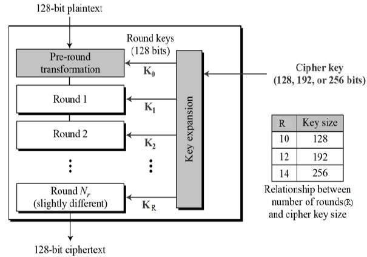

# Domain 3 - Security Architecture and Engineering

## 3.1 - Research, implement and manage engineering processes using secure design principles

### Threat Modeling

* process where potential threats are identified, categorized, and analyzed.
* can be performed proactive during design and development or as a reactive measure once a product has been deployed
* process identifies
  * the potential harm,
  * the probability of occurrence,
  * the priority of concern,
  * the means to eradicate or reduce the threat
* not meant to be a single event but initiated early in the design process and continue throughout a systems lifecycle
* proactive (during design and build) vs reactive (post-deployment, pen testing, threat hunting)
* Microsoft uses a [Security Development lifecycle (SDL)](https://www.microsoft.com/en-us/securityengineering/sdl)
  * includes a range of procedures aim at bolstering security assurance and compliance prerequisites.
  * follows the [NIST Secure Software Development Framework](https://csrc.nist.gov/Projects/ssdf) closely
  * aids developers in creating secure software by diminishing the quantity and seriousness of software vulnerabilities while trimming development expenses
* Modelling Frameworks
  * **STRIDE**
    * https://en.wikipedia.org/wiki/STRIDE_model
    * Developed by Microsoft as a threat categorization scheme
    * stands for :
      * **_Spoofing_**
        * an attack with the goal of gaining access to a target system through the use of falsified identity.
        * an attacker spooks their identity as a valid or authorized entity, they are often able to bypass filters and blockades against unauthorized access
      * **_Tampering_**
        * an action resulting in unauthorized changes or manipulation of data, whether in transit or at rest.
      * **_Repudiation_**
        * ability of a user or attacker to deny having performed an action or activity using plausible deniability
        * attacks can also result in innocent third parties being blamed 
      * **_Information Disclosure_**
        * revelation or distribution of private, confidential, or controlled information to external or unauthorized entities
      * **_Denial of service (DoS)_**
        * attack that attempts to prevent
      * **_Elevation of privilege_**
    * **Process for Attack Simulation and Threat Analysis (PASTA)**
      * https://www.iriusrisk.com/resources-blog/pasta-threat-modeling-methodologies
      * a seven-stage threat modelling methodology.
      * risk-centric approach that aims at selecting or developing countermeasures in relation to the value of the assets to be protected.
      * Seven-Steps:
        * **Stage I: Definition of the Objectives (DO)**
        * **Stage II: Definition of the Technical Scope (DTS)**
        * **Stage III: Application Decomposition and Analysis (ADA)**
        * **Stage IV: Threat Analysis (TA)**
        * **Stage V: Weakness and Vulnerability Analysis (WVA)**
        * **Stage VI: Attack Modelling & Simulation (AMS)**
        * **Stage VII: Risk Analysis & Management (RAM)**
    * **Visual, Agile, and Simple Threat (VAST)**
      * https://smartstatetech.medium.com/threat-modeling-methodology-vast-5c7de64cd924
      * Threat modelling concept that integrates threat and risk management in to an Agile programming environment on a scalable basis
      * two types of models
        * VAST: Application Threat Models
          * [App Threat Models](https://www.threatmodeler.com/application-threat-modeling-guide-for-cisos/) for dev teams are created using [process flow diagrams (PFD)](https://www.threatmodeler.com/2017/09/18/architecturally-based-process-flow-diagrams/).
            * PFD's map the features and communications of an application in much the same way developers and architects think about the application during an SDLC design session
        * VAST: Operational Threat Models
          * designed for the infra teams
          * more similar to traditional Data Flow Diagrams (DFDs) than app threat models, the data flow information is presented from an attacker - not a data packet - perspective, by relying on PFDs instead

* Least privilege

### Defense in Depth

* also known as _layering_ 
* https://en.wikipedia.org/wiki/Defense_in_depth_(computing)
* also known as the [onion model](https://en.wikipedia.org/wiki/Onion_model)
* use of multiple overlapping controls in a series for one objective
* no one control can protect against all possible threats
* a single failed control **SHOULD NOT** result in the exposure of systems and/or data
* a serial configurations are very narrow but deep
* a parallel configuration are very wide but shallow, useful in distributing computing applications
* _Defense in breadth_ or _Diversity in defense_
  * Using a wide range of security products from varied vendors significantly reduces or avoids the risk of a single exploit compromising several layers at once.
  * Can be problematic if elements of the security layers are from the same vendor or share common code , since a vulnerability could affect numerous layers simultaneously

* Secure defaults
* Fail securely
* Segregation of Duties (SoD)
* Keep it simple and small
* Zero trust or trust but verify
* Privacy by design
* Shared responsibility
* Secure access service edge

## 3.2 - Understand the fundamental concepts of security models (e.g., Biba, Star Model, Bell-LaPadula)

## 3.3 - Select controls based upon systems security requirements

## 3.4 - Understand security capabilities of Information Systems (IS) (e.g., memory protection, Trusted Platform Module (TPM), encryption/decryption)

## 3.5 - Assess and mitigate the vulnerabilities of security architectures, designs, and solution elements

* Client-based systems
* Server-based systems
* Database systems
* Cryptographic systems
* Industrial Control Systems (ICS)
* Cloud-based systems (e.g., Software as a Service (SaaS), Infrastructure as a Service (IaaS), Platform as a Service (PaaS))
* Distributed systems
* Internet of Things (IoT)
* Microservices (e.g., application programming interface (API))
* Containerization
* Serverless
* Embedded systems
* High-Performance Computing systems
* Edge computing systems
* Virtualized systems

## 3.6 - Select and determine cryptographic solutions

### Cryptographic Foundations

Cryptography provides confidentiality, integrity, authentication, and nonrepudiation for sensitive information while it is stored (at rest), traveling across a network (in transit/in motion), and existing in memory (in use/in processing). It is also an extremely important security technology that is embedded in many security controls used to protect information from unauthorized visibility and use.

#### Goals of Cryptography

There are four fundamental goals of cryptography:

* **Confidentiality**
  * ensures that data remains private in three different states:
    * _At rest_:
      * stored in a fixed location
      * susceptible to theft of the physical device or theft of the data through lateral movement within the servers where the data is stored
    * _In transit/motion_:
      * traveling across a network
      * also known as _data on the wire_
      * susceptible to eavesdropping
    * _In use_:
      * in memory or application process
      * susceptible to unauthorized access via the application if the OS does not properly implement process isolation
  * most widely cited goal --
    > * _"the preservation of secrecy for stored information or for communications between individuals and groups"_
  * two main types of cryptosystems enforce confidentiality:
    * **_Symmetric cryptosystems_**
      * use a shared secret key available to all users of the system
    * **_Asymmetric cryptosystems_**
      * use individual pairs of public and private keys for each users of the system
* **Integrity**
  * ensures that data is not altered without authorization
  * integrity mechanisms in place ensure recipient of a message can be certain that the message received is identical to the message that was sent
  * integrity checks ensure that stored data was not altered between the time it was created and the time it was accessed
  * digital signatures (encrypted message digests) ensures message integrity is enforced
    * the recipient of a message simply verifies that the message's digital signature is valid, ensuring that the message was not altered in transit
* **Authentication**
  * verifies the claimed identity of system users
  * major function of cryptosystems
  * [_challenge-response authenticaiton protocol_](https://en.wikipedia.org/wiki/Challenge%E2%80%93response_authentication) is an example where one party presents a question ("challenge") and another party must provide a valid answer ("response") to be authenticated.
    * User authenticating to an Authorization Server
* **Nonrepudiation**
  * provides assurance to the recipient that the message was originated by the sender and not someone masquerading as the sender
  * prevents the sender from claiming they never sent the message (repudiation)
  * only can be guaranteed using asymmetric (public key) crypto systems

#### Cryptography Concepts

* Key terms
  * _cyrptography_:
    * art of creating and implementing secret codes and ciphers
  * _cryptanalysis_:
    * study of methods to defeat codes and ciphers
  * _cryptology_:
    * combination of _cyrptography_ and _cryptanalysis_
  * _plaintext message_:
    * content of a message before it put into coded form
    * represented by the letter _P_ when encryption functions are described
  * _algorithm_:
    * set of rules, usually mathematical, that dictates how encryption and decryption processes are to take place
  * _encryption_:
    * process of using a cryptographic algorithm to codify a message
  * _cyphertext message_:
    * the product of when a _plaintext_ message is encrypted using a cryptographic algorithm
    * represented by the letter _C_ when encryption functions are described
  * _decryption_:
    * process of using a predefined cryptographic algorithm to uncodify a cypertext to retrieve the plaintext message
  * _keys_:
    * used by cryptographic algorithms to maintain their security
    * nothing more than a number, usually a very large binary number
    * sometimes referred to as _cryptovariables_ (in US government applications)
  * _key space_:
    * part of every algorithm
    * range of values that are valid for use as a key for a specific algorithm
    * defined by its _bit size_, the number of bits (0s and 1s) in the key
    * is the range between the key that has all 0s and the key that has all 1s (value from 0 to 2^n, where _n_ is the bit size of the key)
      * example: a 128-bit key can have a value from 0-2^128 (which is roughly 3.40282367 x 10^38)
* Absolutely important and crucial to protect the security of secret keys and private keys
* **Kerckhoff's Principle**
  * also known as _Kerchoff's Assumption_
  > * _"a cryptographic system should be secure even if everything about the system, except the key, is public knowledge"_
  * "The enemy knows the system"
  * most, if not all, cryptographers follow this principle which allows anyone to examine and test the algorithms, however there are those that disagree with this principle and would prefer to keep both the algorithm and the key private
  * however by keeping the public exposure this produces more activity and exposes more weakness more readily, leading to the weaker ones being abandoned and only the stronger algorithms being adopted
* [Federal Information Processing Standard (FIPS) 140-3, "Security Requirements for Cryptographic Modules"](https://doi.org/10.6028/NIST.FIPS.140-3)
  * defines the hardware and software requirements for cryptographic modules that the federal government uses

#### Cryptographic Mathematics

Has a foundation in mathematics leveraging basic binary mathematics and logical operators

##### Boolean Mathematics

* Defines the rules used for the bits and bytes that form the nervous system of any computer
* has electrical origins with two possible states _on (representing the presence of current)_ or _off (representing the absence of current)_
* in computer science these states are represented as _true_ (on) or _false_ (off)
* (0=FALSE) and (1=TRUE)

###### Logical Operators

Are logical functions used to manipulate data in boolean math for cryptography

**AND**

* represented by ⋀ (&& in most programming languages or a single & also)
* checks to see whether two values are both true
* AND function is computed by comparing the values of X and Y in each column (shown below), the output value is TRUE only in columns where both X and Y are true

AND operation truth table

|   X  |   Y  |  X ⋀ Y |
| ---- | ---- |  ------ |
|   0  |   0  |    0    |
|   0  |   1  |    0    |
|   1  |   0  |    0    |
|   1  |   1  |    1    |

Example:

X: 01101100
Y: 10100111
X ⋀ Y: 00100100

**OR**

* represented by ∨ (|| or a single | in most programming languages)
* checks to see whether at least on of the input values is true

OR operation truth table

|   X  |   Y  |  X ∨ Y |
| ---- | ---- |  ------ |
|   0  |   0  |    0    |
|   0  |   1  |    1    |
|   1  |   0  |    1    |
|   1  |   1  |    1    |

Example:

X: 01101100
Y: 10100111
X ∨ Y: 1110111

**NOT**

* represented by ~ (! in most programming languages)
* checks to see whether at least on of the input values is true

NOT operation truth table

|   X  |  ~X  |
| ---- | ---- |
|   0  |   1  |
|   1  |   0  |

Example:

X: 01101100
~X: 1001011

**Exclusive OR (XOR)**

* most important and most commonly used in cryptographic applications
* represented by ^ (! in most programming languages)
* returns a true value when only one of the input values is true

XOR operation truth table

|   X  |   Y  |  X ^ Y |
| ---- | ---- |  ------ |
|   0  |   0  |    0    |
|   0  |   1  |    1    |
|   1  |   0  |    1    |
|   1  |   1  |    0    |

Example:

X: 01101100
Y: 10100111
X^Y: 11001011

#### Modulo Function

* extremely important in the field of cryptography
* the remainder value left over after a division operation is performed
* usually represented in equations by the abbreviation _mod_ or the _%_ symbol

Examples:
8 mod 6 = 2
6 mod 8 = 6
10 mod 3 = 1
10 mod 2 = 0
32 mod 8 = 0
32 mod 26 = 6

#### One-Way Functions

* mathematical operation that easily produces output values for each possible combination of inputs but makes it impossible to retrieve the input values
* used in public key cryptosystems
* never been proven that any specific known function is "truely" one-way as some function may be broken by future cryptanalysis

#### Nonce

* allows for adding randomness to the encryption process to gain cryptographic strength
* random number that acts as a placeholder variable in mathematical functions
* when the function is executed, the nonce is replaced with a random number generated at the moment of processing for one-time use
* must be a unique number each time it is used
* examples of a nonce is an _initialization vector (IV)_, which is a random bit string that is the same length as the block size (amount of data to be encrypted in each operation) and is XORed with the message
  * IVs are used to create unique ciphertexts every time the same message is encrypted using the same key

#### Zero-Knowledge Proof

* A cryptographic method that allows one party (the prover) to convince another party (the verifier) that a statement is true, without revealing any information beyond the truth of the statement.
* The prover demonstrates that they know the information needed to verify the statement, without revealing the secret information itself.
* Done through complex mathematical operations, such as [discrete logarithms](https://en.wikipedia.org/wiki/Discrete_logarithm) and [graph theory](https://en.wikipedia.org/wiki/Graph_theory)

The following diagrams are a simplistic view of how zero-knowledge proof works:


#### Split Knowledge

* concept of a single solution that leverages separation of duties and two-person control
* information or privilege required to perform an operation is divided among multiple users, no single person has sufficient privileges to compromise the security of an environment
* example is _key escrow_,

##### Key Escrow Management

* Process in which a cryptographic key is stored with a third party for safekeeping. When certain circumstances are met, the third party may use the escrowed key to either restore an authorized user's access or decrypt the material themselves (third party is call the _recovery agent_)
* this process could lead to fraud or misuse if only a single-key escrow recovery agent were used

#### Work Function

* The strength of a cryptography system is measure by the effort in terms of cost and/or time required to complete a brute-force attack against an encryption system
* The size of the work function should be matched against the relative value of the protected asset, meaning the _work function_ needs to be only slightly greater that the time value of that asset
  * if the asset loses its value over time then the work function strength needs to be adjusted and only strong enough for protection as needed until the value of the asset is gone
* emerging technologies like quantum computing may make brute-force efforts much more feasible down the road

### Ciphers

#### Codes vs Ciphers

* sometimes they are interchangeable however they are not
* **_Codes_**
  * cryptographic systems of symbols that represent words or phrases, sometimes they are secret, but are not necessarily meant to provide confidentiality
  * examples:
    * Law Enforcement "10 System" of communication
      * "10-4" means "I received your communication and understand the contents"
    * Semaphores (visual signaling) and Morse Code
  * the above list codes are commonly known by the public and provide ease of communication
  * some codes are secret and may convey confidential information using a secret code-book where the meaning of the code is known only to the sender and the recipient
* **_Ciphers_**
  * always meant to hide the true meaning of a message
  * uses a variety of techniques to alter and/or rearrange the characters or bits of a message to achieve confidentiality
    * converts plaintext messages to ciphertext on several factors:
      * bit basis (single digit of binary code)
      * character basis (single-character of an ASCII or Unicode message or another encoding)
      * block basis (fixed-length segment of a message, usually express in number of bits)

#### Types of Ciphers

##### Transposition Ciphers

* use an encryption algorithm to rearrange the letters of a plaintext message to form a ciphertext message
* decryption is essentially reversing the encryption process to retrieve the original message

A more complex version is the **_columnar transposition_**
Example:
Encrypt the message "The fighters will strike the enemy bases at noon" using the secret key _attacker_

First step is take the letters of the secret key and number then in alphabetical order (second appearance of a letter just add 1 to it (A = 1, second A = 2, etc))

```text
ATTACKER
17823546
```

Next, the letters of the message are written in order underneath the letters of the keyword:

```text
ATTACKER
17823546
THEFIGHT
ERSWILLS
TRIKETHE
ENEMYBAS
ESATNOON
```

Finally the sender enciphers the message by reading down each column, the order in which the columns are read corresponds to the numbers assigned in the first step. This produces the following ciphertext

```text
T E T E E F W K M T I I E Y N H L H A O G L T B O T S E S N H R R N S E S I E A
```

When the receiver gets this encoded message they reconstruct the eight-column matrix using the ciphertext and the same key and then simply reads the plaintext message across the rows

##### Substitution Ciphers

* use an encryption algorithm to replace each character or bit of the plaintext message with a different character
* to decrypt the ciphertext message you simply shift the letter 3 places in terms of the ROT3 or Ceasar cipher, the shift number is arbitrary (example: ROT12 shifts characters 12 spaces to the right)
* earliest knows substitution cipher is known as _**Caesar cipher**_, which was used by Ceasar to communicate with Cicero in Rome while he was conquering Europe
* **_Ceasar Cipher_**
  * mono-alphabetic
  * also become known as the _ROT3 (or Rotate 3) Cipher_
  * simply shift each letter of the alphabet three places to the right, example A would become D, B would become E, etc
    * if you reached the end of the alphabet during the process you would simply wrap around to the beginning so X would become A, Y becomes B, Z becomes C
  * easy to crack unfortunately and vulnerable to the **_frequency analysis_** due to the use of the most common letters in the english language "E, T, A, O, I, N, S, H, R, D, L, and U (know as "ETAOIN SHRDLU") and attacker can determine the pattern

Example of Ceasar Cipher

```text
Original message: "THE DIE HAS BEEN CAST"
Cipher Message:   "WKH GLH KDV EHHQ FDVW"
```

* **_ROT3_**
  * can be express in mathematical terms by converting each letter to its decimal equivalent (A = 0 and Z = 25)
  * you can then add three to each plaintext letter (P) to determine the ciphertext (C)
  * you account for the wrap-around using the modulo function
  * encryption function looks like `C = (P + 3) mod 26`
  * decryption function looks like `P = (C - 3) mod 26`

* **_Polyaplphabetic substitution_**
  * uses multiple alphabets (such as keyword) in the sames message to hinder decryption efforts
  * example is [**_Vigenére cipher_**](https://en.wikipedia.org/wiki/Vigen%C3%A8re_cipher), which uses a single encryption/decryption chart, which is shown below:
  * 
  * a key is required to use the **_Vigenére Cipher_** system, example shown above is `LEMON` and the message is `attackatdawn`
  * follow this process:
    * 1 - Write out the plaintext
    * 2 - Underneath, write out the encryption key, repeating the key as many times as needed to establish a line of text that is the same length as the plaintext (`LEMONLEMONLE`)
    * 3 - Convert each letter position from plaintext to ciphertext
      * a. Locate the column headed by the first plaintext character (`A`)
      * b. Next, locate the row headed by the first character of the key (`L`)
      * c. Finally, locate where these two items intersect, and write down the letter that appears there (`L`). This is the ciphertext for the letter position.
    * 4 - Repeat steps 1 through 3 for each letter in the plaintext version. The results are shown below:
      * plaintext:  `ATTACKATDAWN`
      * key:        `LEMONLEMONLE`
      * ciphertext: `LXFOPVEFRNHR`
  * this substitution method protects against direct frequency analysis, it is vulnerable to a second-order form of a frequency analysis call **_period analysis_**, which is an examination of frequency based on the repeated use of the key.

* **_One-Time Pads_**
  * extremely powerful form of substitution cipher
  * also known as [**_Vernam Ciphers_**](https://en.wikipedia.org/wiki/One-time_pad), named after the inventor Gilbert Sandford Vernam of AT&T Bell Labs
  * use a different substitution alphabet for each letter of the plaintext message
  * usually written as a very long series of numbers to be plugged into the function
  * encryption function: `(C)iphertext = (P)laintext ^(XOR) (K)ey`  
  * decryption function: `(P)laintext = (C)iphertext ^(XOR) (K)ey`
  * when used properly they are an unbreakable encryption scheme, no repeating pattern of alphabetic substitution rendering cryptanalysis efforts useless
  * there are several requirements in order to ensure the integrity of the algorithm
    * the one-time pad encryption key must be unique and randomly generated
    * the one-time pad must be physically protected against disclosure
    * each one-time pad must be used only once
    * the key must be as long as the message being encrypted
  * example of when one of the above listed requirements are not met
    * [Project VENONA](https://www.nsa.gov/Helpful-Links/NSA-FOIA/Declassification-Transparency-Initiatives/Historical-Releases/Venona/), where the US Intelligence discovered a pattern in the way the Soviets generate their one-time pad for their key values, they were not randomly generate (violating the first rule).
  * the major obstacle in its widespread use is the difficulty in generating, distributing, and safeguarding the lengthy keys required
  * can be realistically used only for short messages, because of key lengths
  * see [www.cryptomuseum.com](https://www.cryptomuseum.com/crypto/otp/index.html) to learn more on one-time pads.

##### Running Key Ciphers

* Also known as a _book cipher_, it solves the dilemma of the _One-Time Pad Ciphers_
* The encryption key is as long as the message itself and is often chosen from a common book, newspaper, or magazine
* Example:
  * The message to encrypt, which is 66 characters in length (not count spaces):
    * `Richard will deliver the secret package to Mathew at the bus station tomorrow.`
  * Use the first 66 characters of the running key (an extract from the third paragraph from a chapter of _Moby Dick_):
    * `With much interest I sat watching him. Savage enough though he was, and hideously marred.`

* Functions:
  * Encryption: `C = (P + K) MOD 26`
  * Decryption: `P = (C - K) MOD 26`


##### Block Ciphers

* Operate on "chunks" or blocks of a message and apply the encryption algorithm to an entire message block at the same time
* transposition ciphers are examples of block ciphers
* most modern encryption algorithms implement some type of block cipher

##### Stream Ciphers

* Operate on a single character or bit of message (or data stream) at a given time
* Caesar Cipher and one-time pad are examples
* can also function as a block cipher, in this case there is a buffer that fills up to real-time data that is then encrypted as a block and transmitted to the recipient

##### Confusion v. Diffussion

Two basic operations used to obscure plaintext messages:

* Confusion (substitution)
  > * occurs when the relationship between the plaintext and the key is so complicated that an attacker can't merely continue altering the plaintext and analyzing the resulting ciphertext to determine the key
* Diffusion (transposition)
  > * occurs when a change in the plaintext results in multiple changes spread throughout the ciphertext.


### Modern Cryptography

#### Cryptographic Keys

* **_Security Through Obscurity_**
  * keep an encryption algorithm secure by hiding the details of the algorithm from outsiders.

* Modern crypto systems are available for public review which allows for:
  * widespread analysis of the algorithm to unlock any potential vulnerabilities
  * allows for correcting any potential vulnerability ensuring that the algorithms are as secure as possible
* Modern cryptosystems rely on the secrecy of one or more cryptographic keys which are used by the algorithm
* Longer keys provide higher levels of security by increasing the size of the key space, rendering brute-force attacks more difficult

* [Data Encryption Standard (DES)](https://en.wikipedia.org/wiki/Data_Encryption_Standar)
  * created in 1975
  * used a 56-bit key at the time and was considered sufficient to maintain security of any data
  * 56-bit is no longer considered secure due to the advancements in cryptoanalysis and supercomputing power
  * modern crypto systems use at least 128-bit keys
* Key Management Best Practices
  * longer the key the better at securing and harder it is to break
  * always store secret keys and, if you must transmit them over a network, do so securely to protect them from unauthorized disclosure
  * Select keys using an approach that has a much randmoness as possible, taking advantage of the entire key space
  * Destroy keys securely when they are no longer needed.

##### Symmetric Keys

* relies on a "shared secret" encryption key that is distributed to all members who participate in the communications
* used for both encryption and decryption of messages
* sender encrypts and receiver decryptions
* also known as _"secret key encryption_" and _"private key cryptography"_
* _"ephemeral key"_ are temporary symmetric keys that are used for a single session, example Transport Layer Security (TLS) protocol.
  * TLS uses asymmetric keys for establishing the communication channel then switches to symmetric cryptography using an ephemeral key
* greatest strength is the speed at which it operates, often 1,000 to 10,000 times faster than asymmetric algorithms
* naturally lends itself to hardware implementations for even high-speed operations and bulk encryption tasks
* Weaknesses:
  * **Key distribution is a major problem**
    * keys are shared between parties and if there is no secure electronic channel available, then offline key distribution is done via "out of band" meaning typically in a non-secure fashion
  * **Does not implement nonrepudiation**
    * because any party that has the shared key can encrypt/decrypt the message therefore there is no way to prove were a given message originated from
  * **Algorithm is not scalable**
    * difficult for large groups to communicate using symmetric key cryptography
    * large groups can be achieved only if a subset of users shared a key
  * **Keys must be regenerated often**
    * each time a member leaves the group, all keys MUST be recreated in order to maintain security
    * for automated systems keys must be regenerated based on length of time that has passed, the amount of data exchanged, or the fact that a session goes idle of is terminated.


##### Asymmetric Keys

* Solves the weaknesses of _symmetric key encryption_
* _Public Key algorithms_ are the most common example of asymmetric algorithms
  * each user (system) has two keys:
    * public, which is shared with all users/systems
    * private, which is kept secret and known only to the user/system
  * opposite and related keys must be used in tandem for operations, that is if the public key is used to encrypt a message then only the corresponding private key is used to decrypt.
* Provides support for digital signature technology
* Major strengths:
  * **New users require generating only one public-private key pair**
    * this same key pair is used to communicate with all users of the asymmetric cryptosystem
    * makes the system more scalable
  * **User removal is easier**
    * using key revocation which allows keys to be canceled and effectively remove the user from the system
  * **Key regeneration is only needed to a private key compromise**
    * if a user leaves the community, the sys admin simply needs to invalidate that user's keys
    * no other keys are compromise and therefore no other key regen is required
  * **Provides confidentiality, integrity, authentication, and non-repudiation**
    * digital signature provide proof of origin of the sender (non-repudiation, authentication)
    * encryption/hashing (confidentiality, integrity)
  * **Simple key distribution process**
    * users make their public keys known to the wider community if they wish to participate
  * **No preexisitng communication link needs to exist**
    * individuals can begin communicating securely the moment they start communicating and does not require a pre-existing link
  * Major weakness: **Slow speed of operation**
* **_Hybrid Cryptograph_**
  * approach that combines symmetric and asymmetric cryptography
  * used to solve the weakness of asymmetric speed issues
    * Asymmetric is used securely establish a secure tunnel then uses symmetric encryption to encrypt large amounts of data


**Table - Symmetric and asymmetric key comparison**

| # of participants  |  # of Symmetric keys required  | # of asymmetric keys required |
| -----------------  | -------------------------- | --------------------- |
| 2      | 1     |  4   |
| 3      | 3     |  6   |
| 4      | 6     |  8   |
| 5      | 10    |  10  |
| 10     | 45    |  20  |
| 100    | 4,950 |  200 |
| 1,000  | 499,500 | 2,000 |
| 10,000 | 49,995,000 |  20,000 |

#### Cryptographic Methods

##### Hashing Algorithms

* a mathematical function that converts data of any size into a fixed-size string of characters, called a hash or digest
* used in public key cryptography in conjunction with digital signatures


##### Symmetric Cryptography

###### Block Cipher Modes of Operation

* Block cipher modes of operation define how to apply a block cipher algorithm to encrypt or decrypt larger amounts of data. They provide different ways to enhance security and efficiency compared to using a block cipher directly on individual blocks.
* Major modes are:
  * [**Electronic Cookbook (ECB) mode**](https://en.wikipedia.org/wiki/Block_cipher_mode_of_operation#Electronic_codebook_(ECB))
    * simplest mode and least secure
    * each time the algo processes a fixed block of data it encrypts the block using the chosen secret key
      * same block will produce the same encrypted block
    * susceptible to eavesdropping attacks where attackers could build a cookbook of encrypted values and eventually decipher and break the encryption scheme
    * impractical for use on anything but short transmissions such as small amounts of data, such as keys and/or parameter used to initiate other cryptographic modes as well as cells in a database
  * [**Cipher Block Chaining (CBC) mode**](https://en.wikipedia.org/wiki/Block_cipher_mode_of_operation#Cipher_block_chaining_(CBC))
    * each unencrypted text is XORed with the block cipher text immediately preceding it before its encrypted
    * decryption process decrypts the ciphertexts and reverse the XOR operation
    * implements an initialization vector (IV) and XORs it with the first block of the message which produces a unique output everytime the operation is performed
    * the IV must be sent to the recipient in order to decrypt the message
    * problem is if one block of data is corrupted during transmission, it becomes impossible to decrypt it and the next block as well
  * [**Cipher Feedback (CFB) mode**](https://en.wikipedia.org/wiki/Block_cipher_mode_of_operation#Cipher_feedback_(CFB))
    * streaming cipher version of CBC
    * operates against data produced in real time
    * instead of breaking a message into blocks, it uses memory buffers of the same block size, as the buffer fills it is encrypted and then sent to the recipients
    * waits for the next buffer to be filled and encrypted before sending to recipients
    * also uses an IV and chaining
  * [**Output Feedback (OFB) mode**](https://en.wikipedia.org/wiki/Block_cipher_mode_of_operation#Output_feedback_(OFB))
    * Operates similarly to CFB mode however instead of XORing an encrypted version of the previous block of ciphertext, it XORs the plaintext with a seed value
    * For the first encrypted block, an IV is used to create the seed value, future seed values are derived by running the algorithm on the previous seed value
    * major advantage is that there are no chaining functions and transmission errors do not propagate to affect the decryption of future blocks 
  * [**Counter (CTR) mode**](https://en.wikipedia.org/wiki/Block_cipher_mode_of_operation#Counter_(CTR))
    * uses a stream cipher similar to that used in CFB and OFB modes
    * uses a simple counter that increments for each operation instead of seed values
    * errors do not propagate
    * allows for breaking an encryption and decryption operation into multiple independent steps
    * well suited for parallel computing
  * [**Galois/Counter (GCM) mode**](https://en.wikipedia.org/wiki/Galois/Counter_Mode)
    * uses CTR mode and adds data authenticity controls into the mix
    * provides the recipient assurances of the integrity of the data received, done by adding _authentication tags_ to the encryption process
  * [**Counter with Cipher Block Chaining Message Authentication Code (CCM) mode**](https://en.wikipedia.org/wiki/CCM_mode)
    * similar to GCM
    * combines a confidentiality mode (CTR) with a data authenticity process (CCM)
    * CCM is used only with block ciphers that have a 128-bit block length (AES), and require the use of a nonce that must be changed for each transmission

###### Data Encryption Standard (DES)

* [DES](https://en.wikipedia.org/wiki/Data_Encryption_Standard)
* published in 1977 by the US government as proposed standard cryptosystem for a government communications
* 64-bit block cipher that has five modes of operation:
  * Electronic Codebook (ECB) Mode
  * Cipher Block Chaining (CBC) Mode
  * Cipher Feedback (CFB) Mode
  * Output Feedback (OFB) Mode
  * Counter (CTR) Mode
* operates on 64-bits of plaintext at one time to generates 64-bit blocks of ciphertext
* key used is 56 bits long
* uses a series of long exclusive OR (XOR) operations to generate the ciphertext, which is repeated 16 times for each encryption/decryption operation
  * referred to as _round_ encryption
  * "16 rounds of encryption"
  * each round generates a new key that is used as the input to the next round 
* No longer deemed secure and was replaced by Advanced Encryption Standard (AES) in December of 2001
* Building block for the more secure Triple DES


###### Triple DES

* [3DES](https://en.wikipedia.org/wiki/Triple_DES)
* updated version of DES which uses the same algorithm to produce encryption that is stronger than DES however it is also deemed inadequate now to meet modern requirements
  * as of Jan 1, 2024 the US government formally disallowed the use of 3DES for government data, however its still used in private industry
* Variants that use different number of keys
  * **DES-EDE3** and **DES-EEE3**
    * both use three independent keys (k1, k2, k3)
    * difference between the two are the operations (E for encryption and D for decryption)
      * DES-EDE3 encrypts the data with k1, decrypts the resulting ciphertext with k2, and encrypts that text with k3
        * `E(K1,D(K2,E(K3,P)))`
      * DES-EEE3 encrypts the data with all three keys in sequential order
        * `E(K1, E(K2, E(K3,P)))`
    * Mathematically both DES-ED3 and DES-EEE3 should have an effective key length of 168 bits, however known attacks have reduced the effective strength to 112 bits.


###### International Data Encryption Algorithm

* known as [IDEA](https://en.wikipedia.org/wiki/International_Data_Encryption_Algorithm)
* block cipher developed in 1991 as a direct replacement of DES to due to complaints about insufficient key length
* patented by Swiss developers, which has expired in 2012 and is now available with unrestricted use
* used with Pretty Good Privacy (PGP) email package
* similar to DES, IDEA operates on 64-bit blocks of plaintext/ciphertext
* begins operation with a 128-bit key, which is broken up in a series of 8 identical transformation operations using 52 16-bit subkeys
  * these subkeys then act as input text using a combination of XOR and modulus operations to produce the encrypted/decrypted version of the input message
* capable of operating in the save five modes used by DES: ECB, CBC, CFB, OFB, and CTR
* IDEA operates on 64-bit blocks using a 128-bit key and consists of a series of 8 identical transformations (a round, see the illustration) and an output transformation (the half-round).
* The processes for encryption and decryption are similar. IDEA derives much of its security by interleaving operations from different groups — modular addition and multiplication, and bitwise eXclusive OR (XOR) — which are algebraically "incompatible" in some sense. In more detail, these operators, which all deal with 16-bit quantities, are:
  * Bitwise XOR (exclusive OR) (denoted with a blue circled plus ⊕).
  * Addition modulo 216 (denoted with a green boxed plus ⊞).
  * Multiplication modulo 216 + 1, where the all-zero word (0x0000) in inputs is interpreted as 216, and 216 in output is interpreted as the all-zero word (0x0000) (denoted by a red circled dot ⊙).
  * After the 8 rounds comes a final “half-round”, the output transformation illustrated below (the swap of the middle two values cancels out the swap at the end of the last round, so that there is no net swap)


###### Blowfish

* [Blowfish](https://en.wikipedia.org/wiki/Blowfish_(cipher)) block cipher is an alternative to DES and IDEA
* also operates on 64-bit blocs of text, extends IDEA's key strength by allowing the use of variable-length keys ranging from (insecure) 32 to (extremely secure) 448 bits, longer keys increases encryption/decryption time
* much faster than DES and IDEA
* release for public use with no license by its creator Bruce Schneier
* included in several commercial products and operating systems
* some Blowfish libraries are also available for software developers and is often used for Secure Shell (SSH) connections
* It is a 16-round [Feistel cipher](https://en.wikipedia.org/wiki/Feistel_cipher) and uses large key-dependent [Substitution boxes (S-boxes)](https://en.wikipedia.org/wiki/S-box). In structure it resembles [CAST-128](https://en.wikipedia.org/wiki/CAST-128), which uses fixed S-boxes.
* Every round r consists of 4 actions:
  * **Action 1** : XOR the left half (L) of the data with the r th P-array entry
  * **Action 2** : Use the XORed data as input for Blowfish's F-function
  * **Action 3** : XOR the F-function's output with the right half (R) of the data
  * **Action 4** : Swap L and R
* The `F-function` splits the 32-bit input into four 8-bit quarters and uses the quarters as input to the S-boxes. The S-boxes accept 8-bit input and produce 32-bit output. The outputs are added modulo 232 and XORed to produce the final 32-bit output. After the 16th round, undo the last swap, and XOR L with K18 and R with K17 (output whitening).

Image (a) illustrates the blowfish encryption process, while image (b) illustrates the f-function process


###### SKIPJACK

* [SKIPJACK](https://en.wikipedia.org/wiki/Skipjack_(cipher))
* developed by the US National Security Agency (NSA)
* approved for use by the US government in [Federal Information Processing Standard (FIPS) 185 and the Escrowed Encryption Standard (EES)](https://csrc.nist.gov/files/pubs/fips/185/final/docs/fips185.pdf) in 1994
* uses an 80-bit key and operates on 64-bit blocks of text
* provided cryptographic routines support the [Clipper](https://en.wikipedia.org/wiki/Clipper_chip) and [Capstone](https://en.wikipedia.org/wiki/Capstone_(cryptography)) encryption Chips
* supports encryption key escrow which at the time the NSA and NIST and US Department of Treasury each held a portion of information required to reconstruct a SKIPJACK key
  * therefore when law enforcement obtained legal authorization, they would contact the two agencies to obtain the pieces of the key and enabling them to decrypt communication between affected parties
* used for encryption only
* key escrow is done through a mechanism known as Law Enforcement Access Field (LEAF)
  * The Clipper chip used a data encryption algorithm called Skipjack[1] to transmit information and the Diffie–Hellman key exchange-algorithm to distribute the public keys between peers. Skipjack was invented by the National Security Agency of the U.S. Government; this algorithm was initially classified SECRET, which prevented it from being subjected to peer review from the encryption research community. The government did state that it used an 80-bit key, that the algorithm was symmetric, and that it was similar to the DES algorithm. The Skipjack algorithm was declassified and published by the NSA on June 24, 1998. The initial cost of the chips was said to be $16 (unprogrammed) or $26 (programmed), with its logic designed by Mykotronx, and fabricated by VLSI Technology, Inc.
  * At the heart of the concept was key escrow. In the factory, any new telephone or other device with a Clipper chip would be given a cryptographic key, that would then be provided to the government in escrow. If government agencies "established their authority" to listen to a communication, then the key would be given to those government agencies, who could then decrypt all data transmitted by that particular telephone. The newly formed Electronic Frontier Foundation preferred the term "key surrender" to emphasize what they alleged was really occurring.[2]
* SKIPJACK and the Clipper chip were not embraced by the cryptographic community at large due to the mistrust of the escrow process inplace within the US government


###### Rivest Ciphers

* series of symmetric ciphers created by [Ron Rivest](https://en.wikipedia.org/wiki/Ron_Rivest), of [Rivest-Shamir-Adleman (RSA) Data Security](https://en.wikipedia.org/wiki/RSA_(algorithm)), several of these are important today including RC4, RC5, and RC6
* **Rivest Cipher 4 (RC4)**
  * [RC4](https://en.wikipedia.org/wiki/RC4)
  * stream cipher developed by Rivest in 1987
  * used widely during the decades that followed
  * uses a single round of encryption and allows the use of variable length keys ranging  from 40 to 2048 bits to generate a pseudorandom stream of bits (a keystream). As with any stream cipher, these can be used for encryption by combining it with the plaintext using bitwise exclusive or (XOR); decryption is performed the same way (since XOR with given data is an involution). This is similar to the one-time pad, except that generated pseudorandom bits, rather than a prepared stream, are used.
  * To generate the keystream, the cipher makes use of a secret internal state which consists of two parts:
    * A permutation of all 256 possible bytes (denoted "S" below).
    * Two 8-bit index-pointers (denoted "i" and "j").
  * The permutation is initialized with a variable-length key, typically between 40 and 2048 bits, using the key-scheduling algorithm (KSA). Once this has been completed, the stream of bits is generated using the pseudo-random generation algorithm (PRGA).
  * adopted due to its integration in the Wired Equivalent Privacy (WEP), Wi-Fi Protected Access (WPA), Secure Sockets Layer (SSL), and Transport Layer Security (TLS) protocols
  * reduced insecure due to attacks against its algorithm, WEP, WPA, and SSL no longer meet modern security standards
  * TLS no longer allows the use of RC4


* **Rivest Cipher 5 (RC5)**
  * [RC5](https://en.wikipedia.org/wiki/RC5)
  * designed by Rivest in 1994
  * block cipher of variable block sizes (32, 64, or 128 bits) that uses key sizes between 0 and 2048 bits and number of rounds (0 to 255). The original suggested choice of parameters were a block size of 64 bits, a 128-bit key, and 12 rounds.
  * not simply the next version of RC4, and is completely unrelated
  * improvement on older [RC2](https://en.wikipedia.org/wiki/RC2) algorithm which is no deemed secure
  * RC5 is subject to brute-force cracking attempts
    * large scale effort leveraging massive community computing resources cracked a message encrypted using RC5 with a 64-bit key, this process took 4 years to crack


* **Rivest Cipher 6 (RC6)**
  * [RC6](https://en.wikipedia.org/wiki/RC6)
  * block cipher developed as the next version of RC5
  * uses a 128-bit block size and allows the use of 128, 192, or 256-bit symmetric keys
  * was one of the candidates for the selection as the Advanced Encryption Standard (AES), but was not selected and not widely used today

###### Advanced Encryption Standard (AES)

* [AES(Rijndael)](https://en.wikipedia.org/wiki/Advanced_Encryption_Standard)
* established in 2000 by NIST as they had chosen the Rijndael block cipher as the replacement for DES
* [FIPS 197](https://csrc.nist.gov/pubs/fips/197/final), established in Nov 2001, mandates the use of AES/Rijindael for the encryption of all sensitive but unclassified data by the US government
* AES cipher allows the use of three key strengths (128, 192, and 256-bits)
* AES only allows the processing of 128-bit blocks, however Rijndael exceeded this specification as it allows cryptographers the ability to use a block size equal to the key length
* the number of rounds depends on the key length chosen:
  * 128-bit keys require 10 rounds of encryption
  * 192-bit keys require 12 rounds of encryption
  * 256-bit keys require 14 rounds of encryption



###### CAST Algorithms

* a family of symmetric key block ciphers named after their creators, Carlisle Adams and Stafford Tavares
* integrated into some security solutions
* uses a [Feistel cipher (network)](https://en.wikipedia.org/wiki/Feistel_cipher) and come in two forms:
  * [**CAST 128**](https://en.wikipedia.org/wiki/CAST-128):
    * uses either 12 or 16 rounds of Feistel network encryption with a key size between 40 and 128 bits on 64-bit blocks of plaintext
  * [**CAST-256**](https://en.wikipedia.org/wiki/CAST-256):
    * uses 48 rounds of encryption with a key size of 128, 160, 192, 224, or 256 bits on 128-bit blocks of plaintext
    * was a candidate for AES but was not selected

##### Symmetric Key Management

* **Key management practices**:
  * security measure taken by administrators and cryptosystem users to protect the security of the keying material
  * including safeguards surrounding the creation, distributions, storage, destruction, recovery, and escrow of symmetric (secret) keys
* **Creation/Distribution**
  * Three main methods of secure key exchange:
    * **_Offline Distribution_**
      * simple
      * physically inconvenitent
      * parties exchange either via paper, email, telephone or electronic devices
      * inherent flaws
        * paper can be lost or thrown in the trash
        * emails can be intercepted
        * telephones can be wiretapped
      * cumbersome to users especially geographically distant locations
    * **_Public Key Encryption_**
      * also known as Asymmetric Key Encryption
      * enabling two parties to exchange encryption keys over an insecure channel without needing to pre-share a secret key.
      * achieved by using a key pair:
        * a public key, which is openly shared, and a private key, which is kept secret. * public key is used to encrypt messages, and only the corresponding private key can decrypt them, ensuring secure communication.
    * **_Diffie-Hellman_**
      * key exchange method for two parties to securely establish a shared secret key over an insecure channel.
      * This shared secret can then be used to encrypt further communication between the two parties using symmetric-key cryptography.
      * The algorithm itself does not involve encrypting any actual data, but rather, it securely shares a key that can be used for encryption later.
* **Storage and Destruction of Symmetric Keys**
  * Never store an encryption key on the same system where encrypted data resides
  * For sensitive keys, consider two different individuals with half of the key, they will need to collaborate to re-create the entire key (split knowledge)
  * keys must be re-generated and data needs to be re-encrypted with this new key when someone with knowledge of the key leaves the organization
  * Key Storage Mechanisms:
    * _Software-based storage_
      * keys are stored as digital objects on the system where they are used
      * maybe on local file system or more adavanced speicalized applications to protect the keys (Vault)
    * _Hardware-based storage_
      * maybe smart cards or flash drives that stores the key for personal use
      * _Hardware Security Modules (HSM)_ which is an enterprise device used for storage of keys.
      * more complex and expensive approach but offer added security
    * _Cloud-based storage_
      * takes HSM approach and implemented in cloud service providers (AWS, GCP, Azure) data centers which are managed by them
* **Key Escrow and Recovery**
  * systems that allow the government, under certain circumstances (court order) to obtain crypto keys used for a particular communication from a central storage facility
  * two major approaches that have been proposed over the past decade:
    * **Fair Cryptosystems**
      * key is split into two or more pieces, each of which is given to an independent third party
      * each piece is useless on its own and needs to be recombined to obtain the secret key
      * when government agencies have legal authority to access a particular key they provide evidence of the court to each of the third parties and then reassembles the key
    * **Escrowed Encryption Standard**
      * provides the government or another authorized agent with the technological means to decrypt ciphertext (proposed approach in the Clipper chip)
  * the general public will likely never accept the potential government intrusiveness key escrow facilitates
  * **Key Recovery Agents (RA)**
    * extremely powerfull privelege
    * have ability to recover the encryption keys assigned to users
  * **_M of N Conrtol_**
    * adopted by organizations to avoid the single powerful RA user
    * group of individuals the size of _N_ who are granted RA privilege
    * if they wish to recover an encryption key a subset of a least the size of _M_ must agree to do it
    * Example:
      * M-of-N where M=3 and N=12, there are 12 individual recovery agents, of whom 3 must collaborate to retrieve an encryption key

### Cryptographic life cycle (e.g., keys, algorithm selection)

* Every cryptosystem, except for one-time pad, have limited life span
* [Moore's Law](https://en.wikipedia.org/wiki/Moore%27s_law), states that
  > * _processing capabilities of a state-of-the-art microprocessor will double approximately every two years, which means eventually all processors will reach the amount of stength required to simply guess the encryption keys used for a communication_
* security professionals must keep the crytographic lifecycle in mind when selecting an algorithm and have proper governance controls and practices in place to keep it secure and private
* Governance Controls:
  * Specifying the cryptographic algorithms (such as AES and RSA) acceptable for use in an organization
  * Identifying the acceptable key lengths for use with each alogrithm based on the sensitivity of information transmitted
  * Enumerating the secure transaction protocols (such as TLS) that may be used

### Public key infrastructure (PKI) (e.g., quantum key distribution)

## 3.7 - Understand methods of cryptanalytic attacks

* Brute force
* Ciphertext only
* Known plaintext
* Frequency analysis
* Chosen ciphertext
* Implementation attacks
* Side-channel
* Fault injection
* Timing
* Man-in-the-Middle (MITM)
* Pass the hash
* Kerberos exploitation
* Ransomware

## 3.8 - Apply security principles to site and facility design

## 3.9 - Design site and facility security controls

* Wiring closets/intermediate distribution facilities
* Server rooms/data centers
* Media storage facilities
* Evidence storage
* Restricted and work area security
* Utilities and Heating, Ventilation, and Air Conditioning (HVAC)
* Environmental issues (e.g., natural disasters, man-made)
* Fire prevention, detection, and suppression
* Power (e.g., redundant, backup)

## 3.10 - Manage the information system lifecycle

* Stakeholders needs and requirements
* Requirements analysis
* Architectural design
* Development /implementation
* Integration
* Verification and validation
* Transition/deployment
* Operations and maintenance/sustainment
* Retirement/disposal