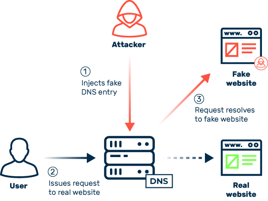

# Domain 4 - Communication and Network Security

## 4.1 - Apply secure design principles in network architectures

### Open System Interconnection (OSI) Model

* [OSI Model](https://en.wikipedia.org/wiki/OSI_model)
* standardized model that establishes a common communications standard
* Developed by the International Organization for Standardization (ISO) in the late 1970s but only formally published as I[SO/IEC 7498](https://cdn.standards.iteh.ai/samples/20269/4b12bcad0c6247dba2875b7cdf47b807/ISO-IEC-7498-1-1994.pdf) in 1984
  * facilitates interoperability between different vendor system
  * has become a common reference point
* Divides networking tasks into seven layers, each layer performing specific tasks/operations support data exchange
* Conceptual framework / theoretical model representing a protocol stack
  * layered collection of multiple protocols
  * communication between protocol layers occurs through **Encapsulation/Deencapsulation**
    * **_Encapsulation_**
      * the process where each layer adds control information (like headers) to the data as it moves down the layers from the application layer to the physical layer
    * **_Deencapsulation_**
      * also referred to as _decapsulation_
      * Reverse flow, as data travels up the OSI layers at the receiving end, each layer removes the header information that was added during encapsulation.
      * The original data is then delivered to the appropriate application.
    * **How the process works**
      * Application Layer: Data originates here and is passed down.
      * Presentation Layer: Adds its header.
      * Session Layer: Adds its header.
      * Transport Layer: Breaks data into segments and adds TCP or UDP headers.
      * Network Layer: Adds IP header (source and destination addresses).
      * Data Link Layer: Adds a frame header and trailer (containing MAC addresses).
      * Physical Layer: Transmits the data as a stream of bits over the physical medium.
* Seven Layers:

  * [**Application Layer (7)**](http://www.highteck.net/EN/Application/Application_Layer_Functionality_and_Protocols.html)
    * responsible for interfacing with user applications, network services, or the OS with the protocol stack
    * receives data from software via the protocol stack
    * encapsulates the message by adding information
      * **_Header_**
        * added to the beginning
      * **_Footer_**
        * added to the end of the message
    * the content is encapsulated into a single network container known as a [_protocol data unit (PDU)_](https://en.wikipedia.org/wiki/Protocol_data_unit)
    * PDU is sent down to the _Presentation Layer_
    * Security Relevance
      * many attacks at this layer (cross-site scripting, buffer overflows, sql injects)
      * controls
        * input validation
        * secure coding practices
        * WAFs
  * **Presentation Layer (6)**
    * responsible for transform data into a format that any system can understand (that follows the OSI model)
    * also responsible for encryption and compression
    * Encryption can occur in a least five locations:
      * Pre-network encryption (software encrypts prior to sending into App Layer)
      * Transport layer encryption (tls)
      * VPN encryption, layer 2/3/ or 4 depending on the vpn tech (L2TP, IPSec, OpenVPN (TLS VPN), etc)
      * Wireless encryption at the Data Link layer
      * Bulk encryption at the Physical Layer (provided by a device external to the network interface card (NIC))
      * No presentation layer in the TCP/IP Model
  * **Session Layer (5)**
    * responsible for establishing, maintaining, and terminating communications sessions between two computers
    * manages dialog discipline or dialog control (simplex, half-duplex, full-duplex)
      * **_Simplex_** : One-way communication (sender / receiver, but both)
      * **_Half-Duplex_**: Two-way comms, only one-direction can send or receive data at a time
      * **_Full-Duplex_**: Two-way comms, data can be sent and received by both parties in both directions simultaneously
    * establishes checkpoints for grouping/recovery/retransmission of PDU's that have failed or been lost since teh last verified checkpoint
    * No Session Layer in the TCP/IP Model and session layer activities are handled by TCP at the Transport Layer or not at all in the case of UDP usage
  * [**Transport Layer (4)**](http://www.highteck.net/EN/Transport/OSI_Transport_Layer.html)
    * responsible for managing the integrity of a connection and controlling the session
    * establishes communications between nodes (devices) and defines rules of a session
    * divides data into segments (TCP)/ datagrams (UDP) that are easier to manage and transmit
    * Session Rules
      * Specify how much data each segment can contain
      * How to verify message integrity
      * How to determine whether data has been lost
    * Protocol operating at L4:
      * Transmission Control Protocol (TCP)
      * User Datagram Protocol (UDP)
      * Transport Layer Security (TLS)
  * [**Network Layer (3)**](http://www.highteck.net/EN/Network/OSI_Network_Layer.html)
    * responsible for logical addressing and performing routing
    * logical addressing occurs when an address is assigned and used by software or a protocol rather than being provided and controlled by hardware
    * L3 Packet Header includes source and destination IP addresses
    * responsible for routing and delivery guidance but not responsible for guaranteed delivery
    * manages error detection and node data traffic (traffic control)
    * Non-IP (Legacy) Protocols
      * communication methods used by older devices or systems that don't rely on the Internet Protocol (IP) suite
      * have become the purview of special-purpose networks, such as IPX/SPX, AppleTalk, and NetBEUI
      * most firewalls are unable to perform packet, header, address, or payload filter on these
      * can be encapsulated in IP to be communicated across the internet, therefore they need to be blocked
    * Router is the primary device that operates at L3
      * determine the best logical path for the transmission of packets based on speed, hops, preference, and so on
      * use the destination IP to forward the data
      * [_routed (routing) protocol_](https://en.wikipedia.org/wiki/Routing_protocol)
        * controlled by routers and their routing tables (maintained by the router) which include known subnets and the pathways between them 
        * routing info is used to direct the traffic
        * include Internetwork Package Exchange (IPX) and Internet Protocol (IP)
        * Types
          * [**Interior Routing Protocols**](https://en.wikipedia.org/wiki/Interior_gateway_protocol)
            * [Type 1 - Link State](https://en.wikipedia.org/wiki/Link-state_routing_protocol)
              * gathers router characteristics such as speed, latency, error rates, and actual monetary costs for use
              * gathered info is then tabulated to make next hop routing decisions
              * Examples:
                * [Open Shortest Path First (OSPF)](https://en.wikipedia.org/wiki/Open_Shortest_Path_First) and [Intermediate System to Intermediate System (IS-IS)](https://en.wikipedia.org/wiki/Intermediate_system_to_intermediate_system)
            * [Type 2 - Distance Vector Routing](https://en.wikipedia.org/wiki/Distance-vector_routing_protocol)
              * maintains a list of destination networks along with metrics of direction and distance measured in hops (the number of routes to cross to reach the destination)
              * Examples:
                * [Routing Information Protocol (RIP)](https://en.wikipedia.org/wiki/Routing_Information_Protocol) and [Interior Gateway Routing Protocol (IGRP)](https://en.wikipedia.org/wiki/Interior_Gateway_Routing_Protocol)
                  * [Enhanced Interior Routing Gateway Protocol (EIRGP)](https://en.wikipedia.org/wiki/Enhanced_Interior_Gateway_Routing_Protocol)
          * [**Exterior Routing Protocols**](https://en.wikipedia.org/wiki/Exterior_gateway_protocol)
            * One type known as Path Vector Routing Protocol
            * makes next hop decisions based on the entire remaining path (i.e vector) to the destination
            * far-sighted
            * Example: 
              * [Border Gateway Protocol (BGP)](https://en.wikipedia.org/wiki/Border_Gateway_Protocol) which maintains a routing table of the [autonomous systems (AS)](https://en.wikipedia.org/wiki/Autonomous_system_(Internet)) across the internet
                * AS: a collection of IP networks and routers under the control of a single organization that presents a common routing policy to the internet
  * [**Data Link Layer (2)**](https://en.wikipedia.org/wiki/Data_link_layer)
    * responsible for formatting the packet for transmission into a _frame_
    * format is determined by the hardware/topology/tech of the network (ie. Ethernet (IEEE 802.3))
    * adds the source/destination hardware address to the data frame
    * the hardware address is known as the [**_Media Access Control (MAC) address_**](https://en.wikipedia.org/wiki/MAC_address)
      * 6-byte (48 bit) binary address expressed in hexadecimal notation (ex: 00-13-02-1F-58-F5)
      * also known as the _physical/NIC/Ethernet address_ 
      * first 3 bytes (24 bits) is the _organizationally unique identifier (OUI)_,
        * denotes the vendor/manufacturer of the devices
        * registered with the [Institute of Electrical and Electronics Engineers (IEEE)](https://en.wikipedia.org/wiki/Institute_of_Electrical_and_Electronics_Engineers)
        * OUI can be search via the [IEEE website](https://standards.ieee.org/products-services/regauth/index.html)
      * last 3 bytes (24 bits) represents a unique number assigned to that interface by the manufacturer
        * some vendors will encode information into these final 24 bits, which may represent the make, model, and production run along with a unique value
    * protocols operating at this layer:
      * **Address Resolution Protocol (ARP)**
    * devices operating at this layer:
      * Switches and Bridges
        * Switches recieve a frame on one port and send it out another port based on the destination MAC address, which are used to determine whether a frame is transfered over the bridge from one network segment to another
  * **Physical Layer (1)**
    * receives a frame and coverts it to bits to transmit over the physical medium and vice versa for receiving communications
    * NICs, Hubs, repeaters, concentrators, and amplifiers are hardware that operate here
    * cables are considered part of the physical layer as well

## Transmission Control Protocol/Internet Protocol (TCP/IP) Model

* [TCP Model](https://www.geeksforgeeks.org/computer-networks/tcp-ip-model/)
  * Designed in the 1960s by the Department of Defense (DoD)
* aka [Defense Advanced Research Projects Agency (DARPA) Model](https://www.bonvillian.org/the-darpa-model)
* Derived directly from the [TCP/IP protocol suite/stack](https://en.wikipedia.org/wiki/Internet_protocol_suite) comprising of hundreds of protocols
  * TCP/IP
    * is based on open standards and is platform independent
    * consumes a significant amount of resources
    * relatively easy to hack
    * Does not consider security
    * Numerous vulnerabilities if not implemented properly
      * buffer overflows
      * SYN Flood Attacks
      * various DoS attacks
      * fragment attacks
      * oversized packet attacks
      * spoofing attacks
      * adversary-in-the-middle (AitM)
      * hijack attacks
      * coding error attacks
      * passive and sniffing attacks
* Concise version of the OSI model
* Contains 4 Layers (sometimes referred to as five or four)
* the Physical and Data Link Layers are referred to as the Physical or Network Interface Layer in the 4 layer reference
* Layers:
  * **Application**
    * aka _Process_
  * **Transport**
    * aka _Host-to-Host_
  * **Internet**
    * aka _Internetworking_
  * **Link**
    * aka _Network Interface / Network Access Control_

The following diagram illustrates the differences between the OSI and TCP Models
/images/OSI-TCP.png)

### Analyzing Network Traffic

* Network communication analysis is an essential function in managing a network
* useful for detecting malicious communications, errors, or resolving transmission problems
* network eavesdropping may also be used for nefarious means and violate communication confidentiality and/or serve as a means for information gathering for a subsequent attack
* **Packet Analyzer**
  * a tool used to examine the contents of network traffic
  * can be dedicated hardware device or software on a host-machine (Wireshark)
  * frame/packet-capturing tool
  * may be called a sniffer, network evaluator, network analyzer, traffic monitor, or package-capturing utility
  * a sniffer is a general packet/frame capturing tool, where as a protocol analyzer is able to decode and intercept packet/frame contents
  * usually places the NIC into **_promiscuous mode_**
    * which has the NIC ignore the destination MAC address of Ethernet frames and collects each frame that reaches the interface on the local network
  * it can analyze / examine the frames down to the binary level
  * automatically parse out the contents of the header into an expandable outline form, allowing for any configuration or setting to be easily seen in the header details
  * payloads are usually displayed is ASCII or hexadecimal, sometimes both
  * Features
    * _Capture Filters_
      * set of rules the dictate which frames are saved into the capture file or buffer and which are discarded
    * _Display Filters_
      * used to show only those frames from the packet file or buffer that match you requirements
* Open-Source
  * Wireshark
* Commercial
  * Omnipeek
  * NetWitness
  * NetScout
* Protocol analyzers interfaces usually have three panes: summary, detail, and data.
* Five parts of a network analyzer are hardware, capture driver, buffer, realtime analysis, and decode.

### Application Layer Protocols

* **Telnet**
  * TELetypNETwork
  * terminal emulation network application that supports remote connectivity
  * allows common execution and running applications
  * does not support file transfers
  * **TCP Port 23**
  * Use SSH instead
  * Command
    ```bash
    telnet [\\RemoteServer]
    \\RemoteServer   
    : Specifies the name of the server 
    to which you want to connect
    ```
* **File Transfer Protocol (FTP)**
  * network application that supports an exchange of files that require anonymous or specific authentication
  * **TCP Port 20**
    * Active Mode Data Connection / Ephemeral (Passive Mode Data Connection)
  * **TCP Port 21** (Control Connection)
  * Used SFTP instead for better security
  * Command `ftp machinename`
* **Trivial File Transfer Protocol (TFTP)**
  * network application that supports an exchange of files that does not require authentication
  * **UDP Port 69**
* **Simple Mail Transfer Protocol (SMTP)**
  * used to transmit email messages from client to email server and from email server to another
  * **TCP Port 25**
  * only use if encrypted with TLS to create SMTPS
    * (i.e., STARTTLS, explicit TLS, or opportunistic TLS) over **TCP Port 587** or implicit over **TCP Port 465**
  * Command `MAIL FROM:<mail@abc.com?`
* **Post Office Protocol (POP)**
  * used to pull email messages from inbox on an email server down to an email client (aka client archiving)
  * **TCP Port 110**
  * Only use if encrypted with TLS to create **POPS on TCP Port 995**
* **Internet Message Access Protocol (IMAP4)**
  * protocol used to pull email messages from inbox on an email server down to an email client
  * offers the ability to retrieve only headers from an email server as well as to delete messages directly off the email server (i.e; server archiving)
  * Only use if encrypted with TLS to create **IMAPS** on **TCP Port 993**
* **Dynamic Host Configuration Protocol (DHCP)**
  * provides for centralized control of TCP/IP configuration settings assigned to system upon bootup
  * **UDP Port 67 (server)**
  * **UDP Port 68 (client)**
  * Command `clear ip dhcp binding {address | * }`
* **Domain Name System (DNS)**
  * network service that translates a domain name into the corresponding IP address. 
  * For example, the domain name `www.abc.com` might translate to `198.105.232.4`
  * **TCP Port 53**
  * Command `ipconfig /flushdns`
* **Hypertext Transfer Protocol (HTTP)**
  * protocol used to transmit web page content from a web server to web browsers in clear text
  * **TCP Port 80**
* **Hypertext Transfer Protocol Secure (HTTPS)**
  * TLS encrypted version of HTTP
  * does support use of TCP Port 80 -- but only for server-to-server communications
  * **TCP Port 443**
* **Line Printer Daemon (LDP)**
  * network service that is used to spool print jobs and send print jobs to printers
  * **TCP Port 515**
  * Consider enclosing in a VPN for use
  * Command `lpd [ -d ] [ -l ] [ -D DebugOutputFile]`
* **X Window**
  * GUI API for command-line operating systems
  * **TCP Ports 6000-6063**
  * Use with a VPN
  * Command `Run xdm in runlevel 5`
* **Network File System (NFS)**
  * network service used to support file sharing between dissimilar systems
  * **TCP Port 2049**
  * Use with a VPN
  * Command `service nfs start`
* **Simple Network Management Protocol (SNMP)**
  * network service used to collect network health and status information from a central monitoring station
  * supported by most network devices and TCP/IP compliant hosts
  * some devices support configuration changing via SNMP
  * **UDP Port 161 (SNMP agent)** (receiving requests)
  * **UDP Port 162 (for Trap Messages)** (receiving response and notifications)
    * inform the management console when an event or threshold violation occurs
  * Use the secure SNMPv3 only
  * Command `snmpget -mALL -v1 -cpublic snmp_agent_Ip_address sysName.0`

### Transport Layer Concepts & Protocols

* Connections are established ar the OSI Transport Layer using ports
* **Port Numbers**  
  * 16-digit binary numbers
  * total number of ports is `2^16` or `65,536`
  * numbered `0` through `65,535`
* **Mutliplexing Over IP**
  * process of allow a single IP address to support simultaneous connections/communications, each using a different port number
* **Socket**
  * Combination of an IP address and port number
* **Well-Known Ports**
  * aka **_service ports_**
  * first `1,024` (`0`-`1,023`)
  * reserved exclusively by servers
* **Registered Software Ports**
  * `1,024` - `49,151`
  * have one or more networking software products specifically registered with the [Internet Assigned Numbers Authority (IANA)](https://iana.org)
* **Random, Dynamic, or Ephemeral Ports**
  * `49,152` - `65,535`
  * often used randomly and temporarily by clients as **source ports**
  * most OS system allow for any port from `1,024` to be used as a dynamic client source port (as long as its not already in use)
* Two Primary Protocols:
  * [**Transmission Control Protocol (TCP)**](https://en.wikipedia.org/wiki/Transmission_Control_Protocol)
    * full-duplex
    * connection-oriented
      * uses handshake process between two systems to establish a communication session
      * employ reliable sessions (guarantee of data delivery)
        * in the event that all packets of a transmission window were not received, no acknowledgement is sent
        * after a timeout period, the sender will resend the entire transmission window set of packets again
        * will try to resend the packets until the client sends teh `RST` flag then the session is terminated
      * TCP Flags
        * **SYN**: opens a connections
        * **FIN**: closes a connection (polite disconnection)
        * **ACK**: acknowledges a SYN or FIN
        * **RST**: immediate/abrupt session termination and reset (impolite connection (hang up phone))
        * Other TCP Flags
          * **PSH**: "Push" flag is designed to force data on an application
          * **URG**: "Urgent" flag specifies that a packet is an urgent packet
      * **Three-Way Handshake Process**
        i. Client sends a `SYN` (Synchronize) flagged packet to the server
        ii. Server responds with a `SYN/ACK` (Synchronize and acknowledge) flagged packet back to the client
        iii. Client responds with a `ACK` (acknowledge) flagged packet back the server
        iv. Clients sends either `FIN` or `RST` to terminate the connection session
        /images/tcp-handshake.png)
  * [**User Datagram Protocol (UDP)**](https://en.wikipedia.org/wiki/User_Datagram_Protocol)
    * simplex
    * connectionless or "best effort" communications
    * no standard error detection (other than an optional packet checksum) or correction
    * does not use sequencing
    * does not use flow control mechanisms
    * does not use a preestablished session
    * no acknowledgment
    * considered unreliable
    * very low overhead and is faster for transmitting data
    * use only when data delivery is not required
    * traditionally used for real-time or streaming communications for audio/video

### Domain Name System (DNS)

* Numbering and Address Concepts
  * **Domain Name**
    * "temporary" name that is human-friendly convention assigned to an IP address
  * **IP Address**
    * "temporary" logical address assigned over or onto the MAC address
    * can change at any time via DHCP or by an admin
    * assigned dynamically via a DHCP or statically by an admin
  * **MAC Address**
    * hardware address that is a "permanent" physical address
      * may change (if NIC supports it) this is changed at the hardware level
      * OS change is memory only but may look like hardware (MAC spoofing)
* [DNS](https://en.wikipedia.org/wiki/Domain_Name_System)
  * system that resolves a human-friendly domain name into its IP address
* [Address Resolution Protocol (ARP)](https://en.wikipedia.org/wiki/Address_Resolution_Protocol)
  * resolves the IP address into its MAC address equivalent
* DNS Reverse Lookup
  * resolved an IP into a domain name
  * requires a PTR (pointer) resource record to be defined in the domain's zone file
* DNS Hierarchial Scheme
  * Public and Private Networks
  * links IPs to *[*_Fully Qualified Domain Names (FDQNs)_**](https://en.wikipedia.org/wiki/Fully_qualified_domain_name)
* FQDN Consists of three main parts:
  * [**Top-Level Domain (TLD)**](https://en.wikipedia.org/wiki/Top-level_domain)
    * The `com` in `www.google.com`
    * can be any number of official options
    * includes six of the original seven TLDs:
      * `com`, `org`, `edu`, `mil`, `gov`, and `net`
      * plus many newer ones including:
        * `info`, `museum`, `telephone`, `mobi`, `biz`, and so on
    * also two letter variations called [_country codes_](https://www.iana.org/domains/root/db) (`ca`, `us`, etc.)
    * the seventh original TLD was `int`, for international, which was replaced by the two-letter country codes
    * `.` to the right represents the root of the entire DNS namespace
  * **Registered Domain**
    * The `google` in `www.google.com`
    * must be registered with officially approved domain registrars, such as [Network Solutions](http://networksolutions.com), [Domains.com](http://domains.com), or [IONOS](http://ionos.com)
  * **Subdomain(s) or Hostname(s)**
    * The `www` in `www.google.com`
* FQDN Sections
  * Far Left Section:
    * can be either a single hostname (`www.`, `ftp.`, `blog.`, etc)
    * or multi-sectioned subdomain designation such as `server1.group3.blog5.myexample.com`
* Total length of a FQDN can't exceed 253 characters (including dots)
* Any single section cannot exceed 63 characters
* can only contain letters, numbers, hyphens, and periods
* [**Authorization Name Server**](https://en.wikipedia.org/wiki/Name_server#Authoritative_name_server)
  * Assigned to every registered domain name
  * Types:
    * **_Primary Authorization Name Server_**
      * host the original editable zone file for the domain
    * **_Secondary Authorization Name Server_**
      * used to host read-only copies of the zone file
* **Zone File**
  * Collection of resource records or details about the specific domain
  * dozens of possible [resource records](http://www.iana.org/assignments/dns-parameters/dns-parameters.xhtml) 
  * Commonly used resources records:
    * **A**
      * Address record
      * Links a FQDN to an IPv4 Address
    * **AAAA**
      * Address record
      * links a FQDN to an IPv6 address
    * **PTR**
      * Pointer record
      * links an IPV4/IPv6 address to a FQDN
    * **CNAME**
      * Canonical Name or alias record
      * links a FQDN to another FQDN
    * **MX**
      * Mail Exchange record
      * Identifies STMP emails servers for a domain
    * **NS**
      * Name server record
      * identifies the DNS servers for a domain
    * **SOA**
      * Start of authority record
      * identifies the primary authoritative DNS server, the responsible email address, serial number (of the zone file), and time intervals of refresh, retry, expire, and default TTL
* **Host file**
  * static local file containing hard-coded references for domain names and their associated IP address
  * used for DNS in the early days of the internet or ARPA net but dynamic DNS has replaced this
  * still in use on TCP/IP computers
  * administrations or threat actors can add entries to the host file
  * example
   ```text
   127.0.0.1        localhost
   127.0.1.1        kail

   192.168.56.101   bankofamerica.com
   ```
* How DNS Works:
  * Now that the Internet contains billions of IP addresses and FQDN, the host file is woefully inadequate. Enter DNS. First developed by Paul Mockapetris (now in the Internet Hall of Fame) in 1983, DNS is both distributed and dynamic, unlike our hosts file.
  * DNS does not rely upon one file or one server, but instead upon many files across many server across the globe. These servers are organized in a hierarchical manner. Due to this distributed nature, the DNS system is resistant to outages of one or many of these servers.
  * As illustrated in the diagram below, the user asks (queries) the local DNS server (cache) to access download.`beta.example.com`. The local DNS server does not have that resource as it is new. It then queries the root server. The root server responds “I don’t know” but refers the local DNS server to the IP address of the authoritative server for the top-level domain (TLD), in this case `.com`. The local DNS server will then query the TLD server for `.com` and it will respond with the authoritative server for the domain, in this case example.com. The local DNS server will then query the authoritative server for `beta.example.com`. If it has the record, it will return the resource (IP address) and if not, it will respond it “doesn’t know”.

The following diagram illustrates how DNS operations


* **DNS Components**
  * **_DNS Cache_**
    * This term is often confused as it has at least two meanings.
      * **Local**
        * list of names and IP addresses that you have already queried and have been resolved and are cached for you so that no network traffic is generated to resolve them (and much quicker).
        * local host files
      * **DNS Recursion**
        * a DNS server that simply performs recursive queries and caching without actually being an authoritative server itself.
  * **_Resolvers_**
    * any hosts on the Internet that need to look up domain information, such as the computer you are using to read this website.
  * **_Name servers_**
    * These are servers that contain the database of names and IP addresses and serves DNS requests for clients.
  * **_Name space_**
    * the database of IP addresses and their associated names.
* **Ports**
  * operates over TCP and UDP port 53
  * TCP port 53 is used 
    * for zone transfers (zone file exchanges between DNS servers)
    * for special manual queries
    * when a response exceeds 512 bytes
  * UDP port 53 is used for most typical DNS queries
* Use the command line tool **dig** to perform DNS looks up manually (some content filters alter DNS query results):
  ```text
            ~ % dig linkedin.com

            ; <<>> DiG 9.10.6 <<>> linkedin.com
            ;; global options: +cmd
            ;; Got answer:
            ;; ->>HEADER<<- opcode: QUERY, status: NOERROR, id: 35454
            ;; flags: qr rd ra; QUERY: 1, ANSWER: 1, AUTHORITY: 0, ADDITIONAL: 1

            ;; OPT PSEUDOSECTION:
            ; EDNS: version: 0, flags:; udp: 1220
            ;; QUESTION SECTION:
            ;linkedin.com.			IN	A

            ;; ANSWER SECTION:
            linkedin.com.		299	IN	A	13.107.42.14

            ;; Query time: 32 msec
            ;; SERVER: 64.71.255.204#53(64.71.255.204)
            ;; WHEN: Fri Jun 02 08:24:34 EDT 2023
            ;; MSG SIZE  rcvd: 57
  ```

#### **DNS Security and Vulnerabilities**

##### Security & Privacy

* [**_Domain Name System Security Extensions (DNSSEC)_**](https://dnssec.net/)
  * security improvement on DNS infrastructure
  * primary function is to provide mutual certificate authentication and encrypted session between. devices during DNS operations (DNS Lookups)
  * does not address confidentiality or availability, though, at all
  * leverages digital signatures for cryptographic authentication of DNS records (zone signing)
  * provides proof of origin and makes cache poisoning and spoofing attacks more difficult
  * however does not provide confidentiality as the digital signatures rely on publicly de-cryptable information
  * allows for a DNS client to perform DNS lookups and validate both their origin and authority via the cryptographic signature that accompanies the DNS response.
    * When a client makes a request for a DNS lookup, the digital signature can validate the integrity of the DNS record, while otherwise performing the typical way DNS records are processed and cached, so modifications to applications and code are not required for the use of DNSSEC.
  * Will NOT prevent or mitigate DoS attacks on the DNS servers, it can be used to greatly mitigate or eliminate common integrity attacks
* [**DNS over HTTPS (DoH)**](https://en.wikipedia.org/wiki/DNS_over_HTTPS)
  * for Non-DNS servers (client devices, etc) especially when using the internet should use
  * system creates an encrypted session with a DNS server of TLS-protected HTTP and then uses that session as a form of VPN to protect the DNS query/response
  * [**_Oblivious DoH (OdoH)_**](https://en.wikipedia.org/wiki/DNS_over_HTTPS#Oblivious_DNS_over_HTTPS)
    * 2020 enhancement of DoH
    * adds a DNS proxy between the client and the DNS resolver for isolating the identity of the requesting client from the DNS resolver
    * provide anonymity and privacy to DNS queries
    * however the privacy trust is on ODoH provider 
* Advanced Primer and discussion on DNS, its operation, and known issues can be found at [_"An Illustrated Guide to the Kaminsky DNS Vulnerability"_](http://www.unixwiz.net/techtips/iguide-kaminsky-dns-vuln.html)  

##### DNS Vulnerabilities

* [**DNS Poisoning**](https://en.wikipedia.org/wiki/DNS_spoofing)
  * aka **_DNS Spoofing_** or **_DNS Cache Poisoning_**
  * _"act of falsifying the DNS information used by a client to reach a desired system"_
  * An attacker provides (injects) incorrect DNS information for a domain (FQDN) to a DNS server (updated the zone files on the primary auth server or cache servers), which then gives out that incorrect information (also known as a DNS poisoning)
    * Attacks on Primary Authoritative Servers are rare as they would be noticed quickly
    * typically the attack is on the Cache Servers
  * DNSSEC can help in migitating this as the DNS record can be validated to come from the officially signed and registered DNS zone, and not from a rogue DNS server or other process attempting to inject malicious traffic into the data stream.
  
* [**Rogue DNS Server**](https://www.imperva.com/learn/application-security/dns-hijacking-redirection/)
  * can listen in on network traffic for any DNS query or specific DNS queries related to a target site
  * sends a DNS response to the client with false IP information
  * client accepts the information from the rogue DNS server and closes the session (response from the real DNS server is dropped)
  * DNS queries are not authenticated but they do contain a 16-bit value know as the _query ID (QID)_
  * the DNS response **MUST** contain the same QID as the query to be accepted, meaning a rogue server must include teh requesting QID in the false reply
* [**DNS Pharming**](https://en.wikipedia.org/wiki/Pharming)
  * closley related to DNS Poisoning
  * exploit vulnerabilities in DNS infrastructure to redirect users to malicious websites.
  * typically occurs either by modifying the local `hosts` file on a system or by poisoning/spoofing DNS resolution
  * _**Modification to Host file**
    * the host file is loaded into memory when the system boots which they will take precedence
    * attack plants info into the hosts file, on the next boot the host will be reloaded into memory
    * effective attack
* **Corrupt the IP Configuration**
  * attacker alters a clients DNS server lookup address which results in a false DNS server definition in order to start spoofing DNS responses
  * perform by compromising the DHCP server or a through a script
* **DNS Query Spoofing**
  * attack occurs when a threat actor is able to eavesdrop's on the client's query to a DNS server (Man-in-the-Middle)
  * the attacker intercepts the query and sends back a false reply which contains the same QID from the cloned query
* **Proxy Falsification**
  * type of attack via DNS if the proxy's domain name has to be resolved by the client to use the proxy
  * attackers modify local configuration, config script, or routing table to redirect comms to a rogue/false proxy
  * works only against web communications (or other services / protocols that use a proxy)
  * rogue proxy servers can modify traffic packets to reroute requests to whatever site the malicious actor wants
* **DNS Poisoning Defenses**
  * [**Split-DNS**](https://en.wikipedia.org/wiki/Split-horizon_DNS)
    * aka split-brain, split-view, split-horizon
    * deploying a DNS server for public use and a seperate DNS for internal use
    * all data in the zone file on the public DNS is accessible by the public via queries or probing
    * internal DNS is for internal clients (connected to the internal network) and outsiders are prohibited from access / interacting with it
      * blocking inbound port 53 for both TCP and UDP
    * internal system are configured to use the internal DNS or may only send queries to the external DNS (requires firewall changes)
  * Other security measures
    * Limit zone transfers from internal DNS to external DNS
      * blocking inbound TCP 53 (zone transfers) and UDP 53 (queries)
      * Require internal clients to resolve all domain names through internal DNS
        * requires blocking outbound UDP Port 53 (for queries)
        * keep outbound TCP port 53 (zone transfers) open
    * Limit the external DNS servers from which internal DNS servers pull zone transfers
    * Deploy a network IDS (NIDS) to watch for abnormal DNS traffic
    * Properly harden all DNS, server, and client systems in your private network
    * Used DNSSEC to secure DNS Infrastructure
    * Use DoH or OdoH on all clients where supported
    * [DNS Sinkhole](https://en.wikipedia.org/wiki/DNS_sinkhole)
      * Altered DNS records to reroute botnet traffic
      * self-inflicted DNS poisoning attacks
      * can be used for protection against malware, bots,
* **Domain Hijacking**
  * also known as domain theft, is the act of illegally taking control of a registered domain name without the owner's consent.
  * may be done by stealing the owner's logon credentials, using XSRF, hijacking a session, using AitM attacks, or exploiting a flaw in the domain registrar's systems.
  * Example of domain hijacking is the theft of [fox-it.com domain](http://blog.fox-it.com/2017/12/14/lessons-learned-from-a-man-in-the-middle-attack)
  * sometimes a when the domain expires and someone snatches the domain (flagged as hijacking but should not be)
  * Best defense
    * strong multi-factor auth on domain registrar site
    * setup auto-renew and double check payment methods a week before the renewal data
* **Homograph Attack**
  * type of cyberattack where malicious actors create fake website URLs that closely resemble legitimate ones (Phony international domain names (IDN)) by using visually similar characters from different alphabets. This deception aims to trick users into visiting the fake site, potentially leading to credential theft, malware installation, or other malicious activities.
  * example could include Cyrillic characters that, when resolved, direct you to a different site
  * Full discussion on this [type of attack](http://blog.malwarebytes.com/101/2017/10/out-of-character-homograph-attacks-explained)
  * Examples:
  
* **Footprinting**
  * An attacker attempts to gather all DNS records for a domain via zone transfer in order to map out the target environment
* **Denial of Service (DoS)**
  * Attackers flood DNS servers to prevent them from responding to legitimate DNS requests
* **Redirection**
  * An attacker redirects queries to a server that is under the attacker's control

### Internet Protocol (IP) Networking

* [IP](https://en.wikipedia.org/wiki/Internet_Protocol)
  * operates at the Network Layer of the OSI model
  * provides route addressing for data packets
  * foundation of global internet communication
  * provides a means of identity and prescribes transmission paths
  * connectionless and unreliable
  * does not guarantee that packets will be delivered \
  * does not guarantee that packets will be delivered in the correct order
  * does not guarantee that packets will be delivered only once
  * "best effort" delivery
  * Leverage TCP with IP in order to obtain reliable and controlled communication sessions

#### Pv4 vs IPv6

* [IPv4](https://en.wikipedia.org/wiki/IPv4)
  * most widely used
  * 32-bit length for addressing
  * uses the dotted quad notation, four numbers separated by periods (`192.168.200.1`)
    * Range 0 - 255
      * 8-bit binary numbers
      * 2<sup>8</sup> = 256 possible values
      * Start counting at 0
    * Must not be reused on internet-connected systems
    * May be reused if on private networks
    * If a system requires the internet then a Network Address Translation (NAT) server is required .. most modern modems (ISPs) provide this functionality
  * Features:
    * [Type of Service (ToS)](https://en.wikipedia.org/wiki/Type_of_service)
      * field in the second byte (8 bits) of the IPv4 header
      * could specify a datagram's priority and request a route for low-latency, high-throughput, or highly-reliable service.
      * has since been redefined as and split into two fields
        * (6 bit) [**Differentiated Services (DS)**](https://en.wikipedia.org/wiki/Differentiated_Services)
        * (2 bit) [**Explicit Congestion Notification (ECN)**](https://en.wikipedia.org/wiki/Explicit_Congestion_Notification)
* [IPv6](https://en.wikipedia.org/wiki/IPv6)
  * rapidly gaining adoption for both private and public networks
  * replaces IPV4 due to address exhaustion
  * supported since 2000 as of today (2024) native IPv6 is standard in most OSs today
  * in 2024 over 42% of internet traffic was IPv6
    * [IPv4 Statistics](http://www.google.com/intl/en/ipv6/statistics.html)
  * 128-bit length for addressing
  * Divided into eight 16-bit groups, each separated by a colon (`:`)
    * Example: `fd02:24c1:b942:01f3:ead2:123a:c3d2:cf2f`
    * Not case-sensitive, no leading zeros at the beginning
    * You can replace consecutive zeros with double colons (`::`) when referencing an address that has a group of zeros
  * Features provided (not available in IPv4)
    * **Scoped Addresses**
      * gives admins the ability to group and then block or allow access to network services
    * **Autoconfiguration**
      * theorectically removes the need for DHCP and NAT
      * DHCPv6 and NAT66 exist
      * also leverage SLAAC
    * **Quality of Service (QoS)**
      * include packet classification, queueing, traffic shaping, packet marking, and policing of IPv6 packets.
      * similar to IPv4 Type of Service (ToS)
  * Security Concerns
    * larger address spaces provides more address available for attackers to use as source addresses making it difficult to block or filter nefarious addresses
    * requires security filter and monitoring products to be upgraded to fully support IPv6 prior to enabling the protocol on production networks (other it may be a cover channel)
* IPv4 and IPv6 Co-existance Considerations
  * Options
    * **Dual Stack**
      * having more system support both IPv4 and IPv6 and using the appropriate protocol for each conversation
    * **Tunneling**
      * allows most systems to operate a single stack of either IPv4 or IPv6 and use an encapsulation tunnel to access systems of the other protocol
    * [**Network Address Translation-Protocol Translation (NAT-PT)**](https://ine.com/blog/2008-04-18-understanding-ipv6-nat-pt)
      * Specified in [RFC-2766](https://datatracker.ietf.org/doc/html/rfc2766)
      * can be used to convert between IPv4 and IPv6 network segments similar to how NAT converts between internal and external address
  * Deploy IPv6 at the edge (boundary devices and directly connected to the internet) and IPv4 for internal networks
* [Dynamic Host Configuration Protocol (DHCP)](https://en.wikipedia.org/wiki/Dynamic_Host_Configuration_Protocol)
  * a client/server protocol that automatically provides an Internet Protocol (IP) host with its IP address and other related configuration information such as the subnet mask and default gateway.
  * IP Addresses uniquely identifies systems on a network
  * DHCP for IPv4
  * [DHCP for IPv4 (DHCPv6)](https://notes.networklessons.com/ipv6-dhcpv6)
    * Two Operation Modes
      * **Stateful**
        * assigns specific IPv6 addresses to devices and manages the allocation of network configuration parameters
        * Operates similar to DHCP for IPv4
      * **Stateless**
        * provides network configuration parameters without assigning specific IPv6 addresses
        * Devices may use **_SLAAC_** to generate their own addresses
      * [**Stateless Address Autoconfiguration (SLAAC)**](https://www.networkacademy.io/ccna/ipv6/stateless-address-autoconfiguration-slaac)
        * mechanism that enables each host on the network to auto-configure a unique IPv6 address without any device keeping track of which address is assigned to which node
        * based on on routers periodically sending Router Advertisement (RA) message to the local network segment
        * RA messages include information about the network prefix that devices should use when forming their IPv6 addresses
        * Second element used to craft an IPv6 address is the _interface identifier_, derived from the MAC address of the NIC.
        * To enhance privacy, some implementations may use techniques like _"privacy extensions"_ to generate random interface identifiers
        * Combination of network prefix and interface identifier results in a self-assigned unique IPv6 address for each device

#### IP Classes

/images/ip-address-classes.png)

* **Class A**
  * up to 2<sup>24</sup>-2 = `16,777,214` hosts per Network
  * up to 2<sup>7</sup> = `128` available networks
  * First octet decimal digit `0` with a decimal range of `1-126` (`0-127`)
  * First octect binary (range) `0XXXXXXX`
  * IP Range `0.0.0.0 - 127.255.255.255`
  * Subnet Mask `255.0.0.0`
  * CIDR Equivalent `/8`
  * Entire `127` network set aside for the _loopback address_ (although only a single address is needed for that purpose)
    * typically only `127.0.0.1` is used
    * will use the `255.255.255.255` subnet mask if not configured
    * first address `127.0.0.0` is reserved as the network address and the `127.255.255.255` is the directed broadcast address
    * IPv6 this is specified as `::1/128` or `::1%128` 
  * network of `0` is defined as the **_blackhole_** network in which traffic is routed to be through away and discarded
* **Class B**
  * up to 2<sup>16</sup>-2 = `65,534` hosts per network
  * up to 2<sup>14</sup> = `16,384` available networks
  * First binary digit `10` with a decimal range `128-191`
  * First octect binary (range) `10XXXXXX`
  * IP address range `128.0.0.0 - 191.255.255.255`
  * Subnet Mask `255.255.0.0`
  * CIDR Equivalent `/16`
* **Class C** 
  * up to 2<sup>8</sup>-2 = `254` hosts per network
  * up to 2<sup>21<sup> = `2,097,152` available networks
  * First octet decimal digit `192` with a decimal range `192-223`
  * First octect binary (range) `110XXXXX`
  * IP address range `192.0.0.0-223.255.255.255`
  * Subnet Mask `255.255.255.0`
  * CIDR Equivalent `/24`
* **Class D**
  * used for multicasting
  * First octect binary (range) `1110XXXX`
  * IP address range `224.0.0.0 - 239.255.255.255`
* **Class E**
  * reserved for experimental and future use
  * First octect binary (range) `1111XXXX`
  * IP address range `240.0.0.0 - 255.255.255.255`

NOTE: class-based grouping of IPv4 addresses is no longer strictly adhered to instead **CIDR** and **VLSM** are used

#### Variable Length Subnet Masking (VLSM)

* [VLSM](https://www.pynetlabs.com/what-is-vlsm-variable-length-subnet-mask/)
* a technique used in computer networking to divide an IP address space into subnets of varying sizes, optimizing IP address allocation.
* allows for flexibility in subnet sizes, enabling efficient use of IP addresses, especially in networks with diverse host count requirements. 

#### Classless Inter-Domain Routing (CIDR)

* [**_CIDR_**](https://en.wikipedia.org/wiki/Classless_Inter-Domain_Routing) is based on VLSM
  * [IETF's RFC for CIDR](http://tools.ietf.org/html/rfc4632)
* provides for a subnet masking notation that uses a mask bit counts rather than a full dotted-decimal notation mask.
* Example instead of `255.255.0.0`, a CIDR notation is added to the IP address after a slash as in `172.16.1.1/16`
* has the ability to combine multiple noncontiguous (not connected, not touching, or not sharing a border) sets of addresses into a single subnet
  * Example combine several Class C subnets in a single larger subnet group

#### Internet Control Message Protocl (ICMP)

* [ICMP](https://en.wikipedia.org/wiki/Internet_Control_Message_Protocol) is an OSI Layer 3 (Network) protocol
* mainly used to determine whether or not data is reaching its intended destination in a timeline many
* used on network devices such as routers
* crucial for error reporting and testing
* `ping`, `traceroute`, `tracert`, `pathping`, and others are utility tools that leverage this protocol
* connectionless protocol
* Common ICMP Type Codes
    * /images/icmp-codes.png)
* Command Line Network Tools:
  * [**ping**](https://en.wikipedia.org/wiki/Ping_(networking_utility))
    * Checks if a system responds
    * Uses ICMP
    * System that initiates the ping sends an `ICMP Echo Request` packet to the target, the remote/target system then responds with a `ICMP Echo Reply` to that ping request
    * Used for troubleshooting
        1. Ping the remote system
        2. Ping another system on the internet
        3. Ping a system on local network
        4. Try the same process from a diff computer
    * `$ ping 10.0.0.2`
    * `$ ping www.google.com`
    * Not all systems respond to ping
      * Blocking ICMP traffic firewall
    * Request Flow
      * /images/ping-req-flow.png)
  * [**hping**](http://wiki.hping.org/)
    * similar to standard ping command
    * creates customized ping requests
    * No longer actively developed anymore but still works
  * [**traceroute**](https://en.wikipedia.org/wiki/Traceroute)
    * Allows tracing the flow between two systems
    * Output shows all the hops the packets take until it reaches the target system
      * Lines that appear with `* * * *` means systems are located on the path to the target system but aren't responding to the ICMP request
      * Works on both Windows and MacOS, for windows use `tracert`
    * Example: `$ traceroute www.linkedin.com`
* **pathping**
  * Windows only command which combines ping and tracert functionality
* Security Concerns
  * Features of ICMP where exploited in various formats of bandwith-based denial of service attacks (DoS)
    * [**ping of death**](https://en.wikipedia.org/wiki/Ping_of_death)
    * [**Smurf attacks**](https://en.wikipedia.org/wiki/Smurf_attack)
    * [**ping floods**](https://en.wikipedia.org/wiki/Ping_flood)
* Security Controls
  * limiting use and bandwidth/throughput rates of ICMP

#### Internet Group Management Protocol (IGMP)

* [IGMP](https://en.wikipedia.org/wiki/Internet_Group_Management_Protocol) allows systems to support multicasting
* **_multicasting_** is the transmission of data to multiple specific recipients
  * [RFC 1112 ](https://www.rfc-editor.org/rfc/rfc1112.html)specifies the requirements to perform IGMP multicasting
* used to manage a hosts dynamic multicast group membership
* with IGMP an initial signal is multiplied at the router if divergent pathways exist to the intended recipients
* can be assisted by Trivial File Transfer Protocol (TFTP) systems to host or cache content that is to be sent to multiple recipients

#### Address Resolution Protocol (ARP)

* [ARP](https://en.wikipedia.org/wiki/Address_Resolution_Protocol) used to resolve IP address (32-bit binary number (logical addressing)) into MAC addresses (48-bit binary number (physical addressing))
* traffic on a network segment (ex. client to default gateway (.i.e. router) via a switch) is carried from its source to its destination system using MAC addresses
* OSI Layer 2 protocol, ARP is carried as the payload of an Ethernet frame
* uses caching and broadcasting to perform its operations
* ARP Process:
  1. Initiation:
    When a device (e.g., a computer) needs to send data to another device on the same local network, it first checks its ARP cache (a table) to see if it has a corresponding MAC address for the destination's IP address.
  2. ARP Request:
   If the MAC address is not found in the cache, the device broadcasts an ARP request packet to the entire local network. This packet includes the target device's IP address.
  3. ARP Response:
   All devices on the network receive the ARP request. The device with the matching IP address responds with an ARP reply packet, which contains its MAC address. If not the default gateway MAC address is used
  4. Cache Update:
   The original device receives the ARP reply and updates its ARP cache with the newly learned MAC address, allowing it to send data directly to the destination in the future.
  
* **ARP Security Concerns**
  * **_ARP Cache Poisoning_**
    * aka _ARP Spoofing_
    * happens when an attacker inserts bogus information into the ARP cache, which remains there until a timeout (usually under 10 mins)
    * once the IP-to-MAC mapping drops out of the cache, then the attack gains another opportunity to insert bogus content once the device resubmits the ARP broadcast query
  * **(Malicious) Gratuitous ARP Replies**
    * aka _unsolicited ARP replies_
    * form of ARP poisoning
    * a system announces its MAC-to-IP mapping without the precence of an ARP request/query
    * a gratuitous ARP broadcast may sent 
      * as an announcement of a node's existence
      * to update an ARP mapping due to a change in IP address or MAC address
      * when redundant devices are in use that share an IP address and may also share the same MAC address
    * regularly occurring gratuitous ARP announcements help to ensure reliable failover
  * **(Malicious) Static ARP entries**
    * form of ARP poisoning
    * done via the `ARP` command and must be done locally
    * easily accomplished via a malicious script executed on a client 
    * not persisted across reboots
* **Security Controls**
  * Switch Port Security
    * prohibits communication with unknown, unauthorized, rogue devices
    * may be able to determine which system is responding to all ARP queries and block ARP replies from the offending system(s)
    * local or software firewall, host intrusion and detection system (HIDS) and/or endpoint security product to block unrequested ARP replies/annoncements
    * [arpwatch](https://en.wikipedia.org/wiki/Arpwatch)
  * Establish Static ARP Entries
    * not always recommended as it removes the flexibility of dynamic entries
    * once defined its permanent and will not be overwritten by any ARP reply
    * not persisted across reboots
      * boot or logon script would be required to reenter the static entries

### Secure Communication Protocols

* [**Internet Protocol Security (IPSec)**](https://en.wikipedia.org/wiki/IPsec)
  * uses IP based protocols
  * uses public key cryptography to provide:
    * encryption
    * integrity
    * antireplay
    * access control
    * message origin authentication
  * standard of IP security extensions as an add-on for IPv4 and integrated into IPv6
  * primary use is for VPNs which IPSec can operate in either of the following modes:
    * **Transport Mode**
    * **Tunnel Mode**
* [**Kerberos**](https://en.wikipedia.org/wiki/Kerberos_(protocol))
  * offers a single sign-on (SSO) solution for users and provides protections for logon credentials
  * Modern implementations use hybrid encryption to provide reliable authenticaiton process
* [**Secure Shell (SSH)**](https://en.wikipedia.org/wiki/Secure_Shell)
  * perfrect example of an end-to-end (e2e) encryption technique
  * security tool can be used to encrypt numerous plaintext utilities such as ([Remote Procedure Call (RCP)](https://en.wikipedia.org/wiki/Remote_procedure_call), [Remote Login (rlogin)](https://www.ssh.com/academy/ssh/rlogin), and [rexec](https://linux.die.net/man/1/rexec))
  * serves as a protocol encrypter (SFTP), and functions as a `transport` mode VPN (host-to-host and link encryption only)
* [**Signal Protocol**](https://en.wikipedia.org/wiki/Signal_Protocol)
  * cryptographic protocol which provides e2e encryption for voice communication, videoconferencing, and text messaging services
  * aka _TextSecure Protocol_
  * core element in the messaging app _Signal_
* [**Secure Remote Procedure Call (S-RPC)**](https://docs.oracle.com/cd/E19683-01/806-4078/6jd6cjrte/index.html)
  * authentication service for cross-network service communications (using RPC) and is simply a means to prevent unauthorized execution of code on remote systems
* [**Transport Layer Security (TLS)**](https://en.wikipedia.org/wiki/Transport_Layer_Security)
  * OSI Layer 4 (Network) protocol
  * encrypts payloads of TCP communications
  * primarily known for use with web communications (HTTPS)
  * can be used to encrypt any Layer 7 (Application) protocol(s)
  * replaced Secure Socket Layer (SSL)
  * Features
    * Supports secure client-sever communications across an insecure network while preventing tamperin, spoofing, and eavesdropping
    * Supports one-way authentication
    * Supports two-way authentication using digitial certificiates
    * Often implemented as the intial payload of a TCP pacakge, allowing it to encapsulate all higher-layer protocol payloads
    * Can be used to encrypt User Datargram Protocol (UDP) and [Session Initiation Protocol (SIP)](https://en.wikipedia.org/wiki/Session_Initiation_Protocol) connections
      * SIP is a protocol associated with Voice over IP (VoIP)
      * is a _Singaling Protocol_ used for encapsulating the signaling between communication endpoints and switching systems to establish or terminate a connection and to identify the state of connection.

## Implications of Multilayer Protocols

* Multilayer protocols:
  * involve structuring network communications into separate logical layers, each with a specific function, facilitating both flexibility in network operations and enhanced security. This layered approach, exemplified by the OSI model and TCP/IP suite, allows for better abstraction, ease of troubleshooting, and the ability to apply security controls (encryption) at different levels of the network.
  * **Benefits**
    * Wide range of protocols can be used at higher layers
    * Encryption can be inforporated at various layers
    * Flexibility and resiliency in complex network structures is supported
  * **Drawbacks**
    * Covert channels are allowed
    * Filters can be bypassed
    * Logically imposed network segement boundaries can be overstepped
* Examples:
  * Web communication between web server and browser over a network involves HTTP which is encapsulated in TCP, which is encapsulated in IP and in turn is encapsulated in Ethernet like so:
    * `[ Ethernet [IP [ TCP [ HTTP [Payload] ] ] ] ]`
  * This can be expanded with added layers of encapsulation such as adding TLS to the communs (HTTPS)
    * `[ Ethernet [IP [ TCP [ TLS [HTTP [Payload] ] ] ] ] ]`
  * This can be expanded with added layers of encapsulation such as adding IPSec
    * `[ Ethernet [ IPSec [IP [ TCP [ TLS [HTTP [Payload] ] ] ] ] ] ]`
* [**HTTPTunnel**](https://http-tunnel.sourceforge.net/)
  * a tunneling software that can tunnel network connections through restrictive HTTP proxies over pure HTTP "GET" and "POST" requests.
  * If FTP is blocked but allows HTTP this tool can bypass this restriction
    * which would encapsulate the structure like so
      * `[ Ethernet [IP [ TCP [HTTP [ FTP [Payload] ] ] ] ] ]`
* [**ICMP Tunnelling**](https://en.wikipedia.org/wiki/ICMP_tunnel)
  * ICMP is usually used for netwok health testing and not for general communication however tools like [Loki](https://phrack.org/issues/49/6), ICMP is transformed into a tunnel protocol to support TCP communications making it a covert channel
    * The encapsulation is expanded like so
      * `[ Ethernet [IP [ ICMP [ TCP [HTTP [ [Payload] ] ] ] ] ] ]`
* [**Distributed Network Protocol 3 (DNP3)**](http://www.dnp.org/About/Overview-of-DNP3-Protocol)
  * multilayered protocol similar to TCP/IP that is primarily used in the electric and water utility and management industries
  * supports communications between data acquisition systems and the system control equipment which include substation computers, remote terminal units (RTUs), intelligent electronic devices (IEDs), and SCADA stations
  * open and public standard
  * like TCP/IP it has Link, Transport, and Transportation Layers

## Converged protocols (e.g., Internet Small Computer Systems Interface (iSCSI), Voice over Internet Protocol (VoIP), InfiniBand over Ethernet, Compute Express Link)

* _Converged protocols_ involve merging specialized or proprietary protocols with standard protocols, like those in the TCP/IP suite, to simplify network management and reduce costs
* Common "converged protocols"
  * [**Storage Area Network (SAN)**](https://en.wikipedia.org/wiki/Storage_area_network)
    * secondary network (distinct from primary communication network)
    * provides consolidation and management of various storage devices into a single consolidated network-accessible storage container
    * often used to enhance networked storage devices such as hard drives, drive arrays, optical jukeboxes, and tape libraries so they look like local storage to servers
    * encapsulates/converges data storage signals into TCP/IP communications to seperate storage and proximity
    * can be a single point of failure therefore should be implemented with redundancy to provide protection of availability
    * also deduplication should be implemented to save space by not retaining multiple copies of the same file, however this my result in data loss if data becomes corrupted
    
  * [**Internet Small Computer Systems Interface (iSCSI)**](https://en.wikipedia.org/wiki/ISCSI)
    * network storage standard based on IP and operates at Layer 5 (session)
    * used to enable location-independent file storage, transmission, and retrieval over LAN, WAN, or public internet connections
    * often viewed as a low-cost alternative to Fibre Channel
  * [**InfiniBand over Ethernet (IBoE)**](https://en.wikipedia.org/wiki/InfiniBand)
    * refers to the encapsulation of InfiniBand Traffic within Ethernet frames, allowing InifinBand protocols to run over Ethernet networks
    * InfiniBand is a high-performance and low-latency interconnect technology commonly used in HPC environments
    * IBoE allows for integrated InfiniBand tech into exsiting Ethernet infrastructures
  * [**Compute Express Link (CXL)**](https://en.wikipedia.org/wiki/Compute_Express_Link)
    * an advanced high-speed interconnect technology developed to address the increasing demands of data-intensive workloads
    * designed to enhance the performance, efficiency, and scalability of data-centric applications in various domains such as AI/ML, HPC, and others
    * supports the communication and collaboration of various components, such as CPUs/GPUs, accelerators, memory, and other devices, over a single high-speed internconnect
  * [**Voice over Internet Protocol (VoIP)**](https://en.wikipedia.org/wiki/Voice_over_IP)
    * tunnelling mechanism that encapsulates audio, video, and other data into IP packets in order to support voice calls and multimedia collaboration
    * has become a popular and inexpensive telephony solution for organizations and individuals worldwide
    * has the potential to replace or supplant [_public switched telephone network (PSTN)_](https://en.wikipedia.org/wiki/Public_switched_telephone_network) services due to it being less expensive and wider options of features available
    * can be used as direct telephone replacement on networks as well as mobile devices
    * considered a _converged protocol_ due to it combining audio / video encapsulation technology (Layer 7 (application)) with established multilayer protocol stack of TCP/IP
    * available as open source and commercial products
    * some VoIP solutions require specialized hardware to either replace traditional telephone handsets/base stations or allow these to connect to and function over the VoIP system
    * some VoIP solutions are software only (i.e. Skype, GChat, Teams, etc) and allow the user's existing speakers, microphone, or headset to replace the traditional telephone handset
    * [magicJack](https://www.magicjack.com/account/mjLandingpages.do?page=index)
      * VoIP solution that allows the use of existing PSTN phone devices plugged into a USB adapter to take advantage of VoIP over the internet
    * Commercial VoIP equipment typically look and feel like old PSTN equipment but simply replaces the prior _plain older telephone service (POTS)_ line with VoIP connectivity
    * Often VoIP-to-VoIP is calls are free (assuming the same or compatible VoIP technology are in use at both ends)
    * VoIP-to-Landline or VoIP-to-Mobile calls are usually charged a per-minute fee
    * **VoIP Security**
      * some VoIP systems can be intercepted and eavesdropped on; others are highly encrypted, and any attempt to interfere or wiretap is deterred and thwarted
      * Possible Attacks:
        * **Vishing (VoIP phishing)** or **Spam over Internet Telephony (SPIT)**
          * attack falsifies Caller ID using any number of VoIP tools
        * The call manager systems and VoIP phones may also be vulnerable to host OS attacks and DoS attacks
          * the risk of exploit is increased even higher if a device's or software's host OS or firmware has vulnerabilities
        * **Adversary-in-the-Middle (AiTM) attacks**
          * threat actors spoofing call managers or endpoint connection negotiations and/or responses
        * 802.1x Authentication falsification and VLAN/VoIP hopping (jumping across authentication channels)
          * risks associated with deploying VoIP systems of the same switches as desktop and server systems
        * Eavesdropping on network traffic if its not encrypted
      * **Security Controls**:
        * [**_Secure Real-Time Transport Protocol (SRTP)_**](https://en.wikipedia.org/wiki/Secure_Real-time_Transport_Protocol)
         * aka _Secure RTP_
         * security improvement over the [Real-Time Transport Protocol (RTP)](https://en.wikipedia.org/wiki/Real-time_Transport_Protocol) which is used in many VoIP communicaitons
         * aims to minimize the risk of DoS, AiTM attacks, as well as other VoIP exploits through robust encryption and reliable authentication
         * RTP or SRTP takes over after the _Session Intiation Protocol (SIP)_ establishes the communication link between endpoints

    
* Other concepts that may be considered _converged technologies_ include:
    * VPN, SDN, Cloud, Virtualization, SOA, microservices, and serverless architecture

## Software-Defined Networking (SDN)

* [SDN](https://en.wikipedia.org/wiki/Software-defined_networking) is an approach to network management that uses abstraction to enable dynamic and programmatically efficient network configuration to create grouping and segmentation while improving network performance and monitoring in a manner more akin to cloud computing than to traditional network management.
* aims to seperate the [infrastructure layer (aka data plane and the forwarding plane)](https://en.wikipedia.org/wiki/Data_plane) -- hardware-based settings -- from the [control plane layer](https://en.wikipedia.org/wiki/Control_plane) -- network services of data transmission management (routing processes)
* API driven
* Compents
  * **Control Plane**
    * uses protocols to decide where to send traffic
    * consists of one or more controllers, which are considered the brains of the SDN network, where the whole intelligence is incorporated.
    * traffic management typically requires access control over the systems the protocols are using this is done via attribute base access control (ABAC)
  * **Data Plane**
    * includes the rules to decide whether traffic will be forwarded or not
  * **South-bound Interface**
    * communication path from the SDN controller to the network devices in the data plane
    * faciliates the control and management of traffic
  * **North-bound Interface**
    * communication path from the SDN controller to the applications or services in the App Layer (OSI Layer 7) allowing applications interact with the SDN controller and make use of the network's programmability
* [**Network Functions Virtualization (NFV)**](https://en.wikipedia.org/wiki/Network_function_virtualization)
  * related to SDN
  * virtualizing and abstracting network functions from dedicated hardware devices
  * this is combined with SDN to create a flexible, scalable, and programmable network infrastructure
* [**Virtual SAN (VSAN)**](https://en.wikipedia.org/wiki/VSAN)
  * virtual/software-defined shared storage system is a virtual re-creation of a SAN on top of a virtualized network or SDN
* [**Software-defined storage (SDS)**](https://en.wikipedia.org/wiki/Software-defined_storage)
  * derivative of SDN
  * version of a SAN or NAS
  * storage management and provisioning solution that is policy driven and is independent of the actual underlying storage hardware
  * virtual storage
  * S3, GCS, Azure Storage falls into this bucket
* [**Software-defined wide-area networs (SDWAN or SD-WAN)**](https://en.wikipedia.org/wiki/SD-WAN)
  * evoluaiton of SDN that can be used to managed the connectivity and control services between distant data centers, remove locations, and cloud services over Wide Area Networks (WAN) links


## Network Segmentation

* Segmenting networks is used to subdivide a large organizational network into smaller groupings, segments, or subnetworks (.i.e., subnets) to provide improvements suchs as:
  * **Boosting Network Performance**
    * improves performance through an organizational scheme in which systems that often communicate are located in the same network
    * dividing [broadcast domains](https://en.wikipedia.org/wiki/Broadcast_domain) can also help improve performance in larger networks
      >* broadcast domains are a logical division of a computer network, in which all nodes can reach each other by broadcast at the data link layer. A broadcast domain can be within the same LAN segment or it can be bridged to other LAN segments.
  * **Reducing Communication Problems**
    * often reduces congestion and contains communication problems ([broadcast storms](https://en.wikipedia.org/wiki/Broadcast_storm))
  * **Providing Security**
    * improve security by isolating traffic and user access to those segments where they are authorized

### Physical Segmentation

* practice of physically separating components or segments within a network / system to enhance security, isolate sensitive information, and control access
* Types of Physical Segmentation:
  * **_In-Band_**
    * involves using the same communication path or network infrastructure for both data and control traffic
    * components share the same network resources 
    * often synonymous with "logical segmentation"
  * **_Out-of-Band_**
    * involves separating data and traffic control onto different communication paths or networks
    * control signals and managment traffic have a dedicated network that is distinct from the network that is different that normal data transmissions
    * creates separate and distinct network structure for traffic that would otherwise interfere with the production network
    * secondary networks for storage or other services (SANs, VoIP, etc. ) may be created for backup, patch management and other operations
  * **_Air-gapped_**
    * most stringent
    * complete physical separation between two systems or networks
    * full isolation, no direct physical connections between systems
    * avoids the use of wireless communicaitions or block them purposefully

The following diagram outlines the in-band vs out-of-band separation:


### Logical Segmentation

* method of dividing a computer network into smaller, isolated segments using software-based controls and configurations, rather than physical hardware separation.
* using switch-based Virtual Local Area Networks (VLANs), Virtual Private Networks (VPNs), routers, firewalls, virtual routing and forwarding (VRF), and virtual domains
* Methods
  * [**VLANs**](https://en.wikipedia.org/wiki/VLAN)
    * method of logically dividing a physical LAN into multiple isolated broadcast domains
    * done at the switch level (OSI Layer 2 Data Link Layer)
    * devices on the same VLAN can communicate with each other as if they were on the same physical network
    * improves network performance, security, and flexibility by grouping devices logically instead relying solely on phyiscal network topology
    * commonly done for seperating business domains or units to segregate traffic
    
  * [**VPNs**](https://en.wikipedia.org/wiki/Virtual_private_network)
    * used to create secure and encrypted communication channels over a public or shared network (i.e, internet)
    * allow remote users or branch offices to securely connect to the main corp network, essentially creating a _virual private network_
    * used for securing comms over unstrusted networks
    * ensures privacy and data integrity
  * [**VRFs**](https://en.wikipedia.org/wiki/Virtual_routing_and_forwarding)
    * a technology used for network segmentation at Layer 3, enabling multiple virtual routing instances (routing table) within a single physical router.
    * each instance operates as a single and independent routing domain
    * enables isolation of routing information
    * often used in service provider networks to provide virtualization and isolation of different tenants/customers/departments
    * allows same physical router to maintain seperate routing tables for different VRF instances, preventing leakage of routing information between them
    * layer 3 TCP/IP equivalent of VLANs
  * [**Virtual Domains**](https://www.sciencedirect.com/topics/computer-science/virtual-domain)
    * a group of related Virtual Machines (VMs) running on separate Cloud Networks (CNs) within a single network, implementing specific security policies to ensure data isolation and prevent the spread of malicious code among the VMs.
    * common in firewall appliances where different organizations or business units required dedicated policies
  * [**Virtual Private Cloud (VPC)**](https://en.wikipedia.org/wiki/Virtual_private_cloud)
    * virtualize network infrastructure hosted by public cloud service providers (AWS, GCP, Azure, etc)
    * users can create and manage isolated, logically segemented networks
    * can host applications and resources in secure and dedicated spaces in the cloud while maintaining control over network configuration
* Types of Network Segments
  * [Private LAN / Intranet](https://en.wikipedia.org/wiki/Intranet)
  * [Screened Subnet](https://en.wikipedia.org/wiki/Screened_subnet)
  * [Extranet](https://en.wikipedia.org/wiki/Extranet)

### Microsegmentation

* [evolution of the network segmentation concepts](https://en.wikipedia.org/wiki/Microsegmentation_(network_security))
* security strategy that involves dividing a network into small, isolated segments to enhance security and minimize the potential impact of security breaches
* potentially create divisions as small as a single device, such as a high-value server or even a client or endpoint device.
* focuses on applying fine-grained security controls to individual workloads, applications, or devices within the network
* all communication between zones are filtered, may require authentication, and often require session encryption, may be subjected to allow/block lists, and are closely monitored
* some instances may include egress encapsulation for security
* VPN operates in this type
* key element for zero trust
* Technologies and Concepts
  * [**_Network overlays/encapsulation_**](https://en.wikipedia.org/wiki/Overlay_network)
    * Network overlay involves creating logical networks over existing phyiscal networks
    * Encapsulation is a technique where data packets are wrapped in an additional layer (isolation)
    * creating isolation communications channels between different segments
    * prevents unauthorized access to data
  * [**_Distributed Firewalls_**](https://en.wikipedia.org/wiki/Distributed_firewall)
    * firewalls placed/implemented at various points within the network, closer to the workloads or devices instead of at at the network perimeter (traditional firewalls)
    * also called _internal segmented firewalls (ISFW)_
    * distribute fw capabilities across the network (i.e security policies) can be enforced at a more granular level
      * each workload / segment can have its own fw rules, allowing for customized security controls
  * **_Distributed Routers_**
    * like distributed firewalls, distributed routers are deployed at various points in the network rather than being centralized
    * enable localized routing decisions and help control the flow of traffic between different micro-segements
  * [**_Intrusion Detection Systems (IDS)_**](https://en.wikipedia.org/wiki/Intrusion_detection_system)
    * monitors network and/or system activities for suscipious behavior or security policy violations
  * [**_Intrusion Prevention Systems (IPS)_**](https://en.wikipedia.org/wiki/Intrusion_detection_system#Intrusion_prevention)
    * enhances IDS to allow for actively preventing or blocking identified threats
    * goes hand-in-hand with IDS to provide real-time detection and prevention of security threats to improve overall security posture
  * [**Virtual Extensible LAN (VXLAN)**](https://en.wikipedia.org/wiki/Virtual_Extensible_LAN)
    * encapsulation protocol that enables VLANs to be stretched across subnets and geographical distances
    * operates at the layer 4 (transport layer)
    * allows for up to 16 million virtual networks to be created (traditional VLAN are limited to 4,096)
    * allows for implementing micro-segmentation without limiting segments to local entities only
    * Defined in [RFC 7348](https://www.rfc-editor.org/info/rfc7348)

The following diagram outlines the differences between micro-segmentation vs. network segmentation


## Edge Networks

* networks that are carefully designed data architectures that allocated computing resources to edge devices within a network
* helps distribute processing power demands away from central servers, and empowering the devices to handle portions of the processing workload
* designed to bring content, applications, servers closer to users to reduce latency and improve performances
  * Content Delivery Network (CDN) is a form of edge network
* **Ingress**
  * strategically placed points / devices located at the edge of the network infrastructure to efficiently bring in data or content from external sources
  * ensures a responsive and low-latency user experience
* **Egress**
  * points placed efficiently to direct traffic from the network to external destination
  * helps optimize the flow of data and content to ensure a seemless and responsive user experience
* **Peering**
  * refers to the process of establishing direct interconnections between edge networks allow data exchange in a secure manner with optimized data flow without intermediaries

## Wireless Networks

* aka unbounded network, [Wi-Fi](https://en.wikipedia.org/wiki/Wireless_network)
* a type of computer network that allows devices to connect and communicate without the need for physical cables
* widely implemented
* subject to same vulnerabilities, threats, and risks as many cabled network (bounded network) in addition to distance eavesdropping and new forms of DoS and intrusion
* [IEEE 802.11](https://www.ieee802.org/11/) is the standard that defines wireless networks and includes various versions (amendments) of the standard
* any later versions that use the same frequency as earlier ones maintain backwards compatibility
* Versions
  * **802.11**
    * Wi-Fi Alliance Names: Wi-Fi 0
    * Theoretical Data Rates: 2 Mbps
    * Frequencies: 2.4 GHz
  * **802.11a**
    * Wi-Fi Alliance Names: Wi-Fi 2
    * Theoretical Data Rates: 54 Mbps
    * Frequencies: 5 GHz
  * **802.11b**
    * Wi-Fi Alliance Names: Wi-Fi 1
    * Theoretical Data Rates: 11 Mbps
    * Frequencies: 2.4 GHz
  * **802.11g**
    * Wi-Fi Alliance Names: Wi-Fi 3
    * Theoretical Data Rates: 54 Mbps
    * Frequencies: 2.4 GHz
  * **802.11n**
    * Wi-Fi Alliance Names: Wi-Fi 4
    * Theoretical Data Rates: 600 Mbps
    * Frequencies: 2.4 Ghz or 5 GHz
  * **802.11ac**
    * Wi-Fi Alliance Names: Wi-Fi 5
    * Theoretical Data Rates: 3.5 Gibps
    * Frequencies: 5 Ghz
  * **802.11ax**
    * Wi-Fi Alliance Names: Wi-Fi 6 / Wi-Fi 6E
    * Theoretical Data Rates: 9.6 Gbps
    * Frequencies: Between 1 Ghz and 7.125 Ghz
  * **802.11be**
    * Wi-Fi Alliance Names: Wi-Fi 7
    * Theoretical Data Rates: 40 Gbps
    * Frequencies: Between 1 Ghz and 7.250 GHz;
      * Coexists with 2.4, 5, & 6 GHz
* Deployment Modes
  * **Infrastructure Mode**
    * wireless access points (WAP) are required and restrictions for wi-fi networks access is enforced
    * includes several variations
      * **_stand-alone mode_**
        * deployment is when there is a Wireless Access Point (WAP) connecting wireless clients to each other but no wired resource (WAP is on its own)
      * **_wired extension_**
        * the WAP is a connection point to link the wireless clients to the wired network
      * **_enterprise extended_**
        * multiple WAPs are deployed and are used to connect a large physiscal area to the same wired network
        * each WAP use the same _extended service set identifier (ESSID)_ so that clients can roam the area while maintaining network connectivity even while wireless NICs change associations with different WAPs
      * **_bridge_**
        * when a wireless connection is used to link two wired networks
        * uses dedicated wireless bridges and is used when wired bridges are inconvenient, such as when linking networks between floors/buildings
  * [**Ad-hoc mode**](https://en.wikipedia.org/wiki/Wireless_ad_hoc_network)
    * aka peer-to-peer WiFi
    * any two wireless networking devices can communicate without a centralized control authority (base station or access point)
    * Only supports [WEP](https://en.wikipedia.org/wiki/Wi-Fi_Protected_Access#WEP)
    * [**_Wi-Fi Direct_**](https://en.wikipedia.org/wiki/Wi-Fi_Direct) is an upgraded version that can support [WPA2](https://en.wikipedia.org/wiki/Wi-Fi_Protected_Access#WPA2) and [WPA3](https://en.wikipedia.org/wiki/Wi-Fi_Protected_Access#WPA3)
* **Fat Access Point**
  * base station that is fully managed wireless system
  * operates as a stand-alone wireless solution
  * requires device-to-device configuration 
  * not as flexible for enterprise use
  * all management on one devices (Stand-alone WAP)
* **Thin Access Point**
  * wireless transmitter/receiver
  * managed from a seperate external centralized management console called the _wireless controller_
  * Controller-based WAPs
  * **Benefits**
    * centralized management, security, routing, filtering, and more at the console
    * numerous thin access points simple handle the radio signals

### Securing the SSID

* **Service set identifier (SSID)**
  * is a sequence of characters that uniquely names a Wi-Fi network that users see as a network name (assigned to wireless networks)
  * used when a single WAP is in use
  * be up to 32 characters long.
  * most Wi-Fi routers broadcast the SSID (transmission is called a _beacon frame_), but it can be disabled/hidden for security purposes (We can change configuration from GUI)
    * even if its disabled, attackers can use wireless sniffers to determine the SSID since the broadcast is use between connected devices and the WAP
  * defined by default by vendors and thus are well known and should be changed to something unique before deploying
* **Extended Service Set Identifier (ESSID)**
  * SSID in a network with multiple WAPs that share the same SSID for seamless roaming so devices dont lose connectivity
* **Independent Service Set Identifier (ISSID)**
  * issued as the SSID when Wi-Fi Direct or ad-hoc mode is configured
* **Basic Service Set Identifier (BSSID)**
  * is the MAC address of the base station (or initiating device in an ad-hoc mode/Wi-Fi Direct network), which is used to differentiate multiple base stations supporting an ESSID

The following diagram illustrates the differences between SSID, BSSID, and ESSID.


* Clients use the **SSID** to connect to Wi-Fi networks and associate their NIC to the WAP.
* Knownledge of the WAP doest not necessarily grant you access as WAPs can have numerous security features to block unwanted / unauthorized access.
* WPA2 or WPA3 is recommended to use for its use of authentication and encryption

### Wireless Channels

* subdivisions of frequencies within an assigned frequency
* example:
  * in the US there are 11 channels defined within the `2.4 GHz` frequency range, 13 in Europe, and 14 in Japan.
  * differences stem from local laws regulating frequency management -- internal verisons of the Federal Communciations Commission (FCC)
* when two or more access points with the same frequency (i.e, 2.4 Ghz) are relative close physically, signals on one channel can interfere with signals on another channel
  * to avoid this make sure the channels that are physically close to one another are set differently as possible to minimize channel overlap interference
* [`2.4 GHz`](https://en.wikipedia.org/wiki/List_of_WLAN_channels)
  * channels are `22 MHz` wide and `5 MHz` apart
  * spectrum is `70 MHz` wide, and devices are typically limited to three 20 MHz channels.
  * can deliver a typical over-the-air max speed of up to 100 megabits per second (Mbps).
* [`5 GHz`](https://www.dclessons.com/5-ghz-wifi-frequency-bands)
  * designed to avoid channel overlap and interference issue
  * channels are `20 MHz` wide and `20 MHz` apart
  * spectrum is approximately `500 MHz wide`, and devices can use up to six larger `80 MHz` channels (bonded) for faster speeds.
  * can deliver up to 1 gigabit per second (Gbps).
    * However, only two of the six channels are always readily available as four channels may be restricted from use at times due to weather or airport radar.
  * adjacent channels do not interfere with on another and can be combined or bonded into a larger width channel for faster throughput
    * Bonding two adjacent `20-MHz` channels forms a single `40-MHz` channel, effectively doubling the capacity.
    * Every time a channel doubles, the noise floor doubles.
    * Wi-Fi is a listen-before-you-talk technology. It works under the premise of “I will not speak if anyone else is speaking”.
    * Bonded channels inherit traits from the channels being bonded.
  * preferred for internal networks because it provides higher throughput rates (but less coverage are)
    * does not penetrate solid objects (walls, furniture)
* [`6 GHz`](https://www.intel.com/content/www/us/en/products/docs/wireless/2-4-vs-5ghz.html#:~:text=The%206%20GHz%20Wi%2DFi,from%20legacy%20Wi%2DFi%20interference.)
  * `1200 MHz wide` (more than double the size of the 2.4 GHz and 5 GHz spectrums)
  * can deliver up to 2 Gbps.
  * a contiguous 1.2 Ghz frequency range rather than the multiple noncontiguous ranges in the 5 Ghz spectrum
  * supports up to seven even larger 160 MHz channels which are only accessible to new Wi-Fi 6E devices, and they enable gigabit Wi-Fi speeds and allow operations free from legacy Wi-Fi interference
  * even more restricted by obstacles and distances
* Wi-Fi band/frequency selection should be based on the purpose or use of the wireless network and level of existing interference
* Most mesh Wi-Fi (multiple WAPs) options are based on 5 Ghz and use three or more mini-WAP devices to provide ML-optimized coverage throughout a home or office

### Site Survey

* **_Wireless cells_**
  * areas within the physical environment where a wireless device can connect to a WAP
* the strength of the WAP should be adjusted to maximize authorized user access and minimize intruder access (may require unique WAP placements, shield, and noise transmission)
* WAP placement is typically done by a _site survey_ to generate a heat map
* site surveys are useful for evaluating existing wireless network deployments, planning expansion of current deployments, and planning for future deployment
* **_Site survey_**
  * formal assessment of wireless signal strength, quality, and interference using an RF signal detector
  * performed by placing a wireless base station in a desired location and then collecting signal information/measurements throughout the area
  * measurements are evaluated to determine whether there is sufficient signal present where needed while minimizing signals elsewhere
  * if adjustments are made to the based station, the process is repeated until satistified
  * goal is to maximize performance in the desired areas and minimize ease of unauthorized access from external areas
  * often use to produce a heat map, which is a mapping of signal strength measurements over a building's blueprint
  * heat maps help to locate hot spots (oversaturation of signal) and cold spots (lack of signal) to guide WAP adjustments

### Wireless Security

* Wi-Fi is not always encrypted, typically only between client device and the base
* For e2e communications, a VPN or an encrypted communications application should be used to pre-encrypt communications before transmitting them over Wi-Fi
* Original IEEE 802.11 defined two methods to WAP authentication
  * [**Open System Authentication (OSA)**](https://dot11ap.wordpress.com/open-system-authentication-shared-key-authentication-and-deauthentication/)
    * means no real authentication is required
    * as long as the radio signals can be transmitted between client and WAP, its allowed
    * everything is transmitted in cleartext,
    * privacy or security
  * [**Shared Key Authentication (SKA)**](https://dot11ap.wordpress.com/open-system-authentication-shared-key-authentication-and-deauthentication/)
    * four-way authentication frame exchange (prior to network communication ocuring)
      > i. The client station sends an authentication request to the AP.
      > ii. The AP sends a cleartext challenge to the client station in an authentication response.
      > iii. The client station then encrypts the cleartext challenge and sends it back to the AP in the body of another authentication request frame.
      > iv. The AP then decrypts the station’s response and compares it to the challenge text. If they match, the AP will respond by sending a fourth and final authentication frame the station, confirming the success. If they do not match, the AP will respond negatively. If the AP cannot decrypt the challenge, it will also respond negatively.
    * Optional form of SKA is [**Wired Equivalent Privacy (WEP)**](https://en.wikipedia.org/wiki/Wired_Equivalent_Privacy)
      * uses a predefined share Rivest Cipher 4 (RC4) secret key for both authentication (i.e, SKA) and encryption
      * shared key is static and shared among WAPs and clients
      * Due to security flaws in its implementation of RC4, WEP is weak
      * crack as soon as it was released, now its possible to crack WEP in less than 1 minute
* [**Wi-Fi Protected Access (WPA)**](https://en.wikipedia.org/wiki/Wi-Fi_Protected_Access)
  * designed to replace WEP
  * was temporary fix until 802.11i amendment was completed
  * significant improvement over WEP (no shared static key to all encryption)
  * uses a unique key set with each host
  * separated authentication from encryption
  * uses a RC4 algorithm and employs the [**_Temporal Key Integrity Protocol (TKIP)_**](https://en.wikipedia.org/wiki/Temporal_Key_Integrity_Protocol) or the Cisco alternative, [**_Lightweight Extensisble Authentication Protocol LEAP_**](https://en.wikipedia.org/wiki/Lightweight_Extensible_Authentication_Protocol)
    * TKIP was designed as a temporary measure to support WPA features without requiring the replace of legacy wireless hardware
  * no longer deemed secure
  * WPA Attacks include:
    * coWPAtty
    * GPU-based cracking tools
  * may still be deployed to support EOSL or legacy equipement
* [**Wi-Fi Protected Access 2 (WPA2)**](https://en.wikipedia.org/wiki/Wi-Fi_Protected_Access#WPA2)
  * replaced WEP and WPA
  * implements AES-CCMP instead of RC4
    * Advanced Encryption Standard (AES) with a 128-bit key, enhancing security through the Counter-Mode/CBC-Mac Protocol CCMP.
  * to date no attacks have been successful againts AES-CMP encryption
  * there have been exploits of the WPA2 key exchange process ([**Key Reinstallation AttaCKs (KRACK)**](https://en.wikipedia.org/wiki/KRACK))
  * WPA/802.11i defined two "new" authentication otpions known as:
    * [**Preshared Key (PSK) / Personal (PER)**](https://en.wikipedia.org/wiki/Pre-shared_key)
      * use of a static fixed password/key for auth
    * **IEEE 802.1X or Enterprise (ENT)**
      * enables leveraging of an existing AAA service, such as RADIUS or TACACS+ for authentication
        * AAA ports:
          * UDP 1812 --authN/authZ
          * UDP 1813 (accounting) RADIUS
          * TCP 49 for TACACS+
  * 4-way handshake involves:
      >I. The AP sending a random number (ANonce) to the client.
      >II. The client responding with its random number (SNonce).
      >III. The AP calculating the PTK from these numbers and sending an encrypted message to the client.
      >IV. The client decrypting this message with the PTK, confirming successful authentication.
* [**Wi-Fi Protected Access 3 (WPA3)**](https://en.wikipedia.org/wiki/Wi-Fi_Protected_Access#WPA3)
  * finalized January 2018
  * WPA3-ENT uses 192-bit AES-CCMP encryption
  * WPA3-PER remains at 128-bit AES-CCMP
  * [**_Simultaneous Authentication of Equals (SAE)_**](https://en.wikipedia.org/wiki/Simultaneous_Authentication_of_Equals)
    * replaces the shared key of WPA2
    * still uses a passowrd, but it no longer encrypts and sends that password across the connection to perform authentication
    * performs a zero-knowledge proof process known as [_Dragonfly Key Exchange_ ](https://www.rfc-editor.org/rfc/rfc7664)(derivative of Diffie-Hellman)
      * process uses the present password and the MAC address of the client and AP to perform authentication and session key exchange
      * attacks have been performed against DragonFly (i.e, [DragonBlood Attacks](https://wpa3.mathyvanhoef.com/))
  * implements [IEEE 802.11w-2009](https://en.wikipedia.org/wiki/IEEE_802.11w-2009) management frame protection so that a majority of network management operations have confidentiality, integrity, authentication of source, and replay protection
* [**802.1X/EAP**](https://en.wikipedia.org/wiki/IEEE_802.1X)
  * enterprise (ENT) authentication
  * standard port-based network access control that ensures that clients cannot communicate with a resource until proper authentication has taken place
  * WPA, WPA2/3 supports this
  * considered an authentication proxy service
  * handoff system that allows network devices to leverage exisiting network infra's authentication services
    * [**Remote Authentication Dial-In User Service (RADIUS)**](https://en.wikipedia.org/wiki/RADIUS)
      * networking protocol that provides centralized authentication, authorization, and accounting (AAA) management for users who connect and use a network service. RADIUS was developed by Livingston Enterprises in 1991 as an access server authentication and accounting protocol. It was later brought into IEEE 802 and IETF standards.
    * [**Terminal Access Controller Access Control System (TACACS)**](https://en.wikipedia.org/wiki/TACACS)
      * dates back to 1984
      * used in ARPANET times
      * spawned to versions
      * allows remote access server to communicate with an authentication server in order to determine if the user has access to the network.
        * **_Extended TACACS (XTACACS)_**
          * Cisco proprietary version, established in 1990 w/o backwards compatibility with the original protocol
        * **_TACACS Plus (TACACS+)_**
          * developed by Cisco and released as an open standard beginning in 1993
          * Although derived from TACACS, TACACS+ is a separate protocol that handles [authentication, authorization, and accounting (AAA)](https://en.wikipedia.org/wiki/AAA_protocol) services. TACACS+ has largely replaced its predecessors.
  * [**Extensible Authentication Protocol (EAP)**](https://en.wikipedia.org/wiki/Extensible_Authentication_Protocol)
    * authentication framework that allows for new authenticatino technologies to be compatible with existing wireless or p2p connection technologies
* [**Lightweight Extensible Authentication Protocol (LEAP)**](https://en.wikipedia.org/wiki/Lightweight_Extensible_Authentication_Protocol)
  * Cisco proprietary alternative to TKIP for WPA
  * developed to address the deficienceies in TKIP before WPA2 was ratified as a standard
  * [`asleap`](https://www.willhackforsushi.com/?page_id=41)
    * attack tool release in 2004
    * exploits the weak protection of LEAP
    * SHOULD BE AVOIDED when possible,
    * use EAP-TLS as a recommended alternative -- PEAP
    * if LEAP is used make sure a strong complex password is used
* [**Protected Extensible Authentication Protocol (PEAP)**](https://en.wikipedia.org/wiki/Protected_Extensible_Authentication_Protocol)
  * encapsulates EAP methods within a TLS tunnel providing auth and potential encryption
* [**Wi-Fi Protected Setup (WPS)**](https://en.wikipedia.org/wiki/Wi-Fi_Protected_Setup)
  * security standard for wireless networks
  * intended to simplify the effort involved in adding new clients/devices to a well-secured wireless network
  * auto-connecting and automatic authentication for the first new wireless clients to initiate a connection once WPS is triggered
  * WPS is initiated by a button on the WAP or a code/pin that can be sent to the base stations remotely
    * code/pin leaves the possibility of brute-force attacks to determine the code/pin in less than six hours and open the door and connect their own unauthorized system to the network
    * PIN is a two-four digit segment, which can be guessed one segment at a time with confirmation of each segment from the base station
  * enabled by default on most WPAs ([WiFi Alliance](https://www.wi-fi.org/) requirement)
  * important to disable it as part of a security-focused predeployment process
  * if its not possible to disable, may need to replace or upgrade the base station (firmware or entire device)
* **Wireless MAC Filter**
  * can be used on a WAP to filter/limit/restrict access to only known and approved devices
  * allows managed authorizated clients
  * WPA2/3 the ethernet header reamins in cleartext, which enables threat actors to sniff and spoof authorized MAC addresses
  * modern mobile devices randomize Wi-Fi MAC addresses
  * no longer a useful option for blocking unknown devices
* **Wireless Antenna Management**
  * **_Omnidirectional Antenna_**
    * standard/pole antenna
    * found on most base stations and client devices
    * aka "base antenna" or "rubber duck antenna" (covered in rubber)
    * should be pointed straight up vertically
  * **_Directional Antenna_**
    * focuses on sending/receiving capabilities in one primary direction
    * should be focused in the direction of the desired area
    * examples:
      * [Yagi](https://en.wikipedia.org/wiki/Yagi%E2%80%93Uda_antenna)
        * similar in structure to that of a tv antenna
        * single straight bar with cross-sections
      * [Cantenna](https://en.wikipedia.org/wiki/Cantenna)
        * constructed from tubes with one sealed end
      * [Panel](https://en.wikipedia.org/wiki/Panel_antenna)
        * flat devices which focus only one side of the panel
      * [Parabolic](https://en.wikipedia.org/wiki/Parabolic_antenna) 
        * used to focus signals from very long distances or weak sourcs
        * satelite
    * Considerations
      * Use a central location
      * Avoid solid physical obstructions
      * Avoid reflective or other flat metal surfaces
      * Avoid electrical equipment
      * Power controls are typically set by vendors but may be adjustable for signal performance (minor adjustments , take note of defaults in order to reset if required)
* **Captive Portals**
  * authentication mechanism that forwards/redirects newly connected clients to a web-based portal access control page
  * may require a user to input payment information, provide login credentials, or input an access code
  * used to display an **_acceptable use policy_**, **_privacy policy_**, and **_tracking policy_** -- users must accept
  * typically setup for public use at hotels, restaurants, airports, etc
  * can be used on cabled Ethernet connections as well
  * can be used in scenerios where sys admins / owners of the connection wants to limit access to authorized entities
* **General Wi-Fi Security Practices**
  * Update firmware
  * Change the default admin password to something unique/complex
  * Enable WAP2/3 encryption
  * Enable ENT auth or PSK/SAE with, complex passwords
  * Change the SSID (default is often the vendor name)
  * Change the wireless MAC address (to hide OUI and device make/model that may be encoded into the default MAC address)
  * Decide whether to disable SSID broadcast on your deployment requirements (doesnt increase security)
  * Enable MAC filtering (if pool of wireless clients is small (<20) and static)
  * Consider using static IP addresses or configure DHCP with reservations (small deployments only)
  * Treat wireless as external or remote access, and separate the WAP from the wired network using a firewall
  * Treat wireless as an entry point for attackers and monitor all WAP-to-wired-network comms with a [Network Instrusion Detection System (NIDS)](https://en.wikipedia.org/wiki/Intrusion_detection_system)
  * Deploy a [Wireless Intrusion Detection System (WIDS)](https://en.wikipedia.org/wiki/Wireless_intrusion_prevention_system#Intrusion_detection) and a [Wireless Instrusion Prevention System (WIPS)](https://en.wikipedia.org/wiki/Wireless_intrusion_prevention_system#Intrusion_prevention)
  * Consider requiring the use of a VPN across a Wi-Fi link
  * Implement a captive portal
  * Track/log all wireless activties/events

### Wireless Communications

* employs radio waves to transmit signals over a distance
* radio spectrum is differentiated using frequency
  * _Frequency_ is the measurement of the number of wave oscillations within a specific time and is identified using the unit **_Hertz (Hz)_** (i.e., oscillations per second)
* radio waves are between `3 Hz` to `300 Ghz` (frequency)
* Spectrum-Use Technologies (manage the simultaneous use of the limited radio frequencies)
  * [**Spread Spectrum**](https://en.wikipedia.org/wiki/Spread_spectrum)
    * parallel comms instead of sequential
    * comms occurs over multiple frequencies
    * message is broken into pieces
    * each piece is sent at the same time but using different frequency
  * [**Frequency Hopping Spread Spectrum (FHSS)**](https://en.wikipedia.org/wiki/Frequency-hopping_spread_spectrum)
    * early implementation of spread spectrum
    * transmits data in a series across a range of frequencies (one frequency at a time)
  * [**Direct Sequence Spread Spectrum (DSSS)**](https://en.wikipedia.org/wiki/Direct-sequence_spread_spectrum)
    * uses frequencies simultaneously in parallel
    * uses special encoding mechanisms knows as _chipping code_ to allow a receiver to reconstruct data even if parts of the signal were distorted because of interference
    * _chipping code_ is a pre-defined sequence of bits (0s and 1s) that is much higher in frequency than the actual data being transmitted.
  * [**Orthogonal Frequency-Division Multiplexing (OFDM)**](https://en.wikipedia.org/wiki/Orthogonal_frequency-division_multiplexing#:~:text=OFDM%20is%20a%20frequency%2Ddivision,is%20divided%20into%20multiple%20streams.)
    * employs digital mutlicarrier modulation scheme that allows for a more tighly compacted transmission
    * modulated signals are perpendicular (orthogonal) and thus do not cause interference
    * requires smaller frequency (channel bands) but offer greater data throughput
  * [**Multiple Input, Multiple Output (MIMO)**](https://en.wikipedia.org/wiki/MIMO)
    * widely use in modern wireless communications systems
    * uses multiple antennas at both the transmitter and receiver ends to improve performance of a link
  * [**Time Division Multiple Access (TDMA)**](https://en.wikipedia.org/wiki/Time-division_multiple_access)
    * digital communication technology use in modern mobile and satelite communications
    * multiple access scheme that divides the available communication channel into time slots, allowing multiple users to share the same frequency without interfering with each other
  * [**Code Division Multiple Access (CDMA)**](https://en.wikipedia.org/wiki/Code-division_multiple_access)
    * digital cellular tech
    * allows users to share the same frequency band at the same time
    * assignes a unique code to each entity in order to allow them to occupy the same frequency and the same time and not affect other entities
  * [**Chirp Spread Spectrum (CSS)**](https://en.wikipedia.org/wiki/Chirp_spread_spectrum)
    * uses wideband linear frequency modulated chirp pulses to encode information.
    * A chirp is a sinusoidal signal whose frequency increases or decreases over time (often with a polynomial expression for the relationship between time and frequency).

### Bluetooth

* orginally defined in IEEE 802.15.1 but is currently managed by [Bluetooth Special Interest Group (SIG)](http://www.bluetooh.com)
  * Bluetooth SIG is an industry assoication that overseas the developement and standardization of [Bluetooth (BT)](https://en.wikipedia.org/wiki/Bluetooth) Technology
  * responsible for defining the spec, promoting interoperability, and certifying BT products
* wireless communication tech that allows data exchange over short distances using radio waves (`2.4 Ghz` frequency)
  * Personal Area Networks (PANs)
  * dependant on pair devices antenna signal strength
* plaintext by default (most impls)
* can be encrypted with special transmitters and peripherals
* operates between  devices that have been paired (often using a default pair code, such as 0000 or 1234)
* Standard range is up to 100 meters
* [Bluetooth 5](https://en.wikipedia.org/wiki/Bluetooth#Bluetooth_5) has up to an estimated 350+ meters
* [**_Bluetooth Low Energy (BLE)_**](https://en.wikipedia.org/wiki/Bluetooth_Low_Energy)
  * aka _Bluetooth Smart_, _Bluetooth LE_
  * low power consumption derivative of standard BT
  * designed for IoT, edge/fog devices, mobile equipment. medical devices, and fitness trackers
  * uses less power while maintaining similar transmission range than standard BT
  * BT and BLE are NOT compatible but can coexist together on the same device
  * [**_iBeacon_**](https://en.wikipedia.org/wiki/IBeacon)
    * location-tracking tech created by Apple based on BLE
    * can be used by a store to track customers while they shop and by customers as an indoor position system to navigat to an interior location
* [**Zigbee**](https://en.wikipedia.org/wiki/Zigbee)
  * IoT equipment communication concept based on Bluetooth standard
  * low power consumption and low throughput rate
  * requires close proximity of devices
  * comms are encrypted using a 128-bit symmetric algorithm
* **Bluetooth Vulernabilities**
  * **_Bluesniffing_**
    * BT focused packet capturing
  * **_Bluesmacking_**
    * DoS attack against BT devices that can be accomplished through the transmission of garbage traffic or signal jamming
  * **_Bluejacking_**
    * involves sending unsolicited messages to BT-capable devices without the permission of the owner/user
    * message may appear on a device's screen automatically
    * many modern devices prompt whether to display or discard such messages
  * **_Bluetooth Forward and Future Secrecy (BLUFFS)_**
    * series of exploits that aim to break BT sessions' forward and future secrecy
    * compromsing the confidentiality of past and future communications between devices
  * **_Bluesnarfing_**
    * unauthorized access of data via a BT connection
    * sometimes _bluejacking_ is mistakenly label for this attack
    * typically occurs over a paired link between the threat actors system and the target device(s)
    * also possible against non-discoverable devices if their BT MAC addresses are known, which could be gathered using _bluesniffing_
  * **_Bluebugging_**
    * grants an attacker remote control over the hardware and software of a device over BT connection
    * name is derived from enabling the microphone on a compromised system to use it as a remote wireless bug
* Controls against attacks
  * minimize the use of BT (especially in public places) and leave it turned off completely when not in active use

### Radio Frequency Identification (RFID)

* [RFID](https://en.wikipedia.org/wiki/Radio-frequency_identification) is a tracking tech that uses electromagnetic fields to automatically identify and track tags attached to objects.
* can detect devices form a long distance away (potentiall hundreds of meters)
* consists of a tiny radio transponder called a _tag_, a radio receiver, and a transmitter. When triggered by an electromagnetic interrogation pulse from a nearby RFID reader device, the tag transmits digital data, usually an identifying inventory number, back to the reader. This number can be used to track inventory goods.
* Since RFID tags can be attached to physical money, clothing, and possessions, or implanted in animals and people, the possibility of reading personally linked information without consent has raised serious privacy concerns.
  * These concerns resulted in standard specifications development addressing privacy and security issues.

### Near-field Communication (NFC)

* [NFC](https://en.wikipedia.org/wiki/Near-field_communication) standard communication that establishes radio communication betwen devices in close proximity (4 centimeters or less)
* shorter distance than RFID
* touching or bringing them together
* implemented as a field-powered or field-triggered device
* derivative from RFID
* commonly found in smartphones and many mobile device accessories
* used to perform device-to-device data exchanges, setup direct comms, or access complexe services such as WPA2/3 wireless networks by linking the WAP via NFC
* contactless payments are based on NFC
* NFC chips can support challenge-response dialogs and even use PKI enryption solutions
* Attacks can include AiTM, eavesdropping, data manipulation, and replay attacks
* some implementations support reliable auth and encryption other dont
* best practices leave NFC features disabled until needed

### Wireless Attaks

* [**War Driving**](https://en.wikipedia.org/wiki/Wardriving)
  * someone using a detection tool that scans for wireless networking signals (typically unauthorized ones)
  * usually from a moving vehicle, using a laptop or smartphone or even a drone (_war flying_)
  * software for war driving is freely available on the internet.
  * originated from [_war dialing_](https://en.wikipedia.org/wiki/Wardialing) where used to discover active computer modems by dialing all the numbers in a prefix / area code
* **Wireless Scanner**
  * tool used to detect the prescence of a wireless network
  * any active wi-fi network not protected by a Faraday cage can be detected, due to the radio waves emitted from the base-stations
  * determines the frequency/channels being used, the SSID , encryption type in use (if any)
  * **Wireless Cracker**
    * used to break the encryption of WEP and WPA networks
    * WPA2 might be vulnerable to Key Reinstallation AttaCKs (KRACK) if they have not been update since 2017
* **Rogue Access Points**
  * WAP installed/planted by employees (for convience), a physical intruder, or operated externally by an attacker
  * those setup by threat actors typically duplicate SSID, MAC address, and wireless channel to act like a valid existing WAP, although operating at a high power rating
  * some others a installed through social engineering ticks by setting the SSID to an alternate name that appears legit or even preferred over the original value wireless network SSID
  * Defense
    * WIDS to monitor wireless signals for abuses
    * Use wireless scanner and a directional antenna to detect rogue units
    * For clients, use a VPN across the wireless link
* [**Evil Twin**](https://en.wikipedia.org/wiki/Evil_twin_(wireless_networks))
  * an attack in which threat actors operate a false AP that will automatically clone/twin/spoof the identity of an AP based on a client device's request to connect (eavesdropping)
  * aka man-in-the-middle attack and leads to session hijacking, data manipulating, credential/identity theft
* [**Disassociation**](https://www.professormesser.com/security-plus/sy0-501/wireless-disassociation-attacks/)
  * DoS attack in which the attacker breaks the wireless connection between the victim device and the access point.
  * method is based on the use of a special [`disassociation frame`](https://mrncciew.com/2014/10/11/802-11-mgmt-deauth-disassociation-frames/) specified under IEEE 802.11.
    * Sending this frame to the target device breaks the connection, and the Wi-Fi protocol does not require any encryption for it.
  * For a successful attack, the threat actor needs to know only the victim’s MAC address.
  * Similar [attack](https://en.wikipedia.org/wiki/Wi-Fi_deauthentication_attack) can be done using the `deauthentication packet`
  * Defense
    * Use WPA3 for encryption and monitoring using a WIDS
* **Jamming**
  * preventing or interferring radio transmissions of communciations by decreasing the effective signal-to-noise ratio
  * to minimize this adjust the physical location of the device
  * check the frequency / channel arent the same for nearby devices
  * trangulate the source of the attack and take appropriate action
    * contact law enforcement if the source is outside of your physical location
* [**Initialization Vector (IV) Abuse**](https://cybr.com/certifications-archives/initialization-vector-iv-attacks-with-wep-comptia-security/)
  * IV is a mathematical and cryptographic term for a random number
  * modern crypto functions use IVs to increase their security (reduce repeatability and predictability)
  * becomes a point of weakness when its too short, exchanged in plaintext, or selected improperly
  * Cracking WEP encryption using the `wesside-ng` tool from the [_Aircrack-ng Suite](http://aircrack-ng.org) is an example of IV attacks
* **Replay Attack**
  * retransmission of captured communciations in the hope of gaining access to the the target system
  * attempt to reestablish a communication session by replaying captured traffic against a system

## Satellite Communications

* type of communication that is based on transmitting radio waves between terrestrial locations and an orbiting artificial satellite
* [Satellites](https://en.wikipedia.org/wiki/Satellite) are used to support telehone, televsion, radio, internet, and military communications
* Can be positioned at three primary orbits
  * [**Low Earth Orbit(LEO)**](https://en.wikipedia.org/wiki/Low_Earth_orbit)
    * 160-2,000 km
    * stronger signals than other orbits
    * do not remain in the same position over the earth
    * multiple devices must be used to maintain coverage
    * require ground stations to track movements
    * Starlink is an example of LEO-base internet service
      * Starlink plans to deploy a constellation of over 40,000 satellites to provide global coverage of their internet from space service
  * [**Medium Earth Orbit (MEO)**](https://en.wikipedia.org/wiki/Medium_Earth_orbit)
    * 2,000 - 35,786 km
    * altitude above LEO and less than HEO/GEO
    * stay in position above a terrestrial location longer than LEO
    * usually have a larger transmission footprint than LEO
    * additional delay and weaker signal
    * require ground stations to track movements
  * [**Geostationary Orbit (GEO)**](https://en.wikipedia.org/wiki/Geostationary_orbit)
    * 35,786 KM
    * appear motionless in the sky
    * rotate around the earthh at the same velocity as the earth rotates
    * maintain a fixed position above a terrestrial locations
    * larger transmission footprint than MEO with a much higher latency
    * do not require ground stations to track movements (use fixed antennas)
    * [**High Earth Orbit (HEO)**](https://en.wikipedia.org/wiki/High_Earth_orbit)
      * greater than 35,786 km
      * satellites in HEO has allowed scientists to make groundbreaking discoveries in astronomy and Earth science, while also enabling global communication and navigation systems.
  * [**Lunar Orbit (Orbit of the Moon)**](https://en.wikipedia.org/wiki/High_Earth_orbit)
    * 384,000 km

## Cellular Networks

* aka [mobile networks / wireless networks](https://en.wikipedia.org/wiki/Cellular_network)
* primary communications technology use by mobile devices (cellphones, etc)
* organized around areas of access called _cells_, which are centered around a primary transceiver (cell site, cell tower, or base station)
* service provided over cell networks are often referred to by a generational code such as `2G`, `3G`, `4G`, and `5G`
* generally encrypted but only while the communciation is being transmitted from the mobile device to a transmission tower
* effectively plaintext comms once transmissed over wires
* avoid performing any task over cellular that is sensitive or confidential
* use encrypted comms applications to pre-encrypt comms prior to transmitting over cell connection (TLS / VPN)
* [**4G**](https://en.wikipedia.org/wiki/4G)
  * in use since early 2000s
  * supported by most cellular devices
  * standard allows for mobile devices to achieve 100 Mbps, whereas stationary devices can reach 1 Gbps
  * primarily uses IP-based communications for both voice/data
  * various transmission systems
    * [Long Term Evoluation (LTE)](https://en.wikipedia.org/wiki/LTE_(telecommunication))
    * [Mobile World Wide Interoperability For Microwave Access (WiMAX)](https://en.wikipedia.org/wiki/WiMAX)
* [5G](https://en.wikipedia.org/wiki/5G)
  * latest mobile service tech used by mobile devices and other equipement
  * Many ICS, IoT, and speciality devices may have embedded 5G capabilities
  * uses higher frequencies than previous cell tech
  * allows for higher transmission speeds (up to 10 Gbps) but reduced at a distance
  * need to be aware of where and when 5G is available and enforce security requirements on such communications
* Key Issues
  * communications over a provider network (voice/text/data) are not necessairily secure
  * wireless-sniffing equipment can be use to intercept cell phone transmissions
    * in face cell towers can be simulated to conduct AiTM attacks
  * cell connectivity to access the internet or office network provides attackers yet another potential avenue of attack/access/compromise
    * devices can act as a bridge, creating a insecure access into a company network

## Content Distribution Networks (CDNs)

* aka [content delivery network](https://en.wikipedia.org/wiki/Content_delivery_network)
* collection of resources deployed in numerous data centers across the internet to provide low latency, high performance, and HA of hosted content
* provides the desired multimedia performance quality demanded by customers throught the concept of _distributed data hosts_
  * multiple servers geo-graphically located close to the customer
* type of edge computing
* Type of CDNs
  * AWS Cloudfront
  * GCP Cloud CDN
  * Akamai
  * Cloudflare
  * CacheFly
  * Fastly
* Client-Based CDN exists
  * often referred to as Peer-to-Peer
  * BitTorrent is an example
* [**Service Delivery Provider (SDP)**](https://en.wikipedia.org/wiki/Service_delivery_platform)
  * Collection of components that provide the architecture for service delivery (SD)
  * often used in relation to telecomms but is used in VoIP, Internet, TV, SaaS, and online gaming
  * similar to CDN but an SDP's goal is to provide transparent communication services to other content or service providers
  * SDP and CDN can be implemented using microservices

## Types of Networks

* [**Local Area Network (LAN)**](https://en.wikipedia.org/wiki/Local_area_network)
  * network limited to a geographical area
  * spans a single floort/building
  * has its network equipment and interconnects locally managed.
  * facilitate the distribution of data and sharing network devices, such as printers.
* [**Wide Area Network (WAN)**](https://en.wikipedia.org/wiki/Wide_area_network)
  * connects / extends LANs over a large geographic area
  * networks are often established with leased telecommunication circuits.


## Transport Architecture 

* network topologies referes to the physical and logical layout of devices/connections
* chosen network topologies influence factors such as scalability, flexibility, fault tolerence, and ease of management
* focuses also on planes (division of network functionaliyt and responsibilities)
  * seperation helps in organizing and managing different aspects of network operations
* Primary Planes
  * [**Data Plane**](https://notes.networklessons.com/network-data-plane)
    * aka forwarding plane
    * responsible for the transmission of user data between network devices
    * performs tasks like packet forwarding, switching, and routing
  * [**Control Plane**](https://notes.networklessons.com/network-control-plane)
    * manages and maintains forwarding tables used by the data plane
    * handles activities like routing protocols and decision-making on data forwarding
  * [**Management Plane**](https://notes.networklessons.com/network-planes)
    * responsible for overall network device administration
    * covers tasks such as
      * configuraation, monitoring, performances analysis, and network maintenance
* seperation of planes allows for a more modular design, scalability, and ability to upgrade/modify one plane without affecting the others

The following diagram illustrates the difference between the planes


### Cut-Through/Store-and-Forward

* **Cut-Through Switching**
  * forwards a frame as soon as it reads the destination address
  * provides low latency
  * suitable for low-latency applications
* **Store-and-Forward Switching**
  * receives and stores the entire frame in a buffer before forwarding
  * offering greater error checking
  * suitable for ensuring data integrity
* Considerations
  * network requirements
  * latency sensitivity
  * level of error checking needed

### Network Topologies

* known as the phyiscal layout and organization of computers and networking devices 
* Two types
  * **Logical Topology**
    * grouping of networked systems into trusted collective
    * reflects the arrangement of devices and their communication.
    * It is the transmission of data over physical topology and is independent of physical topology, irrespective of the arrangements of nodes. It is concerned with intricate details of network like type of devices (switches, routers) chosen and their quality, which affects rate and speed of data packets delivery. The logical topology ensures optimal flow control that can be regulated within network. The data can either flow in a linear pattern called Logical bus or in form of a circle Logical ring.
    * Ethernet
    * TCP/IP
    * OSI
  * **Physical Topology**
    * refers to the actual, physical arrangement of devices and cables in a network. 
    * describes how devices are interconnected and how data is transmitted physically 
    * includes the physical layout of cables, the location of devices, and how they are connected
* Type of Topologies
  * **Ring Topology**
    * aka _Token Ring Topology_
    * conects each system in a ring/cicle
    * medium connects in aunidirectional loop 
    * one system can transmit at a time
    * traffic management is done via a token (digital hall pass)
      * token travels around the ring until a system grabs it to use
    * data and token are transmitted to specific destination
    * as teh data travels each system checks to see whether it is the intended recipient
    * once the data is read the token is release back into the loop
    * if one segment breaks in the loop all comms ceases
    * may imploy fault tolerance (dual loops running in opposite directions)
    
  * [**Bus Topology**](https://en.wikipedia.org/wiki/Bus_network)
    * connects each system to a trunk/backbone cable
    * all systems can transmit data simultaneously (could result in collisions)
      * should implement a collision avoidance mechanism called "listens"
      * if traffic is heard then systems wait a few moments and listens again
      * if no traffic is heard then it can transmit data
    * when data is transmitted all systems hear it
    * if the data is not addressed to a specific system, that system just ignores it
    * Benefits
      * if a segment fails, comms still works to other systems uninterrupted
    * Downside
      * Central trunk is still a SPF
    * Two types
      * **Linear**
        * Single trunk where all devices are connected to it directly
      * [**Tree**](https://en.wikipedia.org/wiki/Tree_network)
        * employs a single trunk line with branches that support multiple systems
    * Bus is rarely used today due to it must be terminated at both ends and any disconnection may take donw the entire network
    
  * [**Star Topology**](https://en.wikipedia.org/wiki/Star_network)
    * employs a centralized connection device which is a simple hub or switch
    * each system is connected to the central hub by a dedicated segment
    * if one segment fails, the other segments can continue to function
    * central hub is an SPF
    * generally uses less cabling than other topologies
    * make identification of damaged cables easier
    * logical bus can be implemented as a physical start
    * Ethernet is a bus-based technology, it can be deployed as a physical star
      * but the hub/switch device is acutally internally a logical bus connection
    
  * [**Mesh Topology**](https://en.wikipedia.org/wiki/Mesh_networking)
    * connects systems to other systems using numerous paths
    * full-mesh connects each sytem to all other systems on the network
    * partial-mesh connects many systems to many other systems
    * provides redundant connections to systems, allowing multiple segement failures w/o seriously affecting connectivity
  

### Ethernet

* shared-media LAN technology
* aka broadcast technology
* allows numerouse devices to communicate over the same medium
* requires that the devices take turns communicating and performing collision detection and avoidance
* employs broadcast and collision domains
* Supports full-duplex (full two-way) communications
* Usually employs twisted-pair cabiling
* most often deployed on star or bus technologies
* IEEE 802.3 standard
* individual units of ethernet data are called _frames_
* **Fast Ethernet**
  * supports 100 Mbps throughput
* **Gigabit Ethernet**
  * supports 1,000 Mbps (1 Gbps) throughput
* **10 Gigabit Ethernet**
  * supports 10,000 Mbps (10 Gbps) throughput
* **Sub-Technologies**
  * **Analog Communications**
    * occurs with a continuous signal that varies in frequency, amplitude, phase, voltage, etc
    * variances produces a wave shape
    * comms occur bya variances in the constant signal
    * signals become altered and corrupted over long distances/interference
    * can have an infinite number of variations used for signal encoding
  * **Digital Communications**
    * occur through the use of a discontinuous electrical signal and a state change or on/off pulses
    * more reliable over long distances or when there is interference vs analog
    * pulses stream binary data
  * **Synchronous Communications**
    * rely on a timing or clocking mechanism based on either an independent clock or timestamp embedded in the data stream
    * typically supports very high rates of data transfer
  * **Asynchronouse Communications**
    * relies on start/stop delimiters to manage the transmission of data
    * best suited for small amounts of data
    * PSTN modems are good examples
  * **Baseband Technology**
    * support only a single comm channel
    * uses direct current applied to the cable
    * current at higher rate is binary 1 and a lower rate is binary 0
    * form of digital signal
    * Ethernet is an exmaple
  * **Broadband Technology**
    * support multiple simultaneous signals
    * uses fequency modulations to support nunmerous channels
      * each supporting comms session
    * suitable for high throughput rates (multiplexed)
    * form of anaolog
    * cable tv and modems, fiber optics, satellite, DSL, T1 and T3 are exampels
  * **Casting Technologies**
    * **_Broadcast_**
      * supprots communication to all possible recipients
    * **_Multicast_**
      * communications to multiple specific recipients
    * **_Unicast_**
      * only a single comm to a specific recipient
    * **_Anycast_**
      * comms where a single sender transmits data to the nearest or best-suited node among a group of potential recipients
      * goal is to deliver the data to the "nearest" or "best" node in terms of network topology or routing metrics
    * **_Geocast_**
      * comms where data is sent to all devices within a specific geographic area
      * one-to-all paradigm
      * limited to a particular geo location
      * devices outside do not receive data

### LAN Media Access

* Media access protocols in LANs dictate how mulitple devices within a network content for the right access to shared comm medium
* Access Methods
  * **_Arbitration_**
    * central authority or predefined set of rules determine which device has the right to access the comm medium at any given time
    * devices request permission from the authority or follow established rules
    * used in centralized network architecures
    * **_Time Division Multiple Access_**
      * example of attribution
      * divides time into fixed slots that is governed by a central authority
      * each time slot is assigned to each device, and they can only transmit in those time slots
  * **_Deconfliction_**
    * avoids collisions and conflicts by assigning times slots or frequency bands to different devices in which they can use to transmit data
    * TDMA and **_Frequency-Division Multiplexing (FDMA)_** are common examples
  * **_Contention-based_**
    * allows devices to content for access when they want to send data
    * collisions may occur
    * often include mechanisms to detect and manage collisions (CSMA/CD, CSMA/CA)
* Technologies that avoid/prevent collision
  * **Carrier-Sense Multiple Access (CSMA)**
    * type of _arbitration_ tech 
    * perform the following steps:
      i. host listens to the LAN media to determine whether is is in use
      ii. If the LAN media is not being used, the host transmits 
      iii. the host waits for an ack
      iv. if no ack after a time period, this host starts over at step i.
    * does not directly address collisions
    * if collision occurs then comms is not successful and ack would not be received
    * data would be retransmitted
  * **Carrier-Sense Multiple Access w/ Collision Detection (CSMA/CD)**
    * contention-based
    * perform the following steps:
      i. host listens to the LAN media to determine whether is is in use
      ii. If the LAN media is not being used, the host transmits
      iii. While transmit he host listens for collisions
      iv. if collision is detected, the host transmits a jam signal
      v. if a jam signal is received, all host stop transmitting, each host waits a random period of time and tehn starts ofver
    * employed in Ethernet
    * 40 percent loss in potential throughput
  * **Carrier-Sense Multiple Access w/ Collision Avoidance (CSMA/CA)**
    * contention-based
    * perform the following steps:
      i. host has two connections: inbound (listens)/outbound (transmits data)
      ii. If the LAN media is not being used, the host requests permission to transmit
      iii. if permission is not granted after timeout period, the host starts over
      iv. if permission is grant, host transmits data
      v. host waits for ack
      vi. if no ack after a period of time, host starts over
    * 802.11 wireless is an example
  * **Token Passing**
    * abitration example
    * digtial token is passed around (used in ring topology/Fiber Distributed Data Interface (FDDI))
    * prevents collisions since only the system in posession of the token can transmit data
  * **Polling**
    * arbitration based
    * using a primary-secondary configuration
    * one system is label primary and all other systems are labled secondary
    * primary polls or inquires of each secondary system int turn whether they have a need to transmit data
    * if the secondary has a need, it is granted permission 
    * once complete, then the primary moves back to polling
    * mainframes use polling
    * addresses collisions 
    * inverse of CSMA/CA method
    * can grant a system priorit over others:
      * example:
        * 1,2,3,4 --> priority is one
          * polling changed to 1,2,1,3,1,4

## OTher stuffs

* Internet Protocol (IP) version 4 and 6 (IPv6) (e.g., unicast, broadcast, multicast, anycast)

* Secure protocols (e.g., Internet Protocol Security (IPSec), Secure Shell (SSH), Secure Sockets Layer (SSL)/ Transport Layer Security (TLS))


* Logical segmentation (e.g., virtual local area networks (VLANs), virtual private networks (VPNs), virtual routing and forwarding, virtual domain)

* Micro-segmentation (e.g., network overlays/encapsulation; distributed firewalls, routers, intrusion detection system (IDS)/intrusion prevention system (IPS), zero trust)

* Virtual Private Cloud (VPC)

* Monitoring and management (e.g., network observability, traffic flow/shaping, capacity management, fault detection and handling)

## 4.2 - Secure network components

### Common Network Segment

* Two basic types of networks segments
  * [**Intranet**](https://en.wikipedia.org/wiki/Intranet)
    * private network (LAN)
    * often designed to host systems privately, similar to services found on the internet
    * no access from outside the internal network
  * [**Extranet**](https://en.wikipedia.org/wiki/Extranet)
    * cross between the internet and intranet
    * section of an org's network that has been sectioned/segmented off so that it allows private access to internal networks services but also serves information to authorized outsiders/external entities
    * often used for partners, supplies, distributiors, remote salesforce, or select customers
  * [**Screened Subnet**](https://en.wikipedia.org/wiki/Screened_subnet)
    * aka Demilitarized Zone (DMZ)
    * special purpose extranet that is designed for low-trust and unknown users to access specific services
    * typically a public facing web server with firewalls 
    * one fw betwen the screen subnet and the internet and the other between the screen subnet and the intra/extranet
    * buffers/filters internet traffic from accessing the intranet
     
  * [**Multihomed (Dual) firewall**](https://www.pcmag.com/encyclopedia/term/dual-homed-host)
    * A device that has multiple network interfaces, each connected to a different network. This is commonly used for redundancy and load balancing, ensuring that even if one network goes down, the device can continue to function. It also provides a means to manage and segregate traffic, enhancing control and potentially improving security by preventing potential threats from crossing between networks.
    
  * [**Screend Host**](https://en.wikipedia.org/wiki/Screened_subnet#Comparison_to_screened_host_firewall_/_architecture)
    * a fw protected system logically psoitioned just inside a network segment
    * all inbound traffic is routed to the host (proxy for all trusted systems)
    * responsible for filtering traffic into the private network
  * Traffic Flows
    * **East-West Traffic**
      * traffic flow within the network/dc/cloud env
    * **North-South Traffic**
      * traffic flow in/out of network our between internal and external systems
    

### Firewalls

* essential tool for managing, controlling, and fitlering network traffic
* can be hardware or software (virtual)
* designed to protect one network from another
* deployed between areas of higher and lower access/trust
  * private network and public network (internet)
  * between two net segments that have different sec levels
* Commerical firewalls are typically hardware-based referred to as _hardware firewalls_, _applicance firewalls_, or _network firewalls_
* **_Virtual Firewalls_**
  * created using a virtualized or hypervisor environment or the cloud
  * software-based re-creation of an appliance firewall or a standard host-based firewall installed into a guest OS
* **Firewall Rules**
  * collection of instructions (filters/access control lists) used to filter traffic and distinguish between authorized traffic and unauthorized/malicious traffic
  * deny-by-default / implicit deny secuirty model
  * only traffic that meet an explicit allow exception is allowed (allow list)
  * Actions:
    * **Allow**: - enables packet forwarding to the destination
    * **Deny**: - blocks/discards packets from going any further
    * Other options: drop, alert, and/or log
  * some fws use a **_match-first_** mechanism when apply rules
    * when used the first rule that match is considered and other rules are ignored
  * rules need to be placed in order of priority
  * final deny-all rule is used so that nothing is allowed to traverse the network unless its granted an explicit allow rule
  * _implicit deny_  
    * used by some fws as an almagomated/consolidated result of all rules that match a packet
    * ensures only traffic meeting explict allow rules (with not explicit deny) is allowed to pass
  * Tuple rule
    * 5-tuple (source IP, destination IP, source port, destination port, protocol) of the accepted request traffic, but with the source and destination addresses and ports reversed.
* Some fw offers extensive logging, auditing, monitoring, alarm and IDS/IPS capabilities
* **Common Filters**
  * Blocking inbound packets claiming to have an internal source address
  * Blocking outbound packets claiming to have an external source address
  * Blocking packets with source/dest addresses listed on a block list (malicious ips)
  * Blocking packets that have source or destination addresses from the LAN bit that haven't been officially assigned to a host
* [**Remotely Triggered Black Hole (RTBH)**](https://www.cisco.com/c/dam/en_us/about/security/intelligence/blackhole.pdf)
  * edge filtering concept to discard unwanted traffic based on source or destinatino address long before it reaches the destination
  * helps preventing DDoS
  * Blackhole routing redirects malicious or unwanted traffic into a “black hole” — a null interface such as null0 — via interior gateway protocol domain, where it is permanently discarded.
  * destination IP based, and if you require source IP-based filtering via RTBH, then you need to enable Unicast Reverse Path Forwarding (uRPF). It must be applied on both sides of the internet transit connection or “link,” and uRPF would need to be enabled in loose or strict mode to achieve source IP-based RTBH.
* Firewalls **SHOULD** log the following:
  * fw reboot
  * proxies/dependencies unable to start/no start
  * proxies/services crashing or restarting
  * fw config changes
  * config or system error will the fw is running
* Security Concerns:
  * Can be a single point of failure
  * failure is typically a human error (misconfiguration)

#### Firewall Types

* **Multifuncation Device (MFD)** or **Unified Threat Management Device (UTM) Device**
  * refers to the practice of consolidating multiple security features (DLP, IDS/IPS, Filtering, malware scnanning, etc) into a single, integrated security appliance or service.
* [**Next-Generation Firewall (NGFW)**](https://en.wikipedia.org/wiki/Next-generation_firewall)
  * is a UTM or MFD which is composed of serveral security features in addition to firewall, including
    * app filtering
    * deep packet inspection
    * TLS offloading / inspection
    * domain and URL filtering
    * IDS/IPS
    * web content filtering
    * QoS management
    * bandwidth throttling/management
    * NAT, VPN anchoring
    * authentication services
    * identity managment
    * antivirus/antimalware scanning
* [**Host-based Firewall**](https://www.juniper.net/documentation/us/en/software/contrail-networking20/contrail-networking-security-user-guide/topics/topic-map/host-based-firewalls.html)
  * a security application installed directly on an individual device (like a computer or server) to monitor and control its network traffic. It acts as a security layer for that specific device, examining incoming and outgoing data and blocking or allowing connections based on predefined rules
  * can be static, statefull , or NGFW
* [**Static Packet-Filtering Firewall**](https://www.juniper.net/documentation/us/en/software/junos/routing-policy/topics/concept/firewall-filter-overview.html)
  * aka _screening router_ or _stateless fw_
  * filters traffic based on examining data from a message header
  * rules are concerned with src/dest IP (layer 3) and port numbers (layer 4)
  * type of stateless firewall since each packet is evaluated individually rather than in context (statefull)
* [**Application-Level Firewall**](https://en.wikipedia.org/wiki/Application_firewall)
  * aka Web-Application Firewall (WAF), or Next-Generation Security Web Gateway/Proxy (SWG, NGSWG, NG-SWG)
    * SWG is cloud based and provides outgoing updates to filters
    * SWG has standard WAF features as well as the following:
      * TLS decryption
      * Cloud Access Security Broker (CASB) functions
      * Advanced Threat Protection (ATB) (sandboxing, ML-based threat detections)
      * DLP
      * rich traffic metadata
      * logging/reporting
  * filters traffic based on a single internet service, protocol, or application
  * layer 7
  * stateless or statefull
* [**Circuit-Level Firewall**](https://en.wikipedia.org/wiki/Circuit-level_gateway)
  * aka _circuit proxies/gateways_
  * used to establish communication session between trusted partners
  * Operate at Layer 5 (Session) but in reality they operate at Layer (4) Transport
  * SOCKS (Socket Secure/TCP/IP ports) is a common implementation
  * based on simple rules for IP and port, using captive portals, requiring port authentication via 802.1X or more complex elements such as context-or attribute-based access control
  * type of stateless fw
  * **_TCP Wrapper_**
    * application that can server as a basic firewall by restricting access to ports and resources based on User IDs or system IDs
    * form of port-based access control
* [**Stateful Inspection Firewalls**](https://en.wikipedia.org/wiki/Stateful_firewall)
  * aka _dynamic packet filtering_
  * evaluates the state, session, or context of network traffic
  * examines the source/destination addresses, app usage, source of origin, and the relationship between current packets and previous packets of the same session
  * able to grant broader range of access for authed users and activities
  * actively watches for and blocks unauthoried users/acitivities
  * Layer 3 (Network) and up
  * aware that any valid outbound communication (especially TCP) will trigger a corresponding response or reply form the external entity
  * automatically creates a temp response rules for the request and only exists as long as the conversatoin is taking place
  * can also retain knowledge of previous packets in a conversation to detect unwanted or malicious traffic
    * context analysis
  * may perform [deep packet analysis/inspection](https://en.wikipedia.org/wiki/Deep_packet_inspection)
* [**Internal Segmentation Firewall (ISFW)**](https://www.fortinet.com/content/dam/fortinet/assets/white-papers/wp-protecting-your-network-from-the-inside-out.pdf)
  * fw deployed between network segments or company divisions
  * prevents the further spread of malicious code or harmful protocols already within the private network
  * commonly used in microsegmentation
  * using this can elinimate the need for air gags, VLANs, or subnet divisions
* [**Proxy**](https://www.fortinet.com/resources/cyberglossary/proxy-firewall)
  * variation of app-level fw or circuit-level fw
  * used to mediate between clients and servers
  * typically use to provide clients internet access while protecting their identities
  * serves as a barrier against external threats to internal clients by accepting requests from clients, altering the source address of the requester, maintaining a mapping of requests to the client, and sending the altered request packets out
  * when a reply is received the proxy determines which client it is destined for though its mappings
  * effectively a NAT
  * can also provide caching and content filtering
  * Types of Proxies
    * **Forward Proxy**
      * standard/common
      * acts as an intermediary between a client and the internet, forwarding client requests to external servers and returning responses to the client
    * **Reverse Proxy**
      * sits in front of one or more web servers and acts as an intermediary for client requests.
      * receives requests from clients, forwards them to the appropriate backend server, and then returns the server's response to the client. 
      * enhances security, performance, and reliability for web applications.
      * similar to port forward and static NAT
      * typically used on the borader of a DMZ/Screend subnet to use private IP addresses on resource servers but allows vistors from the internet
    * **Transparent Proxy**
      * used if a client is not configured to send queries directly to a proxy, but the network routes outbound traffic to a proxy anyway
    * **Nontransparent Proxy**
      * a proxy server that requires explicit configuration on the client side (like web browsers or other applications) to route traffic through it.
      * configs can be manual or using a _proxy auto-config (PAC)_ file which can be implemented with a script or DHCP

The diagram below illustrates how forward and reverse proxies work
   

#### Content Filtering

* aka _content inspection_
* security filtering function in which the contents of the application protocol payload is inspected
* typically based on keyword matchin
* primarily a block list of unwanted terms, addresses, URLs
* sometimes known as _deep pacaket inspection_
* **_Malware inspection_**
  * use of a malware scanner to detect unwanted software content in network traffic
* **_URL filtering_**
  * aka _web filtering_
  * the act of blocking access to a site based on all or part of the URL used to request
  * focuses on all or part of a FQDN, specific pathnames, file extensions, or entire URLs
  * can obtain update URL block lists from vendors as well as allow admins to add/remove URLs from a custom list
* **_Web sercurity gateway_**
  * device that does web-content filtering (URL and/or content keyword-based)
  * also supports malware scanning
  * my incorporate non-web features including IM filtering, email filtering, spam blocking, and spoofing detection
  * considered UTM or MFDs

## Operation of infrastructure (e.g., redundant power, warranty, support)

* **Redundant Power**
  * Providing reliable power is essential for reliable IT/IS infra
  * deployment of redundan power supplies is key
  * fail overver power supplies are deployed and configured so that both provide half the power comsumed by the system
  * if an event of a failure of one, the other can take 100% of the load
  * some support hot swapping so that failed supplies can be replaced or lower capacity supplies can be swapped out with higher ones
* **Equipment Warranty**
  * equipment deployed will likely run without issue for years
  * still possible for it to fail
  * deploying redundant configurations is key, (fw, load balancers, etc) to avoid a single-point-of-failure
  * always inquire about warranty coverage in the event of device failure as well as return policies and restrictions
  * may get a refund if the device fails within a specific time frame
* **Support**
  * some hardware might require specialize traning or certification to operate (configure, set up, and deploy)
  * if there is no staff with expertise/experience with the specific device then you need to rely on support services provided by the vendor
  * inquire about technical support services available and if they are included with the purchase of the device or if its additional/subscription/contract
* **Common Network Equipement**
  * [**_Repeaters_**](https://en.wikipedia.org/wiki/Repeater), [**_Concentrators_**](https://en.wikipedia.org/wiki/Concentrator) and [**_Amplifiers_**](https://en.wikipedia.org/wiki/Amplifier)
    * aka RCAs
    * used to strengthen the communication signal over a cable segment
    * used to connect network segments that use the same protocol
    * Operates at OSI Layer 1 (Physical)
    * systems on either side of an RCA are part the same [line driver](https://www.pcmag.com/encyclopedia/term/line-driver)
      * [**_collision domain_**](https://en.wikipedia.org/wiki/Collision_domain)
        * a network segment where simultaneous data transmissions can collide with each other.
        * devided using Layer 2 (Data Link) or higher devices
      * [**_broadcast domain_**](https://en.wikipedia.org/wiki/Broadcast_domain)
        * logical or physical network segment where any device can send a broadcast message, and all other devices within that segment receive a copy of the message
        * typically refers to Ethernet broadcast domains
        * Any Layer 3 (Network) or higher device
  * [**_Multiplexer_**](https://en.wikipedia.org/wiki/Multiplexer)
    * abrv _MUX_
    * a digital device that combines multiple inputs into a single output signal for transmission over a share medium
  * [**_Hubs_**](https://en.wikipedia.org/wiki/Ethernet_hub)
    * used to connect multiple systems and connect network segments that use the same protocol
    * multiport repeater
    * OSI Layer 1 (Physical) device
    * systems on either side are part of the same collision and broadcast domains
  * [**_Modems_**](https://en.wikipedia.org/wiki/Modem)
    * traditional dial up _modem (modulator-demodulator)_ is acomms device that covers or modulates between an anolog carrier signal and digitial info to support computer communicatinos of PSTN lines
      * common means of WAN communication from the 1960 until the mid-1990s
    * replaced by digital broadband tech (cable modems, fiber-optic modems, DSL modems, satellite modems, 802.11 wireless, and others)
      * NOTE: most modern modems as essentially routers as they have capabilities of both a modem and router in one device
  * [**_Bridges_**](https://en.wikipedia.org/wiki/Network_bridge)
    * used to connect two hub networks together that use the same protocol
    * forwards traffic from one network to another
    * connects networks using different transmission speeds which may have to buffer to store packets until they can be forwarded to the slower network
    * known as a **_store-and-forward device**_
    * OSI Layer 2 (Data Link) device
    * mostly been replaced by switches
  * [**_Switches_**](https://en.wikipedia.org/wiki/Network_switch)
    * OSI Layer 2 (Data Link) device that manages the transmission of frames via the MAC address
    * can also separate broadcast domains when used to create VLANs
    * Can operate a Layer 3 (Network) as well if the device has advanced features (routing between VLANs) -- Layer 3 Switch
    * [**_Multiprotocol Lable Switching (MPLS)_**](https://en.wikipedia.org/wiki/Multiprotocol_Label_Switching)
      * high-throughput, high-performance tech
      * directs data across a network based on short path labels instead of longer network addresses
      * saves significant time over traditional (more complex) IP-based routing
      * designed to handle wide range of protocols through encapsulation
  * [**_Routers_**](https://en.wikipedia.org/wiki/Router_(computing))
    * OSI Layer 3 (Network) device
    * used to control traffic flow and often used to connect similar networks (and controlling traffic between them)
    * manage traffic based on IP addresses using startically defined routing tables or a dynamic routing system
  * [**_LAN Extenders_**](https://en.wikipedia.org/wiki/Ethernet_extender)
    * remote access, mulilayer switch used to connect distant networks togther over WAN links
    * AKA _WAN switch_ or _WAN router_
  * [**_Jumpbox_**](https://en.wikipedia.org/wiki/Jump_server)
    * aka _jump server_
    * remote access system deployed to make accessing a specific system or network easier / more secure
    * often deployed in extranets, screen subnets, or cloud networks where standard direct link or private channel is not available or considered unsecure
    * used to receive in-band VPN connection, but mostly configured to accept out-of-band connections, such as direct dial-up or internet-origin broadand links
    * important to ensure only encrypted connections are employed
  * **_Sensor_**
    * collects information and then transmits it back to a central system for storage and analysis
    * common element of fog computing, ICS, IoT, IDS/IPS, SIEM/SOAR
    * many are based on System on a chip (SOC) technology
  * [**_System on a Chip (SOC)_**](https://en.wikipedia.org/wiki/System_on_a_chip)
    * an integrated circuit (IC) or chip that has all the elements of a computer integrated into a single chip
    * includes CPU, RAM, GPU, WiFi, wired networking, peripheral interfaces (i.e.; USB), and power management
    * typically storage must be attacked in order to leverage persistent storage
    * only contains enough memory to retain its firmware or OS
    * Security Risks
      * firmware/OS is often minimal leaving little room for security
      * some provides basic input filtering (length, or escape metacharacters), reject unsigned code
      * some provides basic firewall filtering, use communication encryption, secure auth
      * not all SOC have the above features
    * Raspberry Pi, fitness trackers, smart watches, and some smart phones are examples of SOC

## Network Access Control (NAC) systems (e.g., physical, and virtual solutions)

* [NAC](https://en.wikipedia.org/wiki/Network_access_control) is the concept of controlling access to an environment through strict adherence to and enforcement of security policy
* real time automated detection and response system ensuring all monitored systems are current on patches/updates and in compliance with the latest security configuration
* also keeps unauthorized devices out of the network
* Goals:
  * Prevent/reduce known attacks directly and zero-day indirectly
  * Enforce security policy through the network
  * Use identities to perform access control
* 802.1X
  * provides port-based NAC
  * only a component of a full NAC solution
* Implementation Philosophies
  * **Preadmission**
    * requires a system to meet all current security requirements (patching, malware scanning) prior to being admitted to communicate with the network
  * **Postadmission**
    * allows and denies access based on user activity, which is based on predefined authorization matrix
* **Agent vs Agentless NAC**
  * **Agent-Based NAC**
    * software based agent running on the system/host
    * runs daily or on a schedule
    * retrieves a configuration file on the host system to check current baseline requirements against the local system
    * if the system is not compliant its quarantined into a remediation subnet where it can only connect to the NAC server
    * NAC agent can download updates and upply updates and confi files to the system to bring it into compliance
    * once compliance the system is returned to normal prod network
    * can be dissolvable or permanent
      * dissolvable agent is install as a one time app that can be set to run and terminate (when a management page is opened (captive portal))
      * permanent is installed and run as a permanent backgroud service that continuously monitors the system
  * **Agentless NAC**
    * performs overall network monitoring and assessments via scans
    * performs port scans, service queries, vulnerability scans against network system from the NAC server
    * requires an admin to manually resolve any discovered issues

* **Physical Implementation**
  * hardware applicance deployed at key points in the network infra
* **Virtual Implementation**
  * software-based
  * run on VMs or as part of existing network infra
  * provide more flexibility (no dedicated hardware)
* **Out-of-Band vs. In-Band**
  * In some out-of-band systems, agents are distributed on end-stations and report information to a central console, which in turn can control switches to enforce policy. In contrast the inline solutions can be single-box solutions which act as internal firewalls for access-layer networks and enforce the policy. Out-of-band solutions have the advantage of reusing existing infrastructure; inline products can be easier to deploy on new networks, and may provide more advanced network enforcement capabilities, because they are directly in control of individual packets on the wire. However, there are products that are agentless, and have both the inherent advantages of easier, less risky out-of-band deployment, but use techniques to provide inline effectiveness for non-compliant devices, where enforcement is required.

The following diagram outlines how NAC systems work


## Endpoint security (e.g., host-based)

* concept that each device should manintain local security
* [**Endpoint Detection and Response (EDR)**](https://en.wikipedia.org/wiki/Endpoint_detection_and_response)
  * evaluation of traditional antimalware products, IDS, and firewall components
  * seeks to detect, record, evaluate, and respond to suspicious activities and events which may be caused by problematic software and/or valid/invalid users
  * natural extension of continuous monitoring focusing on both endpoint devices and network communications
  * either employ an on-device analysis engine or report back to a centralized analysis server
  * goal is to detect abuses that are potentially more advanced than what can be detected by traditional antimalware, HIDSs, while optimizing response time to incident response, discarding false positives, implementing blocking of Advanced Threats, and protecting against mulitple threats occuring simultaneously and via various threat vectors
* [**Managed Detection and Response (MDR)**](https://en.wikipedia.org/wiki/Managed_detection_and_response)
  * focuses on threat detections and remediation but is not limited to just endpoints
  * service that attempts to monitor an IT environment in real-time to quickly detect and resolve threats
  * often is a combinatio and integration of numerous technologies, including SIEM, network traffic analysis (NTA), EDR, and IDS
* [**Endpoint Protection Platform (EPP)**](https://www.cisco.com/site/us/en/learn/topics/security/what-is-an-endpoint-protection-platform.html)
  * variation of EDR
  * focus is on main security functions:
    * predict
    * prevent
    * detect
    * respond
  * more active prevent and predict variation of the more passive EDR concept
* [**Extended Detection and Response (XDR)**](https://en.wikipedia.org/wiki/Extended_detection_and_response)
  * collection and integration of several concepts into a single solution
  * component may vary between vendors but often include:
    * EDR, MDR, and EPP elements
  * not solely focused on endpoints, but often include NTA, NIDS/NIPS functions aslo
* **Managed Security Service Provide (MSSP)**
  * provides XDR solutions that are centrally managed and controlled
  * can be deployed fully on-premises, in the cloud, or as a hybrid solution
  * can be overseen though a SOC (local or remote)
  * working with an MSSP allows an organization to gain benefits of the advanced security products and leverage the experience and expertise of the MSSP's staff of security management and response professionals

## Transmission media (e.g., physical security of media, signal propagation quality)

* phyiscal pathways or channels through which data is transmitted from one location to another
* characters of the media dictate and impact the quality and reliability of signal propagation
* most common network failures (violations of availability) are cable failures or misconfigurations
* **Physical protection measures**
  * use secure conduits, enclosures, and access controls
    * helps prevent tampering with transmission media
  * using encryption technologies helps maintain data remains secure and unreadable without proper decryption keys
* **Signal Propagation Quality/Performance Factors**
  * **_Attenuation_**
    * refers to the loss of signal strength as it travels through the medium
    * can significantly reduce the signal's strength over longer distances (possible degredation)
  * **_Interference_**
    * unwanted signals that disrupt and impact the signals overall quality
    * electronmagetic interference (EMI)
    * audio-frequency interference (RFI)
  * **_Noise_**
    * unwanted random variations in the signal
    * can distort the original signal, complicating the accurate interpretation of transmitted data
  * **_Jitter_**
    * variation in latency between packets
  * **_Bandwith_**
    * range of frequencies that a medium can support
    * higher bandwith allows for transmission of more data / improved signal quality and faster communication
  * **_Propagation Delay/Latency_**
    * time taken for a signal to travel from source to destination
    * directly influences the speed of communication 
    * minimizing this delay in certain applications is crucial (medical devices, etc)
* **Types of Cables**
  * [**Coaxial Cable**](https://en.wikipedia.org/wiki/Coaxial_cable)
    * aka _coax_
    * popular networking cable type in the 1970s and 19080s
    * declined in use during the early 1990s due to the popularity of twisted-pair wiring
    * unlikely to encounter coax being used as LAN connections in the 2020s but may see it used still as audio/video connections (over-the-air antenna or internet access (cable modems))
    * has a center core of copper wire surrounded by a layer of insulation which is surrounded by a conductive braided shielding and encased in a final insulation sheath
    * Legacy types:
      * [**_thinnet cabling_**](https://en.wikipedia.org/wiki/10BASE2)
        * `10Base2`
        * commonly used to connect systems to backbone trunks of thicknet cabling
        * can span distances of 185 meters and provide throughput of up to 10 Mbps
      * [**_thinknet cabling_**](https://en.wikipedia.org/wiki/10BASE5)
        * `10Base5`
        * can span up to 500 meters with a throughput of up to 10 Mbps
    * [**RG6**](https://en.wikipedia.org/wiki/RG-6)
      * more modern format
      * used for applications in telecom, audio/video, and broadband communication systems (Rogers)
    * Common Issues
      * Bending the coax cable past its maximum arc radius and thus breaking the cneter conductor
      * Deploying the coax cable in lengths greater than its maximum recommended length
      * Not properly terminating ends with a 50-ohm BNC resistor
      * Not grounding at least one end of a terminated coax cable
  * **Baseband and Broadband Cables**
    * naming convention for cabling (`XXyyyyZZ`)
      * `XX` - reprensents the max speed the cable type offers (ex 10 Mbps for 10Base 2)
      * `yyyy` - represents the baseband or broadband aspect of the cables
        * _baseband_ cables can transmit only a single signal at a time
        * _broadband_ cables can transmit mutliple signals simultaneously
          * RG6 coax operates in this fashion
      * `ZZ` - represents the max distance the cable can be used or acts as shorthand to represent the tech of the cable
        * 185 (acutally rounded up to 200) meters for 10Base2 or `T` or `TX` for twisted-pair in `10BaseT` or `10BaseTX`
  * [**Twisted Pair**](https://en.wikipedia.org/wiki/Twisted_pair)
    * extremely thin and flexible (vs coax)
    * consists of four pairs of thin copper wires that are twisted around each other and then sheathed in a PVC insulator
    * has a metal foil wrapper around the wires underneath the external sheath (known as the **_shielded twisted pair (STP)_**)
      * the foil provides additional protection from external EMI
      * without the foil its known as **_unshielded twisted-pair (UTP)_**
    * twisting of the copper wires provides protection from EMI and reduces cross-talk between pairs
      * _cross-talk_ occurs when data transmitted over one set of wires is picked up by another due to radiating electromagnetic fields produced by the electric current
    * each pair within the cable is twisted at different rates (per foot)
      * signal traveling over one pair pair cannot cross over onto another pair (within the same cable)
    * the tighter the twist, the more resistent the cable is to internal/external interference and throughput is higher
    * Several Classes of UTP
      * **Cat 1**
        * 1 Mbps
        * Used for voice
        * not suitable for networks but usable for modems
      * **Cat 2**
        * 4 Mbps
        * Token Ring Networks and host-to-terminal connections on mainframes
      * **Cat 3**
        * 10 Mbps
        * Ethernet networks (10BaseT) and as telephone cables
      * **Cat 4**
        * 16 Mbps
        * Token Ring Networks
      * **Cat 5**
        * 100 Mbps
        * Used in [10BaseTX](https://en.wikipedia.org/wiki/Ethernet_over_twisted_pair), [FDDI](https://en.wikipedia.org/wiki/Fiber_Distributed_Data_Interface), and [ATM](https://en.wikipedia.org/wiki/Asynchronous_Transfer_Mode) netwoks
      * **Cat 5e**
        * 1 Gbps
        * Gigabit Ethernet (1000BaseT)
      * **Cat 6**
        * 1 Gbps
        * Gigabit Ethernet (10G Ethernet with 55-meter distance)
      * **Cat 6a**
        * 10 Gbps
        * Gigabit Ethernet, 10G Ethernet
      * **Cat 7**
        * 10 Gbps
        * Gigabit Ethernet, 10G Ethernet
      * **Cat 8**
        * 40 Gbps
        * 10G+ Ethernet
    * Common Problems
      * Using the wrong category of cable for high-throughput networking
      * Deploying a TWP cable longer than its max recommended length
      * Using UTP in environments with signal interference (use STP instead)
  * **Conductors**
    * distance limitations in conductor-based networks is due to the resitance of the metal used as a conductor
    * Copper 
      * most popular conductor
      * best and least expensive
      * room-temp conductor
      * still resistant to the flow of electrons and thus degrades the signal strengh/quality over longer distances
    * use repeaters or centrators to avoid longer cable runs
  * [**Fiber-Optic Cables**](https://en.wikipedia.org/wiki/Fiber-optic_cable)
    * alternative to conductor-based networks
    * tansmits pulses of ligth rather than electricity
    * has the advantage of being extremely fast and nearly impervious to tapping and interference
    * typically more costly to deploy versus TWP, but its price premium has decrease to be more in line with other deployments
    * well worth the expense for security, interference resilience, and performance
    * Deployment modes:
      * [**Single-mode**](https://en.wikipedia.org/wiki/Single-mode_optical_fiber)
        * supports a single light signal
        * thinner optical core
        * lower antenuation over distance
        * possibly unlimited bandwith
        * uses 1310 nm of 1550 nm wavelength laser
        * can be deployed in runs of up to 10 km w/o repeaters 
        * sheathed in yellow
      * [**Multimode**](https://en.wikipedia.org/wiki/Multi-mode_optical_fiber)
        * supports multiple light signals
        * larger optical core
        * higher antenuation over distance
        * bandwith limitations
        * uses 850 nm or 1300 nm wavelength LEDs or lasers
        * max run length of 400m
        * sheathed in blue, aqua, or orange
    * [**Dense Wavelength Division Multiplexing (DWDM)**](https://en.wikipedia.org/wiki/Wavelength-division_multiplexing#Dense_WDM)
      * optical communication technology used in fiber-optic comm systems
      * used to increase the capacity and effiency of the network
      * enables data streams or channels to be simulaneously transmitted over a single optical fiber, each using different wavelength of light

### 5-4-3 Rule

* [concept](https://en.wikipedia.org/wiki/5-4-3_rule) used wheneven Ethernet or other IEEE 802.3 shared-access networks are deployed using hubs and repeaters as network connections devices in a tree topology (central trunk with various splitting branches)
* does not apply to switched networks or the use of bridges/routers

The image below outlines the rules of `5-4-3`


## 4.3 - Implement secure communication channels according to design

* Voice, video, and collaboration (e.g., conferencing, Zoom rooms)
* Remote access (e.g., network administrative functions)
* Data communications (e.g., backhaul networks, satellite)
* Third-party connectivity (e.g., telecom providers, hardware support)