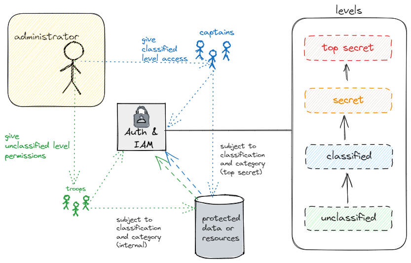
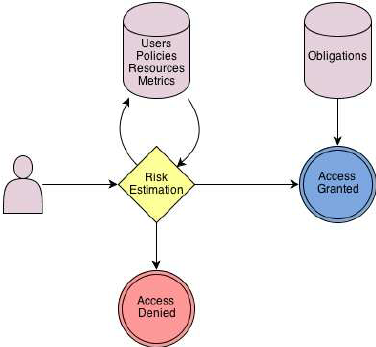
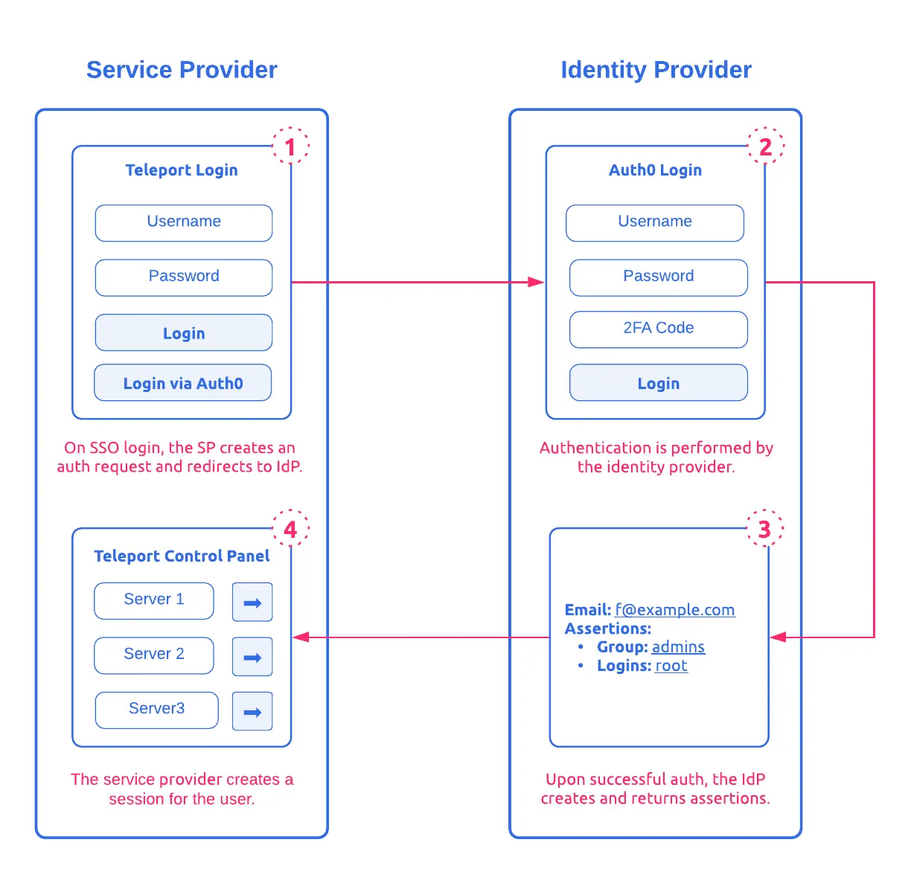
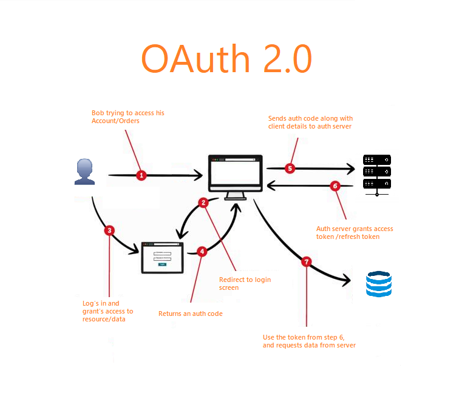
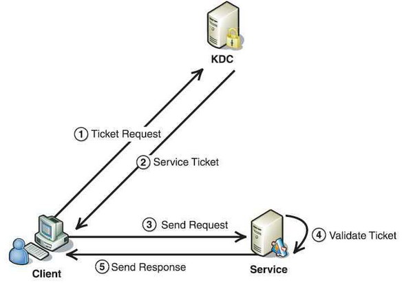
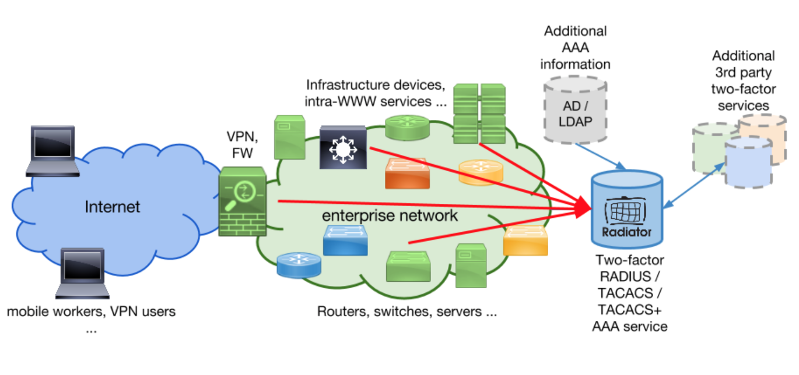

# Domain 5 - Identity and Access Management (IAM)

## 5.1 - Control physical and logical access to assets

* **Physical Controls**
  * are one you can touch, like perimeter security (fences, gates, turnstiles, etc) and environmental controls, such as heating/ac (HVAC) systems, fire suppression
  * protect systems, devices, facilities by controlling access and controlling the environment
  * examples 
    * Server Room
      * may have a cipher lock controlling entry
    * Desktop computers
      * lock screen protection and physical lock to desk
    * Server Racks
      * Physical protections (locks on server racks, etc)
* **Logical Controls**
  * technical controls used to protect access to information, systems, devices, applications
  * include authentication, authorization, permissions
  * Permissionshelp ensure only authenticated and authorized entities can access the system/data
* **CIA Triad**
  * aka AIC Triad, Security Triad
  * **_Confidentiality_**: 
    * access controls help ensure only authorized subjects can access objects
    * if unauthorized entities access data / systems, it results in a loss of confidentiality (disclosure)
  * **_Integrity_**:
    * ensures data or system configs are not modified without authorization
    * if unauthorized changes occur, security controls detect the changes
    * if unwanted/unauthorized changes occur, results in loss of integrity
  * **_Availability_**
    * authorized requests for objects must be granted to subject within reasonable amount of time
    * systems and data should be available to users who are authorized to access them
    * if systems are not operational or data cannot be access, results in a loss of availability
* **Subject**
  * active entity that accesses a passive object to receive information from, or data about, an object
  * can be users, programs, processes, services, or anything else that can access a resource
  * authorized subjects can modify objects
* **Object**
  * resource a subject is trying to access (passive)
  * contains data
  * files, databases, programs, processes, services, printers, and storage media

* Information
  * data stored in servers, in databases, paper records in file cabinets
  * logical access controls attempt to prevent unauthorized access
* Systems
  * any IT system that provides one or more services
  * file server that stores user files or a web server that hosts a e-commerce application that connects to a database server
  * Permissions assigned to users and system accounts control system access
* Devices
  * can be any internal or external device
  * internal can be IT servers, network devices (routers, switch, etc), storage devices (SAN, NAS, et), desktop/latop/mobile devices
  * external can be printers even employee own devices that are allowed to connected to the internal network
* Facilities
  * Physical location that is owned or rented by the organization
  * Physical control help protect
* Applications
  * provide access to organization data
  * controlling access to applications provides a layer of protection
  * permissions assigned to users/groups
* Services
  * printing capabilities, network capacity, end-user support,
  * access control systems ensure that only authorized users gain access to these services

## 5.2 - Design identification and authentication strategy (e.g., people, devices, and services)

### The AAA Model (e.g., multi-factor authentication (MFA), password-less authentication)

* Identification
  * Making a claim/assertion of identity
  * Providing a unique username or user id
  * Also providing biometrics
  * starts the _Authentication Process_
  * Issue:
    * Could be a false claim
* Core functions of identity and access management call the "Triple-A" model of access control
  * **_Authentication_**
    * aka AuthN
    * subjects (users, system, etc) making a claim/assertion of identity
    * comparing one or more factors against a database of valid identities (user accounts, etc)
    * Occurs together with _Identification_ as a single two-step process
    * "all-or-nothing" part of access control
  * **_Authorization_**
    * Ensures that an action is allowed by the subject
    * Access control list that provides permissions on what a person can/can't do
    * Example administrators grant users to access files based on the user's proven Identity
    * Example if a user attempts to open a file, AuthZ mechanim checks to ensure that the user has at least read access
  * **_Accounting_**
    * Audit logs that show the activities of a user
    * Example an audit log is record any time a user reads, access, or modifies a file
    * provide nonrepudiation and verification of user compliance with policies

#### Registration, proofing, and establishment of identity

* Acceptable document for proving of identity 
  * Driver's license, Passport, birth certificate
* documents are vetted (example HR) for legitimacy in order to establish true identity and begin registration
  * can be as simple as setting a password or more complex (biometrics, etc)
* online registration can use knowledge-based authentication (KBA) for identity proofing new users/customers (opening a bank account online)
  * Few examples:
    > * Which of the following vehicles have you recently purchased?
    > * How much is your car payment?
    > * How much is your mortgage (or rental) payment?
  * organization queries independent and authoritative sources (credit bureaus, gov agenices, etc) before creating the questions with a limited amount of answers
* Use of _cognitive password_ (aka security questions) when a user is trying to change a password or trying to authenticate to the system
  * Authentication system collects these answers during registration
  * prone to being subject to social engineering attacks as the answers are typically found online
  * The answers for the following example questions can be inferred by doing a little digging on social media
    * What is your favorite sport?
    * What is the name of your first pet?
  * [NIST SP 800-63B - Digital Identity Guidelines: Authentication and Life Cycle Management](https://nvlpubs.nist.gov/nistpubs/specialpublications/nist.sp.800-63b.pdf)
    * discourages using these static questions

#### Authentication Factors

* Three primary factors
  * **_Something Your Know_**
    * Type 1 Auth Factor (old reference documents)
    * passwords, secrets, PIN, passphrase
    * weakest
    * **Password** 
      * is the most common form
      * typically static and stays the same for a length of time (60 days)
      * weakest form due to the following:
        * Users often choose passwords that are easy to remember (easier to crack)
        * Randomly generated passwords are hard to remember (using writes them down, sticky notes)
        * Users often share or forget them
        * Attackers detect passwords through various means, including observation, sniffing networks, password stealers, keyloggers, stealing databases
        * Passwords are sometimes transmitted in cleartext or with easily broken encryption protocols
        * Password databases are sometimes store in publicly accessible online locations
        * Passwords are subject to many types of attacks including brute-force guessing, dictionary attacks, password spraying, credential stuffing, etc
      * can be strengthened using a **_passphrase_** ex: `IEarnedMyCISSPCertification`
        * easy to remember and encourages users to create longer passwords
        * ensures users don't user common passwords such as `password` or `123456`
    * **Personal Identification Number (PIN)**
      * typically 4 to 6, or even 8 digits
    * **Common Password Policy Components**
      * **_Maximum Age_**
        * periodically change passwords after a time period (typical is 45 days)
        * password expiration
      * **_Password Complexity_**
        * how many characters types it includes
        * lowercase, uppercase, numbers, special characters
        * complex passwords use three to four types
      * **_Password Length_**
        * number of characters in passwords (ex atleast 8 characters long)
        * shorter passwords are easier to crack
      * **_Minimum Age_**
        * prevents users from changing their password again until a certain time has passed (ex 1-2 days)
      * **_Password History_**
        * remembers a certain number of previously used passwords and prevents users from reusing them
        * typically combined with min age of one or more days, prevents frequent password changes in one sitting
    * **Authoritative Password Recommendations**
      * **_NIST Password Recommendations_**
        * Highlighted and defined in [NIST SP 800-63b](https://nvlpubs.nist.gov/nistpubs/specialpublications/nist.sp.800-63b.pdf)
        * Recommendations:
          * **Passwords Must Be Hashed**
            * never stored or transmitted in cleartext
          * **Passwords should not expire**
            * users should not be forced to change their passwords regularly
            * should only be forced to change IF there is evidence of a compromise of their current password
          * **Users should not be required to user special characters**
            * using special characters often challenges users' memory and the need to write the password down
            * special characters dont always provide the desired benefit
          * **Users should be able to copy and pasted passwords**
            * Use of password managers to store complex passwords and allows them to be copy and pasted
            * restricting this, the user has to type the password in and could be difficult to remeber
          * **Users should be able to use all characters**
            * commonly rejected spaces and some special characters
            * by including spaces this allows for the creation of longer and complex passwords
            * some systems reject special characters to prevent attacks (SQL Injection), using proper hashing can eliminate this
          * **Password Length should be atleast eight characters and as many as 64 characters**
            * long password is harder to crack
            * using passphrases that are meaningful to them
          * **Password systems should screen passwords**
            * systems should check / validate against a list of common passwords (123456, password)
      * **PCI DSS Password Requirements**
        * Defined in [Version 4.1 of PCI DSS](https://docs-prv.pcisecuritystandards.org/PCI%20DSS/Standard/PCI-DSS-v4_0_1.pdf)
        * Differs from NIST
        * Recommendations:
          * Passwords expire at least every 90 days
          * Password must be at least 12 characters long
          * Passwords must contain both numeric and alphabetic characters (alphanumeric)
          * Passwords may not be the same as any of the user's previous four passwords
  * **_Something You Have_**
    * Type 2 Auth Factor
    * physical objects in your possession that helps with auth (smartcard, hardware token, authentication application, USB)
    * **_Smartcards_**
      * credit-card sized ID or badge with an integrated chip embedded
      * contains info about the authD user that is used to identify them and/or for auth purposes
      * most include a microprocessor and one or more certificates (used for asymmetric encryption, digital signing emails, etc)
      * typically tamper-resistent
      * easy to carry and use complex encryption keys
    * **_Authenticators_**
      * aka _device authenticator_, _token_
      * device or application used to generate auth secrets
      * common ones include 6 - 8 digit _one-time password (OTP)_
      * an authentication server stores the details of the authenticator so at any moment the server knows what number is displayed on the user's device/authenticator
      * are typically combined with another authentication mechanism (ex, username/password & OTP)
      * Two different techniques:
        * **Time-Based One-Time Passwords (TOTPs)**
          * TOTPs are generated by devices and applications that are synchronized  with an auth server
          * generate a new OTP periodically (ie every 60 seconds)
          * requires the authenticator and server to have accurate and synced clocks
          * aka synchronous authenticators
        * **Hash-Based On-Time Passwords (HOTP)**
          * aka _HMAC-based OTP_
          * do not use a clock
          * hardware authenticator generates OTPs based on an algorithm and an incrementation counter
          * use clicks a button, causing the authenticator to create a dynamic otp that stays the same until its used for authentication
          * asynchronous authenticators
          * provide strong auth but have their failings
            * battery dies or devices brakes/lost, the user wont be able to gain access to services requiring their use
  * **_Something Your Are_**
    * Type 3 Auth Factor
    * physical characteristics of a person
    * biometrics based (fingerprints, retna, palm scans, etc)
    * strongest, but can still be bypassed (counterfeit or duplicate fingerprint on a gummy bear candy and fools a fingerprint reader)
    * **_Biometric Factors_**
      * used as an identification and auth technique
      * does not provide authorization or accountability
      * requires a search of the offered biometric and a one-to-one pattern match against a stored database of enrolled and authorized patterns
      * Types:
        * **Fingerprints**
          * visible prints on fingers/thumbs, unique to each person
          * used for decades in physical security identification
          * have loops, whorls, ridges, and bifurcations (called minutiae) which fingerprint readers match the _minutiae_ to data in a database
          * fingerprint readers are common on laptops, keyboards, mice, security keys, and USB flash drives to identify / authenticate users
          * usually takes less than a minute to capture a user's fingerprint during registration
        * **Face Scans**
          * use the geometric patterns of faces for identification/detection/recognition
          * included in many smartphones, tablets, and computer OS to support facial recognition to unlock devices
          * used in Casino's to identify cheaters, Law Enforcement to catch criminals at boarders/airports
          * also used to identify and authenticate people before allowing them to access secure spaces such as a secure vault
        * **Retina Scans**
          * focuses on the pattern of blood vessels at the back of the eye
          * are the most accurate form of biometric auth
          * can defferentiate between identical twins
          * privacy concerns and objects for it use as it can reveal medical conditions, such as high blood pressure and pregnancy
          * typically require users to be as close as three inches from the scanner
        * **Iris Scans**
          * like Retina scans but focuses on the colored area around the pupil
          * second most accurate (next to retina)
          * users consider it less intrusive than retina because scans can occur from distances of 20 to 40 feet 
          * scanners may be fooled with a high-quality image in place of a person's eye
          * accuracies may be affected by changes in lighting and the usage of glasses/contact lenses
        * **Palm Scans**
          * focuses on scanning the palm of the hand of ID
          * uses near-infrared light to measure vein patterns in the palm (unique like fingerprints)
          * users place their palm on the reader for a few seconds during registration process
          * to authenticate they just place their hand over the reader for ID
        * **Voice Pattern Recognition**
          * relies on the characteristics of a person's speaking voice/tone (voiceprint)
          * the user speaks a specific phrase which is recorded by the auth system, to authenticate the user repeats the same phrase and its compared to the original
          * sometimes used as an additional mechanism but is rarely used by itself
      * Biometric Factor Error Ratings:
        * **False Rejection Rate (FRR)**
          * occurs when an auth system does not authenticate a valid user
          * aka false negative
          * ratio of false rejections to valid authentications
          * typically the device is too sensitive
        * **False Acceptance Rate (FAR)**
          * occurs when an auth system authenticates someone incorrectly
          * aka false positive / false acceptance / Type II error
          * ratio of false positives to value authentication
          * typically the device is not sensitive enough
        * **Crossover Error Rate (CER)**
          * comparison of the overall quality of the biometric system
          * aka Equal Error Rate (ERR)
          * the point where the FRR and the FAR percentages are equal
          * used as a standard assessment value to compare accuracy of difference biometric devices/systems
          * devices with lower CERs are more accurate
          * may be desirable to have devices set to a high sensitive so there is little chance of false positives (false acceptance)
      * Biometric Registration:
        * **Reference Profile**
          * aka _reference template_
          * stored sample of the biometric factor for the user created during enrollment and stored on the device's database
          * In general enrollment over 2 mins in unacceptable
          * using biometrics that change overtime (facial, voice, etc) the user would need to change frequently which is inconvenient
        * **Throughput Rate**
          * amount of time the system requires to scan a subject and approve/deny access
          * more complex or detailed a biometric characteristic the longer it takes to process
          * acceptable length is ~ 6 seconds or faster
* Progressively stronger when implemented correctly
* Additional Attribute-based factors:
  * **_Somewhere You Are_**
    * identifies a subject's location based on a specific computer/device, geolocation identified by an IP address, or phone number (Caller ID)
    * Controlling access by physical location forces a subject to be present somewhere
    * sometimes used for identifying suspicious activity
      * IP for a device that is usually based in Virginia, system detects the same account trying to access the system from somewhere in India it will block access (even if the username / password is correct)
      * still not 100% reliable as this can be bypassed using VPNs which changes the IP
  * **_Context-Aware Authentication_**
    * Mobile Device Management (MDM) systems leverage this to identify device users
    * identify multiple attributes such as the user's location, the time of day, and the mobile device
    * if user meets all requirements, they are granted access or authentication using other methods (i.e., username / password)
    * Zero-Trust
* **Single-factor Authentication**
  * uses one of the factors
* **Two-Factor Authentication (2FA)**
  * requires two of the factors to prove identification/authentication
  * NIST SP 800-63B Deprecated SMS for 2FA (Fed Agencies)
    * pointed out several vulnerabilities using SMS
    * OTP sent via SMS to could be seen on lock screen and therefore stolen by attackers who took the phones
* **Multifactor Authentication (MFA)**
  * uses two or more auth factors
* General Rule:
  * Additional and different factors result in more secure authentication
  * if two of the same factors are used together, the authentication strength is no greater than if there was only a single factor used

#### Passwordless Authentication

* allows users to log into systems without entering a password (or memorized secret)
* smartphones leverage biometrics (fingerprint, facial rec, etc)
* once passed the login screen, applications allow similar auth (iphone, android, etc)
* [**_Fast Identity Online (FIDO) Alliance_**](https://fidoalliance.org/)
  * open industry association
  * mission is to reduce the over-reliance on passwords
  * created recommended frameworks and protocol standards for passwordless auth
    * revolve around the use of hardware passkeys (YubiKey, etc)

#### Device Authentication

* Historically devices (ie Windows PC) need to be joined to a domain in order to allow users to authenticate
* BYOD changes this
* device fingerprinting
  * details of the device is register with the organization
  * when the user logs in its device is validated to make sure the details match
* MDM systems use context-aware authentication methods to identify devices
  * typically in NAC environments
* 802.1X is another method for device auth
  * if the device cannot authenticate to the 802.1X system then they are denied access

#### Service Authentication

* Service Account is simply a user account that an administrator created for a service or application
* commonly used for third-party tools monitoring email in Exchange server
  * typically need permissions to scan all mailboxes for spam
* some applications have built in service accounts
  * ex: MS SQL Server has a built-in account known as the sa (short for system administrator) account
  * it is a member of the sysadmin fixed server role and has unlimited permission on the SQL instance
  * its only enabled if the instance is configured for SQL Server Authentication
  * older version the default password was blank
* common to set the properties of the account so the password never expires
* due to high level of admin privileged, these tend to have strong and complex passwords and changed more frequently than regular users
* account access reviews can detect security issues with service accounts
* configure it to be noninteractive which prevents a user from logging onto the account using traditional logon methods
* services can be configured to use certificate-based auth
  * certificates are issued to the device running the service and presented by the service when access resources
  * aka Mutual Auth

#### Mutual Authentication

* commonly use digital certificates
* VPN connections use this cleint and server share digital certificates as part of the auth/initiation process

### Identity Management (IdM)

* IdM techniques:
  * **_Centralized Access Control_**
    * single entity within a system performs and manages authorization verification
    * lower admin overhead
    * can be managed by a small IT team
    * single point of failure
    * can be scaled up to support more users
      * MS AD can start with a single domain controller, more can be added on as the company grows and to handle more traffic
    * Types:
      * **Single sign-on (SSO)**
        * allows for subjects to be authenticated once on a system and access multiple resources without having to re-authenticate
        * convenient for users 
        * security benefits by reducing the number of accounts required for a subject
        * disadvantage is once a user account is compromise and attacker can gain unrestricted access to all the authorized resources
        * Common SSO mechanisms
          * **Lightweight Directory Access Protocol (LDP)**
            * directory service and centralized database that includes information about subjects and objects, including auth data
            * MS Active Directory Domain Services (AD DS) is built on LDAP
            * telephone directory for network services and assets
            * Users, clients, services/processes can search the directory service to find where a desired system or resource resides
            * subject MUST authenticate to the directory prior to performing queries and lookup activities
              * after authentication the directory will only reveal certain information to a subject, based on its assigned privileges
            * multiple domains and trusts are commonly used in access control systems
              * **_Security Domain_**
                * collection of subjects and objects that share a common security policy, and individual domains can operate separately from other domains
              * **_Trusts_**
                * established between the domains to create a _security bridge_ and allow users from one domain to access another domain's resources
                * can be one- or two-way
            * LDAP is used in PKI infrastructure when integrating digital certificates into transmissions
              * client query a CA for information on a cert
  * **_Decentralized Access Control_**
    * aka _distributed access control_
    * various entities located throughout a system perform / manage authorization verification
    * more overhead
    * requires multiple teams to manage
    * maintaining consistency is difficult (distributed arch) , multiple access points increases
    * change management nightmare

#### Federated Identity Management (FIM)

* FIM is used by cloud-based applications as a form of SSO
* links a user's identity in one system with multiple IdM systems
* extends beyond a single org, multiple org can join a federation or group (agreeing on sharing Id Information)
* users in each org can log on once in their own org, their creds are matched with a federated identity
  * user can use the federated Id to access resources in any other org within the federation
* can be composed of multiple networks within a single university campus, numerous college/uni campuses, multiple orgs sharing resources, or any other group that agree to share a common federated identity management system
* members of the federation match user Ids within an organization to federated Ids
* membership in a federation doesnt auto grant everyone access to all resources, each org decides what to share
* admin managed the resources and access to the resource they want to share
* challenge is finding a common language, as each org may use different OS or have different infrastructure requirements
  * Common Methods
    * **Security Association Markup Language (SAML)**
    * **OAuth**
    * **OpenID Connect (OIDC)**

#### Just-In-Time (JIT)

* JIT provisioning supported by federated identity solutions (some)
* solutions automatically create the relationship between two entities so that the new user can access resources
* no need for admin intervention
* employees log on normally to their employer's network, first time access as resource (backed by federation), the JIT system exchanges data with the employer's network and creates teh user account
* Commonly used SAML to exchange required data

The following diagram illustrates the JIT provisioning workflow

###  Credential Management Systems

* provide storage for usernames/passwords
* web browsers have this capability built in
* [**_Credential Management Level 1 API_**](https://www.w3.org/TR/credential-management-1/)
  * publish in January of 2019 by the [World Wide Web Consortium (W3C)](https://www.w3.org/)
  * adopted by many browsers
  * API provides several benefits that developers can implement
    * Offering to store user's credentials after logging on
    * Showing a credential chooser, allowing the user to skip sign-in forms
    * Automatically logging the user on in subsequent visits, unless the user signed-out
* **_Identity-as-a-Service (IDaaS)_**
  * 3rd-party service that provides identity and access management (IAM)
  * effectively provides SSO for the cloud and is especially useful when internal clients access cloud-based SaaS apps
  * Google's motto "One Google Account for everything Google"
    * User's log into their Google account once, it provides them with access to all Google cloud-based applications (Gmail, Docs, sheets, GCP,etc)
  * Microsoft offers similar motto for Office (M365) (SaaS or Desktop)
* **_Credential Manager Apps_**
  * Windows includes the _Credential Manager_ applet in Control Panel
    * used by browsers or windows apps to save credentials
    * encrypts and stores them
    * apps retrieve the stored credentials
  * **_Password Vaults_**
    * 3rd-party credential management solutions
    * Example 
      * **KeyPass**
        * Free tool
        * allows you to store you credentials in an encrypted database
        * users unlock the database using a master password
        * once unlocked users can easily copy their passwords to paste into site or login screens
        * allows for apps auto enter the creds in the the sites login form
    * important to use a strong master password
* **_Scripted Access_**
  * aka logon scripts
  * used to establish communication links by providing an automated process to transmit login credentials at the start of a login session
  * often simulate SSO
  * should be stored in a secure/protected area (contain access creds in cleartext)
  
### Session Management

* Methods to prevent unauthorized access
* **_Auto Lock/Screen Saver_**
  * time frame in minutes (configurable commonly set between 10 - 20 mins)
  * will activate immediately after the time frame (i.e, trigger after 10 mins ellapses)
  * forces user to re-auth
* **_Secure online sessions_**
  * typically terminate after a period of time (interacting with online back, session is terminated after idle 10 mins)
  * forces user to re-auth
  * may receive a notification prior to auto-signoff, user can click to extend session or terminate
  * if these guardrails are implemented, the user's session may remain open (even if they close the browser) leaving them open to attack
  * [OWASP Session Management Cheat Sheet](https://cheatsheetseries.owasp.org/cheatsheets/Session_Management_Cheat_Sheet.html)
    * provides info and best practices for web based session management
  * Session Management Dev Frameworks
    * create session identifiers at the beginning
    * identifiers are included in every HTTP request throughout the session
    * possible to force TLS to ensure the entire session (include the identifier) is encrypted
    * include methods to expire sessions
    * timeout can be configure (by devs) but high-value apps (banking, etc) typically have a range of 2-5 mins, low value apps have 15-30 mins

* Groups and Roles

## 5.3 - Federated identity with a third-party service

* Federation Types:
  * **Cloud-Based Federation**
    * uses a third-party service to share federated Identities
    * Example: Log In with Google, Facebook, LinkedIn
    * Example: Org coordinates with online training company for employee access, they also coordinate the federated access details
    * Common method:
      * match the User's internal Login ID with a federated identity
      * when the user logs on within the org using their normal login ID, when they access the training website with a web browser, the federated identity manage system uses their login ID to retreive the matching federated ID (if matched granted, otherwise denied)
  * **On-Premise Federation**
    * can hosted in the cloud, on-prem, or a combo
    * federation between two organizations
    * merged entities that want to managed their own networks and SSO but want to share resources
  * **Hybrid Federation**
    * combo of cloud-base and on-prem federation
    * used when sharing federated identities between cloud and on-prem

## 5.4 - Implement and manage authorization mechanisms

### Access Control Concepts

* **Permissions**
  * access granted for an object and determine what you can do with it
  * read, write, delete and/or execute
* **Rights**
  * refers to the ability to take an action on an object
* **Privileges**
  * combination or permissions and rights
  * administrators are granted elevated privileges on systems
* **Implicit Deny**
  * fundamental concept and used by most authorization mechanism
  * ensures access to an object is denied by default unless access has be granted explicitly to a subject
* **Access Control Matrix**
  * centralized list/database/table that includes the subjects, objects, and assigned permissions, rights, privileges
  * when a subject attempts an action on an object the system verifies they have permission to perform the action using this list
  * each item in the matrix would have its own single access control list (ACL)
* **Capabilities List**
  * a decentralized, distributed method of identifying permissions, rights, privileges assigned to subjects using tokens or keys
  * different from ACLs (focuses on individual objects and identifies access granted to subjects)
  * focuses on individual subjects (user/process) in regard to objects
    * i.e.; capability for a user would list the user and its various access permissions, rights, privileges to individual objects
* **Constrained Interface**
  * applications use a restricted (constrained) interface to limit / restrict what users can and cant do based on their privileges, permission, rights
  * items are either hidden or grayed out/disabled base on privileges
  * Clark-Wilson model covers this in detail on how to implement it, see [Domain 3 - Security Architecture](./Domain%203%20-%20Security%20Architecture%20and%20Engineering.md)
* **Content-Dependant Control**
  * restrict access based on the content within the object
  * database view (gcp authorized view)
  * user granted access to the view can see data only within the view and not the underlying tables
* **Context-Dependant Control**
  * requires specific activity to occur prior to gaining access
  * may be geolocation based restrictions
  * time-based access (only within a period of time)
* **Need To Know**
  * ensures that subjects are granted access only to what they require access to in order to perform their assigned tasks
  * can be based on classification of data
* **Least Privilege**
  * ensures subjects are grant only the privileges they need to perform this assigned job functions
  * hand in hand with _Need To Know_
* **Separation of Duties and Responsibilities**
  * ensures sensitive functions are split into tasks performed by two or more employees
  * helps prevent fraud and errors 
  * checks and balances

### Access Control Models

* **Discretionary access control (DAC)**
  * Flexibility approach
  * File based approach
  * File owners determine access permissions
    * owner, creator, or data custodian
  * Most common that orgs use this
  * Each entry is the _discretionary access control list (DACL)_ is known as an _access control entry (ACE)_
  * **_New Technology File System (NTFS)_**
    * Microsoft tech
    * uses DAC model
* **_Nondiscretionary Access Control_**
  * access is managed by admins and centrally controlled
  * changes affected the entire environment
  * focuses on rules governing the whole environment
  * less flexible
  * easier to audit
  * any model that is not _discretionary_ fall under this term
* **Role-based Access Control (RBAC)**
  * Grants permissions to job specific roles (groups)
  * Users are grant access to those “roles/groups”
  * Permission is applied to the role, users in that role will get the new permission
  * referred to _restrictions_ or _filters_
  * helps enforce and prevent _privilege creep_
  * typically follows organization hierarchy
    * managers and leadership get greater / higher privileges
  * **_Task-Based Access Control (TBAC)_**
    * related to RBAC
    * each user is assigned an array of tasks
    * focus is controlling access based on tasks instead of job role or user identity
    * Microsoft Project uses TBAC
      * each project has multiple task that a project manager assignes to users
    * Jira is also an example
* **Rule-Based Access Control**
  * uses a set of rules, restrictions, filters, or conditions to determine what can and cannot occur on a system
  * includes granting subject access to an object, or granting the subject the ability to perform an action
  * have global rules that apply to all subjects
  * firewall is an example
    * includes rules/filters with an ACL, defined by the admin
    * only allows traffic that match the allow rules
    * includes a final rule (implict deny) which denies or blocks all other traffic
    * may be viewable or hidden (but active)
* **Attribute-Based Access Control (ABAC)**
  * advanced implementation of _rule-based access control_
  * uses policies that include one or more attributes/characteristics for rules
    * can be based on network, devices, user location, group membership, etc
  * flexible and much more specific
  * applies the rules to all subjects equally
  * SDNs use ABAC model
  * typically created in plain language statements such as _"Allow Managers to access WAN using tablets or smartphones."_
  * MDM systems typically use this type access control
* **Mandatory access control (MAC)**
  * Most stringent
  * Permissions are determined the by the system
  * Grants access based on labels such as _confidential or secret_, according to organization policy.
    * each label is referred to as a _security domain_, _realm of security_
  * Rarely used except for Highly secure environments
  * Rule based on users and resources having labels, os determines the access by comparing labels
  * Each individual is known as the _subject_
  * Referred to as the _lattice model_
  * Governments use labels based on law, private sector organizations are free to use whatever labels they choose
  * prohibitive rather than permissive, uses implicit deny philosophy
  * used compartmentalization to ensure need to know principle
  * Classification:
    * **_Hierarchical Environment_**
      * relates various classification labels in an ordered structured from low to medium to high security, such as _Confidential_, _Secret_, and _Top Secret_
      * each level or classification level in the structure is related
      * Clearance in one level grants the subject access to all objects in higher levels
        * Exm someone with Top Secret clearance has access to Top Secret and Secret Data
    * **_Compartmentalized Environment_**
      * no relationship between one security domain and anther
      * each domain represents a separate isolated compartment
      * to gain access to an object, the subject must have specific clearance for the object's security domain
    * **_Hybrid Environment_**
      * combines both _hierarchical_ and _compartmentalized_ concepts
      * each hierarchical level may contain many subdivisions that are isolated from the rest of the security domain
      * a subject must have the correct clearance and the need to know data within a specific compartment to gain access to the isolated object
      * provides granular control over access but becomes harder to manage as it grows
  The following diagram illustrates the flow for how MAC Access works
  
* **Risk-Based Access Control**
  * relatively new concept
  * complex implementation
  * may use binary to control access 
    * user logged in using MFA or they didnt
  * more complex options may use ML capabilities to determine access grants (more predictive)
  * model attempts to evaluate risk by considering several different elements:
    * **_The environment_**
      * place or setting
      * Examples ER or pharmacy
    * **_The situation_**
      * purpose for access
      * Examples:
        * seeing patient data in the ER
        * dispensing drugs at a pharmacy
    * **_Security policies_**
      * software code that makes risk-based decisions based on available data
      * can be modified to meet company requirements
      * Examples:
        * Doctors, nurse attempting to access patient data in the ER
          * Security Risk Model would deem this low risk and grant access to the patient data
        * Pharmacy personnel accessing patient data for dispensing medication
          * Security Risk Model would deem this medium or low risk and would grant access partial patient data to identify any potential adverse drug interactions but not the full patient medical history
      * May required MFA and/or use of compliant mobile device before granting access
  The following diagram illustrates how _risk-based access control_ works
  

### Zero-Trust Access Policy Enforcement

* traditional networks use the "moat and castle" or defense-in-depth approach
* more modern approach is the "zero trust" approach which presumes that their is not trust boundary and no network edge
* each activity is validated when requested as part of a continuous authentication process
  * access is only granted/allowed after its policies are checked, including elements like identity, permissions, system configurations, security status, threat intelligence data review, and security posture

The following diagram illustrates NIST's interpretation of Zero Trust ([NIST SP 800-207](https://nvlpubs.nist.gov/nistpubs/SpecialPublications/NIST.SP.800-207.pdf))

#### ZTA Key Components

* **Subjects**
  * users, devices, or systems that request access or attempt to use rights
* **Policy Engine**
  * system that makes decisions based on both rules and external systems like
    * threat intelligence feeds
    * IAM Systems
    * MDM Systems
    * SIEM devices
  * use a trust algorithm that makes the decision to grant, deny, or revoke access to a given resource based on the factors used for input into the algo
  * once a decision is made, its logged and the policy administrator takes action based on the decision
* **Policy Administration**
  * not individuals, but process/components that establish or remove the communication path between subjects and resource
    * includes creating session-specific auth tokens/credentials as needed
  * if authN/authZ is denied, it will tell the _policy enforcement point_ to end the session or connection
* **Policy Decision Point**
  * the union of the _policy engine_ and _policy administrator_ acting as one
* **Policy Enforcement Point(s)**
  * commuicate with policy admins to forward requests from subjects and to receive instructions from them about connections to allow or end
  * typically deployed with a local client or application and a gateway element that is part of the network path to services/resources

## 5.5 - Manage the identity and access provisioning lifecycle

* **Identity and access provisioning lifecycle**
  * refers to the creation, management, review/audit, and deletion of accounts
  * Process
    * **_Provisioning and Onboarding_**
      * typically done during the hiring process
      * includes the creation of the user account / provisioning it with job specific privileges
      * process must be secured/protected as per the orgs Security Policy procedures
      * user account's should not be created at the Admin's whim or in response to random request
      * **_enrollment_**
        * initial creation of the new user account
        * username / identifier is provided but other information may be provided depending on the orgs established processes
          * i.e, full name, email address, etc
        * biometrics may be collected and involved at this step also
        * employee must prove their identity
          * Photo ID, driver's license, passport, etc
          * background checks, security clearance verification, FBI database search, etc
      * process can be automated
      * user may be added to a specific group for permissions
      * also includes issues hardware
      * other items that are part of this process:
        * User reads/signs the Acceptable Use Policy (AUP)
        * User is explained the security best practices
        * Ensure the user's equipment (computer, etc) is operational and working and they can log on
        * Assist user in configuring a password manager, if available
        * Assist user in configure 2FA
        * Explain how to access help desk personnel for further assistance
        * Show employee how to access, share, and save resources
    * **_Deprovisioning/Offboarding_**
      * implemented when an employee leaves or transfers or is terminated
      * **_account revocation_**
        * account is deleted
        * all access is removed
        * may also remove all user's data (encrypted data , encrypted key is deleted, all data is lost)
        * best is to disable the account and determine if anything is needed before deleting
        * admins can change the user's password and their supervisor the new password
        * orgs typically have policies in place to delete these accounts after 30 days
      * high risk of sabotage if the user retains access after an exit interview
      * other employees may try to discover the password and use it, logs will be registered on the terminated user and not the actual perpetrator
      * includes collecting hardware and other equipment from the user
      * terminate the employees benefits also
        * HR at the university of Wisconsin failed to terminate health insurance premiums for 924 ex-employees, causing them to pay $8 Million before doing an audit that discovered this issues
    * **_Role Definition and Transition_**
      * people assigned to new roles
      * define the new role and permissions required for this new role
      * review / audit existing permissions and make necessary changes based on the new role (Account Management)
    * **_Account Access Review_**
      * Account Management workflow
      * Administrators periodically audit/review accounts to ensure they don't have excessive privileges
      * Account Review also checks to ensure accounts comply with security policies
        * includes user accounts, privileged accounts, system accounts, and service accounts
        * **Local System Accounts**
          * account that run on computers and typically have the same privileges as the local admin
          * allows the computer to access other computers on the network as the computer, instead of as a user
          * maybe used as an application's service account (grants the application more permissions than needed and possibly open to attacks)
      * Admins use scripts to periodically check for inactive accounts (ex,: no activity in 30 days) and automatically disable them
        * same approach for group memberships of privileged groups (admin groups) and remove unathorized accounts
      * Privilege monitoring audits accounts that have elevate permissions, includes
        * accounts with admin privileges (admin accounts, root accounts, service accounts, etc)
      * important to guard against two problems related to access control (violates principle of least privilege):
        * **_Excessive Privilege_**
          * occurs when users have more privileges than necessary (work/job)
          * admins should revoke unnecessary privileges/permissions
        * **_Privilege Creep_**
          * involves a user account accumulating additional permissions/privileges over time
          * typically occurs as job roles and assigned tasks change
        

* Privilege escalation (e.g., use of sudo, auditing its use)
* Service accounts management

## 5.6 - Implement authentication systems

### Implementing SSO on the Internet

* [**Extensible Markup Language (XML)**](https://en.wikipedia.org/wiki/XML)
  * open standard used to describe data
  * can include tags to describe data as anything desired
    * Example: `<ExamResults>Passed</ExamResults>`
  * common language to exchange data
  * many schemas exists and if companies agree on one they can easily share information
  * many cloud-based provides use XML-based languages to share information for authentication and authorization
    * They don't use standard XML but variants based on it
* [**Security Assertion Markup Language (SAML)**](https://en.wikipedia.org/wiki/Security_Assertion_Markup_Language)
  * open XML-based standard commonly used to exchange authN/authZ (AA) information between federated entities
  * provides SSO capabilities for browser access
  * [**_Organization for the Advancement of Structured Information Standards (OASIS)_**](https://www.oasis-open.org/)
    * a nonprofit consortium that encourages open standards development
    * adopted SAML 2.0 in 2005 as a standard (and maintained it since)
    * [SAML 2.0](https://en.wikipedia.org/wiki/SAML_2.0) is a convergence of SAML 1.1, the [Liberty Alliance Identity Federation Framework (ID-FF) 1.2](https://en.wikipedia.org/wiki/Liberty_Alliance), and [Internet2's Shibboleth 1.3](https://en.wikipedia.org/wiki/Shibboleth_(software)#Shibboleth_1.3)
  * **_SAML 2.0_** specification utilizes three entities:
    * **Principal or User Agent**
      * user/entity trying to access the resource
      * exmaple : Sally is trying to access her bank account information at `bankofamerica.com`
    * **Service Provider (SP) or Relying Party**
      * entity providing the service
      * example: `bankofamerica.com`
    * **Identity Provider (IdP) or Asserting Party**
      * third-party that holds the user authentication and authorization information
      * responds to the SP with XML messages (_SAML Assertions_) validating or rejecting a user's credentials
      * if auth is successful the IdP provides session attributes and what the user can access back to the SP, which grants the user access to the resource
      * Statements that may be included in SAML Assertions
        * **Authentication Statements**
          * provides proof the user provided valid credentials, identifies the identification method, and identifies the time the user logged on
        * **Attribute Statements**
          * may contain any info about the user including their entitlements/claims
        * **Authorization Statements**
          * indicates whether the user is authorized to access the requested service
          * if denied, the reason is indicated
    * Cloud service provides include SAML in their solutions for easy of use for their customers
    * provides authentication, attribute, and authorization statements in its assertions
   The following diagram illustrates how the SAML flow works
   
* [**Open Authorization (OAuth)**](https://en.wikipedia.org/wiki/OAuth)
  * authorization framework, not an authorization protocol
  * exchanges API messages and uses a token to show that access is authorized
  * described in [RFC 6749](https://datatracker.ietf.org/doc/html/rfc6749)
  * maintain by the [Internet Engineering Task Force (IETF)](https://www.ietf.org/)
  * current version and most supported is OAuth 2.0 and is backwards compatible with OAuth 1.0
  * used to shared account information with third-party websites
  * Key Concepts:
    * **Resource Owner**: The user who owns the data or resource (e.g., your Facebook profile).
    * **Client**: The application requesting access to the resource (e.g., a third-party photo-sharing app).
    * **Resource Server**: The service that hosts the protected resources (e.g., Facebook's servers).
    * **Authorization Server**: The server that issues access tokens (e.g., Google's authorization server).
    * **Access Token:** A short-lived credential that allows the client to access specific resources on behalf of the resource owner.
  * Workflow:
    **_1. Authorization Request_**: - The client (app) directs the user to the authorization server, requesting access to specific resources.
    **_2. User Consent_**: - The user logs in to the authorization server (if not already) and grants or denies the request.
    **_3. Access Token Issuance_**: - If the user grants consent, the authorization server issues an access token to the client.
    **_4. Accessing Protected Resources_**: - The client uses the access token to access the requested resources on the resource server.
  The following diagram illustrates how the OAuth workflows works:
  
* [**OpenID Connect (OIDC)**](https://en.wikipedia.org/wiki/OpenID)
  * authentication layer using the OAuth 2.0 authorization framework
  * builds on the deprecated OpenID standard to use JSON Web Tokens
  * provides both authentication and authorization
  * maintained by the [OpenID Foundation](https://en.wikipedia.org/wiki/OpenID#OpenID_Foundation)
  * uses a [Javascript Object Notation (JSON) Web Token (JWT)](https://en.wikipedia.org/wiki/JSON_Web_Token) (ID Token)
  * uses a web service to retrieve the JWT
  * JWT provides authentication and also includes profile information about the user
  * Log in using Google account, Facebook Account, etc are all forms of OIDC
  * Key Concepts:
    * **Authentication vs. Authorization**:
      * OIDC focuses on authentication (verifying who someone is), while OAuth 2.0 is primarily for authorization (granting access to resources).
    * **ID Token**:
      * OIDC uses a security token called an ID token, which contains claims (pieces of information) about the authenticated user.
    * **OpenID Provider (OP)**:
      * service that handles user authentication and issues the ID token. Examples include Google, Facebook, or a dedicated identity provider like Auth0.
    * **Relying Party (RP)**:
      * application or website that relies on the OpenID Provider to authenticate users.
  * Workflow:
    **_1. User Initiates Login_**: - A user attempts to log in to a relying party application.
    **_2. Redirection to OP_**: - The application redirects the user to the OpenID Provider (e.g., Google).
    **_3. Authentication at OP_**: - The user logs in to the OpenID Provider (entering their username and password, or using another authentication method).
    **_4. ID Token Issuance_**: - If authentication is successful, the OP issues an ID token (and potentially other tokens like access and refresh tokens) to the relying party.
    **_5. User Information Verification_**: - The relying party verifies the ID token and retrieves user information (claims) from it.
    **_6. Access Granted_**: - Based on the verified user information, the relying party grants the user access to its resources.
  The following diagram illustrates how the OIDC flow works:
  

  ### Implementing SSO on Internet Networks

  * [**Kerberos**](https://en.wikipedia.org/wiki/Kerberos_(protocol))
    * a network authentication protocol that allows secure communication between trusted hosts over an insecure network, like the internet.
    * leveages a _Ticket authentication_ mechanism that employs a third-party entity to prove identification and provide authentication
    * aims to provide a secure way for clients and servers to authenticate each other, preventing unauthorized access to resources.
    * Key Components:
      * **Key Distribution Center (KDC)**:
        * The Kerberos server (third-party) that manages user authentication and ticket issuance.
        * uses symmetric-key cryptography to authenticate clients to servers
        * all clients/servers are registers with the KDC, which maintains secret keys for all network members
      * **Tickets**:
        * Cryptographic tokens that allow users to access specific services.
        * aka _Service Ticket (ST)_
        * subjects request tickets to access objects (files), if they are authN/authZ'ed to access the object, the KDC issues them a ticket
        * have specific lifetimes and usage parameters
        * once it expires a client must request a renewal or a new ticket
      * **Kerberos Authentication Service (KAS)**:
        * Part of the KDC responsible for initial user authentication.
        * verifies/rejects the authenticity and timeliness of tickets
        * often called the KDC
      * **Ticket Granting Service (TGS)**: 
        * Part of the KDC responsible for issuing service tickets.
      * **Ticket-Granting Ticket (TGT)**:
        * provides proof that a subject has authenticated through a KDC and is authorized to request tickets to access other objects
        * encrypted and includes a symmetric key, expiration time, and the user's IP address
        * presented by subjects when requesting tickets to access objects
      * **Kerberos Principal**:
        * typically a user but can be any entity that requests a ticket
      * **Kerberos Realm**:
        * a logical area (domain or network, etc) ruled/governed by Kerberos
        * principals within the realm can request tickets from the KDC, which issues tickets to principal in the realm
    * Requires a database of accounts
      * typically stored in a directory service such as Active Directory
    * Kerberos Login Workflow:
      (1). User types in their login creds (username/password) into the client
      (2). Client generates a request, including the plaintext username and domain of the user (not password), sends it the KAS
      (3). The KAS verifies the account against its database
      (4). The KDC generates a session key that the client and the Kerberos server will use. Its encrypted with a hash value of the user's password, the KDC also generates an encrypted timestamped TGT
      (5). The KDC transmits the encrypted session key and TGT to the client
      (6). Client installs the TGT for use until it expires and decrypts the session key using a hash of the user's password
    The following diagram illustrates the Kerberos Auth Process:
    

    * Client Access to Object Workflow:
      (1). Client send the TGT back to the KDC with a request for access to a resource
      (2). KDC verifies that the TGT is valid and checks its access control matrix to verify that the user has sufficient privileges to access the request resource
      (3). The TGS generates a service ticket and sends it to the client
      (4). Client sends the service ticket to the resource server
      (5). The resource server verifies the validity of the service ticket with the KDC
      (6). Once the id and authN are verified, the Kerberos activity is complete. The resource server opens a session with the client and begins communication or data transmission
    The following diagram illustrates the Kerberos Resource Request Process:
    
    * Kerberos Issues:
      * the KDC is a single point of failure
        * if the KDC becomes compromised, the secret key for every system and client is can be compromised
        * if the KDC goes offline, no auth can occur
      * has strict time requirements
        * default config requires all systems to time-sync within 5 mins of each other
        * if a sys is not in sync then the previously issued TGT will no longer be valid and the sys will no longer be able to recieve new tickets
        * Time-Synchronization is typically configured in the network
          * In AD the domain controller (DC) time sync
  * [**Remote Authentication Dial-In User Service (RADIUS)**](https://en.wikipedia.org/wiki/Radius)
    * centralized authN/authZ capabilities for remote connections
    * used when organizations has more than one network access server (remote server)
    * users can connect to any network access server, which passes on the user's credentials to the RADIUS server to verify authN/authZ and track accounting
    * Key Terms
      * Network Access Server: Is the RADIUS client
      * Authentication Server: Is the RADIUS server
    * ISPs use RADIUS for authentication
      * users access the ISP from anywhere
      * the ISP server forwards the user's connection request to the RADIUS server
    * Used for location-based security
      * Can be used to restrict access based on IP address and geolocation services
    * [**_Integrated Services Digital Network (ISDN)_**](https://en.wikipedia.org/wiki/ISDN)
      * a set of communication standards for transmitting voice, video, and data over digital lines, primarily through the public switched telephone network. It was designed to replace analog systems and allow for simultaneous transmission of various data types. While it was an early form of high-speed internet, it has largely been superseded by faster technologies like DSL and cable internet. 
      * dial-up lines that are used for VPNs
      * used by RADIUS as a callback security for extra layer of protection
      * users call in after authenticating to the RADIUS, which terminates the connection and initiates the callback on the user predefined phone number
      * useful if the user's creds have been compromised, this prevents an attacker from user them
    * Uses UDP by default
      * runs of Ports 1812 (authN/authZ messages) and 1813 (accounting messages)
      * only encrypts the password's exchange but not the entire session
    * Current versions is defined in [RFC 2865](https://datatracker.ietf.org/doc/html/rfc2865)
    * [RFC 6614](https://datatracker.ietf.org/doc/html/rfc6614) is Experimental and defines how RADIUS can be configured to you TLS over TCP
      * uses Port 2083
  * **Terminal Access Controller Access Control System Plus (TACACS+)**
    * developed by Cisco
    * became on open standard
    * provides improvements over RADIUS and earlier version of TACACS
    * separates authN, authZ, and accounting into separate process
      * can be hosted on different servers if desired
    * encrypts all auth info
    * uses TCP port 49
    * provides higher level of reliability for packet transmissions

The following image illustrates the similar workflows for RADIUS and TACACS+
