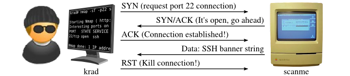

# Domain 6 - Security Assessment and Testing

## 6.1 - Design and validate assessment, test, and audit strategies

### Security Testing

* **_Security tests_**
  * verify that a control is function properly
  * include automated scans, tool-assisted pen tests, and manual attempts to undermined security
  * should take place on a regular schedule, with attention paid to each of the key security controls protecting the organization
  * considerations for scheduling sec reviews
    * Availability of security testing resources
    * Criticality of the systems and applications protected by sec controls
    * Sensitivity of information contained on tested systems and applications
    * Likelihood of a technical failure of the mechanism implementing the control
    * Likelihood of a misconfiguration of the control that would jeopardize security
    * Risk of change if the control configuration
    * Rate of change of the control configuration
    * Other changes in the technical environment that may affect the control performance
    * Difficulty and time required to perform a control test
    * Impact of the test on normal business operations

### Security Assessments

* sec assessments
  * comprehensive reviews of the security posture of a system, application, or other tested environment
  * meant for internal use only
  * eyeing to find potential improvements
* performed by trained security professionals that perform a risk assessment that identifies vulnerabilities in the tested environment that may allow a compromise and makes recommendations for remediation, as needed
* include
  * security testing tools but go beyond scanning and pen testing
  * thoughtful review of the threat environment, current and future risks, and value of the targeted environment
* output is a report addressed to management that contains the results of the assessment in nontechnical language and concludes with specific recommendations for improving the security of the tested environment
* may be conducted internally by the security team or by external/third-party organizations with expertise in the areas being assessed
* **NIST SP 800-53A**
  * best practices in conducting security and privacy assessments
  * [NIST Special Publication 800-53A - Assessing Security and Privacy Controls in Information Systems and Organizations](https://nvlpubs.nist.gov/nistpubs/SpecialPublications/NIST.SP.800-53Ar5.pdf)
  * Includes four components
    >* Specifications are the documents associated with the system being audited, generally include policies, procedures, requirements, specifications, and designs
    >* Mechanisms are the controls used with an information system to meet the specifications, may be based on hardware, software, or firmware
    >* Activities are the actions carried out by people within an information system, include performing backups, exporting log files, reviewing account histories
    >* Individuals are the people who implement specifications, mechanisms, and activities
  * all four components are examined while conducting assessments
  * assessors may examine any of the four , may interview individuals and perform direct tests to determine the effectivenss of controls

### Security Audits

* _audits_ use many techniques followed during sec assessments but must be performed by independent auditors
* internal sec staff may routinely perform tests/assessments but not audits
* evaluations demonstrating the effectiveness controls to a 3rd party
* internal staff (whom implement controls) have a conflict of interest
* auditors
  * provide unbiased, impartial viewpoint
* auditor's report, is similar to sec assessments, but are intended for a different audience which may include an org's board of directors, government regulators, and other third parties
* Three Main Types (see 6.5 for details):
  * **_Internal Audit_**
  * **_External Audit_**
  * **_Third-Party Audit_**


* Internal (e.g., within organization control)
* External (e.g., outside organization control)
* Third-party (e.g., outside of enterprise control)
* Location (e.g., on-premises, cloud, hybrid)

## 6.2 - Conduct security control testing

* **Vulnerability Assessment**
  * examine systems for their weaknesses
  * commonly using automated tools
  * allows security professionals to develop a roadmap for remediation
  * [**_Security Content Automation Protocol (SCAP)_**](https://csrc.nist.gov/projects/security-content-automation-protocol)
    * defined by NIST
    * provides a common language/framework for describing and evaluating vulnerabilities
    * facilitates the automation of interactions between different security systems
    * current version is 1.3
    * Components:
      * [**_Common Vulnerabilities and Exposures (CVE)_**](http://cve.mitre.org/cve/index.html)
        * provides naming system for describing security vulnerabilities
      * [**_Common Vulnerability Scoring System (CVSS)_**](http://www.first.org/cvss)
        * provides a standardized scoring system for describing the severity of security vulnerabilities
      * [**_Common Configuration Enumeration (CCE)_**](https://nvd.nist.gov/config/cce)
        * provides a naming system for system configuration issues
      * [**_Common Platform Enumeration (CPE)_**](https://csrc.nist.gov/projects/security-content-automation-protocol/specifications/cpe)
        * provides a naming system for operating systems, applications, and devices
      * [**_Extensible Configuration Checklist Description Format (XCCDF)_**](https://csrc.nist.gov/projects/security-content-automation-protocol/specifications/xccdf)
        * provides a language for specifying security checklists
      * [**_Open Vulnerability and Assessment Language (OVAL)_**](https://github.com/CISecurity/OVALRepo)
        * provides a language for describing security testing procedures
  * **Vulnerability Scans**
    * automatically probes systems, applications, and networks
    * looks for weaknesses that may be exploited
    * scanning tools provide quick, point/click tests without manual intervention
    * provides a view of security posture and risk for admins
    * Four Main Categories
      * **_Network Discovery Scans_**
        * uses techniques to scan a range of IPs, searching for systems with open network ports
        * scanners do not actually probe systems for vulns, only provide info indicating the systems detected on a network and list of exposed ports
        * also lists firewalls that lie on the network path between the scanner and the scanned systems
        * Common Techniques:
          * [**TCP SYN Scanning**](https://nmap.org/book/synscan.html)
            * sends a single packet to each scanned port with the SYN flag
            * indicates a request to open a new connection
            * if scanner receives a response that has the SYN and ACK flags set, this indicates that the system is moving to the second phase in the TCP handshake and that the port is open
            * aka "half-open" or "stealth" scanning
            * command `nmap -p22,113,139 scanme.nmap.org`
            
          * [**TCP Connect Scanning**](https://nmap.org/book/scan-methods-connect-scan.html)
            * opens a full connection
            * used when the user running the scan does not the necessary permissions to run a half-open scan
            * most other scans require the ability to send raw packets, and a user may be restricted by the OS from sending handcrafted packets
            * command `nmap -T4 -sT scanme.nmap.org`
            
          * [**TCP ACK Scanning**](https://nmap.org/book/scan-methods-ack-scan.html)
            * sends a packet with ACK flag set, indicating that it is part of an open connection
            * may be done in an attempt to determine the rules enforced by a firewall and the fw technology
            * command `nmap -sA -T4 scanme.nmap.org`
          * [**UDP Scanning**](https://nmap.org/book/scan-methods-udp-scan.html)
            * performs a scan using UDP protocol
            * checking for active UDP services
            * command `nmap -sU -v felix`
            * does not use the three-way handshake (udp is connectionless)
          * [**Xmas Scanning**](https://nmap.org/book/scan-methods-null-fin-xmas-scan.html)
            * sends a packet with the `FIN`, `PSH`, and `URG` flags set
            * packet with all these flags set is said to be "lit up like a christmas tree"
        * [`nmap`](https://nmap.org/)
          * most common tool for network discovery scanning
          * open source and originally released in 1997
          * still maintained and in general use today
          * scans a system, it identifies the current state of each network port on the system
          * for ports where Nmap detects a result, it provides the current status of that port:
            * **Open**
              * port is open on the remote system and there is an application that is actively accepting connections on the port
            * **Closed**
              * port is accessible on the remote system, meaning that the firewall is allowing access, but there is no application accepting connections on that port
            * **Filtered**
              * nmap is unable to determine whether a port is open or closed because a fw is interfering with the connection attempt
            * **Unfiltered**
              * port is accessible, but nmap cannot determine whether it is open or closed
              * port is exposed to the packet probes sent by nmap, but no conclusive evidence can determine the port's status
            * **Open | Filtered** 
              * cannot establish whether the port is open or filtered
              * occurs when a port does not respond to Nmap's probes, which could be due to a packet filtering preventing nmap's requests from reaching the port, or the port is open but designed not to respond to the probes used by Nmap
          * sample command
            * `nmap -vv 50.116.1.84` will produce the following output
              ```
                Starting Nmap 7.97 ( https://nmap.org ) at 2025-08-04 13:48 -0400
                Initiating Ping Scan at 13:48
                Scanning 50.116.1.184 [2 ports]
                Completed Ping Scan at 13:48, 0.10s elapsed (1 total hosts)
                Initiating Parallel DNS resolution of 1 host. at 13:48
                Completed Parallel DNS resolution of 1 host. at 13:48, 0.06s elapsed
                Initiating Connect Scan at 13:48
                Scanning ack.nmap.org (50.116.1.184) [1000 ports]
                Discovered open port 443/tcp on 50.116.1.184
                Discovered open port 22/tcp on 50.116.1.184
                Discovered open port 80/tcp on 50.116.1.184
                Connect Scan Timing: About 20.33% done; ETC: 13:51 (0:02:01 remaining)
                Connect Scan Timing: About 45.40% done; ETC: 13:51 (0:01:13 remaining)
                Connect Scan Timing: About 72.70% done; ETC: 13:50 (0:00:34 remaining)
                Completed Connect Scan at 13:50, 114.14s elapsed (1000 total ports)
                Nmap scan report for ack.nmap.org (50.116.1.184)
                Host is up, received syn-ack (0.096s latency).
                Scanned at 2025-08-04 13:48:53 EDT for 114s
                Not shown: 994 filtered tcp ports (no-response)
                PORT      STATE  SERVICE REASON
                22/tcp    open   ssh     syn-ack
                70/tcp    closed gopher  conn-refused
                80/tcp    open   http    syn-ack
                113/tcp   closed ident   conn-refused
                443/tcp   open   https   syn-ack
                31337/tcp closed Elite   conn-refused
              ```
              * most likely a web server with firewalls between the scanner and the system are configured to allow secure (443) and insecure (80) connections
              * has an admin port available (22 ssh)
              * attacker can make a few observations
                * pointing a web browser at this server would likely give a good idea of what the server this is 
                * open ssh port is interesting, attacker may try to conduct a brute-force password attack against admin account
          * Nmap can also scan entire networks `nmap 192.168.1.0/24`
        * [`netstat`](https://en.wikipedia.org/wiki/Netstat)
          * command line tool used for examining the active ports on a system
          * lists all active network connections on a system as well as those that are open and awaiting new connections
      * **_Network Vulnerability Scans_**
        * go deeper than discovery
        * including detecting open ports, they also probe target systems or network for the presence of know vulnerabilities
        * tools can contain databases of thousands of known vulnerabilities, along with tests they can perform to identify whether a system is susceptible to each
        * _false positive_
          * nuisance
          * scanner may not have enough information to conclusively determine that a vulnerability exists and reports a vulnerability when there is no issue
        * _false negative_
          * far more dangerous
          * scanner misses the vulnerability and fails to report/alert
        * unable to detect "zero-day vulnerabilities"
        * by default they run unauthenticated scans, testing the target without having credentials (to grant the scanner special privileges)
          * run with the perspective of an attacker
          * limits what can be done
        * authenticated scans
          * scanner has read-only access to the servers being scanned and can use this access to read configuration info to analyze
        * OWASP maintains a comprehensive list of [scanners](https://owasp.org/www-community/Vulnerability_Scanning_Tools)
        * [OpenVAS](https://github.com/greenbone/openvas-scanner)
          * open source scanner that has a growing list of community users
        * [Aircrack-ng](https://www.aircrack-ng.org/)
          * tool used for performing vulnerability assessments on wireless networks
          * tests encryption and other security parameters of wireless networks
          * can be used in conjunction with passive monitoring techniques to detect rogue devices
      * **_Web Application Vulnerability Scans_**
        * special-purpose tools that scour web applications for known vulnerabilities
        * play an important role in any security testing program
        * find flaws not discovered by network scanners
          * such as Cross-site scripting (XSS), Cross-site request forgery (XSRF), SQL injection, etc
        * tool probes web apps using automated techniques that manipulate inputs and other parameters to identify web vulnerabilities
        * Best Practices
          * Scan all applications when you begin performing web vulnerability scanning for the first time, to detect issues with legacy apps
          * Scan any new app before moving it into production for the first time
          * Scan any modified app before the code changes move into production
          * Scan all apps on a recurring basis
            * limited resource may require scheduling scans based on the priority of the app
        * scans may be required to meet regulatory requirements (PCI DSS)
      * **_Database Vulnerability Scans_**
        * web apps offer portals to databases
        * detects SQL Injection type of attacks
        * allows for scanning both the web apps and databases for vulnerabilities
        * [`sqlmap`](https://sqlmap.org)
          * commonly used open-source db vulnerability scanner and pen testing tool
          * allows probing web apps for db vulnerabilities and exploit vulnerabilities that do exist
  * **Vulnerability Management Workflow**
    * goal is to ensure that vulnerabilities are detected and resolved in an order fashion
    * Steps
      * **_(1) - Detection_**
        * initial identification of a vulnerability normally takes place as the result of a scan
      * **_(2) - Validation_**
        * admins should confirm the vulnerability, following a scan, to determine that it is not a false positive report
      * **_(3) - Remediation_**
        * validated vulnerabilities should then be remediated
        * may include apply vendor-specific patches, modifying a device config, implementing a workaround to avoid the vulnerability, or installing a WAF or other control to prevent the exploitation of the vulnerability

* **Penetration Testing**
  * goes beyond vulnerability testing techniques
  * actually attempts to exploit the system
  * pen testers try to defeat the security controls in place and break into the target system or app to demonstrate the flaw
  * pen tests require focused attention from trained security professionals
  * [**_NIST SP 800-115 - Technical Guide to Information Security Testing and Assessment_**](https://nvlpubs.nist.gov/nistpubs/Legacy/SP/nistspecialpublication800-115.pdf)
    * defines the pen testing process as consisting of the four phases as illustrated in the image below
    * **_Phases_**
      * **Planning**
        * initial phase involves defining the scope and objectives of the penetration test, outlining the rules of engagement, and identifying the target systems.
        * crucial to establish clear communication and expectations between the penetration testing team and the organization.
      * **Discovery**
        * focuses on gathering information about the target environment (manual and/or automated)
        * includes identifying systems, networks, applications, and potential vulnerabilities. Techniques like reconnaissance (gathering publicly available information), scanning (identifying open ports and services), and vulnerability assessment (analyzing systems for known weaknesses) are employed.
      * **Attack**
        * the penetration testers attempt to exploit identified vulnerabilities to gain unauthorized access to systems and data.
        * may involve various attack techniques, including exploiting web application vulnerabilities, gaining access to sensitive information, or escalating privileges.
      * **Reporting**
        * final phase involves documenting the findings of the penetration test. 
        * A comprehensive report is generated, detailing the identified vulnerabilities, the methods used to exploit them, and the potential impact of these vulnerabilities.
        * The report also includes recommendations for remediation and mitigation of the identified risks.
    
  * Type of Penetration Tests
    * **White-Box Penetration Test**
      * attack has detail information about the target system
      * bypasses many of the reconnaissance steps that normally precede attacks
      * shortened time of attack
      * increased likelihood that it will find security flaws
      * aka "known environment" tests
    * **Grey-Box Penetration Test**
      * aka "partial knowledge" / "partial environment" tests
      * sometimes chosen to balance the advantages and disadvantages of white- and black-box testing
      * common when black-box results are desired but costs or time constraints mean that some knowledge is needed to complete the testing
      * some detailed knowledge of the target system
    * **Black-Box Penetration Test**
      * no information of the target system is provided to the attacker
      * simulates an external attacker trying to gain access to information about the business and technical environment before engaging.
      * full reconnaissance is done to gather info prior to the attack
  * [**_Metasploit_**](https://www.metasploit.com/)
    * commonly used tool by pen testers
    * used to automatically execute exploits against targeted systems
    * _Metasploit Framework_
      * uses a scripting language to allow the automatic execution of common attacks, which eliminates a lot of manual and tedious steps involved in executing an attack (testers and threat actors)
  * Issues
    * possible lead to data corruption and/or breaches as well as possible system downtime by exploiting system vulnerabilities
    * rules of engagement must be clearly stated and agreed to during the planning phases and have a complete authorization from senior management prior to starting any pen testing.
  * Common Frameworks
    * [OWASP Web Security Testing Guide](https://owasp.org/www-project-web-security-testing-guide/)
    * [Open Source Security Testing Methodology Manual (OSSTMM)](http://www.isecom.org/research/osstmm.html)
    * [NIST SP 800-115 - FedRAMP Penetration Testing Guidance](https://nvlpubs.nist.gov/nistpubs/Legacy/SP/nistspecialpublication800-115.pdf)
    * [PCI DSS - Penetration Testing Guidance](https://docs-prv.pcisecuritystandards.org/Guidance%20Document/Penetration%20Testing/Penetration-Testing-Guidance-v1_1.pdf)

* [**Break and Attack Simulation (BAS) Platforms**](https://en.wikipedia.org/wiki/Breach_and_attack_simulation)
  * seek to automate aspects of pen testing
  * also inject threat indicators onto a system and networks in an effort to trigger other security controls
  * example:
    * placing a malicious file on a server, send beaconing packets over a network, or probe systems for known vulnerabilities
    * detection/preventing controls would immediately detect and/or block this type of traffic as potentially malicious
  * [OpenBAS](https://github.com/OpenBAS-Platform/openbas)
    * is an open source BAS platform

* **Compliance Plan/Checks**
  * _**Compliance Plan**_
    * created and maintained by regulated organizations to document each of their regulatory requirements/obligations and map those to the specific security control(s) designed to satisfy each objective
  * _**Compliance Checks**_
    * important part of sec testing and assessment program for regulate organizations
    * checks verify that all controls listed in a compliance plan are functioning properly and meet the regulatory requirements documented in the plan
    * should be performed on a periodic basis to maintain compliance health and avoid unforeseen reg issues

* **Software Testing**
  * _**Code Review and Testing**_
    * critical component of a software testing program
    * procedures provide third-party reviews of the work performed by developers before moving code into production
    * may discover security, performance, or reliability flaws
    * _**Code Review**_
      * foundation of software assessment programs
      * aka "peer review"
      * developers, other than the code writer, reviews the code for defects/issues
      * should result in an approval of an application's code to move to production or sending it back to the developer to address issues discovered
      * [Fagan Inspections](https://en.wikipedia.org/wiki/Fagan_inspection)
        * most formal code review process
        * Six rigorous steps
          * **1. Planning**
            * inspection is planned by the moderator
          * **2. Overview**
            * author describes the background of the work product.
          **3. Preparation**
            * Each inspector examines the work product to identify possible defects.
          **4. Inspection**
            * During this meeting the reader reads through the work product, part by part and the inspectors point out the defects for every part.
          **5. Rework**
            * The author makes changes to the work product according to the action plans from the inspection meeting.
          **6. Follow-Up**
            * The changes by the author are checked to make sure everything is correct.
        * Each step has a well-defined entry and exit criteria which must be met prior to getting into the next step
        * used in highly restrictive environments where code flaws maybe catastrophic
      * Most organizations follow a less formal process for code review measures:
        * Developers walking their code in a meeting with one or more other team members
        * a senior developer/engineer or lead performs manual review and signing off on all code before moving the code to production
        * Use of automated code review tools to detect common app flaws before moving the code to prod
    * _**Static Testing**_
      * aka [Static Application Security Testing (SAST)](https://en.wikipedia.org/wiki/Static_application_security_testing)
      * evaluates the security of software without running it by analyzing either the source code or the compiled application
      * usually involves automated tools designed to detect common flaws such as _buffer overflow_
      * can be used (in mature environments) during the entire build cycle, ie. connected to a developers IDE during development
      * The precision of SAST tool is determined by its scope of analysis and the specific techniques used to identify vulnerabilities. Different levels of analysis include:
        * [function level](https://en.wikipedia.org/wiki/Subroutine) - sequences of instruction.
        * [file or class-level](https://en.wikipedia.org/wiki/Class_(computer_programming)) - an extensible program-code-template for object creation.
        * [application level](https://en.wikipedia.org/wiki/Application_software) - a program or group of programs that interact.
    * _**Dynamic Testing**_
      * aka [Dynamic Application Security Testing (DAST)](https://en.wikipedia.org/wiki/Dynamic_application_security_testing)
      * evaluates the security of software running in an environment
      * often used for third-party solutions purchased by the organization
        * no source code access
      * common use case is to detect cross-site scripting, SQL injection, or other web flaws in a running application
      * testing in prod should be carefully coordinated to avoid disruption/downtime
      * _**Synthetic Transactions**_
        * scripted transactions with known expected results
        * used by testers against tested code and then compare the output of the transactions to the expected state
        * deviations between output and expected results represent possible flaws in the code that should be investigated
      * _**Benchmarks**_
        * predefined standards/baseline values that performance, efficiency, and/or effectiveness is measured for a target system
        * should be met or exceeded
        * often involve specific performance metrics such as response time, throughput, error rates, and resource utilization, etc
        * validates metrics under normal conditions and stress (high traffic or data volume)
        * comparing the results with the benchmarks, testers can determine whether the system is performing within acceptable ranges or if there are perf issues that should be investigated
    * _**Interactive Application Security Testing (IAST)**_
      * [IAST](https://owasp.org/www-project-devsecops-guideline/latest/02c-Interactive-Application-Security-Testing) performs real-time analysis of runtime behavior, application performance, HTTP/HTTPS traffic, frameworks, components, and backend connections
    * _**Runtime Application Self-Protection (RASP)**_
      * [RASP](https://en.wikipedia.org/wiki/Runtime_application_self-protection) tool that runs on a server and intercepts calls to and from an application and validates data requests
      * aka app firewall
      * Two Modes
        * **Monitor**
          * RASP solution reports on web application attacks but does not block any attack
        * **Protection**
          * the RASP solution reports and blocks web application attacks
    * [_**Fuzz Testing**_](https://owasp.org/www-community/Fuzzing)
      * specialized dynamic testing technique which provides various different inputs into software to stress test its limits and find previously undetected flaws
      * type of "black box" testing
      * randomly generated or specifically crafted inputs are used to trigger known software vulnerabilities
      * Two main categories
        * **Mutation (Dumb) Fuzzing**
          * takes previous input values from actual operation of the software and manipulates (mutates) it to create fuzzed input
          * may alter characters, append strings to the end, or perform other data manipulation on the content
        * **Generational (Intelligent) Fuzzing**
          * develops data models and creates new fuzzed input based on an understanding of the types of data used by the program
      * [`zzuf`](https://fuzzing-project.org/tutorial1.html)
        * automates the process of mutation fuzzing by manipulating input according to user specifications
        * _bit flipping_
          * manipulation of content to flip the binary 1s and 0s to confuse the program
      * Limitations
        * doesnt result in full coverage of the code
        * commonly limited to detecting simple vulnerabilities that do not require complex manipulation of business logic
        * should be considered one tool in a suite of tests performed

* **Interface Testing**
  * multiple teams work on different parts of a system that function stitched together by well-defined interfaces
  * Four types of interfaces should be tested
    * **_User Interfaces (UIs)_**
      * graphical user interfaces (GUIs) and command-line interfaces
      * provide the user with the ability to interact with the software
      * testing should include reviews of all users interfaces to verify that they function properly
    * **_Network Interfaces_**
      * crucial communication gateways in WANs, LANs, and other networks
      * facilitate data exchange between systems
      * should test for security for robustness, encryption (security protocols used), data transfer speeds, authentication processes, error handling mechanisms
      * essential testing in distributed systems
    * **_Application Programming Interfaces (APIs)_**
      * standardized way for code modules to interact and may be exposed to the outside world via web services
      * must test APIs to ensure that they enforce all security requirements
    * **_Physical Interfaces_**
      * testing of logic controllers (industrial applications) that manipulate machinery

* **Misuse Case Testing**
  * aka "Abuse Case Testing"
  * a software testing technique that focuses on how a system might be used incorrectly, maliciously, or in unexpected ways.
  * involves creating test cases to identify vulnerabilities and weaknesses that could be exploited by attackers or by legitimate users making mistakes
  * Essentially, it's about thinking like an adversary to find potential problems before they do.

* **Test Coverage Analysis**
  * estimation of the degree of testing conducted against the new software
  * computed using the following formulae (highly subjective):
    * `test coverage = ( number of uses cases tested / total number of use cases) * 100`
  * Five Common Criteria
    * **_Branch Coverage_**
      * has every `if` statement been executed under all `if` and `else` conditions?
    * **_Condition Coverage_**
      * has every logical test in the code been executed under all sets of inputs?
    * **_Function Coverage_**
      * has every function in the code been called and returned results?
    * **_Loop Coverage_**
      * has every loop in the code been executed under conditions that cause code execution multiple times, only once, and not at all?
    * **_Statement Coverage_**
      * has every line of code been executing during the test?

* **Website Monitoring**
  * Two forms of monitoring
    * **_Passive Monitoring_**
      * analyzes network traffic sent to a website by capturing it as it travels over the network or reaches the server
      * provides real-world monitoring data and insights
      * _Real User Monitoring (RUM)_
        * variant
        * monitoring tool reassembles the activity of individual users to track their interaction with a website
      * detects issues after they occur for a real user
      * useful for troubleshooting user identified issues
    * **_Synthetic Monitoring_**
      * aka "active monitoring"
      * performs artificial transactions against a website to assess performance
      * simple as requesting a page to determine response time or may execute a complex script designed to identify the results of a transaction
      * may miss issues experience by users if they are not included in the testing scripts, but also detects issues after they occur
  * both are often used in combination with each other for best results

* **Log Reviews**
  * **_Security Information and Event Management (SIEM)_**
    * plays a pivotal and import role in security management
    * automates much of the routine work for log review
    * devices collect information using `syslog` functionality (built-in or using third-party integrations to add support (Windows))
      * admins will deploy logging policies through Windows Group Policy Objects (GPOs) and other mechanisms that can deploy and enforce standard policies throughout the organization
    * Logging Systems should leverage Network Time Protocol (NTP) to ensure that clocks are synchronized on systems sending log entries to the SIEM as well as the SIEM itself
      * ensure consistent timeline
  * InfoSec Managers should periodically conduct log reviews, particularly for sensitive functions 
    * ensures that privileged users are not abusing their privileges
  * [NetFlow](https://en.wikipedia.org/wiki/NetFlow)
    * aka "Network Flow"
    * logs provide records of the connections between systems and the amount of data transferred
    * useful when investigating security incidents


## 6.3 - Collect security process data (e.g., technical and administrative)

* **Training, Awareness, and Exercises**
  * training is used by organizations to help employees understand their cybersecurity role
  * **Exercises**
    * security professionals often participate in training programs that are setup as exercises using a competition-style format, pitting attackers against a team of defenders
    * Four Teams for Exercises
      * **Red Team**
        * attackers who attempt to again access to the target system
      * **Blue Team**
        * defenders who must secure the system and network from attack
        * also monitors the environment during the exercise
        * conducts active defense techniques
        * commonly gets a head start with some time to secure systems before the attack phase of the exercise begins
      * **Purple Team**
        * combines read and blue team activities
      * **White Team**
        * observes and judges
        * serve as referees to settle disputes over the rules and watch the exercise to document lessons learned from the test
        * observe activities of both red and blue teams
        * responsible for ensuring that the exercise does not cause prod issues
    * **_Capture The Flag (CTF)_**
      * red team begins with a set objectives, such as disrupting a website, stealing a file from a secured system, or causing other security failures
      * exercise is scored based on how many objectives the red team was able to achieve compared to how many the blue team prevented them from executing
    * **_Tabletop Exercises_**
      * gathers participants in the same room to walk through their response to a fictitious exercise scenario
  * **Awareness Training**
    * critical part of an infosec program
    * educate employees about current threats and advise them on best practices for protecting information and systems under their care from attack
    * **_Initial Training_**
      * designed to provided foundational knowledge
      * upon joining the organization or moving into a new role with different responsibilities
      * should be tailored to an individual's roles and provides them with relevant, specific, and actionable insights they can use day-2-day
    * **_Recurring Training_**
      * should take place throughout the year
      * remind people of their responsibilities
      * update them on changes to the org's operating environment and threat landscape
    * **_Phishing Simulations_**
      * used by organizations to evaluate the effectiveness of their security awareness programs
      * use fake phishing messages to determine whether users are susceptible to phishing attacks

* **Key Security Program KPIs**
  * Number of open vulnerabilities
  * Time to resolve vulnerabilities
  * Vulnerability/defect recurrence
  * Number of compromised accounts
  * Number of software flaws detected in pre-production scanning
  * Repeat audit findings
  * User attempts to visit known malicious sites


* **Account Management**
  * part of the Security Management process
  * Reviews ensure that users only retain authorized permissions and that unauthorized modifications do not occur
  * function of either infosec management personnel or internal auditors
  * conduct a full review of all accounts
  * typically done only for highly privileged accounts 
  * Sample process:
    **1.** Managers ask sys admins to provide a list of users with privileged access and the privileged access rights. They may monitor the administrator as they retrieve this list to avoid tampering
    **2.** Managers ask the privilege approval authority to provide a list of authorized users and the privileges they should be assigned
    **3.** The managers then compare the two lists to ensure that only authorized users retain access to the system and that the access of each user does not exceed their authorization
  * process may involve verifying that terminated personnel no longer have access, checking the paper trail for specific accounts, and/or other tasks
  * may use sample a few accounts instead, which they make the assumption that this is representative of the entire organization
    * sampling works if it is random
    * do not generate the sample or use nonrandom criteria to select accounts for review

* **Disaster Recovery (DR) and Business Continuity (BC)**
  * consistent backup programs are extremely important
  * results of backups should be periodically reviewed/verified by managers to make sure things are operating effectively and efficiently
  * may involve reviewing logs, inspecting hash values, or requesting an actual restore of a system or file


  * 
* Management review and approval
* Key performance and risk indicators
* Backup verification data


## 6.4 - Analyze test output and generate report

* Analysis can be manual or automated
  * auto verification may trigger an alert for admins to review depending on the severity
* Remediation
* Exception handling

* **Ethical Disclosure**
  * security professionals who detect vulnerabilities (in products or system's operated by vendors) have a responsibility to report that vulnerability to the vendor, providing them with an opportunity to develop a patch or other remediation to protect their customers
  * disclosure should first be private to the vendor, allowing them to correct the problem (within a reasonable amount of time to correct it)
    * if the vendor does not correct it (within a defined reasonable amount of time) then publicly disclose the vulnerability so that other security professionals may make informed decisions about their future use of the product

## 6.5 - Conduct or facilitate security audits

* **Internal Audit**
  * under the organization's control
  * performed by an organization's internal audit team
  * typically intended for internal audiences
  * staff normally have a reporting line that is completely independent of the functions they evaluate
    * typically Chief Audit Executive (CAE) reports directly to the president, CEO, or similar role
    * CAE may also have reporting responsibility directly to the board of directors
  * may have some level of conflict of interest
* **External Audit**
  * performed by an outside auditing firm that is outside the organization's control, the auditor is hired by the organization
  * have higher degree of external visibility
  * auditors have no conflict of interest with the organization
  * thousands of firms that perform external audits
  * Big Four:
    * Ernst & Young
    * Deloitte
    * PricewaterhouseCoopers
    * KPMG
  * NOTE: 
    * Big Four came into being in 2002, before then it was the "big five" which included Arthur Andersen (then one of the largest auditing firms in the world)
    * Andersen collapsed suddenly after being complicit in the Enron Corporation, its bankruptcy and fraud allegations
    * Andersen performed the financial audits for Enron, signing off on their fraudulent practices as legitimate
    * Andersen was convicted of obstruction of justice, which was later overturned by the Supreme Court
    * Andersen lost their credibility and went under
  * Audits performed by these firms are generally considered acceptable by most investors and governing body members
* **Third-party Audits**
  * conducted by, or on behalf of, another organization, outside the enterprise's control
  * typically a regulatory body may have authority to initiate an audit of a regulated firm under contract or law
  * org initiating the audit selects the auditors and designs the scope of the audit
  * [American Institute of Certified Public Accountants (AICPA)](https://www.aicpa-cima.com/home)
    * released a standard designed to alleviate the burden on audited organizations if they have a large number of clients
    * [Statement on Standards for Attestation Engagements 18 (SSAE 18)](https://en.wikipedia.org/wiki/SSAE_No._18)
      * **_Attestation Standards: Clarification and Recodification_**
        * common standard to be used by auditors performing assessments of service organizations with the intent of allowing the organization to conduct an external assessment instead of multiple third-party assessments and then sharing the resulting report with customers and potential customers
  * Outside the US, similar engagements are conducted under the [International Standard on Assurance Engagements (ISAE) 3402](https://en.wikipedia.org/wiki/ISAE_3402)
    * developed by the [International Auditing and Assurance Standards Board (IAASB)](https://en.wikipedia.org/wiki/International_Auditing_and_Assurance_Standards_Board)
    * **_Assurance Reports on Controls at a Service Organization_**
  * [**System and Organization Controls (SOC) Audits**](https://en.wikipedia.org/wiki/System_and_Organization_Controls)
    * SSAE 18 and ISAE 3402 are commonly referred to as SOC audits
    * three forms
      * **_SOC 1 Engagements_**
        * assess the organization's controls that might impact the accuracy of financial reporting
      * **_SOC 2 Engagements_**
        * assess the organization's controls that affect the security (CIA) and privacy of information stored in a system
        * reports are confidential and are normally only shared outside the organization under an NDA
      * **_SOC 3 Engagements_**
        * assess the organization's controls that affect the security (CIA) and privacy of information stored in a system
        * audit results are intended for public disclosure
    * Two types of reports
      * **_Type I Reports_**
        * provide auditor's opinion on the description provided by management and the suitability of the design of the controls
        * covers only a specific point in time
        * documentation review
      * **_Type II Reports_**
        * provide auditor's opinion on the effectiveness of the controls
        * confirmation that the controls are functioning properly
        * extended period of time (~6 months)
        * traditional audit (documentation and operation)
        * considered much more reliable
        * includes independent testing of controls
    * **_Trust Service Criteria_**
      * SOC 2 reports focus on controls addressed by five semi-overlapping categories
      * also support the CIA triad of information security
      * Controls
        * **Security** - information and systems are protected against unauthorized access and disclosure, and damage to the system that could compromise the availability, confidentiality, integrity and privacy of the system.
          * Firewalls
          * Intrusion detection
          * Multi-factor authentication
        * **Availability** – information and systems are available for operational use.
          * Performance monitoring
          * Disaster recovery
          * Incident handling
        * **Confidentiality** – information is protected and available on a legitimate need to know basis. Applies to various types of sensitive information.
          * Encryption
          * Access controls
          * Firewalls
        * **Processing Integrity** – system processing is complete, valid, accurate, timely and authorized.
          * Quality assurance
          * Process monitoring
          * Adherence to principle
        * **Privacy** – personal information is collected, used, retained, disclosed and disposed according to policy. Privacy applies only to personal information.
          * Access control
          * Multi-factor authentication
          * Encryption
* **Auditing Standards**
  * provides the description of control objectives that should be met, and then audit or assessment is designed to ensure that the organization properly implemented controls to meet those objectives
  * Common Frameworks:
    * [**_Control Objectives for Information and Related Technologies (COBIT)_**](https://www.isaca.org/resources/cobit)
      * describes common requirements that organizations should have in place surrounding their info systems
      * maintain by [Information Systems Audit and Control Association (ISACA)](https://www.isaca.org/)
    * [**_International Organization for Standardization (ISO)_**](https://www.iso.org)
      * publishes set of standards related to info security
      * [ISO 27001:2022](https://www.iso.org/standard/27001) - describes a standard approach to setting up an information security management system (ISMS)
      * [ISO 27002:2022](https://www.iso.org/standard/75652.html) - more detail on the specifics of info security controls for the ISMS
      * International standard
      * Organizations typically choose to become ISO 27001 certified
    * [Committee of Sponsoring Organizations of the Treadway Commission (COSO)](https://en.wikipedia.org/wiki/Committee_of_Sponsoring_Organizations_of_the_Treadway_Commission)
      * an organization that develops frameworks and guidance for organizations to manage risk, establish internal controls, and prevent fraud
      * widely used as a foundation for modern internal control systems, particularly in relation to Sarbanes-Oxley (SOX) compliance
      * was sponsored jointly by five major professional associations based in the United States:
        * American Institute of Certified Public Accountants (AICPA)
        * Financial Executives International (FEI)
        * American Accounting Association (AAA)
        * Institute of Internal Auditors (IIA)
        * Institute of Management Accountants (IMA)
      * **_Internal Control—Integrated Framework_**
        * developed by COSO and is often simply called the COSO framework
        * widely recognized model for designing, implementing, and assessing internal controls within an organization.
        * provides a structure to help organizations achieve their objectives related to operations, reporting, and compliance.
        * Five interrelated components:
          * **Control Environment**:
            * Demonstrates commitment to integrity and ethical values.
            * The board of directors demonstrates independence from management and exercises oversight of the development and performance of internal control.
            * Management establishes, with board oversight, structures, reporting lines, and appropriate authorities and responsibilities in the pursuit of objectives.
            * The organization demonstrates a commitment to attract, develop, and retain competent individuals in alignment with objectives.
            * The organization holds individuals accountable for their internal control responsibilities in the pursuit of objectives.
          * **Risk Assessment**:
            * The organization
              * Specifies objectives with sufficient clarity to enable the identification and assessment of risks relating to objectives.
              * Identifies risks to the achievement of its objectives across the entity and analyzes risks as a basis for determining how the risks should be managed.
              * Considers the potential for fraud in assessing risks to the achievement of objectives.
              * Identifies and assesses changes that could significantly impact the system of internal control.
          * **Control Activities**:
            * The organization
              * Selects and develops control activities that contribute to the mitigation of risks to the achievement of objectives to acceptable levels.
              * Selects and develops general control activities over technology to support the achievement of objectives.
              * Deploys control activities through policies that establish what is expected and procedures that put policies into action.
          * **Information and Communication**:
            * The organization
              * obtains or generates and uses relevant, quality information to support the functioning of internal control.
              * internally communicates information, including objectives and responsibilities for internal control, necessary to support the functioning of internal control.
              * communicates with external parties regarding matters affecting the functioning of internal control.
          * **Monitoring Activities**:
            * The organization
              * selects, develops, and performs ongoing and/or separate evaluations to ascertain whether the components of internal control are present and functioning.
              * evaluates and communicates internal control deficiencies in a timely manner to those parties responsible for taking corrective action, including senior management and the board of directors, as appropriate.
            * This video provides an overview of the COSO framework, including its five components and its role in modern internal controls - [All About the COSO Framework](https://www.youtube.com/watch?v=gFjBtWsXjvY)

* Location (e.g., on-premises, cloud, hybrid)