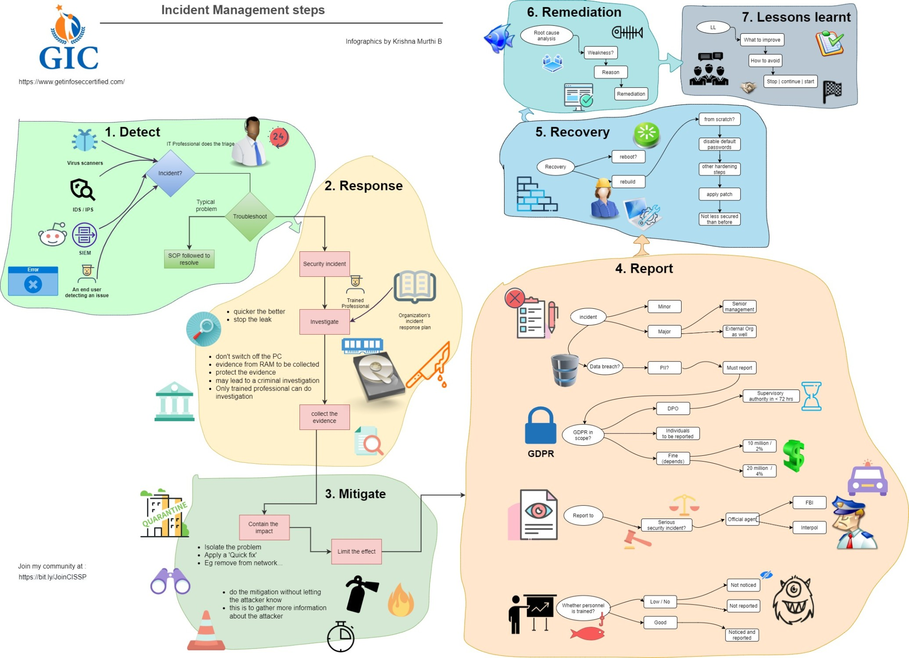
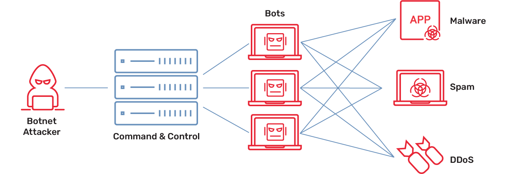
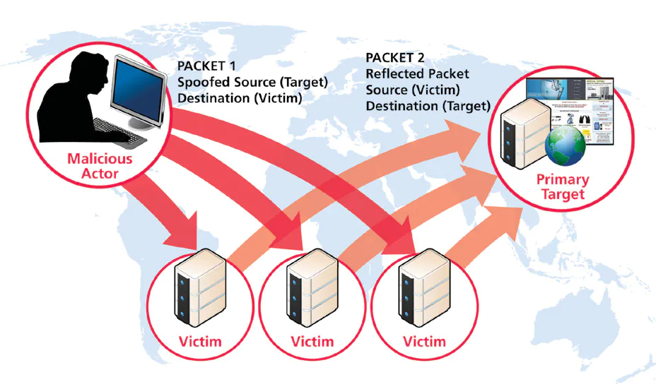
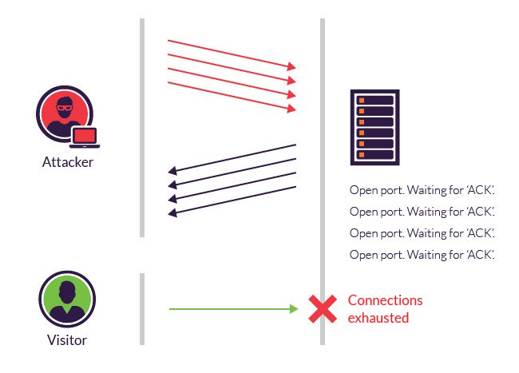
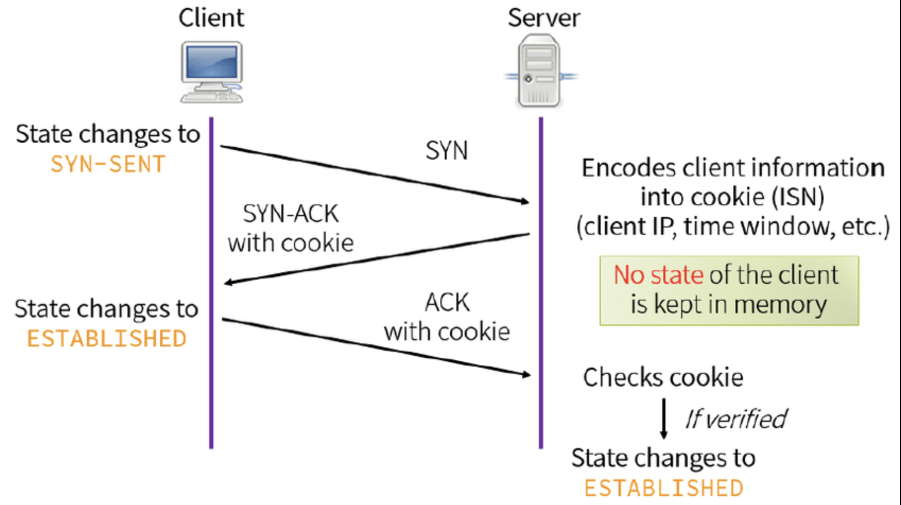
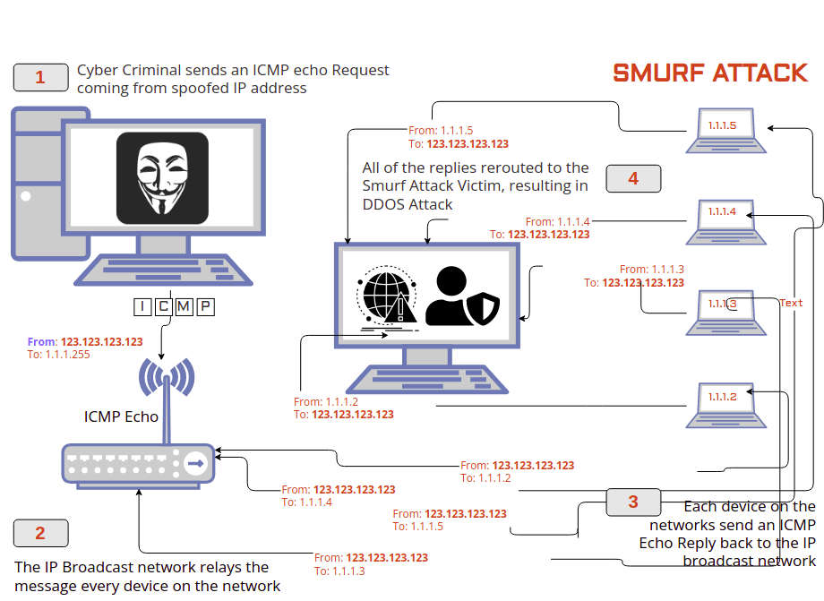
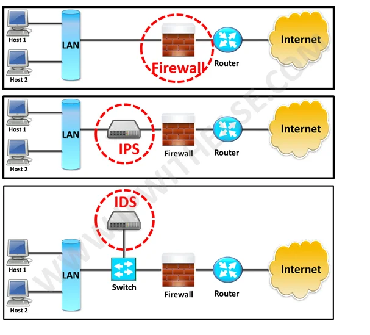
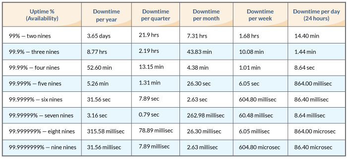
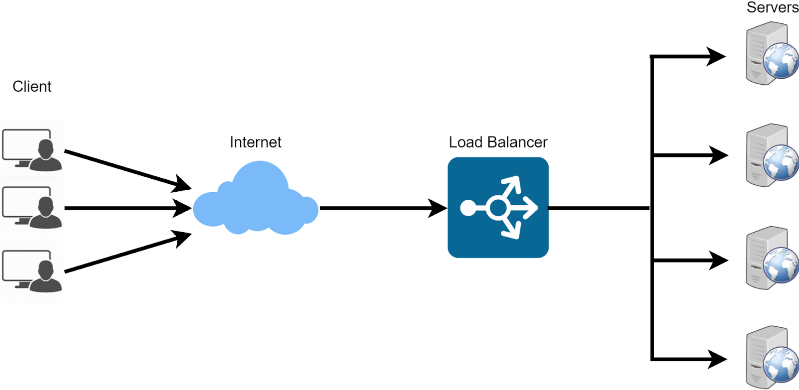

# Domain 7 - Security Operations

## 7.1 - Understand and comply with investigations

* **Investigations**
  * Types:
    * **_Administrative Investigations_**
      * internal investigations that examine either operational issues or a violation of the organization’s policies. May transition to another type of investigation.
        * **_Root cause analysis_** - determine the reason that something occurred.
    * **_Criminal Investigations_**
      * conducted by law enforcement, related to alleged violation of criminal law
      * Must meet **_“beyond a reasonable doubt”_** standard of evidence which states there are no other logical conclusions.
    * **_Civil Investigations_**
      * do not involve law enforcement, but involves internal employees and outside consultants working for a legal team
      * Not as rigorous.
      * Must meet the **weaker** **_“preponderance of the evidence”_** standard that demonstrates the outcome is more likely than not
    * **_Regulatory Investigations_**
      * government agencies do these when they think there’s been a violation of administrative law
      * regulators conduct these with a _standard proof of commensurate with the venue where they expect to try their case
        * procedures are often done by government agencies
      * **_Industry Standards Investigations_**
        * regulator investigation where no government agency is involved
        * based on violations to industry standards (i.e, PCI DSS)
        * orgs may be required to submit audits, assessments, and investigations conducted by an independent 3rd party
        * may result in fines, penalities, and/or loss of certifications
* **Electronic Discovery (eDiscovery)**
  * process that facilitates the processing of electronic information for disclosure in investigations
  * complex process and requires careful coordination between IT and legal
  * [**_Electronic Discovery Reference Model (EDRM)_**](https://edrm.net/)
    * describes a standard process for conducting eDiscovery
    * Nine Aspects:
      * **Information governance** - ensures info is well organized
      * **Identification** - locates the information, when litigation is believed to be likely
      * **Preservation** - protected against alteration or deletion
      * **Collection** - gathers the responsive information centrally
      * **Processing** - screens the collected information , "rough cut"
      * **Review** - determine what information is responsive/relevant to the event
      * **Analysis** - deeper inspection of the content and context
      * **Production** - place info in a format that it may be shared (such as opposing counsel)
      * **Presentation** - show info to witnesses, the court, other parties
* **Evidence**
  * aka artifacts
  * **_Admissible Evidence_**
    * must be relevant to determining a fact, material/related to the case, competent (obtained legally)
  * **_Evidence Types_**
    * **Real** - things that may actually be brought into a court of law, aka conclusive evidence
    * **Documentary** - written items brought to court to prove a fact at hand
      * Two rules apply:
        * **_Best evidence rule_** - original documents must be introduced, not copies
        * **_Parol evidence rule_** - when an agreement between parties is put into writing, the document is assumed to contain all the terms of the agreement and that no verbal agreement may modify the written agreement
    * **Testimonial** - testimony of a witness, can be direct evidence based on their observations, or expert opinions, authenticates the _documentary evidence_
    * **Demonstrative** - used to support _testimonial_ evidence, using items that may or may not be admitted as evidence, left to the trail court to decide if its admissible or not
  * Concepts
    * **Hearsay**
      * something that was told to someone outside of court - not admissible
      * has many, many exceptions
        * past testimonies given by a witness under oath that is no longer available
        * statement mage against the interest of the person making the statement
        * dying utterance
        * public records
        * forensic analysis
          * extremely important exception
          * business records exception
            * logs generated by a computer system
              * admissible if they were made at the time of the event by someone or something with direct knowledge and kept in the course of regular business activity
              * must be accompanied by a person qualified to show that these criteria were met
    * **Chain of evidence/custody**
      * Evidence should be labled with general description, time and date of collection, location evidence was collected from, name of collector, relevant circumstances
      * should have a comprehensive log of everyone and anyone who touches the evidence

* **Evidence Collection and Forensic Procedures**
  * tricky and complex process, should be done by a training professional
  * [**_International Organization on Computer Evidence (IOCE)_**](https://uia.org/s/or/en/1100029648)
    * focused on computer crime and digital forensics, providing a platform for law enforcement to collaborate and share information
    * established to address the growing challenges of computer-related crimes and the need for standardized approaches to handling digital evidence
    * outlines five principles to guide digital evidence technicians performing evidence collection
    * The IOCE principles are as follow:
      > * Upon seizing digital evidence, actions taken should not change that evidence
      > * When it is necessary for a person to access original digital evidence, that person must be forensically competent
      > * All activity relating to the seizure, access, storage, or transfer of digital evidence must be fully documented, preserved, and available for review
      > * An individual is responsible for all actions taken with respect to digital evidence while the digital evidence is in their possession
      > * Any agency that is responsible for seizing, accessing, storing, or transferring digital evidence is responsible for compliance with these principles
  * Actions taken to collect should not change evidence
  * Person should be trained to access evidence
  * All activity related to evidence should be fully documented, preserved, available for review
  * Individuals are responsible for all actions taken
  * Preserve the original evidence
  * Analysis Types:
    * **_Media Analysis_**
      * involves identification and extraction of information from storage media
      * may include
        * recovery of deleted files from unallocated sectors (physical disk)
        * live analysis of storage media connected to a computer system
        * static analysis of forensic images of storage media
      * hard drives or media should never be accessed from live systems
        * after collecting other evidence, power of the system, remove storage device, attach the storage device to a dedicated forensic workstation, use a _write blocker_ (tool that prevents all computer storage media connected to a computer from being written to or modified)
      * analysts should immediately calculate the cryptographic hash of the device contents
      * use forensic tools to create forensic images of the device:
        * a bitwise copy of the data stored on the device
      * compute the crypt hash of the image to ensure its identical to the original media contents
      * original images should be preserved
      * use copies for analysis
    * **_In-Memory Analysis_**
      * analyzing / collect information from the memory of live systems
      * use trusted tools to generate a memory dump file and place it on forensically prepared device (example USB drive)
      * memory dump file contains all the contents collected from memory and may be used for analysis
      * compute a crypto hash of the file
      * preserve original and use copies for analysis
    * **_Network analysis_**
      * when incidents take place over a network.
      * Often difficult to reconstruct because networks are volatile, and depend on prior knowledge than an incident is underway or logs.
      * include
        * IDS / IPS logs
        * network flow logs
        * Packet captures
        * Firewall and other devices logs
      * Analysis should be done via a _SPAN_ port on a switch (mirrors data send to one or more other sports for analysis) or a network tap
      * generates a packet dump / capture file
      * compute a cryto hash of the file
      * preserve original and use copies for analysis
    * **_Software analysis_**
      * reviews of applications or activity, or review of software code and log files.
      * looking for backdoors, malicious code, logic bombs, or other sec vulnerabilities
      * may also inlcude validation of file hash values against known file types
      * [**_National Software Reference Library(NSRL)_**](https://www.nist.gov/itl/ssd/software-quality-group/national-software-reference-library-nsrl)
        * maintained by NIST
        * includes cryptographic hash values for over 130 million known applications
        * makes it easier for forensic analysts to detect authentic and manipulated files
        * **_Fagan analysis_**
          * also known as Fagan inspection, is a structured method for finding defects in software development, particularly during the review of code or other documents.
    * **_Hardware/embedded device analysis_**
      * includes a review of 
        * personal computers
        * Smartphones
        * Tablet computers
        * Embedded computers in cars, security systems, and other devices (IoT)
      * leverages both media and software analysis

* **Locard's Exchange Principle**
  * a foundational concept in forensic science, stating that whenever two objects come into contact, each leaves behind some trace or residue on the other. 
  * Formulated by Edmond Locard in the early 20th century
  * principle underscores the importance of physical evidence in criminal investigations
  * Locard, inspired by literary and scientific figures, established the first modern forensic laboratory in Lyon, France, where he conducted pioneering research on trace evidence.
  * often succinctly summarized as "Every contact leaves a trace," which encompasses a wide variety of materials, including hair, blood, dirt, and fibers.
  * concept has significant implications in criminalistics, as it guides forensic scientists in identifying and analyzing trace evidence that can link suspects to crime scenes.
    * analysis of such micro-particles can reveal crucial information, but maintaining the integrity of evidence through proper chain of custody is essential to ensure its reliability in legal contexts. Furthermore, with advancements in technology, the scale of trace materials is likely to decrease, necessitating ongoing adaptations in forensic methodologies.
  * overall serves as a critical framework for understanding the interplay between physical evidence and criminal investigations.

* **Investigation Process**
  * **Rules of engagement** - define and guide investigative actions
  * **Gathering Evidence**
    * **_Voluntary surrender_** - given up willingly, usually when the attacker is not the owner
    * **_Subpoena_** - or court order, the court compels someone to provide evidence, but this gives the data owner time to alter the evidence and ruin it
    * **_Search warrant_**
      * used when you must have access to evidence without alerting evidence owner or other personnel, the court allows you to seize evidence
      * can be issued only based on probable cause and must be specific in scope
  * Deciding whether to involve law enforcement or not is challenging because incidents are more likely to become public, and the Fourth Amendment hampers government investigators in ways that private companies are not.
  * Never conduct investigations on an actual system that was compromised.
    * Take them offline and use backups.
  * Do not attempt to “hack back” and avenge a crime.
  * Call in expert assistance if needed.
  * **_Reasonable expectation of privacy_**
    * _Subjective expectation of privacy_:
      * a certain individual's opinion that a certain location or situation is private which varies greatly from person to person
    * _Objective expectation of privacy_:
      * legitimate and generally recognized by society and perhaps protected by law.
    * Outside of government worksplaces, most jurisdictions have laws or precedents that state the employees do not have expectation of privacy under most workplace situations
    * Employers have the right to search electronic equipment and systems they own/operate
      * they do not have the right to search personal belongings unless advised by an attorney
  * **_Interviewing_**
    * a non-accusatory, structured conversation aimed at gathering information
  * **_Interrogation_**
    * a more formal and accusatory process focused on obtaining a confession or incriminating information from a suspect.
    * information is presented in court
  * Attackers often try to sanitize log files after attacking, so to preserve evidence, logs should be centralized remotely and secure from tampering
  * **_Reporting and Documentation_**
  * A final report should be produced by any investigation that details the processes followed, evidence collected, and final results of investigation. Lays the foundation for escalation and legal action.

* **Major Categories of Computer Crime**
  * **_Computer crime_**
    * violation of law and/or regulation that involves a computer
    * can be against the computer or the computer could have been in the actual commission of the crime
    * Any individual who violates your security policies is an _**attacker**_.
    * Categories
      * **_Military & Intelligence Attacks_**
        * launched primarily to obtain secret and/or restricted information from law enforcement or military and research sources
      * **_Business Attacks_**
        * focus on illegally obtaining confidential information
        * corporate espionage or industrial espionage, stealing trade secrets.
        * other attacks may focus on integrity and/or availability of information
          * DDoS etc
      * **_Financial Attacks_**
        * carried out to unlawfully obtain money or services
        * Ex: shoplifting, burglary
        * Can also be "cybercrime for hire" where the attacker engages in mercenary activity, conducting cyberattacks against targets for their clients
        * DDoS can also fall under this category
        * Ransomware
      * **_Terrorist Attacks_**
        * to disrupt normal life and instill fear, as opposed to military or intelligence attack which is designed to extract secret information.
        * industrial control systems are key targets for this type of attack
          * power grids, utilities, oil & gas
      * **_Grudge Attacks_**
        * carried out to do damage to an organization or person, usualy out of resentment or to “get back at” an organization
        * Insider threat is big, these attacks can come from disgruntled employees.
      * **_Thrill Attacks_**
        * done for “the fun of it”, "high" of success, usually by “script kiddies”.
        * May also be related to “hacktivism” (combination of _hacker_ and _activist_)
          * often politically motivated (i.e, Anonymous or LulzSec) and use automated tools to create large-scale DDoS

* **Evidence Collection and Handling**
* Digital forensics tools, tactics, and procedures
* Artifacts (e.g., data, computer, network, mobile device)

## 7.2 - Conduct logging and monitoring activities

* **Logging / Monitoring**
  * procedures that help organizations prevent incidents and provide effective response when they do occur and reconstructing the events
* **Logging Techniques**
  * _**Logging**_ process of recording information about events to a log file
    * captures events, changes, messages, and other data describing activities on a system
    * commonly records details such as what happened, when it happened, where, who did it, and how
    * **_rollover logging_**
      * aka circular logging, or log cycling
      * allows admins to set a maximum log size
      * when the log reaches that size, the system begins overwriting the oldest events in the log
  * **Log Types**
    * **_Security Logs_**
      * record access to resources (files, folders, printers, etc)
      * can record when a user accessed, modified, or deleted a file
      * systems automatically record access to key system files but require an admin to enable auditing on other resources before logging access
        * configure logging to proprietary data but not public
    * **_System Logs_**
      * system and/or services events such as start/stops or configuration/attribute modification
      * helps discover potential malicious activity
    * **_Application Logs_**
      * records information for specific applications
      * dev choose what to record in the logs
        * example db dev can choose to record when anyone accesses specific data objects such as tables or views
    * **_Firewall Logs_**
      * record events related to any traffic that reaches a fw
      * includes allow/denied traffic
      * log kep packet information such as source/destination IP addresses and source/dest ports but not content of the packet
    * **_Proxy Logs_**
      * record details such as sites users visit and how much time they spend on these sites
      * record user attempts to visit know prohibited sites
    * **_Change Logs_**
      * record requests, approvals, and actual changes to a system as part of an overall change management process
  * **Protect Log Data**
    * logs should be securely stored, encrypted to prevent tampering or modification
    * SIEM
    * protect from unauthorized access and modification
    * policies that mandate backup of log files and retention of them
    * important to destroy log files when they are not longer needed
    * Federal Information Processing Standards (FIPS)
      * security standard published by NIST
      * [FIPS-200 - Minimum Security Requirements for FIPS](https://nvlpubs.nist.gov/nistpubs/FIPS/NIST.FIPS.200.pdf)
        * specifies the following requirements for audit data
          >* Create, protect, and retain information system audit records to the extent needed to enable the monitoring, analysis, investigation, and reporting of unlawful, unauthorized, or inappropriate system activity
          >* Ensure that the actions of individual information system users can be uniquely traced to those users so they can be held accountable for their actions
* **Monitoring**
  * process of reviewing information logs, looking for something specific
  * ensures that subjects (users, services, and employees) can be held accountable for their actions and activities
  * often dictated by laws/regualations (SOX, HIPAA, GDPR)
  * **Audit Trails**
    * records created when information about events and occurrences is stored in one or more databases/log files
    * provide a record of system activity and can reconstruct activity leading up to and during security events
    * prove or disprove culpability
    * deterrent
    * keep these secure and protected from APTs that attempt to delete and/or modify audit logs are key
    * log events should have accurate timestamps
      * systems should sync with an NTP server/service either internal or using a [public NTP server](https://gist.github.com/mutin-sa/eea1c396b1e610a2da1e5550d94b0453)
  * **_Tuning_**
    * process of adjusting security controls to better match the needs of the org and operational environment
    * example:
      * IDPS system requires tuning to reduce the number of false positive alerts that they generate
    * _Continuous Tunning_ ensures log entries and alerts are relevant and sufficient to meet the org needs
  * **_Log Analysis_**
    * detailed and systematic form of monitoring in which the logged information is analyzed for trends and patterns as well as abnormal, unauthorized, illegal, and policy-violating activities
    * not necessarily in response to an incident but a periodic task to detect potential issues
    * may get lost in the sheer volume of data
  * **_Traffic Analysis & Trend Analysis_**
    * forms of monitoring
    * examines the flow of packets rather than actual packet contents
    * referred to _network flow monitoring_
    * infers a lot of information (primary and secondary backup locations/servers, source of encrypted traffic, direction of traffic)
    * can reveal questionable traffic patterns
      * downloading massive amounts of data or sending massive amounts of emails to others
      * system may be corrupted and is part of a botnet

* **Security Information and Event Management (SIEM)**
  * centralized application to automate the monitoring of systems
  * aka Security Information Management (SIM), Security Event Management (SEM)
  * centralized logging and real-time analysis of events
  * includes agents installed on remote systems that send alerts back a to a central monitoring system
  * IDS/IPS systems send data to SIEMs
  * collects data from many sources, and correlates/aggregates the data looking for common attributes
  * uses analytics to detect abnormalities and sends alerts to security teams/admins

* **Syslog**
  * [RFC 5424](https://datatracker.ietf.org/doc/html/rfc5424) describes the `syslog` protocol
  * used to send event notification messages
  * centralized syslog server receives these messages form devices on the network
  * protocol defines who to format the message and how to send them to the syslog server but not how to handle them
  * historically been used on Unix and Linux systems
    * `syslogd` daemon is included, which handles all incoming syslog messages
      * similar to how a SIEM server provides centralized logging
  * some extensions ([`syslog-ng`](https://www.syslog-ng.com/), or [`Rsyslog`](https://www.rsyslog.com/)) allow the syslog server to accept messages from any source, not just Unix/Linux systems

* **Sampling**
  * aka data extraction
  * process of extracting specific elements from a large collection of data to construct a meaningful representation or summary of the whole
  * data reduction allowing someone to glean valuable infor by lookiing at only a small sample of data in an audit trail
  * risk of being not accurate representation
  * **_Statistical sampling_** uses precise mathematical functions to extract meaningful info from a large volume of data
    * more accurate and defensible
    * can identify a margin of error
  * **_Clipping Levels_**
    * form on _nonstatistical sampling_
    * selects only events that execeed a _clipping level_
      * predefined threshold for an event
      * system ignores events until they reach this threshold
    * widely used in the processing of auditing events to establish a baseline of routine system or user activity
    * discretionary sampling
    * doesn't offer an accurate representation of the whole body of data (ignore some events that may be crucial)

* **Egress monitoring**
  * monitoring traffic leaving a network
  * can detect unauthorized transfer of data outside the organization (data exfiltration)
  * **_Data Loss Prevention (DLP)_**
    * system/tools used to detect and prevent data exfiltration
    * can detect certain patterns in the data
    * can detect steganography and digital watermarks
    * cant detect the content of encrypted traffic (unless it knows the encryption keys), but can detect volume of encrypted traffic leaving
      * attackers trying to exfiltrate the data
  * **_Steganography_**
    * allows attackers to embed messages within other files such as graphic or audio files
    * can be detected if both the original file and the modified files exists
      * create hashes (using SHA-3) of both files and compare
    * using _forensic analysis_ techniques you can retrieve the message
    * in practice you can periodically capture file hashes

* **Security Orchestration, Automation, and Response (SOAR)**
  * set of technologies and practices that combine security orchestration, automation, and incident response into a unified platform
  * helps organizations streamline their security operations by automating repetitive tasks, integrating disparate security tools, and coordinating responses to security incidents.
  * leverages ingestion of threat feeds to ensure all preventive and detection systems know about the new threats and automatically respond
  * leads to faster and more efficient incident handling, reduced workload for security teams, and improved overall security posture.
  * **_Playbook_**
    * document or checklist that defines how to verify and incident
    * can also give details on the the response
    * Example:
      * a playbook for the SYN flood attack would list the same actions security admins take after verifying it is a SYN flood attack
  * **_Runbook_**
    * implements the playbook data into an automated tool
    * Example:
      * an IDS sends an alert on the traffic, it implements a set of conditional steps to verify that the traffic is a SYN flood attack using the playbook's criteria
      * if the IDS confirms the attack, it can perform specified actions to mitigate the threat

* **Threat intelligence** (e.g., threat feeds, threat hunting)
  * refers to gathering data on potential threats
  * includes using various sources to get timely information on current threats
  * used in the process of hunting threats
  * activity of looking for existing evident of a compromise once symptoms or indicators of compromise (IOCs) of an exploit become known.
  * uses IoC information to find harm that has already occurred
  * [**Threat Feeds**](https://www.cloudflare.com/en-ca/learning/security/glossary/threat-intelligence-feed/)
    * steady stream of raw data related to current and potential threats
    * _threat intelligence feed_
      * attempts to extract actionable intelligence from the raw data
      * example of information
        * Suspicious domains
        * Known malware hashes
        * Code shared on internet sites
        * IP addresses linked to malicious activity
      * helps identifying potential threats and malicious traffic by comparing feeds with actual network traffic
    * [**Indicator of compromises (IoCs)**](https://en.wikipedia.org/wiki/Indicator_of_compromise) are artifacts observed with a hypothesis and high confidence about a threat
    * [**Structured Threat Information eXpression (STIX)**](https://oasis-open.github.io/cti-documentation/stix/intro.html)
      * standard language expressing structure information about cyberthreats and a common framework for organizations to share and analyze threat intelligence
    * [**Trusted Automated eXchange of Intelligence Information (TAXII)**](https://oasis-open.github.io/cti-documentation/taxii/intro.html)
      * defines the protocol and services for automating sharing of structured threat intelligence
    * [**Automated indicator sharing (AIS)**](https://www.cisa.gov/topics/cyber-threats-and-advisories/information-sharing/automated-indicator-sharing-ais)
      * initiative setup by the US Department of Homeland Security now managed by the National Cybersecurity and Communications Integration Center (NCCIC)
      * used to facilitates the open and free exchange of IoCs and other cyberthreat information between the US federal governement and the private sector in an automated and timely manner (machine speed)
      * Uses STIX and TAXII to share intel
  * [**Threat Hunting**](https://en.wikipedia.org/wiki/Threat_hunting)
    * process of actively searching for cyberthreats in a network
    * starts with the assumption that attackers are in the network
    * search for IoCs following the "kill chain model"
  * [**Kill Chain Model**](https://en.wikipedia.org/wiki/Kill_chain_(military))
    * used by the military to disrupt attacks
    * has a lot of depth and includes the following phases:
      * **_(1) Find or Identify a target through reconnaissance_**  
      * **_(2) Get the target's location_**
      * **_(3) Track the target's movement_**
      * **_(4) Select a weapon to use on the target_**
      * **_(5) Engage the target with the select weapon_**
      * **_(6) Evaluate the effectiveness of the attack_**
    * used for both offense (go through each step) and defense (attempt to break the chain and make the attackers attack fail)
  * [**Cyber Fill Chain**](https://en.wikipedia.org/wiki/Cyber_kill_chain)
    * adapted from and based on the military version
    * goals is to disrupt the chain by stopping the attack at any stage/phase of the attack
      * avoid all the social engineering methods, the attacker can't deliver the weapon, and the attack can't succeed
    * Seven Ordered Stages of an Attack:
      * **Reconnaissance**
        * attackers gather info on the target
      * **Weaponization**
        * attackers identifies an exploit that the target is vulnerable to as well as methods to exploit it
      * **Delivery**
        * send the "weapon" to the target via phishing attacks, malicious email attachments, compromised websites, or other common social engineering methods
      * **Exploitation**
        * weapon exploits a vulnerability on the target systm
      * **Installation**
        * Code that exploits the vulnerability then installs malware
        * malware typically includes a backdoor, allowing the target to access the system remotely
      * **Command and Control**
        * attacker maintains a command-and-control system, which controls the target and other compromised systems (remotely)
      * **Actions on Objectives**
        * attackers execute their original goals (theft of data/money, data destruction, installing additional malicious code (ransomware))
    * [**MITRE ATT&CK**](https://attack.mitre.org)
      * matrix/framework created by MITRE
      * knowledge base of identified **_tactics, techniques, and procedures (TTPs)_** used by malicious actors in various attacks
        * **Tactics**:
          * Represent the "why" of an attack—the high-level objectives an adversary is trying to achieve.
          * Examples include Initial Access, Execution, and Exfiltration. These are the columns in the ATT&CK matrix.
        * **Technique**s:
          * Represent the "how"—the specific methods an adversary uses to accomplish a tactic.
          * Under the Initial Access tactic, a technique might be Phishing. Each technique is documented with details like its description, platforms it affects, and examples of how it's used.
        * **Procedures**:
          * Represent the specific, real-world implementations of a technique
          * often refer to the tools or malware used by a particular threat group to carry out an attack.
      * Complimentary to the kill chain model
      * tactics are not an ordered set of attacks
      * lists TTPs within a matrix
      * living document as attackers constantly modify their attack methods and is updated twice a year
      * Tactics
        * **Reconnaissance**
          * The attacker is gathering information to plan a future operation
          * includes activities like scanning for open ports, searching public websites for employee information, or phishing for network details.
        * **Resource Development**
          * The attacker is establishing resources to support their operations
          * could involve setting up command and control (C2) infrastructure, creating malicious tools, or purchasing stolen accounts.
        * **Initial Access**
          * The attacker is attempting to get a foothold in the target network
          * Common techniques include phishing, exploiting a public-facing application, or using compromised credentials.
        * **Execution**
          * The attacker is trying to run malicious code on a compromised system
          * can be done through various methods, such as using command and scripting interpreters (like PowerShell), scheduled tasks, or exploiting a vulnerability.
        * **Persistence**
          * The attacker is trying to maintain their foothold in the network, even after system reboots, in order to ensure continued access.
          * Achieved through techniques like creating new accounts, modifying startup folders, or using scheduled tasks.
        * **Privilege Escalation**
          * The attacker is trying to gain higher-level permissions on a system or network.
          * Could involve exploiting a vulnerability, using stolen credentials, or manipulating access tokens.
        * **Defense Evasion**
          * The attacker is trying to avoid being detected by security tools and analysts.
          * Techniques include disabling security software, obfuscating malicious files, or using trusted processes to hide their activity.
        * **Credential Access**
          * The attacker is trying to steal account names and passwords.
          * This is a critical step for lateral movement and privilege escalation
          * Techniques include brute-force attacks, keylogging, or using tools to dump credentials from memory (e.g., Mimikatz).
        * **Discovery**
          * The attacker is trying to figure out the environment
          * includes researching the network topology, identifying available accounts, and exploring what systems they can control to further their objectives.
        * **Lateral Movement**
          * The attacker is trying to move through the environment from a compromised system to other systems to gain access to more valuable data or resources.
          * Techniques include using remote services or passing stolen credentials to authenticate to other machines.
        * **Collection**
          * The attacker is trying to gather data of interest to their goal.
          * This could involve capturing screenshots, searching for sensitive files on a local system, or gathering data from removable media.
        * **Command and Control**
          * The attacker is trying to communicate with compromised systems to control them.
          * Often involves using covert channels that mimic normal network traffic, such as HTTP or DNS, to avoid detection.
        * **Exfiltration**
          * The attacker is trying to steal data from the network.
          * This can be done by compressing data and sending it over a C2 channel, transferring it to a cloud account, or using other methods to get the information out of the organization.
        * **Impact**
          * The attacker is trying to manipulate, interrupt, or destroy systems and data.
          * This can include activities like wiping disks, encrypting files for a ransomware attack, or shutting down critical services.
* **User and Entity Behavior Analytics (UEBA)**
  * analyzes user-based activities on endpoints and other devices
  * builds a profile of each individual's normal activity and highlights deviations from that profile that may indicate a potential compromise

* Intrusion detection and prevention (IDPS)

* Log management

## 7.3 - Perform Configuration Management (CM) (e.g., provisioning, baselining, automation)

* _**Configuration Management (CM)**_
  * ensures that systems are deployed in a secure, consistent state and they remain in a secure and consistent state throughout their lifetime
  * Baselines and images are commonly used to deploy systems
* **Provisioning**
  * refers to installing and configuring the OS and needed applications
  * deploying the OS and applications using a secure configuration will help reduce any vulnerabilities
  * Common Hardening includes
    * Disable all unused services
      * ie. FTP is rarely used and should be disabled
    * Close all unused logical ports
      * often closed by disabling unused services
    * Remove all unused applications
      * some are added automatically and should be removed if unneeded
    * Change default passwords
* **Baselining**
  * starting point for a system
  * admins can and should modifying settings to meet org requirements
  * improves overall security ensuring that desired security settings are always configured correctly
  * reduce deployment time and maintenance
  * baseline images should be secure stored to avoid tampering (injection of malware of vulnerabilities)
  * **_Images as Baselines_**
    * images are typically used to deploy baselines
    * typical three-step process
      * (1) Admin installs the OS and desired applications on a computer (or vm) as the baselining system. Configures relevant security settings to meet the org's needs. Extensive testing is done to ensure the system operates as expected
      * (2) Admin then captures an image of the system using imaging software and stores in on a server (image server) or on a external hard drive, USB drives, or DVDs
      * (3) Personnel then deploy the image to systems as needed. These systems often require additional configuration to finalize them, such as giving them unique names, overall sys config is the same
* **Automation**
  * imaging is typically combined with other automation tools
  * integrated with tools like `Ansible` and `Terraform` for automation of infra provisioning and configuration
  * Microsoft's Group Policy (GP)
    * admins can configure a GP setting one time and automatically have the setting applied to all computers in the domain
    * can we used to modify specific Windows Registry settings
    * susceptible to Powershell privilege escalation attacks

## 7.4 - Apply foundational security operations concepts

### Least privilege and Need-To-Know

* two standard principles to following in IT security
* help protect valuable assets by limiting access
* related and sometimes interchangeable but have differences
* **_Principle of Least Privilege_**
  * subjects are granted only the privileges necessary to perform their assigned work tasks
  * includes both permissions and rights
  * for data this means controlling the ability to read, write, create, alter, and delete
  * ensures protection of confidentiality and data integrity
  * works on the assumption of well defined job descriptions for users
  * this is typically violated when all users are added to the local Admin group or granting root access to a computer
    * problems if the use logs in to a system as root/admin and accidentally installs malware on to the system
  * also used in context of applications and services
    * accounts should have limited scope and permissions for what they need to do
* **_Need-To-Know Principle_**
  * imposes the requirement to grant users access to only the data or assets/resources they need to perform assigned work tasks
  * primary purpose is to keep secret information secret and limit who knows the secret
  * commonly associated with security clearances, but the clearance doesnt automatically grant them access to the secret data
    * admins grant them access to only the data on a "need-to-known" basis for their job
  * primarily for military and government agencies, but can be utilized for civilian organizations
  * helps protected against unauthorized access that could result in loss of confidentiality

#### Segregation of Duties (SoD) and Responsibilities

* aka "separation of duties"
* ensures that no single person has total control over a critical function and/or system
* creates "checks-and-balances" systems where two or more users verify each other's actions and must work in together to accomplish necessary work tasks
* more difficult for engaging in malicious, fraudulent, or unauthorized activities
* may lead to the risk of collusion between two or more people to compromise the organization
  * fraud detection is increase and acts as an effective deterrent
* typically tasks are broken up to prevent fraud
  * example:
    * one person approves payment for a valid invoice, but someone makes the payment
    * dividing admin capabilities/functions among multiple trusted individuals
* **Two-Person Control**
  * aka "two-man rule"
  * requires the approval of two individuals for critical tasks
  * example:
    * two keys are required to open a safe, the keys are split between two people
  * _**Split knowledge**_
    * concept which combines both the concept of segregation of duties and two-man rule in to one
    * used in key escrow
    * infomration of privilege to perform a task is split between two or more users, ensuring no single person has sufficent privileges to compromise the security of the environment

### Job Rotation

* aka "rotation of duties"
* employees rotate through jobs or rotate job responsibilities with other employees
* necessary security control provides peer review, reduces fraud, and enables cross-training
* policy can act as both a deterrent and a detection mechanism
  * if employees know that someone else will be taking over their job responsibilities in the future, they are less likely to take part in fraudulent activities

### Mandatory Vacations

* require employees to take _mandatory vacations_ in one- or two-week increments
* provides a form of "peer review" and helps detect fraud and collusion
* policy helps ensure that another employee takes over an individual's job responsibilities for at least a week
  * if a person is involved in fraud, the other will likely detect it
* acts as both deterrent and detection mechanism (like job rotations)

### Privileged Account Management

* aka PAM
* solutions that monitors and restricts access to privileged accounts/permission or detect when accounts use any elevate privileges
* Microsoft domains include a PAM solution, base on "Just-in Time" admin principle
* users are placed in a privilege group, but members of the group don't have elevated privileges
* they request permissions to use elevate privileges when they need them
* PAM admins approve/denies this request behind the scenes and granted (if approved) in seconds by issuing a time-limited ticket
* after a time the ticket expires and the privileges are revoked

### Advanced Persistent Threat (APT)

* APT is a prolonged, sophisticated, and targeted cyberattack where a threat actor gains unauthorized access to a network and stays undetected for an extended period.
* APT's are methodical, patient, and highly focused, often carried out by well-funded, skilled adversaries, such as state-sponsored groups or large criminal organizations.
  * not a "hit-and-run" attacks
* goal of a APT is not usually immediate financial gain, but rather to steal sensitive data, conduct cyber espionage, or disrupt operations over time.
* An APT attack typically unfolds in several distinct stages:
  * **Reconnaissance**: Attackers thoroughly research their target to find vulnerabilities, map the network, and identify key personnel.
  * **Initial Compromise**: They gain an initial foothold, often through spear-phishing emails, exploiting software vulnerabilities (including zero-days), or using stolen credentials.
  * **Establishing a Foothold**: Once inside, attackers deploy custom malware or backdoors to ensure they can maintain access to the network, even if their initial entry point is discovered.
  * **Lateral Movement and Privilege Escalation**: The attackers move quietly through the network, escalating their privileges to gain access to more sensitive systems and data.
  * **Data Exfiltration or Disruption:** The final objective is achieved, whether it's stealing data, causing sabotage, or simply maintaining a long-term presence for future operations.
* The "Advanced," "Persistent," and "Threat" components of the term define the nature of the attack:
  * **Advanced**: The use of specialized, sophisticated tools and techniques designed to evade traditional security defenses.
  * **Persistent**: The attack is a continuous, sustained effort by the adversary to maintain a long-term presence within the target's network.
  * **Threat**: The attack is carried out by a skilled, well-resourced, and highly motivated adversary with a specific objective.
* **_Technical Alert -_** [_**TA17-239A**_](https://www.cisa.gov/news-events/alerts/2017/10/20/advanced-persistent-threat-activity-targeting-energy-and-other-critical-infrastructure-sectors)
  * released by the US Department of Homeland Security (DHS) and The Federal Bureau of Investigation (FBI)
  * describing the activities of an APT targeting energy, nuclear, water, aviation, some critical manufacturing sectors, and government entities
  * details how the attackers infected a single system with a malicious phishing email or by exploiting server vulnerabilities
  * once exploited, the escalated their privileges and began performing many common privileged operations, including
    * Accessing and deleting logs
    * Creating and manipulating accounts (such as adding new accounts to the admin group)
    * Controlling communication paths (opening port 3389 for RDP access, and/or disabling the host firewall)
    * Running various scripts (Powershell, bash, javascript)
    * Creating and scheduling tasks (such as one that logged their accounts out after 8 hours to mimic the behavior of a regular user)
* Monitoring privileged accounts/access can detect these early in their attack, if undetected APTs can remain embedded in the network for years

### Service-level agreements (SLA)

* SLA is an agreement between an organization and an outside entity, such as a vendor
* It stipulates performance expectations and often includes penalties if the vendor doesn't meet them
  * such as uptimes and downtimes
* Sometimes a _Memorandum of Understanding (MOU)_ is used, which documents the intention of two entities to work together toward a common goal
  * MOU is a less formal version of an SLA, doesn't include any penalties if one party doesn't meet the expectations

## 7.5 - Apply resource protection

* **Media Management**
  * refers to the steps taken to protect media and data stored on it
  * media includes tapes, optical media such as CDs/DVDs, portable USB drives, internal hard drives, solid state drives, USB flash drives
  * backups are often contained on tapes but extends to any type of hard-copy data
* **Media Protection Techniques**
  * for sensitive information, should be stored in a secure location with strict access controls (prevent unauthorized access)
    * also should have temperature and humidity controls to prevent loss due to corruptions
  * restrict access to devices from computer systems (block and record attempts at USB connectivity)
    * USBs are risks for malware installation and data theft
    * some organizations will only allow specific brands
      * [IronKey](https://en.wikipedia.org/wiki/IronKey)
        * includes
          * multiple levels of built-in protection
          * several authentication mechanisms to ensure only authorized user can access the data
          * strong encryption with built-in AES 256-bit hardware encryption
          * active antimalware
  * proper media management ensures confidentiality, integrity, and availability
  * **_Tape Media_**
    * used for storing backups
    * highly susceptible to loss due to corruption
    * keep at least two copies (one on-site for immediate usage, and another at a secure storage location off-site)
    * cleanliness of storage area will directly affect the life span and usefulness of tape media
    * should not be exposed to magnetic fields
    * useful guidelines
      * new media should be kept sealed in original packaging until its needed to protect from elements
      * take extra caution when opening a media package as to not damage the media
      * avoid exposing the media to extreme temperatures (not stored near heaters, radiators, ACs, etc)
      * do not use media if its damaged, exposed to abnormal levels of dust/dirt, and/or dropped
      * media should be transported from one site to another in a temperature-controlled vehicle
      * media should be protected from exposure to the outside elements (sunlight, moisture, heat/colde)
        * should acclimatize for 24 hours before use
      * appropriate security should be maintained over the media from the point of departure to the secured off-site (media is susceptible to theft/damage/tampering during this time)
      * appropriate security should be maintained over the media during its lifetime based on classification level of data on the media
      * consider encrypting backups to prevent unauthorized disclosure of data
  * **_Mobile Devices_**
    * includes laptops, smartphones, tablets, smartwatches
    * have internal memory/storage and/or removable memory cards
    * use security best practices, strong encryption
* Data at rest/data in transit

## 7.6 - Conduct incident management

* **Incident**
  * defined as any event that has a negative effect on the confidentiality, integrity, and/or availability of an organization's asset(s)
  * can be cyberattacks, natural occurrences, event human accidents (someone accidentally cutting a network cable)
* **_computer incident_** or **_security incident_**
  * commonly refers to an _incident_ that is the result of an attack or the result of malicious, intentional, or accidental actions on the part of users
  * [**_Request For Comments (RFC) 2350 - Expectations for Computer Security Incident Response_**](https://datatracker.ietf.org/doc/html/rfc2350)
    * defines both a security incident and computer incident as _"any adverse event which compromises some aspect of computer or network security"_
  * [**_NIST SP 800-61(r3) - Computer Security Incident Handling Guide_**](https://nvlpubs.nist.gov/nistpubs/SpecialPublications/NIST.SP.800-61r3.pdf)
    * defines a computer security incident as _"a violation or imminent threat of violation of computer security policies, acceptable use policies, or standard security practices"_
  * defined by organizations in their security policies and/or incident response plan
    * typically includes common events such as
      * Any attempted network intrusion
      * Any attempted denial-of-service attack
      * Any detection of malicious software
      * Any unauthorized access of data
      * Any violation of security policies
* **Incident Management**
  * goal is to minimize the impact of an incident on an organization
  * does not include a counterattack against the attack
  * attackers often use spoofing to hide their identity
  * [**_NIST SP 800-61(r3) - Computer Security Incident Handling Guide_**](https://nvlpubs.nist.gov/nistpubs/SpecialPublications/NIST.SP.800-61r3.pdf)
    * identifies the following four phases:
      * Preparation
      * Detection & Analysis
      * Containment, Eradication, and Recovery
      * Post-Incident Recovery
    * all contain the same elements and goals
  * Seven Steps:
    * **Detection**
      * methods of detection of potential incidents\
        * IDS/IPS (may be a false positive)
        * Anti-malware
        * automated scanning tools
        * end users reporting
      * IT team investigates to determine if it is a "true" incident, if a valid incident has occurred/is occurring, move to step 2 - Response
    * **Response**
      * depends on the severity of the incident
      * activate the Cyber Incident Response Team (CIRT) or Computer Security Incident Response Team (CSIRT)
        * typically only for major incidents
        * formal incident response plan documents who would activate the team and under what situation/conditions
      * team members are trained on the IR process which they participate in which is to investigate the incident, contain and assess the damage, collect evidence, report the incident, and perform recovery procedures
      * also participate in remediation efforts and lessons learned stages
    * **Mitigation**
      * steps that attempt to contain an incident
      * limit the effect or scope of an incident
      * disconnect network devices/cables
      * isolate the problem and address it without causing more damage
      * always attempt to mitigate/detect the issue without notifying the attacker
    * **Reporting**
      * refers to reporting an incident within the organization and to external organizations/individuals
      * no need to report a minor malware infection to the company CEO
      * upper-level management only needs to be notified of serious security breaches
      * often require reporting incidents for legal and compliance requirements (especially for PII data breaches)
        * notifying the individual(s) affected also
      * in some cases incidents must be reported to local official agencies (FBI, INTERPOL, etc) whom may assist in the investigation
        * sometimes companies choose not to report to law enforcement to avoid issues with reputation and negative publicity (not an option if regarding PII)
    * **Recovery**
      * after reporting, its time to recover the the system or return it to a full functioning state
      * very simple for minor incidents (requiring something as simple as a reboot)
      * more major incidents may require completely rebuilding the system and a full system restore from backups (config, data, etc.)
      * make sure system is configured securely and up-to-date on patches (patch/config/change management)
      * any known compromise has been reversed
    * **Remediation**
      * personnel look at the incident, identity what allowed it to occur, and them implement methods to prevent it from happening
      * includes performing a _root cause analysis_
        * examines the incident to determine what allow is to happen (possible vulnerability or misconfiguration) and recommend a change
    * **Lessons learned**
      * feedback loop
      * examination of the incident response process to determine if there are areas form improvement
      * the IR team is involved at this stage
      * if changes are identified in the process they are added for the next time
        * additional new or updates to polices, procedures, etc
  
The following diagram illustrates the seven steps in incident response

## 7.7 - Operate and maintain detection and preventative measures

* **Preventive Control**
  * attempts to thwart or stop an unwanted or unauthorized activity from occurring
  * Examples 
    * fences, locks, biometrics,
    * separation of duties policies, job rotation policies, security policies
    * security awareness training
    * data classification,
    * access control methods, firewalls
    * intrusion prevention systems
* **Detection Control**
  * attempts to discover or detect unwanted or unauthorized activity
  * operate after the fact and can discover the activity only after it occurred
  * Examples:
    * security guards
    * motion detectors
    * recording/reviewing of events captured by security cameras/CCTV
    * job rotation policies, mandatory vacation policies,
    * audit trails
    * honeypots or honeynets
    * intrusions detection systems
    * violation reports, supervision
    * reviews of users, and incident investigation
* **Basic Preventive Measures**
  * Keep systems and applications patched and up-to-date
  * Remove or disable unneeded services protocols
  * Use intrusion detection and preventive systems
  * Use up-to-date anti-malware software
  * Use firewalls
  * Implement configuration and system management processes
* Common Attacks and Preventative Measures
  * **Botnet**
    * _bot_ is a robot/zombie (which is an infected computer)
    * multiple bots in a network form a _botnet_ and will do whatever attackers instruct them to do
    * _bot herder_
      * is typically a criminal who controls all the bots in the botnet via one or more command-and-control (C&C or C2) servers
      * enters commands on the server, the bots check in with the C&C to receive instructions
      * commonly instruct bots within a botnet to launch a wide range of DDoS attacks, send spam and phishing emails, or rent the botnets out to other criminals
      * typically control more than one botnet
    * bots can be programmed to contact the server periodically or remain dormant until a specific date/time or response to an event or when specific traffic is detected
    * systems typically join the botnet after being infected with malicious code or software which gives the bot herder remote access to the system and additional malware is installed
      * keyloggers, etc
    * botnets of more than 40,000 computers are common
    * [Mirai malware](https://en.wikipedia.org/wiki/Mirai_(malware))
      * _Mirai_ is japanese for _"The Future"_
      * used to launch a [DDoS attack on DNS servers hosted by Dyn](https://iflorian.com/mirai-botnet-october21-botnet-size/)
        * most devices in the attack where IoT (internet connected cameras, digitial video recorders, home-based routers, etc) that were infected and added to the botnet
      * attack prevented users from accessing many popular sites and services (Twitter, Netflix, Amazon, etc)
      * [Mira Source Code](https://github.com/jgamblin/Mirai-Source-Code) was release as open source for R&D on preventive measures
    * **_Protection Measures_**
      * implement multiple layers of security (defense in depth)
      * up-to-date anti-malware, patches, fix vulnerabilities
      * educate users on preventative measures (security awareness training)
        * not to click on links in suspicious emails, or open attachments
        * social engineering tactics to get them to reveal credentials
      * keeping browsers updated on latest security patches/updates
      * sanboxing to isolate web apps in browsers
    * The following diagram illustrates how Bot herders leverage botnets to perform attacks
    
  * **Denial-of-Service (DoS) Attacks**
    * prevent systems from processing or responding to legitimate traffic or requests for resources and objects
    * common form of DoS attacks will transmit so many packets to a server that it cannot process them all
    * other forms focus on the exploitation of known vulnerabilities or faults in the OS, service, or application
      * system crash, 100% CPU utilization, etc
    * DoS attacks come from a single system and targets a single system
      * commonly tied to internal system
    * attackers try to remain anonymous by spoofing their source IP
    * **_Distributed DoS (DDoS) attack_** occurs when multiple systems attack a single system at the same time
      * botnets typically achieve this
      * typically aimed at internet facing systems
    * **_Distributed Reflective Denial-of-Service (DRDoS) attack_**
      * variant of DDoS
      * doesnt attack the victim directly, manipulates traffic or network services so that the attacks are reflected back to the victim from other sources
      * DNS poisoning, Smurf attacks, and Fraggle attacks are examples
      
    * **_Protection Measures_**
      * same as botnet
      * filter unknown or malicious traffic (black hole route)
  * **SYN Flood Attack**
    * common DoS Attack
    * aka _half-open attack_
    * Attackers exploit the TCP 3-way handshake to overwhelm the server with connection requests, preventing legitimate users from accessing the service
    * attackers send multiple `SYN` packets but never completes the connection with a `ACK` packet
    * for each SYN requires the server has reserved system resources waiting for the ACK packet (waits as long as 3 minutes before aborting)
    * attack consumes memory and processing power and eventually crashes the system
    
    * **Protective Measures**
      * [SYN Cookies](https://en.wikipedia.org/wiki/SYN_cookies)
        * when a server receives a SYN packet, it doesn't immediately allocate resources for a new connection. Instead, it sends a specially crafted SYN-ACK packet back to the client. This packet's initial sequence number is a "cookie," a cryptographic hash based on the client's IP address, port number, and a secret server-side key.
        * if the client is legitimate, it will respond with an ACK (acknowledge) packet containing this cookie. The server can then use the cookie to reconstruct the original connection request without ever having stored any state information. This stateless approach prevents the server's connection tables from being filled with half-open connections, effectively mitigating the SYN flood attack.
        
  * **TCP Reset Attack**
    * sessions are normally terminated with the `FIN` (finish) or `RST` (Reset)  packet(s)
    * attackers spoof the source ip in the RST packet and disconnect active sessions
    * systems then need to reestablish connections
    * primarily a threat for systems that need to maintain a connection for data transmission
      * connection reestablishment means data needs to be re-created
  * **Smurf Attack**
    * type of DoS and flood attack
    * floods victims with Internet Control Message Protocol (ICMP) echo reply packets instead of with TCP SYN packets
    * attacker sends an `echo` request out as a broadcast to all systems on the network and spoofs the source IP address
    * all systems respond with `echo` replies to the spoofed IP address, flooding the victim with traffic
    * attack takes advantage of an amplifying network (aka _smurf amplifier_) by sending directed broadcast through a router which will affect all systems on the network
    * Layer 3 Attack
    * **Protection Measures**
      * RFC 2644 updated the standard default for routers so that they do not forward directed broadcast traffic
        * admins need to correctly configure the routers for this
      * disable ICMP on firewalls, routers, even many servers
    
  * **Fraggle Attack**
    * similar to smurf attack however instead of using ICMP it uses UDP packets over UDP port 7 (echo protocol) and port 19 (character generator protocol)
    * will broadcast UDP packets using the spoofed IP address of the victim
    * all systems on the network will then send traffic to the victim
    * UDP flooding is a variant that uses random UDP ports
    * Layer 4 attack
  * **Ping Flood**
    * floods victims with `ping` requests
    * very effective when launched by botnet bots as a DDoS attack
    * block ICMP
    * active intrusion detection systems can detect a ping flood
  * **Legacy Attacks**
    * not common today
    * **Ping Of Death**
      * used oversized ping packets
      * some OS's couldnt handle them and crashed / caused buffer overflow
    * **Teardrop**
      * fragments IP data packets, making them difficult or impossible to be put back together by the receiving system causing it to crash
    * **LAND**
      * _Local Area Network Denial_ attack
      * sends spoofed SYN packets to a victim using the victim' IP address as both the source and destination
      * variant is a _Banana Attack_ which redirects outgoing messages from a system back to the system, shutting down all external communication
* **Zero-Day Exploit**
  * refers to an attack on a system exploiting a vulnerability that is unknown to others
  * terms has minor differences based on the context
  * Examples:
    * **Attacker discovers a vulnerability first**
      * attacker can exploit it first
      * vendor is unaware of the vulnerability, has not released or developed a fix
      * common definition of "zero-day exploit"
    * **Vendor learns of vulnerability but hasn't released a patch**
      * vendor evaluates the seriousness of threat the new vulnerability has and prioritizes the development of a patch
        * maybe complex and requires extensive testing and r&d
      * vendors may develop and release the patch within a few days for serious threats or they may take months (not so serious)
      * attacks exploiting the vulnerability during this time are often called "zero-day exploits" because the public does not know about the vulnerability
    * **Vendor release patch and systems are attacked within 24 hours**
      * if systems are patch immediate after the fix is release everything should be fine
      * organizations usually take their time when applying patches
        * patch tuesday --> exploit wednesday
      * no patch management process
      * attacks the day after a patch is released is sometimes referred to as "zero-day exploit"
* **Main-in-the-Middle (MiTM)/On-path Attacks**
  * occurs whn a malicious user establishes a position between two endpoints of an ongoing communication and monitors/intercepts the communication traffic
  * two types of attacks
    * Sniffer Attack
      * copying and intercepting/sniffing traffic
    * Store-and-Forward Attack
      * attackers "poison" themselves in the line of communication where they act as a store-and-forward or proxy mechanism
  * client/server think they are connected to each other but in reality there is a third system
    * typically logging credentials, sensitive data or even changing messages in flight
  * requires altering routing information and DNS values, acquire and install encryption certificates to break into an encrypted tunnel, or falsify ARP lookups as part of the attack
  * can be thwarted using IDS/IPS and keeping systems updated with patches
  * users often use VPNs to secure their communication
* **Sabotage**
  * criminal act of destruction or disruption committed against an organization by an employee
  * typically disgruntled employee who may be aware of his/her termination
  * least privilege/separation of duties, swift termination and offboarding processes are key
  * intense auditing, monitoring, proper comms between employees and managers, compensation and recognition of employees to keep them happy

* **Intrusion Detection Systems (IDS) and Intrusion Prevention Systems (IPS)**
  * together they form _Intrusion Detection and Prevention Systems (IDPS)_
  * _intrusion_ occurs when an attacker can bypass or thwart security mechanisms and access an organization's resources
  * [NIST SP 800-94 - Guide to Intrusion Detection and Prevention Systems (IDPS)](https://nvlpubs.nist.gov/nistpubs/Legacy/SP/nistspecialpublication800-94.pdf)
    * provides comprehensive cover of both ID and IP systems
  * _**IDS**_
    * monitors events (in real time) to detect abnormal activity indicating a potential incident or intrusion
    * effective at detecting DoS and DDoS attacks
    * sends alerts/notifications or raises alarms
    * IDS Evaluation Methods
      * **Knowledge-Based Detection**
        * aka _signature-based_, _pattern-matching_
        * uses a database of known attacks developed by the IDS vendor
        * real-time traffic is matched against the database, if the IDS finds a match, it raises an alert/alarm
        * low false-positive rate
        * effective only against known attacks (new or slightly modified attacks will slip by)
        * similar to signature-pattern matching in anti-malware systems
        * vendors typically provide updates
      * **Behavior-Based Detection**
        * aka _statistical intrusion detection_, _anomaly-based detection_, or _heuristic-based detection_
        * creates a baseline of normal activities and events on the system
        * needs to accumulate enough events / data to determine normal activity
        * once a baseline is set it can then detect abnormal activity
        * baseline is created of a finite period (ex 1 week timeframe)
        * if the network is modified, needs to update the baseline
        * some may perform stateful packet analysis
        * Anomaly analysis adds to an IDS's capabilities by allowing it to recognize and react to sudden increases in traffic volume or activity
        * labelled as expert system or pseudo-AI systems (learns and makes assumptions)
        * more info it has the more accurate it can detect anomalies
        * can detect new attacks that have no signature and not detectable with signature-based methods
        * often raises many false positive alerts (incorrectly indicates an attack)
    * IDS Responses
      * **Passive Response**
        * notifications can be sent to admins via SMS, email
        * may generate a report detailing the activity leading up to the event and logs are available for admins to review
        * 24-hour Network Operations Centers (NOCs) have central monitoring screens viewable by everyone in the main support center
          * IDS alerts can be displayed on one of the screens to ensure that personnel are aware of the event
      * **Active Response**
        * can modify the environment using several different methods
        * typically includes modifying FW ACLs to block traffic
        * sometimes referred to as an IPS and accurate IF its placed inline with traffic (recommended by NIST SP 800-94)
    * Type of IDS
      * **Host-Based**
        * aka HIDS
        * monitors activity on a single host/computer including process calls and info recorded in system, application, security, and host-based firewall logs
        * often can examine events in more detail than a NIDS
        * can pinpoint specific files compromised in an attack
        * track processes employed by the attacker
        * can detect anomalies on the host system
          * infections where an intruder has infiltrated a system
          * C&C activity
        * include anti-malware capabilities
        * typically installed on key servers (added protection)
        * disadvantages
          * more costly to manage
          * requires more admin time on each system
          * cannot detect network attacks on other systems
          * consumes alot of resourcing power
          * easier for an intruder to detect and bypass/disable
      * **Network-Based**
        * aka NIDS
        * centralized monitor on the network
        * remote sensors collect data and key points in the network monitoring routers, firewalls, switches that except port mirroring and network tapping
        * central console is often installed on a hardened single-purpose computer
        * has very little negative effect on the network performance
        * often discovers the source of an attack by performing _**Reverse Address Resolution Protocol (RARP)**_ or reverse DNS lookups
          * additional investigation is likely required due to attackers spoofing IPs and coming from botnets
        * usually can detect initiation of an attack or ongoing attacks, but can always provide information about an attack's success
          * admins verifying and check relevant systems
          * use logs as part of an audit trail to learn what happend
  * _**IPS**_
    * include detection capabilities
    * special type of "active" IDS
    * takes actions to mitigate / stop / prevent intrusions
    * admins can disable extra features to make it act more like an IDS
    * same types as IDS with one noticeable differents
      * Network-Based IPS (NIPS)
        * is placed inline with the traffic
          * all traffic flows through it and determines with traffic can be forwarded or blocked after analyzing it
        * if an active NIDS is not placed inline with traffic can check activity only after it reached the target, can only block an attack after its starts but not prevent it
  * TLS Inspection and Decryption
    * capability of IDPS to detect TLS encrypted traffic using _decryptors_ allow it to inspect and analysis the traffic
    * typically used in Next-Generation Firewalls
    * typically placed inline with traffic, ensuring all traffic (N/S) to/from the internet passes through it

The following diagram illustrates the differences between firewalls, IDS, and IPS systems

* **Honeypots and Honeynets**
  * **_Honeypot_**
    * individual computers created to trap or a decoy for intruders or insider threats
  * **_Honeynet_**
    * tow or more networked honeypots used together to simulate a network
  * act like legitimate systems but with no data of real value for an attacker
  * often configured with vulnerabilities to tempt intruders into attacking them
  * goal is to grab intruders attention and kep them away from actual valuable systems on the network
  * allows admins to observe an attacker's activity without compromising the live environment
  * can be used to delay the attacker enough for the automated IDS to detect the intrusion and gather information
  * can be placed anywhere on the network but typically are hosted on VM systems
    * much simpler to re-create after an attack
    * attackers often can detect they are on a vm and try a VM escape attack
  * admins often configure _pseudo-flaws_ which are false vulnerabilities or apparent loops holes to tempt the attack in exploiting them
    * often convince the attacker they have successful penetrated the system
  * Issues:
    * **_enticement vs entrapment_**
      * can legally use a honeynet/pot as an enticement device if the intruder discovers it through no outward efforts of the owner
      * entrapment, which is illegal, occurs whe the honeypot owner actively solicits visitors to access the the site and then charges them with unauthorized intrusion (trick/encourage)
* **Warning Banners**
  * informs users and intruders about basic security policy guidelines
  * mention that online activity is audited and monitored
  * provide reminders of restricted activities
  * wording is important from a legal standpoint as they can legally bind users to permissible set of actions, behaviors, and processes
  * electronic "no trespassing sign"
  * most intrusions and attacks can be prosecuted when warning signs clearly state that unauthorized access is prohibited and will be monitored/recorded

* **Anti-malware**
  * protection against malicious code
  * signature-based and heuristic detections
  * installed on hosts for added protections

* **Whitelisting/blacklisting**
  * methods used to control which applications can run and which cant
  * allow list (whitelisting), deny list/block list (Blacklisting)
  * effective preventive measure
  * can also prevent malware infections but preventing certain applications (active-x, javascript, etc) from running on systems
  * App Stores are an extreme allow list

* **Firewalls**
  * preventive (against sec incident) and using technical controls
  * Guidelines
    * **Block directed broadcasts on routers**
      * directed broadcast as a unicast packet until it reaches the destination target/network
      * attackers have used these to flood targeted networks with broadcasts
    * **Block private ip address at the boarder**
      * internal networks use private IP address ranges
      * internet uses public IP address ranges
      * if traffic from the internet has a source address in a private IP space its spoofed and the firewall should block it
  * Internet Assigned Numbers Association (IANA)
    * maintains a [list](https://www.iana.org/assignments/protocol-numbers/protocol-numbers.xhtml) of well known ports matched to protocols and assigned protocols numbers for IPv4 and IPv6
  * _**Circuit-level Gateway Firewalls**_
    * filter traffic based on the communication circuit
  * _**Application-level Gateway Firewall**_
    * filters traffic based on specific application requirements
  * _**Third-Generation Firewalls**_
    * aka Stateful Inspection Firewalls and Dynamic Packet Filtering Firewalls
    * filter traffic based on its state within a stream of traffic
  * _**Application Firewalls**_
    * aka web application firewalls (WAF)
    * specialized firewall that protects a web server
    * inspects all incoming traffic and can block malicious content (XSS, CSRF, SQL Injections, etc)
  * _**Next-Generation Firewall (NGFW)**_
    * functions as a _unified threat management (UTM)_ devices and combines several capabilities, including
      * traditional fw items like packet filtering and stateful inspection
      * can also perform deep packet inspection and analysis to block detected malware/malicious code
      * IDS/IPS capabilities

* **Sandboxing**
  * virtualization technique that provides a security boundary for applications and prevents the application form interacting with other applications
  * anti-malware solutions use this technique for quarantining and testing applications to prevent them from affecting other components
  * docker/podman

* **Third-party provided security services**
  * outsourced services (MSSP), auditing, pen testing, etc.
  * may be required by laws and regulations
  * may also be SaaS based UTM, firewalls, etc

* **Machine learning (ML) and Artificial Intelligence (AI) based tools**
  * ML
    * part of AI and refers to a system that can improve automatically through experience
    * give computer systems the ability to learn
    * system that starts with a set of rules and guidelines
  * AI
    * broad field that includes ML
    * gives machines the ability to do things that a human can do better or allows a machine to perform tasks thhat we previously thought required human intelligence
    * system starts with nothing and progressively learns the rules, it then creates its own algorithm as it learns the rules and applies ML techniques based on these rules
  * **_Behavior-Based Detection Systems_**
    * leverages AI and ML techniques to detect abnormal activities
    * ML system would use the defined baselines to detect abnormalities while the AI system simply monitor the traffic and creates the baselines as it monitors
    * both AI and ML requires feedback to improve accuracy (i.e reporting false-positives, false-negatives)

## 7.8 - Implement and support patch and vulnerability management

* **Patch Management**
  * _patch_ is a blanket term for code written to fix/correct a bug or vulnerability or to improve software/system performance
    * referred to updates, quick fixes, and hot fixes
    * in security, admins are primarily concerned with security patches (which affect a system's vulnerability)
    * vendors write and provide patches, but they are only useful if they are applied
  * ensures that systems are kept up-to-date with current _patches_
  * Common Steps:
    * **Evaluate patches**
      * vendors announce and release a patch
      * admins review and evaluate them to determine if they apply to their systems
    * **Test patches**
      * whenever possible, admins test the patch in a controlled/isolated nonproduction system to determine if the patch causes any unwanted side effects
        * system no longer starts or is stuck in a reboot cycle
        * if it affects one system its manageable but rollout to an entire fleet could be catastrophic
    * **Approve the patches**
      * once tested, follows the Change Management Process for approval
    * **Deploy the patches**
      * after test/approval, admins deploy the patches
      * typically done in a rollout fashion to limit the blast radius
      * automated process
    * **Verify the patches are deployed**
      * regularly test and audit the system to ensure they remain patched
      * possibly also incorporate vulnerability assessment
  * **_Patch Tuesday and Exploit Wednesday_**
    * Microsoft, Adobe, and Oracle typically release patches on the second Tuesday of every month (commonly referred to as _patch tuesday_)
    * allows admins to plan for the release of patch to give them adequate time to test/deploy
    * some vulnerabilities are extreme and microsoft releases them "out-of-band" (earlier than Tuesday)
    * attackers know that organizations dont patch right away, some have even reverse-engineered the patches to identify the underlying vulnerability and then created methods to exploit it (usually a day after "exploit wednesday")
* **Vulnerability Management**
  * refers to the regularly identifying vulnerabilities, evaluating them, and taking steps to mitigate risks associated with them
  * works in conjunction with Patch Management
  * not possible to eliminate risks, not is it possible to eliminate all vulnerabilities
  * effective vulnerability management ensures the organization is regularly evaluating and mitigating vulnerabilities that represent the greatest risk
  * Most Common Vulnerability
    * unpatched systems
  * Common elements
    * _Routine Vulnerability Scans_
    * _Periodic Vulnerability Assessments_
  * **Vulnerability Scanners**
    * tools used to test systems and networks for known security issues
    * enumerates all the vulnerabilities in a system
    * sometimes used by attackers to detect weakness in systems/networks in order to exploit them
    * typically generates a report with details which are passed on to the teams performing patch management and managing the systems
    * Management may choose to accept the risk rather than mitigate it (residual risk) for business decisions
* **Common Vulnerability and Exposures (CVE)**
  * CVE is a dictionary that provides a standard convention used to identify and describe vulnerabilities
  * commonly used by patch management and vulnerability management tools
  * Example:
    * [`CVE-2020-0601`](https://www.cve.org/CVERecord?id=CVE-2020-0601)
      * identifies a vulnerability in the windows CryptoAPI (`Crypt32.dll`)
      * Microsoft patched this vulnerability in Jan 2020 security updated
  * [MITRE Corporation](https://www.mitre.org/) maintains the [CVE Database](https://www.cve.org)
    * MITRE founders have a history as research engineers at Massachusetts Institute of Technology (MIT) but is NOT part of MIT
    * receives funding from the US DHS, and Cybersecurity and Infrastructure Security (CISA) to maintain the CVE database

## 7.9 - Understand and participate in change management processes

* **_Change Management_**
  * ensures that changes do not cause outages (intentional and/or unintentional) and that appropriate personnel review and approve changes before implementation and ensure that personnel test and document the changes
  * prevents unauthorized changes (which directly affect availability)
  * formal process designed to ensure that changes to IT systems and services are made in a controlled and efficient manner, with minimal disruption to the business.
  * mandatory element for some _Security Assurance Requirements (SARs)_ in the [ISO Common Criteria](https://en.wikipedia.org/wiki/Common_Criteria)
  * [Information Technology Infrastructure Library (ITIL)](https://www.ibm.com/think/topics/it-infrastructure-library)
    * comprehensive framework of best practices for IT service management (ITSM).
    * ensures alignment of IT services with business needs, ultimately delivering value to an organization and its customers.
    * provides a structured approach to managing IT services throughout their entire lifecycle, from design to retirement.
    * not a rigid set of rules, but rather a flexible framework that an organization can adapt to its specific needs.
    * Change management is a core practice within the ITIL framework, particularly in the _**Service Transition stage (in ITIL v3/2011)**_ and the broader Service _**Value System (in ITIL 4)**_.
  * Change Management Process:
    * **(1) Request for Change (RFC)**:
      * All proposed changes (new additions, modifications, or removals of IT services), must begin with a formal RFC.
      * Details the purpose of the change, its potential impact, and a plan for implementation and rollback.
      * Recorded and logged in to CMDB
      * Changes are categorized based on their risk and impact.
        * The three main types are:
          * **Standard Change**s: Low-risk, pre-approved, and repeatable changes, such as a routine software patch.
          * **Normal Changes**: Changes that require a formal review and approval process, often involving a Change Advisory Board (CAB). Examples include a major system upgrade.
          * **Emergency Changes**: Urgent changes needed to resolve a major incident or address a critical security vulnerability. These changes are expedited, with approval often occurring after the change is implemented.
    * **(2) Review The Change**:
      * A Change Manager, (often with help of others typically part of a Change Approval Board (CAB)) review and assess the change and associated documentation/details
      * impact, risks, and benefits of a proposed change are evaluated
      * ensures that the change aligns with business goals and that a proper back-out plan is in place in case of failure
    * **(3) Approve/Reject The Change**:
      * once the assessment/review is complete, the Change Manager and CAB team of experts then either approve or reject the change
      * the response is recorded in the CMDB (or change management documentation)
      * CAB team may require a rollback or backout plan for the change
    * **(4) Test The Change**:
      * once approved it should be tested in a controlled and isolated environment from production
      * ensures no interruption
    * **(5) Schedule and Implement The Change**:
      * change is scheduled so that it can be implemented with the least impact on the system and its customers
      * typically done in a "maintenance window", during off hours or non peak hours
      * testing should discover problems, but some unforeseen problems may occur, its important to have a rollback/backout plan to restore the previous state
    * **(6) Document the Change**:
      * ensures that all interested parties are aware of the change
      * often requires change in configuration management documentation
      * ensures that the system can return to a state before the change if required
      * after implementation, a _post-implementation review (PIR)_ is conducted to confirm that the change was successful and to identify any lessons learned for future improvements.

## 7.10 - Implement recovery strategies

* **System Resilience and Fault Tolerance**
  * primary goal is to eliminate _single point of failure (SPOF)_ in critical business systems
  * **_single point of failure (SPOF)_**
    * any component that can cause an entire system to fail
    * single disk
    * website is reliant on a single DB
  * **_System Resilience_**
    * ability of a system to maintain an acceptable level of service during an adverse event or return to a previous state after an adverse event
      * i.e hardware fault managed by a fault-tolerant components, attack managed by a IDPS, fail-over clusters
  * **_Fault Tolerance_**
    * ability of a system to suffer a fault but continue to operate
    * achieved by adding additional redundant components
      * additional disks, servers, etc
      * RAID arrays are a form of fault-tolerance for disks
* [**High Availability (HA)**](https://en.wikipedia.org/wiki/High_availability)
  * use of redundant technology components to allow a system to quickly recover from a failure after experiencing a brief disruption
  * often achieved through the use of load balancing and failover servers
  * **_Availability Effectiveness Measurements_**
  * `99.9%`
    * "three-nines"
    * system may only experience `0.1%` of downtime during whatever period is measure
    * applied to a 30-day month, 99.9% availability would require less than 44 minutes of downtime
  * `99.999%`
    * "five-nines"
    * applied to the same 30-day window, system would only be permitted 26 seconds of downtime per month

  
* [**Redundant Array of Inexpensive Disks (RAID)**](https://www.prepressure.com/library/technology/raid)
  * common solution to make storage systems resilient and fault-tolerant
  * Technology:
    * **_RAID 0 - Stripe set/Striped Volume_**
      * /images/RAID-0.png)
        * Splits data evenly across two or more disks without parity info, redundancy, or fault tolerance
        * Failure of one drive will fail the entire array 
        * Ideal use for non-critical storage that has to be read/written at high speeds, such as image retouching and/or video editing
    * **_RAID 1 - Mirroring_**
      * /images/raid-level-1-mirroring.svg)
      * Server contains two disks with identical contents when the system writes data to disk
      * Automatically synchronizes the disks on every change
      * If primary fails the system automatically switch over to the backup
      * Ideal for mission critical storage, for instance accounting systems. 
      * Also suitable for small servers in which only two drives will be used
    * **_RAID 2_**
      * /images/raid-2-level.png)
      * Rarely used in practice
      * Stripes data at the bit (rather than block) level and uses a [Hammering Code](https://en.wikipedia.org/wiki/Hamming_code) for error correction
      * Disks are synchronized by the control to spin at the same angular orientation to reach index at the same time
      * Cannot service multiple requests simultaneously
    * **_RAID 3_**
      * /images/raid-3-raid.webp)
      * Rarely used
      * Byte-level striping with a dedicated parity disk
      * Like RAID2 cannot service multiple requests simultaneously
      * I/O operations requires activty on every disck and usually requries synchronized spindles
    * **_RAID 4_**
      * /images/raid-4-level.png)
      * block-level striping with a dedicated parity disk
      * Provides good performance of random reads, random writes is low due to the need to write all parity data to a single disk
      * In the diagram a read request for block A1 would be served by disk 0, a simultaneous read for B1 would wait, but a read for B2 would be serviced concurrently by disk 1
    * **_RAID 5 - Disk Striping with Parity_**
      * /images/raid-5.avif)
      * Replaces RAID 3 and RAID 4
      * Requires **at least 3** disk drives and can work with up to **16**
      * Uses three or more disks to store data and parity information spread across the disks
      * If onedisk fails the system can regenerate that disk content using the parity information
    * **_RAID 6_**
      * /images/raid6.webp)
      * Extension of RAID 5 by adding another parity block, thus uses block-level striping with two parity blocks distributed across all member disks
    * **_RAID 10 (Combines RAID 1 and RAID 0)_**
      * /images/RAID_10.png)
      * aka RAID 1 + 0 or _stripe of mirrors_
      * configured as two or more (RAID-1) with each mirror configured in a striped (RAID-0) configuration
      * uses atleast four disks but can support more as long as each one drive in each mirror continues to function
      * example 3 mirrored sets (M1, M2, M3) total of 6 disks
        * if one drive in M1, one in M2, and one in M3 failed everything would continue
        * if two drives in any of the mirrors (both in M1) failed the entire array would fail
  * RAID is a fault-tolerant strategy that is designed to protect against a single disk failure but IS NOT a backup strategy
  * Comes in both software and hardware-based solutions
  * _Software-based_
    * requires the OS to manage the disks in the array and can reduce overall system performance
    * inexpensive
  * _Hardware-based_
    * more efficient and reliable
    * more expensive but the benefits outweigh the costs when used to increase availability of a critical component
    * typically includes spare drives that can be logically added ad-hoc
    * supports "hot-swapping" allow technicians to replace failed disks without powering down systems
    * "cold-swapping" requires the system to be powered down to replace the faulty drive

* **Load Balancing and Fail Over**
  * form of fault-tolerance and ha
  * _**fail over cluster**_
    * includes two or more servers
    * if one fails it "fails over" to the other to take the balance of traffic etc
  * failover is achieved through the use of _load balancers_
  * **_Load Balancer_**
    * can be hardware or software based
    * balances client load across multiple servers (~3)
    * make it easier to add / remove servers
    * provides health checks on each connected system
  

* **Trusted Recovery**
  * refers to the ability of a system to return to a secure and operational state after a failure or interruption, ensuring data integrity and preventing security compromises
  * provides security assurances and ensures recovery without compromise after a system failure.
  * Systems can be designed so they fail in either a _fail-secure_ or _fail-open_ stated
    * **_Fail-Secure_**
      * default to a secure state in the event of a failure
      * blocks all access in order to allow the system to _fail securely_
    * **_Fail-Open_**
      * grants all access
  * choice is dependent on whether security or availability is more important after a failure see [Domain 3 - Security Architecture](./Domain%203%20-%20Security%20Architecture%20and%20Engineering.md)
  * Consists of two elements
    * **Failure Preparation**
      * includes system resilience, fault-tolerant solutions, and reliable backup solutions
    * **Process of System Recovery**
      * system should be forced to reboot into a single-user, nonprivileged state
        * normal user can log on and does not grant unauthorized access to users
      * includes restoration of all affected files/services actively in use on the system at the time of the failure
      * missing or damaged files are restored, any changes to classification labels are corrected
      * all security settings are configured and verified
  * [Common Criteria - Trusted Recovery](https://www.commoncriteriaportal.org/files/ccfiles/CC2022PART2R1.pdf) - defines four types
    * **Manual Recovery**
      * does not fail in a secure state
      * admin is required to manually perform the actions necessary to implement a secured or trusted recovery after a failure/system crash
    * **Automated Recovery**
      * system is able to perform trusted recovery activities to restore itself against at least one type of failure
      * Hardware RAID provides automated recovery against the failure of a hard drive but not against the failure of an entire server
      * some types will require manual recovery
    * **Automated Recovery without Undue Loss**
      * similar to automated
      * includes mechanisms to ensure that specific objects are protected to prevent their loss (steps to restore data or other objects)
      * include additional protection mechanisms to restore corrupted files, rebuild data from transaction logs, and verify integrity of key system and security components
    * **Function Recovery**
      * systems automatically recover specific functions or rolls back to a specific state

* **Quality of Service (QoS)**
  * controls that protect the availability of data networks under load
  * different factors contribute to the quality of end-user experience
  * Factors
    * **_Bandwidth_**
      * network capacity available to carry communication
    * **_Latency_**
      * time it takes a packet to travel from source to destination
    * **_Jitter_**
      * variation in latency between different packets
    * **_Packet Loss_**
      * some packets may be lost between source/destination requiring retransmission
    * **_Interference_**
      * Electrical noise, faulty equipement, etc that may corrupt the contents of packets

* **Recovery Strategies**
  * DRP should be designed so that the first employees on the scene can immediately begin the recovery effort
  * **Alternate Processing Sites**
    * Alternative processing facilities that are specifically desgined for shifting computing functions from the primary DC when it goes down
    * Three main types:
      * **_Hot Sites_**
        * Fully operational data centers
        * Stocked with equipment and data requied to handle operations
        * Ready to run at a moments notice
        * Unparalleled level of redundancy
        * Active / Active
        * Very expensive to keep up, doubling data center costs
      * **_Cold Sites_**
        * Empty data centers
        * Stocked with core equipment such as network communication and environmental controls
        * No servers or data to restore operations
        * Relatively inexpensive
        * Operational in weeks or months
        * Requires planning to make operational
      * **_Warm Sites_**
        * Stocked with all necessary equipement, data, software to support the company's operations
        * Not maintained in a parallel fashion
        * Similar in expense as hot site
        * Available in hours or days
        * Active / Passive
    * Additional Types:
      * **_Mobile Sites_**
        * nonmainstream alternative
        * typically self-contained trailers, planes, or other easily relocatable units
        * includes all the environmental control systems necessary to maintain a safe computing environment
        * "fly-away"
        * usually configured as cold / warm sites depending on the DRP designed
        * possible to configure as a hot site (more expensive)
      * **_Cloud Computing_**
        * leverage on-demand computing resources available from CSPs as either cold/warm, or hot
        * should leverage a _resource capacity agreement_ with the CSP
          * ensures that the CSP will provide the resources needed to support disaster recovery operations
    * **_Mutual Assistance Agreements (MAA)_**
      * aka _reciprocal agreement_
      * formal, legally binding contracts between two or more organizations that outline how they will assist each other during emergencies or other critical situations
      * define the terms and conditions for resource sharing, responsibilities, and communication protocols to ensure effective collaboration and minimize disruptions.
      * drawbacks:
        * difficult to enforce
        * cooperating organizations should be located in relatively close proximity to each other to facilitate transportation of employees between sites
          * means that both organizations may be vulnerable to the same threats (earquake) and would likely mean the MAA is pointless
        * confidentiality concerns
          * different organizations placing data in hands of others
      * may be useful as an agreement between two internal units/subsidaries of the same org
  * **Storage Recovery Strategies**
    * Three Types
      * **_Offsite_**
        * remote storage location from primary site
        * best to be geographically diverse in order to mitigate risk of local disaster
        * can be managed by org or third party vendor
      * **_Onsite_**
        * on primary premises
      * **_Cloud Storage_**
        * flexible and scalable solution
        * remote and geographically diverse data storage
        * mitigates risks of data loss due to local disaster by enabling data retrieval from any location
        * redundancy built in
        * can be cost-effective
        * regulatory considerations apply when storing data cross jurisdictions (compliance, etc)
    * Types of Database Backups
      * **_Electronic Vaulting_**
        * database backups are moved to a remote site using bulk transfers
        * a method of offsite data protection that involves transferring backup data electronically to a remote storage location, rather than physically transporting tapes or disks
        * remote location may be managed by the org or a third-party
          * if a 3rd party their should an agreement in place
        * ensuring data is secure and safely stored away from the primary site is key
      * **_Remote Journaling_**
        * the process of continuously copying journal or transaction logs from a primary system to a remote, geographically separate location.
        * technique is crucial for disaster recovery, ensuring data integrity and enabling quick failover with minimal data loss
      * **_Remote Mirroring_**
        * most expensive
        * the process of replicating data between two geographically distant locations to ensure data availability and business continuity in case of a disaster at the primary site
        * live database is managed at the secondary site
        * used in Cloud-based database platforms
    * Backup and Storage Strategies
      * **Backup Types**
        * Copy files
        * Write to tape drives
          * Unwiedly to manage
        * Disk-to-Disk backups in different sites
          * Network attached storage
          * _Virtual Tape Libraries (VTL)_
            * use of disk model by using software to make disk storage look like tape media
          * should maintain a geo-diverse storage strategy
        * Cloud Backups
          * AWS, Azure, GCP
      * **Backup Forms**
        * **_Full_**
          * Eveything
          * Snapshots and images
        * **_Differential_**
          * Supplemental to full
          * Only data that has changed since the last full backup
          * if use will Full, you need to restore the most recent "Full" and the most recent diff (two restores)
          * dont take long to restore, but take long to create
        * **_Incremental_**
          * Similar to differential but with a twist
          * Data modified since last full or recent incremental
          * if use will Full, you need to restore the most recent "Full" and all the incremental ones since
          * take long to restore, but quicker to create
        * Scenarios:
          * Joe performs **full** backups every Sunday evening and **differential** backups every weekday evening. His system fails on Friday morning. What backups does he restore?
            * Answer:
                1. Sunday's full backup
                2. Thursday's differential backup
          * Joe performs **full** backups every Sunday evening and **incremental** backups every weekday evening. His system fails on Friday morning. What backups does he restore?
            * Answer:
                1. Sunday's full backup
                2. Monday, Tuesday, Wednesday, and Thursday's incremental backup
      * **Tap Backup and Rotation**
        * **_Grandfather-Father-Son (GFS) Strategy_**
          * hierarchical method that uses three backup levels: daily, weekly, and monthly
          * widely used due to its balance of simplicity and comprehensive data retention
          * Details
            * **Son Tapes**:
              * most frequent backups, typically performed daily (Monday through Thursday)
              * often use incremental or differential backups, which only save files that have changed since the last backup.
              * tapes are reused weekly on a rotating basis.
            * **Father Tapes**:
              * weekly backups, usually a full backup performed on a Friday.
              * new "father" tape is used each week for a month, after which they are rotated and reused.
            * **Grandfather Tapes**:
              * long-term, monthly backups
              * full backup is performed on the last day of the month and this tape is kept for a much longer period, sometimes even for years, and is often stored off-site for disaster recovery purposes.
          * strategy provides a good number of recent backups for quick recovery (sons), a few more comprehensive backups for weekly recovery (fathers), and a robust set of long-term archives (grandfathers).
        * **_Towers of Hanoi Strategy_**
          * more complex but highly efficient method that uses a recursive pattern based on the mathematical puzzle of the same name
          * allows for a long backup history with a minimal number of tapes.
          * Each tape is assigned a specific, non-overlapping rotation schedule.
            * Tape 1 is used every other day (days 1, 3, 5, etc.).
            * Tape 2 is used every fourth day (days 2, 6, 10, etc.).
            * Tape 3 is used every eighth day (days 4, 12, 20, etc.), and so on.
          * rotation pattern ensures that the most recent backups are on the tapes used most frequently, while the oldest backups are on the tapes used least frequently
          * excellent for maximizing the retention period with the fewest tapes, but it can be difficult to manage manually due to its complex schedule.
        * **_Six Cartridge Weekly Strategy_**
          * simple and cost-effective backup rotation scheme, often used by small businesses
          * variation of the Grandfather-Father-Son (GFS) model, but with fewer tapes and a shorter retention period.
          * How it works:
            1. **Tape Labeling**: You have six tapes. Five are labeled for the days of the workweek: Monday, Tuesday, Wednesday, and Thursday, with two tapes labeled for Friday (e.g., "Fri 1" and "Fri 2").
            2. **Daily Backups (Monday - Thursday)**: On these days, you perform an incremental or differential backup. This means you only back up the files that have been created or modified since the last backup. These tapes are reused weekly.
            3. **Weekly Backups (Friday)**: On Friday, you perform a full backup of your entire system. This full backup is done on a designated "Friday" tape.
            4. **Rotation**: The Friday tapes are rotated weekly. The first Friday of the month, you use "Fri 1." The second Friday, you use "Fri 2." The third Friday, you use "Fri 1" again, and so on.
            5. **Off-site Storage**: One of the key aspects of this strategy is off-site storage for disaster recovery. The Friday tape that is not being used for the current week's backup is stored in a secure off-site location. This ensures you have a recent, full backup available in case of a local disaster like a fire or theft.
          * provides a two-week history of data: one week of daily incremental backups and a full backup from the previous week
          * easy to manage and provides a good balance between data protection and the number of tapes required.
      * **Best Practices**
        * schedule during off-peak hours (evenings, weekends, or maintanence windows)
        * either have sufficient capacity to handle increased storage or configure a mechanism to move to offsite storage for longer to storage retention (if needed)
        * configure periodic backups, continuous backups (RAID), or mirroring depending on the needs
        * test recovery processes!!!
  * **Software Escrow Arrangmenets**
    * used to protect a company agains the failure of a software developer to provide support for their products or the possiblity of the developer going out of business
    * copies of the source code is held by an independant third-party organization, they also maintain updated copies
    * trigger events as specified in the agreement that will allow the third-party to release the copies of the code to the end-user, who can then analyze the code to resolve issues or implement updates as needed.

## 7.11 - Implement Disaster Recovery (DR) processes

* **Disaster Recovery Plan (DRP)**
  * technical complement to the business-focused _Business Continuity Plan (BCP)_
  * includes the technical controls that prevent disruptions and facilitate, the restoration of service as quickly as possible after a disruption occurs
  * together the BCP and DRP kick in and guide the actions of emergency response until the end goal is reached (which is to see the business restored to full operating capacity in its primary operations facilities)
  * While a comprehensive approach often involves both, you can choose to develop either a Business Continuity Plan (BCP) or a Disaster Recovery Plan (DRP) individually, depending on your specific needs and priorities. However, it's generally more effective to integrate them.

* **Natural Disasters**
  * reflect the occasional fury of our habitat
  * violent changes that result from changes in the earth's surface or atmosphere that are beyond human control
  * Types
    * **_Earthquakes_**
      * caused by shifting of seismic plates
      * can occur almost anywhere in the world without warning
      * far more likely to occur along known [fault lines around the world](https://en.wikipedia.org/wiki/List_of_fault_zones)
        * well known is [San Andreas Fault](https://en.wikipedia.org/wiki/San_Andreas_Fault), poses significant risk to portions of western US
      * DRP should consider and have procedures to address this if your organization resides close or near a seismic fault area
      * US Area that are known to have the highest earthquake risk
        * Alaska
        * Arkansas
        * California
        * Hawaii
        * Idaho
        * Illinois
        * Kentucky
        * Missouri
        * Montana
        * Nevada
        * Oregon
        * South Carolina
        * Tennessee
        * Utah
        * Washington
        * Wyoming
    * **_Floods_**
      * occur almost anywhere in the world at any time of the year
      * results from gradual accumulation of rainwater in rivers, lakes, and other bodies of water that then overflow their banks and flood the community
      * _flask floods_
        * type of flood that strikes when a sudden sever storm dumps more rainwater on an area then the ground can absorb in a short period of time
      * can occur also when dams are breached (i,e Large waves cause by seismic activity or _tsunamis_) combine the awesome power and weight of water with flooding
      * responsible for ~$8 Billion in damages to businesses and homes each year in the US according to government statistics
      * most general business insurance policies do not cover flood damage
      * DRP should consider and have procedures to address this if your organization resides close or near to an area that is susceptible to flooding
      * [**_Federal Emergency Management Agency (FEMA)_**](https://www.fema.gov/)
        * agency of the U.S. Department of Homeland Security, established on April 1, 1979, by President Jimmy Carter
        * primary role is to coordinate the federal government's response to disasters in the United States
        * _National Flood Insurance Program_
          * offers specialize government-backed flood insurance
          * also is responsible for completing flood risk assessment for the entire United States and provides this data to citizens in graphical form of [Flood Maps](https://www.fema.gov/flood-maps)
          * [reading and understand flood maps tutorial](https://www.fema.gov/sites/default/files/documents/how-to-read-flood-insurance-rate-map-tutorial.pdf)
        * `100-year floodplain`
          * 1 in 100 (1%) chance of flooding
        * `500-year floodplain`
          * 1 in 500 (0.2%) chance of flooding
    * **Storms**
      * come in many forms and pose diverse risks
      * prolonged periods of rainfall can bring flash flooding
      * hurricanes/tornadoes come with risk of high wind speeds the can possible damage or destroy structures
      * hailstorms bring rapid onslaught of destructive ice chunks
      * lightning
      * [_**National Weather Service's National Hurricane Center**_](https://www.nhc.noaa.gov/)
        * allows monitoring atlantic and pacific storms before they hit local news
    * **Fires**
      * natural and human-made
      * BCP/DRP process should evaluate the risk of fire and implement at least basic measures to mitigate that risk and prepare the business for recovery
      * perform a fire [risk assessment](https://safetyculture.com/topics/risk-assessment/fire-risk-assessment/) and preparedness check as part of any BCP/DRP efforts
      * [**_National Interagency Fire Center_**](https://www.nifc.gov/fireInfo/nfn.htm)
        * posts daily fire updates and forecasts
    * **Pandemics**
      * poses a significant risk to the health and safety to society and potential to disrupt business operations
      * no physical damage but threatens the safety of individuals and prevents them from gathering in large numbers
      * COVID-19, SARS, avian flu, swine flu
      * BCP/DRP should take considerations in future pandemics and have contigencies in place
    * Other Natural Events
      * Volcanic Eruptions (Hawaii, etc)
      * Monsoons (Asia)
      * tsunamis (South Pacific)
      * Avalanches (mountainous regions)
      * Mudslides (Western US)

* **Human-Made Disasters**
  * **Fires**
    * smaller scale (but could evolve to large scale) resulting from human action
      * carelessness, faulty electrical wiring, improper fire protection practices, arson, etc
  * **Acts of Terrorism**
    * risks posed by terrorist threats
    * Sept 11 2001
    * general business insurance may not properly cover an organization against acts of terrorism
    * unpredictable nature
    * BCP/DRP should have considerations using the "what-if" situations/questions (but shouldn't focus to heavily as to overallocate resources to just "what-if" situations to the detriment of the other known BCP/DRP activities)
  * **Bombings/Explosions**
    * by gas leaks or other
    * BCP/DRP should have considerations for this but is difficult to determine and relies on Physical security measures
  * **Power Outages**
    * DRP should contain provisions to deal with the threat of a short power outage
    * critical systems are protected by UPS devices to keep them running long enough to shut down or long enough to get emergency generators up/working
  * **Network, Utility, and Infrastructure Failures**
    * water, sewers, natural gas, telecom, etc
    * regional infra (highways, airports, roads, railways, etc)
    * for internet connectivity should have redundancy
      * different providers (also how do each provider handle redundancy)
  * **Hardware/Software Failures**
    * RAID (hardware storage)
    * fail over servers
    * DRP/BCP should have provisions for this
  * **Strikes/Picketing**
    * human factor considerations in BCP/DRP
    * outside the purview of cybersecurity teams but planning requires input from other teams (HR, Legal, etc)
  * **Theft/Vandalism**
    * part of terrorist activities (but smaller scale)
    * provisions should include protections of assets as well

* **Disaster Recovery Plan (DRP) - Documents & Development**
  * DRP should be FULLY DOCUMENTED and treated as an extremely sensitive document
  * DRP should be accessed on a **compartmentalized, need-to-know** basis only
  * Documents should include:
    * Executive Summary providing a high-level overview of the plan
    * Department-specific plans
      * custom-tailored to department needs
    * Technical Guides for IT personnel responsible for implementing and maintaining critical backup systems
    * Checklists for individuals on the disaster recovery team
      * should be sorted in priority order with the most important being first
    * Full copies of the plan for critical disaster recovery team members
  * Resources
    * [Disaster Recovery Internation Institute (DRII) Professional Practices Library](https://drii.org/resources/professionalpractices/EN)
      * collection of documents that examine how to work through and document a planning process for BCP and DRP
    * [BCI Good Practice Guidelines (GPG)](https://www.thebci.org/resource/good-practice-guidelines--gpg--edition-7-0.html)
    * [NIST SP 800-34 - Contingency Planning Guide For Federal Information Systems](https://nvlpubs.nist.gov/nistpubs/Legacy/SP/nistspecialpublication800-34r1.pdf)
    * [ISO 27001:2022](https://www.iso.org/standard/27001)
  * Components:
    * **_Response_**
      * formal declaration of a disaster based on the DRP criteria
      * Activate an alternate process facility, **if necessary depending on type of disaster**
      * Contain physical damage
      * Execute checklist, first priority items actioned first
    * **_Personnel & Commounication_**
      * DRP should contain list of key personnel to contact in the review of a disaster
      * includes key members of the DRP team as well as personnel  who execute critical DR tasks throughout the organization
      * should include altnerate means of contact (.e.g., pager numbers, cell nummbers, etc)
      * should also include backup contacts for key personnel
      * should also include contact information for utilities
    * **_Assessment_**
      * Triage the damage to the organization and implement functional recovery plans to restore operations on a permanent basis
    * **_Restoration/Recovery_**
      * _**Restoration**_ involves bringing a business facility and environment back to a workable state
      * _**Recovery**_ involves bringing business operations and processes back to a working state
      * Key Metrics
        * **_Recovery Time Objective (RTO)_**
          * Target amount of time to restore to normal operations
        * **_Recovery Point Objective (RPO)_**
          * Max time period for which data may be lost
        * **_Recovery Service Level (RSL)_**
          * Percentage of a service that **must** be available during a disaster
    * **_Training and awareness_**
      * Train personnel on the BC/DR plan
      * Training plans should include
        * Orientation training for all new employees
        * Initial training for employees taking on a new DR role for the first time
        * Detailed refresher training for DR team members
        * Brief awareness refreshers for all other employees
    * **_Lessons learned_**
      * designed to provide everyone involved in IR activities/efforts an opportunity to reflect on their roles and the teams overall role
      * provide a feedback loop to improve IR and DR Plans
      * everyone is gathered in a room and the sessions is hosted by a facilitor (whom had no role in the response)
      * facilitator is a neutral party who is responsible for guiding the conversation(s)
      * [NIST SP 800-61](https://nvlpubs.nist.gov/nistpubs/SpecialPublications/NIST.SP.800-61r3.pdf)
        * offers a series of questions to use in lessons learned process
        * Questions:
          * Exactly what happened and at what times?
          * How well did staff and management perform in dealing with the incident?
          * Were documented procedures followed?
          * Were the procedures adequate?
          * What information was needed sooner?
          * Were any steps or actions taken that might have inhibited the recovery?
          * What would the staff and management do differently the next time a similar incident occurs?
          * How could infomration sharing with other organizations have improved?
          * What corrective actions can prevent similar incidents in the future?
          * What precursors or indicators should be watched for in the future to detect similar incidents?
          * What additional tools or resources are needed to detect, analyze, and mitigate future incidents?
        * Answers to the above questions (if given honestly) offer valuable insight into the state of the organization's IR and DR program
        * build a roadmap for improvements to bolster DR efforts

## 7.12 - Test Disaster Recovery Plans (DRP)

* Test BC/DR Plans
  * Goals
    * Validate that the plan functions correctly
    * Identify necessary plan updates
  * Testing Types:
    * Read-through
      * simplest form
      * copies of the DRP are distributed and each member is asked to review their role in the DR process and provide feedback
        * make sure no obsolete information is in the DRP
    * Tabletop Exercise
      * Type of read-through
      * Team gathers together for a formal review of the DR plan and role-play a disaster scenario (only known to the moderator)
    * Walk-though
      * vary in scope and intent
      * may include taking physical action or at least considering their impact on the exercise
      * example:
        * might require that everyone leave the building and return home to participate in the exercise
    * Simulation
      * Use a practice scenario to test the DR plan and asked to develop an appropriate response
      * some responses are tested
        * may include/involve interruption of noncritical business activities and use of some operational personnel
    * Parallel Test
      * Type of simulation test
      * Activate the DR environment but do not switch operations there
      * Personnel relocate to alternate site
    * Full-Interruption Test
      * Tests switching primary operations to the alternate environment and can be very disruptive to business
            * Rarely used
    * Testing strategies often combine multiple tests types
  * **_Communications_**
    * keep communication lines open during testing (especially a full-interruption test) is crucial
    * Stakeholders need to be kept a breast of the progress, any challenges faced, and deviations from the expected end time
      * stakeholders may include regulators also bepending on the compliance regulations of the operating industry
    * Maintain comprehensive records of the test and sharing them reinforces committment
    * Being transparent is key
  * **_Post-Test_**
    * a debriefing session which provides an opportunity for discussing the outcomes of the test, highlighting both the successes and pointing out areas for improvement
    * provides closure to the current test

## 7.13 - Participate in Business Continuity (BC) planning and exercises

## 7.14 - Implement and manage physical security

* Perimeter security controls
* Internal security controls

## 7.15 - Address personnel safety and security concerns

* Personnel Safety concerns are an essential element of security operations
* cant replace people
* **Duress**
  * type of system used when personnel are working alone
  * person can raise on alarm in case of an emergency (likely a button or switch)
  * this triggers and alert to a monitoring entity that will initiate a phone call or text message back to the individual who sent the distress call
  * often include code or phrase that personnel use to verify that everything is ok or if there is an actual problem
  * if the person indicates that there is a problem, emergency services will be notified and sent to the location
* **Travel**
  * safety concern due to criminals might target an organization's employees while they are traveling
  * training people on safe practices while traveling will enhance their safety and prevent security incidents
    * Verifying a person's identity before opening a hotel door or call the front desk to verify the person
  * Risks associated to electronic devices while traveling
    * **Sensitive Data**
      * ideally they should not contain any sensitive data (prevents loss)
      * if needed it should be protected with strong encryption
    * **Malware and Monitoring Devices**
      * both malware and physical monitoring devices have reported as being installed on individuals devices will in foreign countries
      * maintain physical control of devices at all times can prevent these attacks
      * recommended to bring temp devices instead, which can be reimaged/wiped clean after the trip
    * **Free Wi-Fi**
      * "on-path attack" / "man-in-the-middle"
      * can easily be a trap to capture all user's traffic
      * users should use their smartphone to create wifi connections (tethering or wifi hotspot)
    * **VPNs**
      * employees should have access to vpns so they can use them to create secure connections
      * used to access resources in the internal network (including work email)
* **Emergency Management**
  * plans/practices helps an organization address personnel safety and security after a disaster
    * disasters can be natural (floods, hurricanes, tornadoes, etc) or as a result of people's actions (fires, terrorist attack, or cyberattacks causing massive power outages)
  * different plans for each type of disaster they are likely to experience
  * safety of personnel is and should be a primary concern and consideration
* **Security Training and Awareness**
  * key in any InfoSec programs
  * should be easy to add personnel safety and security topics
  * ensure that personnel are aware of duress systems, travel best practices, emergency management plans, and general safety and security best practices
  * should also include comprehensive coverage of cybersecurity topics as well, which include
    * **_Insider Threat_**
      * educate employees on the risks associated with unauthorized access or misuse of company data by employees, contractors, or business partners
      * should highlight signs of potential insider threats and the protocols for reporting suspicious behavior
    * **Social Media Impacts**
      * should address risks and vulnerabilities associate with oversharing on social media platforms
      * teach them about social engineering attacks that leverage publicly available information and the importance of setting strict privacy settings
    * **Two-factor authentication (2FA) Fatigue**
      * address common issue where users become complacent or irritated with 2FA, often trying to bypass or minimize its use
      * training should emphasize the importance of 2FA in protecting both personal and organizational data
      * ways to make 2FA more user-friendly and the potential consequences of neglecting this security measure