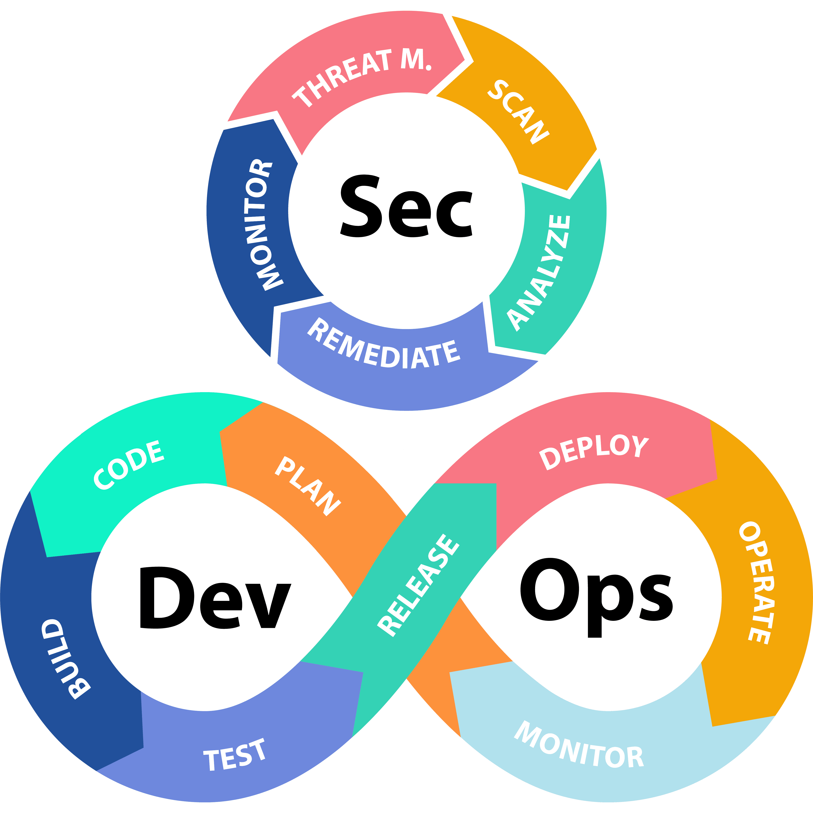
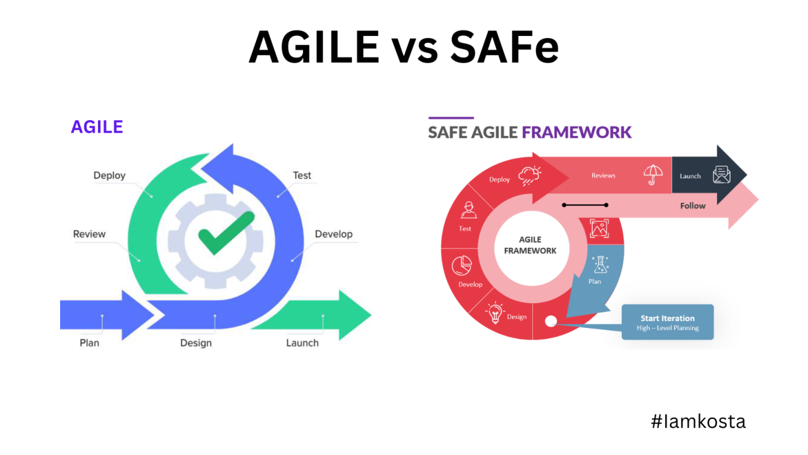
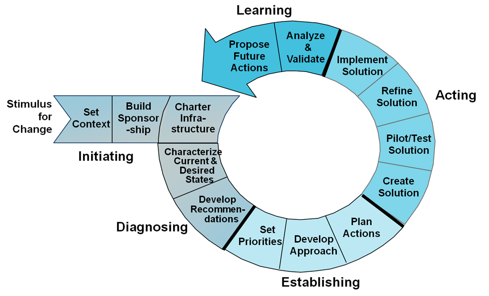
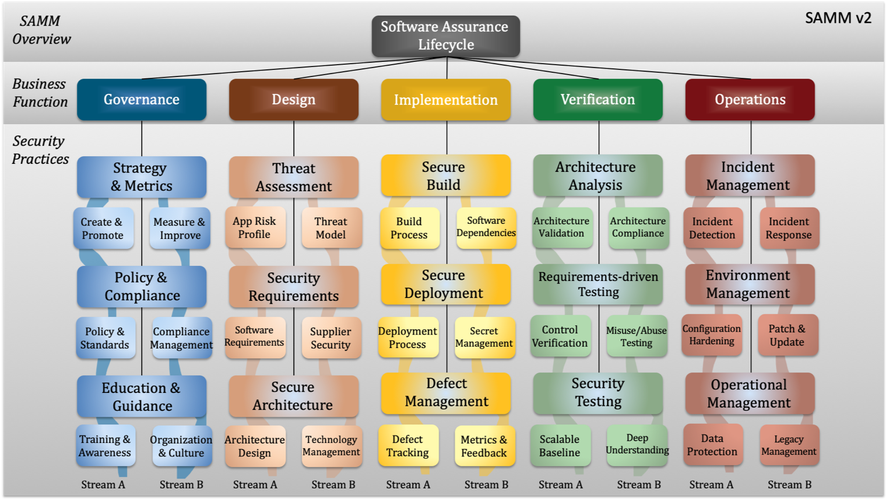
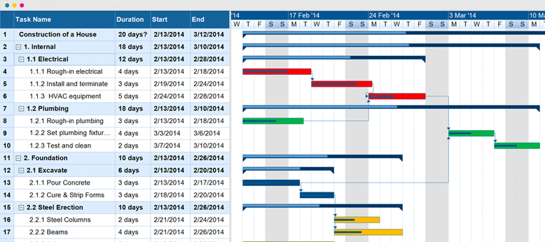
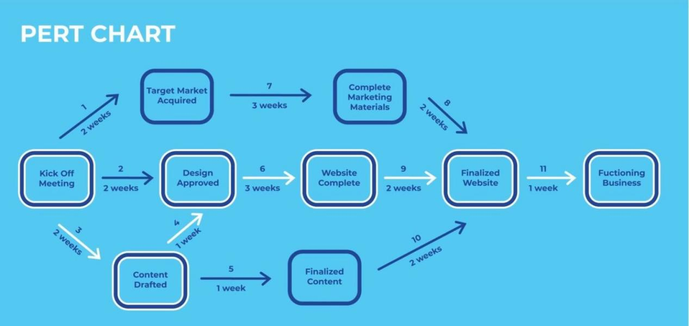
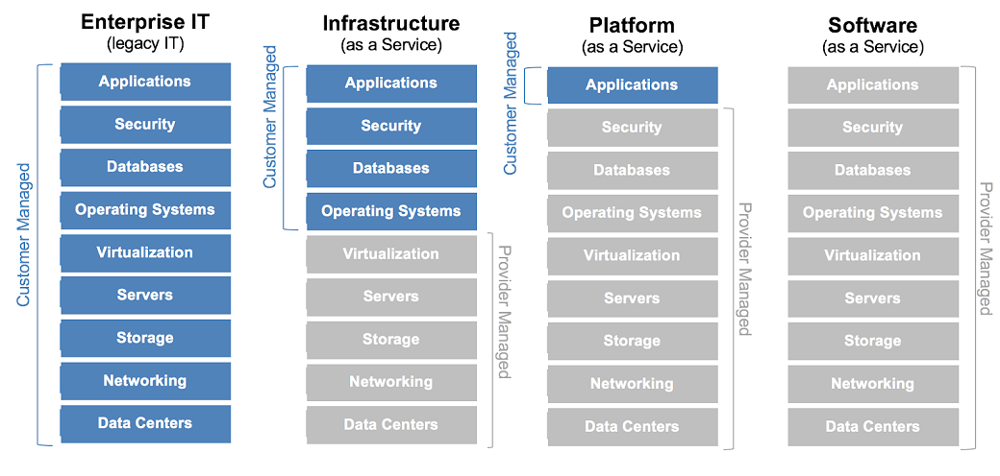

# Domain 8 - Software Development Security

## 8.1 - Understand and integrate security in the Software Development Life Cycle (SDLC)

### Development Methodologies

* [**Waterfall**](https://en.wikipedia.org/wiki/Waterfall_model)
  * created by Winston Royce back in the 1970s
  * one of the first comprehensive attempts to model software dev process while taking into account the necessity of returning to the previous phases to correct system faults
  * sequential development process that results in the development of a finished product
  * requires clear requirements, stable environment, low change
  * _feedback loop characteristics_
  * only allows developers to step back only one phase in the cycle
    * no provisions for discovery of errors at a later phase
  * improved by adding validation and verification steps to each phase (_modified_ waterfall)
    * **_Verification_**
      * evaluates the product against specifications
    * **_Validation_**
      * evaluates how well the product satisfies real-world requirements
    * 
  * 
* **Spiral**
  * created by Barry Boehm of TRW
  * designed to mitigate some of the disadvantages associated with the waterfall approach
    * allowing developers to return to the planning phases as the changing technical demands and customer requirements necessitate the evolution of the system
  * viewed as an iterative process that has four phases
  * known as the _metamodel_ or "model of models"
  * each loop of the the spiral results in the development of a new system prototype
  * waterfall process is applied to the development of each prototype, incrementally working toward a mature system that incorporates all the functional requirements in a fully validated fashion
  * 
* [**Agile**](https://en.wikipedia.org/wiki/Agile_software_development)
  * places an emphasis on the needs of the customer and quickly developing new functionality that meets those needs in an iterative fashion
  * began in the mid/late-1990s
  * builds on the concept of **_Integrated Product Teams_**
    * introduce by the DoD in 1995
    * approach that brought multifunctional teams together with a single goal of delivering a product or developing a process or policy
    * "setup to foster parallel, rather than sequential, decisions and to guarantee that all aspects of the product, process, or policy are considered throughout the development process"
  * philosophy (not a specific methodology)
  * rapid iteration, quick response to changing requirements
  * first described in the [Manifesto for Agile Software Development](http://agilemanifesto.org) in 2001
  * Core philosophical values
    * **Individuals and interactions** over process and tools
    * **Working software** over comprehensive documentation
    * **Customer collaboration** over contract negotiation
    * **Responding to change** over following a plan
  * Defines 12 principles that underlie the philosophy
    * Customer satisfaction by early and continuous delivery of valuable software.
    * Welcome changing requirements, even in late development.
    * Deliver working software frequently (weeks rather than months).
    * Close, daily cooperation between business people and developers.
    * Projects are built around motivated individuals, who should be trusted.
    * Face-to-face conversation is the best form of communication (co-location).
    * Working software is the primary measure of progress.
    * Sustainable development, able to maintain a constant pace.
    * Continuous attention to technical excellence and good design.
    * Simplicity—the art of maximizing the amount of work not done—is essential.
    * Best architectures, requirements, and designs emerge from self-organizing teams.
    * Regularly, the team reflects on how to become more effective, and adjusts accordingly.
  * Use [OWASP Cornicopia](https://owasp.org/www-project-cornucopia/) to help development teams to define security requirements
  * Specific methodologies build on Agile
    * Scrum
      * most popular
      * takes it name from daily meetings (scrums)
      * team meets daily to do the following:
        * discuss their contributions made by each member
        * plan the next day's work
        * work to clear any impediments to their progress
      * meets are held by a _scrum master_ (typically a PM) who is responsible for helping the team move forward and meet deadlines
      * organizes work in to sprints of activities
        * well-defined periods of time (2-4 weeks)
        * team focuses on achieving short-term objectives which are part of larger goals of the project
        * at the start of each sprint, the team gathers to plan the work
        * at the end of each sprint, the team should have a fully functioning product or feature that could be released (even if it doesnt meet all the requirements)
        * each new sprint introduces new functionality
    * Kanban
    * Lean
    * Rapid Application Development (RAD)
    * Agile Unified Process (AUP)
    * Dynamic System Development Model (DSDM)
    * Extreme Programming (XP)
  * 
* [**DevOps**](https://en.wikipedia.org/wiki/DevOps)
  * Seeks to unify software development, quality assurance, and technology operations, rather than allowing them to operate in separate silos
  * Aims to decrease time required to develop and deploy software changes - you might even deploy several times a day
  * Combination of _Development_ and _Operations_, symbolizing the merging of functions and cooperation
  * Closely aligned with the Agile development approach
  * use of _Continuous Integration (CI) / Continuous Delivery (CD)_
    * requires a high degree of automation including integrating code repositories, software configuration management process, and the release management (move code from dev, testing, and prod)
  * Resources
    * [The Pheonix Project: A Novel about IT, DevOps and Helping Your Business Win](https://github.com/ChrisNzoka/ChrisNzoka/blob/main/Books_and_Documents/The%20Phoenix%20Project%20_%20A%20Novel%20about%20IT%2C%20DevOps%2C%20and%20Helping%20Your%20Business%20Win%20(%20PDFDrive%20).pdf)
      * presents the case for DevOps and shares DevOps strategies in an entertaining, engaging, novel form
  
* [**DevSecOps**](https://www.redhat.com/en/topics/devops/what-is-devsecops)
  * integration of development, security, and operations
  * shift-left security
  * supports the concept of _software-defined security_
    * sec controls managed by code & integrated into the CI/CD workflow
  
* [**Scaled Agile Framework (SAFe)**](https://framework.scaledagile.com/)
  * comprehensive approach to applying agile principles and practices at the enterprise scale
  * offers a structure framework to facilitate the use of Agile across multiple teams, often coordinating with hundreds or thousands of practitioners
  * ensures team-alignment of activities and strategic goals
  * Four Configuration Levels:
    * (1) **Essential SAFe**
      * most basic configuration, follows traditional agile practices (like Scrum), and provides the core elements needed for scaling agile within a team or a single program
      * focuses on Agile Release Trains (ARTs), which are teams of agile teams working towards a common objective.
      * each program lasts around 8-12 weeks
    * (2) **Large Solution SAFe**
      * adds the ability to coordinate multiple ARTs and suppliers working on a large solution.
      * introduces concepts like Solution Trains and Solution Intent to manage the complexities of larger systems.
    * (3) **Portfolio SAFe**
      * configuration addresses the strategic and governance aspects of scaling agile across an organization
      * uses **_Lean Portfolio Management (LPM)_** which includes portfolio vision, strategy, and budgeting, ensuring alignment between the organization's strategic goals and its agile development efforts
        * minimal overhead, delivering maximum value
    * (4) **Full SAFe**
      * most comprehensive configuration, combining all the elements of Essential, Large Solution, and Portfolio SAFe
      * suitable for large enterprises with complex products and a need for alignment across all levels of the organization
  * Emphasis on aligning business goals with development activity
  * Introduces concepts like Epic, Capability, Feature, and Story to help break down and categorize task, ensuring every piece of work can be traced back to a larger objective
  * Core Principles:
    * (1) **Take an economic view**:
      * Making decisions based on economic considerations and understanding the cost of delay.
    * (2) **Apply systems thinking**:
      * Recognizing that the system as a whole is more important than individual parts.
    * (3) **Assume variability; preserve options**:
      * Embracing uncertainty and building flexibility into the development process.
    * (4) **Build incrementally with fast, integrated learning cycles**:
      * Utilizing short development cycles to validate assumptions and adapt quickly.
    * (5) **Base milestones on objective evaluation of working systems**:
      * Ensuring that progress is measured by tangible results and working software.
    * (6) **Visualize and limit work in progress (WIP)**:
      * Reducing bottlenecks and improving flow by managing the amount of work being done at any given time.
    * (7) **Apply cadence, synchronize with cross-domain planning**:
      * Using regular rhythms and coordinated planning to align efforts across different teams.
    * (8) **Unlock the intrinsic motivation of knowledge workers**:
      * Creating an environment that fosters autonomy, purpose, and mastery.
    * (9) **Decentralize decision-making**:
      * Empowering teams to make local decisions, while maintaining strategic alignment.
    * (10) **Organize around value**:
      * Structuring teams and workflows around delivering customer value.


### System / Software Maturity Models

* [**Capability Maturity Model (CMM)**](https://en.wikipedia.org/wiki/Capability_Maturity_Model)
  * introduced by the [Software Engineering Institute (SEI) at Carnegie Mellon University](https://www.sei.cmu.edu/)
  * also known as the _Software Capability Maturity Model (SW-CMM/SCMM)_
  * contends that all organizations engaged in software development move through a variety of maturity phases in sequential fashion
  * describes the principles and practices underlying software process maturity
  * intended to help organizations improve their maturity and quality of their software processes
  * quality of software relies on the quality of the process
  * does not explicitly address security, but security and dev teams should have it integrated throughout their processes
  * Stages
    * **_Level1: Initial_**
      * Organizations at this level operate with ad-hoc, often chaotic processes. Success depends on individual effort and heroics, with little standardization or predictability.
    * **_Level 2: Repeatable_**
      * Basic project management processes are established, and some level of tracking and control is present. Key areas like project planning, requirements management, and software quality assurance begin to be formalized.
    * **_Level 3: Defined_**
      * Standardized processes are documented and implemented throughout the organization. Focus is on peer reviews, training, and intergroup coordination to ensure consistency and quality.
    * **_Level 4: Managed_**
      * Organizations at this stage collect and analyze data to understand their processes. Quantitative metrics are used to manage and improve performance, and software quality management is emphasized.
    * **_Level 5: Optimizing_**
      * The focus shifts to continuous improvement. Organizations analyze defects, identify root causes, and implement preventative measures. They also focus on process change management and technology change management to stay ahead of the curve.
  * Largely superseded by _Capability Maturity Model Integration (CMMI)_
    uses the same five levels but calls Level 4 **_Quantitatively Managed_**
    * major difference is that CMM focuses on isolated processes and CMMI focuses on the integration among those processes

* [**IDEAL Model**](https://www.sei.cmu.edu/documents/3099/2001_017_001_23277.pdf)
  * also developed by the Software Engineering Institute and implements many of the SW-CMM attributes
  * used to guide individuals and teams through a structured approach to problem-solving, emphasizing both cognitive and metacognitive skills
  * Five Phases:
    * **_Identify_**
      * Recognize and define the problem or challenge.
Define: Clearly articulate the problem, understanding its nature and scope.
Explore: Generate and evaluate potential solutions.
Act: Implement the chosen solution.
Learn: Evaluate the outcome of the solution and learn from the experience for future problem-solving.

* **_Initiate_**
  * CMM phase - Initial
  * identify and define the business reasons for the process improvement
  * support is available/built for the initiative
  * appropriate infra is in place
* **_Diagnosing_**
  * CMM phase - Repeatable
  * engineers analyze the present state of the organization and make recommendations for change
* **_Establishing_**
  * CMM phase - Defined
  * takes the recommendations and builds a plan for improving process
* **_Acting_**
  * CMM phase - Managed
  * puts the plan in to motion
  * build, test, and refine solutions from the plans
* **_Learning_**
  * CMM phase - Optimizing
  * Learn lessons from implementing the above process improvements

* [**Software Assurance Maturity Model (SAMM)**](https://owasp.org/www-project-samm/)
  * open-source project maintained by OWASP
  * provides a framework for integrating security activities into the software development and maintenance process
  * offers organizations the ability to assess their maturity
  * Five Business Functions
    * **Governance**: This function focuses on the overall management of the security program. It includes defining security strategies, policies, and metrics, ensuring compliance with regulations, and providing education and guidance to staff. It is about maintaining a security-conscious culture across the organization.

    * **Design**: This function involves activities that ensure security is built into the application from the very beginning. Key practices include conducting threat assessments to identify and quantify risks, defining security requirements, and establishing a secure architecture for the software.

    * **Implementation**: This function covers the activities related to creating the software itself. It includes secure coding practices, managing the build process to prevent vulnerabilities, ensuring secure deployment, and managing defects found during development.

    * **Verification**: This function is about making sure the security controls and policies are working as intended. It includes various forms of testing and assessment, such as security testing (both automated and manual), architecture assessment, and requirements-driven testing to validate that security requirements have been met.

    * **Operations**: This function covers the post-deployment activities necessary to maintain the security of the application throughout its lifecycle. This includes managing security incidents, hardening the operating environment, and continuous monitoring to ensure the confidentiality, integrity, and availability of the application and its data.
  

### Project Management

* [**Gantt Charts**](https://en.wikipedia.org/wiki/Gantt_chart)
  * show interrelationships over time between projects and schedules
  * provides graphical illustration of a schedule that helps plan, coordinate, and track specific tasks in a project
  * useful when coordinating task that require the use of the same team members or other resources
  
* [**Program Evaluation Review Technique (PERT)**](https://en.wikipedia.org/wiki/Program_evaluation_and_review_technique)
  * project scheduling tool that relates estimated lowest possible size, most likely size, and highest possible size for each component.
  * calculates the Standard Deviation (SD) for risk assessment
  * clearly shows dependencies between project tasks
  * PMs use these estimates and dependencies to better manage time of resources and scheduling tasks
  * used to direct improvements to projects management and software coding in order to produce more efficient software (more improvement, smaller size of produced software)
  

### Change and Configuration Management

* aka Control Management
  * File Integrity monitoring tools allows for monitoring a system for modifications
* Changes should be centrally logged in a repository to support future auditing, investigation, troubleshooting, and analysis requirements
* Three Components:
  * **_Request Control_**
    * users can request modifications
    * managers can conduct cost/benefit analysis, and tasks can be prioritized
  * **_Change Control_**
    * developers try to re-create situation encountered by the user
    * implements an organized framework, and allows devs to test a solution before rolling it out
    * must conform to quality control restrictions, developing tools for update or change deployment, proper documentation of coded changes, and restricting the effects of new code to minimize diminishment of security
  * **_Release Control_**
    * changes are reviewed and approved, includes acceptance testing
    * all debugging code / backdoors are removed
    * promoted into production using release processes
* **_Software Configuration Management (SCM)_**
  * used to control the versions of software and track / control changes
  * **_Versioning_**
    * a labeling or numbering system that differentiates between different software sets and configurations across multiple machines or different points in time
    * example: first version is v1.0, first minor update version is v1.1, and after a major update the version is v2.0
  * Four Categories
    * **_Configuration Identification_**
      * admins document the configuration of covered software products throughout the organization
    * **_Configuration Control_**
      * ensures that changes to software versions are made in accordance with change control / management policies/procedures
      * update can be made only from authorized distributions in accordance with those policies/procedures
    * **_Configuration Status Accounting_**
      * formalized procedures are used to keep track f all authorized changes
    * **_Configuration Audit_**
      * periodic review/audit should be conducted to ensure that the actual production environment is consistent with the accounting records and that no unauthorized configuration changes have taken place

### Understanding Knowledge Based Systems

* **Expert Systems**
  * embody accumulated knowledge of experts
  * when properly developed and implemented, often make better decisions than some human counterparts when faced with routing decisions
  * Two core components:
    * **_Knowledge base_**
      * contains the rules known by an expert system
      * knowledge is codified in a series of “if/then” statements
      * often hundreds or thousands of assertions
    * **_Inference engine_**
      * examines information in the knowledge base to arrive at a decision
      * typically uses an interface to the inference engine with details about the current situation, and uses combination of logical reasoning and fuzzy logic techniques to draw a conclusion based on past experiences
  * Not infallible
  * only as good as the data in the KB (garbage in / garbage out)
  * decisions do not involve judgement clouded by emotion
  * useful in analyzing emergency events, stock trading, etc
* **Machine Learning**
  use analytic capabilities to develop knowledge from datasets without the direct application of human insight
  * allow computers to analyze and learn directly from data, developing and updating models of activity
  * ML Categories
    * **_Supervised Learning*_**
      * uses labeled data for training
      * provides a dataset with correct answers and allows the algo to develop a model that may then be applied to future cases
    * **_Unsupervised Learning_**
      * uses unlabeled data for training
      * dataset provided does not contain the "correct" answers
      * algo is asked to develop a model independently 
* **Neural Networks**
  * Chains of computational units used to attempt to imitate biological reasoning processes of the human mind
  * Extension of ML
  * often referred to as _Deep Learning_
  * many layers of summation, each requiring weighting information to reflect the relative importance of the calculation in the overall decision-making process
  * weight are custom-tailored for each type of decision
  * **_Delta rule_** - the ability to learn from experience

* Operation and maintenance
* Integrated Product Team

## 8.2 - Identify and apply security controls in software development ecosystems

### Software Development

* **Programming Languages**
  * [**_Binary code_**](https://en.wikipedia.org/wiki/Binary_code) - what computers understand, a series of 1s and 0s called machine language.
  * [**_Machine Code / Language_**](https://en.wikipedia.org/wiki/Machine_code)
    * instructions computers follow consisting of a long series of binary digits
    * each CPU has its own language
    * not human-readable
    * requires hardware-specific knowledge
  * [**_Assembly Language_**](https://en.wikipedia.org/wiki/Assembly_language)
    * higher-level alternative to _machine code_
    * use mnemonics to present the basic instruction set of a CPU
    * requires hardware-specific knowledge
    * requires a lot of tedious programming
      * adding two numbers can take up to six/seven lines of code

    The following example illustrates a simple hello world application in _Assembly_

      ```code
          section .data
          msg db 'Hello, World!', 0xA  ; Message string with a newline character (0xA)
          len equ $ - msg             ; Length of the message

      section .text
          global _start               ; Entry point for the program

      _start:
          ; System call to write to standard output (sys_write)
          mov eax, 4                  ; System call number for sys_write
          mov ebx, 1                  ; File descriptor for standard output (stdout)
          mov ecx, msg                ; Pointer to the message string
          mov edx, len                ; Length of the message
          int 0x80                    ; Call the kernel

          ; System call to exit the program (sys_exit)
          mov eax, 1                  ; System call number for sys_exit
          xor ebx, ebx                ; Exit code 0
          int 0x80                    ; Call the kernel
      ```

  * **_High level languages**_
    * Python, C++, Ruby, R, Java, Visual Basic
    * allow programmers to write instructions that are better approximates for human communication.
    * decreases the length to create applications
    * some are portable across OS and hardware systems/platforms
    * Several forms:
      * **Compiled languages**
        * C/C++, Java, FORTRAN use a compiler to convert the higher level language into an executable that the computer understands (OS/CPU specific)
        * **_Decompiler_** - convert the binary back to source code
        * **_Disassember_** - converts the binary back to machine-readable assembly language (an intermediate step during the compilation process)
        * Both _decompiler_ and _disassmebler_ tools are using in reverse engineering field (also in anti-malware analysis and competitive analysis)
        * [_Obsfuscation_](https://en.wikipedia.org/wiki/Obfuscation_(software))
          * practice of creating source or machine code that is intentionally difficult for humans or computers to understand
          * when decompilers/disassmblers try to retrieve the source code its entire unreadable
      * **Intermediate Language**
        * C#, VB source code is compiled into an intermediate language called Microsoft Intermediate Language (MSIL) or Common Intermediate Language (CIL).
        * Java: Java source code is compiled into Java bytecode.
        * Requires the use **_Runtime Environment_**'s
          * allows portable execution of compiled code across different OS
          * [Java Virtual Machine (JVM)](https://en.wikipedia.org/wiki/Java_virtual_machine)
            * well known type of runtime
            * installed on systems and may then rely on that runtime to execute compiled Java Code
          * [Common Language Runtime (CLR)](https://en.wikipedia.org/wiki/Common_Language_Runtime)
            * virtual machine component of Microsoft .NET Framework, manages the execution of .NET programs.
            * leverages [Just-in-time compilation](https://en.wikipedia.org/wiki/Just-in-time_compilation) which converts the managed code (compiled intermediate language code) into machine instructions which are then executed on the CPU of the computer.
            * **_CoreCLR_**
              * is the runtime environment for new .NET stack of languages
      * **_Interpreted Languages_**
        * Python, R, JavaScript, and VBScript are not compiled and run in their original versions.
        * uses an _interpreter_ to execute the source code stored on the system
    * Compiled code is generally less prone to third party manipulation, but it is easier to hide malicious code.
    * Compiled code is neither more nor less secure than interpreted.
    * Interpreted code is less prone to the undetected insertion of malicious code by the original programmer because the end user can view the source code in plain view and check for accuracy
    * Anyone that touches software has the ability to make modifications (good or bad)
* **Libraries**
  * shared packages that contain reusable code
  * perform a variety of functions (text manipulation to ML)
  * common way for developers to improve efficiency
  * many are open-source projects, while some are proprietary (commercially sold or maintained internally be a company)
  * commonly resulted in security issues
    * [Heartbleed Vulnerability - CVE-2014-0160](https://nvd.nist.gov/vuln/detail/cve-2014-0160)
      * well-known and damaging example of using shared libraries
      * OpenSSL is widely used implementation of SSL/TLS protocol and incorporated into thousands of systems
      * Heartbleed bug affected OpenSSL libraries, admins around the world had to scramble to identify and update OpenSSL installations
  * developers should be aware of the origins of their shared code and keep abreast of updates/security vulnerabilities in them
* **Developer Tools**
  * **_Software Development Toolkits_**
    * SDKs or devkits
    * collections of tools that help developers build software applications
    * typically include libraries, APIs, compilers, debuggers, and documentation, all tailored for a specific platform, operating system, or programming language
    * streamline the development process by providing pre-built functionalities and resources, allowing developers to create applications more efficiently.
  * **_Integrated Development Environment (IDE)_**
    * used to write code, test/debug it, and compile it (if applicable)
    * simplifies the integration of all these tasks
    * chose of IDE is a personal one
    * Examples of IDEs
      * [RStudio](https://posit.co/download/rstudio-desktop/) - open-source IDE used to writing R code
      * [Visual Studio](https://visualstudio.microsoft.com/) - used for .NET based systems
      * [JetBean's PyCharm](https://realpython.com/python-ides-code-editors-guide/#pycharm) - used to build python applications
* **Object Oriented Programming**
  * modern languages such as JAVA, C++, and .NET languages support the concept
  * Each object in the OOP model has methods that correspond to specific actions that can be taken on the object, and inherit methods from their parent class
  * Objects work together to provide a system's functionality or capabilities
  * OOP can be more reliable and able to reduce the propagation of program change errors
  * better suited for modeling or mimicking the real world
  * Objects being subclasses of other objects and inherit methods from their parent class
    * can use all the methods from their parent and add additional functions/capabilities
  * Provides a black-box approach to abstraction
    * users know the details of objects interface (but not the implementation details)
  * **_Encapsulation_**
    * self-contained objects that can only be accessed through specific messages (inputs)
  * Common Terms
    * **Message** - a communication to or input of an object
    * **Method** - internal code that defines the actions an object performs
    * **Behavior** - result of an object processing a method
    * **Class** - collection of common methods from a set of objects that defines behavior
    * **Instance** - objects are instances of a class
    * **Inheritance** - methods from a class are passed from a parent class to a child class
    * **Delegation** - forwarding a request by an object to another object
    * **Polymorphism** - the characteristic of an object that allows it to respond to different behaviors to the same message or method because of external condition changes
    * **Cohesion** - strength of the relationship between purposes of methods within the same class
    * **Coupling** - level of interaction between objects
    * **Assurance** - properly implementing security policy through lifecycle of the System (according to the Common Criteria in a government setting)

* **Avoiding and Mitigating System Failure**
  * Methods to Avoid Failure
    * **_Input Validation_**
      * when a user provides a value to be used in a program, make sure it falls within the expected parameters otherwise processing is stopped
        * _Limit checks_ are when you check that a value falls within an acceptable range
      * may also check for special characters such as a single quotation mark in an input text field (likely an indication of an attack)
        * may also transform the input to remove such special characters and replace them safe values (_escaping input_)
          * Escape Input example:
            * `<SCRIPT>alert('script executed')</SCRIPT>` when replaced looks like `&lt;SCRIPT&gt;alert('script executed')&lt;SCRIPT&gt;`
      * Should always occur on the server side of a transaction.
    * **_Authentication and Session Management_**
      * require that users authenticate, and developers should seek to integrate apps with organizations existing authentication systems (mfa)
        * if not then use externally developed and validated authentication libraries
      * Session tokens should expire, and cookies should only be transmitted over secure, encrypted channels.
    * **_Error handling_** - Errors should not expose sensitive internal information to attackers (disable debugging mode in production)
    * **_Logging_**
      * [OWASP Secure Coding Practices](https://owasp.org/www-project-secure-coding-practices-quick-reference-guide/) suggests logging these events:
        * Input validation failures
        * Authentication attempts and failures
        * Access control failures
        * Tampering attempts, including unexpected changes to state data
        * Use of invalid or expired session tokens
        * All system exceptions raised by the OS or applications
        * All administrative privilege usage (including security configuration settings) 
        * TLS failures, and cryptographic errors.
    * Failure Designs
      * [**Fail-Soft**](https://csrc.nist.gov/glossary/term/fail_soft)
        * allow a system to continue to operate after a component fails
        * alternative to having a complete failure event
        * example multitasking process where one process fails but other independent processes continue to operate (e.g. multitasking operation system)
        * users can bypass security controls
      * [**Fail-Secure**](https://csrc.nist.gov/glossary/term/fail_secure)
        * system is designed to fail with a high-level of security
        * A mode of termination of system functions that prevents loss of secure state when a failure occurs or is detected in the system (but the failure still might cause damage to some system resource or system entity)
        * designed as either _fail-safe_ or _fail-soft_
        * designed to protect assets in the physical world and protect confidentiality and integrity in the digital world
      * [**Fail-Safe**](https://csrc.nist.gov/glossary/term/fail_safe)
        * type of failure mode that prevents damage and reverts to a state that protects the health and safe of people
        * example fail-safe door will open easily in case of emergency to allow people to escape a building
        * context is different between physical and digital world
          * for example a firewall (if designed to fail-open) would allow communication to continue with out filtering
          * in contrast it designed with fail-safe/fail-closed/fail-secure solution then comms would be totally cut off sacrificing availabitly for condifidentiality/integrity
      * **Fail-Open**
        * related with _fail-soft_
        * protects availability
      * **Fail-Closed**
        * related with _fail-secure_
        * protects confidentiality & integrity
    * Software should revert to a fail-secure to prevent unauthorized access to information / resources
      * This is what a Windows Blue Screen of Death (BSOD) does, indicates a `STOP` error
        * _STOP_ error occurs when an undesirable activity occurs in spite of the OS's efforts to prevent it
    * Must balance security, functionality, user-friendliness.
    * Added security means increased cost, admin overhead, and reduce productivity/throughput
  
* **Security Controls**
  * **_Input Validation_**
    * input whitelisting / allowed inputs
    * input blacklisting / disallowed inputs
    * cleaning / encoding content
    * _metacharaters_
      * aka special characters `'[]\;&^$.|?*+{}().`
      * should be escaped as much as possible
    * **_Parameter Pollution_**
      * a web application vulnerability where an attacker exploits how a web application handles multiple HTTP parameters with the same name. By injecting encoded query string delimiters, attackers can potentially manipulate the application's logic, bypass input validation, and even gain unauthorized access.
  * Use a **_Web Application Firewall (WAF)_**
  * **_Database Security_**
    * **Parameterized Queries**
      * method of executing database queries where placeholders are used for values within the SQL statement, and the actual values are provided separately at execution time
      * offers significant advantages over directly embedding values into the query string, which is often referred to as dynamic SQL
      * Java uses teh `PreparedStatement()` function while PHP use the `bindParam()` function
    * **Stored Procedures**
      * prepared collection of SQL statements and control-flow logic that is stored and executed within a relational database management system (RDBMS).
      * functions as a subprogram that can be called and executed multiple times by applications or users
    * **Obfuscation and Camouflage**
      * protects against data exposure
      * **_Data Minimization_**
        * best defense
        * only collect what is required, avoid collecting sensitive information
        * reduces data exposure risks (no data no risk)
      * **_Tokenization_**
        * replaces personal identifiers that might directly reveal an identity with unique identifiers using a lookup table
        * loop up table must be secure
      * **_Hashing_**
        * irreversable one-way encryption
        * should use salting with a random value prior to hashing to make they resitent to rainbow table attacks

### Software Development Life Cycle

* Security should be planned and managed throughout the lifecycle
* Activities
  * **Conceptual Definition**
    * creating the basic concept statement for a system
    * Not longer than one or two paragraphs, and is agreed on by all interested stakeholders (developers, customers, and management)
    * High-Level abstract/intro summary
    * security requirements are high level
    * data classification is done for all data that will be processed by the system
  * **Functional Requirements Determination**
    * specific functionalities listed, devs start to think about how the parts of the system should interoperate
    * Major categories of a functional requirement to think about
      * **_Input(s)_** - data provided to a function
      * **_Behavior_** - business logic describing actions the systems should do with the inputs
      * **_Output(s)_** - data provided from a function
    * Stakeholders must agree to this, too, and this document should be often referred to.
    * Documentation is referred to through the rest of the life cycle (checklist)
  * **Control Specifications Development**
    * begins soon after _function requirements definitions_ and continues as the design and review phases progress
    * Consider access controls, how to maintain confidentiality, provide an audit trail and a detective mechanism for illegitimate activity.
    * Consider availability and fault-tolerance issues and address as corrective actions
    * Design security into a system should be done proactively (usually an afterthought and retrofited)
    * Sec Requirements should be revisited each time a significant change is made to the design specification
  * **Design Review**
    * often lengthy process
    * designers determine how part of the system interact and interoperate with each other
    * determine how modular the system structure should be and how it's laid out
    * formal designs are created and reviewed with stakeholders (sometimes also as part of an architecture review board) for agreement/approval
      * should include security professionals to review security controls in the design
  * **Coding**
    * software developers begin writing code
    * use secure software coding practices/principles
  * **Code Review Walk-Through**
    * Project Managers should schedule several code review walk-through meetings at various stages/milestones throughout the coding process
    * developers walk-through the code with peers looking for problems/issues in the logic flow or other design/security flaws
  * **System Test Review**
    * once coding is complete the system is deployed to a test environment where quality assurance team members, developers, and (sometimes) actual users perform testing / validation of the system using defined scenarios that model common and unusual user activities
    * Testing Types:
      * **_Functional Testing_**
        * verifies the system functions as expected
      * **_Security Testing_**
        * verifies the system functions as expected
      * **_Regression Testing_**
        * performed when a project is releasing updates to an existing system
        * verifies that the new code does not introduce new issues, performs similarly as the old code
        * should include functional and security testing that verifies there are no unaddressed significant flaws
      * **_User Acceptance Testing (UAT)_**
        * once developers and internal QA team are satisfied with their testing process/results it moves to actual users to validate the system to see if it meets their requirements and formally accept it as ready to move into production use
  * **Maintenance and Change Management**
    * ensure continued operation while requirements and systems change


* Application security testing (e.g., static application security testing (SAST), dynamic application security testing (DAST), software composition analysis, Interactive Application Security Test (IAST))


### Software Testing

* Software testing
  * best time to address testing is as the modules are designed
  * tests should be designed in parallel
  * **_Reasonableness check_**
    * Ensures the values returned by software match criteria, should be done via separation of duties
  * should also validate how the product handles valid vs invalid input data, incorrect types, out-of-range values, and other bounds and/or conditions
  * validate stress testing
  * validate any known use cases and _misuse cases_ (models the activity of an attacker)
* Testing Techniques:
  * **_White Box Testing_**
    * step through code line by line
    * knowledge of the system
  * **_Black Box Testing_**
    * from a user’s perspective
    * using a variety of input scenarios and inspecting output
    * no knowledge/access to the code
  * **_Gray Box Testing_**
    * Combine white and black
    * popular for software validation
    * no analyzing of inner workings of the program
  * **_Static Testing (SAST)_**
    * without running the code
    * usually integrated in CI/CD pipelines
  * **_Dynamic Testing (DAST)_**
    * done in a runtime environment
  
### Code Security

* **_Code Signing_**
  * confirms authenticity of developers code
  * use crypto function to digitally sign their code with their own private key, and then browsers can use the developers public key to verify that the signature is authentic
  * does guarantee it came from the original source
  * does not guarantee that their is no malicious code 
* **_Code Reuse_**
  * use of third-party libraries and SDKs
  * shared modules
  * libraries, sdks and modules should be scanned and vetted before integrating into any system code
* **_Code Repositories_**
  * central storage point for developers to collaborate on source code.
  * GitHub, BitBucket, SourForge 
  also provides bug tracking, webhosting, release management, and communications functions that support software development
    * often integrate with code management tools
      * `git tool`
  * should not store sensitive information (i.e, secrets, api keys, etc)
  * avoids _dead code_, in use code but no body owns it
  * follow proper release management
* **_Source Code Comments_**
  * proper code documentation that make it easy for anyone to understand what is happening
  * also helps onboard new members
* **_Error Handling_**
  * try/catch
  * logging errors minimizing in production environments (only log the exception message or custom message and not the stack trace or entire log)
* **_Memory Management_**
  * watch for _resource exhaustion_/_memory leaks_ of memory, storage, etc
  * _Pointers_
    * area of memory that stores an address of another location in memory
    * _Dereferening_ occurs when an application needs to access to the location of an object it follows the pointer and access teh memory referenced they the pointer address
    * _NULL_ pointer exception occurs when an application tries to dereference a pointer that is NULL

## 8.3 - Assess the effectiveness of software security

* Auditing and logging of changes
* Risk analysis and mitigation

## 8.4 - Assess security impact of acquired software

* **Commercial-off-the-shelf (COTS)**
  * software purchased to run on servers managed by the organization (on-prem or IaaS)
  * can be SaaS also
  * proper configuration
  * aware of security bulletins/patches/vulnerabilities
* **Open-Source Software (OSS)**
  * project freely available to download and use
  * organizations use a combo of COTS and OSS
  * proper configuration
  * aware of security bulletins/patches/vulnerabilities

### Cloud Services

* assets that use cloud computing
* referred to as "managed services"
* Cloud computing is referred to on-demand access to computing resources available from anywhere
* Cloud computing resources are highly available and easily scalable
* typically leased from outside the organization, but could also be hosted on-premises within an organization
  * those hosted outside the org are typically outside the direct control of the org making managing risk more difficult
* some provide only data storage and access
  * org must ensure that security controls are in place to prevent unauthorized access to the data
* [DoD's Cloud Computing Security Requirements Guide (CC SRG)](https://www.schellman.com/blog/cloud-compliance/dod-cloud-computing-security-requirements)
  * defines specific requirements for U.S. government agencies to follow when evaluating the use of cloud computing assets
  * document identifies computing requirements for assets labeled _Secret_ and below using six separate levels which are as followed:
  * **_Impact Levels_**
    * **Impact Level 1 (IL1)**
      * Not used in current CC SRG
      * This level was for non-critical public information, with a security baseline focused on basic availability.
      * No longer used because this type of data, which is publicly available, doesn't require a specific DoD authorization.
    * **Impact Level 2 (IL2)**
      * Data Types:
        * Non-critical Unclassified Information, and unclassified information that is approved for public release
        * It includes some low-confidentiality information that requires minimal access control
      * Security Requirements:
        * The security controls are based on the FedRAMP Moderate baseline.
        * A compromise would have a limited adverse effect on DoD operations.
    * **Impact Level 3 (IL3)**:
      * Not used in current CC SRG
      * This level was for Controlled Unclassified Information (CUI).
      * It has been consolidated into IL4 to streamline the framework and avoid a redundant authorization level.
    * **Impact Level 4 (IL4)**:
      * Data Types:
        * Controlled Unclassified Information (CUI) and other non-critical mission information. 
        * It includes data such as "For Official Use Only" (FOUO), Personally Identifiable Information (PII), and Protected Health Information (PHI).
      * Security Requirements:
        * IL4 requires a higher level of security than IL2.
        * It builds upon the FedRAMP Moderate baseline with additional DoD-specific security controls. 
        * The loss of data at this level could result in a serious adverse effect on operations.
    * **Impact Level 5 (IL5)**:
      * Data Types:
        * Higher-Sensitivity CUI and Mission-Critical Information, and National Security Systems (NSS).
      * Security Requirements:
        * IL5 mandates more stringent security controls for confidentiality, integrity, and availability. The security baseline is built on the FedRAMP High baseline, with additional DoD-specific controls and a higher emphasis on availability and integrity. A compromise would have a severe or catastrophic adverse effect.
    * **Impact Level 6 (IL6)**:
      * Data Types:
        * Classified Information up to Secret.
        * Highest level
        * Security Requirements:
          * IL6 requires the most rigorous security measures.
          * The cloud infrastructure must be dedicated and physically isolated from other cloud tenants. 
          * It must be a DoD-owned or operated environment, and personnel must have the appropriate security clearances. 
          * This level's security controls are based on the FedRAMP High baseline and the [CNSSI 1253 Classified Information Overlay](https://www.dcsa.mil/portals/91/documents/ctp/nao/CNSSI_No1253.pdf).
  * all data (at rest and in transit) should be encrypted
  * customer should manage encryption, including controlling all encryption keys (not vendor managed keys)
    * reduces the risk of insider threat (at the vendor) and supports data destruction using cryptographic erasure methods
* **Shared Responsibility Models**
  * aka shared fate
  * varying levels of maintenance and security responsibilities for assets, depending on the service model
    * includes maintaining the assets, ensuring that they remain functional and keeping the systems and applications up-to-date with current patches
  
  * **_Software as a Service (SaaS)_**
    * provides fully function enterprise applications accessible via web browser (Gmail)
    * vendor is responsible to all maintenance of the SaaS services
    * comes with share responsibilities for data and applications
    * customers may make configuration changes
    * customers share responsibility for keeping the data security at rest and in transmit (TLS)
  * **_Infrastructure as a Service (IaaS)_**
    * provides basic computing resources to customers
    * includes servers, storage, and networking resources
    * customers install OS's and applications and perform all required maintenance on the OS and applications
    * vendor maintains the cloud-based infrastructure (host), ensuring the customers have access to the leased systems
  * **_Platform as a Service (PaaS)_**
    * provides consumers with a computing platform
      * including hardware, OS, and a runtime environment
    * runtime environment includes programming languages, libraries, services, and other tools tools supported by the vendor
    * customers deploy, manage, and modify applications and configurations settings on the host
    * vendor is responsible for maintenance of the host and the underlying cloud infra
* **NIST Publications**
  * [NIST SP 800-144 - Guidelines on Security and Privacy in Public Cloud Computing](https://csrc.nist.gov/pubs/sp/800/144/final)
    * provides in-depth analysis on security issues and guidance related to computing
  * [NIST SP 800-145 - The NIST Definition of Cloud Computing](https://csrc.nist.gov/pubs/sp/800/145/final)
    * provides standard definitions for many cloud-based services
    * includes definitions for service models (SaaS, IaaS, PaaS) and deployment model definitions (public, private, community, and hybrid)
* **Deployment Models**
  * **_Public Cloud_**
    * model includes assets available for any consumers to rent or lease and is hosted by an external CSP/vendor
    * service level agreement can effectively ensure that the CSP provides the cloud-based services at a level acceptable to the organization
    * customers and csp's have a shared responsibility/share fate
    * maintenance requirements are typically split based on the service model (SaaS, PaaS, IaaS)
  * **_Private Cloud_**
    * model is used for cloud-based assets for a single organization
    * org can create and host private clouds using their own on-premises resources
    * org is responsible for any and all maintenance
    * org can also rent resources from a third-party for exclusive use of their org
      * maintenance requirements are typically split based on the service model (SaaS, PaaS, IaaS)
  * **_Community Cloud_**
    * provides cloud-based assets to two or more organizations that have a shared concern
      * such as a similar mission, security requirements, policy, or compliance considerations
    * assets can be owned/managed by one or more of the organizations
    * maintenance responsibilities are share based on who is hosting the assets and the service models in use
  * **_Hybrid Cloud_**
    * includes a combination of two or more clouds that are bound together by a technology that provides data and application portability
    * maintenance responsibilities are share based on who is hosting the assets and the service models in use
* **Managed Security Service Provider (MSSP)**
  * third-party (often cloud-based) services that provide remote oversight and management of on-prem IT or Cloud IT
  * some are general purpose or focused on specific IT area (security, etc)
  * some are vertical focused also (legal, medical, fin, gov, etc)
  * _Security-as-a-Service (SECaaS)_
    * various forms of security solutions/services being offered through cloud solutions
    * SIEM/SOAR, MDR/XDR, IDS/IPS, etc
* **Rapid Elasticity and Scalability**
  * Elasticity
    * ability of a system to **automatically expand and contract rapidly**
    * Closely related to Scalability
    * Scale-in / Scale-out capacity on demand
  * Scalability
    * ability of a system to handle growth of users or work
    * Ability to grow as demand increases
    * requires system shutdonw
    * Two types:
      * Horizontal
        * Adding more services to the pool to meet deman
          * More VMs, pods, etc
          * Load balancing plays a part in this mechanism to distribute load
      * Vertical
        * Adding more resources (CPU, RAM, Storage,etc) to existing resources (i.e. VMs)
* [**Software-Defined Data Center (SDDC)**](https://en.wikipedia.org/wiki/Software-defined_data_center)
  * aka _Services integration_, _Cloud integration_, systems integration_, and _integration platform_
  * design and architecture of an IT/IS solution that stitches together elements from on-premises and cloud sources into a seamless productive environment
  * goals of service integration are to eliminate data silos, expand access, claify processing visibility, and improve functional connectivity of on-site and off-site resources
  * include Software-Defined Networking, Software-Defined Storage, computing resources, and management/automation processes
* **Serverless Architecture**
  * cloud computing concept where code is managed by the customer and the platform or server is managed by the CSP/Vendor
  * physical server runs the code, but the execution model allows the software designer/developer/architect to focus on the logic and the hosting is abstracted away
  * aka _Function-as-a-Service (FaaS)_
  * typically triggered and run until completed

## 8.5 - Define and apply secure coding guidelines and standards

### Security of Application Programming Interfaces (API)

* APIs allow websites (and developers) to interact with each other by bypassing traditional webpages and interacting with the underlying service.
* Security Concerns
  * May have authentication requirements
    * API Keys or MTLs
* `curl`
  * open-source tool for major os
  * used to directly access websites without the use of a browser
  * commonly used for api testing (and potential api exploits by an attacker)
  * Example:
  ```bash
  curl -H "Content-Type: application/json" -X POST -d '{"week": 10, "hrv": 80, "sleephrs": 9, "sleepquality": 2, "stress": 3, "paxid": 1}' https://prod.myapi.com/v1
  ```

* Security weaknesses and vulnerabilities at the source-code level

* Secure coding practices
* Software-defined security
