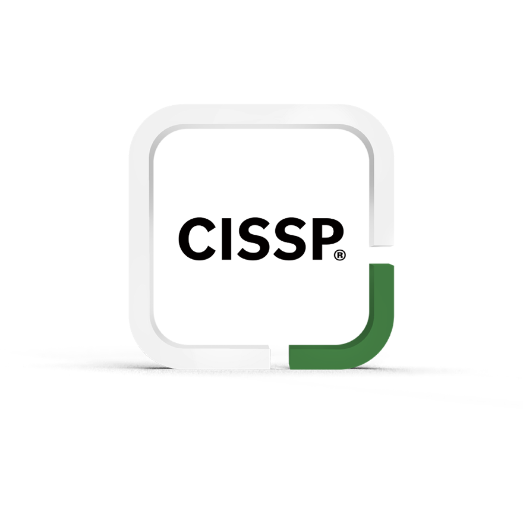

# About Certified Cloud Security Professional Certification

(ISC)2 developed the Certified Cloud Security Professional (CCSP) credential to ensure that cloud security professionals have the required knowledge, skills, and abilities in cloud security design, implementation, architecture, operations, controls, and compliance with regulatory frameworks. A CCSP applies information
security expertise to a cloud computing environment and demonstrates competence in cloud security architecture, design, operations, and service orchestration. 

This professional competence is measured against
a globally recognized body of knowledge. The topics included in the CCSP Common Body of Knowledge (CBK) ensure its relevancy across all disciplines in the field of cloud security. Successful candidates are competent in the following six domains:
1. [Security and Risk Management]()
2. [Asset Security]()
3. [Security Architecture and Engineering]()
4. [Communication and Network Security]() 
5. [Identity and Access Management (IAM)]()
6. [Security Assessment and Testing]()
7. [Security Operations]()  
8. [Software Development Security]() 

# CISSP Examiniation Weights

| Domains | Average Weight |
| --------- | ----------|
| 1. Security and Risk Management           | 16% |
| 2. Asset Security | 10% |
| 3. Security Architecture and Engineering  | 13% |
| 4. Communication and Network Security     | 13% |
| 5. Identity and Access Management (IAM)   | 13% |
| 6. Security Assessment and Testing        | 13% |
| 7. Security Operations                    | 13% |
| 8. Software Development Security          | 10% |
| TOTAL                                     | 100% |
